<!-- README.md is generated from README.Rmd. Please edit that file -->

# PlotFTIR 

([Français](#introduction-et-installation))

<!-- badges: start -->

[](https://github.com/NRCan/PlotFTIR/actions/workflows/R-CMD-check.yaml)
[](https://lifecycle.r-lib.org/articles/stages.html#stable)
[](https://coveralls.io/github/NRCan/PlotFTIR)
[](https://cran.r-project.org/package=PlotFTIR)
<!-- badges: end -->

## Introduction and Installation

The goal of `PlotFTIR` is to easily and quickly kick-start the
production of journal-quality Fourier Transform Infra-Red (FTIR)
spectral plots in R using ggplot2. The produced plots can be published
directly or further modified by ggplot2 functions.

You can install the development version of `PlotFTIR` from
[GitHub](https://github.com/) with:

``` r
# install.packages("devtools")
devtools::install_github("NRCan/PlotFTIR")

library(PlotFTIR)
```

## Example Plots

This is a basic example which shows you how to plot a prepared set of
FTIR spectra:

``` r
biodiesel_plot <- plot_ftir(biodiesel)
biodiesel_plot
```

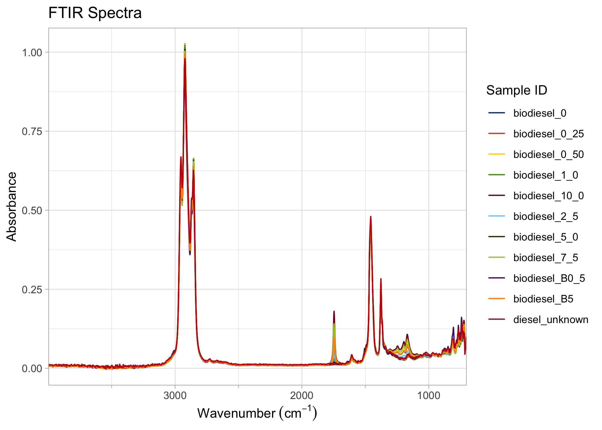

You can inspect the structure of your data using the print method:

``` r
print(biodiesel)
#>       wavenumber absorbance      sample_id
#> 1       700.7395   0.072530    biodiesel_0
#> 2       702.6032   0.065398    biodiesel_0
#> 3       704.4669   0.063371    biodiesel_0
#> 4       706.3305   0.059454    biodiesel_0
#> 5       708.1942   0.058133    biodiesel_0
#> 6       710.0579   0.056636    biodiesel_0
#> 7       711.9215   0.059226    biodiesel_0
#> 8       713.7852   0.065355    biodiesel_0
#> 9       715.6489   0.072895    biodiesel_0
#> 10      717.5125   0.085914    biodiesel_0
#> 11      719.3762   0.106253    biodiesel_0
#> 12      721.2399   0.117385    biodiesel_0
#> 13      723.1035   0.119001    biodiesel_0
#> 14      724.9672   0.113900    biodiesel_0
#> 15      726.8309   0.106609    biodiesel_0
#> 16      728.6945   0.100517    biodiesel_0
#> 17      730.5582   0.092363    biodiesel_0
#> 18      732.4219   0.085628    biodiesel_0
#> 19      734.2856   0.086327    biodiesel_0
#> 20      736.1492   0.091503    biodiesel_0
#> 21      738.0129   0.100769    biodiesel_0
#> 22      739.8766   0.105948    biodiesel_0
#> 23      741.7402   0.103693    biodiesel_0
#> 24      743.6039   0.092082    biodiesel_0
#> 25      745.4676   0.084121    biodiesel_0
#> 26      747.3312   0.080604    biodiesel_0
#> 27      749.1949   0.079663    biodiesel_0
#> 28      751.0586   0.078715    biodiesel_0
#> 29      752.9222   0.077431    biodiesel_0
#> 30      754.7859   0.073920    biodiesel_0
#> 31      756.6496   0.069966    biodiesel_0
#> 32      758.5132   0.067876    biodiesel_0
#> 33      760.3769   0.070447    biodiesel_0
#> 34      762.2406   0.076655    biodiesel_0
#> 35      764.1043   0.085879    biodiesel_0
#> 36      765.9679   0.090230    biodiesel_0
#> 37      767.8316   0.088118    biodiesel_0
#> 38      769.6953   0.081623    biodiesel_0
#> 39      771.5589   0.076532    biodiesel_0
#> 40      773.4226   0.070938    biodiesel_0
#> 41      775.2863   0.068564    biodiesel_0
#> 42      777.1499   0.069291    biodiesel_0
#> 43      779.0136   0.068799    biodiesel_0
#> 44      780.8773   0.067400    biodiesel_0
#> 45      782.7409   0.062821    biodiesel_0
#> 46      784.6046   0.054908    biodiesel_0
#> 47      786.4683   0.050444    biodiesel_0
#> 48      788.3320   0.049085    biodiesel_0
#> 49      790.1956   0.047736    biodiesel_0
#> 50      792.0593   0.047030    biodiesel_0
#> 51      793.9230   0.047467    biodiesel_0
#> 52      795.7866   0.048832    biodiesel_0
#> 53      797.6503   0.052590    biodiesel_0
#> 54      799.5140   0.058532    biodiesel_0
#> 55      801.3776   0.067331    biodiesel_0
#> 56      803.2413   0.075577    biodiesel_0
#> 57      805.1050   0.079182    biodiesel_0
#> 58      806.9686   0.076554    biodiesel_0
#> 59      808.8323   0.072891    biodiesel_0
#> 60      810.6960   0.071734    biodiesel_0
#> 61      812.5596   0.071947    biodiesel_0
#> 62      814.4233   0.070807    biodiesel_0
#> 63      816.2870   0.067176    biodiesel_0
#> 64      818.1507   0.061643    biodiesel_0
#> 65      820.0143   0.057250    biodiesel_0
#> 66      821.8780   0.054657    biodiesel_0
#> 67      823.7417   0.051325    biodiesel_0
#> 68      825.6053   0.046756    biodiesel_0
#> 69      827.4690   0.043988    biodiesel_0
#> 70      829.3327   0.043074    biodiesel_0
#> 71      831.1963   0.042884    biodiesel_0
#> 72      833.0600   0.043349    biodiesel_0
#> 73      834.9237   0.043089    biodiesel_0
#> 74      836.7873   0.041970    biodiesel_0
#> 75      838.6510   0.042397    biodiesel_0
#> 76      840.5147   0.044466    biodiesel_0
#> 77      842.3784   0.047256    biodiesel_0
#> 78      844.2420   0.049847    biodiesel_0
#> 79      846.1057   0.053657    biodiesel_0
#> 80      847.9694   0.055470    biodiesel_0
#> 81      849.8330   0.051664    biodiesel_0
#> 82      851.6967   0.047709    biodiesel_0
#> 83      853.5604   0.045981    biodiesel_0
#> 84      855.4240   0.043898    biodiesel_0
#> 85      857.2877   0.042695    biodiesel_0
#> 86      859.1514   0.043269    biodiesel_0
#> 87      861.0150   0.043986    biodiesel_0
#> 88      862.8787   0.043877    biodiesel_0
#> 89      864.7424   0.044805    biodiesel_0
#> 90      866.6060   0.045237    biodiesel_0
#> 91      868.4697   0.045422    biodiesel_0
#> 92      870.3334   0.045897    biodiesel_0
#> 93      872.1971   0.045778    biodiesel_0
#> 94      874.0607   0.046085    biodiesel_0
#> 95      875.9244   0.046164    biodiesel_0
#> 96      877.7881   0.046571    biodiesel_0
#> 97      879.6517   0.046763    biodiesel_0
#> 98      881.5154   0.045537    biodiesel_0
#> 99      883.3791   0.044703    biodiesel_0
#> 100     885.2427   0.045204    biodiesel_0
#> 101     887.1064   0.046150    biodiesel_0
#> 102     888.9701   0.046737    biodiesel_0
#> 103     890.8337   0.046695    biodiesel_0
#> 104     892.6974   0.045759    biodiesel_0
#> 105     894.5611   0.043771    biodiesel_0
#> 106     896.4247   0.041436    biodiesel_0
#> 107     898.2884   0.039699    biodiesel_0
#> 108     900.1521   0.038226    biodiesel_0
#> 109     902.0158   0.037169    biodiesel_0
#> 110     903.8794   0.036704    biodiesel_0
#> 111     905.7431   0.036124    biodiesel_0
#> 112     907.6068   0.036029    biodiesel_0
#> 113     909.4704   0.036956    biodiesel_0
#> 114     911.3341   0.037498    biodiesel_0
#> 115     913.1978   0.037310    biodiesel_0
#> 116     915.0614   0.037986    biodiesel_0
#> 117     916.9251   0.039154    biodiesel_0
#> 118     918.7888   0.040016    biodiesel_0
#> 119     920.6524   0.039436    biodiesel_0
#> 120     922.5161   0.038164    biodiesel_0
#> 121     924.3798   0.037380    biodiesel_0
#> 122     926.2435   0.037047    biodiesel_0
#> 123     928.1071   0.037043    biodiesel_0
#> 124     929.9708   0.037933    biodiesel_0
#> 125     931.8345   0.038918    biodiesel_0
#> 126     933.6981   0.039440    biodiesel_0
#> 127     935.5618   0.039633    biodiesel_0
#> 128     937.4255   0.040386    biodiesel_0
#> 129     939.2891   0.040814    biodiesel_0
#> 130     941.1528   0.040388    biodiesel_0
#> 131     943.0165   0.039716    biodiesel_0
#> 132     944.8801   0.039530    biodiesel_0
#> 133     946.7438   0.039751    biodiesel_0
#> 134     948.6075   0.039076    biodiesel_0
#> 135     950.4711   0.038540    biodiesel_0
#> 136     952.3348   0.038603    biodiesel_0
#> 137     954.1985   0.039242    biodiesel_0
#> 138     956.0622   0.040010    biodiesel_0
#> 139     957.9258   0.040260    biodiesel_0
#> 140     959.7895   0.040343    biodiesel_0
#> 141     961.6532   0.040946    biodiesel_0
#> 142     963.5168   0.041848    biodiesel_0
#> 143     965.3805   0.042273    biodiesel_0
#> 144     967.2442   0.041410    biodiesel_0
#> 145     969.1078   0.040948    biodiesel_0
#> 146     970.9715   0.041304    biodiesel_0
#> 147     972.8352   0.040761    biodiesel_0
#> 148     974.6988   0.038954    biodiesel_0
#> 149     976.5625   0.037724    biodiesel_0
#> 150     978.4262   0.036695    biodiesel_0
#> 151     980.2899   0.035802    biodiesel_0
#> 152     982.1535   0.035084    biodiesel_0
#> 153     984.0172   0.034534    biodiesel_0
#> 154     985.8809   0.034183    biodiesel_0
#> 155     987.7445   0.034142    biodiesel_0
#> 156     989.6082   0.034175    biodiesel_0
#> 157     991.4719   0.033670    biodiesel_0
#> 158     993.3355   0.033543    biodiesel_0
#> 159     995.1992   0.034207    biodiesel_0
#> 160     997.0629   0.034928    biodiesel_0
#> 161     998.9265   0.035376    biodiesel_0
#> 162    1000.7902   0.035480    biodiesel_0
#> 163    1002.6539   0.035654    biodiesel_0
#> 164    1004.5175   0.035447    biodiesel_0
#> 165    1006.3812   0.035029    biodiesel_0
#> 166    1008.2449   0.034765    biodiesel_0
#> 167    1010.1086   0.034906    biodiesel_0
#> 168    1011.9722   0.034950    biodiesel_0
#> 169    1013.8359   0.034998    biodiesel_0
#> 170    1015.6996   0.034814    biodiesel_0
#> 171    1017.5632   0.035200    biodiesel_0
#> 172    1019.4269   0.036455    biodiesel_0
#> 173    1021.2906   0.037187    biodiesel_0
#> 174    1023.1542   0.036743    biodiesel_0
#> 175    1025.0179   0.036396    biodiesel_0
#> 176    1026.8816   0.036876    biodiesel_0
#> 177    1028.7452   0.038023    biodiesel_0
#> 178    1030.6089   0.039102    biodiesel_0
#> 179    1032.4726   0.039158    biodiesel_0
#> 180    1034.3362   0.038505    biodiesel_0
#> 181    1036.1999   0.038070    biodiesel_0
#> 182    1038.0636   0.037830    biodiesel_0
#> 183    1039.9273   0.037029    biodiesel_0
#> 184    1041.7909   0.036342    biodiesel_0
#> 185    1043.6546   0.035589    biodiesel_0
#> 186    1045.5183   0.034427    biodiesel_0
#> 187    1047.3819   0.033917    biodiesel_0
#> 188    1049.2456   0.033659    biodiesel_0
#> 189    1051.1093   0.033486    biodiesel_0
#> 190    1052.9729   0.033484    biodiesel_0
#> 191    1054.8366   0.033729    biodiesel_0
#> 192    1056.7003   0.034044    biodiesel_0
#> 193    1058.5639   0.034114    biodiesel_0
#> 194    1060.4276   0.034443    biodiesel_0
#> 195    1062.2913   0.035111    biodiesel_0
#> 196    1064.1550   0.034912    biodiesel_0
#> 197    1066.0186   0.034292    biodiesel_0
#> 198    1067.8823   0.034108    biodiesel_0
#> 199    1069.7460   0.034141    biodiesel_0
#> 200    1071.6096   0.034044    biodiesel_0
#> 201    1073.4733   0.033924    biodiesel_0
#> 202    1075.3370   0.033930    biodiesel_0
#> 203    1077.2006   0.033869    biodiesel_0
#> 204    1079.0643   0.033523    biodiesel_0
#> 205    1080.9280   0.032813    biodiesel_0
#> 206    1082.7916   0.032198    biodiesel_0
#> 207    1084.6553   0.031782    biodiesel_0
#> 208    1086.5190   0.031354    biodiesel_0
#> 209    1088.3826   0.031011    biodiesel_0
#> 210    1090.2463   0.030817    biodiesel_0
#> 211    1092.1100   0.030975    biodiesel_0
#> 212    1093.9737   0.030736    biodiesel_0
#> 213    1095.8373   0.030140    biodiesel_0
#> 214    1097.7010   0.029685    biodiesel_0
#> 215    1099.5647   0.029143    biodiesel_0
#> 216    1101.4283   0.028321    biodiesel_0
#> 217    1103.2920   0.028463    biodiesel_0
#> 218    1105.1557   0.028553    biodiesel_0
#> 219    1107.0193   0.027796    biodiesel_0
#> 220    1108.8830   0.027469    biodiesel_0
#> 221    1110.7467   0.027322    biodiesel_0
#> 222    1112.6103   0.027130    biodiesel_0
#> 223    1114.4740   0.026783    biodiesel_0
#> 224    1116.3377   0.026512    biodiesel_0
#> 225    1118.2014   0.026920    biodiesel_0
#> 226    1120.0650   0.027344    biodiesel_0
#> 227    1121.9287   0.027545    biodiesel_0
#> 228    1123.7924   0.027600    biodiesel_0
#> 229    1125.6560   0.028181    biodiesel_0
#> 230    1127.5197   0.028816    biodiesel_0
#> 231    1129.3834   0.029126    biodiesel_0
#> 232    1131.2470   0.029522    biodiesel_0
#> 233    1133.1107   0.030196    biodiesel_0
#> 234    1134.9744   0.030973    biodiesel_0
#> 235    1136.8380   0.031292    biodiesel_0
#> 236    1138.7017   0.031265    biodiesel_0
#> 237    1140.5654   0.031842    biodiesel_0
#> 238    1142.4290   0.032639    biodiesel_0
#> 239    1144.2927   0.033299    biodiesel_0
#> 240    1146.1564   0.033805    biodiesel_0
#> 241    1148.0201   0.034698    biodiesel_0
#> 242    1149.8837   0.035407    biodiesel_0
#> 243    1151.7474   0.036188    biodiesel_0
#> 244    1153.6111   0.037169    biodiesel_0
#> 245    1155.4747   0.037747    biodiesel_0
#> 246    1157.3384   0.037732    biodiesel_0
#> 247    1159.2021   0.037056    biodiesel_0
#> 248    1161.0657   0.036226    biodiesel_0
#> 249    1162.9294   0.035801    biodiesel_0
#> 250    1164.7931   0.035948    biodiesel_0
#> 251    1166.6567   0.036494    biodiesel_0
#> 252    1168.5204   0.037036    biodiesel_0
#> 253    1170.3841   0.036223    biodiesel_0
#> 254    1172.2477   0.033739    biodiesel_0
#> 255    1174.1114   0.031111    biodiesel_0
#> 256    1175.9751   0.029411    biodiesel_0
#> 257    1177.8388   0.028638    biodiesel_0
#> 258    1179.7024   0.028073    biodiesel_0
#> 259    1181.5661   0.027602    biodiesel_0
#> 260    1183.4298   0.026940    biodiesel_0
#> 261    1185.2934   0.026510    biodiesel_0
#> 262    1187.1571   0.026508    biodiesel_0
#> 263    1189.0208   0.026595    biodiesel_0
#> 264    1190.8844   0.026257    biodiesel_0
#> 265    1192.7481   0.025813    biodiesel_0
#> 266    1194.6118   0.025877    biodiesel_0
#> 267    1196.4754   0.025990    biodiesel_0
#> 268    1198.3391   0.026225    biodiesel_0
#> 269    1200.2028   0.026338    biodiesel_0
#> 270    1202.0665   0.026348    biodiesel_0
#> 271    1203.9301   0.026564    biodiesel_0
#> 272    1205.7938   0.026922    biodiesel_0
#> 273    1207.6575   0.027495    biodiesel_0
#> 274    1209.5211   0.027891    biodiesel_0
#> 275    1211.3848   0.027979    biodiesel_0
#> 276    1213.2485   0.027715    biodiesel_0
#> 277    1215.1121   0.027506    biodiesel_0
#> 278    1216.9758   0.027493    biodiesel_0
#> 279    1218.8395   0.027634    biodiesel_0
#> 280    1220.7031   0.027517    biodiesel_0
#> 281    1222.5668   0.027319    biodiesel_0
#> 282    1224.4305   0.027307    biodiesel_0
#> 283    1226.2941   0.027449    biodiesel_0
#> 284    1228.1578   0.027450    biodiesel_0
#> 285    1230.0215   0.027628    biodiesel_0
#> 286    1231.8852   0.027846    biodiesel_0
#> 287    1233.7488   0.028120    biodiesel_0
#> 288    1235.6125   0.028725    biodiesel_0
#> 289    1237.4762   0.029452    biodiesel_0
#> 290    1239.3398   0.030212    biodiesel_0
#> 291    1241.2035   0.030851    biodiesel_0
#> 292    1243.0672   0.031455    biodiesel_0
#> 293    1244.9308   0.032348    biodiesel_0
#> 294    1246.7945   0.033226    biodiesel_0
#> 295    1248.6582   0.033675    biodiesel_0
#> 296    1250.5218   0.033873    biodiesel_0
#> 297    1252.3855   0.034051    biodiesel_0
#> 298    1254.2492   0.034080    biodiesel_0
#> 299    1256.1129   0.034074    biodiesel_0
#> 300    1257.9765   0.034567    biodiesel_0
#> 301    1259.8402   0.035495    biodiesel_0
#> 302    1261.7039   0.036033    biodiesel_0
#> 303    1263.5675   0.036081    biodiesel_0
#> 304    1265.4312   0.036254    biodiesel_0
#> 305    1267.2949   0.036911    biodiesel_0
#> 306    1269.1585   0.037207    biodiesel_0
#> 307    1271.0222   0.037308    biodiesel_0
#> 308    1272.8859   0.037695    biodiesel_0
#> 309    1274.7495   0.037943    biodiesel_0
#> 310    1276.6132   0.038153    biodiesel_0
#> 311    1278.4769   0.038458    biodiesel_0
#> 312    1280.3405   0.038879    biodiesel_0
#> 313    1282.2042   0.039149    biodiesel_0
#> 314    1284.0679   0.039435    biodiesel_0
#> 315    1285.9316   0.040202    biodiesel_0
#> 316    1287.7952   0.041196    biodiesel_0
#> 317    1289.6589   0.041654    biodiesel_0
#> 318    1291.5226   0.042370    biodiesel_0
#> 319    1293.3862   0.043526    biodiesel_0
#> 320    1295.2499   0.044663    biodiesel_0
#> 321    1297.1136   0.045910    biodiesel_0
#> 322    1298.9772   0.046943    biodiesel_0
#> 323    1300.8409   0.047733    biodiesel_0
#> 324    1302.7046   0.048243    biodiesel_0
#> 325    1304.5682   0.048460    biodiesel_0
#> 326    1306.4319   0.048438    biodiesel_0
#> 327    1308.2956   0.048323    biodiesel_0
#> 328    1310.1592   0.047731    biodiesel_0
#> 329    1312.0229   0.046391    biodiesel_0
#> 330    1313.8866   0.045449    biodiesel_0
#> 331    1315.7503   0.044833    biodiesel_0
#> 332    1317.6139   0.044220    biodiesel_0
#> 333    1319.4776   0.043919    biodiesel_0
#> 334    1321.3413   0.044010    biodiesel_0
#> 335    1323.2049   0.044187    biodiesel_0
#> 336    1325.0686   0.044664    biodiesel_0
#> 337    1326.9323   0.045594    biodiesel_0
#> 338    1328.7959   0.046680    biodiesel_0
#> 339    1330.6596   0.048629    biodiesel_0
#> 340    1332.5233   0.050920    biodiesel_0
#> 341    1334.3869   0.053481    biodiesel_0
#> 342    1336.2506   0.056427    biodiesel_0
#> 343    1338.1143   0.059267    biodiesel_0
#> 344    1339.9780   0.061752    biodiesel_0
#> 345    1341.8416   0.062738    biodiesel_0
#> 346    1343.7053   0.061726    biodiesel_0
#> 347    1345.5690   0.061345    biodiesel_0
#> 348    1347.4326   0.062059    biodiesel_0
#> 349    1349.2963   0.063238    biodiesel_0
#> 350    1351.1600   0.064766    biodiesel_0
#> 351    1353.0236   0.066057    biodiesel_0
#> 352    1354.8873   0.066906    biodiesel_0
#> 353    1356.7510   0.068531    biodiesel_0
#> 354    1358.6146   0.072570    biodiesel_0
#> 355    1360.4783   0.080944    biodiesel_0
#> 356    1362.3420   0.097057    biodiesel_0
#> 357    1364.2056   0.120997    biodiesel_0
#> 358    1366.0693   0.135813    biodiesel_0
#> 359    1367.9330   0.137679    biodiesel_0
#> 360    1369.7967   0.142373    biodiesel_0
#> 361    1371.6603   0.163223    biodiesel_0
#> 362    1373.5240   0.201072    biodiesel_0
#> 363    1375.3877   0.245763    biodiesel_0
#> 364    1377.2513   0.263881    biodiesel_0
#> 365    1379.1150   0.243261    biodiesel_0
#> 366    1380.9787   0.197451    biodiesel_0
#> 367    1382.8423   0.157564    biodiesel_0
#> 368    1384.7060   0.127235    biodiesel_0
#> 369    1386.5697   0.098171    biodiesel_0
#> 370    1388.4333   0.071749    biodiesel_0
#> 371    1390.2970   0.057471    biodiesel_0
#> 372    1392.1607   0.050503    biodiesel_0
#> 373    1394.0244   0.046137    biodiesel_0
#> 374    1395.8880   0.043078    biodiesel_0
#> 375    1397.7517   0.041757    biodiesel_0
#> 376    1399.6154   0.041301    biodiesel_0
#> 377    1401.4790   0.040577    biodiesel_0
#> 378    1403.3427   0.040460    biodiesel_0
#> 379    1405.2064   0.040948    biodiesel_0
#> 380    1407.0700   0.041834    biodiesel_0
#> 381    1408.9337   0.042549    biodiesel_0
#> 382    1410.7974   0.043537    biodiesel_0
#> 383    1412.6610   0.044748    biodiesel_0
#> 384    1414.5247   0.046273    biodiesel_0
#> 385    1416.3884   0.048490    biodiesel_0
#> 386    1418.2520   0.051263    biodiesel_0
#> 387    1420.1157   0.054629    biodiesel_0
#> 388    1421.9794   0.057674    biodiesel_0
#> 389    1423.8431   0.061960    biodiesel_0
#> 390    1425.7067   0.067936    biodiesel_0
#> 391    1427.5704   0.075123    biodiesel_0
#> 392    1429.4341   0.086271    biodiesel_0
#> 393    1431.2977   0.101637    biodiesel_0
#> 394    1433.1614   0.119790    biodiesel_0
#> 395    1435.0251   0.138952    biodiesel_0
#> 396    1436.8887   0.165846    biodiesel_0
#> 397    1438.7524   0.192311    biodiesel_0
#> 398    1440.6161   0.214857    biodiesel_0
#> 399    1442.4797   0.245049    biodiesel_0
#> 400    1444.3434   0.278762    biodiesel_0
#> 401    1446.2071   0.309587    biodiesel_0
#> 402    1448.0707   0.338633    biodiesel_0
#> 403    1449.9344   0.363680    biodiesel_0
#> 404    1451.7981   0.389449    biodiesel_0
#> 405    1453.6618   0.419337    biodiesel_0
#> 406    1455.5254   0.443160    biodiesel_0
#> 407    1457.3891   0.456998    biodiesel_0
#> 408    1459.2528   0.446342    biodiesel_0
#> 409    1461.1164   0.431540    biodiesel_0
#> 410    1462.9801   0.416982    biodiesel_0
#> 411    1464.8438   0.399368    biodiesel_0
#> 412    1466.7074   0.372025    biodiesel_0
#> 413    1468.5711   0.323875    biodiesel_0
#> 414    1470.4348   0.262280    biodiesel_0
#> 415    1472.2984   0.195255    biodiesel_0
#> 416    1474.1621   0.144619    biodiesel_0
#> 417    1476.0258   0.122013    biodiesel_0
#> 418    1477.8895   0.104881    biodiesel_0
#> 419    1479.7531   0.092232    biodiesel_0
#> 420    1481.6168   0.081633    biodiesel_0
#> 421    1483.4805   0.073357    biodiesel_0
#> 422    1485.3441   0.068093    biodiesel_0
#> 423    1487.2078   0.064594    biodiesel_0
#> 424    1489.0715   0.062308    biodiesel_0
#> 425    1490.9351   0.059371    biodiesel_0
#> 426    1492.7988   0.056946    biodiesel_0
#> 427    1494.6625   0.055246    biodiesel_0
#> 428    1496.5261   0.052423    biodiesel_0
#> 429    1498.3898   0.049197    biodiesel_0
#> 430    1500.2535   0.047953    biodiesel_0
#> 431    1502.1171   0.047602    biodiesel_0
#> 432    1503.9808   0.047577    biodiesel_0
#> 433    1505.8445   0.047269    biodiesel_0
#> 434    1507.7082   0.042214    biodiesel_0
#> 435    1509.5718   0.036846    biodiesel_0
#> 436    1511.4355   0.033813    biodiesel_0
#> 437    1513.2992   0.031749    biodiesel_0
#> 438    1515.1628   0.030338    biodiesel_0
#> 439    1517.0265   0.028480    biodiesel_0
#> 440    1518.8902   0.026275    biodiesel_0
#> 441    1520.7538   0.024826    biodiesel_0
#> 442    1522.6175   0.023039    biodiesel_0
#> 443    1524.4812   0.021620    biodiesel_0
#> 444    1526.3448   0.021086    biodiesel_0
#> 445    1528.2085   0.020460    biodiesel_0
#> 446    1530.0722   0.019834    biodiesel_0
#> 447    1531.9359   0.019578    biodiesel_0
#> 448    1533.7995   0.019431    biodiesel_0
#> 449    1535.6632   0.018338    biodiesel_0
#> 450    1537.5269   0.017737    biodiesel_0
#> 451    1539.3905   0.018244    biodiesel_0
#> 452    1541.2542   0.018081    biodiesel_0
#> 453    1543.1179   0.017664    biodiesel_0
#> 454    1544.9815   0.017600    biodiesel_0
#> 455    1546.8452   0.017321    biodiesel_0
#> 456    1548.7089   0.016876    biodiesel_0
#> 457    1550.5725   0.016698    biodiesel_0
#> 458    1552.4362   0.016254    biodiesel_0
#> 459    1554.2999   0.016361    biodiesel_0
#> 460    1556.1635   0.016291    biodiesel_0
#> 461    1558.0272   0.016638    biodiesel_0
#> 462    1559.8909   0.017540    biodiesel_0
#> 463    1561.7546   0.016520    biodiesel_0
#> 464    1563.6182   0.016173    biodiesel_0
#> 465    1565.4819   0.015963    biodiesel_0
#> 466    1567.3456   0.015813    biodiesel_0
#> 467    1569.2092   0.016283    biodiesel_0
#> 468    1571.0729   0.016938    biodiesel_0
#> 469    1572.9366   0.017448    biodiesel_0
#> 470    1574.8002   0.017936    biodiesel_0
#> 471    1576.6639   0.019050    biodiesel_0
#> 472    1578.5276   0.019570    biodiesel_0
#> 473    1580.3912   0.019538    biodiesel_0
#> 474    1582.2549   0.019622    biodiesel_0
#> 475    1584.1186   0.019671    biodiesel_0
#> 476    1585.9822   0.019979    biodiesel_0
#> 477    1587.8459   0.020789    biodiesel_0
#> 478    1589.7096   0.021387    biodiesel_0
#> 479    1591.5733   0.021152    biodiesel_0
#> 480    1593.4369   0.021196    biodiesel_0
#> 481    1595.3006   0.021714    biodiesel_0
#> 482    1597.1643   0.022631    biodiesel_0
#> 483    1599.0279   0.023938    biodiesel_0
#> 484    1600.8916   0.025809    biodiesel_0
#> 485    1602.7553   0.027571    biodiesel_0
#> 486    1604.6189   0.029189    biodiesel_0
#> 487    1606.4826   0.030498    biodiesel_0
#> 488    1608.3463   0.030672    biodiesel_0
#> 489    1610.2099   0.028511    biodiesel_0
#> 490    1612.0736   0.025795    biodiesel_0
#> 491    1613.9373   0.023206    biodiesel_0
#> 492    1615.8010   0.021648    biodiesel_0
#> 493    1617.6646   0.019721    biodiesel_0
#> 494    1619.5283   0.017726    biodiesel_0
#> 495    1621.3920   0.016467    biodiesel_0
#> 496    1623.2556   0.015439    biodiesel_0
#> 497    1625.1193   0.014407    biodiesel_0
#> 498    1626.9830   0.013701    biodiesel_0
#> 499    1628.8466   0.013874    biodiesel_0
#> 500    1630.7103   0.013717    biodiesel_0
#> 501    1632.5740   0.013153    biodiesel_0
#> 502    1634.4376   0.013124    biodiesel_0
#> 503    1636.3013   0.012821    biodiesel_0
#> 504    1638.1650   0.011898    biodiesel_0
#> 505    1640.0286   0.012102    biodiesel_0
#> 506    1641.8923   0.012139    biodiesel_0
#> 507    1643.7560   0.011576    biodiesel_0
#> 508    1645.6197   0.011773    biodiesel_0
#> 509    1647.4833   0.011514    biodiesel_0
#> 510    1649.3470   0.011010    biodiesel_0
#> 511    1651.2107   0.011026    biodiesel_0
#> 512    1653.0743   0.012015    biodiesel_0
#> 513    1654.9380   0.011642    biodiesel_0
#> 514    1656.8017   0.011149    biodiesel_0
#> 515    1658.6653   0.011033    biodiesel_0
#> 516    1660.5290   0.010921    biodiesel_0
#> 517    1662.3927   0.011379    biodiesel_0
#> 518    1664.2563   0.011324    biodiesel_0
#> 519    1666.1200   0.011149    biodiesel_0
#> 520    1667.9837   0.011646    biodiesel_0
#> 521    1669.8474   0.011394    biodiesel_0
#> 522    1671.7110   0.010699    biodiesel_0
#> 523    1673.5747   0.011005    biodiesel_0
#> 524    1675.4384   0.011448    biodiesel_0
#> 525    1677.3020   0.011120    biodiesel_0
#> 526    1679.1657   0.010981    biodiesel_0
#> 527    1681.0294   0.011241    biodiesel_0
#> 528    1682.8930   0.011160    biodiesel_0
#> 529    1684.7567   0.011283    biodiesel_0
#> 530    1686.6204   0.010680    biodiesel_0
#> 531    1688.4840   0.010971    biodiesel_0
#> 532    1690.3477   0.011041    biodiesel_0
#> 533    1692.2114   0.010696    biodiesel_0
#> 534    1694.0750   0.010525    biodiesel_0
#> 535    1695.9387   0.011406    biodiesel_0
#> 536    1697.8024   0.011046    biodiesel_0
#> 537    1699.6661   0.011169    biodiesel_0
#> 538    1701.5297   0.011494    biodiesel_0
#> 539    1703.3934   0.011065    biodiesel_0
#> 540    1705.2571   0.011209    biodiesel_0
#> 541    1707.1207   0.010690    biodiesel_0
#> 542    1708.9844   0.010559    biodiesel_0
#> 543    1710.8481   0.010688    biodiesel_0
#> 544    1712.7117   0.010721    biodiesel_0
#> 545    1714.5754   0.010970    biodiesel_0
#> 546    1716.4391   0.011002    biodiesel_0
#> 547    1718.3027   0.011339    biodiesel_0
#> 548    1720.1664   0.011111    biodiesel_0
#> 549    1722.0301   0.011023    biodiesel_0
#> 550    1723.8937   0.011176    biodiesel_0
#> 551    1725.7574   0.010916    biodiesel_0
#> 552    1727.6211   0.011037    biodiesel_0
#> 553    1729.4848   0.011150    biodiesel_0
#> 554    1731.3484   0.011311    biodiesel_0
#> 555    1733.2121   0.011909    biodiesel_0
#> 556    1735.0758   0.012294    biodiesel_0
#> 557    1736.9394   0.011345    biodiesel_0
#> 558    1738.8031   0.011808    biodiesel_0
#> 559    1740.6668   0.012185    biodiesel_0
#> 560    1742.5304   0.011740    biodiesel_0
#> 561    1744.3941   0.011799    biodiesel_0
#> 562    1746.2578   0.011877    biodiesel_0
#> 563    1748.1214   0.012036    biodiesel_0
#> 564    1749.9851   0.011708    biodiesel_0
#> 565    1751.8488   0.011385    biodiesel_0
#> 566    1753.7125   0.011205    biodiesel_0
#> 567    1755.5761   0.011021    biodiesel_0
#> 568    1757.4398   0.011220    biodiesel_0
#> 569    1759.3035   0.010836    biodiesel_0
#> 570    1761.1671   0.010808    biodiesel_0
#> 571    1763.0308   0.010775    biodiesel_0
#> 572    1764.8945   0.010620    biodiesel_0
#> 573    1766.7581   0.010588    biodiesel_0
#> 574    1768.6218   0.010384    biodiesel_0
#> 575    1770.4855   0.010274    biodiesel_0
#> 576    1772.3491   0.010852    biodiesel_0
#> 577    1774.2128   0.010633    biodiesel_0
#> 578    1776.0765   0.010568    biodiesel_0
#> 579    1777.9401   0.010572    biodiesel_0
#> 580    1779.8038   0.010542    biodiesel_0
#> 581    1781.6675   0.010570    biodiesel_0
#> 582    1783.5312   0.010213    biodiesel_0
#> 583    1785.3948   0.009922    biodiesel_0
#> 584    1787.2585   0.009973    biodiesel_0
#> 585    1789.1222   0.010184    biodiesel_0
#> 586    1790.9858   0.010235    biodiesel_0
#> 587    1792.8495   0.010118    biodiesel_0
#> 588    1794.7132   0.009995    biodiesel_0
#> 589    1796.5768   0.010047    biodiesel_0
#> 590    1798.4405   0.010135    biodiesel_0
#> 591    1800.3042   0.010237    biodiesel_0
#> 592    1802.1678   0.009963    biodiesel_0
#> 593    1804.0315   0.009626    biodiesel_0
#> 594    1805.8952   0.009553    biodiesel_0
#> 595    1807.7589   0.009395    biodiesel_0
#> 596    1809.6225   0.009260    biodiesel_0
#> 597    1811.4862   0.009266    biodiesel_0
#> 598    1813.3499   0.009298    biodiesel_0
#> 599    1815.2135   0.009522    biodiesel_0
#> 600    1817.0772   0.009537    biodiesel_0
#> 601    1818.9409   0.009369    biodiesel_0
#> 602    1820.8045   0.009348    biodiesel_0
#> 603    1822.6682   0.009339    biodiesel_0
#> 604    1824.5319   0.009594    biodiesel_0
#> 605    1826.3955   0.009651    biodiesel_0
#> 606    1828.2592   0.009595    biodiesel_0
#> 607    1830.1229   0.009860    biodiesel_0
#> 608    1831.9865   0.009569    biodiesel_0
#> 609    1833.8502   0.009475    biodiesel_0
#> 610    1835.7139   0.009564    biodiesel_0
#> 611    1837.5776   0.009674    biodiesel_0
#> 612    1839.4412   0.009601    biodiesel_0
#> 613    1841.3049   0.009503    biodiesel_0
#> 614    1843.1686   0.009778    biodiesel_0
#> 615    1845.0322   0.009953    biodiesel_0
#> 616    1846.8959   0.009706    biodiesel_0
#> 617    1848.7596   0.009851    biodiesel_0
#> 618    1850.6232   0.009803    biodiesel_0
#> 619    1852.4869   0.009792    biodiesel_0
#> 620    1854.3506   0.009874    biodiesel_0
#> 621    1856.2142   0.009905    biodiesel_0
#> 622    1858.0779   0.009983    biodiesel_0
#> 623    1859.9416   0.009972    biodiesel_0
#> 624    1861.8052   0.009713    biodiesel_0
#> 625    1863.6689   0.009697    biodiesel_0
#> 626    1865.5326   0.009762    biodiesel_0
#> 627    1867.3963   0.009798    biodiesel_0
#> 628    1869.2599   0.010206    biodiesel_0
#> 629    1871.1236   0.010332    biodiesel_0
#> 630    1872.9873   0.010258    biodiesel_0
#> 631    1874.8509   0.010107    biodiesel_0
#> 632    1876.7146   0.009915    biodiesel_0
#> 633    1878.5783   0.009989    biodiesel_0
#> 634    1880.4419   0.010161    biodiesel_0
#> 635    1882.3056   0.010003    biodiesel_0
#> 636    1884.1693   0.009816    biodiesel_0
#> 637    1886.0329   0.009875    biodiesel_0
#> 638    1887.8966   0.009942    biodiesel_0
#> 639    1889.7603   0.010145    biodiesel_0
#> 640    1891.6240   0.010218    biodiesel_0
#> 641    1893.4876   0.010147    biodiesel_0
#> 642    1895.3513   0.010044    biodiesel_0
#> 643    1897.2150   0.009828    biodiesel_0
#> 644    1899.0786   0.009664    biodiesel_0
#> 645    1900.9423   0.009434    biodiesel_0
#> 646    1902.8060   0.009454    biodiesel_0
#> 647    1904.6696   0.009604    biodiesel_0
#> 648    1906.5333   0.009425    biodiesel_0
#> 649    1908.3970   0.009406    biodiesel_0
#> 650    1910.2606   0.009505    biodiesel_0
#> 651    1912.1243   0.009385    biodiesel_0
#> 652    1913.9880   0.009389    biodiesel_0
#> 653    1915.8516   0.009457    biodiesel_0
#> 654    1917.7153   0.009635    biodiesel_0
#> 655    1919.5790   0.009514    biodiesel_0
#> 656    1921.4427   0.009447    biodiesel_0
#> 657    1923.3063   0.009540    biodiesel_0
#> 658    1925.1700   0.009382    biodiesel_0
#> 659    1927.0337   0.009208    biodiesel_0
#> 660    1928.8973   0.009119    biodiesel_0
#> 661    1930.7610   0.009128    biodiesel_0
#> 662    1932.6247   0.009002    biodiesel_0
#> 663    1934.4883   0.009188    biodiesel_0
#> 664    1936.3520   0.009400    biodiesel_0
#> 665    1938.2157   0.009328    biodiesel_0
#> 666    1940.0793   0.009122    biodiesel_0
#> 667    1941.9430   0.009051    biodiesel_0
#> 668    1943.8067   0.008818    biodiesel_0
#> 669    1945.6704   0.008503    biodiesel_0
#> 670    1947.5340   0.008336    biodiesel_0
#> 671    1949.3977   0.008443    biodiesel_0
#> 672    1951.2614   0.008663    biodiesel_0
#> 673    1953.1250   0.008589    biodiesel_0
#> 674    1954.9887   0.008386    biodiesel_0
#> 675    1956.8524   0.008072    biodiesel_0
#> 676    1958.7160   0.007993    biodiesel_0
#> 677    1960.5797   0.008082    biodiesel_0
#> 678    1962.4434   0.008237    biodiesel_0
#> 679    1964.3070   0.008344    biodiesel_0
#> 680    1966.1707   0.008272    biodiesel_0
#> 681    1968.0344   0.008032    biodiesel_0
#> 682    1969.8980   0.007896    biodiesel_0
#> 683    1971.7617   0.008078    biodiesel_0
#> 684    1973.6254   0.008203    biodiesel_0
#> 685    1975.4891   0.008294    biodiesel_0
#> 686    1977.3527   0.008350    biodiesel_0
#> 687    1979.2164   0.008179    biodiesel_0
#> 688    1981.0801   0.008183    biodiesel_0
#> 689    1982.9437   0.008221    biodiesel_0
#> 690    1984.8074   0.008260    biodiesel_0
#> 691    1986.6711   0.008125    biodiesel_0
#> 692    1988.5347   0.008171    biodiesel_0
#> 693    1990.3984   0.008227    biodiesel_0
#> 694    1992.2621   0.008439    biodiesel_0
#> 695    1994.1257   0.008413    biodiesel_0
#> 696    1995.9894   0.008203    biodiesel_0
#> 697    1997.8531   0.007924    biodiesel_0
#> 698    1999.7167   0.007910    biodiesel_0
#> 699    2001.5804   0.008124    biodiesel_0
#> 700    2003.4441   0.008222    biodiesel_0
#> 701    2005.3078   0.008289    biodiesel_0
#> 702    2007.1714   0.008178    biodiesel_0
#> 703    2009.0351   0.008293    biodiesel_0
#> 704    2010.8988   0.008556    biodiesel_0
#> 705    2012.7624   0.008655    biodiesel_0
#> 706    2014.6261   0.008648    biodiesel_0
#> 707    2016.4898   0.008559    biodiesel_0
#> 708    2018.3534   0.008511    biodiesel_0
#> 709    2020.2171   0.008634    biodiesel_0
#> 710    2022.0808   0.008605    biodiesel_0
#> 711    2023.9444   0.008654    biodiesel_0
#> 712    2025.8081   0.008968    biodiesel_0
#> 713    2027.6718   0.009083    biodiesel_0
#> 714    2029.5355   0.008843    biodiesel_0
#> 715    2031.3991   0.008607    biodiesel_0
#> 716    2033.2628   0.008896    biodiesel_0
#> 717    2035.1265   0.008909    biodiesel_0
#> 718    2036.9901   0.008482    biodiesel_0
#> 719    2038.8538   0.008457    biodiesel_0
#> 720    2040.7175   0.008749    biodiesel_0
#> 721    2042.5811   0.008633    biodiesel_0
#> 722    2044.4448   0.008606    biodiesel_0
#> 723    2046.3085   0.008602    biodiesel_0
#> 724    2048.1721   0.008475    biodiesel_0
#> 725    2050.0358   0.008425    biodiesel_0
#> 726    2051.8995   0.008476    biodiesel_0
#> 727    2053.7631   0.008388    biodiesel_0
#> 728    2055.6268   0.008238    biodiesel_0
#> 729    2057.4905   0.008205    biodiesel_0
#> 730    2059.3542   0.008435    biodiesel_0
#> 731    2061.2178   0.008531    biodiesel_0
#> 732    2063.0815   0.008178    biodiesel_0
#> 733    2064.9452   0.007962    biodiesel_0
#> 734    2066.8088   0.007965    biodiesel_0
#> 735    2068.6725   0.008071    biodiesel_0
#> 736    2070.5362   0.008304    biodiesel_0
#> 737    2072.3998   0.008403    biodiesel_0
#> 738    2074.2635   0.008262    biodiesel_0
#> 739    2076.1272   0.008207    biodiesel_0
#> 740    2077.9908   0.008228    biodiesel_0
#> 741    2079.8545   0.008137    biodiesel_0
#> 742    2081.7182   0.008182    biodiesel_0
#> 743    2083.5819   0.008172    biodiesel_0
#> 744    2085.4455   0.008089    biodiesel_0
#> 745    2087.3092   0.008422    biodiesel_0
#> 746    2089.1729   0.008709    biodiesel_0
#> 747    2091.0365   0.008460    biodiesel_0
#> 748    2092.9002   0.008226    biodiesel_0
#> 749    2094.7639   0.008420    biodiesel_0
#> 750    2096.6275   0.008397    biodiesel_0
#> 751    2098.4912   0.008254    biodiesel_0
#> 752    2100.3549   0.008408    biodiesel_0
#> 753    2102.2185   0.008501    biodiesel_0
#> 754    2104.0822   0.008313    biodiesel_0
#> 755    2105.9459   0.008338    biodiesel_0
#> 756    2107.8095   0.008435    biodiesel_0
#> 757    2109.6732   0.008311    biodiesel_0
#> 758    2111.5369   0.008321    biodiesel_0
#> 759    2113.4006   0.008467    biodiesel_0
#> 760    2115.2642   0.008329    biodiesel_0
#> 761    2117.1279   0.008212    biodiesel_0
#> 762    2118.9916   0.008402    biodiesel_0
#> 763    2120.8552   0.008739    biodiesel_0
#> 764    2122.7189   0.008766    biodiesel_0
#> 765    2124.5826   0.008494    biodiesel_0
#> 766    2126.4462   0.008449    biodiesel_0
#> 767    2128.3099   0.008675    biodiesel_0
#> 768    2130.1736   0.008713    biodiesel_0
#> 769    2132.0372   0.008601    biodiesel_0
#> 770    2133.9009   0.008588    biodiesel_0
#> 771    2135.7646   0.008531    biodiesel_0
#> 772    2137.6282   0.008633    biodiesel_0
#> 773    2139.4919   0.008978    biodiesel_0
#> 774    2141.3556   0.009062    biodiesel_0
#> 775    2143.2193   0.009045    biodiesel_0
#> 776    2145.0829   0.009193    biodiesel_0
#> 777    2146.9466   0.009265    biodiesel_0
#> 778    2148.8103   0.009298    biodiesel_0
#> 779    2150.6739   0.009332    biodiesel_0
#> 780    2152.5376   0.009334    biodiesel_0
#> 781    2154.4013   0.009138    biodiesel_0
#> 782    2156.2649   0.008931    biodiesel_0
#> 783    2158.1286   0.008913    biodiesel_0
#> 784    2159.9923   0.009113    biodiesel_0
#> 785    2161.8559   0.009117    biodiesel_0
#> 786    2163.7196   0.009227    biodiesel_0
#> 787    2165.5833   0.009480    biodiesel_0
#> 788    2167.4470   0.009400    biodiesel_0
#> 789    2169.3106   0.009370    biodiesel_0
#> 790    2171.1743   0.009364    biodiesel_0
#> 791    2173.0380   0.009421    biodiesel_0
#> 792    2174.9016   0.009504    biodiesel_0
#> 793    2176.7653   0.009411    biodiesel_0
#> 794    2178.6290   0.009303    biodiesel_0
#> 795    2180.4926   0.009370    biodiesel_0
#> 796    2182.3563   0.009505    biodiesel_0
#> 797    2184.2200   0.009565    biodiesel_0
#> 798    2186.0836   0.009491    biodiesel_0
#> 799    2187.9473   0.009355    biodiesel_0
#> 800    2189.8110   0.009419    biodiesel_0
#> 801    2191.6746   0.009446    biodiesel_0
#> 802    2193.5383   0.009401    biodiesel_0
#> 803    2195.4020   0.009106    biodiesel_0
#> 804    2197.2657   0.009179    biodiesel_0
#> 805    2199.1293   0.009372    biodiesel_0
#> 806    2200.9930   0.009258    biodiesel_0
#> 807    2202.8567   0.009049    biodiesel_0
#> 808    2204.7203   0.009294    biodiesel_0
#> 809    2206.5840   0.009386    biodiesel_0
#> 810    2208.4477   0.009081    biodiesel_0
#> 811    2210.3113   0.009019    biodiesel_0
#> 812    2212.1750   0.009078    biodiesel_0
#> 813    2214.0387   0.009288    biodiesel_0
#> 814    2215.9023   0.009508    biodiesel_0
#> 815    2217.7660   0.009651    biodiesel_0
#> 816    2219.6297   0.009609    biodiesel_0
#> 817    2221.4934   0.009386    biodiesel_0
#> 818    2223.3570   0.009191    biodiesel_0
#> 819    2225.2207   0.009093    biodiesel_0
#> 820    2227.0844   0.009112    biodiesel_0
#> 821    2228.9480   0.009062    biodiesel_0
#> 822    2230.8117   0.008992    biodiesel_0
#> 823    2232.6754   0.009019    biodiesel_0
#> 824    2234.5390   0.009027    biodiesel_0
#> 825    2236.4027   0.009300    biodiesel_0
#> 826    2238.2664   0.009394    biodiesel_0
#> 827    2240.1300   0.009194    biodiesel_0
#> 828    2241.9937   0.009190    biodiesel_0
#> 829    2243.8574   0.009165    biodiesel_0
#> 830    2245.7210   0.009211    biodiesel_0
#> 831    2247.5847   0.009266    biodiesel_0
#> 832    2249.4484   0.009093    biodiesel_0
#> 833    2251.3121   0.008991    biodiesel_0
#> 834    2253.1757   0.009175    biodiesel_0
#> 835    2255.0394   0.009239    biodiesel_0
#> 836    2256.9031   0.009361    biodiesel_0
#> 837    2258.7667   0.009460    biodiesel_0
#> 838    2260.6304   0.009404    biodiesel_0
#> 839    2262.4941   0.009338    biodiesel_0
#> 840    2264.3577   0.009332    biodiesel_0
#> 841    2266.2214   0.009491    biodiesel_0
#> 842    2268.0851   0.009521    biodiesel_0
#> 843    2269.9487   0.009338    biodiesel_0
#> 844    2271.8124   0.009269    biodiesel_0
#> 845    2273.6761   0.009465    biodiesel_0
#> 846    2275.5397   0.009704    biodiesel_0
#> 847    2277.4034   0.009385    biodiesel_0
#> 848    2279.2671   0.009261    biodiesel_0
#> 849    2281.1308   0.009370    biodiesel_0
#> 850    2282.9944   0.009525    biodiesel_0
#> 851    2284.8581   0.009651    biodiesel_0
#> 852    2286.7218   0.009892    biodiesel_0
#> 853    2288.5854   0.009789    biodiesel_0
#> 854    2290.4491   0.009451    biodiesel_0
#> 855    2292.3128   0.009531    biodiesel_0
#> 856    2294.1764   0.009961    biodiesel_0
#> 857    2296.0401   0.009931    biodiesel_0
#> 858    2297.9038   0.009754    biodiesel_0
#> 859    2299.7674   0.009802    biodiesel_0
#> 860    2301.6311   0.009848    biodiesel_0
#> 861    2303.4948   0.009939    biodiesel_0
#> 862    2305.3585   0.009985    biodiesel_0
#> 863    2307.2221   0.009776    biodiesel_0
#> 864    2309.0858   0.009895    biodiesel_0
#> 865    2310.9495   0.010094    biodiesel_0
#> 866    2312.8131   0.010071    biodiesel_0
#> 867    2314.6768   0.010171    biodiesel_0
#> 868    2316.5405   0.010118    biodiesel_0
#> 869    2318.4041   0.010099    biodiesel_0
#> 870    2320.2678   0.010018    biodiesel_0
#> 871    2322.1315   0.009559    biodiesel_0
#> 872    2323.9951   0.009343    biodiesel_0
#> 873    2325.8588   0.009417    biodiesel_0
#> 874    2327.7225   0.009778    biodiesel_0
#> 875    2329.5861   0.010182    biodiesel_0
#> 876    2331.4498   0.009824    biodiesel_0
#> 877    2333.3135   0.009909    biodiesel_0
#> 878    2335.1772   0.010442    biodiesel_0
#> 879    2337.0408   0.010619    biodiesel_0
#> 880    2338.9045   0.010137    biodiesel_0
#> 881    2340.7682   0.009858    biodiesel_0
#> 882    2342.6318   0.010171    biodiesel_0
#> 883    2344.4955   0.009900    biodiesel_0
#> 884    2346.3592   0.009536    biodiesel_0
#> 885    2348.2228   0.009720    biodiesel_0
#> 886    2350.0865   0.009641    biodiesel_0
#> 887    2351.9502   0.009457    biodiesel_0
#> 888    2353.8138   0.009567    biodiesel_0
#> 889    2355.6775   0.009645    biodiesel_0
#> 890    2357.5412   0.009991    biodiesel_0
#> 891    2359.4049   0.010516    biodiesel_0
#> 892    2361.2685   0.010165    biodiesel_0
#> 893    2363.1322   0.009985    biodiesel_0
#> 894    2364.9959   0.010224    biodiesel_0
#> 895    2366.8595   0.010026    biodiesel_0
#> 896    2368.7232   0.009819    biodiesel_0
#> 897    2370.5869   0.009663    biodiesel_0
#> 898    2372.4505   0.010071    biodiesel_0
#> 899    2374.3142   0.010345    biodiesel_0
#> 900    2376.1779   0.010285    biodiesel_0
#> 901    2378.0415   0.010383    biodiesel_0
#> 902    2379.9052   0.010543    biodiesel_0
#> 903    2381.7689   0.010442    biodiesel_0
#> 904    2383.6325   0.010050    biodiesel_0
#> 905    2385.4962   0.009723    biodiesel_0
#> 906    2387.3599   0.009701    biodiesel_0
#> 907    2389.2236   0.009867    biodiesel_0
#> 908    2391.0872   0.010090    biodiesel_0
#> 909    2392.9509   0.010238    biodiesel_0
#> 910    2394.8146   0.010310    biodiesel_0
#> 911    2396.6782   0.010461    biodiesel_0
#> 912    2398.5419   0.010380    biodiesel_0
#> 913    2400.4056   0.010061    biodiesel_0
#> 914    2402.2692   0.010135    biodiesel_0
#> 915    2404.1329   0.010430    biodiesel_0
#> 916    2405.9966   0.010429    biodiesel_0
#> 917    2407.8602   0.010040    biodiesel_0
#> 918    2409.7239   0.009771    biodiesel_0
#> 919    2411.5876   0.009836    biodiesel_0
#> 920    2413.4512   0.010225    biodiesel_0
#> 921    2415.3149   0.010460    biodiesel_0
#> 922    2417.1786   0.010226    biodiesel_0
#> 923    2419.0423   0.009955    biodiesel_0
#> 924    2420.9059   0.010053    biodiesel_0
#> 925    2422.7696   0.009958    biodiesel_0
#> 926    2424.6333   0.009706    biodiesel_0
#> 927    2426.4969   0.009709    biodiesel_0
#> 928    2428.3606   0.009685    biodiesel_0
#> 929    2430.2243   0.009714    biodiesel_0
#> 930    2432.0879   0.010106    biodiesel_0
#> 931    2433.9516   0.010143    biodiesel_0
#> 932    2435.8153   0.009769    biodiesel_0
#> 933    2437.6789   0.009653    biodiesel_0
#> 934    2439.5426   0.009810    biodiesel_0
#> 935    2441.4063   0.009799    biodiesel_0
#> 936    2443.2700   0.009781    biodiesel_0
#> 937    2445.1336   0.009761    biodiesel_0
#> 938    2446.9973   0.009490    biodiesel_0
#> 939    2448.8610   0.009615    biodiesel_0
#> 940    2450.7246   0.009924    biodiesel_0
#> 941    2452.5883   0.009685    biodiesel_0
#> 942    2454.4520   0.009378    biodiesel_0
#> 943    2456.3156   0.009527    biodiesel_0
#> 944    2458.1793   0.009606    biodiesel_0
#> 945    2460.0430   0.009307    biodiesel_0
#> 946    2461.9066   0.009181    biodiesel_0
#> 947    2463.7703   0.009554    biodiesel_0
#> 948    2465.6340   0.009676    biodiesel_0
#> 949    2467.4976   0.009502    biodiesel_0
#> 950    2469.3613   0.009598    biodiesel_0
#> 951    2471.2250   0.009627    biodiesel_0
#> 952    2473.0887   0.009706    biodiesel_0
#> 953    2474.9523   0.009567    biodiesel_0
#> 954    2476.8160   0.009149    biodiesel_0
#> 955    2478.6797   0.009145    biodiesel_0
#> 956    2480.5433   0.009501    biodiesel_0
#> 957    2482.4070   0.009625    biodiesel_0
#> 958    2484.2707   0.009623    biodiesel_0
#> 959    2486.1343   0.009457    biodiesel_0
#> 960    2487.9980   0.009232    biodiesel_0
#> 961    2489.8617   0.009171    biodiesel_0
#> 962    2491.7253   0.009339    biodiesel_0
#> 963    2493.5890   0.009611    biodiesel_0
#> 964    2495.4527   0.009596    biodiesel_0
#> 965    2497.3164   0.009334    biodiesel_0
#> 966    2499.1800   0.009356    biodiesel_0
#> 967    2501.0437   0.009653    biodiesel_0
#> 968    2502.9074   0.009925    biodiesel_0
#> 969    2504.7710   0.009943    biodiesel_0
#> 970    2506.6347   0.010138    biodiesel_0
#> 971    2508.4984   0.010094    biodiesel_0
#> 972    2510.3620   0.009922    biodiesel_0
#> 973    2512.2257   0.009793    biodiesel_0
#> 974    2514.0894   0.009617    biodiesel_0
#> 975    2515.9530   0.009876    biodiesel_0
#> 976    2517.8167   0.010290    biodiesel_0
#> 977    2519.6804   0.010257    biodiesel_0
#> 978    2521.5440   0.010038    biodiesel_0
#> 979    2523.4077   0.010012    biodiesel_0
#> 980    2525.2714   0.010382    biodiesel_0
#> 981    2527.1351   0.010844    biodiesel_0
#> 982    2528.9987   0.010912    biodiesel_0
#> 983    2530.8624   0.010913    biodiesel_0
#> 984    2532.7261   0.010745    biodiesel_0
#> 985    2534.5897   0.010644    biodiesel_0
#> 986    2536.4534   0.010906    biodiesel_0
#> 987    2538.3171   0.010848    biodiesel_0
#> 988    2540.1807   0.010646    biodiesel_0
#> 989    2542.0444   0.010844    biodiesel_0
#> 990    2543.9081   0.011051    biodiesel_0
#> 991    2545.7717   0.011005    biodiesel_0
#> 992    2547.6354   0.011191    biodiesel_0
#> 993    2549.4991   0.011547    biodiesel_0
#> 994    2551.3627   0.011573    biodiesel_0
#> 995    2553.2264   0.011503    biodiesel_0
#> 996    2555.0901   0.011917    biodiesel_0
#> 997    2556.9538   0.012117    biodiesel_0
#> 998    2558.8174   0.011829    biodiesel_0
#> 999    2560.6811   0.011878    biodiesel_0
#> 1000   2562.5448   0.012480    biodiesel_0
#> 1001   2564.4084   0.012992    biodiesel_0
#> 1002   2566.2721   0.012939    biodiesel_0
#> 1003   2568.1358   0.012954    biodiesel_0
#> 1004   2569.9994   0.013480    biodiesel_0
#> 1005   2571.8631   0.013678    biodiesel_0
#> 1006   2573.7268   0.013266    biodiesel_0
#> 1007   2575.5904   0.013484    biodiesel_0
#> 1008   2577.4541   0.014234    biodiesel_0
#> 1009   2579.3178   0.014578    biodiesel_0
#> 1010   2581.1815   0.014447    biodiesel_0
#> 1011   2583.0451   0.014819    biodiesel_0
#> 1012   2584.9088   0.015355    biodiesel_0
#> 1013   2586.7725   0.015365    biodiesel_0
#> 1014   2588.6361   0.015445    biodiesel_0
#> 1015   2590.4998   0.015717    biodiesel_0
#> 1016   2592.3635   0.015891    biodiesel_0
#> 1017   2594.2271   0.016130    biodiesel_0
#> 1018   2596.0908   0.016473    biodiesel_0
#> 1019   2597.9545   0.016403    biodiesel_0
#> 1020   2599.8181   0.016384    biodiesel_0
#> 1021   2601.6818   0.016831    biodiesel_0
#> 1022   2603.5455   0.017169    biodiesel_0
#> 1023   2605.4091   0.017108    biodiesel_0
#> 1024   2607.2728   0.017352    biodiesel_0
#> 1025   2609.1365   0.017412    biodiesel_0
#> 1026   2611.0002   0.017086    biodiesel_0
#> 1027   2612.8638   0.016892    biodiesel_0
#> 1028   2614.7275   0.017062    biodiesel_0
#> 1029   2616.5912   0.017240    biodiesel_0
#> 1030   2618.4548   0.017585    biodiesel_0
#> 1031   2620.3185   0.017793    biodiesel_0
#> 1032   2622.1822   0.017958    biodiesel_0
#> 1033   2624.0458   0.017940    biodiesel_0
#> 1034   2625.9095   0.018310    biodiesel_0
#> 1035   2627.7732   0.018480    biodiesel_0
#> 1036   2629.6368   0.018033    biodiesel_0
#> 1037   2631.5005   0.017893    biodiesel_0
#> 1038   2633.3642   0.018304    biodiesel_0
#> 1039   2635.2279   0.018740    biodiesel_0
#> 1040   2637.0915   0.018714    biodiesel_0
#> 1041   2638.9552   0.018224    biodiesel_0
#> 1042   2640.8189   0.018195    biodiesel_0
#> 1043   2642.6825   0.018456    biodiesel_0
#> 1044   2644.5462   0.018948    biodiesel_0
#> 1045   2646.4099   0.019100    biodiesel_0
#> 1046   2648.2735   0.019181    biodiesel_0
#> 1047   2650.1372   0.019612    biodiesel_0
#> 1048   2652.0009   0.019813    biodiesel_0
#> 1049   2653.8645   0.019975    biodiesel_0
#> 1050   2655.7282   0.020342    biodiesel_0
#> 1051   2657.5919   0.020474    biodiesel_0
#> 1052   2659.4555   0.020874    biodiesel_0
#> 1053   2661.3192   0.021315    biodiesel_0
#> 1054   2663.1829   0.021501    biodiesel_0
#> 1055   2665.0466   0.021422    biodiesel_0
#> 1056   2666.9102   0.021507    biodiesel_0
#> 1057   2668.7739   0.021846    biodiesel_0
#> 1058   2670.6376   0.021718    biodiesel_0
#> 1059   2672.5012   0.021467    biodiesel_0
#> 1060   2674.3649   0.021510    biodiesel_0
#> 1061   2676.2286   0.021528    biodiesel_0
#> 1062   2678.0922   0.021191    biodiesel_0
#> 1063   2679.9559   0.020712    biodiesel_0
#> 1064   2681.8196   0.020599    biodiesel_0
#> 1065   2683.6832   0.020444    biodiesel_0
#> 1066   2685.5469   0.020438    biodiesel_0
#> 1067   2687.4106   0.020504    biodiesel_0
#> 1068   2689.2742   0.020418    biodiesel_0
#> 1069   2691.1379   0.020232    biodiesel_0
#> 1070   2693.0016   0.019882    biodiesel_0
#> 1071   2694.8653   0.019395    biodiesel_0
#> 1072   2696.7289   0.019324    biodiesel_0
#> 1073   2698.5926   0.019454    biodiesel_0
#> 1074   2700.4563   0.019456    biodiesel_0
#> 1075   2702.3199   0.019593    biodiesel_0
#> 1076   2704.1836   0.019955    biodiesel_0
#> 1077   2706.0473   0.019954    biodiesel_0
#> 1078   2707.9109   0.019997    biodiesel_0
#> 1079   2709.7746   0.020305    biodiesel_0
#> 1080   2711.6383   0.020723    biodiesel_0
#> 1081   2713.5019   0.021824    biodiesel_0
#> 1082   2715.3656   0.023142    biodiesel_0
#> 1083   2717.2293   0.023958    biodiesel_0
#> 1084   2719.0930   0.024525    biodiesel_0
#> 1085   2720.9566   0.024918    biodiesel_0
#> 1086   2722.8203   0.025461    biodiesel_0
#> 1087   2724.6840   0.026066    biodiesel_0
#> 1088   2726.5476   0.026771    biodiesel_0
#> 1089   2728.4113   0.027322    biodiesel_0
#> 1090   2730.2750   0.027104    biodiesel_0
#> 1091   2732.1386   0.026158    biodiesel_0
#> 1092   2734.0023   0.025018    biodiesel_0
#> 1093   2735.8660   0.023890    biodiesel_0
#> 1094   2737.7296   0.023105    biodiesel_0
#> 1095   2739.5933   0.022465    biodiesel_0
#> 1096   2741.4570   0.021904    biodiesel_0
#> 1097   2743.3206   0.021552    biodiesel_0
#> 1098   2745.1843   0.021122    biodiesel_0
#> 1099   2747.0480   0.021041    biodiesel_0
#> 1100   2748.9117   0.021557    biodiesel_0
#> 1101   2750.7753   0.021444    biodiesel_0
#> 1102   2752.6390   0.021032    biodiesel_0
#> 1103   2754.5027   0.020932    biodiesel_0
#> 1104   2756.3663   0.020859    biodiesel_0
#> 1105   2758.2300   0.020754    biodiesel_0
#> 1106   2760.0937   0.020939    biodiesel_0
#> 1107   2761.9573   0.021179    biodiesel_0
#> 1108   2763.8210   0.021292    biodiesel_0
#> 1109   2765.6847   0.021469    biodiesel_0
#> 1110   2767.5483   0.022127    biodiesel_0
#> 1111   2769.4120   0.022547    biodiesel_0
#> 1112   2771.2757   0.022948    biodiesel_0
#> 1113   2773.1394   0.023480    biodiesel_0
#> 1114   2775.0030   0.024480    biodiesel_0
#> 1115   2776.8667   0.025535    biodiesel_0
#> 1116   2778.7304   0.026573    biodiesel_0
#> 1117   2780.5940   0.027377    biodiesel_0
#> 1118   2782.4577   0.028033    biodiesel_0
#> 1119   2784.3214   0.029164    biodiesel_0
#> 1120   2786.1850   0.030513    biodiesel_0
#> 1121   2788.0487   0.031473    biodiesel_0
#> 1122   2789.9124   0.033113    biodiesel_0
#> 1123   2791.7760   0.034763    biodiesel_0
#> 1124   2793.6397   0.036406    biodiesel_0
#> 1125   2795.5034   0.038205    biodiesel_0
#> 1126   2797.3670   0.039846    biodiesel_0
#> 1127   2799.2307   0.041557    biodiesel_0
#> 1128   2801.0944   0.043741    biodiesel_0
#> 1129   2802.9581   0.044848    biodiesel_0
#> 1130   2804.8217   0.046278    biodiesel_0
#> 1131   2806.6854   0.048790    biodiesel_0
#> 1132   2808.5491   0.051519    biodiesel_0
#> 1133   2810.4127   0.054301    biodiesel_0
#> 1134   2812.2764   0.057615    biodiesel_0
#> 1135   2814.1401   0.061585    biodiesel_0
#> 1136   2816.0037   0.065910    biodiesel_0
#> 1137   2817.8674   0.070242    biodiesel_0
#> 1138   2819.7311   0.075425    biodiesel_0
#> 1139   2821.5947   0.081733    biodiesel_0
#> 1140   2823.4584   0.089022    biodiesel_0
#> 1141   2825.3221   0.097707    biodiesel_0
#> 1142   2827.1857   0.108205    biodiesel_0
#> 1143   2829.0494   0.120770    biodiesel_0
#> 1144   2830.9131   0.137790    biodiesel_0
#> 1145   2832.7768   0.159133    biodiesel_0
#> 1146   2834.6404   0.185073    biodiesel_0
#> 1147   2836.5041   0.216823    biodiesel_0
#> 1148   2838.3678   0.255067    biodiesel_0
#> 1149   2840.2314   0.299701    biodiesel_0
#> 1150   2842.0951   0.351695    biodiesel_0
#> 1151   2843.9588   0.408305    biodiesel_0
#> 1152   2845.8224   0.466948    biodiesel_0
#> 1153   2847.6861   0.526268    biodiesel_0
#> 1154   2849.5498   0.585497    biodiesel_0
#> 1155   2851.4134   0.634705    biodiesel_0
#> 1156   2853.2771   0.664073    biodiesel_0
#> 1157   2855.1408   0.663610    biodiesel_0
#> 1158   2857.0045   0.641004    biodiesel_0
#> 1159   2858.8681   0.605140    biodiesel_0
#> 1160   2860.7318   0.568713    biodiesel_0
#> 1161   2862.5955   0.539043    biodiesel_0
#> 1162   2864.4591   0.522182    biodiesel_0
#> 1163   2866.3228   0.513058    biodiesel_0
#> 1164   2868.1865   0.511603    biodiesel_0
#> 1165   2870.0501   0.512196    biodiesel_0
#> 1166   2871.9138   0.507865    biodiesel_0
#> 1167   2873.7775   0.486900    biodiesel_0
#> 1168   2875.6411   0.453821    biodiesel_0
#> 1169   2877.5048   0.419653    biodiesel_0
#> 1170   2879.3685   0.395901    biodiesel_0
#> 1171   2881.2321   0.383162    biodiesel_0
#> 1172   2883.0958   0.382377    biodiesel_0
#> 1173   2884.9595   0.391002    biodiesel_0
#> 1174   2886.8232   0.407651    biodiesel_0
#> 1175   2888.6868   0.429457    biodiesel_0
#> 1176   2890.5505   0.455845    biodiesel_0
#> 1177   2892.4142   0.483697    biodiesel_0
#> 1178   2894.2778   0.513554    biodiesel_0
#> 1179   2896.1415   0.542922    biodiesel_0
#> 1180   2898.0052   0.572545    biodiesel_0
#> 1181   2899.8688   0.600488    biodiesel_0
#> 1182   2901.7325   0.632720    biodiesel_0
#> 1183   2903.5962   0.664789    biodiesel_0
#> 1184   2905.4598   0.696632    biodiesel_0
#> 1185   2907.3235   0.727839    biodiesel_0
#> 1186   2909.1872   0.765970    biodiesel_0
#> 1187   2911.0509   0.805873    biodiesel_0
#> 1188   2912.9145   0.849523    biodiesel_0
#> 1189   2914.7782   0.891044    biodiesel_0
#> 1190   2916.6419   0.939078    biodiesel_0
#> 1191   2918.5055   0.979537    biodiesel_0
#> 1192   2920.3692   1.012319    biodiesel_0
#> 1193   2922.2329   1.026017    biodiesel_0
#> 1194   2924.0965   1.019911    biodiesel_0
#> 1195   2925.9602   0.982586    biodiesel_0
#> 1196   2927.8239   0.933177    biodiesel_0
#> 1197   2929.6875   0.871335    biodiesel_0
#> 1198   2931.5512   0.809647    biodiesel_0
#> 1199   2933.4149   0.745910    biodiesel_0
#> 1200   2935.2785   0.686562    biodiesel_0
#> 1201   2937.1422   0.630713    biodiesel_0
#> 1202   2939.0059   0.585566    biodiesel_0
#> 1203   2940.8696   0.552100    biodiesel_0
#> 1204   2942.7332   0.533471    biodiesel_0
#> 1205   2944.5969   0.528642    biodiesel_0
#> 1206   2946.4606   0.539600    biodiesel_0
#> 1207   2948.3242   0.559271    biodiesel_0
#> 1208   2950.1879   0.586770    biodiesel_0
#> 1209   2952.0516   0.612117    biodiesel_0
#> 1210   2953.9152   0.624248    biodiesel_0
#> 1211   2955.7789   0.617994    biodiesel_0
#> 1212   2957.6426   0.597570    biodiesel_0
#> 1213   2959.5062   0.564192    biodiesel_0
#> 1214   2961.3699   0.524459    biodiesel_0
#> 1215   2963.2336   0.475651    biodiesel_0
#> 1216   2965.0972   0.424153    biodiesel_0
#> 1217   2966.9609   0.370623    biodiesel_0
#> 1218   2968.8246   0.317199    biodiesel_0
#> 1219   2970.6883   0.267449    biodiesel_0
#> 1220   2972.5519   0.224996    biodiesel_0
#> 1221   2974.4156   0.189000    biodiesel_0
#> 1222   2976.2793   0.159892    biodiesel_0
#> 1223   2978.1429   0.136594    biodiesel_0
#> 1224   2980.0066   0.117860    biodiesel_0
#> 1225   2981.8703   0.103065    biodiesel_0
#> 1226   2983.7339   0.090997    biodiesel_0
#> 1227   2985.5976   0.080623    biodiesel_0
#> 1228   2987.4613   0.072927    biodiesel_0
#> 1229   2989.3249   0.066682    biodiesel_0
#> 1230   2991.1886   0.061451    biodiesel_0
#> 1231   2993.0523   0.057551    biodiesel_0
#> 1232   2994.9160   0.054706    biodiesel_0
#> 1233   2996.7796   0.052878    biodiesel_0
#> 1234   2998.6433   0.051337    biodiesel_0
#> 1235   3000.5070   0.048961    biodiesel_0
#> 1236   3002.3706   0.047363    biodiesel_0
#> 1237   3004.2343   0.046169    biodiesel_0
#> 1238   3006.0980   0.045015    biodiesel_0
#> 1239   3007.9616   0.043274    biodiesel_0
#> 1240   3009.8253   0.042334    biodiesel_0
#> 1241   3011.6890   0.041853    biodiesel_0
#> 1242   3013.5526   0.040439    biodiesel_0
#> 1243   3015.4163   0.039473    biodiesel_0
#> 1244   3017.2800   0.039198    biodiesel_0
#> 1245   3019.1436   0.038156    biodiesel_0
#> 1246   3021.0073   0.036881    biodiesel_0
#> 1247   3022.8710   0.035590    biodiesel_0
#> 1248   3024.7347   0.034045    biodiesel_0
#> 1249   3026.5983   0.032035    biodiesel_0
#> 1250   3028.4620   0.030089    biodiesel_0
#> 1251   3030.3257   0.029306    biodiesel_0
#> 1252   3032.1893   0.029004    biodiesel_0
#> 1253   3034.0530   0.027932    biodiesel_0
#> 1254   3035.9167   0.027135    biodiesel_0
#> 1255   3037.7803   0.027076    biodiesel_0
#> 1256   3039.6440   0.026712    biodiesel_0
#> 1257   3041.5077   0.025535    biodiesel_0
#> 1258   3043.3713   0.025071    biodiesel_0
#> 1259   3045.2350   0.024517    biodiesel_0
#> 1260   3047.0987   0.023053    biodiesel_0
#> 1261   3048.9624   0.022611    biodiesel_0
#> 1262   3050.8260   0.022721    biodiesel_0
#> 1263   3052.6897   0.021803    biodiesel_0
#> 1264   3054.5534   0.020997    biodiesel_0
#> 1265   3056.4170   0.020239    biodiesel_0
#> 1266   3058.2807   0.019836    biodiesel_0
#> 1267   3060.1444   0.019957    biodiesel_0
#> 1268   3062.0080   0.020272    biodiesel_0
#> 1269   3063.8717   0.019330    biodiesel_0
#> 1270   3065.7354   0.018264    biodiesel_0
#> 1271   3067.5990   0.018128    biodiesel_0
#> 1272   3069.4627   0.017491    biodiesel_0
#> 1273   3071.3264   0.016190    biodiesel_0
#> 1274   3073.1900   0.015115    biodiesel_0
#> 1275   3075.0537   0.014636    biodiesel_0
#> 1276   3076.9174   0.014589    biodiesel_0
#> 1277   3078.7811   0.014542    biodiesel_0
#> 1278   3080.6447   0.014365    biodiesel_0
#> 1279   3082.5084   0.013722    biodiesel_0
#> 1280   3084.3721   0.013664    biodiesel_0
#> 1281   3086.2357   0.013267    biodiesel_0
#> 1282   3088.0994   0.012683    biodiesel_0
#> 1283   3089.9631   0.012030    biodiesel_0
#> 1284   3091.8267   0.011159    biodiesel_0
#> 1285   3093.6904   0.010197    biodiesel_0
#> 1286   3095.5541   0.010363    biodiesel_0
#> 1287   3097.4177   0.010056    biodiesel_0
#> 1288   3099.2814   0.009483    biodiesel_0
#> 1289   3101.1451   0.009817    biodiesel_0
#> 1290   3103.0087   0.010106    biodiesel_0
#> 1291   3104.8724   0.010032    biodiesel_0
#> 1292   3106.7361   0.009851    biodiesel_0
#> 1293   3108.5998   0.009718    biodiesel_0
#> 1294   3110.4634   0.009679    biodiesel_0
#> 1295   3112.3271   0.009291    biodiesel_0
#> 1296   3114.1908   0.009161    biodiesel_0
#> 1297   3116.0544   0.009435    biodiesel_0
#> 1298   3117.9181   0.009642    biodiesel_0
#> 1299   3119.7818   0.009208    biodiesel_0
#> 1300   3121.6454   0.008628    biodiesel_0
#> 1301   3123.5091   0.008166    biodiesel_0
#> 1302   3125.3728   0.008618    biodiesel_0
#> 1303   3127.2364   0.009473    biodiesel_0
#> 1304   3129.1001   0.009482    biodiesel_0
#> 1305   3130.9638   0.008659    biodiesel_0
#> 1306   3132.8275   0.007810    biodiesel_0
#> 1307   3134.6911   0.007825    biodiesel_0
#> 1308   3136.5548   0.008582    biodiesel_0
#> 1309   3138.4185   0.008830    biodiesel_0
#> 1310   3140.2821   0.008565    biodiesel_0
#> 1311   3142.1458   0.008717    biodiesel_0
#> 1312   3144.0095   0.008908    biodiesel_0
#> 1313   3145.8731   0.009071    biodiesel_0
#> 1314   3147.7368   0.009150    biodiesel_0
#> 1315   3149.6005   0.008472    biodiesel_0
#> 1316   3151.4641   0.007534    biodiesel_0
#> 1317   3153.3278   0.007869    biodiesel_0
#> 1318   3155.1915   0.008908    biodiesel_0
#> 1319   3157.0551   0.008665    biodiesel_0
#> 1320   3158.9188   0.007642    biodiesel_0
#> 1321   3160.7825   0.007893    biodiesel_0
#> 1322   3162.6462   0.009113    biodiesel_0
#> 1323   3164.5098   0.009214    biodiesel_0
#> 1324   3166.3735   0.008323    biodiesel_0
#> 1325   3168.2372   0.007579    biodiesel_0
#> 1326   3170.1008   0.007741    biodiesel_0
#> 1327   3171.9645   0.007629    biodiesel_0
#> 1328   3173.8282   0.007437    biodiesel_0
#> 1329   3175.6918   0.007725    biodiesel_0
#> 1330   3177.5555   0.008415    biodiesel_0
#> 1331   3179.4192   0.008603    biodiesel_0
#> 1332   3181.2828   0.007764    biodiesel_0
#> 1333   3183.1465   0.007424    biodiesel_0
#> 1334   3185.0102   0.007521    biodiesel_0
#> 1335   3186.8739   0.008037    biodiesel_0
#> 1336   3188.7375   0.008545    biodiesel_0
#> 1337   3190.6012   0.008654    biodiesel_0
#> 1338   3192.4649   0.007987    biodiesel_0
#> 1339   3194.3285   0.007285    biodiesel_0
#> 1340   3196.1922   0.007323    biodiesel_0
#> 1341   3198.0559   0.007098    biodiesel_0
#> 1342   3199.9195   0.006714    biodiesel_0
#> 1343   3201.7832   0.006760    biodiesel_0
#> 1344   3203.6469   0.006523    biodiesel_0
#> 1345   3205.5105   0.005510    biodiesel_0
#> 1346   3207.3742   0.005096    biodiesel_0
#> 1347   3209.2379   0.005444    biodiesel_0
#> 1348   3211.1015   0.006290    biodiesel_0
#> 1349   3212.9652   0.006428    biodiesel_0
#> 1350   3214.8289   0.006181    biodiesel_0
#> 1351   3216.6926   0.005599    biodiesel_0
#> 1352   3218.5562   0.005005    biodiesel_0
#> 1353   3220.4199   0.004940    biodiesel_0
#> 1354   3222.2836   0.005431    biodiesel_0
#> 1355   3224.1472   0.005188    biodiesel_0
#> 1356   3226.0109   0.004222    biodiesel_0
#> 1357   3227.8746   0.003556    biodiesel_0
#> 1358   3229.7382   0.004141    biodiesel_0
#> 1359   3231.6019   0.004989    biodiesel_0
#> 1360   3233.4656   0.005189    biodiesel_0
#> 1361   3235.3292   0.005081    biodiesel_0
#> 1362   3237.1929   0.005082    biodiesel_0
#> 1363   3239.0566   0.004109    biodiesel_0
#> 1364   3240.9202   0.003446    biodiesel_0
#> 1365   3242.7839   0.004271    biodiesel_0
#> 1366   3244.6476   0.005296    biodiesel_0
#> 1367   3246.5113   0.004819    biodiesel_0
#> 1368   3248.3749   0.004261    biodiesel_0
#> 1369   3250.2386   0.004081    biodiesel_0
#> 1370   3252.1023   0.003958    biodiesel_0
#> 1371   3253.9659   0.003482    biodiesel_0
#> 1372   3255.8296   0.003285    biodiesel_0
#> 1373   3257.6933   0.003435    biodiesel_0
#> 1374   3259.5569   0.003585    biodiesel_0
#> 1375   3261.4206   0.004114    biodiesel_0
#> 1376   3263.2843   0.004500    biodiesel_0
#> 1377   3265.1479   0.004885    biodiesel_0
#> 1378   3267.0116   0.005611    biodiesel_0
#> 1379   3268.8753   0.004850    biodiesel_0
#> 1380   3270.7390   0.003352    biodiesel_0
#> 1381   3272.6026   0.003364    biodiesel_0
#> 1382   3274.4663   0.003719    biodiesel_0
#> 1383   3276.3300   0.002745    biodiesel_0
#> 1384   3278.1936   0.003136    biodiesel_0
#> 1385   3280.0573   0.003602    biodiesel_0
#> 1386   3281.9210   0.003079    biodiesel_0
#> 1387   3283.7846   0.003421    biodiesel_0
#> 1388   3285.6483   0.003743    biodiesel_0
#> 1389   3287.5120   0.003402    biodiesel_0
#> 1390   3289.3756   0.004006    biodiesel_0
#> 1391   3291.2393   0.004481    biodiesel_0
#> 1392   3293.1030   0.004285    biodiesel_0
#> 1393   3294.9666   0.003982    biodiesel_0
#> 1394   3296.8303   0.004451    biodiesel_0
#> 1395   3298.6940   0.004870    biodiesel_0
#> 1396   3300.5577   0.004209    biodiesel_0
#> 1397   3302.4213   0.003472    biodiesel_0
#> 1398   3304.2850   0.002622    biodiesel_0
#> 1399   3306.1487   0.002571    biodiesel_0
#> 1400   3308.0123   0.003618    biodiesel_0
#> 1401   3309.8760   0.003317    biodiesel_0
#> 1402   3311.7397   0.002911    biodiesel_0
#> 1403   3313.6033   0.003689    biodiesel_0
#> 1404   3315.4670   0.004125    biodiesel_0
#> 1405   3317.3307   0.003910    biodiesel_0
#> 1406   3319.1943   0.002932    biodiesel_0
#> 1407   3321.0580   0.002732    biodiesel_0
#> 1408   3322.9217   0.003695    biodiesel_0
#> 1409   3324.7854   0.004892    biodiesel_0
#> 1410   3326.6490   0.004609    biodiesel_0
#> 1411   3328.5127   0.003559    biodiesel_0
#> 1412   3330.3764   0.003511    biodiesel_0
#> 1413   3332.2400   0.002914    biodiesel_0
#> 1414   3334.1037   0.002591    biodiesel_0
#> 1415   3335.9674   0.003717    biodiesel_0
#> 1416   3337.8310   0.003923    biodiesel_0
#> 1417   3339.6947   0.003016    biodiesel_0
#> 1418   3341.5584   0.003221    biodiesel_0
#> 1419   3343.4220   0.004309    biodiesel_0
#> 1420   3345.2857   0.003667    biodiesel_0
#> 1421   3347.1494   0.003054    biodiesel_0
#> 1422   3349.0130   0.003359    biodiesel_0
#> 1423   3350.8767   0.003703    biodiesel_0
#> 1424   3352.7404   0.004453    biodiesel_0
#> 1425   3354.6041   0.004749    biodiesel_0
#> 1426   3356.4677   0.004787    biodiesel_0
#> 1427   3358.3314   0.003567    biodiesel_0
#> 1428   3360.1951   0.003281    biodiesel_0
#> 1429   3362.0587   0.004611    biodiesel_0
#> 1430   3363.9224   0.004472    biodiesel_0
#> 1431   3365.7861   0.004199    biodiesel_0
#> 1432   3367.6497   0.005150    biodiesel_0
#> 1433   3369.5134   0.005167    biodiesel_0
#> 1434   3371.3771   0.004012    biodiesel_0
#> 1435   3373.2407   0.001743    biodiesel_0
#> 1436   3375.1044   0.001147    biodiesel_0
#> 1437   3376.9681   0.002047    biodiesel_0
#> 1438   3378.8317   0.002944    biodiesel_0
#> 1439   3380.6954   0.002714    biodiesel_0
#> 1440   3382.5591   0.002620    biodiesel_0
#> 1441   3384.4228   0.003981    biodiesel_0
#> 1442   3386.2864   0.004759    biodiesel_0
#> 1443   3388.1501   0.004001    biodiesel_0
#> 1444   3390.0138   0.003331    biodiesel_0
#> 1445   3391.8774   0.004149    biodiesel_0
#> 1446   3393.7411   0.005355    biodiesel_0
#> 1447   3395.6048   0.003635    biodiesel_0
#> 1448   3397.4684   0.003401    biodiesel_0
#> 1449   3399.3321   0.004674    biodiesel_0
#> 1450   3401.1958   0.004484    biodiesel_0
#> 1451   3403.0594   0.003797    biodiesel_0
#> 1452   3404.9231   0.002235    biodiesel_0
#> 1453   3406.7868   0.002268    biodiesel_0
#> 1454   3408.6505   0.002811    biodiesel_0
#> 1455   3410.5141   0.002210    biodiesel_0
#> 1456   3412.3778   0.001295    biodiesel_0
#> 1457   3414.2415   0.002065    biodiesel_0
#> 1458   3416.1051   0.002145    biodiesel_0
#> 1459   3417.9688  -0.000172    biodiesel_0
#> 1460   3419.8325   0.000496    biodiesel_0
#> 1461   3421.6961   0.003088    biodiesel_0
#> 1462   3423.5598   0.003158    biodiesel_0
#> 1463   3425.4235   0.003132    biodiesel_0
#> 1464   3427.2871   0.003171    biodiesel_0
#> 1465   3429.1508   0.001587    biodiesel_0
#> 1466   3431.0145   0.001341    biodiesel_0
#> 1467   3432.8781   0.002131    biodiesel_0
#> 1468   3434.7418   0.002928    biodiesel_0
#> 1469   3436.6055   0.002170    biodiesel_0
#> 1470   3438.4692   0.002452    biodiesel_0
#> 1471   3440.3328   0.002988    biodiesel_0
#> 1472   3442.1965   0.001851    biodiesel_0
#> 1473   3444.0602   0.001540    biodiesel_0
#> 1474   3445.9238   0.002994    biodiesel_0
#> 1475   3447.7875   0.002313    biodiesel_0
#> 1476   3449.6512   0.000902    biodiesel_0
#> 1477   3451.5148   0.001224    biodiesel_0
#> 1478   3453.3785   0.002144    biodiesel_0
#> 1479   3455.2422   0.002242    biodiesel_0
#> 1480   3457.1058   0.001896    biodiesel_0
#> 1481   3458.9695   0.000863    biodiesel_0
#> 1482   3460.8332   0.001750    biodiesel_0
#> 1483   3462.6969   0.002642    biodiesel_0
#> 1484   3464.5605   0.002418    biodiesel_0
#> 1485   3466.4242   0.001840    biodiesel_0
#> 1486   3468.2879   0.001494    biodiesel_0
#> 1487   3470.1515   0.001532    biodiesel_0
#> 1488   3472.0152   0.002642    biodiesel_0
#> 1489   3473.8789   0.003087    biodiesel_0
#> 1490   3475.7425   0.002794    biodiesel_0
#> 1491   3477.6062   0.002743    biodiesel_0
#> 1492   3479.4699   0.002908    biodiesel_0
#> 1493   3481.3335   0.001889    biodiesel_0
#> 1494   3483.1972   0.000879    biodiesel_0
#> 1495   3485.0609   0.001857    biodiesel_0
#> 1496   3486.9245   0.003313    biodiesel_0
#> 1497   3488.7882   0.001977    biodiesel_0
#> 1498   3490.6519   0.000445    biodiesel_0
#> 1499   3492.5156   0.000741    biodiesel_0
#> 1500   3494.3792   0.001533    biodiesel_0
#> 1501   3496.2429   0.000831    biodiesel_0
#> 1502   3498.1066   0.001474    biodiesel_0
#> 1503   3499.9702   0.002536    biodiesel_0
#> 1504   3501.8339   0.001020    biodiesel_0
#> 1505   3503.6976  -0.000273    biodiesel_0
#> 1506   3505.5612   0.002237    biodiesel_0
#> 1507   3507.4249   0.002554    biodiesel_0
#> 1508   3509.2886   0.001766    biodiesel_0
#> 1509   3511.1522   0.001501    biodiesel_0
#> 1510   3513.0159   0.001204    biodiesel_0
#> 1511   3514.8796   0.000546    biodiesel_0
#> 1512   3516.7432  -0.000352    biodiesel_0
#> 1513   3518.6069   0.000270    biodiesel_0
#> 1514   3520.4706   0.001892    biodiesel_0
#> 1515   3522.3343   0.002674    biodiesel_0
#> 1516   3524.1979   0.002174    biodiesel_0
#> 1517   3526.0616   0.002329    biodiesel_0
#> 1518   3527.9253   0.003241    biodiesel_0
#> 1519   3529.7889   0.002967    biodiesel_0
#> 1520   3531.6526   0.003392    biodiesel_0
#> 1521   3533.5163   0.004300    biodiesel_0
#> 1522   3535.3799   0.003611    biodiesel_0
#> 1523   3537.2436   0.001503    biodiesel_0
#> 1524   3539.1073   0.001846    biodiesel_0
#> 1525   3540.9709   0.001346    biodiesel_0
#> 1526   3542.8346  -0.000740    biodiesel_0
#> 1527   3544.6983  -0.000029    biodiesel_0
#> 1528   3546.5620   0.002133    biodiesel_0
#> 1529   3548.4256   0.003267    biodiesel_0
#> 1530   3550.2893   0.003256    biodiesel_0
#> 1531   3552.1530   0.002842    biodiesel_0
#> 1532   3554.0166   0.002072    biodiesel_0
#> 1533   3555.8803   0.002357    biodiesel_0
#> 1534   3557.7440   0.002370    biodiesel_0
#> 1535   3559.6076   0.001731    biodiesel_0
#> 1536   3561.4713   0.002455    biodiesel_0
#> 1537   3563.3350   0.002194    biodiesel_0
#> 1538   3565.1986   0.000521    biodiesel_0
#> 1539   3567.0623  -0.000558    biodiesel_0
#> 1540   3568.9260   0.001010    biodiesel_0
#> 1541   3570.7896   0.003055    biodiesel_0
#> 1542   3572.6533   0.003161    biodiesel_0
#> 1543   3574.5170   0.002834    biodiesel_0
#> 1544   3576.3807   0.003344    biodiesel_0
#> 1545   3578.2443   0.002961    biodiesel_0
#> 1546   3580.1080   0.002372    biodiesel_0
#> 1547   3581.9717   0.002555    biodiesel_0
#> 1548   3583.8353   0.002102    biodiesel_0
#> 1549   3585.6990   0.001553    biodiesel_0
#> 1550   3587.5627   0.002040    biodiesel_0
#> 1551   3589.4263   0.001513    biodiesel_0
#> 1552   3591.2900   0.001792    biodiesel_0
#> 1553   3593.1537   0.002085    biodiesel_0
#> 1554   3595.0173   0.001520    biodiesel_0
#> 1555   3596.8810   0.001890    biodiesel_0
#> 1556   3598.7447   0.002250    biodiesel_0
#> 1557   3600.6084   0.002718    biodiesel_0
#> 1558   3602.4720   0.003286    biodiesel_0
#> 1559   3604.3357   0.002963    biodiesel_0
#> 1560   3606.1994   0.003331    biodiesel_0
#> 1561   3608.0630   0.003937    biodiesel_0
#> 1562   3609.9267   0.004140    biodiesel_0
#> 1563   3611.7904   0.004013    biodiesel_0
#> 1564   3613.6540   0.003905    biodiesel_0
#> 1565   3615.5177   0.003150    biodiesel_0
#> 1566   3617.3814   0.003362    biodiesel_0
#> 1567   3619.2450   0.004371    biodiesel_0
#> 1568   3621.1087   0.004473    biodiesel_0
#> 1569   3622.9724   0.003658    biodiesel_0
#> 1570   3624.8360   0.003484    biodiesel_0
#> 1571   3626.6997   0.003749    biodiesel_0
#> 1572   3628.5634   0.003365    biodiesel_0
#> 1573   3630.4271   0.002650    biodiesel_0
#> 1574   3632.2907   0.003515    biodiesel_0
#> 1575   3634.1544   0.003771    biodiesel_0
#> 1576   3636.0181   0.002980    biodiesel_0
#> 1577   3637.8817   0.003447    biodiesel_0
#> 1578   3639.7454   0.003801    biodiesel_0
#> 1579   3641.6091   0.003500    biodiesel_0
#> 1580   3643.4727   0.003138    biodiesel_0
#> 1581   3645.3364   0.003070    biodiesel_0
#> 1582   3647.2001   0.003608    biodiesel_0
#> 1583   3649.0637   0.004438    biodiesel_0
#> 1584   3650.9274   0.004553    biodiesel_0
#> 1585   3652.7911   0.004331    biodiesel_0
#> 1586   3654.6547   0.005017    biodiesel_0
#> 1587   3656.5184   0.005067    biodiesel_0
#> 1588   3658.3821   0.003451    biodiesel_0
#> 1589   3660.2458   0.003404    biodiesel_0
#> 1590   3662.1094   0.003961    biodiesel_0
#> 1591   3663.9731   0.004228    biodiesel_0
#> 1592   3665.8368   0.004547    biodiesel_0
#> 1593   3667.7004   0.004441    biodiesel_0
#> 1594   3669.5641   0.004587    biodiesel_0
#> 1595   3671.4278   0.004416    biodiesel_0
#> 1596   3673.2914   0.004479    biodiesel_0
#> 1597   3675.1551   0.006506    biodiesel_0
#> 1598   3677.0188   0.007054    biodiesel_0
#> 1599   3678.8824   0.005337    biodiesel_0
#> 1600   3680.7461   0.004881    biodiesel_0
#> 1601   3682.6098   0.004199    biodiesel_0
#> 1602   3684.4735   0.004283    biodiesel_0
#> 1603   3686.3371   0.005087    biodiesel_0
#> 1604   3688.2008   0.005828    biodiesel_0
#> 1605   3690.0645   0.005794    biodiesel_0
#> 1606   3691.9281   0.006914    biodiesel_0
#> 1607   3693.7918   0.006673    biodiesel_0
#> 1608   3695.6555   0.005769    biodiesel_0
#> 1609   3697.5191   0.004758    biodiesel_0
#> 1610   3699.3828   0.004609    biodiesel_0
#> 1611   3701.2465   0.005800    biodiesel_0
#> 1612   3703.1101   0.006034    biodiesel_0
#> 1613   3704.9738   0.005569    biodiesel_0
#> 1614   3706.8375   0.006132    biodiesel_0
#> 1615   3708.7011   0.006435    biodiesel_0
#> 1616   3710.5648   0.006105    biodiesel_0
#> 1617   3712.4285   0.006485    biodiesel_0
#> 1618   3714.2922   0.006450    biodiesel_0
#> 1619   3716.1558   0.005472    biodiesel_0
#> 1620   3718.0195   0.005687    biodiesel_0
#> 1621   3719.8832   0.006224    biodiesel_0
#> 1622   3721.7468   0.006713    biodiesel_0
#> 1623   3723.6105   0.006722    biodiesel_0
#> 1624   3725.4742   0.006777    biodiesel_0
#> 1625   3727.3378   0.006716    biodiesel_0
#> 1626   3729.2015   0.006213    biodiesel_0
#> 1627   3731.0652   0.005594    biodiesel_0
#> 1628   3732.9288   0.005393    biodiesel_0
#> 1629   3734.7925   0.005776    biodiesel_0
#> 1630   3736.6562   0.006578    biodiesel_0
#> 1631   3738.5199   0.007137    biodiesel_0
#> 1632   3740.3835   0.007490    biodiesel_0
#> 1633   3742.2472   0.006556    biodiesel_0
#> 1634   3744.1109   0.007116    biodiesel_0
#> 1635   3745.9745   0.008315    biodiesel_0
#> 1636   3747.8382   0.007403    biodiesel_0
#> 1637   3749.7019   0.007051    biodiesel_0
#> 1638   3751.5655   0.006698    biodiesel_0
#> 1639   3753.4292   0.007018    biodiesel_0
#> 1640   3755.2929   0.006622    biodiesel_0
#> 1641   3757.1565   0.006849    biodiesel_0
#> 1642   3759.0202   0.007289    biodiesel_0
#> 1643   3760.8839   0.007209    biodiesel_0
#> 1644   3762.7475   0.006860    biodiesel_0
#> 1645   3764.6112   0.006867    biodiesel_0
#> 1646   3766.4749   0.006688    biodiesel_0
#> 1647   3768.3386   0.006711    biodiesel_0
#> 1648   3770.2022   0.007178    biodiesel_0
#> 1649   3772.0659   0.006753    biodiesel_0
#> 1650   3773.9296   0.006557    biodiesel_0
#> 1651   3775.7932   0.006623    biodiesel_0
#> 1652   3777.6569   0.006707    biodiesel_0
#> 1653   3779.5206   0.007317    biodiesel_0
#> 1654   3781.3842   0.007871    biodiesel_0
#> 1655   3783.2479   0.007267    biodiesel_0
#> 1656   3785.1116   0.006493    biodiesel_0
#> 1657   3786.9752   0.006720    biodiesel_0
#> 1658   3788.8389   0.007091    biodiesel_0
#> 1659   3790.7026   0.007085    biodiesel_0
#> 1660   3792.5662   0.006887    biodiesel_0
#> 1661   3794.4299   0.006417    biodiesel_0
#> 1662   3796.2936   0.006876    biodiesel_0
#> 1663   3798.1573   0.007492    biodiesel_0
#> 1664   3800.0209   0.007245    biodiesel_0
#> 1665   3801.8846   0.006722    biodiesel_0
#> 1666   3803.7483   0.006151    biodiesel_0
#> 1667   3805.6119   0.006820    biodiesel_0
#> 1668   3807.4756   0.007604    biodiesel_0
#> 1669   3809.3393   0.007701    biodiesel_0
#> 1670   3811.2029   0.007873    biodiesel_0
#> 1671   3813.0666   0.007493    biodiesel_0
#> 1672   3814.9303   0.007047    biodiesel_0
#> 1673   3816.7939   0.006855    biodiesel_0
#> 1674   3818.6576   0.006030    biodiesel_0
#> 1675   3820.5213   0.006900    biodiesel_0
#> 1676   3822.3850   0.007618    biodiesel_0
#> 1677   3824.2486   0.006950    biodiesel_0
#> 1678   3826.1123   0.007158    biodiesel_0
#> 1679   3827.9760   0.007337    biodiesel_0
#> 1680   3829.8396   0.007431    biodiesel_0
#> 1681   3831.7033   0.007772    biodiesel_0
#> 1682   3833.5670   0.006678    biodiesel_0
#> 1683   3835.4306   0.005993    biodiesel_0
#> 1684   3837.2943   0.006614    biodiesel_0
#> 1685   3839.1580   0.007218    biodiesel_0
#> 1686   3841.0216   0.007508    biodiesel_0
#> 1687   3842.8853   0.007278    biodiesel_0
#> 1688   3844.7490   0.007776    biodiesel_0
#> 1689   3846.6126   0.007677    biodiesel_0
#> 1690   3848.4763   0.006887    biodiesel_0
#> 1691   3850.3400   0.006077    biodiesel_0
#> 1692   3852.2037   0.005860    biodiesel_0
#> 1693   3854.0673   0.007441    biodiesel_0
#> 1694   3855.9310   0.008420    biodiesel_0
#> 1695   3857.7947   0.007852    biodiesel_0
#> 1696   3859.6583   0.007269    biodiesel_0
#> 1697   3861.5220   0.007547    biodiesel_0
#> 1698   3863.3857   0.008493    biodiesel_0
#> 1699   3865.2493   0.008163    biodiesel_0
#> 1700   3867.1130   0.006983    biodiesel_0
#> 1701   3868.9767   0.007012    biodiesel_0
#> 1702   3870.8403   0.007932    biodiesel_0
#> 1703   3872.7040   0.007542    biodiesel_0
#> 1704   3874.5677   0.007668    biodiesel_0
#> 1705   3876.4314   0.007545    biodiesel_0
#> 1706   3878.2950   0.007054    biodiesel_0
#> 1707   3880.1587   0.005830    biodiesel_0
#> 1708   3882.0224   0.005899    biodiesel_0
#> 1709   3883.8860   0.007097    biodiesel_0
#> 1710   3885.7497   0.007603    biodiesel_0
#> 1711   3887.6134   0.006857    biodiesel_0
#> 1712   3889.4770   0.007234    biodiesel_0
#> 1713   3891.3407   0.008599    biodiesel_0
#> 1714   3893.2044   0.008730    biodiesel_0
#> 1715   3895.0680   0.008030    biodiesel_0
#> 1716   3896.9317   0.008194    biodiesel_0
#> 1717   3898.7954   0.007848    biodiesel_0
#> 1718   3900.6590   0.007143    biodiesel_0
#> 1719   3902.5227   0.007261    biodiesel_0
#> 1720   3904.3864   0.007721    biodiesel_0
#> 1721   3906.2501   0.007256    biodiesel_0
#> 1722   3908.1137   0.006775    biodiesel_0
#> 1723   3909.9774   0.006252    biodiesel_0
#> 1724   3911.8411   0.006900    biodiesel_0
#> 1725   3913.7047   0.007454    biodiesel_0
#> 1726   3915.5684   0.007744    biodiesel_0
#> 1727   3917.4321   0.008634    biodiesel_0
#> 1728   3919.2957   0.008768    biodiesel_0
#> 1729   3921.1594   0.007418    biodiesel_0
#> 1730   3923.0231   0.006655    biodiesel_0
#> 1731   3924.8867   0.007316    biodiesel_0
#> 1732   3926.7504   0.007658    biodiesel_0
#> 1733   3928.6141   0.007168    biodiesel_0
#> 1734   3930.4777   0.007144    biodiesel_0
#> 1735   3932.3414   0.007225    biodiesel_0
#> 1736   3934.2051   0.006879    biodiesel_0
#> 1737   3936.0688   0.006585    biodiesel_0
#> 1738   3937.9324   0.007043    biodiesel_0
#> 1739   3939.7961   0.007246    biodiesel_0
#> 1740   3941.6598   0.007798    biodiesel_0
#> 1741   3943.5234   0.008178    biodiesel_0
#> 1742   3945.3871   0.007681    biodiesel_0
#> 1743   3947.2508   0.007244    biodiesel_0
#> 1744   3949.1144   0.008225    biodiesel_0
#> 1745   3950.9781   0.007987    biodiesel_0
#> 1746   3952.8418   0.006644    biodiesel_0
#> 1747   3954.7054   0.006059    biodiesel_0
#> 1748   3956.5691   0.006285    biodiesel_0
#> 1749   3958.4328   0.007307    biodiesel_0
#> 1750   3960.2965   0.008217    biodiesel_0
#> 1751   3962.1601   0.007433    biodiesel_0
#> 1752   3964.0238   0.006539    biodiesel_0
#> 1753   3965.8875   0.006572    biodiesel_0
#> 1754   3967.7511   0.007066    biodiesel_0
#> 1755   3969.6148   0.007214    biodiesel_0
#> 1756   3971.4785   0.008180    biodiesel_0
#> 1757   3973.3421   0.008424    biodiesel_0
#> 1758   3975.2058   0.007325    biodiesel_0
#> 1759   3977.0695   0.007360    biodiesel_0
#> 1760   3978.9331   0.007823    biodiesel_0
#> 1761   3980.7968   0.007385    biodiesel_0
#> 1762   3982.6605   0.007470    biodiesel_0
#> 1763   3984.5241   0.007809    biodiesel_0
#> 1764   3986.3878   0.007561    biodiesel_0
#> 1765   3988.2515   0.007103    biodiesel_0
#> 1766   3990.1152   0.007273    biodiesel_0
#> 1767   3991.9788   0.007305    biodiesel_0
#> 1768   3993.8425   0.007385    biodiesel_0
#> 1769   3995.7062   0.007249    biodiesel_0
#> 1770   3997.5698   0.007506    biodiesel_0
#> 1771   3999.4335   0.008065    biodiesel_0
#> 1772    700.7395   0.074494 biodiesel_0_25
#> 1773    702.6032   0.068266 biodiesel_0_25
#> 1774    704.4669   0.065916 biodiesel_0_25
#> 1775    706.3305   0.060731 biodiesel_0_25
#> 1776    708.1942   0.057541 biodiesel_0_25
#> 1777    710.0579   0.056492 biodiesel_0_25
#> 1778    711.9215   0.059240 biodiesel_0_25
#> 1779    713.7852   0.064751 biodiesel_0_25
#> 1780    715.6489   0.072410 biodiesel_0_25
#> 1781    717.5125   0.086603 biodiesel_0_25
#> 1782    719.3762   0.107535 biodiesel_0_25
#> 1783    721.2399   0.119337 biodiesel_0_25
#> 1784    723.1035   0.117761 biodiesel_0_25
#> 1785    724.9672   0.108687 biodiesel_0_25
#> 1786    726.8309   0.104130 biodiesel_0_25
#> 1787    728.6945   0.099391 biodiesel_0_25
#> 1788    730.5582   0.093511 biodiesel_0_25
#> 1789    732.4219   0.088941 biodiesel_0_25
#> 1790    734.2856   0.089042 biodiesel_0_25
#> 1791    736.1492   0.093150 biodiesel_0_25
#> 1792    738.0129   0.100866 biodiesel_0_25
#> 1793    739.8766   0.107814 biodiesel_0_25
#> 1794    741.7402   0.105980 biodiesel_0_25
#> 1795    743.6039   0.095568 biodiesel_0_25
#> 1796    745.4676   0.085588 biodiesel_0_25
#> 1797    747.3312   0.077848 biodiesel_0_25
#> 1798    749.1949   0.077699 biodiesel_0_25
#> 1799    751.0586   0.078120 biodiesel_0_25
#> 1800    752.9222   0.075946 biodiesel_0_25
#> 1801    754.7859   0.073555 biodiesel_0_25
#> 1802    756.6496   0.070690 biodiesel_0_25
#> 1803    758.5132   0.069976 biodiesel_0_25
#> 1804    760.3769   0.071482 biodiesel_0_25
#> 1805    762.2406   0.077542 biodiesel_0_25
#> 1806    764.1043   0.087619 biodiesel_0_25
#> 1807    765.9679   0.089472 biodiesel_0_25
#> 1808    767.8316   0.084816 biodiesel_0_25
#> 1809    769.6953   0.080056 biodiesel_0_25
#> 1810    771.5589   0.075624 biodiesel_0_25
#> 1811    773.4226   0.069463 biodiesel_0_25
#> 1812    775.2863   0.066749 biodiesel_0_25
#> 1813    777.1499   0.066340 biodiesel_0_25
#> 1814    779.0136   0.067349 biodiesel_0_25
#> 1815    780.8773   0.067513 biodiesel_0_25
#> 1816    782.7409   0.063953 biodiesel_0_25
#> 1817    784.6046   0.055805 biodiesel_0_25
#> 1818    786.4683   0.049120 biodiesel_0_25
#> 1819    788.3320   0.049186 biodiesel_0_25
#> 1820    790.1956   0.050847 biodiesel_0_25
#> 1821    792.0593   0.049982 biodiesel_0_25
#> 1822    793.9230   0.049006 biodiesel_0_25
#> 1823    795.7866   0.048508 biodiesel_0_25
#> 1824    797.6503   0.051315 biodiesel_0_25
#> 1825    799.5140   0.058955 biodiesel_0_25
#> 1826    801.3776   0.068462 biodiesel_0_25
#> 1827    803.2413   0.075630 biodiesel_0_25
#> 1828    805.1050   0.079174 biodiesel_0_25
#> 1829    806.9686   0.075177 biodiesel_0_25
#> 1830    808.8323   0.071439 biodiesel_0_25
#> 1831    810.6960   0.072514 biodiesel_0_25
#> 1832    812.5596   0.072627 biodiesel_0_25
#> 1833    814.4233   0.069905 biodiesel_0_25
#> 1834    816.2870   0.066097 biodiesel_0_25
#> 1835    818.1507   0.061384 biodiesel_0_25
#> 1836    820.0143   0.058024 biodiesel_0_25
#> 1837    821.8780   0.054271 biodiesel_0_25
#> 1838    823.7417   0.051244 biodiesel_0_25
#> 1839    825.6053   0.047523 biodiesel_0_25
#> 1840    827.4690   0.044864 biodiesel_0_25
#> 1841    829.3327   0.043260 biodiesel_0_25
#> 1842    831.1963   0.042735 biodiesel_0_25
#> 1843    833.0600   0.042698 biodiesel_0_25
#> 1844    834.9237   0.042259 biodiesel_0_25
#> 1845    836.7873   0.041308 biodiesel_0_25
#> 1846    838.6510   0.041921 biodiesel_0_25
#> 1847    840.5147   0.043400 biodiesel_0_25
#> 1848    842.3784   0.046133 biodiesel_0_25
#> 1849    844.2420   0.049897 biodiesel_0_25
#> 1850    846.1057   0.054159 biodiesel_0_25
#> 1851    847.9694   0.055786 biodiesel_0_25
#> 1852    849.8330   0.053024 biodiesel_0_25
#> 1853    851.6967   0.048630 biodiesel_0_25
#> 1854    853.5604   0.045617 biodiesel_0_25
#> 1855    855.4240   0.043720 biodiesel_0_25
#> 1856    857.2877   0.043335 biodiesel_0_25
#> 1857    859.1514   0.044117 biodiesel_0_25
#> 1858    861.0150   0.044273 biodiesel_0_25
#> 1859    862.8787   0.043933 biodiesel_0_25
#> 1860    864.7424   0.044421 biodiesel_0_25
#> 1861    866.6060   0.044401 biodiesel_0_25
#> 1862    868.4697   0.044673 biodiesel_0_25
#> 1863    870.3334   0.044714 biodiesel_0_25
#> 1864    872.1971   0.044994 biodiesel_0_25
#> 1865    874.0607   0.045732 biodiesel_0_25
#> 1866    875.9244   0.045898 biodiesel_0_25
#> 1867    877.7881   0.046366 biodiesel_0_25
#> 1868    879.6517   0.046146 biodiesel_0_25
#> 1869    881.5154   0.044601 biodiesel_0_25
#> 1870    883.3791   0.044239 biodiesel_0_25
#> 1871    885.2427   0.044855 biodiesel_0_25
#> 1872    887.1064   0.045904 biodiesel_0_25
#> 1873    888.9701   0.046341 biodiesel_0_25
#> 1874    890.8337   0.046086 biodiesel_0_25
#> 1875    892.6974   0.045342 biodiesel_0_25
#> 1876    894.5611   0.043627 biodiesel_0_25
#> 1877    896.4247   0.041752 biodiesel_0_25
#> 1878    898.2884   0.039915 biodiesel_0_25
#> 1879    900.1521   0.038369 biodiesel_0_25
#> 1880    902.0158   0.037606 biodiesel_0_25
#> 1881    903.8794   0.036631 biodiesel_0_25
#> 1882    905.7431   0.036396 biodiesel_0_25
#> 1883    907.6068   0.036602 biodiesel_0_25
#> 1884    909.4704   0.036680 biodiesel_0_25
#> 1885    911.3341   0.036564 biodiesel_0_25
#> 1886    913.1978   0.036938 biodiesel_0_25
#> 1887    915.0614   0.037818 biodiesel_0_25
#> 1888    916.9251   0.039175 biodiesel_0_25
#> 1889    918.7888   0.039988 biodiesel_0_25
#> 1890    920.6524   0.039350 biodiesel_0_25
#> 1891    922.5161   0.037483 biodiesel_0_25
#> 1892    924.3798   0.036233 biodiesel_0_25
#> 1893    926.2435   0.036261 biodiesel_0_25
#> 1894    928.1071   0.036671 biodiesel_0_25
#> 1895    929.9708   0.037122 biodiesel_0_25
#> 1896    931.8345   0.037828 biodiesel_0_25
#> 1897    933.6981   0.038718 biodiesel_0_25
#> 1898    935.5618   0.039519 biodiesel_0_25
#> 1899    937.4255   0.039968 biodiesel_0_25
#> 1900    939.2891   0.040231 biodiesel_0_25
#> 1901    941.1528   0.040251 biodiesel_0_25
#> 1902    943.0165   0.040017 biodiesel_0_25
#> 1903    944.8801   0.039365 biodiesel_0_25
#> 1904    946.7438   0.038946 biodiesel_0_25
#> 1905    948.6075   0.038461 biodiesel_0_25
#> 1906    950.4711   0.038289 biodiesel_0_25
#> 1907    952.3348   0.038643 biodiesel_0_25
#> 1908    954.1985   0.039138 biodiesel_0_25
#> 1909    956.0622   0.039128 biodiesel_0_25
#> 1910    957.9258   0.039479 biodiesel_0_25
#> 1911    959.7895   0.040346 biodiesel_0_25
#> 1912    961.6532   0.040809 biodiesel_0_25
#> 1913    963.5168   0.041125 biodiesel_0_25
#> 1914    965.3805   0.041773 biodiesel_0_25
#> 1915    967.2442   0.042010 biodiesel_0_25
#> 1916    969.1078   0.041979 biodiesel_0_25
#> 1917    970.9715   0.041510 biodiesel_0_25
#> 1918    972.8352   0.040873 biodiesel_0_25
#> 1919    974.6988   0.039612 biodiesel_0_25
#> 1920    976.5625   0.038331 biodiesel_0_25
#> 1921    978.4262   0.036754 biodiesel_0_25
#> 1922    980.2899   0.035887 biodiesel_0_25
#> 1923    982.1535   0.035342 biodiesel_0_25
#> 1924    984.0172   0.034529 biodiesel_0_25
#> 1925    985.8809   0.034191 biodiesel_0_25
#> 1926    987.7445   0.033913 biodiesel_0_25
#> 1927    989.6082   0.033719 biodiesel_0_25
#> 1928    991.4719   0.033973 biodiesel_0_25
#> 1929    993.3355   0.034084 biodiesel_0_25
#> 1930    995.1992   0.034594 biodiesel_0_25
#> 1931    997.0629   0.035223 biodiesel_0_25
#> 1932    998.9265   0.035977 biodiesel_0_25
#> 1933   1000.7902   0.036068 biodiesel_0_25
#> 1934   1002.6539   0.035266 biodiesel_0_25
#> 1935   1004.5175   0.034729 biodiesel_0_25
#> 1936   1006.3812   0.034781 biodiesel_0_25
#> 1937   1008.2449   0.034839 biodiesel_0_25
#> 1938   1010.1086   0.034659 biodiesel_0_25
#> 1939   1011.9722   0.034839 biodiesel_0_25
#> 1940   1013.8359   0.035857 biodiesel_0_25
#> 1941   1015.6996   0.036161 biodiesel_0_25
#> 1942   1017.5632   0.035867 biodiesel_0_25
#> 1943   1019.4269   0.036514 biodiesel_0_25
#> 1944   1021.2906   0.037129 biodiesel_0_25
#> 1945   1023.1542   0.036949 biodiesel_0_25
#> 1946   1025.0179   0.037116 biodiesel_0_25
#> 1947   1026.8816   0.037412 biodiesel_0_25
#> 1948   1028.7452   0.038050 biodiesel_0_25
#> 1949   1030.6089   0.038975 biodiesel_0_25
#> 1950   1032.4726   0.039076 biodiesel_0_25
#> 1951   1034.3362   0.039051 biodiesel_0_25
#> 1952   1036.1999   0.038764 biodiesel_0_25
#> 1953   1038.0636   0.038051 biodiesel_0_25
#> 1954   1039.9273   0.037344 biodiesel_0_25
#> 1955   1041.7909   0.036472 biodiesel_0_25
#> 1956   1043.6546   0.035686 biodiesel_0_25
#> 1957   1045.5183   0.034621 biodiesel_0_25
#> 1958   1047.3819   0.033939 biodiesel_0_25
#> 1959   1049.2456   0.033686 biodiesel_0_25
#> 1960   1051.1093   0.033242 biodiesel_0_25
#> 1961   1052.9729   0.033253 biodiesel_0_25
#> 1962   1054.8366   0.033730 biodiesel_0_25
#> 1963   1056.7003   0.034110 biodiesel_0_25
#> 1964   1058.5639   0.034630 biodiesel_0_25
#> 1965   1060.4276   0.034901 biodiesel_0_25
#> 1966   1062.2913   0.035214 biodiesel_0_25
#> 1967   1064.1550   0.035141 biodiesel_0_25
#> 1968   1066.0186   0.034635 biodiesel_0_25
#> 1969   1067.8823   0.034026 biodiesel_0_25
#> 1970   1069.7460   0.033975 biodiesel_0_25
#> 1971   1071.6096   0.034091 biodiesel_0_25
#> 1972   1073.4733   0.034171 biodiesel_0_25
#> 1973   1075.3370   0.034278 biodiesel_0_25
#> 1974   1077.2006   0.034317 biodiesel_0_25
#> 1975   1079.0643   0.033474 biodiesel_0_25
#> 1976   1080.9280   0.032422 biodiesel_0_25
#> 1977   1082.7916   0.032284 biodiesel_0_25
#> 1978   1084.6553   0.032076 biodiesel_0_25
#> 1979   1086.5190   0.031786 biodiesel_0_25
#> 1980   1088.3826   0.031657 biodiesel_0_25
#> 1981   1090.2463   0.031579 biodiesel_0_25
#> 1982   1092.1100   0.031347 biodiesel_0_25
#> 1983   1093.9737   0.031259 biodiesel_0_25
#> 1984   1095.8373   0.030753 biodiesel_0_25
#> 1985   1097.7010   0.029831 biodiesel_0_25
#> 1986   1099.5647   0.029302 biodiesel_0_25
#> 1987   1101.4283   0.029110 biodiesel_0_25
#> 1988   1103.2920   0.028909 biodiesel_0_25
#> 1989   1105.1557   0.028467 biodiesel_0_25
#> 1990   1107.0193   0.028021 biodiesel_0_25
#> 1991   1108.8830   0.027569 biodiesel_0_25
#> 1992   1110.7467   0.027385 biodiesel_0_25
#> 1993   1112.6103   0.027322 biodiesel_0_25
#> 1994   1114.4740   0.027402 biodiesel_0_25
#> 1995   1116.3377   0.027072 biodiesel_0_25
#> 1996   1118.2014   0.027113 biodiesel_0_25
#> 1997   1120.0650   0.027433 biodiesel_0_25
#> 1998   1121.9287   0.027813 biodiesel_0_25
#> 1999   1123.7924   0.028302 biodiesel_0_25
#> 2000   1125.6560   0.028617 biodiesel_0_25
#> 2001   1127.5197   0.028964 biodiesel_0_25
#> 2002   1129.3834   0.029275 biodiesel_0_25
#> 2003   1131.2470   0.029910 biodiesel_0_25
#> 2004   1133.1107   0.030962 biodiesel_0_25
#> 2005   1134.9744   0.031376 biodiesel_0_25
#> 2006   1136.8380   0.031555 biodiesel_0_25
#> 2007   1138.7017   0.031933 biodiesel_0_25
#> 2008   1140.5654   0.032416 biodiesel_0_25
#> 2009   1142.4290   0.033160 biodiesel_0_25
#> 2010   1144.2927   0.033801 biodiesel_0_25
#> 2011   1146.1564   0.034560 biodiesel_0_25
#> 2012   1148.0201   0.035140 biodiesel_0_25
#> 2013   1149.8837   0.035766 biodiesel_0_25
#> 2014   1151.7474   0.036690 biodiesel_0_25
#> 2015   1153.6111   0.037629 biodiesel_0_25
#> 2016   1155.4747   0.038567 biodiesel_0_25
#> 2017   1157.3384   0.038856 biodiesel_0_25
#> 2018   1159.2021   0.038116 biodiesel_0_25
#> 2019   1161.0657   0.037441 biodiesel_0_25
#> 2020   1162.9294   0.037307 biodiesel_0_25
#> 2021   1164.7931   0.037465 biodiesel_0_25
#> 2022   1166.6567   0.038162 biodiesel_0_25
#> 2023   1168.5204   0.039135 biodiesel_0_25
#> 2024   1170.3841   0.038433 biodiesel_0_25
#> 2025   1172.2477   0.035612 biodiesel_0_25
#> 2026   1174.1114   0.032920 biodiesel_0_25
#> 2027   1175.9751   0.031135 biodiesel_0_25
#> 2028   1177.8388   0.029983 biodiesel_0_25
#> 2029   1179.7024   0.029146 biodiesel_0_25
#> 2030   1181.5661   0.028419 biodiesel_0_25
#> 2031   1183.4298   0.028013 biodiesel_0_25
#> 2032   1185.2934   0.027520 biodiesel_0_25
#> 2033   1187.1571   0.027190 biodiesel_0_25
#> 2034   1189.0208   0.027149 biodiesel_0_25
#> 2035   1190.8844   0.027209 biodiesel_0_25
#> 2036   1192.7481   0.027464 biodiesel_0_25
#> 2037   1194.6118   0.027466 biodiesel_0_25
#> 2038   1196.4754   0.027237 biodiesel_0_25
#> 2039   1198.3391   0.027579 biodiesel_0_25
#> 2040   1200.2028   0.027837 biodiesel_0_25
#> 2041   1202.0665   0.027807 biodiesel_0_25
#> 2042   1203.9301   0.027912 biodiesel_0_25
#> 2043   1205.7938   0.028000 biodiesel_0_25
#> 2044   1207.6575   0.028215 biodiesel_0_25
#> 2045   1209.5211   0.028328 biodiesel_0_25
#> 2046   1211.3848   0.028649 biodiesel_0_25
#> 2047   1213.2485   0.028848 biodiesel_0_25
#> 2048   1215.1121   0.028406 biodiesel_0_25
#> 2049   1216.9758   0.028072 biodiesel_0_25
#> 2050   1218.8395   0.028043 biodiesel_0_25
#> 2051   1220.7031   0.028211 biodiesel_0_25
#> 2052   1222.5668   0.028310 biodiesel_0_25
#> 2053   1224.4305   0.028099 biodiesel_0_25
#> 2054   1226.2941   0.028066 biodiesel_0_25
#> 2055   1228.1578   0.028082 biodiesel_0_25
#> 2056   1230.0215   0.028122 biodiesel_0_25
#> 2057   1231.8852   0.028594 biodiesel_0_25
#> 2058   1233.7488   0.029227 biodiesel_0_25
#> 2059   1235.6125   0.029734 biodiesel_0_25
#> 2060   1237.4762   0.030177 biodiesel_0_25
#> 2061   1239.3398   0.030699 biodiesel_0_25
#> 2062   1241.2035   0.031362 biodiesel_0_25
#> 2063   1243.0672   0.032264 biodiesel_0_25
#> 2064   1244.9308   0.033583 biodiesel_0_25
#> 2065   1246.7945   0.034462 biodiesel_0_25
#> 2066   1248.6582   0.034835 biodiesel_0_25
#> 2067   1250.5218   0.035047 biodiesel_0_25
#> 2068   1252.3855   0.034946 biodiesel_0_25
#> 2069   1254.2492   0.034599 biodiesel_0_25
#> 2070   1256.1129   0.034729 biodiesel_0_25
#> 2071   1257.9765   0.035310 biodiesel_0_25
#> 2072   1259.8402   0.035797 biodiesel_0_25
#> 2073   1261.7039   0.036383 biodiesel_0_25
#> 2074   1263.5675   0.037074 biodiesel_0_25
#> 2075   1265.4312   0.037387 biodiesel_0_25
#> 2076   1267.2949   0.037491 biodiesel_0_25
#> 2077   1269.1585   0.037479 biodiesel_0_25
#> 2078   1271.0222   0.037812 biodiesel_0_25
#> 2079   1272.8859   0.038172 biodiesel_0_25
#> 2080   1274.7495   0.038511 biodiesel_0_25
#> 2081   1276.6132   0.038818 biodiesel_0_25
#> 2082   1278.4769   0.038663 biodiesel_0_25
#> 2083   1280.3405   0.038757 biodiesel_0_25
#> 2084   1282.2042   0.039392 biodiesel_0_25
#> 2085   1284.0679   0.039785 biodiesel_0_25
#> 2086   1285.9316   0.040320 biodiesel_0_25
#> 2087   1287.7952   0.041092 biodiesel_0_25
#> 2088   1289.6589   0.042010 biodiesel_0_25
#> 2089   1291.5226   0.042743 biodiesel_0_25
#> 2090   1293.3862   0.043668 biodiesel_0_25
#> 2091   1295.2499   0.044904 biodiesel_0_25
#> 2092   1297.1136   0.046108 biodiesel_0_25
#> 2093   1298.9772   0.047207 biodiesel_0_25
#> 2094   1300.8409   0.048051 biodiesel_0_25
#> 2095   1302.7046   0.048426 biodiesel_0_25
#> 2096   1304.5682   0.048299 biodiesel_0_25
#> 2097   1306.4319   0.048109 biodiesel_0_25
#> 2098   1308.2956   0.048054 biodiesel_0_25
#> 2099   1310.1592   0.047668 biodiesel_0_25
#> 2100   1312.0229   0.047082 biodiesel_0_25
#> 2101   1313.8866   0.046065 biodiesel_0_25
#> 2102   1315.7503   0.045215 biodiesel_0_25
#> 2103   1317.6139   0.044828 biodiesel_0_25
#> 2104   1319.4776   0.044516 biodiesel_0_25
#> 2105   1321.3413   0.044352 biodiesel_0_25
#> 2106   1323.2049   0.044417 biodiesel_0_25
#> 2107   1325.0686   0.044724 biodiesel_0_25
#> 2108   1326.9323   0.045786 biodiesel_0_25
#> 2109   1328.7959   0.047341 biodiesel_0_25
#> 2110   1330.6596   0.049215 biodiesel_0_25
#> 2111   1332.5233   0.051384 biodiesel_0_25
#> 2112   1334.3869   0.053690 biodiesel_0_25
#> 2113   1336.2506   0.056546 biodiesel_0_25
#> 2114   1338.1143   0.060020 biodiesel_0_25
#> 2115   1339.9780   0.062396 biodiesel_0_25
#> 2116   1341.8416   0.062680 biodiesel_0_25
#> 2117   1343.7053   0.061968 biodiesel_0_25
#> 2118   1345.5690   0.061793 biodiesel_0_25
#> 2119   1347.4326   0.062308 biodiesel_0_25
#> 2120   1349.2963   0.063642 biodiesel_0_25
#> 2121   1351.1600   0.065387 biodiesel_0_25
#> 2122   1353.0236   0.066738 biodiesel_0_25
#> 2123   1354.8873   0.067341 biodiesel_0_25
#> 2124   1356.7510   0.068959 biodiesel_0_25
#> 2125   1358.6146   0.073257 biodiesel_0_25
#> 2126   1360.4783   0.081679 biodiesel_0_25
#> 2127   1362.3420   0.097364 biodiesel_0_25
#> 2128   1364.2056   0.120759 biodiesel_0_25
#> 2129   1366.0693   0.135562 biodiesel_0_25
#> 2130   1367.9330   0.138020 biodiesel_0_25
#> 2131   1369.7967   0.142695 biodiesel_0_25
#> 2132   1371.6603   0.162856 biodiesel_0_25
#> 2133   1373.5240   0.200356 biodiesel_0_25
#> 2134   1375.3877   0.245443 biodiesel_0_25
#> 2135   1377.2513   0.263165 biodiesel_0_25
#> 2136   1379.1150   0.242696 biodiesel_0_25
#> 2137   1380.9787   0.197105 biodiesel_0_25
#> 2138   1382.8423   0.156993 biodiesel_0_25
#> 2139   1384.7060   0.127217 biodiesel_0_25
#> 2140   1386.5697   0.098155 biodiesel_0_25
#> 2141   1388.4333   0.071155 biodiesel_0_25
#> 2142   1390.2970   0.057169 biodiesel_0_25
#> 2143   1392.1607   0.050562 biodiesel_0_25
#> 2144   1394.0244   0.046480 biodiesel_0_25
#> 2145   1395.8880   0.043643 biodiesel_0_25
#> 2146   1397.7517   0.041893 biodiesel_0_25
#> 2147   1399.6154   0.040893 biodiesel_0_25
#> 2148   1401.4790   0.040411 biodiesel_0_25
#> 2149   1403.3427   0.040392 biodiesel_0_25
#> 2150   1405.2064   0.040588 biodiesel_0_25
#> 2151   1407.0700   0.041413 biodiesel_0_25
#> 2152   1408.9337   0.042491 biodiesel_0_25
#> 2153   1410.7974   0.043902 biodiesel_0_25
#> 2154   1412.6610   0.045278 biodiesel_0_25
#> 2155   1414.5247   0.047001 biodiesel_0_25
#> 2156   1416.3884   0.048974 biodiesel_0_25
#> 2157   1418.2520   0.051223 biodiesel_0_25
#> 2158   1420.1157   0.054467 biodiesel_0_25
#> 2159   1421.9794   0.057756 biodiesel_0_25
#> 2160   1423.8431   0.062315 biodiesel_0_25
#> 2161   1425.7067   0.068251 biodiesel_0_25
#> 2162   1427.5704   0.075114 biodiesel_0_25
#> 2163   1429.4341   0.086330 biodiesel_0_25
#> 2164   1431.2977   0.102536 biodiesel_0_25
#> 2165   1433.1614   0.121350 biodiesel_0_25
#> 2166   1435.0251   0.140430 biodiesel_0_25
#> 2167   1436.8887   0.166300 biodiesel_0_25
#> 2168   1438.7524   0.192173 biodiesel_0_25
#> 2169   1440.6161   0.214558 biodiesel_0_25
#> 2170   1442.4797   0.244721 biodiesel_0_25
#> 2171   1444.3434   0.278582 biodiesel_0_25
#> 2172   1446.2071   0.310350 biodiesel_0_25
#> 2173   1448.0707   0.339864 biodiesel_0_25
#> 2174   1449.9344   0.363854 biodiesel_0_25
#> 2175   1451.7981   0.388896 biodiesel_0_25
#> 2176   1453.6618   0.418427 biodiesel_0_25
#> 2177   1455.5254   0.441037 biodiesel_0_25
#> 2178   1457.3891   0.453502 biodiesel_0_25
#> 2179   1459.2528   0.445135 biodiesel_0_25
#> 2180   1461.1164   0.431484 biodiesel_0_25
#> 2181   1462.9801   0.417540 biodiesel_0_25
#> 2182   1464.8438   0.400150 biodiesel_0_25
#> 2183   1466.7074   0.371727 biodiesel_0_25
#> 2184   1468.5711   0.323517 biodiesel_0_25
#> 2185   1470.4348   0.261988 biodiesel_0_25
#> 2186   1472.2984   0.195080 biodiesel_0_25
#> 2187   1474.1621   0.144258 biodiesel_0_25
#> 2188   1476.0258   0.121460 biodiesel_0_25
#> 2189   1477.8895   0.104762 biodiesel_0_25
#> 2190   1479.7531   0.092463 biodiesel_0_25
#> 2191   1481.6168   0.081810 biodiesel_0_25
#> 2192   1483.4805   0.073543 biodiesel_0_25
#> 2193   1485.3441   0.068161 biodiesel_0_25
#> 2194   1487.2078   0.063969 biodiesel_0_25
#> 2195   1489.0715   0.060900 biodiesel_0_25
#> 2196   1490.9351   0.058185 biodiesel_0_25
#> 2197   1492.7988   0.056653 biodiesel_0_25
#> 2198   1494.6625   0.055779 biodiesel_0_25
#> 2199   1496.5261   0.052971 biodiesel_0_25
#> 2200   1498.3898   0.048850 biodiesel_0_25
#> 2201   1500.2535   0.046937 biodiesel_0_25
#> 2202   1502.1171   0.047230 biodiesel_0_25
#> 2203   1503.9808   0.047899 biodiesel_0_25
#> 2204   1505.8445   0.047057 biodiesel_0_25
#> 2205   1507.7082   0.041155 biodiesel_0_25
#> 2206   1509.5718   0.036165 biodiesel_0_25
#> 2207   1511.4355   0.033501 biodiesel_0_25
#> 2208   1513.2992   0.031778 biodiesel_0_25
#> 2209   1515.1628   0.030317 biodiesel_0_25
#> 2210   1517.0265   0.028469 biodiesel_0_25
#> 2211   1518.8902   0.026569 biodiesel_0_25
#> 2212   1520.7538   0.025054 biodiesel_0_25
#> 2213   1522.6175   0.022946 biodiesel_0_25
#> 2214   1524.4812   0.021514 biodiesel_0_25
#> 2215   1526.3448   0.020480 biodiesel_0_25
#> 2216   1528.2085   0.019737 biodiesel_0_25
#> 2217   1530.0722   0.019568 biodiesel_0_25
#> 2218   1531.9359   0.019555 biodiesel_0_25
#> 2219   1533.7995   0.019155 biodiesel_0_25
#> 2220   1535.6632   0.018323 biodiesel_0_25
#> 2221   1537.5269   0.018441 biodiesel_0_25
#> 2222   1539.3905   0.018740 biodiesel_0_25
#> 2223   1541.2542   0.017749 biodiesel_0_25
#> 2224   1543.1179   0.016908 biodiesel_0_25
#> 2225   1544.9815   0.016766 biodiesel_0_25
#> 2226   1546.8452   0.016932 biodiesel_0_25
#> 2227   1548.7089   0.017156 biodiesel_0_25
#> 2228   1550.5725   0.016918 biodiesel_0_25
#> 2229   1552.4362   0.016257 biodiesel_0_25
#> 2230   1554.2999   0.016171 biodiesel_0_25
#> 2231   1556.1635   0.016252 biodiesel_0_25
#> 2232   1558.0272   0.016908 biodiesel_0_25
#> 2233   1559.8909   0.016255 biodiesel_0_25
#> 2234   1561.7546   0.015383 biodiesel_0_25
#> 2235   1563.6182   0.015525 biodiesel_0_25
#> 2236   1565.4819   0.015792 biodiesel_0_25
#> 2237   1567.3456   0.015886 biodiesel_0_25
#> 2238   1569.2092   0.016262 biodiesel_0_25
#> 2239   1571.0729   0.016705 biodiesel_0_25
#> 2240   1572.9366   0.017322 biodiesel_0_25
#> 2241   1574.8002   0.018023 biodiesel_0_25
#> 2242   1576.6639   0.018589 biodiesel_0_25
#> 2243   1578.5276   0.018935 biodiesel_0_25
#> 2244   1580.3912   0.019187 biodiesel_0_25
#> 2245   1582.2549   0.019243 biodiesel_0_25
#> 2246   1584.1186   0.019477 biodiesel_0_25
#> 2247   1585.9822   0.020163 biodiesel_0_25
#> 2248   1587.8459   0.020771 biodiesel_0_25
#> 2249   1589.7096   0.021137 biodiesel_0_25
#> 2250   1591.5733   0.020994 biodiesel_0_25
#> 2251   1593.4369   0.021158 biodiesel_0_25
#> 2252   1595.3006   0.021536 biodiesel_0_25
#> 2253   1597.1643   0.022523 biodiesel_0_25
#> 2254   1599.0279   0.023903 biodiesel_0_25
#> 2255   1600.8916   0.025568 biodiesel_0_25
#> 2256   1602.7553   0.027297 biodiesel_0_25
#> 2257   1604.6189   0.029308 biodiesel_0_25
#> 2258   1606.4826   0.030670 biodiesel_0_25
#> 2259   1608.3463   0.030119 biodiesel_0_25
#> 2260   1610.2099   0.027621 biodiesel_0_25
#> 2261   1612.0736   0.025200 biodiesel_0_25
#> 2262   1613.9373   0.023467 biodiesel_0_25
#> 2263   1615.8010   0.022590 biodiesel_0_25
#> 2264   1617.6646   0.019887 biodiesel_0_25
#> 2265   1619.5283   0.017590 biodiesel_0_25
#> 2266   1621.3920   0.016387 biodiesel_0_25
#> 2267   1623.2556   0.015422 biodiesel_0_25
#> 2268   1625.1193   0.013974 biodiesel_0_25
#> 2269   1626.9830   0.013139 biodiesel_0_25
#> 2270   1628.8466   0.013313 biodiesel_0_25
#> 2271   1630.7103   0.013551 biodiesel_0_25
#> 2272   1632.5740   0.013222 biodiesel_0_25
#> 2273   1634.4376   0.012716 biodiesel_0_25
#> 2274   1636.3013   0.012404 biodiesel_0_25
#> 2275   1638.1650   0.012098 biodiesel_0_25
#> 2276   1640.0286   0.012068 biodiesel_0_25
#> 2277   1641.8923   0.011935 biodiesel_0_25
#> 2278   1643.7560   0.011846 biodiesel_0_25
#> 2279   1645.6197   0.012179 biodiesel_0_25
#> 2280   1647.4833   0.011730 biodiesel_0_25
#> 2281   1649.3470   0.011513 biodiesel_0_25
#> 2282   1651.2107   0.011310 biodiesel_0_25
#> 2283   1653.0743   0.010453 biodiesel_0_25
#> 2284   1654.9380   0.010306 biodiesel_0_25
#> 2285   1656.8017   0.010669 biodiesel_0_25
#> 2286   1658.6653   0.010811 biodiesel_0_25
#> 2287   1660.5290   0.010974 biodiesel_0_25
#> 2288   1662.3927   0.011054 biodiesel_0_25
#> 2289   1664.2563   0.010571 biodiesel_0_25
#> 2290   1666.1200   0.010911 biodiesel_0_25
#> 2291   1667.9837   0.011862 biodiesel_0_25
#> 2292   1669.8474   0.011576 biodiesel_0_25
#> 2293   1671.7110   0.010743 biodiesel_0_25
#> 2294   1673.5747   0.010571 biodiesel_0_25
#> 2295   1675.4384   0.010598 biodiesel_0_25
#> 2296   1677.3020   0.010137 biodiesel_0_25
#> 2297   1679.1657   0.010489 biodiesel_0_25
#> 2298   1681.0294   0.011396 biodiesel_0_25
#> 2299   1682.8930   0.011556 biodiesel_0_25
#> 2300   1684.7567   0.011048 biodiesel_0_25
#> 2301   1686.6204   0.010166 biodiesel_0_25
#> 2302   1688.4840   0.010717 biodiesel_0_25
#> 2303   1690.3477   0.010828 biodiesel_0_25
#> 2304   1692.2114   0.010947 biodiesel_0_25
#> 2305   1694.0750   0.011122 biodiesel_0_25
#> 2306   1695.9387   0.011425 biodiesel_0_25
#> 2307   1697.8024   0.010883 biodiesel_0_25
#> 2308   1699.6661   0.011122 biodiesel_0_25
#> 2309   1701.5297   0.011071 biodiesel_0_25
#> 2310   1703.3934   0.010748 biodiesel_0_25
#> 2311   1705.2571   0.011029 biodiesel_0_25
#> 2312   1707.1207   0.010937 biodiesel_0_25
#> 2313   1708.9844   0.011017 biodiesel_0_25
#> 2314   1710.8481   0.011103 biodiesel_0_25
#> 2315   1712.7117   0.011230 biodiesel_0_25
#> 2316   1714.5754   0.011562 biodiesel_0_25
#> 2317   1716.4391   0.011457 biodiesel_0_25
#> 2318   1718.3027   0.011107 biodiesel_0_25
#> 2319   1720.1664   0.010975 biodiesel_0_25
#> 2320   1722.0301   0.011473 biodiesel_0_25
#> 2321   1723.8937   0.011568 biodiesel_0_25
#> 2322   1725.7574   0.011216 biodiesel_0_25
#> 2323   1727.6211   0.011199 biodiesel_0_25
#> 2324   1729.4848   0.011650 biodiesel_0_25
#> 2325   1731.3484   0.011908 biodiesel_0_25
#> 2326   1733.2121   0.012268 biodiesel_0_25
#> 2327   1735.0758   0.012873 biodiesel_0_25
#> 2328   1736.9394   0.012818 biodiesel_0_25
#> 2329   1738.8031   0.013567 biodiesel_0_25
#> 2330   1740.6668   0.014235 biodiesel_0_25
#> 2331   1742.5304   0.014940 biodiesel_0_25
#> 2332   1744.3941   0.015934 biodiesel_0_25
#> 2333   1746.2578   0.016578 biodiesel_0_25
#> 2334   1748.1214   0.016653 biodiesel_0_25
#> 2335   1749.9851   0.015789 biodiesel_0_25
#> 2336   1751.8488   0.014323 biodiesel_0_25
#> 2337   1753.7125   0.012919 biodiesel_0_25
#> 2338   1755.5761   0.012269 biodiesel_0_25
#> 2339   1757.4398   0.012207 biodiesel_0_25
#> 2340   1759.3035   0.011815 biodiesel_0_25
#> 2341   1761.1671   0.011628 biodiesel_0_25
#> 2342   1763.0308   0.011197 biodiesel_0_25
#> 2343   1764.8945   0.010902 biodiesel_0_25
#> 2344   1766.7581   0.010879 biodiesel_0_25
#> 2345   1768.6218   0.010968 biodiesel_0_25
#> 2346   1770.4855   0.010880 biodiesel_0_25
#> 2347   1772.3491   0.010921 biodiesel_0_25
#> 2348   1774.2128   0.010014 biodiesel_0_25
#> 2349   1776.0765   0.010106 biodiesel_0_25
#> 2350   1777.9401   0.010530 biodiesel_0_25
#> 2351   1779.8038   0.010559 biodiesel_0_25
#> 2352   1781.6675   0.010401 biodiesel_0_25
#> 2353   1783.5312   0.010156 biodiesel_0_25
#> 2354   1785.3948   0.010085 biodiesel_0_25
#> 2355   1787.2585   0.010100 biodiesel_0_25
#> 2356   1789.1222   0.010139 biodiesel_0_25
#> 2357   1790.9858   0.010123 biodiesel_0_25
#> 2358   1792.8495   0.010003 biodiesel_0_25
#> 2359   1794.7132   0.009888 biodiesel_0_25
#> 2360   1796.5768   0.009926 biodiesel_0_25
#> 2361   1798.4405   0.010043 biodiesel_0_25
#> 2362   1800.3042   0.009950 biodiesel_0_25
#> 2363   1802.1678   0.009556 biodiesel_0_25
#> 2364   1804.0315   0.009381 biodiesel_0_25
#> 2365   1805.8952   0.009407 biodiesel_0_25
#> 2366   1807.7589   0.009559 biodiesel_0_25
#> 2367   1809.6225   0.009724 biodiesel_0_25
#> 2368   1811.4862   0.009667 biodiesel_0_25
#> 2369   1813.3499   0.009296 biodiesel_0_25
#> 2370   1815.2135   0.009218 biodiesel_0_25
#> 2371   1817.0772   0.009324 biodiesel_0_25
#> 2372   1818.9409   0.009118 biodiesel_0_25
#> 2373   1820.8045   0.008903 biodiesel_0_25
#> 2374   1822.6682   0.009045 biodiesel_0_25
#> 2375   1824.5319   0.009547 biodiesel_0_25
#> 2376   1826.3955   0.009788 biodiesel_0_25
#> 2377   1828.2592   0.009495 biodiesel_0_25
#> 2378   1830.1229   0.009378 biodiesel_0_25
#> 2379   1831.9865   0.009223 biodiesel_0_25
#> 2380   1833.8502   0.009458 biodiesel_0_25
#> 2381   1835.7139   0.009683 biodiesel_0_25
#> 2382   1837.5776   0.009510 biodiesel_0_25
#> 2383   1839.4412   0.009353 biodiesel_0_25
#> 2384   1841.3049   0.009448 biodiesel_0_25
#> 2385   1843.1686   0.009571 biodiesel_0_25
#> 2386   1845.0322   0.009470 biodiesel_0_25
#> 2387   1846.8959   0.009407 biodiesel_0_25
#> 2388   1848.7596   0.009814 biodiesel_0_25
#> 2389   1850.6232   0.009907 biodiesel_0_25
#> 2390   1852.4869   0.009883 biodiesel_0_25
#> 2391   1854.3506   0.009673 biodiesel_0_25
#> 2392   1856.2142   0.009587 biodiesel_0_25
#> 2393   1858.0779   0.009689 biodiesel_0_25
#> 2394   1859.9416   0.009775 biodiesel_0_25
#> 2395   1861.8052   0.009790 biodiesel_0_25
#> 2396   1863.6689   0.009783 biodiesel_0_25
#> 2397   1865.5326   0.009903 biodiesel_0_25
#> 2398   1867.3963   0.010004 biodiesel_0_25
#> 2399   1869.2599   0.010004 biodiesel_0_25
#> 2400   1871.1236   0.009867 biodiesel_0_25
#> 2401   1872.9873   0.009616 biodiesel_0_25
#> 2402   1874.8509   0.009661 biodiesel_0_25
#> 2403   1876.7146   0.009858 biodiesel_0_25
#> 2404   1878.5783   0.009913 biodiesel_0_25
#> 2405   1880.4419   0.009832 biodiesel_0_25
#> 2406   1882.3056   0.009730 biodiesel_0_25
#> 2407   1884.1693   0.009837 biodiesel_0_25
#> 2408   1886.0329   0.009789 biodiesel_0_25
#> 2409   1887.8966   0.009834 biodiesel_0_25
#> 2410   1889.7603   0.009954 biodiesel_0_25
#> 2411   1891.6240   0.009980 biodiesel_0_25
#> 2412   1893.4876   0.009978 biodiesel_0_25
#> 2413   1895.3513   0.009845 biodiesel_0_25
#> 2414   1897.2150   0.009549 biodiesel_0_25
#> 2415   1899.0786   0.009166 biodiesel_0_25
#> 2416   1900.9423   0.009084 biodiesel_0_25
#> 2417   1902.8060   0.009297 biodiesel_0_25
#> 2418   1904.6696   0.009350 biodiesel_0_25
#> 2419   1906.5333   0.009494 biodiesel_0_25
#> 2420   1908.3970   0.009693 biodiesel_0_25
#> 2421   1910.2606   0.009435 biodiesel_0_25
#> 2422   1912.1243   0.009114 biodiesel_0_25
#> 2423   1913.9880   0.009246 biodiesel_0_25
#> 2424   1915.8516   0.009435 biodiesel_0_25
#> 2425   1917.7153   0.009411 biodiesel_0_25
#> 2426   1919.5790   0.009264 biodiesel_0_25
#> 2427   1921.4427   0.009227 biodiesel_0_25
#> 2428   1923.3063   0.009132 biodiesel_0_25
#> 2429   1925.1700   0.008782 biodiesel_0_25
#> 2430   1927.0337   0.008866 biodiesel_0_25
#> 2431   1928.8973   0.009438 biodiesel_0_25
#> 2432   1930.7610   0.009794 biodiesel_0_25
#> 2433   1932.6247   0.009455 biodiesel_0_25
#> 2434   1934.4883   0.009033 biodiesel_0_25
#> 2435   1936.3520   0.009072 biodiesel_0_25
#> 2436   1938.2157   0.009130 biodiesel_0_25
#> 2437   1940.0793   0.009089 biodiesel_0_25
#> 2438   1941.9430   0.008851 biodiesel_0_25
#> 2439   1943.8067   0.008539 biodiesel_0_25
#> 2440   1945.6704   0.008481 biodiesel_0_25
#> 2441   1947.5340   0.008475 biodiesel_0_25
#> 2442   1949.3977   0.008276 biodiesel_0_25
#> 2443   1951.2614   0.008206 biodiesel_0_25
#> 2444   1953.1250   0.008233 biodiesel_0_25
#> 2445   1954.9887   0.008266 biodiesel_0_25
#> 2446   1956.8524   0.008181 biodiesel_0_25
#> 2447   1958.7160   0.008055 biodiesel_0_25
#> 2448   1960.5797   0.008088 biodiesel_0_25
#> 2449   1962.4434   0.008210 biodiesel_0_25
#> 2450   1964.3070   0.008175 biodiesel_0_25
#> 2451   1966.1707   0.008215 biodiesel_0_25
#> 2452   1968.0344   0.008092 biodiesel_0_25
#> 2453   1969.8980   0.007901 biodiesel_0_25
#> 2454   1971.7617   0.007931 biodiesel_0_25
#> 2455   1973.6254   0.008077 biodiesel_0_25
#> 2456   1975.4891   0.008154 biodiesel_0_25
#> 2457   1977.3527   0.008234 biodiesel_0_25
#> 2458   1979.2164   0.008233 biodiesel_0_25
#> 2459   1981.0801   0.008006 biodiesel_0_25
#> 2460   1982.9437   0.007960 biodiesel_0_25
#> 2461   1984.8074   0.008107 biodiesel_0_25
#> 2462   1986.6711   0.008251 biodiesel_0_25
#> 2463   1988.5347   0.008214 biodiesel_0_25
#> 2464   1990.3984   0.008018 biodiesel_0_25
#> 2465   1992.2621   0.008019 biodiesel_0_25
#> 2466   1994.1257   0.007929 biodiesel_0_25
#> 2467   1995.9894   0.007855 biodiesel_0_25
#> 2468   1997.8531   0.008013 biodiesel_0_25
#> 2469   1999.7167   0.008291 biodiesel_0_25
#> 2470   2001.5804   0.008365 biodiesel_0_25
#> 2471   2003.4441   0.008113 biodiesel_0_25
#> 2472   2005.3078   0.008071 biodiesel_0_25
#> 2473   2007.1714   0.008419 biodiesel_0_25
#> 2474   2009.0351   0.008607 biodiesel_0_25
#> 2475   2010.8988   0.008410 biodiesel_0_25
#> 2476   2012.7624   0.008233 biodiesel_0_25
#> 2477   2014.6261   0.008136 biodiesel_0_25
#> 2478   2016.4898   0.008133 biodiesel_0_25
#> 2479   2018.3534   0.008395 biodiesel_0_25
#> 2480   2020.2171   0.008731 biodiesel_0_25
#> 2481   2022.0808   0.008627 biodiesel_0_25
#> 2482   2023.9444   0.008833 biodiesel_0_25
#> 2483   2025.8081   0.008921 biodiesel_0_25
#> 2484   2027.6718   0.008634 biodiesel_0_25
#> 2485   2029.5355   0.008398 biodiesel_0_25
#> 2486   2031.3991   0.008336 biodiesel_0_25
#> 2487   2033.2628   0.008369 biodiesel_0_25
#> 2488   2035.1265   0.008573 biodiesel_0_25
#> 2489   2036.9901   0.008566 biodiesel_0_25
#> 2490   2038.8538   0.008599 biodiesel_0_25
#> 2491   2040.7175   0.008635 biodiesel_0_25
#> 2492   2042.5811   0.008593 biodiesel_0_25
#> 2493   2044.4448   0.008474 biodiesel_0_25
#> 2494   2046.3085   0.008220 biodiesel_0_25
#> 2495   2048.1721   0.008029 biodiesel_0_25
#> 2496   2050.0358   0.008117 biodiesel_0_25
#> 2497   2051.8995   0.008244 biodiesel_0_25
#> 2498   2053.7631   0.008160 biodiesel_0_25
#> 2499   2055.6268   0.008195 biodiesel_0_25
#> 2500   2057.4905   0.008348 biodiesel_0_25
#> 2501   2059.3542   0.008132 biodiesel_0_25
#> 2502   2061.2178   0.007959 biodiesel_0_25
#> 2503   2063.0815   0.007984 biodiesel_0_25
#> 2504   2064.9452   0.007930 biodiesel_0_25
#> 2505   2066.8088   0.007904 biodiesel_0_25
#> 2506   2068.6725   0.007813 biodiesel_0_25
#> 2507   2070.5362   0.007669 biodiesel_0_25
#> 2508   2072.3998   0.007855 biodiesel_0_25
#> 2509   2074.2635   0.007964 biodiesel_0_25
#> 2510   2076.1272   0.007894 biodiesel_0_25
#> 2511   2077.9908   0.007874 biodiesel_0_25
#> 2512   2079.8545   0.007800 biodiesel_0_25
#> 2513   2081.7182   0.007901 biodiesel_0_25
#> 2514   2083.5819   0.007761 biodiesel_0_25
#> 2515   2085.4455   0.007846 biodiesel_0_25
#> 2516   2087.3092   0.007951 biodiesel_0_25
#> 2517   2089.1729   0.007829 biodiesel_0_25
#> 2518   2091.0365   0.007975 biodiesel_0_25
#> 2519   2092.9002   0.008317 biodiesel_0_25
#> 2520   2094.7639   0.008162 biodiesel_0_25
#> 2521   2096.6275   0.008008 biodiesel_0_25
#> 2522   2098.4912   0.008007 biodiesel_0_25
#> 2523   2100.3549   0.007880 biodiesel_0_25
#> 2524   2102.2185   0.008017 biodiesel_0_25
#> 2525   2104.0822   0.008272 biodiesel_0_25
#> 2526   2105.9459   0.008047 biodiesel_0_25
#> 2527   2107.8095   0.008046 biodiesel_0_25
#> 2528   2109.6732   0.008380 biodiesel_0_25
#> 2529   2111.5369   0.008523 biodiesel_0_25
#> 2530   2113.4006   0.008355 biodiesel_0_25
#> 2531   2115.2642   0.008125 biodiesel_0_25
#> 2532   2117.1279   0.007990 biodiesel_0_25
#> 2533   2118.9916   0.008246 biodiesel_0_25
#> 2534   2120.8552   0.008292 biodiesel_0_25
#> 2535   2122.7189   0.007930 biodiesel_0_25
#> 2536   2124.5826   0.008200 biodiesel_0_25
#> 2537   2126.4462   0.008607 biodiesel_0_25
#> 2538   2128.3099   0.008394 biodiesel_0_25
#> 2539   2130.1736   0.008250 biodiesel_0_25
#> 2540   2132.0372   0.008620 biodiesel_0_25
#> 2541   2133.9009   0.008682 biodiesel_0_25
#> 2542   2135.7646   0.008480 biodiesel_0_25
#> 2543   2137.6282   0.008637 biodiesel_0_25
#> 2544   2139.4919   0.009043 biodiesel_0_25
#> 2545   2141.3556   0.009047 biodiesel_0_25
#> 2546   2143.2193   0.008835 biodiesel_0_25
#> 2547   2145.0829   0.008495 biodiesel_0_25
#> 2548   2146.9466   0.008401 biodiesel_0_25
#> 2549   2148.8103   0.008621 biodiesel_0_25
#> 2550   2150.6739   0.008814 biodiesel_0_25
#> 2551   2152.5376   0.009050 biodiesel_0_25
#> 2552   2154.4013   0.009154 biodiesel_0_25
#> 2553   2156.2649   0.009015 biodiesel_0_25
#> 2554   2158.1286   0.008981 biodiesel_0_25
#> 2555   2159.9923   0.009258 biodiesel_0_25
#> 2556   2161.8559   0.009292 biodiesel_0_25
#> 2557   2163.7196   0.009227 biodiesel_0_25
#> 2558   2165.5833   0.009033 biodiesel_0_25
#> 2559   2167.4470   0.008839 biodiesel_0_25
#> 2560   2169.3106   0.008976 biodiesel_0_25
#> 2561   2171.1743   0.009244 biodiesel_0_25
#> 2562   2173.0380   0.009605 biodiesel_0_25
#> 2563   2174.9016   0.009632 biodiesel_0_25
#> 2564   2176.7653   0.009421 biodiesel_0_25
#> 2565   2178.6290   0.009282 biodiesel_0_25
#> 2566   2180.4926   0.009165 biodiesel_0_25
#> 2567   2182.3563   0.008823 biodiesel_0_25
#> 2568   2184.2200   0.008861 biodiesel_0_25
#> 2569   2186.0836   0.009074 biodiesel_0_25
#> 2570   2187.9473   0.009098 biodiesel_0_25
#> 2571   2189.8110   0.009138 biodiesel_0_25
#> 2572   2191.6746   0.009000 biodiesel_0_25
#> 2573   2193.5383   0.009024 biodiesel_0_25
#> 2574   2195.4020   0.009203 biodiesel_0_25
#> 2575   2197.2657   0.009070 biodiesel_0_25
#> 2576   2199.1293   0.008902 biodiesel_0_25
#> 2577   2200.9930   0.008892 biodiesel_0_25
#> 2578   2202.8567   0.008964 biodiesel_0_25
#> 2579   2204.7203   0.009070 biodiesel_0_25
#> 2580   2206.5840   0.008867 biodiesel_0_25
#> 2581   2208.4477   0.008809 biodiesel_0_25
#> 2582   2210.3113   0.009120 biodiesel_0_25
#> 2583   2212.1750   0.009104 biodiesel_0_25
#> 2584   2214.0387   0.008855 biodiesel_0_25
#> 2585   2215.9023   0.008822 biodiesel_0_25
#> 2586   2217.7660   0.008827 biodiesel_0_25
#> 2587   2219.6297   0.008915 biodiesel_0_25
#> 2588   2221.4934   0.008940 biodiesel_0_25
#> 2589   2223.3570   0.008916 biodiesel_0_25
#> 2590   2225.2207   0.008932 biodiesel_0_25
#> 2591   2227.0844   0.008903 biodiesel_0_25
#> 2592   2228.9480   0.008923 biodiesel_0_25
#> 2593   2230.8117   0.009057 biodiesel_0_25
#> 2594   2232.6754   0.009112 biodiesel_0_25
#> 2595   2234.5390   0.008872 biodiesel_0_25
#> 2596   2236.4027   0.008943 biodiesel_0_25
#> 2597   2238.2664   0.009093 biodiesel_0_25
#> 2598   2240.1300   0.008876 biodiesel_0_25
#> 2599   2241.9937   0.008847 biodiesel_0_25
#> 2600   2243.8574   0.008938 biodiesel_0_25
#> 2601   2245.7210   0.009082 biodiesel_0_25
#> 2602   2247.5847   0.009140 biodiesel_0_25
#> 2603   2249.4484   0.009127 biodiesel_0_25
#> 2604   2251.3121   0.009090 biodiesel_0_25
#> 2605   2253.1757   0.009042 biodiesel_0_25
#> 2606   2255.0394   0.009026 biodiesel_0_25
#> 2607   2256.9031   0.008938 biodiesel_0_25
#> 2608   2258.7667   0.008930 biodiesel_0_25
#> 2609   2260.6304   0.009171 biodiesel_0_25
#> 2610   2262.4941   0.009329 biodiesel_0_25
#> 2611   2264.3577   0.009341 biodiesel_0_25
#> 2612   2266.2214   0.009039 biodiesel_0_25
#> 2613   2268.0851   0.008798 biodiesel_0_25
#> 2614   2269.9487   0.008788 biodiesel_0_25
#> 2615   2271.8124   0.008960 biodiesel_0_25
#> 2616   2273.6761   0.009240 biodiesel_0_25
#> 2617   2275.5397   0.009332 biodiesel_0_25
#> 2618   2277.4034   0.009246 biodiesel_0_25
#> 2619   2279.2671   0.009364 biodiesel_0_25
#> 2620   2281.1308   0.009222 biodiesel_0_25
#> 2621   2282.9944   0.009256 biodiesel_0_25
#> 2622   2284.8581   0.009393 biodiesel_0_25
#> 2623   2286.7218   0.009453 biodiesel_0_25
#> 2624   2288.5854   0.009438 biodiesel_0_25
#> 2625   2290.4491   0.009278 biodiesel_0_25
#> 2626   2292.3128   0.009336 biodiesel_0_25
#> 2627   2294.1764   0.009566 biodiesel_0_25
#> 2628   2296.0401   0.009569 biodiesel_0_25
#> 2629   2297.9038   0.009422 biodiesel_0_25
#> 2630   2299.7674   0.009227 biodiesel_0_25
#> 2631   2301.6311   0.009529 biodiesel_0_25
#> 2632   2303.4948   0.009702 biodiesel_0_25
#> 2633   2305.3585   0.009674 biodiesel_0_25
#> 2634   2307.2221   0.009695 biodiesel_0_25
#> 2635   2309.0858   0.009826 biodiesel_0_25
#> 2636   2310.9495   0.009687 biodiesel_0_25
#> 2637   2312.8131   0.009513 biodiesel_0_25
#> 2638   2314.6768   0.009730 biodiesel_0_25
#> 2639   2316.5405   0.009846 biodiesel_0_25
#> 2640   2318.4041   0.009665 biodiesel_0_25
#> 2641   2320.2678   0.009324 biodiesel_0_25
#> 2642   2322.1315   0.009336 biodiesel_0_25
#> 2643   2323.9951   0.009873 biodiesel_0_25
#> 2644   2325.8588   0.010199 biodiesel_0_25
#> 2645   2327.7225   0.010076 biodiesel_0_25
#> 2646   2329.5861   0.009642 biodiesel_0_25
#> 2647   2331.4498   0.009333 biodiesel_0_25
#> 2648   2333.3135   0.009204 biodiesel_0_25
#> 2649   2335.1772   0.009617 biodiesel_0_25
#> 2650   2337.0408   0.009966 biodiesel_0_25
#> 2651   2338.9045   0.009428 biodiesel_0_25
#> 2652   2340.7682   0.009164 biodiesel_0_25
#> 2653   2342.6318   0.009366 biodiesel_0_25
#> 2654   2344.4955   0.009544 biodiesel_0_25
#> 2655   2346.3592   0.009549 biodiesel_0_25
#> 2656   2348.2228   0.009557 biodiesel_0_25
#> 2657   2350.0865   0.009562 biodiesel_0_25
#> 2658   2351.9502   0.009513 biodiesel_0_25
#> 2659   2353.8138   0.009597 biodiesel_0_25
#> 2660   2355.6775   0.010178 biodiesel_0_25
#> 2661   2357.5412   0.010197 biodiesel_0_25
#> 2662   2359.4049   0.009843 biodiesel_0_25
#> 2663   2361.2685   0.009595 biodiesel_0_25
#> 2664   2363.1322   0.009598 biodiesel_0_25
#> 2665   2364.9959   0.009569 biodiesel_0_25
#> 2666   2366.8595   0.009831 biodiesel_0_25
#> 2667   2368.7232   0.009695 biodiesel_0_25
#> 2668   2370.5869   0.009060 biodiesel_0_25
#> 2669   2372.4505   0.009102 biodiesel_0_25
#> 2670   2374.3142   0.009491 biodiesel_0_25
#> 2671   2376.1779   0.009644 biodiesel_0_25
#> 2672   2378.0415   0.009737 biodiesel_0_25
#> 2673   2379.9052   0.009843 biodiesel_0_25
#> 2674   2381.7689   0.009750 biodiesel_0_25
#> 2675   2383.6325   0.009842 biodiesel_0_25
#> 2676   2385.4962   0.009848 biodiesel_0_25
#> 2677   2387.3599   0.009856 biodiesel_0_25
#> 2678   2389.2236   0.010207 biodiesel_0_25
#> 2679   2391.0872   0.010223 biodiesel_0_25
#> 2680   2392.9509   0.009871 biodiesel_0_25
#> 2681   2394.8146   0.009768 biodiesel_0_25
#> 2682   2396.6782   0.010012 biodiesel_0_25
#> 2683   2398.5419   0.010129 biodiesel_0_25
#> 2684   2400.4056   0.009975 biodiesel_0_25
#> 2685   2402.2692   0.009942 biodiesel_0_25
#> 2686   2404.1329   0.010147 biodiesel_0_25
#> 2687   2405.9966   0.010063 biodiesel_0_25
#> 2688   2407.8602   0.009664 biodiesel_0_25
#> 2689   2409.7239   0.009516 biodiesel_0_25
#> 2690   2411.5876   0.009718 biodiesel_0_25
#> 2691   2413.4512   0.009886 biodiesel_0_25
#> 2692   2415.3149   0.009887 biodiesel_0_25
#> 2693   2417.1786   0.009788 biodiesel_0_25
#> 2694   2419.0423   0.009654 biodiesel_0_25
#> 2695   2420.9059   0.009590 biodiesel_0_25
#> 2696   2422.7696   0.009827 biodiesel_0_25
#> 2697   2424.6333   0.009925 biodiesel_0_25
#> 2698   2426.4969   0.009776 biodiesel_0_25
#> 2699   2428.3606   0.009419 biodiesel_0_25
#> 2700   2430.2243   0.009254 biodiesel_0_25
#> 2701   2432.0879   0.009552 biodiesel_0_25
#> 2702   2433.9516   0.009650 biodiesel_0_25
#> 2703   2435.8153   0.009624 biodiesel_0_25
#> 2704   2437.6789   0.009442 biodiesel_0_25
#> 2705   2439.5426   0.009280 biodiesel_0_25
#> 2706   2441.4063   0.009420 biodiesel_0_25
#> 2707   2443.2700   0.009421 biodiesel_0_25
#> 2708   2445.1336   0.009528 biodiesel_0_25
#> 2709   2446.9973   0.009857 biodiesel_0_25
#> 2710   2448.8610   0.009701 biodiesel_0_25
#> 2711   2450.7246   0.009082 biodiesel_0_25
#> 2712   2452.5883   0.008758 biodiesel_0_25
#> 2713   2454.4520   0.009004 biodiesel_0_25
#> 2714   2456.3156   0.009267 biodiesel_0_25
#> 2715   2458.1793   0.009172 biodiesel_0_25
#> 2716   2460.0430   0.009208 biodiesel_0_25
#> 2717   2461.9066   0.009361 biodiesel_0_25
#> 2718   2463.7703   0.009169 biodiesel_0_25
#> 2719   2465.6340   0.009082 biodiesel_0_25
#> 2720   2467.4976   0.008968 biodiesel_0_25
#> 2721   2469.3613   0.009023 biodiesel_0_25
#> 2722   2471.2250   0.009195 biodiesel_0_25
#> 2723   2473.0887   0.009337 biodiesel_0_25
#> 2724   2474.9523   0.009124 biodiesel_0_25
#> 2725   2476.8160   0.008845 biodiesel_0_25
#> 2726   2478.6797   0.008714 biodiesel_0_25
#> 2727   2480.5433   0.008529 biodiesel_0_25
#> 2728   2482.4070   0.008415 biodiesel_0_25
#> 2729   2484.2707   0.008592 biodiesel_0_25
#> 2730   2486.1343   0.008881 biodiesel_0_25
#> 2731   2487.9980   0.008940 biodiesel_0_25
#> 2732   2489.8617   0.008917 biodiesel_0_25
#> 2733   2491.7253   0.009218 biodiesel_0_25
#> 2734   2493.5890   0.009432 biodiesel_0_25
#> 2735   2495.4527   0.009519 biodiesel_0_25
#> 2736   2497.3164   0.009459 biodiesel_0_25
#> 2737   2499.1800   0.009062 biodiesel_0_25
#> 2738   2501.0437   0.009044 biodiesel_0_25
#> 2739   2502.9074   0.009214 biodiesel_0_25
#> 2740   2504.7710   0.008923 biodiesel_0_25
#> 2741   2506.6347   0.008913 biodiesel_0_25
#> 2742   2508.4984   0.009122 biodiesel_0_25
#> 2743   2510.3620   0.009220 biodiesel_0_25
#> 2744   2512.2257   0.009541 biodiesel_0_25
#> 2745   2514.0894   0.009916 biodiesel_0_25
#> 2746   2515.9530   0.009991 biodiesel_0_25
#> 2747   2517.8167   0.009919 biodiesel_0_25
#> 2748   2519.6804   0.009719 biodiesel_0_25
#> 2749   2521.5440   0.009832 biodiesel_0_25
#> 2750   2523.4077   0.010071 biodiesel_0_25
#> 2751   2525.2714   0.010219 biodiesel_0_25
#> 2752   2527.1351   0.010225 biodiesel_0_25
#> 2753   2528.9987   0.010208 biodiesel_0_25
#> 2754   2530.8624   0.010260 biodiesel_0_25
#> 2755   2532.7261   0.010474 biodiesel_0_25
#> 2756   2534.5897   0.010500 biodiesel_0_25
#> 2757   2536.4534   0.010567 biodiesel_0_25
#> 2758   2538.3171   0.010609 biodiesel_0_25
#> 2759   2540.1807   0.010626 biodiesel_0_25
#> 2760   2542.0444   0.010766 biodiesel_0_25
#> 2761   2543.9081   0.010839 biodiesel_0_25
#> 2762   2545.7717   0.010839 biodiesel_0_25
#> 2763   2547.6354   0.010862 biodiesel_0_25
#> 2764   2549.4991   0.010875 biodiesel_0_25
#> 2765   2551.3627   0.010887 biodiesel_0_25
#> 2766   2553.2264   0.011143 biodiesel_0_25
#> 2767   2555.0901   0.011437 biodiesel_0_25
#> 2768   2556.9538   0.011804 biodiesel_0_25
#> 2769   2558.8174   0.012101 biodiesel_0_25
#> 2770   2560.6811   0.012048 biodiesel_0_25
#> 2771   2562.5448   0.011654 biodiesel_0_25
#> 2772   2564.4084   0.011624 biodiesel_0_25
#> 2773   2566.2721   0.012096 biodiesel_0_25
#> 2774   2568.1358   0.012536 biodiesel_0_25
#> 2775   2569.9994   0.012673 biodiesel_0_25
#> 2776   2571.8631   0.012734 biodiesel_0_25
#> 2777   2573.7268   0.013231 biodiesel_0_25
#> 2778   2575.5904   0.013904 biodiesel_0_25
#> 2779   2577.4541   0.014208 biodiesel_0_25
#> 2780   2579.3178   0.014302 biodiesel_0_25
#> 2781   2581.1815   0.014196 biodiesel_0_25
#> 2782   2583.0451   0.014259 biodiesel_0_25
#> 2783   2584.9088   0.014965 biodiesel_0_25
#> 2784   2586.7725   0.015558 biodiesel_0_25
#> 2785   2588.6361   0.015388 biodiesel_0_25
#> 2786   2590.4998   0.015205 biodiesel_0_25
#> 2787   2592.3635   0.015374 biodiesel_0_25
#> 2788   2594.2271   0.015827 biodiesel_0_25
#> 2789   2596.0908   0.016183 biodiesel_0_25
#> 2790   2597.9545   0.016012 biodiesel_0_25
#> 2791   2599.8181   0.015909 biodiesel_0_25
#> 2792   2601.6818   0.016474 biodiesel_0_25
#> 2793   2603.5455   0.016752 biodiesel_0_25
#> 2794   2605.4091   0.016829 biodiesel_0_25
#> 2795   2607.2728   0.017092 biodiesel_0_25
#> 2796   2609.1365   0.017110 biodiesel_0_25
#> 2797   2611.0002   0.017177 biodiesel_0_25
#> 2798   2612.8638   0.017125 biodiesel_0_25
#> 2799   2614.7275   0.016835 biodiesel_0_25
#> 2800   2616.5912   0.017030 biodiesel_0_25
#> 2801   2618.4548   0.017089 biodiesel_0_25
#> 2802   2620.3185   0.016842 biodiesel_0_25
#> 2803   2622.1822   0.017033 biodiesel_0_25
#> 2804   2624.0458   0.017355 biodiesel_0_25
#> 2805   2625.9095   0.017879 biodiesel_0_25
#> 2806   2627.7732   0.018085 biodiesel_0_25
#> 2807   2629.6368   0.017767 biodiesel_0_25
#> 2808   2631.5005   0.017730 biodiesel_0_25
#> 2809   2633.3642   0.018106 biodiesel_0_25
#> 2810   2635.2279   0.018017 biodiesel_0_25
#> 2811   2637.0915   0.017839 biodiesel_0_25
#> 2812   2638.9552   0.017863 biodiesel_0_25
#> 2813   2640.8189   0.018107 biodiesel_0_25
#> 2814   2642.6825   0.018472 biodiesel_0_25
#> 2815   2644.5462   0.018634 biodiesel_0_25
#> 2816   2646.4099   0.018480 biodiesel_0_25
#> 2817   2648.2735   0.018665 biodiesel_0_25
#> 2818   2650.1372   0.018751 biodiesel_0_25
#> 2819   2652.0009   0.018830 biodiesel_0_25
#> 2820   2653.8645   0.019517 biodiesel_0_25
#> 2821   2655.7282   0.019991 biodiesel_0_25
#> 2822   2657.5919   0.020141 biodiesel_0_25
#> 2823   2659.4555   0.020611 biodiesel_0_25
#> 2824   2661.3192   0.020969 biodiesel_0_25
#> 2825   2663.1829   0.021182 biodiesel_0_25
#> 2826   2665.0466   0.021354 biodiesel_0_25
#> 2827   2666.9102   0.021680 biodiesel_0_25
#> 2828   2668.7739   0.021605 biodiesel_0_25
#> 2829   2670.6376   0.021289 biodiesel_0_25
#> 2830   2672.5012   0.021183 biodiesel_0_25
#> 2831   2674.3649   0.021163 biodiesel_0_25
#> 2832   2676.2286   0.021080 biodiesel_0_25
#> 2833   2678.0922   0.020979 biodiesel_0_25
#> 2834   2679.9559   0.020518 biodiesel_0_25
#> 2835   2681.8196   0.020556 biodiesel_0_25
#> 2836   2683.6832   0.020552 biodiesel_0_25
#> 2837   2685.5469   0.020242 biodiesel_0_25
#> 2838   2687.4106   0.019905 biodiesel_0_25
#> 2839   2689.2742   0.019599 biodiesel_0_25
#> 2840   2691.1379   0.019254 biodiesel_0_25
#> 2841   2693.0016   0.018931 biodiesel_0_25
#> 2842   2694.8653   0.018876 biodiesel_0_25
#> 2843   2696.7289   0.018844 biodiesel_0_25
#> 2844   2698.5926   0.018769 biodiesel_0_25
#> 2845   2700.4563   0.019160 biodiesel_0_25
#> 2846   2702.3199   0.019740 biodiesel_0_25
#> 2847   2704.1836   0.019413 biodiesel_0_25
#> 2848   2706.0473   0.019190 biodiesel_0_25
#> 2849   2707.9109   0.019972 biodiesel_0_25
#> 2850   2709.7746   0.020308 biodiesel_0_25
#> 2851   2711.6383   0.020593 biodiesel_0_25
#> 2852   2713.5019   0.021138 biodiesel_0_25
#> 2853   2715.3656   0.022022 biodiesel_0_25
#> 2854   2717.2293   0.022840 biodiesel_0_25
#> 2855   2719.0930   0.023786 biodiesel_0_25
#> 2856   2720.9566   0.024498 biodiesel_0_25
#> 2857   2722.8203   0.025004 biodiesel_0_25
#> 2858   2724.6840   0.025479 biodiesel_0_25
#> 2859   2726.5476   0.026372 biodiesel_0_25
#> 2860   2728.4113   0.026994 biodiesel_0_25
#> 2861   2730.2750   0.026343 biodiesel_0_25
#> 2862   2732.1386   0.025580 biodiesel_0_25
#> 2863   2734.0023   0.024981 biodiesel_0_25
#> 2864   2735.8660   0.024008 biodiesel_0_25
#> 2865   2737.7296   0.023151 biodiesel_0_25
#> 2866   2739.5933   0.022188 biodiesel_0_25
#> 2867   2741.4570   0.021424 biodiesel_0_25
#> 2868   2743.3206   0.020774 biodiesel_0_25
#> 2869   2745.1843   0.020732 biodiesel_0_25
#> 2870   2747.0480   0.021043 biodiesel_0_25
#> 2871   2748.9117   0.021259 biodiesel_0_25
#> 2872   2750.7753   0.021396 biodiesel_0_25
#> 2873   2752.6390   0.021262 biodiesel_0_25
#> 2874   2754.5027   0.021326 biodiesel_0_25
#> 2875   2756.3663   0.021225 biodiesel_0_25
#> 2876   2758.2300   0.020802 biodiesel_0_25
#> 2877   2760.0937   0.020700 biodiesel_0_25
#> 2878   2761.9573   0.021162 biodiesel_0_25
#> 2879   2763.8210   0.021398 biodiesel_0_25
#> 2880   2765.6847   0.021335 biodiesel_0_25
#> 2881   2767.5483   0.021422 biodiesel_0_25
#> 2882   2769.4120   0.021982 biodiesel_0_25
#> 2883   2771.2757   0.022840 biodiesel_0_25
#> 2884   2773.1394   0.023480 biodiesel_0_25
#> 2885   2775.0030   0.024282 biodiesel_0_25
#> 2886   2776.8667   0.025124 biodiesel_0_25
#> 2887   2778.7304   0.026309 biodiesel_0_25
#> 2888   2780.5940   0.027498 biodiesel_0_25
#> 2889   2782.4577   0.028505 biodiesel_0_25
#> 2890   2784.3214   0.029133 biodiesel_0_25
#> 2891   2786.1850   0.030084 biodiesel_0_25
#> 2892   2788.0487   0.031404 biodiesel_0_25
#> 2893   2789.9124   0.033079 biodiesel_0_25
#> 2894   2791.7760   0.034592 biodiesel_0_25
#> 2895   2793.6397   0.035866 biodiesel_0_25
#> 2896   2795.5034   0.037435 biodiesel_0_25
#> 2897   2797.3670   0.039308 biodiesel_0_25
#> 2898   2799.2307   0.040858 biodiesel_0_25
#> 2899   2801.0944   0.042488 biodiesel_0_25
#> 2900   2802.9581   0.044325 biodiesel_0_25
#> 2901   2804.8217   0.046446 biodiesel_0_25
#> 2902   2806.6854   0.048844 biodiesel_0_25
#> 2903   2808.5491   0.051586 biodiesel_0_25
#> 2904   2810.4127   0.054250 biodiesel_0_25
#> 2905   2812.2764   0.057119 biodiesel_0_25
#> 2906   2814.1401   0.060640 biodiesel_0_25
#> 2907   2816.0037   0.065076 biodiesel_0_25
#> 2908   2817.8674   0.069840 biodiesel_0_25
#> 2909   2819.7311   0.075003 biodiesel_0_25
#> 2910   2821.5947   0.081242 biodiesel_0_25
#> 2911   2823.4584   0.088999 biodiesel_0_25
#> 2912   2825.3221   0.097348 biodiesel_0_25
#> 2913   2827.1857   0.107847 biodiesel_0_25
#> 2914   2829.0494   0.121411 biodiesel_0_25
#> 2915   2830.9131   0.137962 biodiesel_0_25
#> 2916   2832.7768   0.158951 biodiesel_0_25
#> 2917   2834.6404   0.185490 biodiesel_0_25
#> 2918   2836.5041   0.216568 biodiesel_0_25
#> 2919   2838.3678   0.254407 biodiesel_0_25
#> 2920   2840.2314   0.299146 biodiesel_0_25
#> 2921   2842.0951   0.350792 biodiesel_0_25
#> 2922   2843.9588   0.406672 biodiesel_0_25
#> 2923   2845.8224   0.465875 biodiesel_0_25
#> 2924   2847.6861   0.525640 biodiesel_0_25
#> 2925   2849.5498   0.583891 biodiesel_0_25
#> 2926   2851.4134   0.633606 biodiesel_0_25
#> 2927   2853.2771   0.664694 biodiesel_0_25
#> 2928   2855.1408   0.663533 biodiesel_0_25
#> 2929   2857.0045   0.640758 biodiesel_0_25
#> 2930   2858.8681   0.604891 biodiesel_0_25
#> 2931   2860.7318   0.569260 biodiesel_0_25
#> 2932   2862.5955   0.539617 biodiesel_0_25
#> 2933   2864.4591   0.520651 biodiesel_0_25
#> 2934   2866.3228   0.511302 biodiesel_0_25
#> 2935   2868.1865   0.511267 biodiesel_0_25
#> 2936   2870.0501   0.512682 biodiesel_0_25
#> 2937   2871.9138   0.508913 biodiesel_0_25
#> 2938   2873.7775   0.487682 biodiesel_0_25
#> 2939   2875.6411   0.453399 biodiesel_0_25
#> 2940   2877.5048   0.419422 biodiesel_0_25
#> 2941   2879.3685   0.396244 biodiesel_0_25
#> 2942   2881.2321   0.383718 biodiesel_0_25
#> 2943   2883.0958   0.383647 biodiesel_0_25
#> 2944   2884.9595   0.392279 biodiesel_0_25
#> 2945   2886.8232   0.407996 biodiesel_0_25
#> 2946   2888.6868   0.429108 biodiesel_0_25
#> 2947   2890.5505   0.455344 biodiesel_0_25
#> 2948   2892.4142   0.482770 biodiesel_0_25
#> 2949   2894.2778   0.512625 biodiesel_0_25
#> 2950   2896.1415   0.542158 biodiesel_0_25
#> 2951   2898.0052   0.572156 biodiesel_0_25
#> 2952   2899.8688   0.600731 biodiesel_0_25
#> 2953   2901.7325   0.632074 biodiesel_0_25
#> 2954   2903.5962   0.663714 biodiesel_0_25
#> 2955   2905.4598   0.698505 biodiesel_0_25
#> 2956   2907.3235   0.732025 biodiesel_0_25
#> 2957   2909.1872   0.767325 biodiesel_0_25
#> 2958   2911.0509   0.804287 biodiesel_0_25
#> 2959   2912.9145   0.850480 biodiesel_0_25
#> 2960   2914.7782   0.893436 biodiesel_0_25
#> 2961   2916.6419   0.935797 biodiesel_0_25
#> 2962   2918.5055   0.970349 biodiesel_0_25
#> 2963   2920.3692   1.003561 biodiesel_0_25
#> 2964   2922.2329   1.021028 biodiesel_0_25
#> 2965   2924.0965   1.021605 biodiesel_0_25
#> 2966   2925.9602   0.989148 biodiesel_0_25
#> 2967   2927.8239   0.936870 biodiesel_0_25
#> 2968   2929.6875   0.871514 biodiesel_0_25
#> 2969   2931.5512   0.809170 biodiesel_0_25
#> 2970   2933.4149   0.746579 biodiesel_0_25
#> 2971   2935.2785   0.689411 biodiesel_0_25
#> 2972   2937.1422   0.633782 biodiesel_0_25
#> 2973   2939.0059   0.589097 biodiesel_0_25
#> 2974   2940.8696   0.554536 biodiesel_0_25
#> 2975   2942.7332   0.533578 biodiesel_0_25
#> 2976   2944.5969   0.527975 biodiesel_0_25
#> 2977   2946.4606   0.538520 biodiesel_0_25
#> 2978   2948.3242   0.557361 biodiesel_0_25
#> 2979   2950.1879   0.586379 biodiesel_0_25
#> 2980   2952.0516   0.611015 biodiesel_0_25
#> 2981   2953.9152   0.623508 biodiesel_0_25
#> 2982   2955.7789   0.620046 biodiesel_0_25
#> 2983   2957.6426   0.600775 biodiesel_0_25
#> 2984   2959.5062   0.564975 biodiesel_0_25
#> 2985   2961.3699   0.524274 biodiesel_0_25
#> 2986   2963.2336   0.475672 biodiesel_0_25
#> 2987   2965.0972   0.423572 biodiesel_0_25
#> 2988   2966.9609   0.369566 biodiesel_0_25
#> 2989   2968.8246   0.316762 biodiesel_0_25
#> 2990   2970.6883   0.267265 biodiesel_0_25
#> 2991   2972.5519   0.225332 biodiesel_0_25
#> 2992   2974.4156   0.190082 biodiesel_0_25
#> 2993   2976.2793   0.161031 biodiesel_0_25
#> 2994   2978.1429   0.136707 biodiesel_0_25
#> 2995   2980.0066   0.117504 biodiesel_0_25
#> 2996   2981.8703   0.102476 biodiesel_0_25
#> 2997   2983.7339   0.090962 biodiesel_0_25
#> 2998   2985.5976   0.080935 biodiesel_0_25
#> 2999   2987.4613   0.072881 biodiesel_0_25
#> 3000   2989.3249   0.066404 biodiesel_0_25
#> 3001   2991.1886   0.061462 biodiesel_0_25
#> 3002   2993.0523   0.057760 biodiesel_0_25
#> 3003   2994.9160   0.054609 biodiesel_0_25
#> 3004   2996.7796   0.052250 biodiesel_0_25
#> 3005   2998.6433   0.049804 biodiesel_0_25
#> 3006   3000.5070   0.047824 biodiesel_0_25
#> 3007   3002.3706   0.047027 biodiesel_0_25
#> 3008   3004.2343   0.046109 biodiesel_0_25
#> 3009   3006.0980   0.045190 biodiesel_0_25
#> 3010   3007.9616   0.044304 biodiesel_0_25
#> 3011   3009.8253   0.043060 biodiesel_0_25
#> 3012   3011.6890   0.041141 biodiesel_0_25
#> 3013   3013.5526   0.040241 biodiesel_0_25
#> 3014   3015.4163   0.039756 biodiesel_0_25
#> 3015   3017.2800   0.038748 biodiesel_0_25
#> 3016   3019.1436   0.037613 biodiesel_0_25
#> 3017   3021.0073   0.036185 biodiesel_0_25
#> 3018   3022.8710   0.034193 biodiesel_0_25
#> 3019   3024.7347   0.033037 biodiesel_0_25
#> 3020   3026.5983   0.032067 biodiesel_0_25
#> 3021   3028.4620   0.031131 biodiesel_0_25
#> 3022   3030.3257   0.029547 biodiesel_0_25
#> 3023   3032.1893   0.028514 biodiesel_0_25
#> 3024   3034.0530   0.028105 biodiesel_0_25
#> 3025   3035.9167   0.027047 biodiesel_0_25
#> 3026   3037.7803   0.026013 biodiesel_0_25
#> 3027   3039.6440   0.025933 biodiesel_0_25
#> 3028   3041.5077   0.025681 biodiesel_0_25
#> 3029   3043.3713   0.024886 biodiesel_0_25
#> 3030   3045.2350   0.023918 biodiesel_0_25
#> 3031   3047.0987   0.023266 biodiesel_0_25
#> 3032   3048.9624   0.022899 biodiesel_0_25
#> 3033   3050.8260   0.022287 biodiesel_0_25
#> 3034   3052.6897   0.021376 biodiesel_0_25
#> 3035   3054.5534   0.020519 biodiesel_0_25
#> 3036   3056.4170   0.019893 biodiesel_0_25
#> 3037   3058.2807   0.020164 biodiesel_0_25
#> 3038   3060.1444   0.019991 biodiesel_0_25
#> 3039   3062.0080   0.018948 biodiesel_0_25
#> 3040   3063.8717   0.018264 biodiesel_0_25
#> 3041   3065.7354   0.018201 biodiesel_0_25
#> 3042   3067.5990   0.017809 biodiesel_0_25
#> 3043   3069.4627   0.017156 biodiesel_0_25
#> 3044   3071.3264   0.016436 biodiesel_0_25
#> 3045   3073.1900   0.015815 biodiesel_0_25
#> 3046   3075.0537   0.014843 biodiesel_0_25
#> 3047   3076.9174   0.013761 biodiesel_0_25
#> 3048   3078.7811   0.013617 biodiesel_0_25
#> 3049   3080.6447   0.013608 biodiesel_0_25
#> 3050   3082.5084   0.012804 biodiesel_0_25
#> 3051   3084.3721   0.012057 biodiesel_0_25
#> 3052   3086.2357   0.012122 biodiesel_0_25
#> 3053   3088.0994   0.012014 biodiesel_0_25
#> 3054   3089.9631   0.011404 biodiesel_0_25
#> 3055   3091.8267   0.011256 biodiesel_0_25
#> 3056   3093.6904   0.011197 biodiesel_0_25
#> 3057   3095.5541   0.010733 biodiesel_0_25
#> 3058   3097.4177   0.010476 biodiesel_0_25
#> 3059   3099.2814   0.010196 biodiesel_0_25
#> 3060   3101.1451   0.009980 biodiesel_0_25
#> 3061   3103.0087   0.009548 biodiesel_0_25
#> 3062   3104.8724   0.008640 biodiesel_0_25
#> 3063   3106.7361   0.008741 biodiesel_0_25
#> 3064   3108.5998   0.009142 biodiesel_0_25
#> 3065   3110.4634   0.009143 biodiesel_0_25
#> 3066   3112.3271   0.008735 biodiesel_0_25
#> 3067   3114.1908   0.008935 biodiesel_0_25
#> 3068   3116.0544   0.009509 biodiesel_0_25
#> 3069   3117.9181   0.009488 biodiesel_0_25
#> 3070   3119.7818   0.008720 biodiesel_0_25
#> 3071   3121.6454   0.008591 biodiesel_0_25
#> 3072   3123.5091   0.009067 biodiesel_0_25
#> 3073   3125.3728   0.008776 biodiesel_0_25
#> 3074   3127.2364   0.008404 biodiesel_0_25
#> 3075   3129.1001   0.008807 biodiesel_0_25
#> 3076   3130.9638   0.008341 biodiesel_0_25
#> 3077   3132.8275   0.008212 biodiesel_0_25
#> 3078   3134.6911   0.008554 biodiesel_0_25
#> 3079   3136.5548   0.008691 biodiesel_0_25
#> 3080   3138.4185   0.007802 biodiesel_0_25
#> 3081   3140.2821   0.007568 biodiesel_0_25
#> 3082   3142.1458   0.008121 biodiesel_0_25
#> 3083   3144.0095   0.008195 biodiesel_0_25
#> 3084   3145.8731   0.007832 biodiesel_0_25
#> 3085   3147.7368   0.008065 biodiesel_0_25
#> 3086   3149.6005   0.008397 biodiesel_0_25
#> 3087   3151.4641   0.008141 biodiesel_0_25
#> 3088   3153.3278   0.007552 biodiesel_0_25
#> 3089   3155.1915   0.007024 biodiesel_0_25
#> 3090   3157.0551   0.007477 biodiesel_0_25
#> 3091   3158.9188   0.008658 biodiesel_0_25
#> 3092   3160.7825   0.008452 biodiesel_0_25
#> 3093   3162.6462   0.008116 biodiesel_0_25
#> 3094   3164.5098   0.008336 biodiesel_0_25
#> 3095   3166.3735   0.008906 biodiesel_0_25
#> 3096   3168.2372   0.008681 biodiesel_0_25
#> 3097   3170.1008   0.007618 biodiesel_0_25
#> 3098   3171.9645   0.007268 biodiesel_0_25
#> 3099   3173.8282   0.007303 biodiesel_0_25
#> 3100   3175.6918   0.007439 biodiesel_0_25
#> 3101   3177.5555   0.008368 biodiesel_0_25
#> 3102   3179.4192   0.008012 biodiesel_0_25
#> 3103   3181.2828   0.007585 biodiesel_0_25
#> 3104   3183.1465   0.008179 biodiesel_0_25
#> 3105   3185.0102   0.008364 biodiesel_0_25
#> 3106   3186.8739   0.007406 biodiesel_0_25
#> 3107   3188.7375   0.006578 biodiesel_0_25
#> 3108   3190.6012   0.007175 biodiesel_0_25
#> 3109   3192.4649   0.007042 biodiesel_0_25
#> 3110   3194.3285   0.006191 biodiesel_0_25
#> 3111   3196.1922   0.006078 biodiesel_0_25
#> 3112   3198.0559   0.006406 biodiesel_0_25
#> 3113   3199.9195   0.006458 biodiesel_0_25
#> 3114   3201.7832   0.006360 biodiesel_0_25
#> 3115   3203.6469   0.006522 biodiesel_0_25
#> 3116   3205.5105   0.006383 biodiesel_0_25
#> 3117   3207.3742   0.006304 biodiesel_0_25
#> 3118   3209.2379   0.005944 biodiesel_0_25
#> 3119   3211.1015   0.005859 biodiesel_0_25
#> 3120   3212.9652   0.005160 biodiesel_0_25
#> 3121   3214.8289   0.003904 biodiesel_0_25
#> 3122   3216.6926   0.003805 biodiesel_0_25
#> 3123   3218.5562   0.003938 biodiesel_0_25
#> 3124   3220.4199   0.004671 biodiesel_0_25
#> 3125   3222.2836   0.004671 biodiesel_0_25
#> 3126   3224.1472   0.004313 biodiesel_0_25
#> 3127   3226.0109   0.004956 biodiesel_0_25
#> 3128   3227.8746   0.004370 biodiesel_0_25
#> 3129   3229.7382   0.003701 biodiesel_0_25
#> 3130   3231.6019   0.004447 biodiesel_0_25
#> 3131   3233.4656   0.005002 biodiesel_0_25
#> 3132   3235.3292   0.004934 biodiesel_0_25
#> 3133   3237.1929   0.004309 biodiesel_0_25
#> 3134   3239.0566   0.003284 biodiesel_0_25
#> 3135   3240.9202   0.002812 biodiesel_0_25
#> 3136   3242.7839   0.002971 biodiesel_0_25
#> 3137   3244.6476   0.003797 biodiesel_0_25
#> 3138   3246.5113   0.003828 biodiesel_0_25
#> 3139   3248.3749   0.003466 biodiesel_0_25
#> 3140   3250.2386   0.003837 biodiesel_0_25
#> 3141   3252.1023   0.004636 biodiesel_0_25
#> 3142   3253.9659   0.004513 biodiesel_0_25
#> 3143   3255.8296   0.003512 biodiesel_0_25
#> 3144   3257.6933   0.003311 biodiesel_0_25
#> 3145   3259.5569   0.003749 biodiesel_0_25
#> 3146   3261.4206   0.003716 biodiesel_0_25
#> 3147   3263.2843   0.004272 biodiesel_0_25
#> 3148   3265.1479   0.003784 biodiesel_0_25
#> 3149   3267.0116   0.002911 biodiesel_0_25
#> 3150   3268.8753   0.003168 biodiesel_0_25
#> 3151   3270.7390   0.004271 biodiesel_0_25
#> 3152   3272.6026   0.004150 biodiesel_0_25
#> 3153   3274.4663   0.002825 biodiesel_0_25
#> 3154   3276.3300   0.002516 biodiesel_0_25
#> 3155   3278.1936   0.003280 biodiesel_0_25
#> 3156   3280.0573   0.003464 biodiesel_0_25
#> 3157   3281.9210   0.003223 biodiesel_0_25
#> 3158   3283.7846   0.002681 biodiesel_0_25
#> 3159   3285.6483   0.001851 biodiesel_0_25
#> 3160   3287.5120   0.002238 biodiesel_0_25
#> 3161   3289.3756   0.002773 biodiesel_0_25
#> 3162   3291.2393   0.002198 biodiesel_0_25
#> 3163   3293.1030   0.003166 biodiesel_0_25
#> 3164   3294.9666   0.004228 biodiesel_0_25
#> 3165   3296.8303   0.002723 biodiesel_0_25
#> 3166   3298.6940   0.002199 biodiesel_0_25
#> 3167   3300.5577   0.003556 biodiesel_0_25
#> 3168   3302.4213   0.003401 biodiesel_0_25
#> 3169   3304.2850   0.003461 biodiesel_0_25
#> 3170   3306.1487   0.003007 biodiesel_0_25
#> 3171   3308.0123   0.002743 biodiesel_0_25
#> 3172   3309.8760   0.003706 biodiesel_0_25
#> 3173   3311.7397   0.003604 biodiesel_0_25
#> 3174   3313.6033   0.003154 biodiesel_0_25
#> 3175   3315.4670   0.002984 biodiesel_0_25
#> 3176   3317.3307   0.001694 biodiesel_0_25
#> 3177   3319.1943   0.001634 biodiesel_0_25
#> 3178   3321.0580   0.003530 biodiesel_0_25
#> 3179   3322.9217   0.004581 biodiesel_0_25
#> 3180   3324.7854   0.003853 biodiesel_0_25
#> 3181   3326.6490   0.002957 biodiesel_0_25
#> 3182   3328.5127   0.002072 biodiesel_0_25
#> 3183   3330.3764   0.001708 biodiesel_0_25
#> 3184   3332.2400   0.003549 biodiesel_0_25
#> 3185   3334.1037   0.006014 biodiesel_0_25
#> 3186   3335.9674   0.004932 biodiesel_0_25
#> 3187   3337.8310   0.002557 biodiesel_0_25
#> 3188   3339.6947   0.002121 biodiesel_0_25
#> 3189   3341.5584   0.003118 biodiesel_0_25
#> 3190   3343.4220   0.004004 biodiesel_0_25
#> 3191   3345.2857   0.003890 biodiesel_0_25
#> 3192   3347.1494   0.003709 biodiesel_0_25
#> 3193   3349.0130   0.003726 biodiesel_0_25
#> 3194   3350.8767   0.003234 biodiesel_0_25
#> 3195   3352.7404   0.002828 biodiesel_0_25
#> 3196   3354.6041   0.002320 biodiesel_0_25
#> 3197   3356.4677   0.002288 biodiesel_0_25
#> 3198   3358.3314   0.002453 biodiesel_0_25
#> 3199   3360.1951   0.002182 biodiesel_0_25
#> 3200   3362.0587   0.002096 biodiesel_0_25
#> 3201   3363.9224   0.002318 biodiesel_0_25
#> 3202   3365.7861   0.001688 biodiesel_0_25
#> 3203   3367.6497   0.002054 biodiesel_0_25
#> 3204   3369.5134   0.003541 biodiesel_0_25
#> 3205   3371.3771   0.003228 biodiesel_0_25
#> 3206   3373.2407   0.001726 biodiesel_0_25
#> 3207   3375.1044   0.001551 biodiesel_0_25
#> 3208   3376.9681   0.001841 biodiesel_0_25
#> 3209   3378.8317   0.002252 biodiesel_0_25
#> 3210   3380.6954   0.002626 biodiesel_0_25
#> 3211   3382.5591   0.001386 biodiesel_0_25
#> 3212   3384.4228   0.001073 biodiesel_0_25
#> 3213   3386.2864   0.002147 biodiesel_0_25
#> 3214   3388.1501   0.002472 biodiesel_0_25
#> 3215   3390.0138   0.003115 biodiesel_0_25
#> 3216   3391.8774   0.001956 biodiesel_0_25
#> 3217   3393.7411   0.000006 biodiesel_0_25
#> 3218   3395.6048   0.000378 biodiesel_0_25
#> 3219   3397.4684   0.001448 biodiesel_0_25
#> 3220   3399.3321   0.001002 biodiesel_0_25
#> 3221   3401.1958   0.001761 biodiesel_0_25
#> 3222   3403.0594   0.002723 biodiesel_0_25
#> 3223   3404.9231   0.001891 biodiesel_0_25
#> 3224   3406.7868   0.001679 biodiesel_0_25
#> 3225   3408.6505   0.003156 biodiesel_0_25
#> 3226   3410.5141   0.002311 biodiesel_0_25
#> 3227   3412.3778   0.001874 biodiesel_0_25
#> 3228   3414.2415   0.001593 biodiesel_0_25
#> 3229   3416.1051   0.000676 biodiesel_0_25
#> 3230   3417.9688   0.001951 biodiesel_0_25
#> 3231   3419.8325   0.004532 biodiesel_0_25
#> 3232   3421.6961   0.005348 biodiesel_0_25
#> 3233   3423.5598   0.003688 biodiesel_0_25
#> 3234   3425.4235   0.002671 biodiesel_0_25
#> 3235   3427.2871   0.003019 biodiesel_0_25
#> 3236   3429.1508   0.002195 biodiesel_0_25
#> 3237   3431.0145   0.001235 biodiesel_0_25
#> 3238   3432.8781   0.001784 biodiesel_0_25
#> 3239   3434.7418   0.002442 biodiesel_0_25
#> 3240   3436.6055   0.002269 biodiesel_0_25
#> 3241   3438.4692   0.002247 biodiesel_0_25
#> 3242   3440.3328   0.001286 biodiesel_0_25
#> 3243   3442.1965  -0.000306 biodiesel_0_25
#> 3244   3444.0602   0.000233 biodiesel_0_25
#> 3245   3445.9238   0.002540 biodiesel_0_25
#> 3246   3447.7875   0.003004 biodiesel_0_25
#> 3247   3449.6512   0.003013 biodiesel_0_25
#> 3248   3451.5148   0.003166 biodiesel_0_25
#> 3249   3453.3785   0.001514 biodiesel_0_25
#> 3250   3455.2422   0.000935 biodiesel_0_25
#> 3251   3457.1058   0.001207 biodiesel_0_25
#> 3252   3458.9695   0.001411 biodiesel_0_25
#> 3253   3460.8332   0.001970 biodiesel_0_25
#> 3254   3462.6969   0.001683 biodiesel_0_25
#> 3255   3464.5605   0.002145 biodiesel_0_25
#> 3256   3466.4242   0.003259 biodiesel_0_25
#> 3257   3468.2879   0.002835 biodiesel_0_25
#> 3258   3470.1515   0.000974 biodiesel_0_25
#> 3259   3472.0152   0.001273 biodiesel_0_25
#> 3260   3473.8789   0.002863 biodiesel_0_25
#> 3261   3475.7425   0.003245 biodiesel_0_25
#> 3262   3477.6062   0.001908 biodiesel_0_25
#> 3263   3479.4699   0.000368 biodiesel_0_25
#> 3264   3481.3335   0.000166 biodiesel_0_25
#> 3265   3483.1972   0.000847 biodiesel_0_25
#> 3266   3485.0609   0.001147 biodiesel_0_25
#> 3267   3486.9245   0.001636 biodiesel_0_25
#> 3268   3488.7882   0.001956 biodiesel_0_25
#> 3269   3490.6519   0.002239 biodiesel_0_25
#> 3270   3492.5156   0.001081 biodiesel_0_25
#> 3271   3494.3792  -0.000184 biodiesel_0_25
#> 3272   3496.2429  -0.000034 biodiesel_0_25
#> 3273   3498.1066   0.001214 biodiesel_0_25
#> 3274   3499.9702   0.000021 biodiesel_0_25
#> 3275   3501.8339  -0.001740 biodiesel_0_25
#> 3276   3503.6976  -0.000600 biodiesel_0_25
#> 3277   3505.5612   0.004028 biodiesel_0_25
#> 3278   3507.4249   0.004238 biodiesel_0_25
#> 3279   3509.2886   0.002095 biodiesel_0_25
#> 3280   3511.1522   0.001860 biodiesel_0_25
#> 3281   3513.0159   0.002019 biodiesel_0_25
#> 3282   3514.8796   0.000984 biodiesel_0_25
#> 3283   3516.7432   0.001736 biodiesel_0_25
#> 3284   3518.6069   0.002034 biodiesel_0_25
#> 3285   3520.4706   0.000299 biodiesel_0_25
#> 3286   3522.3343  -0.000603 biodiesel_0_25
#> 3287   3524.1979   0.000694 biodiesel_0_25
#> 3288   3526.0616   0.000733 biodiesel_0_25
#> 3289   3527.9253   0.000920 biodiesel_0_25
#> 3290   3529.7889   0.001420 biodiesel_0_25
#> 3291   3531.6526   0.000557 biodiesel_0_25
#> 3292   3533.5163   0.000908 biodiesel_0_25
#> 3293   3535.3799   0.002469 biodiesel_0_25
#> 3294   3537.2436   0.001322 biodiesel_0_25
#> 3295   3539.1073  -0.000721 biodiesel_0_25
#> 3296   3540.9709   0.000378 biodiesel_0_25
#> 3297   3542.8346   0.002124 biodiesel_0_25
#> 3298   3544.6983   0.002069 biodiesel_0_25
#> 3299   3546.5620   0.002038 biodiesel_0_25
#> 3300   3548.4256   0.000783 biodiesel_0_25
#> 3301   3550.2893   0.000350 biodiesel_0_25
#> 3302   3552.1530   0.000772 biodiesel_0_25
#> 3303   3554.0166   0.000788 biodiesel_0_25
#> 3304   3555.8803   0.000346 biodiesel_0_25
#> 3305   3557.7440   0.001175 biodiesel_0_25
#> 3306   3559.6076   0.002309 biodiesel_0_25
#> 3307   3561.4713   0.002532 biodiesel_0_25
#> 3308   3563.3350   0.001532 biodiesel_0_25
#> 3309   3565.1986   0.001278 biodiesel_0_25
#> 3310   3567.0623   0.002099 biodiesel_0_25
#> 3311   3568.9260   0.001831 biodiesel_0_25
#> 3312   3570.7896   0.000361 biodiesel_0_25
#> 3313   3572.6533   0.000367 biodiesel_0_25
#> 3314   3574.5170   0.000617 biodiesel_0_25
#> 3315   3576.3807   0.000674 biodiesel_0_25
#> 3316   3578.2443   0.001033 biodiesel_0_25
#> 3317   3580.1080   0.000570 biodiesel_0_25
#> 3318   3581.9717   0.000603 biodiesel_0_25
#> 3319   3583.8353   0.001494 biodiesel_0_25
#> 3320   3585.6990   0.002322 biodiesel_0_25
#> 3321   3587.5627   0.002927 biodiesel_0_25
#> 3322   3589.4263   0.001750 biodiesel_0_25
#> 3323   3591.2900   0.001334 biodiesel_0_25
#> 3324   3593.1537   0.002400 biodiesel_0_25
#> 3325   3595.0173   0.002252 biodiesel_0_25
#> 3326   3596.8810   0.001454 biodiesel_0_25
#> 3327   3598.7447   0.001323 biodiesel_0_25
#> 3328   3600.6084   0.001474 biodiesel_0_25
#> 3329   3602.4720   0.002634 biodiesel_0_25
#> 3330   3604.3357   0.003075 biodiesel_0_25
#> 3331   3606.1994   0.002880 biodiesel_0_25
#> 3332   3608.0630   0.003336 biodiesel_0_25
#> 3333   3609.9267   0.003436 biodiesel_0_25
#> 3334   3611.7904   0.002564 biodiesel_0_25
#> 3335   3613.6540   0.002041 biodiesel_0_25
#> 3336   3615.5177   0.001968 biodiesel_0_25
#> 3337   3617.3814   0.002044 biodiesel_0_25
#> 3338   3619.2450   0.002171 biodiesel_0_25
#> 3339   3621.1087   0.001426 biodiesel_0_25
#> 3340   3622.9724   0.002191 biodiesel_0_25
#> 3341   3624.8360   0.003953 biodiesel_0_25
#> 3342   3626.6997   0.004082 biodiesel_0_25
#> 3343   3628.5634   0.003562 biodiesel_0_25
#> 3344   3630.4271   0.002387 biodiesel_0_25
#> 3345   3632.2907   0.001962 biodiesel_0_25
#> 3346   3634.1544   0.003126 biodiesel_0_25
#> 3347   3636.0181   0.003748 biodiesel_0_25
#> 3348   3637.8817   0.003123 biodiesel_0_25
#> 3349   3639.7454   0.002761 biodiesel_0_25
#> 3350   3641.6091   0.003340 biodiesel_0_25
#> 3351   3643.4727   0.003567 biodiesel_0_25
#> 3352   3645.3364   0.004214 biodiesel_0_25
#> 3353   3647.2001   0.006062 biodiesel_0_25
#> 3354   3649.0637   0.005843 biodiesel_0_25
#> 3355   3650.9274   0.003602 biodiesel_0_25
#> 3356   3652.7911   0.002753 biodiesel_0_25
#> 3357   3654.6547   0.002865 biodiesel_0_25
#> 3358   3656.5184   0.003067 biodiesel_0_25
#> 3359   3658.3821   0.003472 biodiesel_0_25
#> 3360   3660.2458   0.003959 biodiesel_0_25
#> 3361   3662.1094   0.004526 biodiesel_0_25
#> 3362   3663.9731   0.004461 biodiesel_0_25
#> 3363   3665.8368   0.003826 biodiesel_0_25
#> 3364   3667.7004   0.004246 biodiesel_0_25
#> 3365   3669.5641   0.004984 biodiesel_0_25
#> 3366   3671.4278   0.004262 biodiesel_0_25
#> 3367   3673.2914   0.003625 biodiesel_0_25
#> 3368   3675.1551   0.004003 biodiesel_0_25
#> 3369   3677.0188   0.003875 biodiesel_0_25
#> 3370   3678.8824   0.003678 biodiesel_0_25
#> 3371   3680.7461   0.004230 biodiesel_0_25
#> 3372   3682.6098   0.004711 biodiesel_0_25
#> 3373   3684.4735   0.005708 biodiesel_0_25
#> 3374   3686.3371   0.005196 biodiesel_0_25
#> 3375   3688.2008   0.004377 biodiesel_0_25
#> 3376   3690.0645   0.004261 biodiesel_0_25
#> 3377   3691.9281   0.005140 biodiesel_0_25
#> 3378   3693.7918   0.005239 biodiesel_0_25
#> 3379   3695.6555   0.005315 biodiesel_0_25
#> 3380   3697.5191   0.005928 biodiesel_0_25
#> 3381   3699.3828   0.006024 biodiesel_0_25
#> 3382   3701.2465   0.006133 biodiesel_0_25
#> 3383   3703.1101   0.005422 biodiesel_0_25
#> 3384   3704.9738   0.004440 biodiesel_0_25
#> 3385   3706.8375   0.004705 biodiesel_0_25
#> 3386   3708.7011   0.005050 biodiesel_0_25
#> 3387   3710.5648   0.005836 biodiesel_0_25
#> 3388   3712.4285   0.005449 biodiesel_0_25
#> 3389   3714.2922   0.005385 biodiesel_0_25
#> 3390   3716.1558   0.005872 biodiesel_0_25
#> 3391   3718.0195   0.005732 biodiesel_0_25
#> 3392   3719.8832   0.005383 biodiesel_0_25
#> 3393   3721.7468   0.005406 biodiesel_0_25
#> 3394   3723.6105   0.005170 biodiesel_0_25
#> 3395   3725.4742   0.004951 biodiesel_0_25
#> 3396   3727.3378   0.005249 biodiesel_0_25
#> 3397   3729.2015   0.005582 biodiesel_0_25
#> 3398   3731.0652   0.006310 biodiesel_0_25
#> 3399   3732.9288   0.007397 biodiesel_0_25
#> 3400   3734.7925   0.006893 biodiesel_0_25
#> 3401   3736.6562   0.005984 biodiesel_0_25
#> 3402   3738.5199   0.005132 biodiesel_0_25
#> 3403   3740.3835   0.005730 biodiesel_0_25
#> 3404   3742.2472   0.006631 biodiesel_0_25
#> 3405   3744.1109   0.007299 biodiesel_0_25
#> 3406   3745.9745   0.007151 biodiesel_0_25
#> 3407   3747.8382   0.007278 biodiesel_0_25
#> 3408   3749.7019   0.007051 biodiesel_0_25
#> 3409   3751.5655   0.005897 biodiesel_0_25
#> 3410   3753.4292   0.005983 biodiesel_0_25
#> 3411   3755.2929   0.006626 biodiesel_0_25
#> 3412   3757.1565   0.007236 biodiesel_0_25
#> 3413   3759.0202   0.006400 biodiesel_0_25
#> 3414   3760.8839   0.005884 biodiesel_0_25
#> 3415   3762.7475   0.006124 biodiesel_0_25
#> 3416   3764.6112   0.006588 biodiesel_0_25
#> 3417   3766.4749   0.006828 biodiesel_0_25
#> 3418   3768.3386   0.007006 biodiesel_0_25
#> 3419   3770.2022   0.007490 biodiesel_0_25
#> 3420   3772.0659   0.006820 biodiesel_0_25
#> 3421   3773.9296   0.006399 biodiesel_0_25
#> 3422   3775.7932   0.006877 biodiesel_0_25
#> 3423   3777.6569   0.006995 biodiesel_0_25
#> 3424   3779.5206   0.006510 biodiesel_0_25
#> 3425   3781.3842   0.006081 biodiesel_0_25
#> 3426   3783.2479   0.006436 biodiesel_0_25
#> 3427   3785.1116   0.007292 biodiesel_0_25
#> 3428   3786.9752   0.006639 biodiesel_0_25
#> 3429   3788.8389   0.005627 biodiesel_0_25
#> 3430   3790.7026   0.005869 biodiesel_0_25
#> 3431   3792.5662   0.006683 biodiesel_0_25
#> 3432   3794.4299   0.006987 biodiesel_0_25
#> 3433   3796.2936   0.007477 biodiesel_0_25
#> 3434   3798.1573   0.006944 biodiesel_0_25
#> 3435   3800.0209   0.006090 biodiesel_0_25
#> 3436   3801.8846   0.006981 biodiesel_0_25
#> 3437   3803.7483   0.006882 biodiesel_0_25
#> 3438   3805.6119   0.006644 biodiesel_0_25
#> 3439   3807.4756   0.006633 biodiesel_0_25
#> 3440   3809.3393   0.006163 biodiesel_0_25
#> 3441   3811.2029   0.006631 biodiesel_0_25
#> 3442   3813.0666   0.007243 biodiesel_0_25
#> 3443   3814.9303   0.008071 biodiesel_0_25
#> 3444   3816.7939   0.007887 biodiesel_0_25
#> 3445   3818.6576   0.005586 biodiesel_0_25
#> 3446   3820.5213   0.005902 biodiesel_0_25
#> 3447   3822.3850   0.007291 biodiesel_0_25
#> 3448   3824.2486   0.006255 biodiesel_0_25
#> 3449   3826.1123   0.005863 biodiesel_0_25
#> 3450   3827.9760   0.006634 biodiesel_0_25
#> 3451   3829.8396   0.006794 biodiesel_0_25
#> 3452   3831.7033   0.007034 biodiesel_0_25
#> 3453   3833.5670   0.006990 biodiesel_0_25
#> 3454   3835.4306   0.006644 biodiesel_0_25
#> 3455   3837.2943   0.006753 biodiesel_0_25
#> 3456   3839.1580   0.006750 biodiesel_0_25
#> 3457   3841.0216   0.006716 biodiesel_0_25
#> 3458   3842.8853   0.007397 biodiesel_0_25
#> 3459   3844.7490   0.006897 biodiesel_0_25
#> 3460   3846.6126   0.006394 biodiesel_0_25
#> 3461   3848.4763   0.006785 biodiesel_0_25
#> 3462   3850.3400   0.006975 biodiesel_0_25
#> 3463   3852.2037   0.007463 biodiesel_0_25
#> 3464   3854.0673   0.007577 biodiesel_0_25
#> 3465   3855.9310   0.005837 biodiesel_0_25
#> 3466   3857.7947   0.005789 biodiesel_0_25
#> 3467   3859.6583   0.006401 biodiesel_0_25
#> 3468   3861.5220   0.007114 biodiesel_0_25
#> 3469   3863.3857   0.007642 biodiesel_0_25
#> 3470   3865.2493   0.007256 biodiesel_0_25
#> 3471   3867.1130   0.005277 biodiesel_0_25
#> 3472   3868.9767   0.004922 biodiesel_0_25
#> 3473   3870.8403   0.006592 biodiesel_0_25
#> 3474   3872.7040   0.006904 biodiesel_0_25
#> 3475   3874.5677   0.007180 biodiesel_0_25
#> 3476   3876.4314   0.006794 biodiesel_0_25
#> 3477   3878.2950   0.006933 biodiesel_0_25
#> 3478   3880.1587   0.007381 biodiesel_0_25
#> 3479   3882.0224   0.007646 biodiesel_0_25
#> 3480   3883.8860   0.006617 biodiesel_0_25
#> 3481   3885.7497   0.006675 biodiesel_0_25
#> 3482   3887.6134   0.007229 biodiesel_0_25
#> 3483   3889.4770   0.007420 biodiesel_0_25
#> 3484   3891.3407   0.007270 biodiesel_0_25
#> 3485   3893.2044   0.007080 biodiesel_0_25
#> 3486   3895.0680   0.007147 biodiesel_0_25
#> 3487   3896.9317   0.006987 biodiesel_0_25
#> 3488   3898.7954   0.007020 biodiesel_0_25
#> 3489   3900.6590   0.008089 biodiesel_0_25
#> 3490   3902.5227   0.008633 biodiesel_0_25
#> 3491   3904.3864   0.007941 biodiesel_0_25
#> 3492   3906.2501   0.006071 biodiesel_0_25
#> 3493   3908.1137   0.005778 biodiesel_0_25
#> 3494   3909.9774   0.006309 biodiesel_0_25
#> 3495   3911.8411   0.006616 biodiesel_0_25
#> 3496   3913.7047   0.006560 biodiesel_0_25
#> 3497   3915.5684   0.007161 biodiesel_0_25
#> 3498   3917.4321   0.007114 biodiesel_0_25
#> 3499   3919.2957   0.006194 biodiesel_0_25
#> 3500   3921.1594   0.006360 biodiesel_0_25
#> 3501   3923.0231   0.006439 biodiesel_0_25
#> 3502   3924.8867   0.005628 biodiesel_0_25
#> 3503   3926.7504   0.006205 biodiesel_0_25
#> 3504   3928.6141   0.007052 biodiesel_0_25
#> 3505   3930.4777   0.006918 biodiesel_0_25
#> 3506   3932.3414   0.006545 biodiesel_0_25
#> 3507   3934.2051   0.006674 biodiesel_0_25
#> 3508   3936.0688   0.006873 biodiesel_0_25
#> 3509   3937.9324   0.007098 biodiesel_0_25
#> 3510   3939.7961   0.007177 biodiesel_0_25
#> 3511   3941.6598   0.007585 biodiesel_0_25
#> 3512   3943.5234   0.008079 biodiesel_0_25
#> 3513   3945.3871   0.007017 biodiesel_0_25
#> 3514   3947.2508   0.005539 biodiesel_0_25
#> 3515   3949.1144   0.006991 biodiesel_0_25
#> 3516   3950.9781   0.007937 biodiesel_0_25
#> 3517   3952.8418   0.007640 biodiesel_0_25
#> 3518   3954.7054   0.007174 biodiesel_0_25
#> 3519   3956.5691   0.007103 biodiesel_0_25
#> 3520   3958.4328   0.007103 biodiesel_0_25
#> 3521   3960.2965   0.006522 biodiesel_0_25
#> 3522   3962.1601   0.006278 biodiesel_0_25
#> 3523   3964.0238   0.007088 biodiesel_0_25
#> 3524   3965.8875   0.007272 biodiesel_0_25
#> 3525   3967.7511   0.006742 biodiesel_0_25
#> 3526   3969.6148   0.006704 biodiesel_0_25
#> 3527   3971.4785   0.007116 biodiesel_0_25
#> 3528   3973.3421   0.006697 biodiesel_0_25
#> 3529   3975.2058   0.006353 biodiesel_0_25
#> 3530   3977.0695   0.006398 biodiesel_0_25
#> 3531   3978.9331   0.007011 biodiesel_0_25
#> 3532   3980.7968   0.007919 biodiesel_0_25
#> 3533   3982.6605   0.007591 biodiesel_0_25
#> 3534   3984.5241   0.006786 biodiesel_0_25
#> 3535   3986.3878   0.007034 biodiesel_0_25
#> 3536   3988.2515   0.007571 biodiesel_0_25
#> 3537   3990.1152   0.007239 biodiesel_0_25
#> 3538   3991.9788   0.006574 biodiesel_0_25
#> 3539   3993.8425   0.007061 biodiesel_0_25
#> 3540   3995.7062   0.006843 biodiesel_0_25
#> 3541   3997.5698   0.006641 biodiesel_0_25
#> 3542   3999.4335   0.007187 biodiesel_0_25
#> 3543    700.7395   0.075692 biodiesel_0_50
#> 3544    702.6032   0.070142 biodiesel_0_50
#> 3545    704.4669   0.067130 biodiesel_0_50
#> 3546    706.3305   0.059731 biodiesel_0_50
#> 3547    708.1942   0.058791 biodiesel_0_50
#> 3548    710.0579   0.058567 biodiesel_0_50
#> 3549    711.9215   0.060257 biodiesel_0_50
#> 3550    713.7852   0.067667 biodiesel_0_50
#> 3551    715.6489   0.077723 biodiesel_0_50
#> 3552    717.5125   0.091196 biodiesel_0_50
#> 3553    719.3762   0.106650 biodiesel_0_50
#> 3554    721.2399   0.118146 biodiesel_0_50
#> 3555    723.1035   0.120885 biodiesel_0_50
#> 3556    724.9672   0.114190 biodiesel_0_50
#> 3557    726.8309   0.108178 biodiesel_0_50
#> 3558    728.6945   0.101963 biodiesel_0_50
#> 3559    730.5582   0.094220 biodiesel_0_50
#> 3560    732.4219   0.088820 biodiesel_0_50
#> 3561    734.2856   0.090477 biodiesel_0_50
#> 3562    736.1492   0.093762 biodiesel_0_50
#> 3563    738.0129   0.098807 biodiesel_0_50
#> 3564    739.8766   0.105395 biodiesel_0_50
#> 3565    741.7402   0.107126 biodiesel_0_50
#> 3566    743.6039   0.097358 biodiesel_0_50
#> 3567    745.4676   0.087091 biodiesel_0_50
#> 3568    747.3312   0.079994 biodiesel_0_50
#> 3569    749.1949   0.078000 biodiesel_0_50
#> 3570    751.0586   0.078503 biodiesel_0_50
#> 3571    752.9222   0.079180 biodiesel_0_50
#> 3572    754.7859   0.076730 biodiesel_0_50
#> 3573    756.6496   0.071538 biodiesel_0_50
#> 3574    758.5132   0.069011 biodiesel_0_50
#> 3575    760.3769   0.071842 biodiesel_0_50
#> 3576    762.2406   0.076411 biodiesel_0_50
#> 3577    764.1043   0.086287 biodiesel_0_50
#> 3578    765.9679   0.090666 biodiesel_0_50
#> 3579    767.8316   0.085987 biodiesel_0_50
#> 3580    769.6953   0.079193 biodiesel_0_50
#> 3581    771.5589   0.075235 biodiesel_0_50
#> 3582    773.4226   0.070698 biodiesel_0_50
#> 3583    775.2863   0.067489 biodiesel_0_50
#> 3584    777.1499   0.067334 biodiesel_0_50
#> 3585    779.0136   0.068223 biodiesel_0_50
#> 3586    780.8773   0.066979 biodiesel_0_50
#> 3587    782.7409   0.063749 biodiesel_0_50
#> 3588    784.6046   0.056056 biodiesel_0_50
#> 3589    786.4683   0.050653 biodiesel_0_50
#> 3590    788.3320   0.049860 biodiesel_0_50
#> 3591    790.1956   0.050096 biodiesel_0_50
#> 3592    792.0593   0.048091 biodiesel_0_50
#> 3593    793.9230   0.047291 biodiesel_0_50
#> 3594    795.7866   0.048844 biodiesel_0_50
#> 3595    797.6503   0.051385 biodiesel_0_50
#> 3596    799.5140   0.057482 biodiesel_0_50
#> 3597    801.3776   0.068221 biodiesel_0_50
#> 3598    803.2413   0.076710 biodiesel_0_50
#> 3599    805.1050   0.079206 biodiesel_0_50
#> 3600    806.9686   0.075832 biodiesel_0_50
#> 3601    808.8323   0.071791 biodiesel_0_50
#> 3602    810.6960   0.070162 biodiesel_0_50
#> 3603    812.5596   0.071503 biodiesel_0_50
#> 3604    814.4233   0.072196 biodiesel_0_50
#> 3605    816.2870   0.068314 biodiesel_0_50
#> 3606    818.1507   0.061586 biodiesel_0_50
#> 3607    820.0143   0.056833 biodiesel_0_50
#> 3608    821.8780   0.053485 biodiesel_0_50
#> 3609    823.7417   0.049561 biodiesel_0_50
#> 3610    825.6053   0.046182 biodiesel_0_50
#> 3611    827.4690   0.044380 biodiesel_0_50
#> 3612    829.3327   0.043030 biodiesel_0_50
#> 3613    831.1963   0.043467 biodiesel_0_50
#> 3614    833.0600   0.044029 biodiesel_0_50
#> 3615    834.9237   0.043250 biodiesel_0_50
#> 3616    836.7873   0.042621 biodiesel_0_50
#> 3617    838.6510   0.042918 biodiesel_0_50
#> 3618    840.5147   0.043982 biodiesel_0_50
#> 3619    842.3784   0.047076 biodiesel_0_50
#> 3620    844.2420   0.050836 biodiesel_0_50
#> 3621    846.1057   0.053828 biodiesel_0_50
#> 3622    847.9694   0.054066 biodiesel_0_50
#> 3623    849.8330   0.051725 biodiesel_0_50
#> 3624    851.6967   0.049472 biodiesel_0_50
#> 3625    853.5604   0.047347 biodiesel_0_50
#> 3626    855.4240   0.044331 biodiesel_0_50
#> 3627    857.2877   0.042901 biodiesel_0_50
#> 3628    859.1514   0.043673 biodiesel_0_50
#> 3629    861.0150   0.044579 biodiesel_0_50
#> 3630    862.8787   0.044563 biodiesel_0_50
#> 3631    864.7424   0.044774 biodiesel_0_50
#> 3632    866.6060   0.045400 biodiesel_0_50
#> 3633    868.4697   0.045238 biodiesel_0_50
#> 3634    870.3334   0.045601 biodiesel_0_50
#> 3635    872.1971   0.046511 biodiesel_0_50
#> 3636    874.0607   0.046594 biodiesel_0_50
#> 3637    875.9244   0.046430 biodiesel_0_50
#> 3638    877.7881   0.047059 biodiesel_0_50
#> 3639    879.6517   0.046804 biodiesel_0_50
#> 3640    881.5154   0.045694 biodiesel_0_50
#> 3641    883.3791   0.045132 biodiesel_0_50
#> 3642    885.2427   0.045119 biodiesel_0_50
#> 3643    887.1064   0.045848 biodiesel_0_50
#> 3644    888.9701   0.046313 biodiesel_0_50
#> 3645    890.8337   0.045824 biodiesel_0_50
#> 3646    892.6974   0.044820 biodiesel_0_50
#> 3647    894.5611   0.043286 biodiesel_0_50
#> 3648    896.4247   0.041580 biodiesel_0_50
#> 3649    898.2884   0.040160 biodiesel_0_50
#> 3650    900.1521   0.038717 biodiesel_0_50
#> 3651    902.0158   0.037327 biodiesel_0_50
#> 3652    903.8794   0.036572 biodiesel_0_50
#> 3653    905.7431   0.036001 biodiesel_0_50
#> 3654    907.6068   0.035852 biodiesel_0_50
#> 3655    909.4704   0.036793 biodiesel_0_50
#> 3656    911.3341   0.036689 biodiesel_0_50
#> 3657    913.1978   0.036973 biodiesel_0_50
#> 3658    915.0614   0.038223 biodiesel_0_50
#> 3659    916.9251   0.039439 biodiesel_0_50
#> 3660    918.7888   0.039740 biodiesel_0_50
#> 3661    920.6524   0.039352 biodiesel_0_50
#> 3662    922.5161   0.037897 biodiesel_0_50
#> 3663    924.3798   0.036894 biodiesel_0_50
#> 3664    926.2435   0.036529 biodiesel_0_50
#> 3665    928.1071   0.036595 biodiesel_0_50
#> 3666    929.9708   0.036912 biodiesel_0_50
#> 3667    931.8345   0.037781 biodiesel_0_50
#> 3668    933.6981   0.039117 biodiesel_0_50
#> 3669    935.5618   0.040171 biodiesel_0_50
#> 3670    937.4255   0.040652 biodiesel_0_50
#> 3671    939.2891   0.040284 biodiesel_0_50
#> 3672    941.1528   0.039906 biodiesel_0_50
#> 3673    943.0165   0.039678 biodiesel_0_50
#> 3674    944.8801   0.039173 biodiesel_0_50
#> 3675    946.7438   0.038911 biodiesel_0_50
#> 3676    948.6075   0.038567 biodiesel_0_50
#> 3677    950.4711   0.038172 biodiesel_0_50
#> 3678    952.3348   0.038413 biodiesel_0_50
#> 3679    954.1985   0.039119 biodiesel_0_50
#> 3680    956.0622   0.039251 biodiesel_0_50
#> 3681    957.9258   0.039286 biodiesel_0_50
#> 3682    959.7895   0.039806 biodiesel_0_50
#> 3683    961.6532   0.041095 biodiesel_0_50
#> 3684    963.5168   0.042197 biodiesel_0_50
#> 3685    965.3805   0.042352 biodiesel_0_50
#> 3686    967.2442   0.042025 biodiesel_0_50
#> 3687    969.1078   0.041458 biodiesel_0_50
#> 3688    970.9715   0.040845 biodiesel_0_50
#> 3689    972.8352   0.040359 biodiesel_0_50
#> 3690    974.6988   0.039627 biodiesel_0_50
#> 3691    976.5625   0.038701 biodiesel_0_50
#> 3692    978.4262   0.037384 biodiesel_0_50
#> 3693    980.2899   0.036020 biodiesel_0_50
#> 3694    982.1535   0.035468 biodiesel_0_50
#> 3695    984.0172   0.035066 biodiesel_0_50
#> 3696    985.8809   0.034613 biodiesel_0_50
#> 3697    987.7445   0.034715 biodiesel_0_50
#> 3698    989.6082   0.034509 biodiesel_0_50
#> 3699    991.4719   0.034079 biodiesel_0_50
#> 3700    993.3355   0.034258 biodiesel_0_50
#> 3701    995.1992   0.034384 biodiesel_0_50
#> 3702    997.0629   0.034975 biodiesel_0_50
#> 3703    998.9265   0.035684 biodiesel_0_50
#> 3704   1000.7902   0.035622 biodiesel_0_50
#> 3705   1002.6539   0.035596 biodiesel_0_50
#> 3706   1004.5175   0.035666 biodiesel_0_50
#> 3707   1006.3812   0.035378 biodiesel_0_50
#> 3708   1008.2449   0.035611 biodiesel_0_50
#> 3709   1010.1086   0.036114 biodiesel_0_50
#> 3710   1011.9722   0.036148 biodiesel_0_50
#> 3711   1013.8359   0.035956 biodiesel_0_50
#> 3712   1015.6996   0.036139 biodiesel_0_50
#> 3713   1017.5632   0.036665 biodiesel_0_50
#> 3714   1019.4269   0.037225 biodiesel_0_50
#> 3715   1021.2906   0.037583 biodiesel_0_50
#> 3716   1023.1542   0.037338 biodiesel_0_50
#> 3717   1025.0179   0.037209 biodiesel_0_50
#> 3718   1026.8816   0.037706 biodiesel_0_50
#> 3719   1028.7452   0.038565 biodiesel_0_50
#> 3720   1030.6089   0.039172 biodiesel_0_50
#> 3721   1032.4726   0.039266 biodiesel_0_50
#> 3722   1034.3362   0.039407 biodiesel_0_50
#> 3723   1036.1999   0.039100 biodiesel_0_50
#> 3724   1038.0636   0.038279 biodiesel_0_50
#> 3725   1039.9273   0.037618 biodiesel_0_50
#> 3726   1041.7909   0.036820 biodiesel_0_50
#> 3727   1043.6546   0.036058 biodiesel_0_50
#> 3728   1045.5183   0.035002 biodiesel_0_50
#> 3729   1047.3819   0.034096 biodiesel_0_50
#> 3730   1049.2456   0.033598 biodiesel_0_50
#> 3731   1051.1093   0.033482 biodiesel_0_50
#> 3732   1052.9729   0.033690 biodiesel_0_50
#> 3733   1054.8366   0.033809 biodiesel_0_50
#> 3734   1056.7003   0.033824 biodiesel_0_50
#> 3735   1058.5639   0.034432 biodiesel_0_50
#> 3736   1060.4276   0.035472 biodiesel_0_50
#> 3737   1062.2913   0.035656 biodiesel_0_50
#> 3738   1064.1550   0.035603 biodiesel_0_50
#> 3739   1066.0186   0.035199 biodiesel_0_50
#> 3740   1067.8823   0.034656 biodiesel_0_50
#> 3741   1069.7460   0.034279 biodiesel_0_50
#> 3742   1071.6096   0.033865 biodiesel_0_50
#> 3743   1073.4733   0.034064 biodiesel_0_50
#> 3744   1075.3370   0.034602 biodiesel_0_50
#> 3745   1077.2006   0.034267 biodiesel_0_50
#> 3746   1079.0643   0.033403 biodiesel_0_50
#> 3747   1080.9280   0.032881 biodiesel_0_50
#> 3748   1082.7916   0.032567 biodiesel_0_50
#> 3749   1084.6553   0.032238 biodiesel_0_50
#> 3750   1086.5190   0.032005 biodiesel_0_50
#> 3751   1088.3826   0.032122 biodiesel_0_50
#> 3752   1090.2463   0.032229 biodiesel_0_50
#> 3753   1092.1100   0.032385 biodiesel_0_50
#> 3754   1093.9737   0.032035 biodiesel_0_50
#> 3755   1095.8373   0.031120 biodiesel_0_50
#> 3756   1097.7010   0.030117 biodiesel_0_50
#> 3757   1099.5647   0.029419 biodiesel_0_50
#> 3758   1101.4283   0.029363 biodiesel_0_50
#> 3759   1103.2920   0.029535 biodiesel_0_50
#> 3760   1105.1557   0.029175 biodiesel_0_50
#> 3761   1107.0193   0.028716 biodiesel_0_50
#> 3762   1108.8830   0.028214 biodiesel_0_50
#> 3763   1110.7467   0.028008 biodiesel_0_50
#> 3764   1112.6103   0.027481 biodiesel_0_50
#> 3765   1114.4740   0.027140 biodiesel_0_50
#> 3766   1116.3377   0.027613 biodiesel_0_50
#> 3767   1118.2014   0.027902 biodiesel_0_50
#> 3768   1120.0650   0.028026 biodiesel_0_50
#> 3769   1121.9287   0.028317 biodiesel_0_50
#> 3770   1123.7924   0.028766 biodiesel_0_50
#> 3771   1125.6560   0.029136 biodiesel_0_50
#> 3772   1127.5197   0.029371 biodiesel_0_50
#> 3773   1129.3834   0.029853 biodiesel_0_50
#> 3774   1131.2470   0.030489 biodiesel_0_50
#> 3775   1133.1107   0.031175 biodiesel_0_50
#> 3776   1134.9744   0.031852 biodiesel_0_50
#> 3777   1136.8380   0.031980 biodiesel_0_50
#> 3778   1138.7017   0.031969 biodiesel_0_50
#> 3779   1140.5654   0.032505 biodiesel_0_50
#> 3780   1142.4290   0.033439 biodiesel_0_50
#> 3781   1144.2927   0.034535 biodiesel_0_50
#> 3782   1146.1564   0.035398 biodiesel_0_50
#> 3783   1148.0201   0.036067 biodiesel_0_50
#> 3784   1149.8837   0.036927 biodiesel_0_50
#> 3785   1151.7474   0.038016 biodiesel_0_50
#> 3786   1153.6111   0.039053 biodiesel_0_50
#> 3787   1155.4747   0.039734 biodiesel_0_50
#> 3788   1157.3384   0.039559 biodiesel_0_50
#> 3789   1159.2021   0.039136 biodiesel_0_50
#> 3790   1161.0657   0.039080 biodiesel_0_50
#> 3791   1162.9294   0.039435 biodiesel_0_50
#> 3792   1164.7931   0.039682 biodiesel_0_50
#> 3793   1166.6567   0.040259 biodiesel_0_50
#> 3794   1168.5204   0.040850 biodiesel_0_50
#> 3795   1170.3841   0.040012 biodiesel_0_50
#> 3796   1172.2477   0.037348 biodiesel_0_50
#> 3797   1174.1114   0.034623 biodiesel_0_50
#> 3798   1175.9751   0.032822 biodiesel_0_50
#> 3799   1177.8388   0.031614 biodiesel_0_50
#> 3800   1179.7024   0.030676 biodiesel_0_50
#> 3801   1181.5661   0.029714 biodiesel_0_50
#> 3802   1183.4298   0.029126 biodiesel_0_50
#> 3803   1185.2934   0.028751 biodiesel_0_50
#> 3804   1187.1571   0.028475 biodiesel_0_50
#> 3805   1189.0208   0.028491 biodiesel_0_50
#> 3806   1190.8844   0.028362 biodiesel_0_50
#> 3807   1192.7481   0.028668 biodiesel_0_50
#> 3808   1194.6118   0.029046 biodiesel_0_50
#> 3809   1196.4754   0.029366 biodiesel_0_50
#> 3810   1198.3391   0.029428 biodiesel_0_50
#> 3811   1200.2028   0.028964 biodiesel_0_50
#> 3812   1202.0665   0.028762 biodiesel_0_50
#> 3813   1203.9301   0.029050 biodiesel_0_50
#> 3814   1205.7938   0.029387 biodiesel_0_50
#> 3815   1207.6575   0.029604 biodiesel_0_50
#> 3816   1209.5211   0.029555 biodiesel_0_50
#> 3817   1211.3848   0.029529 biodiesel_0_50
#> 3818   1213.2485   0.029420 biodiesel_0_50
#> 3819   1215.1121   0.029315 biodiesel_0_50
#> 3820   1216.9758   0.029268 biodiesel_0_50
#> 3821   1218.8395   0.029004 biodiesel_0_50
#> 3822   1220.7031   0.028698 biodiesel_0_50
#> 3823   1222.5668   0.028755 biodiesel_0_50
#> 3824   1224.4305   0.028797 biodiesel_0_50
#> 3825   1226.2941   0.028878 biodiesel_0_50
#> 3826   1228.1578   0.028977 biodiesel_0_50
#> 3827   1230.0215   0.029384 biodiesel_0_50
#> 3828   1231.8852   0.029930 biodiesel_0_50
#> 3829   1233.7488   0.030137 biodiesel_0_50
#> 3830   1235.6125   0.030429 biodiesel_0_50
#> 3831   1237.4762   0.031079 biodiesel_0_50
#> 3832   1239.3398   0.031764 biodiesel_0_50
#> 3833   1241.2035   0.032722 biodiesel_0_50
#> 3834   1243.0672   0.033425 biodiesel_0_50
#> 3835   1244.9308   0.034286 biodiesel_0_50
#> 3836   1246.7945   0.035277 biodiesel_0_50
#> 3837   1248.6582   0.035700 biodiesel_0_50
#> 3838   1250.5218   0.035708 biodiesel_0_50
#> 3839   1252.3855   0.035919 biodiesel_0_50
#> 3840   1254.2492   0.035839 biodiesel_0_50
#> 3841   1256.1129   0.035771 biodiesel_0_50
#> 3842   1257.9765   0.035966 biodiesel_0_50
#> 3843   1259.8402   0.036312 biodiesel_0_50
#> 3844   1261.7039   0.037057 biodiesel_0_50
#> 3845   1263.5675   0.037589 biodiesel_0_50
#> 3846   1265.4312   0.037948 biodiesel_0_50
#> 3847   1267.2949   0.038110 biodiesel_0_50
#> 3848   1269.1585   0.037917 biodiesel_0_50
#> 3849   1271.0222   0.038374 biodiesel_0_50
#> 3850   1272.8859   0.038975 biodiesel_0_50
#> 3851   1274.7495   0.038992 biodiesel_0_50
#> 3852   1276.6132   0.038975 biodiesel_0_50
#> 3853   1278.4769   0.039025 biodiesel_0_50
#> 3854   1280.3405   0.039328 biodiesel_0_50
#> 3855   1282.2042   0.040154 biodiesel_0_50
#> 3856   1284.0679   0.040579 biodiesel_0_50
#> 3857   1285.9316   0.040828 biodiesel_0_50
#> 3858   1287.7952   0.041625 biodiesel_0_50
#> 3859   1289.6589   0.042401 biodiesel_0_50
#> 3860   1291.5226   0.043263 biodiesel_0_50
#> 3861   1293.3862   0.044078 biodiesel_0_50
#> 3862   1295.2499   0.044845 biodiesel_0_50
#> 3863   1297.1136   0.046046 biodiesel_0_50
#> 3864   1298.9772   0.047289 biodiesel_0_50
#> 3865   1300.8409   0.047925 biodiesel_0_50
#> 3866   1302.7046   0.048386 biodiesel_0_50
#> 3867   1304.5682   0.048879 biodiesel_0_50
#> 3868   1306.4319   0.048734 biodiesel_0_50
#> 3869   1308.2956   0.048701 biodiesel_0_50
#> 3870   1310.1592   0.048323 biodiesel_0_50
#> 3871   1312.0229   0.047253 biodiesel_0_50
#> 3872   1313.8866   0.046194 biodiesel_0_50
#> 3873   1315.7503   0.045412 biodiesel_0_50
#> 3874   1317.6139   0.044968 biodiesel_0_50
#> 3875   1319.4776   0.044607 biodiesel_0_50
#> 3876   1321.3413   0.044620 biodiesel_0_50
#> 3877   1323.2049   0.044997 biodiesel_0_50
#> 3878   1325.0686   0.045289 biodiesel_0_50
#> 3879   1326.9323   0.045775 biodiesel_0_50
#> 3880   1328.7959   0.047112 biodiesel_0_50
#> 3881   1330.6596   0.049147 biodiesel_0_50
#> 3882   1332.5233   0.051174 biodiesel_0_50
#> 3883   1334.3869   0.053915 biodiesel_0_50
#> 3884   1336.2506   0.057036 biodiesel_0_50
#> 3885   1338.1143   0.060099 biodiesel_0_50
#> 3886   1339.9780   0.062566 biodiesel_0_50
#> 3887   1341.8416   0.063274 biodiesel_0_50
#> 3888   1343.7053   0.062607 biodiesel_0_50
#> 3889   1345.5690   0.061878 biodiesel_0_50
#> 3890   1347.4326   0.062220 biodiesel_0_50
#> 3891   1349.2963   0.064074 biodiesel_0_50
#> 3892   1351.1600   0.065756 biodiesel_0_50
#> 3893   1353.0236   0.066711 biodiesel_0_50
#> 3894   1354.8873   0.067745 biodiesel_0_50
#> 3895   1356.7510   0.069580 biodiesel_0_50
#> 3896   1358.6146   0.073615 biodiesel_0_50
#> 3897   1360.4783   0.081718 biodiesel_0_50
#> 3898   1362.3420   0.097270 biodiesel_0_50
#> 3899   1364.2056   0.120761 biodiesel_0_50
#> 3900   1366.0693   0.135602 biodiesel_0_50
#> 3901   1367.9330   0.137796 biodiesel_0_50
#> 3902   1369.7967   0.142593 biodiesel_0_50
#> 3903   1371.6603   0.162813 biodiesel_0_50
#> 3904   1373.5240   0.199847 biodiesel_0_50
#> 3905   1375.3877   0.244666 biodiesel_0_50
#> 3906   1377.2513   0.263037 biodiesel_0_50
#> 3907   1379.1150   0.242788 biodiesel_0_50
#> 3908   1380.9787   0.197133 biodiesel_0_50
#> 3909   1382.8423   0.157239 biodiesel_0_50
#> 3910   1384.7060   0.126990 biodiesel_0_50
#> 3911   1386.5697   0.097598 biodiesel_0_50
#> 3912   1388.4333   0.071139 biodiesel_0_50
#> 3913   1390.2970   0.057338 biodiesel_0_50
#> 3914   1392.1607   0.050449 biodiesel_0_50
#> 3915   1394.0244   0.046059 biodiesel_0_50
#> 3916   1395.8880   0.043185 biodiesel_0_50
#> 3917   1397.7517   0.041772 biodiesel_0_50
#> 3918   1399.6154   0.041497 biodiesel_0_50
#> 3919   1401.4790   0.040916 biodiesel_0_50
#> 3920   1403.3427   0.040480 biodiesel_0_50
#> 3921   1405.2064   0.041130 biodiesel_0_50
#> 3922   1407.0700   0.041906 biodiesel_0_50
#> 3923   1408.9337   0.042420 biodiesel_0_50
#> 3924   1410.7974   0.043784 biodiesel_0_50
#> 3925   1412.6610   0.045615 biodiesel_0_50
#> 3926   1414.5247   0.047342 biodiesel_0_50
#> 3927   1416.3884   0.048849 biodiesel_0_50
#> 3928   1418.2520   0.051108 biodiesel_0_50
#> 3929   1420.1157   0.055318 biodiesel_0_50
#> 3930   1421.9794   0.058432 biodiesel_0_50
#> 3931   1423.8431   0.062382 biodiesel_0_50
#> 3932   1425.7067   0.068581 biodiesel_0_50
#> 3933   1427.5704   0.075712 biodiesel_0_50
#> 3934   1429.4341   0.086797 biodiesel_0_50
#> 3935   1431.2977   0.103199 biodiesel_0_50
#> 3936   1433.1614   0.122008 biodiesel_0_50
#> 3937   1435.0251   0.140834 biodiesel_0_50
#> 3938   1436.8887   0.167165 biodiesel_0_50
#> 3939   1438.7524   0.193294 biodiesel_0_50
#> 3940   1440.6161   0.214797 biodiesel_0_50
#> 3941   1442.4797   0.244505 biodiesel_0_50
#> 3942   1444.3434   0.278745 biodiesel_0_50
#> 3943   1446.2071   0.310205 biodiesel_0_50
#> 3944   1448.0707   0.338653 biodiesel_0_50
#> 3945   1449.9344   0.362984 biodiesel_0_50
#> 3946   1451.7981   0.388330 biodiesel_0_50
#> 3947   1453.6618   0.418455 biodiesel_0_50
#> 3948   1455.5254   0.440151 biodiesel_0_50
#> 3949   1457.3891   0.452572 biodiesel_0_50
#> 3950   1459.2528   0.445450 biodiesel_0_50
#> 3951   1461.1164   0.431733 biodiesel_0_50
#> 3952   1462.9801   0.417241 biodiesel_0_50
#> 3953   1464.8438   0.399481 biodiesel_0_50
#> 3954   1466.7074   0.371327 biodiesel_0_50
#> 3955   1468.5711   0.323008 biodiesel_0_50
#> 3956   1470.4348   0.260993 biodiesel_0_50
#> 3957   1472.2984   0.194134 biodiesel_0_50
#> 3958   1474.1621   0.144723 biodiesel_0_50
#> 3959   1476.0258   0.121877 biodiesel_0_50
#> 3960   1477.8895   0.104450 biodiesel_0_50
#> 3961   1479.7531   0.091947 biodiesel_0_50
#> 3962   1481.6168   0.081376 biodiesel_0_50
#> 3963   1483.4805   0.073358 biodiesel_0_50
#> 3964   1485.3441   0.067951 biodiesel_0_50
#> 3965   1487.2078   0.064082 biodiesel_0_50
#> 3966   1489.0715   0.061384 biodiesel_0_50
#> 3967   1490.9351   0.059360 biodiesel_0_50
#> 3968   1492.7988   0.057364 biodiesel_0_50
#> 3969   1494.6625   0.055147 biodiesel_0_50
#> 3970   1496.5261   0.052051 biodiesel_0_50
#> 3971   1498.3898   0.048773 biodiesel_0_50
#> 3972   1500.2535   0.047581 biodiesel_0_50
#> 3973   1502.1171   0.047518 biodiesel_0_50
#> 3974   1503.9808   0.046940 biodiesel_0_50
#> 3975   1505.8445   0.045381 biodiesel_0_50
#> 3976   1507.7082   0.041656 biodiesel_0_50
#> 3977   1509.5718   0.037391 biodiesel_0_50
#> 3978   1511.4355   0.034152 biodiesel_0_50
#> 3979   1513.2992   0.031966 biodiesel_0_50
#> 3980   1515.1628   0.030670 biodiesel_0_50
#> 3981   1517.0265   0.028624 biodiesel_0_50
#> 3982   1518.8902   0.025665 biodiesel_0_50
#> 3983   1520.7538   0.023667 biodiesel_0_50
#> 3984   1522.6175   0.023205 biodiesel_0_50
#> 3985   1524.4812   0.022020 biodiesel_0_50
#> 3986   1526.3448   0.020656 biodiesel_0_50
#> 3987   1528.2085   0.019723 biodiesel_0_50
#> 3988   1530.0722   0.019131 biodiesel_0_50
#> 3989   1531.9359   0.018933 biodiesel_0_50
#> 3990   1533.7995   0.018978 biodiesel_0_50
#> 3991   1535.6632   0.018345 biodiesel_0_50
#> 3992   1537.5269   0.017555 biodiesel_0_50
#> 3993   1539.3905   0.017743 biodiesel_0_50
#> 3994   1541.2542   0.019099 biodiesel_0_50
#> 3995   1543.1179   0.018241 biodiesel_0_50
#> 3996   1544.9815   0.017315 biodiesel_0_50
#> 3997   1546.8452   0.016775 biodiesel_0_50
#> 3998   1548.7089   0.016230 biodiesel_0_50
#> 3999   1550.5725   0.016241 biodiesel_0_50
#> 4000   1552.4362   0.015805 biodiesel_0_50
#> 4001   1554.2999   0.015810 biodiesel_0_50
#> 4002   1556.1635   0.016045 biodiesel_0_50
#> 4003   1558.0272   0.016150 biodiesel_0_50
#> 4004   1559.8909   0.017938 biodiesel_0_50
#> 4005   1561.7546   0.017129 biodiesel_0_50
#> 4006   1563.6182   0.016127 biodiesel_0_50
#> 4007   1565.4819   0.015807 biodiesel_0_50
#> 4008   1567.3456   0.015547 biodiesel_0_50
#> 4009   1569.2092   0.015843 biodiesel_0_50
#> 4010   1571.0729   0.017294 biodiesel_0_50
#> 4011   1572.9366   0.017470 biodiesel_0_50
#> 4012   1574.8002   0.017259 biodiesel_0_50
#> 4013   1576.6639   0.018656 biodiesel_0_50
#> 4014   1578.5276   0.019525 biodiesel_0_50
#> 4015   1580.3912   0.019167 biodiesel_0_50
#> 4016   1582.2549   0.019646 biodiesel_0_50
#> 4017   1584.1186   0.020300 biodiesel_0_50
#> 4018   1585.9822   0.020503 biodiesel_0_50
#> 4019   1587.8459   0.020584 biodiesel_0_50
#> 4020   1589.7096   0.021099 biodiesel_0_50
#> 4021   1591.5733   0.021367 biodiesel_0_50
#> 4022   1593.4369   0.021479 biodiesel_0_50
#> 4023   1595.3006   0.021742 biodiesel_0_50
#> 4024   1597.1643   0.022687 biodiesel_0_50
#> 4025   1599.0279   0.024242 biodiesel_0_50
#> 4026   1600.8916   0.025990 biodiesel_0_50
#> 4027   1602.7553   0.027638 biodiesel_0_50
#> 4028   1604.6189   0.029355 biodiesel_0_50
#> 4029   1606.4826   0.030424 biodiesel_0_50
#> 4030   1608.3463   0.030415 biodiesel_0_50
#> 4031   1610.2099   0.027922 biodiesel_0_50
#> 4032   1612.0736   0.025211 biodiesel_0_50
#> 4033   1613.9373   0.023411 biodiesel_0_50
#> 4034   1615.8010   0.021728 biodiesel_0_50
#> 4035   1617.6646   0.019601 biodiesel_0_50
#> 4036   1619.5283   0.017752 biodiesel_0_50
#> 4037   1621.3920   0.015921 biodiesel_0_50
#> 4038   1623.2556   0.014533 biodiesel_0_50
#> 4039   1625.1193   0.014274 biodiesel_0_50
#> 4040   1626.9830   0.013799 biodiesel_0_50
#> 4041   1628.8466   0.013237 biodiesel_0_50
#> 4042   1630.7103   0.013222 biodiesel_0_50
#> 4043   1632.5740   0.013217 biodiesel_0_50
#> 4044   1634.4376   0.012871 biodiesel_0_50
#> 4045   1636.3013   0.013162 biodiesel_0_50
#> 4046   1638.1650   0.013139 biodiesel_0_50
#> 4047   1640.0286   0.012518 biodiesel_0_50
#> 4048   1641.8923   0.012129 biodiesel_0_50
#> 4049   1643.7560   0.011689 biodiesel_0_50
#> 4050   1645.6197   0.011121 biodiesel_0_50
#> 4051   1647.4833   0.011404 biodiesel_0_50
#> 4052   1649.3470   0.011740 biodiesel_0_50
#> 4053   1651.2107   0.010892 biodiesel_0_50
#> 4054   1653.0743   0.010769 biodiesel_0_50
#> 4055   1654.9380   0.011669 biodiesel_0_50
#> 4056   1656.8017   0.011157 biodiesel_0_50
#> 4057   1658.6653   0.011126 biodiesel_0_50
#> 4058   1660.5290   0.010982 biodiesel_0_50
#> 4059   1662.3927   0.010716 biodiesel_0_50
#> 4060   1664.2563   0.011090 biodiesel_0_50
#> 4061   1666.1200   0.011123 biodiesel_0_50
#> 4062   1667.9837   0.011243 biodiesel_0_50
#> 4063   1669.8474   0.011636 biodiesel_0_50
#> 4064   1671.7110   0.011608 biodiesel_0_50
#> 4065   1673.5747   0.010668 biodiesel_0_50
#> 4066   1675.4384   0.010453 biodiesel_0_50
#> 4067   1677.3020   0.011244 biodiesel_0_50
#> 4068   1679.1657   0.011015 biodiesel_0_50
#> 4069   1681.0294   0.010770 biodiesel_0_50
#> 4070   1682.8930   0.010631 biodiesel_0_50
#> 4071   1684.7567   0.011913 biodiesel_0_50
#> 4072   1686.6204   0.011524 biodiesel_0_50
#> 4073   1688.4840   0.010944 biodiesel_0_50
#> 4074   1690.3477   0.011215 biodiesel_0_50
#> 4075   1692.2114   0.011028 biodiesel_0_50
#> 4076   1694.0750   0.010256 biodiesel_0_50
#> 4077   1695.9387   0.010795 biodiesel_0_50
#> 4078   1697.8024   0.011211 biodiesel_0_50
#> 4079   1699.6661   0.010812 biodiesel_0_50
#> 4080   1701.5297   0.011896 biodiesel_0_50
#> 4081   1703.3934   0.011209 biodiesel_0_50
#> 4082   1705.2571   0.011231 biodiesel_0_50
#> 4083   1707.1207   0.011679 biodiesel_0_50
#> 4084   1708.9844   0.011146 biodiesel_0_50
#> 4085   1710.8481   0.010953 biodiesel_0_50
#> 4086   1712.7117   0.010974 biodiesel_0_50
#> 4087   1714.5754   0.011117 biodiesel_0_50
#> 4088   1716.4391   0.011470 biodiesel_0_50
#> 4089   1718.3027   0.012497 biodiesel_0_50
#> 4090   1720.1664   0.012075 biodiesel_0_50
#> 4091   1722.0301   0.011177 biodiesel_0_50
#> 4092   1723.8937   0.011292 biodiesel_0_50
#> 4093   1725.7574   0.011639 biodiesel_0_50
#> 4094   1727.6211   0.011807 biodiesel_0_50
#> 4095   1729.4848   0.012125 biodiesel_0_50
#> 4096   1731.3484   0.012354 biodiesel_0_50
#> 4097   1733.2121   0.012452 biodiesel_0_50
#> 4098   1735.0758   0.014294 biodiesel_0_50
#> 4099   1736.9394   0.014586 biodiesel_0_50
#> 4100   1738.8031   0.014880 biodiesel_0_50
#> 4101   1740.6668   0.016457 biodiesel_0_50
#> 4102   1742.5304   0.018058 biodiesel_0_50
#> 4103   1744.3941   0.019753 biodiesel_0_50
#> 4104   1746.2578   0.020619 biodiesel_0_50
#> 4105   1748.1214   0.020709 biodiesel_0_50
#> 4106   1749.9851   0.020001 biodiesel_0_50
#> 4107   1751.8488   0.017836 biodiesel_0_50
#> 4108   1753.7125   0.015755 biodiesel_0_50
#> 4109   1755.5761   0.014243 biodiesel_0_50
#> 4110   1757.4398   0.013534 biodiesel_0_50
#> 4111   1759.3035   0.012716 biodiesel_0_50
#> 4112   1761.1671   0.011838 biodiesel_0_50
#> 4113   1763.0308   0.011517 biodiesel_0_50
#> 4114   1764.8945   0.011305 biodiesel_0_50
#> 4115   1766.7581   0.010991 biodiesel_0_50
#> 4116   1768.6218   0.011089 biodiesel_0_50
#> 4117   1770.4855   0.010937 biodiesel_0_50
#> 4118   1772.3491   0.010911 biodiesel_0_50
#> 4119   1774.2128   0.010888 biodiesel_0_50
#> 4120   1776.0765   0.010594 biodiesel_0_50
#> 4121   1777.9401   0.010424 biodiesel_0_50
#> 4122   1779.8038   0.010314 biodiesel_0_50
#> 4123   1781.6675   0.010403 biodiesel_0_50
#> 4124   1783.5312   0.010286 biodiesel_0_50
#> 4125   1785.3948   0.010338 biodiesel_0_50
#> 4126   1787.2585   0.010178 biodiesel_0_50
#> 4127   1789.1222   0.010016 biodiesel_0_50
#> 4128   1790.9858   0.009906 biodiesel_0_50
#> 4129   1792.8495   0.009936 biodiesel_0_50
#> 4130   1794.7132   0.009984 biodiesel_0_50
#> 4131   1796.5768   0.009955 biodiesel_0_50
#> 4132   1798.4405   0.009936 biodiesel_0_50
#> 4133   1800.3042   0.009822 biodiesel_0_50
#> 4134   1802.1678   0.009690 biodiesel_0_50
#> 4135   1804.0315   0.009534 biodiesel_0_50
#> 4136   1805.8952   0.009602 biodiesel_0_50
#> 4137   1807.7589   0.009792 biodiesel_0_50
#> 4138   1809.6225   0.009437 biodiesel_0_50
#> 4139   1811.4862   0.009192 biodiesel_0_50
#> 4140   1813.3499   0.009324 biodiesel_0_50
#> 4141   1815.2135   0.009170 biodiesel_0_50
#> 4142   1817.0772   0.009129 biodiesel_0_50
#> 4143   1818.9409   0.009221 biodiesel_0_50
#> 4144   1820.8045   0.009287 biodiesel_0_50
#> 4145   1822.6682   0.009256 biodiesel_0_50
#> 4146   1824.5319   0.009151 biodiesel_0_50
#> 4147   1826.3955   0.009390 biodiesel_0_50
#> 4148   1828.2592   0.009316 biodiesel_0_50
#> 4149   1830.1229   0.009416 biodiesel_0_50
#> 4150   1831.9865   0.009485 biodiesel_0_50
#> 4151   1833.8502   0.009427 biodiesel_0_50
#> 4152   1835.7139   0.009433 biodiesel_0_50
#> 4153   1837.5776   0.009434 biodiesel_0_50
#> 4154   1839.4412   0.009515 biodiesel_0_50
#> 4155   1841.3049   0.009393 biodiesel_0_50
#> 4156   1843.1686   0.009179 biodiesel_0_50
#> 4157   1845.0322   0.009595 biodiesel_0_50
#> 4158   1846.8959   0.009832 biodiesel_0_50
#> 4159   1848.7596   0.009811 biodiesel_0_50
#> 4160   1850.6232   0.009800 biodiesel_0_50
#> 4161   1852.4869   0.009644 biodiesel_0_50
#> 4162   1854.3506   0.009613 biodiesel_0_50
#> 4163   1856.2142   0.009530 biodiesel_0_50
#> 4164   1858.0779   0.009422 biodiesel_0_50
#> 4165   1859.9416   0.009546 biodiesel_0_50
#> 4166   1861.8052   0.009802 biodiesel_0_50
#> 4167   1863.6689   0.009929 biodiesel_0_50
#> 4168   1865.5326   0.009822 biodiesel_0_50
#> 4169   1867.3963   0.009619 biodiesel_0_50
#> 4170   1869.2599   0.009849 biodiesel_0_50
#> 4171   1871.1236   0.009932 biodiesel_0_50
#> 4172   1872.9873   0.009818 biodiesel_0_50
#> 4173   1874.8509   0.009815 biodiesel_0_50
#> 4174   1876.7146   0.009781 biodiesel_0_50
#> 4175   1878.5783   0.009566 biodiesel_0_50
#> 4176   1880.4419   0.009577 biodiesel_0_50
#> 4177   1882.3056   0.009772 biodiesel_0_50
#> 4178   1884.1693   0.009788 biodiesel_0_50
#> 4179   1886.0329   0.009759 biodiesel_0_50
#> 4180   1887.8966   0.009879 biodiesel_0_50
#> 4181   1889.7603   0.010239 biodiesel_0_50
#> 4182   1891.6240   0.010146 biodiesel_0_50
#> 4183   1893.4876   0.009544 biodiesel_0_50
#> 4184   1895.3513   0.009370 biodiesel_0_50
#> 4185   1897.2150   0.009373 biodiesel_0_50
#> 4186   1899.0786   0.009257 biodiesel_0_50
#> 4187   1900.9423   0.009209 biodiesel_0_50
#> 4188   1902.8060   0.009323 biodiesel_0_50
#> 4189   1904.6696   0.009214 biodiesel_0_50
#> 4190   1906.5333   0.009102 biodiesel_0_50
#> 4191   1908.3970   0.009015 biodiesel_0_50
#> 4192   1910.2606   0.009129 biodiesel_0_50
#> 4193   1912.1243   0.009380 biodiesel_0_50
#> 4194   1913.9880   0.009446 biodiesel_0_50
#> 4195   1915.8516   0.009415 biodiesel_0_50
#> 4196   1917.7153   0.009481 biodiesel_0_50
#> 4197   1919.5790   0.009525 biodiesel_0_50
#> 4198   1921.4427   0.009004 biodiesel_0_50
#> 4199   1923.3063   0.008787 biodiesel_0_50
#> 4200   1925.1700   0.008897 biodiesel_0_50
#> 4201   1927.0337   0.008929 biodiesel_0_50
#> 4202   1928.8973   0.009114 biodiesel_0_50
#> 4203   1930.7610   0.009094 biodiesel_0_50
#> 4204   1932.6247   0.008936 biodiesel_0_50
#> 4205   1934.4883   0.008865 biodiesel_0_50
#> 4206   1936.3520   0.008802 biodiesel_0_50
#> 4207   1938.2157   0.008760 biodiesel_0_50
#> 4208   1940.0793   0.008725 biodiesel_0_50
#> 4209   1941.9430   0.008907 biodiesel_0_50
#> 4210   1943.8067   0.009003 biodiesel_0_50
#> 4211   1945.6704   0.008494 biodiesel_0_50
#> 4212   1947.5340   0.008255 biodiesel_0_50
#> 4213   1949.3977   0.008361 biodiesel_0_50
#> 4214   1951.2614   0.008455 biodiesel_0_50
#> 4215   1953.1250   0.008418 biodiesel_0_50
#> 4216   1954.9887   0.008096 biodiesel_0_50
#> 4217   1956.8524   0.007856 biodiesel_0_50
#> 4218   1958.7160   0.008000 biodiesel_0_50
#> 4219   1960.5797   0.008132 biodiesel_0_50
#> 4220   1962.4434   0.008024 biodiesel_0_50
#> 4221   1964.3070   0.007932 biodiesel_0_50
#> 4222   1966.1707   0.008045 biodiesel_0_50
#> 4223   1968.0344   0.008111 biodiesel_0_50
#> 4224   1969.8980   0.007987 biodiesel_0_50
#> 4225   1971.7617   0.007945 biodiesel_0_50
#> 4226   1973.6254   0.007928 biodiesel_0_50
#> 4227   1975.4891   0.007923 biodiesel_0_50
#> 4228   1977.3527   0.008073 biodiesel_0_50
#> 4229   1979.2164   0.008084 biodiesel_0_50
#> 4230   1981.0801   0.008030 biodiesel_0_50
#> 4231   1982.9437   0.007843 biodiesel_0_50
#> 4232   1984.8074   0.007711 biodiesel_0_50
#> 4233   1986.6711   0.007752 biodiesel_0_50
#> 4234   1988.5347   0.007889 biodiesel_0_50
#> 4235   1990.3984   0.007703 biodiesel_0_50
#> 4236   1992.2621   0.007836 biodiesel_0_50
#> 4237   1994.1257   0.008321 biodiesel_0_50
#> 4238   1995.9894   0.008301 biodiesel_0_50
#> 4239   1997.8531   0.008083 biodiesel_0_50
#> 4240   1999.7167   0.008076 biodiesel_0_50
#> 4241   2001.5804   0.008260 biodiesel_0_50
#> 4242   2003.4441   0.008191 biodiesel_0_50
#> 4243   2005.3078   0.007912 biodiesel_0_50
#> 4244   2007.1714   0.007911 biodiesel_0_50
#> 4245   2009.0351   0.008024 biodiesel_0_50
#> 4246   2010.8988   0.008300 biodiesel_0_50
#> 4247   2012.7624   0.008454 biodiesel_0_50
#> 4248   2014.6261   0.008164 biodiesel_0_50
#> 4249   2016.4898   0.008129 biodiesel_0_50
#> 4250   2018.3534   0.008536 biodiesel_0_50
#> 4251   2020.2171   0.008572 biodiesel_0_50
#> 4252   2022.0808   0.008228 biodiesel_0_50
#> 4253   2023.9444   0.008345 biodiesel_0_50
#> 4254   2025.8081   0.008765 biodiesel_0_50
#> 4255   2027.6718   0.008599 biodiesel_0_50
#> 4256   2029.5355   0.008360 biodiesel_0_50
#> 4257   2031.3991   0.008451 biodiesel_0_50
#> 4258   2033.2628   0.008567 biodiesel_0_50
#> 4259   2035.1265   0.008510 biodiesel_0_50
#> 4260   2036.9901   0.008379 biodiesel_0_50
#> 4261   2038.8538   0.008230 biodiesel_0_50
#> 4262   2040.7175   0.008202 biodiesel_0_50
#> 4263   2042.5811   0.008400 biodiesel_0_50
#> 4264   2044.4448   0.008557 biodiesel_0_50
#> 4265   2046.3085   0.008474 biodiesel_0_50
#> 4266   2048.1721   0.008419 biodiesel_0_50
#> 4267   2050.0358   0.008350 biodiesel_0_50
#> 4268   2051.8995   0.008151 biodiesel_0_50
#> 4269   2053.7631   0.008069 biodiesel_0_50
#> 4270   2055.6268   0.008155 biodiesel_0_50
#> 4271   2057.4905   0.008160 biodiesel_0_50
#> 4272   2059.3542   0.008107 biodiesel_0_50
#> 4273   2061.2178   0.008041 biodiesel_0_50
#> 4274   2063.0815   0.007770 biodiesel_0_50
#> 4275   2064.9452   0.007772 biodiesel_0_50
#> 4276   2066.8088   0.007783 biodiesel_0_50
#> 4277   2068.6725   0.007908 biodiesel_0_50
#> 4278   2070.5362   0.008120 biodiesel_0_50
#> 4279   2072.3998   0.008148 biodiesel_0_50
#> 4280   2074.2635   0.007939 biodiesel_0_50
#> 4281   2076.1272   0.007784 biodiesel_0_50
#> 4282   2077.9908   0.007871 biodiesel_0_50
#> 4283   2079.8545   0.007727 biodiesel_0_50
#> 4284   2081.7182   0.007596 biodiesel_0_50
#> 4285   2083.5819   0.007717 biodiesel_0_50
#> 4286   2085.4455   0.008089 biodiesel_0_50
#> 4287   2087.3092   0.008333 biodiesel_0_50
#> 4288   2089.1729   0.008139 biodiesel_0_50
#> 4289   2091.0365   0.007890 biodiesel_0_50
#> 4290   2092.9002   0.007888 biodiesel_0_50
#> 4291   2094.7639   0.007892 biodiesel_0_50
#> 4292   2096.6275   0.008009 biodiesel_0_50
#> 4293   2098.4912   0.008127 biodiesel_0_50
#> 4294   2100.3549   0.008162 biodiesel_0_50
#> 4295   2102.2185   0.007903 biodiesel_0_50
#> 4296   2104.0822   0.007830 biodiesel_0_50
#> 4297   2105.9459   0.007810 biodiesel_0_50
#> 4298   2107.8095   0.007794 biodiesel_0_50
#> 4299   2109.6732   0.007842 biodiesel_0_50
#> 4300   2111.5369   0.007808 biodiesel_0_50
#> 4301   2113.4006   0.008036 biodiesel_0_50
#> 4302   2115.2642   0.008135 biodiesel_0_50
#> 4303   2117.1279   0.008079 biodiesel_0_50
#> 4304   2118.9916   0.008193 biodiesel_0_50
#> 4305   2120.8552   0.008469 biodiesel_0_50
#> 4306   2122.7189   0.008588 biodiesel_0_50
#> 4307   2124.5826   0.008488 biodiesel_0_50
#> 4308   2126.4462   0.008374 biodiesel_0_50
#> 4309   2128.3099   0.008337 biodiesel_0_50
#> 4310   2130.1736   0.008397 biodiesel_0_50
#> 4311   2132.0372   0.008666 biodiesel_0_50
#> 4312   2133.9009   0.008612 biodiesel_0_50
#> 4313   2135.7646   0.008494 biodiesel_0_50
#> 4314   2137.6282   0.008562 biodiesel_0_50
#> 4315   2139.4919   0.008695 biodiesel_0_50
#> 4316   2141.3556   0.008627 biodiesel_0_50
#> 4317   2143.2193   0.008679 biodiesel_0_50
#> 4318   2145.0829   0.008809 biodiesel_0_50
#> 4319   2146.9466   0.008649 biodiesel_0_50
#> 4320   2148.8103   0.008631 biodiesel_0_50
#> 4321   2150.6739   0.008741 biodiesel_0_50
#> 4322   2152.5376   0.008744 biodiesel_0_50
#> 4323   2154.4013   0.008899 biodiesel_0_50
#> 4324   2156.2649   0.008911 biodiesel_0_50
#> 4325   2158.1286   0.008746 biodiesel_0_50
#> 4326   2159.9923   0.008803 biodiesel_0_50
#> 4327   2161.8559   0.008771 biodiesel_0_50
#> 4328   2163.7196   0.008841 biodiesel_0_50
#> 4329   2165.5833   0.009102 biodiesel_0_50
#> 4330   2167.4470   0.009289 biodiesel_0_50
#> 4331   2169.3106   0.009340 biodiesel_0_50
#> 4332   2171.1743   0.009322 biodiesel_0_50
#> 4333   2173.0380   0.009238 biodiesel_0_50
#> 4334   2174.9016   0.009192 biodiesel_0_50
#> 4335   2176.7653   0.008966 biodiesel_0_50
#> 4336   2178.6290   0.008975 biodiesel_0_50
#> 4337   2180.4926   0.009191 biodiesel_0_50
#> 4338   2182.3563   0.009207 biodiesel_0_50
#> 4339   2184.2200   0.009177 biodiesel_0_50
#> 4340   2186.0836   0.009238 biodiesel_0_50
#> 4341   2187.9473   0.009172 biodiesel_0_50
#> 4342   2189.8110   0.008879 biodiesel_0_50
#> 4343   2191.6746   0.008890 biodiesel_0_50
#> 4344   2193.5383   0.008969 biodiesel_0_50
#> 4345   2195.4020   0.009092 biodiesel_0_50
#> 4346   2197.2657   0.009066 biodiesel_0_50
#> 4347   2199.1293   0.008897 biodiesel_0_50
#> 4348   2200.9930   0.008952 biodiesel_0_50
#> 4349   2202.8567   0.008876 biodiesel_0_50
#> 4350   2204.7203   0.008614 biodiesel_0_50
#> 4351   2206.5840   0.008632 biodiesel_0_50
#> 4352   2208.4477   0.008808 biodiesel_0_50
#> 4353   2210.3113   0.008894 biodiesel_0_50
#> 4354   2212.1750   0.008819 biodiesel_0_50
#> 4355   2214.0387   0.008891 biodiesel_0_50
#> 4356   2215.9023   0.008865 biodiesel_0_50
#> 4357   2217.7660   0.008877 biodiesel_0_50
#> 4358   2219.6297   0.008906 biodiesel_0_50
#> 4359   2221.4934   0.008817 biodiesel_0_50
#> 4360   2223.3570   0.008963 biodiesel_0_50
#> 4361   2225.2207   0.009303 biodiesel_0_50
#> 4362   2227.0844   0.009321 biodiesel_0_50
#> 4363   2228.9480   0.009276 biodiesel_0_50
#> 4364   2230.8117   0.009204 biodiesel_0_50
#> 4365   2232.6754   0.008998 biodiesel_0_50
#> 4366   2234.5390   0.008912 biodiesel_0_50
#> 4367   2236.4027   0.008809 biodiesel_0_50
#> 4368   2238.2664   0.009046 biodiesel_0_50
#> 4369   2240.1300   0.009257 biodiesel_0_50
#> 4370   2241.9937   0.009065 biodiesel_0_50
#> 4371   2243.8574   0.008843 biodiesel_0_50
#> 4372   2245.7210   0.008809 biodiesel_0_50
#> 4373   2247.5847   0.009010 biodiesel_0_50
#> 4374   2249.4484   0.009010 biodiesel_0_50
#> 4375   2251.3121   0.008788 biodiesel_0_50
#> 4376   2253.1757   0.008662 biodiesel_0_50
#> 4377   2255.0394   0.008822 biodiesel_0_50
#> 4378   2256.9031   0.009054 biodiesel_0_50
#> 4379   2258.7667   0.009061 biodiesel_0_50
#> 4380   2260.6304   0.008929 biodiesel_0_50
#> 4381   2262.4941   0.008804 biodiesel_0_50
#> 4382   2264.3577   0.008970 biodiesel_0_50
#> 4383   2266.2214   0.009136 biodiesel_0_50
#> 4384   2268.0851   0.009009 biodiesel_0_50
#> 4385   2269.9487   0.008822 biodiesel_0_50
#> 4386   2271.8124   0.009004 biodiesel_0_50
#> 4387   2273.6761   0.009234 biodiesel_0_50
#> 4388   2275.5397   0.009156 biodiesel_0_50
#> 4389   2277.4034   0.008961 biodiesel_0_50
#> 4390   2279.2671   0.008984 biodiesel_0_50
#> 4391   2281.1308   0.009195 biodiesel_0_50
#> 4392   2282.9944   0.009564 biodiesel_0_50
#> 4393   2284.8581   0.009604 biodiesel_0_50
#> 4394   2286.7218   0.009593 biodiesel_0_50
#> 4395   2288.5854   0.009685 biodiesel_0_50
#> 4396   2290.4491   0.009741 biodiesel_0_50
#> 4397   2292.3128   0.009382 biodiesel_0_50
#> 4398   2294.1764   0.009233 biodiesel_0_50
#> 4399   2296.0401   0.009472 biodiesel_0_50
#> 4400   2297.9038   0.009770 biodiesel_0_50
#> 4401   2299.7674   0.009583 biodiesel_0_50
#> 4402   2301.6311   0.009368 biodiesel_0_50
#> 4403   2303.4948   0.009375 biodiesel_0_50
#> 4404   2305.3585   0.009338 biodiesel_0_50
#> 4405   2307.2221   0.009313 biodiesel_0_50
#> 4406   2309.0858   0.009493 biodiesel_0_50
#> 4407   2310.9495   0.009750 biodiesel_0_50
#> 4408   2312.8131   0.009769 biodiesel_0_50
#> 4409   2314.6768   0.009681 biodiesel_0_50
#> 4410   2316.5405   0.009700 biodiesel_0_50
#> 4411   2318.4041   0.009848 biodiesel_0_50
#> 4412   2320.2678   0.009458 biodiesel_0_50
#> 4413   2322.1315   0.009043 biodiesel_0_50
#> 4414   2323.9951   0.009424 biodiesel_0_50
#> 4415   2325.8588   0.009959 biodiesel_0_50
#> 4416   2327.7225   0.009731 biodiesel_0_50
#> 4417   2329.5861   0.009505 biodiesel_0_50
#> 4418   2331.4498   0.009772 biodiesel_0_50
#> 4419   2333.3135   0.009992 biodiesel_0_50
#> 4420   2335.1772   0.009688 biodiesel_0_50
#> 4421   2337.0408   0.009601 biodiesel_0_50
#> 4422   2338.9045   0.009676 biodiesel_0_50
#> 4423   2340.7682   0.009229 biodiesel_0_50
#> 4424   2342.6318   0.008634 biodiesel_0_50
#> 4425   2344.4955   0.008982 biodiesel_0_50
#> 4426   2346.3592   0.009326 biodiesel_0_50
#> 4427   2348.2228   0.009227 biodiesel_0_50
#> 4428   2350.0865   0.009003 biodiesel_0_50
#> 4429   2351.9502   0.009012 biodiesel_0_50
#> 4430   2353.8138   0.009177 biodiesel_0_50
#> 4431   2355.6775   0.008935 biodiesel_0_50
#> 4432   2357.5412   0.008601 biodiesel_0_50
#> 4433   2359.4049   0.009112 biodiesel_0_50
#> 4434   2361.2685   0.009444 biodiesel_0_50
#> 4435   2363.1322   0.009396 biodiesel_0_50
#> 4436   2364.9959   0.009628 biodiesel_0_50
#> 4437   2366.8595   0.009699 biodiesel_0_50
#> 4438   2368.7232   0.009754 biodiesel_0_50
#> 4439   2370.5869   0.009828 biodiesel_0_50
#> 4440   2372.4505   0.009799 biodiesel_0_50
#> 4441   2374.3142   0.009953 biodiesel_0_50
#> 4442   2376.1779   0.009839 biodiesel_0_50
#> 4443   2378.0415   0.009531 biodiesel_0_50
#> 4444   2379.9052   0.009559 biodiesel_0_50
#> 4445   2381.7689   0.009667 biodiesel_0_50
#> 4446   2383.6325   0.009723 biodiesel_0_50
#> 4447   2385.4962   0.009747 biodiesel_0_50
#> 4448   2387.3599   0.009697 biodiesel_0_50
#> 4449   2389.2236   0.009622 biodiesel_0_50
#> 4450   2391.0872   0.009710 biodiesel_0_50
#> 4451   2392.9509   0.009846 biodiesel_0_50
#> 4452   2394.8146   0.009784 biodiesel_0_50
#> 4453   2396.6782   0.009820 biodiesel_0_50
#> 4454   2398.5419   0.009872 biodiesel_0_50
#> 4455   2400.4056   0.009918 biodiesel_0_50
#> 4456   2402.2692   0.010121 biodiesel_0_50
#> 4457   2404.1329   0.010080 biodiesel_0_50
#> 4458   2405.9966   0.009850 biodiesel_0_50
#> 4459   2407.8602   0.009737 biodiesel_0_50
#> 4460   2409.7239   0.009718 biodiesel_0_50
#> 4461   2411.5876   0.009674 biodiesel_0_50
#> 4462   2413.4512   0.009597 biodiesel_0_50
#> 4463   2415.3149   0.009541 biodiesel_0_50
#> 4464   2417.1786   0.009499 biodiesel_0_50
#> 4465   2419.0423   0.009743 biodiesel_0_50
#> 4466   2420.9059   0.009966 biodiesel_0_50
#> 4467   2422.7696   0.009982 biodiesel_0_50
#> 4468   2424.6333   0.009748 biodiesel_0_50
#> 4469   2426.4969   0.009404 biodiesel_0_50
#> 4470   2428.3606   0.009273 biodiesel_0_50
#> 4471   2430.2243   0.009360 biodiesel_0_50
#> 4472   2432.0879   0.009579 biodiesel_0_50
#> 4473   2433.9516   0.009460 biodiesel_0_50
#> 4474   2435.8153   0.009467 biodiesel_0_50
#> 4475   2437.6789   0.009813 biodiesel_0_50
#> 4476   2439.5426   0.009949 biodiesel_0_50
#> 4477   2441.4063   0.009684 biodiesel_0_50
#> 4478   2443.2700   0.009350 biodiesel_0_50
#> 4479   2445.1336   0.009258 biodiesel_0_50
#> 4480   2446.9973   0.009226 biodiesel_0_50
#> 4481   2448.8610   0.009205 biodiesel_0_50
#> 4482   2450.7246   0.009286 biodiesel_0_50
#> 4483   2452.5883   0.009170 biodiesel_0_50
#> 4484   2454.4520   0.008816 biodiesel_0_50
#> 4485   2456.3156   0.008913 biodiesel_0_50
#> 4486   2458.1793   0.009278 biodiesel_0_50
#> 4487   2460.0430   0.009608 biodiesel_0_50
#> 4488   2461.9066   0.009778 biodiesel_0_50
#> 4489   2463.7703   0.009401 biodiesel_0_50
#> 4490   2465.6340   0.009037 biodiesel_0_50
#> 4491   2467.4976   0.008907 biodiesel_0_50
#> 4492   2469.3613   0.008953 biodiesel_0_50
#> 4493   2471.2250   0.008939 biodiesel_0_50
#> 4494   2473.0887   0.008852 biodiesel_0_50
#> 4495   2474.9523   0.009104 biodiesel_0_50
#> 4496   2476.8160   0.009203 biodiesel_0_50
#> 4497   2478.6797   0.008920 biodiesel_0_50
#> 4498   2480.5433   0.008739 biodiesel_0_50
#> 4499   2482.4070   0.008736 biodiesel_0_50
#> 4500   2484.2707   0.008832 biodiesel_0_50
#> 4501   2486.1343   0.009098 biodiesel_0_50
#> 4502   2487.9980   0.009089 biodiesel_0_50
#> 4503   2489.8617   0.008835 biodiesel_0_50
#> 4504   2491.7253   0.008859 biodiesel_0_50
#> 4505   2493.5890   0.008981 biodiesel_0_50
#> 4506   2495.4527   0.009056 biodiesel_0_50
#> 4507   2497.3164   0.009095 biodiesel_0_50
#> 4508   2499.1800   0.008996 biodiesel_0_50
#> 4509   2501.0437   0.009354 biodiesel_0_50
#> 4510   2502.9074   0.009611 biodiesel_0_50
#> 4511   2504.7710   0.009484 biodiesel_0_50
#> 4512   2506.6347   0.009344 biodiesel_0_50
#> 4513   2508.4984   0.009401 biodiesel_0_50
#> 4514   2510.3620   0.009649 biodiesel_0_50
#> 4515   2512.2257   0.009635 biodiesel_0_50
#> 4516   2514.0894   0.009578 biodiesel_0_50
#> 4517   2515.9530   0.009741 biodiesel_0_50
#> 4518   2517.8167   0.009949 biodiesel_0_50
#> 4519   2519.6804   0.009945 biodiesel_0_50
#> 4520   2521.5440   0.010033 biodiesel_0_50
#> 4521   2523.4077   0.010028 biodiesel_0_50
#> 4522   2525.2714   0.009811 biodiesel_0_50
#> 4523   2527.1351   0.010120 biodiesel_0_50
#> 4524   2528.9987   0.010314 biodiesel_0_50
#> 4525   2530.8624   0.010202 biodiesel_0_50
#> 4526   2532.7261   0.010544 biodiesel_0_50
#> 4527   2534.5897   0.010834 biodiesel_0_50
#> 4528   2536.4534   0.010636 biodiesel_0_50
#> 4529   2538.3171   0.010703 biodiesel_0_50
#> 4530   2540.1807   0.010988 biodiesel_0_50
#> 4531   2542.0444   0.010732 biodiesel_0_50
#> 4532   2543.9081   0.010521 biodiesel_0_50
#> 4533   2545.7717   0.010435 biodiesel_0_50
#> 4534   2547.6354   0.010454 biodiesel_0_50
#> 4535   2549.4991   0.010750 biodiesel_0_50
#> 4536   2551.3627   0.010842 biodiesel_0_50
#> 4537   2553.2264   0.011168 biodiesel_0_50
#> 4538   2555.0901   0.011630 biodiesel_0_50
#> 4539   2556.9538   0.011792 biodiesel_0_50
#> 4540   2558.8174   0.011734 biodiesel_0_50
#> 4541   2560.6811   0.011891 biodiesel_0_50
#> 4542   2562.5448   0.011870 biodiesel_0_50
#> 4543   2564.4084   0.011667 biodiesel_0_50
#> 4544   2566.2721   0.012037 biodiesel_0_50
#> 4545   2568.1358   0.012673 biodiesel_0_50
#> 4546   2569.9994   0.012706 biodiesel_0_50
#> 4547   2571.8631   0.012866 biodiesel_0_50
#> 4548   2573.7268   0.013130 biodiesel_0_50
#> 4549   2575.5904   0.013282 biodiesel_0_50
#> 4550   2577.4541   0.013710 biodiesel_0_50
#> 4551   2579.3178   0.014095 biodiesel_0_50
#> 4552   2581.1815   0.014608 biodiesel_0_50
#> 4553   2583.0451   0.014811 biodiesel_0_50
#> 4554   2584.9088   0.014542 biodiesel_0_50
#> 4555   2586.7725   0.014786 biodiesel_0_50
#> 4556   2588.6361   0.015047 biodiesel_0_50
#> 4557   2590.4998   0.015134 biodiesel_0_50
#> 4558   2592.3635   0.015682 biodiesel_0_50
#> 4559   2594.2271   0.016149 biodiesel_0_50
#> 4560   2596.0908   0.016290 biodiesel_0_50
#> 4561   2597.9545   0.016257 biodiesel_0_50
#> 4562   2599.8181   0.016166 biodiesel_0_50
#> 4563   2601.6818   0.016463 biodiesel_0_50
#> 4564   2603.5455   0.017144 biodiesel_0_50
#> 4565   2605.4091   0.017290 biodiesel_0_50
#> 4566   2607.2728   0.017118 biodiesel_0_50
#> 4567   2609.1365   0.017168 biodiesel_0_50
#> 4568   2611.0002   0.017161 biodiesel_0_50
#> 4569   2612.8638   0.016868 biodiesel_0_50
#> 4570   2614.7275   0.017223 biodiesel_0_50
#> 4571   2616.5912   0.017404 biodiesel_0_50
#> 4572   2618.4548   0.017020 biodiesel_0_50
#> 4573   2620.3185   0.017325 biodiesel_0_50
#> 4574   2622.1822   0.017859 biodiesel_0_50
#> 4575   2624.0458   0.017791 biodiesel_0_50
#> 4576   2625.9095   0.017941 biodiesel_0_50
#> 4577   2627.7732   0.017901 biodiesel_0_50
#> 4578   2629.6368   0.017848 biodiesel_0_50
#> 4579   2631.5005   0.018151 biodiesel_0_50
#> 4580   2633.3642   0.018262 biodiesel_0_50
#> 4581   2635.2279   0.017949 biodiesel_0_50
#> 4582   2637.0915   0.017647 biodiesel_0_50
#> 4583   2638.9552   0.017886 biodiesel_0_50
#> 4584   2640.8189   0.018297 biodiesel_0_50
#> 4585   2642.6825   0.018385 biodiesel_0_50
#> 4586   2644.5462   0.018462 biodiesel_0_50
#> 4587   2646.4099   0.018308 biodiesel_0_50
#> 4588   2648.2735   0.018753 biodiesel_0_50
#> 4589   2650.1372   0.019498 biodiesel_0_50
#> 4590   2652.0009   0.019852 biodiesel_0_50
#> 4591   2653.8645   0.019743 biodiesel_0_50
#> 4592   2655.7282   0.019542 biodiesel_0_50
#> 4593   2657.5919   0.019781 biodiesel_0_50
#> 4594   2659.4555   0.020328 biodiesel_0_50
#> 4595   2661.3192   0.020419 biodiesel_0_50
#> 4596   2663.1829   0.020540 biodiesel_0_50
#> 4597   2665.0466   0.021028 biodiesel_0_50
#> 4598   2666.9102   0.021416 biodiesel_0_50
#> 4599   2668.7739   0.021505 biodiesel_0_50
#> 4600   2670.6376   0.021622 biodiesel_0_50
#> 4601   2672.5012   0.021797 biodiesel_0_50
#> 4602   2674.3649   0.022003 biodiesel_0_50
#> 4603   2676.2286   0.021461 biodiesel_0_50
#> 4604   2678.0922   0.020521 biodiesel_0_50
#> 4605   2679.9559   0.020529 biodiesel_0_50
#> 4606   2681.8196   0.020587 biodiesel_0_50
#> 4607   2683.6832   0.020480 biodiesel_0_50
#> 4608   2685.5469   0.020299 biodiesel_0_50
#> 4609   2687.4106   0.020015 biodiesel_0_50
#> 4610   2689.2742   0.019887 biodiesel_0_50
#> 4611   2691.1379   0.019696 biodiesel_0_50
#> 4612   2693.0016   0.019340 biodiesel_0_50
#> 4613   2694.8653   0.018874 biodiesel_0_50
#> 4614   2696.7289   0.018537 biodiesel_0_50
#> 4615   2698.5926   0.018943 biodiesel_0_50
#> 4616   2700.4563   0.019613 biodiesel_0_50
#> 4617   2702.3199   0.019419 biodiesel_0_50
#> 4618   2704.1836   0.019118 biodiesel_0_50
#> 4619   2706.0473   0.019585 biodiesel_0_50
#> 4620   2707.9109   0.019972 biodiesel_0_50
#> 4621   2709.7746   0.020267 biodiesel_0_50
#> 4622   2711.6383   0.020819 biodiesel_0_50
#> 4623   2713.5019   0.021471 biodiesel_0_50
#> 4624   2715.3656   0.022170 biodiesel_0_50
#> 4625   2717.2293   0.023172 biodiesel_0_50
#> 4626   2719.0930   0.024021 biodiesel_0_50
#> 4627   2720.9566   0.024589 biodiesel_0_50
#> 4628   2722.8203   0.025009 biodiesel_0_50
#> 4629   2724.6840   0.025492 biodiesel_0_50
#> 4630   2726.5476   0.025987 biodiesel_0_50
#> 4631   2728.4113   0.026600 biodiesel_0_50
#> 4632   2730.2750   0.026796 biodiesel_0_50
#> 4633   2732.1386   0.026038 biodiesel_0_50
#> 4634   2734.0023   0.025022 biodiesel_0_50
#> 4635   2735.8660   0.023951 biodiesel_0_50
#> 4636   2737.7296   0.022776 biodiesel_0_50
#> 4637   2739.5933   0.021885 biodiesel_0_50
#> 4638   2741.4570   0.021618 biodiesel_0_50
#> 4639   2743.3206   0.021371 biodiesel_0_50
#> 4640   2745.1843   0.021125 biodiesel_0_50
#> 4641   2747.0480   0.021089 biodiesel_0_50
#> 4642   2748.9117   0.020824 biodiesel_0_50
#> 4643   2750.7753   0.020673 biodiesel_0_50
#> 4644   2752.6390   0.020844 biodiesel_0_50
#> 4645   2754.5027   0.020809 biodiesel_0_50
#> 4646   2756.3663   0.020666 biodiesel_0_50
#> 4647   2758.2300   0.020916 biodiesel_0_50
#> 4648   2760.0937   0.021115 biodiesel_0_50
#> 4649   2761.9573   0.020951 biodiesel_0_50
#> 4650   2763.8210   0.020884 biodiesel_0_50
#> 4651   2765.6847   0.021163 biodiesel_0_50
#> 4652   2767.5483   0.021546 biodiesel_0_50
#> 4653   2769.4120   0.022103 biodiesel_0_50
#> 4654   2771.2757   0.022907 biodiesel_0_50
#> 4655   2773.1394   0.023628 biodiesel_0_50
#> 4656   2775.0030   0.024361 biodiesel_0_50
#> 4657   2776.8667   0.024944 biodiesel_0_50
#> 4658   2778.7304   0.025845 biodiesel_0_50
#> 4659   2780.5940   0.026892 biodiesel_0_50
#> 4660   2782.4577   0.028039 biodiesel_0_50
#> 4661   2784.3214   0.029455 biodiesel_0_50
#> 4662   2786.1850   0.030818 biodiesel_0_50
#> 4663   2788.0487   0.032100 biodiesel_0_50
#> 4664   2789.9124   0.033482 biodiesel_0_50
#> 4665   2791.7760   0.034599 biodiesel_0_50
#> 4666   2793.6397   0.035666 biodiesel_0_50
#> 4667   2795.5034   0.037337 biodiesel_0_50
#> 4668   2797.3670   0.038975 biodiesel_0_50
#> 4669   2799.2307   0.040393 biodiesel_0_50
#> 4670   2801.0944   0.042185 biodiesel_0_50
#> 4671   2802.9581   0.044393 biodiesel_0_50
#> 4672   2804.8217   0.046437 biodiesel_0_50
#> 4673   2806.6854   0.048586 biodiesel_0_50
#> 4674   2808.5491   0.051157 biodiesel_0_50
#> 4675   2810.4127   0.053990 biodiesel_0_50
#> 4676   2812.2764   0.057596 biodiesel_0_50
#> 4677   2814.1401   0.061457 biodiesel_0_50
#> 4678   2816.0037   0.065650 biodiesel_0_50
#> 4679   2817.8674   0.070147 biodiesel_0_50
#> 4680   2819.7311   0.075006 biodiesel_0_50
#> 4681   2821.5947   0.081032 biodiesel_0_50
#> 4682   2823.4584   0.088745 biodiesel_0_50
#> 4683   2825.3221   0.097842 biodiesel_0_50
#> 4684   2827.1857   0.108173 biodiesel_0_50
#> 4685   2829.0494   0.120842 biodiesel_0_50
#> 4686   2830.9131   0.137456 biodiesel_0_50
#> 4687   2832.7768   0.158400 biodiesel_0_50
#> 4688   2834.6404   0.184454 biodiesel_0_50
#> 4689   2836.5041   0.215985 biodiesel_0_50
#> 4690   2838.3678   0.254345 biodiesel_0_50
#> 4691   2840.2314   0.299321 biodiesel_0_50
#> 4692   2842.0951   0.351212 biodiesel_0_50
#> 4693   2843.9588   0.407074 biodiesel_0_50
#> 4694   2845.8224   0.466130 biodiesel_0_50
#> 4695   2847.6861   0.525451 biodiesel_0_50
#> 4696   2849.5498   0.585180 biodiesel_0_50
#> 4697   2851.4134   0.636177 biodiesel_0_50
#> 4698   2853.2771   0.665936 biodiesel_0_50
#> 4699   2855.1408   0.662885 biodiesel_0_50
#> 4700   2857.0045   0.637683 biodiesel_0_50
#> 4701   2858.8681   0.602689 biodiesel_0_50
#> 4702   2860.7318   0.569094 biodiesel_0_50
#> 4703   2862.5955   0.539495 biodiesel_0_50
#> 4704   2864.4591   0.520792 biodiesel_0_50
#> 4705   2866.3228   0.511431 biodiesel_0_50
#> 4706   2868.1865   0.512039 biodiesel_0_50
#> 4707   2870.0501   0.512891 biodiesel_0_50
#> 4708   2871.9138   0.508016 biodiesel_0_50
#> 4709   2873.7775   0.486197 biodiesel_0_50
#> 4710   2875.6411   0.452579 biodiesel_0_50
#> 4711   2877.5048   0.419179 biodiesel_0_50
#> 4712   2879.3685   0.395366 biodiesel_0_50
#> 4713   2881.2321   0.382755 biodiesel_0_50
#> 4714   2883.0958   0.381559 biodiesel_0_50
#> 4715   2884.9595   0.389886 biodiesel_0_50
#> 4716   2886.8232   0.407583 biodiesel_0_50
#> 4717   2888.6868   0.429837 biodiesel_0_50
#> 4718   2890.5505   0.455509 biodiesel_0_50
#> 4719   2892.4142   0.482789 biodiesel_0_50
#> 4720   2894.2778   0.512882 biodiesel_0_50
#> 4721   2896.1415   0.541168 biodiesel_0_50
#> 4722   2898.0052   0.570244 biodiesel_0_50
#> 4723   2899.8688   0.600398 biodiesel_0_50
#> 4724   2901.7325   0.633023 biodiesel_0_50
#> 4725   2903.5962   0.664276 biodiesel_0_50
#> 4726   2905.4598   0.697746 biodiesel_0_50
#> 4727   2907.3235   0.729778 biodiesel_0_50
#> 4728   2909.1872   0.766553 biodiesel_0_50
#> 4729   2911.0509   0.804884 biodiesel_0_50
#> 4730   2912.9145   0.849161 biodiesel_0_50
#> 4731   2914.7782   0.892766 biodiesel_0_50
#> 4732   2916.6419   0.939472 biodiesel_0_50
#> 4733   2918.5055   0.976193 biodiesel_0_50
#> 4734   2920.3692   1.008819 biodiesel_0_50
#> 4735   2922.2329   1.024428 biodiesel_0_50
#> 4736   2924.0965   1.022535 biodiesel_0_50
#> 4737   2925.9602   0.987152 biodiesel_0_50
#> 4738   2927.8239   0.938509 biodiesel_0_50
#> 4739   2929.6875   0.876469 biodiesel_0_50
#> 4740   2931.5512   0.811475 biodiesel_0_50
#> 4741   2933.4149   0.745597 biodiesel_0_50
#> 4742   2935.2785   0.687307 biodiesel_0_50
#> 4743   2937.1422   0.632623 biodiesel_0_50
#> 4744   2939.0059   0.588082 biodiesel_0_50
#> 4745   2940.8696   0.553016 biodiesel_0_50
#> 4746   2942.7332   0.533947 biodiesel_0_50
#> 4747   2944.5969   0.530021 biodiesel_0_50
#> 4748   2946.4606   0.539949 biodiesel_0_50
#> 4749   2948.3242   0.559059 biodiesel_0_50
#> 4750   2950.1879   0.586675 biodiesel_0_50
#> 4751   2952.0516   0.610254 biodiesel_0_50
#> 4752   2953.9152   0.622210 biodiesel_0_50
#> 4753   2955.7789   0.617383 biodiesel_0_50
#> 4754   2957.6426   0.597324 biodiesel_0_50
#> 4755   2959.5062   0.563433 biodiesel_0_50
#> 4756   2961.3699   0.524441 biodiesel_0_50
#> 4757   2963.2336   0.477071 biodiesel_0_50
#> 4758   2965.0972   0.424037 biodiesel_0_50
#> 4759   2966.9609   0.367125 biodiesel_0_50
#> 4760   2968.8246   0.313490 biodiesel_0_50
#> 4761   2970.6883   0.266555 biodiesel_0_50
#> 4762   2972.5519   0.226190 biodiesel_0_50
#> 4763   2974.4156   0.189930 biodiesel_0_50
#> 4764   2976.2793   0.160782 biodiesel_0_50
#> 4765   2978.1429   0.137259 biodiesel_0_50
#> 4766   2980.0066   0.118131 biodiesel_0_50
#> 4767   2981.8703   0.103197 biodiesel_0_50
#> 4768   2983.7339   0.091312 biodiesel_0_50
#> 4769   2985.5976   0.081302 biodiesel_0_50
#> 4770   2987.4613   0.072897 biodiesel_0_50
#> 4771   2989.3249   0.066404 biodiesel_0_50
#> 4772   2991.1886   0.061502 biodiesel_0_50
#> 4773   2993.0523   0.057186 biodiesel_0_50
#> 4774   2994.9160   0.054378 biodiesel_0_50
#> 4775   2996.7796   0.052199 biodiesel_0_50
#> 4776   2998.6433   0.050123 biodiesel_0_50
#> 4777   3000.5070   0.049167 biodiesel_0_50
#> 4778   3002.3706   0.048659 biodiesel_0_50
#> 4779   3004.2343   0.047113 biodiesel_0_50
#> 4780   3006.0980   0.045228 biodiesel_0_50
#> 4781   3007.9616   0.043673 biodiesel_0_50
#> 4782   3009.8253   0.043027 biodiesel_0_50
#> 4783   3011.6890   0.042373 biodiesel_0_50
#> 4784   3013.5526   0.041340 biodiesel_0_50
#> 4785   3015.4163   0.040447 biodiesel_0_50
#> 4786   3017.2800   0.039560 biodiesel_0_50
#> 4787   3019.1436   0.037777 biodiesel_0_50
#> 4788   3021.0073   0.035869 biodiesel_0_50
#> 4789   3022.8710   0.034560 biodiesel_0_50
#> 4790   3024.7347   0.033827 biodiesel_0_50
#> 4791   3026.5983   0.032679 biodiesel_0_50
#> 4792   3028.4620   0.031295 biodiesel_0_50
#> 4793   3030.3257   0.030276 biodiesel_0_50
#> 4794   3032.1893   0.029496 biodiesel_0_50
#> 4795   3034.0530   0.028369 biodiesel_0_50
#> 4796   3035.9167   0.027682 biodiesel_0_50
#> 4797   3037.7803   0.027028 biodiesel_0_50
#> 4798   3039.6440   0.025858 biodiesel_0_50
#> 4799   3041.5077   0.024759 biodiesel_0_50
#> 4800   3043.3713   0.023869 biodiesel_0_50
#> 4801   3045.2350   0.023451 biodiesel_0_50
#> 4802   3047.0987   0.023186 biodiesel_0_50
#> 4803   3048.9624   0.022570 biodiesel_0_50
#> 4804   3050.8260   0.022295 biodiesel_0_50
#> 4805   3052.6897   0.021353 biodiesel_0_50
#> 4806   3054.5534   0.020742 biodiesel_0_50
#> 4807   3056.4170   0.020364 biodiesel_0_50
#> 4808   3058.2807   0.019975 biodiesel_0_50
#> 4809   3060.1444   0.019618 biodiesel_0_50
#> 4810   3062.0080   0.018511 biodiesel_0_50
#> 4811   3063.8717   0.018125 biodiesel_0_50
#> 4812   3065.7354   0.018581 biodiesel_0_50
#> 4813   3067.5990   0.017751 biodiesel_0_50
#> 4814   3069.4627   0.016683 biodiesel_0_50
#> 4815   3071.3264   0.015880 biodiesel_0_50
#> 4816   3073.1900   0.015376 biodiesel_0_50
#> 4817   3075.0537   0.015215 biodiesel_0_50
#> 4818   3076.9174   0.014301 biodiesel_0_50
#> 4819   3078.7811   0.013284 biodiesel_0_50
#> 4820   3080.6447   0.013413 biodiesel_0_50
#> 4821   3082.5084   0.012968 biodiesel_0_50
#> 4822   3084.3721   0.012292 biodiesel_0_50
#> 4823   3086.2357   0.012040 biodiesel_0_50
#> 4824   3088.0994   0.012369 biodiesel_0_50
#> 4825   3089.9631   0.011678 biodiesel_0_50
#> 4826   3091.8267   0.010799 biodiesel_0_50
#> 4827   3093.6904   0.010626 biodiesel_0_50
#> 4828   3095.5541   0.010386 biodiesel_0_50
#> 4829   3097.4177   0.009970 biodiesel_0_50
#> 4830   3099.2814   0.010127 biodiesel_0_50
#> 4831   3101.1451   0.010351 biodiesel_0_50
#> 4832   3103.0087   0.010050 biodiesel_0_50
#> 4833   3104.8724   0.009236 biodiesel_0_50
#> 4834   3106.7361   0.008802 biodiesel_0_50
#> 4835   3108.5998   0.009136 biodiesel_0_50
#> 4836   3110.4634   0.009569 biodiesel_0_50
#> 4837   3112.3271   0.009382 biodiesel_0_50
#> 4838   3114.1908   0.009049 biodiesel_0_50
#> 4839   3116.0544   0.009608 biodiesel_0_50
#> 4840   3117.9181   0.009703 biodiesel_0_50
#> 4841   3119.7818   0.009198 biodiesel_0_50
#> 4842   3121.6454   0.008882 biodiesel_0_50
#> 4843   3123.5091   0.008936 biodiesel_0_50
#> 4844   3125.3728   0.008962 biodiesel_0_50
#> 4845   3127.2364   0.008785 biodiesel_0_50
#> 4846   3129.1001   0.008725 biodiesel_0_50
#> 4847   3130.9638   0.007944 biodiesel_0_50
#> 4848   3132.8275   0.007020 biodiesel_0_50
#> 4849   3134.6911   0.007673 biodiesel_0_50
#> 4850   3136.5548   0.007717 biodiesel_0_50
#> 4851   3138.4185   0.007528 biodiesel_0_50
#> 4852   3140.2821   0.008584 biodiesel_0_50
#> 4853   3142.1458   0.009081 biodiesel_0_50
#> 4854   3144.0095   0.008275 biodiesel_0_50
#> 4855   3145.8731   0.007004 biodiesel_0_50
#> 4856   3147.7368   0.007209 biodiesel_0_50
#> 4857   3149.6005   0.008624 biodiesel_0_50
#> 4858   3151.4641   0.008518 biodiesel_0_50
#> 4859   3153.3278   0.008099 biodiesel_0_50
#> 4860   3155.1915   0.007915 biodiesel_0_50
#> 4861   3157.0551   0.007086 biodiesel_0_50
#> 4862   3158.9188   0.007044 biodiesel_0_50
#> 4863   3160.7825   0.007150 biodiesel_0_50
#> 4864   3162.6462   0.007565 biodiesel_0_50
#> 4865   3164.5098   0.008362 biodiesel_0_50
#> 4866   3166.3735   0.008628 biodiesel_0_50
#> 4867   3168.2372   0.007910 biodiesel_0_50
#> 4868   3170.1008   0.007602 biodiesel_0_50
#> 4869   3171.9645   0.008340 biodiesel_0_50
#> 4870   3173.8282   0.009073 biodiesel_0_50
#> 4871   3175.6918   0.008766 biodiesel_0_50
#> 4872   3177.5555   0.007879 biodiesel_0_50
#> 4873   3179.4192   0.007385 biodiesel_0_50
#> 4874   3181.2828   0.007720 biodiesel_0_50
#> 4875   3183.1465   0.007465 biodiesel_0_50
#> 4876   3185.0102   0.006663 biodiesel_0_50
#> 4877   3186.8739   0.006681 biodiesel_0_50
#> 4878   3188.7375   0.007707 biodiesel_0_50
#> 4879   3190.6012   0.007414 biodiesel_0_50
#> 4880   3192.4649   0.006831 biodiesel_0_50
#> 4881   3194.3285   0.006722 biodiesel_0_50
#> 4882   3196.1922   0.005942 biodiesel_0_50
#> 4883   3198.0559   0.005945 biodiesel_0_50
#> 4884   3199.9195   0.006677 biodiesel_0_50
#> 4885   3201.7832   0.006697 biodiesel_0_50
#> 4886   3203.6469   0.006045 biodiesel_0_50
#> 4887   3205.5105   0.005556 biodiesel_0_50
#> 4888   3207.3742   0.005122 biodiesel_0_50
#> 4889   3209.2379   0.004777 biodiesel_0_50
#> 4890   3211.1015   0.005055 biodiesel_0_50
#> 4891   3212.9652   0.005401 biodiesel_0_50
#> 4892   3214.8289   0.005826 biodiesel_0_50
#> 4893   3216.6926   0.005605 biodiesel_0_50
#> 4894   3218.5562   0.004962 biodiesel_0_50
#> 4895   3220.4199   0.005053 biodiesel_0_50
#> 4896   3222.2836   0.005167 biodiesel_0_50
#> 4897   3224.1472   0.004482 biodiesel_0_50
#> 4898   3226.0109   0.004090 biodiesel_0_50
#> 4899   3227.8746   0.004733 biodiesel_0_50
#> 4900   3229.7382   0.004293 biodiesel_0_50
#> 4901   3231.6019   0.003719 biodiesel_0_50
#> 4902   3233.4656   0.004841 biodiesel_0_50
#> 4903   3235.3292   0.004732 biodiesel_0_50
#> 4904   3237.1929   0.004083 biodiesel_0_50
#> 4905   3239.0566   0.004100 biodiesel_0_50
#> 4906   3240.9202   0.004534 biodiesel_0_50
#> 4907   3242.7839   0.004786 biodiesel_0_50
#> 4908   3244.6476   0.004564 biodiesel_0_50
#> 4909   3246.5113   0.004074 biodiesel_0_50
#> 4910   3248.3749   0.003904 biodiesel_0_50
#> 4911   3250.2386   0.003984 biodiesel_0_50
#> 4912   3252.1023   0.003466 biodiesel_0_50
#> 4913   3253.9659   0.002746 biodiesel_0_50
#> 4914   3255.8296   0.003721 biodiesel_0_50
#> 4915   3257.6933   0.004661 biodiesel_0_50
#> 4916   3259.5569   0.003373 biodiesel_0_50
#> 4917   3261.4206   0.002774 biodiesel_0_50
#> 4918   3263.2843   0.003742 biodiesel_0_50
#> 4919   3265.1479   0.003336 biodiesel_0_50
#> 4920   3267.0116   0.003466 biodiesel_0_50
#> 4921   3268.8753   0.003796 biodiesel_0_50
#> 4922   3270.7390   0.003617 biodiesel_0_50
#> 4923   3272.6026   0.004046 biodiesel_0_50
#> 4924   3274.4663   0.004184 biodiesel_0_50
#> 4925   3276.3300   0.003851 biodiesel_0_50
#> 4926   3278.1936   0.003214 biodiesel_0_50
#> 4927   3280.0573   0.002409 biodiesel_0_50
#> 4928   3281.9210   0.003419 biodiesel_0_50
#> 4929   3283.7846   0.004494 biodiesel_0_50
#> 4930   3285.6483   0.004115 biodiesel_0_50
#> 4931   3287.5120   0.003094 biodiesel_0_50
#> 4932   3289.3756   0.002813 biodiesel_0_50
#> 4933   3291.2393   0.003911 biodiesel_0_50
#> 4934   3293.1030   0.004007 biodiesel_0_50
#> 4935   3294.9666   0.002701 biodiesel_0_50
#> 4936   3296.8303   0.002363 biodiesel_0_50
#> 4937   3298.6940   0.002555 biodiesel_0_50
#> 4938   3300.5577   0.002101 biodiesel_0_50
#> 4939   3302.4213   0.001264 biodiesel_0_50
#> 4940   3304.2850   0.001666 biodiesel_0_50
#> 4941   3306.1487   0.002865 biodiesel_0_50
#> 4942   3308.0123   0.003034 biodiesel_0_50
#> 4943   3309.8760   0.003043 biodiesel_0_50
#> 4944   3311.7397   0.003524 biodiesel_0_50
#> 4945   3313.6033   0.004285 biodiesel_0_50
#> 4946   3315.4670   0.004775 biodiesel_0_50
#> 4947   3317.3307   0.004376 biodiesel_0_50
#> 4948   3319.1943   0.003765 biodiesel_0_50
#> 4949   3321.0580   0.003841 biodiesel_0_50
#> 4950   3322.9217   0.003424 biodiesel_0_50
#> 4951   3324.7854   0.002250 biodiesel_0_50
#> 4952   3326.6490   0.001877 biodiesel_0_50
#> 4953   3328.5127   0.002341 biodiesel_0_50
#> 4954   3330.3764   0.003181 biodiesel_0_50
#> 4955   3332.2400   0.003624 biodiesel_0_50
#> 4956   3334.1037   0.004223 biodiesel_0_50
#> 4957   3335.9674   0.006097 biodiesel_0_50
#> 4958   3337.8310   0.004278 biodiesel_0_50
#> 4959   3339.6947   0.002179 biodiesel_0_50
#> 4960   3341.5584   0.002828 biodiesel_0_50
#> 4961   3343.4220   0.003074 biodiesel_0_50
#> 4962   3345.2857   0.003454 biodiesel_0_50
#> 4963   3347.1494   0.003836 biodiesel_0_50
#> 4964   3349.0130   0.003264 biodiesel_0_50
#> 4965   3350.8767   0.002853 biodiesel_0_50
#> 4966   3352.7404   0.002322 biodiesel_0_50
#> 4967   3354.6041   0.003010 biodiesel_0_50
#> 4968   3356.4677   0.003548 biodiesel_0_50
#> 4969   3358.3314   0.003127 biodiesel_0_50
#> 4970   3360.1951   0.002667 biodiesel_0_50
#> 4971   3362.0587   0.002266 biodiesel_0_50
#> 4972   3363.9224   0.003467 biodiesel_0_50
#> 4973   3365.7861   0.004457 biodiesel_0_50
#> 4974   3367.6497   0.003883 biodiesel_0_50
#> 4975   3369.5134   0.003383 biodiesel_0_50
#> 4976   3371.3771   0.002853 biodiesel_0_50
#> 4977   3373.2407   0.001350 biodiesel_0_50
#> 4978   3375.1044   0.001100 biodiesel_0_50
#> 4979   3376.9681   0.002937 biodiesel_0_50
#> 4980   3378.8317   0.004655 biodiesel_0_50
#> 4981   3380.6954   0.004836 biodiesel_0_50
#> 4982   3382.5591   0.002915 biodiesel_0_50
#> 4983   3384.4228   0.001894 biodiesel_0_50
#> 4984   3386.2864   0.002664 biodiesel_0_50
#> 4985   3388.1501   0.003024 biodiesel_0_50
#> 4986   3390.0138   0.001956 biodiesel_0_50
#> 4987   3391.8774   0.002256 biodiesel_0_50
#> 4988   3393.7411   0.002134 biodiesel_0_50
#> 4989   3395.6048   0.002368 biodiesel_0_50
#> 4990   3397.4684   0.003573 biodiesel_0_50
#> 4991   3399.3321   0.002398 biodiesel_0_50
#> 4992   3401.1958   0.002505 biodiesel_0_50
#> 4993   3403.0594   0.003838 biodiesel_0_50
#> 4994   3404.9231   0.003683 biodiesel_0_50
#> 4995   3406.7868   0.002249 biodiesel_0_50
#> 4996   3408.6505   0.001693 biodiesel_0_50
#> 4997   3410.5141   0.002993 biodiesel_0_50
#> 4998   3412.3778   0.002510 biodiesel_0_50
#> 4999   3414.2415   0.000706 biodiesel_0_50
#> 5000   3416.1051   0.000129 biodiesel_0_50
#> 5001   3417.9688   0.000810 biodiesel_0_50
#> 5002   3419.8325   0.003426 biodiesel_0_50
#> 5003   3421.6961   0.003716 biodiesel_0_50
#> 5004   3423.5598   0.002773 biodiesel_0_50
#> 5005   3425.4235   0.003129 biodiesel_0_50
#> 5006   3427.2871   0.002912 biodiesel_0_50
#> 5007   3429.1508   0.002489 biodiesel_0_50
#> 5008   3431.0145   0.002424 biodiesel_0_50
#> 5009   3432.8781   0.000724 biodiesel_0_50
#> 5010   3434.7418  -0.000088 biodiesel_0_50
#> 5011   3436.6055   0.001952 biodiesel_0_50
#> 5012   3438.4692   0.003797 biodiesel_0_50
#> 5013   3440.3328   0.002151 biodiesel_0_50
#> 5014   3442.1965   0.001320 biodiesel_0_50
#> 5015   3444.0602   0.002223 biodiesel_0_50
#> 5016   3445.9238   0.002583 biodiesel_0_50
#> 5017   3447.7875   0.002453 biodiesel_0_50
#> 5018   3449.6512   0.001715 biodiesel_0_50
#> 5019   3451.5148   0.001606 biodiesel_0_50
#> 5020   3453.3785   0.001571 biodiesel_0_50
#> 5021   3455.2422   0.001048 biodiesel_0_50
#> 5022   3457.1058   0.002095 biodiesel_0_50
#> 5023   3458.9695   0.002425 biodiesel_0_50
#> 5024   3460.8332   0.001248 biodiesel_0_50
#> 5025   3462.6969   0.001374 biodiesel_0_50
#> 5026   3464.5605   0.002322 biodiesel_0_50
#> 5027   3466.4242   0.002471 biodiesel_0_50
#> 5028   3468.2879   0.001700 biodiesel_0_50
#> 5029   3470.1515   0.002440 biodiesel_0_50
#> 5030   3472.0152   0.003375 biodiesel_0_50
#> 5031   3473.8789   0.002891 biodiesel_0_50
#> 5032   3475.7425   0.002150 biodiesel_0_50
#> 5033   3477.6062   0.001104 biodiesel_0_50
#> 5034   3479.4699   0.000399 biodiesel_0_50
#> 5035   3481.3335   0.001154 biodiesel_0_50
#> 5036   3483.1972   0.000608 biodiesel_0_50
#> 5037   3485.0609  -0.000977 biodiesel_0_50
#> 5038   3486.9245  -0.000421 biodiesel_0_50
#> 5039   3488.7882   0.001756 biodiesel_0_50
#> 5040   3490.6519   0.002241 biodiesel_0_50
#> 5041   3492.5156   0.001849 biodiesel_0_50
#> 5042   3494.3792   0.000967 biodiesel_0_50
#> 5043   3496.2429   0.001381 biodiesel_0_50
#> 5044   3498.1066   0.002351 biodiesel_0_50
#> 5045   3499.9702   0.001449 biodiesel_0_50
#> 5046   3501.8339   0.002397 biodiesel_0_50
#> 5047   3503.6976   0.001508 biodiesel_0_50
#> 5048   3505.5612  -0.000146 biodiesel_0_50
#> 5049   3507.4249   0.000029 biodiesel_0_50
#> 5050   3509.2886  -0.000252 biodiesel_0_50
#> 5051   3511.1522  -0.000109 biodiesel_0_50
#> 5052   3513.0159   0.001270 biodiesel_0_50
#> 5053   3514.8796   0.001173 biodiesel_0_50
#> 5054   3516.7432   0.001589 biodiesel_0_50
#> 5055   3518.6069   0.001880 biodiesel_0_50
#> 5056   3520.4706   0.000573 biodiesel_0_50
#> 5057   3522.3343   0.000095 biodiesel_0_50
#> 5058   3524.1979   0.000385 biodiesel_0_50
#> 5059   3526.0616   0.001697 biodiesel_0_50
#> 5060   3527.9253   0.003278 biodiesel_0_50
#> 5061   3529.7889   0.002548 biodiesel_0_50
#> 5062   3531.6526   0.000360 biodiesel_0_50
#> 5063   3533.5163  -0.000136 biodiesel_0_50
#> 5064   3535.3799   0.000824 biodiesel_0_50
#> 5065   3537.2436   0.001263 biodiesel_0_50
#> 5066   3539.1073   0.001221 biodiesel_0_50
#> 5067   3540.9709  -0.000481 biodiesel_0_50
#> 5068   3542.8346  -0.000581 biodiesel_0_50
#> 5069   3544.6983   0.002512 biodiesel_0_50
#> 5070   3546.5620   0.003495 biodiesel_0_50
#> 5071   3548.4256   0.000991 biodiesel_0_50
#> 5072   3550.2893  -0.001207 biodiesel_0_50
#> 5073   3552.1530   0.000063 biodiesel_0_50
#> 5074   3554.0166   0.001636 biodiesel_0_50
#> 5075   3555.8803   0.001523 biodiesel_0_50
#> 5076   3557.7440   0.003318 biodiesel_0_50
#> 5077   3559.6076   0.003995 biodiesel_0_50
#> 5078   3561.4713   0.001948 biodiesel_0_50
#> 5079   3563.3350   0.000587 biodiesel_0_50
#> 5080   3565.1986   0.001333 biodiesel_0_50
#> 5081   3567.0623   0.001360 biodiesel_0_50
#> 5082   3568.9260   0.002032 biodiesel_0_50
#> 5083   3570.7896   0.002660 biodiesel_0_50
#> 5084   3572.6533   0.002357 biodiesel_0_50
#> 5085   3574.5170   0.001549 biodiesel_0_50
#> 5086   3576.3807   0.001849 biodiesel_0_50
#> 5087   3578.2443   0.002233 biodiesel_0_50
#> 5088   3580.1080   0.002006 biodiesel_0_50
#> 5089   3581.9717   0.002127 biodiesel_0_50
#> 5090   3583.8353   0.001332 biodiesel_0_50
#> 5091   3585.6990   0.000077 biodiesel_0_50
#> 5092   3587.5627   0.001383 biodiesel_0_50
#> 5093   3589.4263   0.003087 biodiesel_0_50
#> 5094   3591.2900   0.001905 biodiesel_0_50
#> 5095   3593.1537   0.001325 biodiesel_0_50
#> 5096   3595.0173   0.002254 biodiesel_0_50
#> 5097   3596.8810   0.002084 biodiesel_0_50
#> 5098   3598.7447   0.000902 biodiesel_0_50
#> 5099   3600.6084   0.001700 biodiesel_0_50
#> 5100   3602.4720   0.002104 biodiesel_0_50
#> 5101   3604.3357   0.001834 biodiesel_0_50
#> 5102   3606.1994   0.002110 biodiesel_0_50
#> 5103   3608.0630   0.003282 biodiesel_0_50
#> 5104   3609.9267   0.004048 biodiesel_0_50
#> 5105   3611.7904   0.003370 biodiesel_0_50
#> 5106   3613.6540   0.002831 biodiesel_0_50
#> 5107   3615.5177   0.003694 biodiesel_0_50
#> 5108   3617.3814   0.003565 biodiesel_0_50
#> 5109   3619.2450   0.003008 biodiesel_0_50
#> 5110   3621.1087   0.003424 biodiesel_0_50
#> 5111   3622.9724   0.004071 biodiesel_0_50
#> 5112   3624.8360   0.004140 biodiesel_0_50
#> 5113   3626.6997   0.004124 biodiesel_0_50
#> 5114   3628.5634   0.004509 biodiesel_0_50
#> 5115   3630.4271   0.004199 biodiesel_0_50
#> 5116   3632.2907   0.003259 biodiesel_0_50
#> 5117   3634.1544   0.003515 biodiesel_0_50
#> 5118   3636.0181   0.003442 biodiesel_0_50
#> 5119   3637.8817   0.002763 biodiesel_0_50
#> 5120   3639.7454   0.003580 biodiesel_0_50
#> 5121   3641.6091   0.003829 biodiesel_0_50
#> 5122   3643.4727   0.002848 biodiesel_0_50
#> 5123   3645.3364   0.002673 biodiesel_0_50
#> 5124   3647.2001   0.003213 biodiesel_0_50
#> 5125   3649.0637   0.003341 biodiesel_0_50
#> 5126   3650.9274   0.003687 biodiesel_0_50
#> 5127   3652.7911   0.004201 biodiesel_0_50
#> 5128   3654.6547   0.003785 biodiesel_0_50
#> 5129   3656.5184   0.004352 biodiesel_0_50
#> 5130   3658.3821   0.004776 biodiesel_0_50
#> 5131   3660.2458   0.004391 biodiesel_0_50
#> 5132   3662.1094   0.004334 biodiesel_0_50
#> 5133   3663.9731   0.003956 biodiesel_0_50
#> 5134   3665.8368   0.003852 biodiesel_0_50
#> 5135   3667.7004   0.003840 biodiesel_0_50
#> 5136   3669.5641   0.004116 biodiesel_0_50
#> 5137   3671.4278   0.004452 biodiesel_0_50
#> 5138   3673.2914   0.004224 biodiesel_0_50
#> 5139   3675.1551   0.004682 biodiesel_0_50
#> 5140   3677.0188   0.006814 biodiesel_0_50
#> 5141   3678.8824   0.006638 biodiesel_0_50
#> 5142   3680.7461   0.005941 biodiesel_0_50
#> 5143   3682.6098   0.004839 biodiesel_0_50
#> 5144   3684.4735   0.003574 biodiesel_0_50
#> 5145   3686.3371   0.003471 biodiesel_0_50
#> 5146   3688.2008   0.004029 biodiesel_0_50
#> 5147   3690.0645   0.004995 biodiesel_0_50
#> 5148   3691.9281   0.005233 biodiesel_0_50
#> 5149   3693.7918   0.004882 biodiesel_0_50
#> 5150   3695.6555   0.004399 biodiesel_0_50
#> 5151   3697.5191   0.004723 biodiesel_0_50
#> 5152   3699.3828   0.006045 biodiesel_0_50
#> 5153   3701.2465   0.006597 biodiesel_0_50
#> 5154   3703.1101   0.006269 biodiesel_0_50
#> 5155   3704.9738   0.005522 biodiesel_0_50
#> 5156   3706.8375   0.005034 biodiesel_0_50
#> 5157   3708.7011   0.005361 biodiesel_0_50
#> 5158   3710.5648   0.005818 biodiesel_0_50
#> 5159   3712.4285   0.006579 biodiesel_0_50
#> 5160   3714.2922   0.007104 biodiesel_0_50
#> 5161   3716.1558   0.006034 biodiesel_0_50
#> 5162   3718.0195   0.004828 biodiesel_0_50
#> 5163   3719.8832   0.004864 biodiesel_0_50
#> 5164   3721.7468   0.005272 biodiesel_0_50
#> 5165   3723.6105   0.005685 biodiesel_0_50
#> 5166   3725.4742   0.005984 biodiesel_0_50
#> 5167   3727.3378   0.005892 biodiesel_0_50
#> 5168   3729.2015   0.005831 biodiesel_0_50
#> 5169   3731.0652   0.005841 biodiesel_0_50
#> 5170   3732.9288   0.006031 biodiesel_0_50
#> 5171   3734.7925   0.006423 biodiesel_0_50
#> 5172   3736.6562   0.006589 biodiesel_0_50
#> 5173   3738.5199   0.006428 biodiesel_0_50
#> 5174   3740.3835   0.005707 biodiesel_0_50
#> 5175   3742.2472   0.005225 biodiesel_0_50
#> 5176   3744.1109   0.005442 biodiesel_0_50
#> 5177   3745.9745   0.007267 biodiesel_0_50
#> 5178   3747.8382   0.007274 biodiesel_0_50
#> 5179   3749.7019   0.006432 biodiesel_0_50
#> 5180   3751.5655   0.006537 biodiesel_0_50
#> 5181   3753.4292   0.007724 biodiesel_0_50
#> 5182   3755.2929   0.007362 biodiesel_0_50
#> 5183   3757.1565   0.006696 biodiesel_0_50
#> 5184   3759.0202   0.006628 biodiesel_0_50
#> 5185   3760.8839   0.006538 biodiesel_0_50
#> 5186   3762.7475   0.006009 biodiesel_0_50
#> 5187   3764.6112   0.005764 biodiesel_0_50
#> 5188   3766.4749   0.006095 biodiesel_0_50
#> 5189   3768.3386   0.005360 biodiesel_0_50
#> 5190   3770.2022   0.004754 biodiesel_0_50
#> 5191   3772.0659   0.005332 biodiesel_0_50
#> 5192   3773.9296   0.006508 biodiesel_0_50
#> 5193   3775.7932   0.007396 biodiesel_0_50
#> 5194   3777.6569   0.006434 biodiesel_0_50
#> 5195   3779.5206   0.005480 biodiesel_0_50
#> 5196   3781.3842   0.006597 biodiesel_0_50
#> 5197   3783.2479   0.006405 biodiesel_0_50
#> 5198   3785.1116   0.005734 biodiesel_0_50
#> 5199   3786.9752   0.006512 biodiesel_0_50
#> 5200   3788.8389   0.007183 biodiesel_0_50
#> 5201   3790.7026   0.007067 biodiesel_0_50
#> 5202   3792.5662   0.006316 biodiesel_0_50
#> 5203   3794.4299   0.005617 biodiesel_0_50
#> 5204   3796.2936   0.005824 biodiesel_0_50
#> 5205   3798.1573   0.006346 biodiesel_0_50
#> 5206   3800.0209   0.006226 biodiesel_0_50
#> 5207   3801.8846   0.006373 biodiesel_0_50
#> 5208   3803.7483   0.007168 biodiesel_0_50
#> 5209   3805.6119   0.006743 biodiesel_0_50
#> 5210   3807.4756   0.007193 biodiesel_0_50
#> 5211   3809.3393   0.007790 biodiesel_0_50
#> 5212   3811.2029   0.007277 biodiesel_0_50
#> 5213   3813.0666   0.006368 biodiesel_0_50
#> 5214   3814.9303   0.005294 biodiesel_0_50
#> 5215   3816.7939   0.005783 biodiesel_0_50
#> 5216   3818.6576   0.006777 biodiesel_0_50
#> 5217   3820.5213   0.006866 biodiesel_0_50
#> 5218   3822.3850   0.007700 biodiesel_0_50
#> 5219   3824.2486   0.006711 biodiesel_0_50
#> 5220   3826.1123   0.005676 biodiesel_0_50
#> 5221   3827.9760   0.005923 biodiesel_0_50
#> 5222   3829.8396   0.005734 biodiesel_0_50
#> 5223   3831.7033   0.006370 biodiesel_0_50
#> 5224   3833.5670   0.007547 biodiesel_0_50
#> 5225   3835.4306   0.007280 biodiesel_0_50
#> 5226   3837.2943   0.006969 biodiesel_0_50
#> 5227   3839.1580   0.007481 biodiesel_0_50
#> 5228   3841.0216   0.007714 biodiesel_0_50
#> 5229   3842.8853   0.007140 biodiesel_0_50
#> 5230   3844.7490   0.006893 biodiesel_0_50
#> 5231   3846.6126   0.007098 biodiesel_0_50
#> 5232   3848.4763   0.006760 biodiesel_0_50
#> 5233   3850.3400   0.005649 biodiesel_0_50
#> 5234   3852.2037   0.004854 biodiesel_0_50
#> 5235   3854.0673   0.006883 biodiesel_0_50
#> 5236   3855.9310   0.009006 biodiesel_0_50
#> 5237   3857.7947   0.007857 biodiesel_0_50
#> 5238   3859.6583   0.006691 biodiesel_0_50
#> 5239   3861.5220   0.007024 biodiesel_0_50
#> 5240   3863.3857   0.007358 biodiesel_0_50
#> 5241   3865.2493   0.006555 biodiesel_0_50
#> 5242   3867.1130   0.005876 biodiesel_0_50
#> 5243   3868.9767   0.005498 biodiesel_0_50
#> 5244   3870.8403   0.006661 biodiesel_0_50
#> 5245   3872.7040   0.006848 biodiesel_0_50
#> 5246   3874.5677   0.007008 biodiesel_0_50
#> 5247   3876.4314   0.007914 biodiesel_0_50
#> 5248   3878.2950   0.006844 biodiesel_0_50
#> 5249   3880.1587   0.006272 biodiesel_0_50
#> 5250   3882.0224   0.007777 biodiesel_0_50
#> 5251   3883.8860   0.007537 biodiesel_0_50
#> 5252   3885.7497   0.006470 biodiesel_0_50
#> 5253   3887.6134   0.006846 biodiesel_0_50
#> 5254   3889.4770   0.006829 biodiesel_0_50
#> 5255   3891.3407   0.007085 biodiesel_0_50
#> 5256   3893.2044   0.008006 biodiesel_0_50
#> 5257   3895.0680   0.008060 biodiesel_0_50
#> 5258   3896.9317   0.007238 biodiesel_0_50
#> 5259   3898.7954   0.005675 biodiesel_0_50
#> 5260   3900.6590   0.005633 biodiesel_0_50
#> 5261   3902.5227   0.005991 biodiesel_0_50
#> 5262   3904.3864   0.006483 biodiesel_0_50
#> 5263   3906.2501   0.007879 biodiesel_0_50
#> 5264   3908.1137   0.007517 biodiesel_0_50
#> 5265   3909.9774   0.006755 biodiesel_0_50
#> 5266   3911.8411   0.007255 biodiesel_0_50
#> 5267   3913.7047   0.007324 biodiesel_0_50
#> 5268   3915.5684   0.006783 biodiesel_0_50
#> 5269   3917.4321   0.006422 biodiesel_0_50
#> 5270   3919.2957   0.006251 biodiesel_0_50
#> 5271   3921.1594   0.006700 biodiesel_0_50
#> 5272   3923.0231   0.006594 biodiesel_0_50
#> 5273   3924.8867   0.005869 biodiesel_0_50
#> 5274   3926.7504   0.006940 biodiesel_0_50
#> 5275   3928.6141   0.007738 biodiesel_0_50
#> 5276   3930.4777   0.007121 biodiesel_0_50
#> 5277   3932.3414   0.006811 biodiesel_0_50
#> 5278   3934.2051   0.007129 biodiesel_0_50
#> 5279   3936.0688   0.007289 biodiesel_0_50
#> 5280   3937.9324   0.007048 biodiesel_0_50
#> 5281   3939.7961   0.007237 biodiesel_0_50
#> 5282   3941.6598   0.006935 biodiesel_0_50
#> 5283   3943.5234   0.006130 biodiesel_0_50
#> 5284   3945.3871   0.005804 biodiesel_0_50
#> 5285   3947.2508   0.005912 biodiesel_0_50
#> 5286   3949.1144   0.006610 biodiesel_0_50
#> 5287   3950.9781   0.006945 biodiesel_0_50
#> 5288   3952.8418   0.006567 biodiesel_0_50
#> 5289   3954.7054   0.006476 biodiesel_0_50
#> 5290   3956.5691   0.006632 biodiesel_0_50
#> 5291   3958.4328   0.006732 biodiesel_0_50
#> 5292   3960.2965   0.006994 biodiesel_0_50
#> 5293   3962.1601   0.007017 biodiesel_0_50
#> 5294   3964.0238   0.007439 biodiesel_0_50
#> 5295   3965.8875   0.007762 biodiesel_0_50
#> 5296   3967.7511   0.007638 biodiesel_0_50
#> 5297   3969.6148   0.006775 biodiesel_0_50
#> 5298   3971.4785   0.005993 biodiesel_0_50
#> 5299   3973.3421   0.006412 biodiesel_0_50
#> 5300   3975.2058   0.006613 biodiesel_0_50
#> 5301   3977.0695   0.006659 biodiesel_0_50
#> 5302   3978.9331   0.006462 biodiesel_0_50
#> 5303   3980.7968   0.005908 biodiesel_0_50
#> 5304   3982.6605   0.006755 biodiesel_0_50
#> 5305   3984.5241   0.007496 biodiesel_0_50
#> 5306   3986.3878   0.007205 biodiesel_0_50
#> 5307   3988.2515   0.006295 biodiesel_0_50
#> 5308   3990.1152   0.006549 biodiesel_0_50
#> 5309   3991.9788   0.007275 biodiesel_0_50
#> 5310   3993.8425   0.007178 biodiesel_0_50
#> 5311   3995.7062   0.007319 biodiesel_0_50
#> 5312   3997.5698   0.007586 biodiesel_0_50
#> 5313   3999.4335   0.007513 biodiesel_0_50
#> 5314    700.7395   0.074031  biodiesel_1_0
#> 5315    702.6032   0.071456  biodiesel_1_0
#> 5316    704.4669   0.067450  biodiesel_1_0
#> 5317    706.3305   0.063307  biodiesel_1_0
#> 5318    708.1942   0.059719  biodiesel_1_0
#> 5319    710.0579   0.058088  biodiesel_1_0
#> 5320    711.9215   0.062604  biodiesel_1_0
#> 5321    713.7852   0.066133  biodiesel_1_0
#> 5322    715.6489   0.072689  biodiesel_1_0
#> 5323    717.5125   0.091895  biodiesel_1_0
#> 5324    719.3762   0.113352  biodiesel_1_0
#> 5325    721.2399   0.122535  biodiesel_1_0
#> 5326    723.1035   0.124249  biodiesel_1_0
#> 5327    724.9672   0.117524  biodiesel_1_0
#> 5328    726.8309   0.107436  biodiesel_1_0
#> 5329    728.6945   0.096462  biodiesel_1_0
#> 5330    730.5582   0.091637  biodiesel_1_0
#> 5331    732.4219   0.088780  biodiesel_1_0
#> 5332    734.2856   0.090418  biodiesel_1_0
#> 5333    736.1492   0.094556  biodiesel_1_0
#> 5334    738.0129   0.101573  biodiesel_1_0
#> 5335    739.8766   0.109580  biodiesel_1_0
#> 5336    741.7402   0.109490  biodiesel_1_0
#> 5337    743.6039   0.096313  biodiesel_1_0
#> 5338    745.4676   0.085483  biodiesel_1_0
#> 5339    747.3312   0.079002  biodiesel_1_0
#> 5340    749.1949   0.075267  biodiesel_1_0
#> 5341    751.0586   0.076178  biodiesel_1_0
#> 5342    752.9222   0.078460  biodiesel_1_0
#> 5343    754.7859   0.076153  biodiesel_1_0
#> 5344    756.6496   0.072085  biodiesel_1_0
#> 5345    758.5132   0.069903  biodiesel_1_0
#> 5346    760.3769   0.071034  biodiesel_1_0
#> 5347    762.2406   0.076714  biodiesel_1_0
#> 5348    764.1043   0.085206  biodiesel_1_0
#> 5349    765.9679   0.088818  biodiesel_1_0
#> 5350    767.8316   0.086140  biodiesel_1_0
#> 5351    769.6953   0.080326  biodiesel_1_0
#> 5352    771.5589   0.076226  biodiesel_1_0
#> 5353    773.4226   0.071595  biodiesel_1_0
#> 5354    775.2863   0.069633  biodiesel_1_0
#> 5355    777.1499   0.068798  biodiesel_1_0
#> 5356    779.0136   0.067693  biodiesel_1_0
#> 5357    780.8773   0.065601  biodiesel_1_0
#> 5358    782.7409   0.062903  biodiesel_1_0
#> 5359    784.6046   0.058021  biodiesel_1_0
#> 5360    786.4683   0.052453  biodiesel_1_0
#> 5361    788.3320   0.049627  biodiesel_1_0
#> 5362    790.1956   0.049228  biodiesel_1_0
#> 5363    792.0593   0.048667  biodiesel_1_0
#> 5364    793.9230   0.049620  biodiesel_1_0
#> 5365    795.7866   0.050563  biodiesel_1_0
#> 5366    797.6503   0.052079  biodiesel_1_0
#> 5367    799.5140   0.058127  biodiesel_1_0
#> 5368    801.3776   0.068106  biodiesel_1_0
#> 5369    803.2413   0.076275  biodiesel_1_0
#> 5370    805.1050   0.079418  biodiesel_1_0
#> 5371    806.9686   0.075164  biodiesel_1_0
#> 5372    808.8323   0.071820  biodiesel_1_0
#> 5373    810.6960   0.072465  biodiesel_1_0
#> 5374    812.5596   0.072373  biodiesel_1_0
#> 5375    814.4233   0.070291  biodiesel_1_0
#> 5376    816.2870   0.066902  biodiesel_1_0
#> 5377    818.1507   0.061884  biodiesel_1_0
#> 5378    820.0143   0.057077  biodiesel_1_0
#> 5379    821.8780   0.054847  biodiesel_1_0
#> 5380    823.7417   0.052248  biodiesel_1_0
#> 5381    825.6053   0.047250  biodiesel_1_0
#> 5382    827.4690   0.044539  biodiesel_1_0
#> 5383    829.3327   0.043076  biodiesel_1_0
#> 5384    831.1963   0.043171  biodiesel_1_0
#> 5385    833.0600   0.043588  biodiesel_1_0
#> 5386    834.9237   0.042799  biodiesel_1_0
#> 5387    836.7873   0.041902  biodiesel_1_0
#> 5388    838.6510   0.042085  biodiesel_1_0
#> 5389    840.5147   0.043077  biodiesel_1_0
#> 5390    842.3784   0.046836  biodiesel_1_0
#> 5391    844.2420   0.050805  biodiesel_1_0
#> 5392    846.1057   0.053620  biodiesel_1_0
#> 5393    847.9694   0.054433  biodiesel_1_0
#> 5394    849.8330   0.052779  biodiesel_1_0
#> 5395    851.6967   0.049991  biodiesel_1_0
#> 5396    853.5604   0.047052  biodiesel_1_0
#> 5397    855.4240   0.044899  biodiesel_1_0
#> 5398    857.2877   0.043843  biodiesel_1_0
#> 5399    859.1514   0.044177  biodiesel_1_0
#> 5400    861.0150   0.045278  biodiesel_1_0
#> 5401    862.8787   0.045590  biodiesel_1_0
#> 5402    864.7424   0.045626  biodiesel_1_0
#> 5403    866.6060   0.046231  biodiesel_1_0
#> 5404    868.4697   0.046863  biodiesel_1_0
#> 5405    870.3334   0.046569  biodiesel_1_0
#> 5406    872.1971   0.046621  biodiesel_1_0
#> 5407    874.0607   0.046170  biodiesel_1_0
#> 5408    875.9244   0.046101  biodiesel_1_0
#> 5409    877.7881   0.046711  biodiesel_1_0
#> 5410    879.6517   0.046698  biodiesel_1_0
#> 5411    881.5154   0.045626  biodiesel_1_0
#> 5412    883.3791   0.044297  biodiesel_1_0
#> 5413    885.2427   0.044169  biodiesel_1_0
#> 5414    887.1064   0.045665  biodiesel_1_0
#> 5415    888.9701   0.046911  biodiesel_1_0
#> 5416    890.8337   0.046831  biodiesel_1_0
#> 5417    892.6974   0.045578  biodiesel_1_0
#> 5418    894.5611   0.043695  biodiesel_1_0
#> 5419    896.4247   0.041119  biodiesel_1_0
#> 5420    898.2884   0.038902  biodiesel_1_0
#> 5421    900.1521   0.038019  biodiesel_1_0
#> 5422    902.0158   0.037116  biodiesel_1_0
#> 5423    903.8794   0.036530  biodiesel_1_0
#> 5424    905.7431   0.036601  biodiesel_1_0
#> 5425    907.6068   0.036754  biodiesel_1_0
#> 5426    909.4704   0.037636  biodiesel_1_0
#> 5427    911.3341   0.037837  biodiesel_1_0
#> 5428    913.1978   0.037785  biodiesel_1_0
#> 5429    915.0614   0.039097  biodiesel_1_0
#> 5430    916.9251   0.039984  biodiesel_1_0
#> 5431    918.7888   0.039596  biodiesel_1_0
#> 5432    920.6524   0.038752  biodiesel_1_0
#> 5433    922.5161   0.037868  biodiesel_1_0
#> 5434    924.3798   0.037528  biodiesel_1_0
#> 5435    926.2435   0.036943  biodiesel_1_0
#> 5436    928.1071   0.036876  biodiesel_1_0
#> 5437    929.9708   0.036912  biodiesel_1_0
#> 5438    931.8345   0.037841  biodiesel_1_0
#> 5439    933.6981   0.039274  biodiesel_1_0
#> 5440    935.5618   0.040108  biodiesel_1_0
#> 5441    937.4255   0.040410  biodiesel_1_0
#> 5442    939.2891   0.040667  biodiesel_1_0
#> 5443    941.1528   0.040610  biodiesel_1_0
#> 5444    943.0165   0.039948  biodiesel_1_0
#> 5445    944.8801   0.039729  biodiesel_1_0
#> 5446    946.7438   0.039670  biodiesel_1_0
#> 5447    948.6075   0.038874  biodiesel_1_0
#> 5448    950.4711   0.038670  biodiesel_1_0
#> 5449    952.3348   0.039352  biodiesel_1_0
#> 5450    954.1985   0.039851  biodiesel_1_0
#> 5451    956.0622   0.039756  biodiesel_1_0
#> 5452    957.9258   0.039983  biodiesel_1_0
#> 5453    959.7895   0.040287  biodiesel_1_0
#> 5454    961.6532   0.040663  biodiesel_1_0
#> 5455    963.5168   0.041241  biodiesel_1_0
#> 5456    965.3805   0.041829  biodiesel_1_0
#> 5457    967.2442   0.041680  biodiesel_1_0
#> 5458    969.1078   0.041229  biodiesel_1_0
#> 5459    970.9715   0.040956  biodiesel_1_0
#> 5460    972.8352   0.040374  biodiesel_1_0
#> 5461    974.6988   0.039669  biodiesel_1_0
#> 5462    976.5625   0.038606  biodiesel_1_0
#> 5463    978.4262   0.037283  biodiesel_1_0
#> 5464    980.2899   0.036323  biodiesel_1_0
#> 5465    982.1535   0.035726  biodiesel_1_0
#> 5466    984.0172   0.035260  biodiesel_1_0
#> 5467    985.8809   0.034822  biodiesel_1_0
#> 5468    987.7445   0.034570  biodiesel_1_0
#> 5469    989.6082   0.034661  biodiesel_1_0
#> 5470    991.4719   0.035009  biodiesel_1_0
#> 5471    993.3355   0.035207  biodiesel_1_0
#> 5472    995.1992   0.035408  biodiesel_1_0
#> 5473    997.0629   0.035743  biodiesel_1_0
#> 5474    998.9265   0.036107  biodiesel_1_0
#> 5475   1000.7902   0.036238  biodiesel_1_0
#> 5476   1002.6539   0.036403  biodiesel_1_0
#> 5477   1004.5175   0.036448  biodiesel_1_0
#> 5478   1006.3812   0.036301  biodiesel_1_0
#> 5479   1008.2449   0.036279  biodiesel_1_0
#> 5480   1010.1086   0.036300  biodiesel_1_0
#> 5481   1011.9722   0.036336  biodiesel_1_0
#> 5482   1013.8359   0.036752  biodiesel_1_0
#> 5483   1015.6996   0.037061  biodiesel_1_0
#> 5484   1017.5632   0.037314  biodiesel_1_0
#> 5485   1019.4269   0.037791  biodiesel_1_0
#> 5486   1021.2906   0.038216  biodiesel_1_0
#> 5487   1023.1542   0.038061  biodiesel_1_0
#> 5488   1025.0179   0.038177  biodiesel_1_0
#> 5489   1026.8816   0.038812  biodiesel_1_0
#> 5490   1028.7452   0.039395  biodiesel_1_0
#> 5491   1030.6089   0.039960  biodiesel_1_0
#> 5492   1032.4726   0.040163  biodiesel_1_0
#> 5493   1034.3362   0.039661  biodiesel_1_0
#> 5494   1036.1999   0.039260  biodiesel_1_0
#> 5495   1038.0636   0.038864  biodiesel_1_0
#> 5496   1039.9273   0.038500  biodiesel_1_0
#> 5497   1041.7909   0.037640  biodiesel_1_0
#> 5498   1043.6546   0.036353  biodiesel_1_0
#> 5499   1045.5183   0.035190  biodiesel_1_0
#> 5500   1047.3819   0.034573  biodiesel_1_0
#> 5501   1049.2456   0.034428  biodiesel_1_0
#> 5502   1051.1093   0.034333  biodiesel_1_0
#> 5503   1052.9729   0.033964  biodiesel_1_0
#> 5504   1054.8366   0.034167  biodiesel_1_0
#> 5505   1056.7003   0.035019  biodiesel_1_0
#> 5506   1058.5639   0.035425  biodiesel_1_0
#> 5507   1060.4276   0.036008  biodiesel_1_0
#> 5508   1062.2913   0.036400  biodiesel_1_0
#> 5509   1064.1550   0.035873  biodiesel_1_0
#> 5510   1066.0186   0.035064  biodiesel_1_0
#> 5511   1067.8823   0.034557  biodiesel_1_0
#> 5512   1069.7460   0.034453  biodiesel_1_0
#> 5513   1071.6096   0.034564  biodiesel_1_0
#> 5514   1073.4733   0.034884  biodiesel_1_0
#> 5515   1075.3370   0.035031  biodiesel_1_0
#> 5516   1077.2006   0.034860  biodiesel_1_0
#> 5517   1079.0643   0.034304  biodiesel_1_0
#> 5518   1080.9280   0.034027  biodiesel_1_0
#> 5519   1082.7916   0.033952  biodiesel_1_0
#> 5520   1084.6553   0.033921  biodiesel_1_0
#> 5521   1086.5190   0.033583  biodiesel_1_0
#> 5522   1088.3826   0.033076  biodiesel_1_0
#> 5523   1090.2463   0.032761  biodiesel_1_0
#> 5524   1092.1100   0.032431  biodiesel_1_0
#> 5525   1093.9737   0.032610  biodiesel_1_0
#> 5526   1095.8373   0.031971  biodiesel_1_0
#> 5527   1097.7010   0.030829  biodiesel_1_0
#> 5528   1099.5647   0.030636  biodiesel_1_0
#> 5529   1101.4283   0.030470  biodiesel_1_0
#> 5530   1103.2920   0.030138  biodiesel_1_0
#> 5531   1105.1557   0.029673  biodiesel_1_0
#> 5532   1107.0193   0.029124  biodiesel_1_0
#> 5533   1108.8830   0.029223  biodiesel_1_0
#> 5534   1110.7467   0.029182  biodiesel_1_0
#> 5535   1112.6103   0.028723  biodiesel_1_0
#> 5536   1114.4740   0.028490  biodiesel_1_0
#> 5537   1116.3377   0.028663  biodiesel_1_0
#> 5538   1118.2014   0.028992  biodiesel_1_0
#> 5539   1120.0650   0.029422  biodiesel_1_0
#> 5540   1121.9287   0.029801  biodiesel_1_0
#> 5541   1123.7924   0.029991  biodiesel_1_0
#> 5542   1125.6560   0.030322  biodiesel_1_0
#> 5543   1127.5197   0.030240  biodiesel_1_0
#> 5544   1129.3834   0.030280  biodiesel_1_0
#> 5545   1131.2470   0.031309  biodiesel_1_0
#> 5546   1133.1107   0.032479  biodiesel_1_0
#> 5547   1134.9744   0.033223  biodiesel_1_0
#> 5548   1136.8380   0.033463  biodiesel_1_0
#> 5549   1138.7017   0.033848  biodiesel_1_0
#> 5550   1140.5654   0.034532  biodiesel_1_0
#> 5551   1142.4290   0.035113  biodiesel_1_0
#> 5552   1144.2927   0.036022  biodiesel_1_0
#> 5553   1146.1564   0.037040  biodiesel_1_0
#> 5554   1148.0201   0.037804  biodiesel_1_0
#> 5555   1149.8837   0.038692  biodiesel_1_0
#> 5556   1151.7474   0.039935  biodiesel_1_0
#> 5557   1153.6111   0.041081  biodiesel_1_0
#> 5558   1155.4747   0.042208  biodiesel_1_0
#> 5559   1157.3384   0.042716  biodiesel_1_0
#> 5560   1159.2021   0.042356  biodiesel_1_0
#> 5561   1161.0657   0.041796  biodiesel_1_0
#> 5562   1162.9294   0.041907  biodiesel_1_0
#> 5563   1164.7931   0.042976  biodiesel_1_0
#> 5564   1166.6567   0.044476  biodiesel_1_0
#> 5565   1168.5204   0.045146  biodiesel_1_0
#> 5566   1170.3841   0.044241  biodiesel_1_0
#> 5567   1172.2477   0.041505  biodiesel_1_0
#> 5568   1174.1114   0.038506  biodiesel_1_0
#> 5569   1175.9751   0.036144  biodiesel_1_0
#> 5570   1177.8388   0.034446  biodiesel_1_0
#> 5571   1179.7024   0.033297  biodiesel_1_0
#> 5572   1181.5661   0.032476  biodiesel_1_0
#> 5573   1183.4298   0.031850  biodiesel_1_0
#> 5574   1185.2934   0.031266  biodiesel_1_0
#> 5575   1187.1571   0.031002  biodiesel_1_0
#> 5576   1189.0208   0.031384  biodiesel_1_0
#> 5577   1190.8844   0.031799  biodiesel_1_0
#> 5578   1192.7481   0.031958  biodiesel_1_0
#> 5579   1194.6118   0.032288  biodiesel_1_0
#> 5580   1196.4754   0.032607  biodiesel_1_0
#> 5581   1198.3391   0.032703  biodiesel_1_0
#> 5582   1200.2028   0.032462  biodiesel_1_0
#> 5583   1202.0665   0.032125  biodiesel_1_0
#> 5584   1203.9301   0.031781  biodiesel_1_0
#> 5585   1205.7938   0.031374  biodiesel_1_0
#> 5586   1207.6575   0.031507  biodiesel_1_0
#> 5587   1209.5211   0.031994  biodiesel_1_0
#> 5588   1211.3848   0.032132  biodiesel_1_0
#> 5589   1213.2485   0.031958  biodiesel_1_0
#> 5590   1215.1121   0.031546  biodiesel_1_0
#> 5591   1216.9758   0.031154  biodiesel_1_0
#> 5592   1218.8395   0.030917  biodiesel_1_0
#> 5593   1220.7031   0.030738  biodiesel_1_0
#> 5594   1222.5668   0.030811  biodiesel_1_0
#> 5595   1224.4305   0.030908  biodiesel_1_0
#> 5596   1226.2941   0.031008  biodiesel_1_0
#> 5597   1228.1578   0.031052  biodiesel_1_0
#> 5598   1230.0215   0.031163  biodiesel_1_0
#> 5599   1231.8852   0.031675  biodiesel_1_0
#> 5600   1233.7488   0.032167  biodiesel_1_0
#> 5601   1235.6125   0.032641  biodiesel_1_0
#> 5602   1237.4762   0.033421  biodiesel_1_0
#> 5603   1239.3398   0.034279  biodiesel_1_0
#> 5604   1241.2035   0.034824  biodiesel_1_0
#> 5605   1243.0672   0.035488  biodiesel_1_0
#> 5606   1244.9308   0.036549  biodiesel_1_0
#> 5607   1246.7945   0.037554  biodiesel_1_0
#> 5608   1248.6582   0.038042  biodiesel_1_0
#> 5609   1250.5218   0.038047  biodiesel_1_0
#> 5610   1252.3855   0.037916  biodiesel_1_0
#> 5611   1254.2492   0.037468  biodiesel_1_0
#> 5612   1256.1129   0.036920  biodiesel_1_0
#> 5613   1257.9765   0.037164  biodiesel_1_0
#> 5614   1259.8402   0.038183  biodiesel_1_0
#> 5615   1261.7039   0.038816  biodiesel_1_0
#> 5616   1263.5675   0.038962  biodiesel_1_0
#> 5617   1265.4312   0.038985  biodiesel_1_0
#> 5618   1267.2949   0.039329  biodiesel_1_0
#> 5619   1269.1585   0.039667  biodiesel_1_0
#> 5620   1271.0222   0.039935  biodiesel_1_0
#> 5621   1272.8859   0.040450  biodiesel_1_0
#> 5622   1274.7495   0.040725  biodiesel_1_0
#> 5623   1276.6132   0.040549  biodiesel_1_0
#> 5624   1278.4769   0.040558  biodiesel_1_0
#> 5625   1280.3405   0.040870  biodiesel_1_0
#> 5626   1282.2042   0.041114  biodiesel_1_0
#> 5627   1284.0679   0.041409  biodiesel_1_0
#> 5628   1285.9316   0.041834  biodiesel_1_0
#> 5629   1287.7952   0.042357  biodiesel_1_0
#> 5630   1289.6589   0.043120  biodiesel_1_0
#> 5631   1291.5226   0.043780  biodiesel_1_0
#> 5632   1293.3862   0.044898  biodiesel_1_0
#> 5633   1295.2499   0.046086  biodiesel_1_0
#> 5634   1297.1136   0.047228  biodiesel_1_0
#> 5635   1298.9772   0.048054  biodiesel_1_0
#> 5636   1300.8409   0.048722  biodiesel_1_0
#> 5637   1302.7046   0.049500  biodiesel_1_0
#> 5638   1304.5682   0.049928  biodiesel_1_0
#> 5639   1306.4319   0.049857  biodiesel_1_0
#> 5640   1308.2956   0.049559  biodiesel_1_0
#> 5641   1310.1592   0.049054  biodiesel_1_0
#> 5642   1312.0229   0.048308  biodiesel_1_0
#> 5643   1313.8866   0.047196  biodiesel_1_0
#> 5644   1315.7503   0.046147  biodiesel_1_0
#> 5645   1317.6139   0.045818  biodiesel_1_0
#> 5646   1319.4776   0.045658  biodiesel_1_0
#> 5647   1321.3413   0.045418  biodiesel_1_0
#> 5648   1323.2049   0.045478  biodiesel_1_0
#> 5649   1325.0686   0.046078  biodiesel_1_0
#> 5650   1326.9323   0.047085  biodiesel_1_0
#> 5651   1328.7959   0.048351  biodiesel_1_0
#> 5652   1330.6596   0.049834  biodiesel_1_0
#> 5653   1332.5233   0.051869  biodiesel_1_0
#> 5654   1334.3869   0.054533  biodiesel_1_0
#> 5655   1336.2506   0.057282  biodiesel_1_0
#> 5656   1338.1143   0.060282  biodiesel_1_0
#> 5657   1339.9780   0.062998  biodiesel_1_0
#> 5658   1341.8416   0.063616  biodiesel_1_0
#> 5659   1343.7053   0.062902  biodiesel_1_0
#> 5660   1345.5690   0.063086  biodiesel_1_0
#> 5661   1347.4326   0.063845  biodiesel_1_0
#> 5662   1349.2963   0.065043  biodiesel_1_0
#> 5663   1351.1600   0.066482  biodiesel_1_0
#> 5664   1353.0236   0.067419  biodiesel_1_0
#> 5665   1354.8873   0.068477  biodiesel_1_0
#> 5666   1356.7510   0.070574  biodiesel_1_0
#> 5667   1358.6146   0.074649  biodiesel_1_0
#> 5668   1360.4783   0.082627  biodiesel_1_0
#> 5669   1362.3420   0.098088  biodiesel_1_0
#> 5670   1364.2056   0.121389  biodiesel_1_0
#> 5671   1366.0693   0.136154  biodiesel_1_0
#> 5672   1367.9330   0.138286  biodiesel_1_0
#> 5673   1369.7967   0.142789  biodiesel_1_0
#> 5674   1371.6603   0.162766  biodiesel_1_0
#> 5675   1373.5240   0.199326  biodiesel_1_0
#> 5676   1375.3877   0.244042  biodiesel_1_0
#> 5677   1377.2513   0.262385  biodiesel_1_0
#> 5678   1379.1150   0.241795  biodiesel_1_0
#> 5679   1380.9787   0.196064  biodiesel_1_0
#> 5680   1382.8423   0.156386  biodiesel_1_0
#> 5681   1384.7060   0.127298  biodiesel_1_0
#> 5682   1386.5697   0.098896  biodiesel_1_0
#> 5683   1388.4333   0.071781  biodiesel_1_0
#> 5684   1390.2970   0.057541  biodiesel_1_0
#> 5685   1392.1607   0.050720  biodiesel_1_0
#> 5686   1394.0244   0.046722  biodiesel_1_0
#> 5687   1395.8880   0.044365  biodiesel_1_0
#> 5688   1397.7517   0.042848  biodiesel_1_0
#> 5689   1399.6154   0.042101  biodiesel_1_0
#> 5690   1401.4790   0.041696  biodiesel_1_0
#> 5691   1403.3427   0.041462  biodiesel_1_0
#> 5692   1405.2064   0.041750  biodiesel_1_0
#> 5693   1407.0700   0.042331  biodiesel_1_0
#> 5694   1408.9337   0.042948  biodiesel_1_0
#> 5695   1410.7974   0.043969  biodiesel_1_0
#> 5696   1412.6610   0.045430  biodiesel_1_0
#> 5697   1414.5247   0.047272  biodiesel_1_0
#> 5698   1416.3884   0.049369  biodiesel_1_0
#> 5699   1418.2520   0.052238  biodiesel_1_0
#> 5700   1420.1157   0.056326  biodiesel_1_0
#> 5701   1421.9794   0.059240  biodiesel_1_0
#> 5702   1423.8431   0.063050  biodiesel_1_0
#> 5703   1425.7067   0.069405  biodiesel_1_0
#> 5704   1427.5704   0.076468  biodiesel_1_0
#> 5705   1429.4341   0.087227  biodiesel_1_0
#> 5706   1431.2977   0.103896  biodiesel_1_0
#> 5707   1433.1614   0.123604  biodiesel_1_0
#> 5708   1435.0251   0.143173  biodiesel_1_0
#> 5709   1436.8887   0.168958  biodiesel_1_0
#> 5710   1438.7524   0.194335  biodiesel_1_0
#> 5711   1440.6161   0.215235  biodiesel_1_0
#> 5712   1442.4797   0.244133  biodiesel_1_0
#> 5713   1444.3434   0.277924  biodiesel_1_0
#> 5714   1446.2071   0.309497  biodiesel_1_0
#> 5715   1448.0707   0.338023  biodiesel_1_0
#> 5716   1449.9344   0.361597  biodiesel_1_0
#> 5717   1451.7981   0.387168  biodiesel_1_0
#> 5718   1453.6618   0.417201  biodiesel_1_0
#> 5719   1455.5254   0.439054  biodiesel_1_0
#> 5720   1457.3891   0.452713  biodiesel_1_0
#> 5721   1459.2528   0.444717  biodiesel_1_0
#> 5722   1461.1164   0.430682  biodiesel_1_0
#> 5723   1462.9801   0.415708  biodiesel_1_0
#> 5724   1464.8438   0.398484  biodiesel_1_0
#> 5725   1466.7074   0.371139  biodiesel_1_0
#> 5726   1468.5711   0.322729  biodiesel_1_0
#> 5727   1470.4348   0.260748  biodiesel_1_0
#> 5728   1472.2984   0.193734  biodiesel_1_0
#> 5729   1474.1621   0.144135  biodiesel_1_0
#> 5730   1476.0258   0.122312  biodiesel_1_0
#> 5731   1477.8895   0.105073  biodiesel_1_0
#> 5732   1479.7531   0.092146  biodiesel_1_0
#> 5733   1481.6168   0.081455  biodiesel_1_0
#> 5734   1483.4805   0.073288  biodiesel_1_0
#> 5735   1485.3441   0.067769  biodiesel_1_0
#> 5736   1487.2078   0.063753  biodiesel_1_0
#> 5737   1489.0715   0.061503  biodiesel_1_0
#> 5738   1490.9351   0.059522  biodiesel_1_0
#> 5739   1492.7988   0.057388  biodiesel_1_0
#> 5740   1494.6625   0.055634  biodiesel_1_0
#> 5741   1496.5261   0.052479  biodiesel_1_0
#> 5742   1498.3898   0.048739  biodiesel_1_0
#> 5743   1500.2535   0.047632  biodiesel_1_0
#> 5744   1502.1171   0.047812  biodiesel_1_0
#> 5745   1503.9808   0.047407  biodiesel_1_0
#> 5746   1505.8445   0.045754  biodiesel_1_0
#> 5747   1507.7082   0.041210  biodiesel_1_0
#> 5748   1509.5718   0.037110  biodiesel_1_0
#> 5749   1511.4355   0.034309  biodiesel_1_0
#> 5750   1513.2992   0.032086  biodiesel_1_0
#> 5751   1515.1628   0.030482  biodiesel_1_0
#> 5752   1517.0265   0.028286  biodiesel_1_0
#> 5753   1518.8902   0.025989  biodiesel_1_0
#> 5754   1520.7538   0.024469  biodiesel_1_0
#> 5755   1522.6175   0.022944  biodiesel_1_0
#> 5756   1524.4812   0.021467  biodiesel_1_0
#> 5757   1526.3448   0.020904  biodiesel_1_0
#> 5758   1528.2085   0.020375  biodiesel_1_0
#> 5759   1530.0722   0.019694  biodiesel_1_0
#> 5760   1531.9359   0.019322  biodiesel_1_0
#> 5761   1533.7995   0.019668  biodiesel_1_0
#> 5762   1535.6632   0.018998  biodiesel_1_0
#> 5763   1537.5269   0.017548  biodiesel_1_0
#> 5764   1539.3905   0.016496  biodiesel_1_0
#> 5765   1541.2542   0.017853  biodiesel_1_0
#> 5766   1543.1179   0.018571  biodiesel_1_0
#> 5767   1544.9815   0.018099  biodiesel_1_0
#> 5768   1546.8452   0.017064  biodiesel_1_0
#> 5769   1548.7089   0.016450  biodiesel_1_0
#> 5770   1550.5725   0.016456  biodiesel_1_0
#> 5771   1552.4362   0.016309  biodiesel_1_0
#> 5772   1554.2999   0.016805  biodiesel_1_0
#> 5773   1556.1635   0.016539  biodiesel_1_0
#> 5774   1558.0272   0.015811  biodiesel_1_0
#> 5775   1559.8909   0.017306  biodiesel_1_0
#> 5776   1561.7546   0.017210  biodiesel_1_0
#> 5777   1563.6182   0.016400  biodiesel_1_0
#> 5778   1565.4819   0.016288  biodiesel_1_0
#> 5779   1567.3456   0.016400  biodiesel_1_0
#> 5780   1569.2092   0.016492  biodiesel_1_0
#> 5781   1571.0729   0.017255  biodiesel_1_0
#> 5782   1572.9366   0.017348  biodiesel_1_0
#> 5783   1574.8002   0.017313  biodiesel_1_0
#> 5784   1576.6639   0.018281  biodiesel_1_0
#> 5785   1578.5276   0.019432  biodiesel_1_0
#> 5786   1580.3912   0.019828  biodiesel_1_0
#> 5787   1582.2549   0.019862  biodiesel_1_0
#> 5788   1584.1186   0.019759  biodiesel_1_0
#> 5789   1585.9822   0.020239  biodiesel_1_0
#> 5790   1587.8459   0.021192  biodiesel_1_0
#> 5791   1589.7096   0.021619  biodiesel_1_0
#> 5792   1591.5733   0.021427  biodiesel_1_0
#> 5793   1593.4369   0.021301  biodiesel_1_0
#> 5794   1595.3006   0.021821  biodiesel_1_0
#> 5795   1597.1643   0.022844  biodiesel_1_0
#> 5796   1599.0279   0.024376  biodiesel_1_0
#> 5797   1600.8916   0.026218  biodiesel_1_0
#> 5798   1602.7553   0.027559  biodiesel_1_0
#> 5799   1604.6189   0.028907  biodiesel_1_0
#> 5800   1606.4826   0.030137  biodiesel_1_0
#> 5801   1608.3463   0.030210  biodiesel_1_0
#> 5802   1610.2099   0.028047  biodiesel_1_0
#> 5803   1612.0736   0.025823  biodiesel_1_0
#> 5804   1613.9373   0.024072  biodiesel_1_0
#> 5805   1615.8010   0.022248  biodiesel_1_0
#> 5806   1617.6646   0.019392  biodiesel_1_0
#> 5807   1619.5283   0.017486  biodiesel_1_0
#> 5808   1621.3920   0.016478  biodiesel_1_0
#> 5809   1623.2556   0.015620  biodiesel_1_0
#> 5810   1625.1193   0.014590  biodiesel_1_0
#> 5811   1626.9830   0.014131  biodiesel_1_0
#> 5812   1628.8466   0.014086  biodiesel_1_0
#> 5813   1630.7103   0.013340  biodiesel_1_0
#> 5814   1632.5740   0.012784  biodiesel_1_0
#> 5815   1634.4376   0.013064  biodiesel_1_0
#> 5816   1636.3013   0.013122  biodiesel_1_0
#> 5817   1638.1650   0.012736  biodiesel_1_0
#> 5818   1640.0286   0.012125  biodiesel_1_0
#> 5819   1641.8923   0.011888  biodiesel_1_0
#> 5820   1643.7560   0.011848  biodiesel_1_0
#> 5821   1645.6197   0.011437  biodiesel_1_0
#> 5822   1647.4833   0.011900  biodiesel_1_0
#> 5823   1649.3470   0.012125  biodiesel_1_0
#> 5824   1651.2107   0.011484  biodiesel_1_0
#> 5825   1653.0743   0.011249  biodiesel_1_0
#> 5826   1654.9380   0.012054  biodiesel_1_0
#> 5827   1656.8017   0.011818  biodiesel_1_0
#> 5828   1658.6653   0.011489  biodiesel_1_0
#> 5829   1660.5290   0.011085  biodiesel_1_0
#> 5830   1662.3927   0.011285  biodiesel_1_0
#> 5831   1664.2563   0.011701  biodiesel_1_0
#> 5832   1666.1200   0.011475  biodiesel_1_0
#> 5833   1667.9837   0.011148  biodiesel_1_0
#> 5834   1669.8474   0.011409  biodiesel_1_0
#> 5835   1671.7110   0.011499  biodiesel_1_0
#> 5836   1673.5747   0.011096  biodiesel_1_0
#> 5837   1675.4384   0.011291  biodiesel_1_0
#> 5838   1677.3020   0.011640  biodiesel_1_0
#> 5839   1679.1657   0.011518  biodiesel_1_0
#> 5840   1681.0294   0.011375  biodiesel_1_0
#> 5841   1682.8930   0.010806  biodiesel_1_0
#> 5842   1684.7567   0.012098  biodiesel_1_0
#> 5843   1686.6204   0.012458  biodiesel_1_0
#> 5844   1688.4840   0.011686  biodiesel_1_0
#> 5845   1690.3477   0.011499  biodiesel_1_0
#> 5846   1692.2114   0.011708  biodiesel_1_0
#> 5847   1694.0750   0.011130  biodiesel_1_0
#> 5848   1695.9387   0.011229  biodiesel_1_0
#> 5849   1697.8024   0.011873  biodiesel_1_0
#> 5850   1699.6661   0.011760  biodiesel_1_0
#> 5851   1701.5297   0.011981  biodiesel_1_0
#> 5852   1703.3934   0.011796  biodiesel_1_0
#> 5853   1705.2571   0.012286  biodiesel_1_0
#> 5854   1707.1207   0.012559  biodiesel_1_0
#> 5855   1708.9844   0.011911  biodiesel_1_0
#> 5856   1710.8481   0.011910  biodiesel_1_0
#> 5857   1712.7117   0.012025  biodiesel_1_0
#> 5858   1714.5754   0.011924  biodiesel_1_0
#> 5859   1716.4391   0.012098  biodiesel_1_0
#> 5860   1718.3027   0.012813  biodiesel_1_0
#> 5861   1720.1664   0.012826  biodiesel_1_0
#> 5862   1722.0301   0.012510  biodiesel_1_0
#> 5863   1723.8937   0.012715  biodiesel_1_0
#> 5864   1725.7574   0.012947  biodiesel_1_0
#> 5865   1727.6211   0.013051  biodiesel_1_0
#> 5866   1729.4848   0.013333  biodiesel_1_0
#> 5867   1731.3484   0.013820  biodiesel_1_0
#> 5868   1733.2121   0.014626  biodiesel_1_0
#> 5869   1735.0758   0.016769  biodiesel_1_0
#> 5870   1736.9394   0.017590  biodiesel_1_0
#> 5871   1738.8031   0.019026  biodiesel_1_0
#> 5872   1740.6668   0.022203  biodiesel_1_0
#> 5873   1742.5304   0.025501  biodiesel_1_0
#> 5874   1744.3941   0.028917  biodiesel_1_0
#> 5875   1746.2578   0.030857  biodiesel_1_0
#> 5876   1748.1214   0.030296  biodiesel_1_0
#> 5877   1749.9851   0.028340  biodiesel_1_0
#> 5878   1751.8488   0.024436  biodiesel_1_0
#> 5879   1753.7125   0.020688  biodiesel_1_0
#> 5880   1755.5761   0.017885  biodiesel_1_0
#> 5881   1757.4398   0.015868  biodiesel_1_0
#> 5882   1759.3035   0.014632  biodiesel_1_0
#> 5883   1761.1671   0.013882  biodiesel_1_0
#> 5884   1763.0308   0.013435  biodiesel_1_0
#> 5885   1764.8945   0.012804  biodiesel_1_0
#> 5886   1766.7581   0.012207  biodiesel_1_0
#> 5887   1768.6218   0.012175  biodiesel_1_0
#> 5888   1770.4855   0.011756  biodiesel_1_0
#> 5889   1772.3491   0.011691  biodiesel_1_0
#> 5890   1774.2128   0.011638  biodiesel_1_0
#> 5891   1776.0765   0.011293  biodiesel_1_0
#> 5892   1777.9401   0.010924  biodiesel_1_0
#> 5893   1779.8038   0.010769  biodiesel_1_0
#> 5894   1781.6675   0.010868  biodiesel_1_0
#> 5895   1783.5312   0.010885  biodiesel_1_0
#> 5896   1785.3948   0.010731  biodiesel_1_0
#> 5897   1787.2585   0.010409  biodiesel_1_0
#> 5898   1789.1222   0.010273  biodiesel_1_0
#> 5899   1790.9858   0.010285  biodiesel_1_0
#> 5900   1792.8495   0.010722  biodiesel_1_0
#> 5901   1794.7132   0.010719  biodiesel_1_0
#> 5902   1796.5768   0.010246  biodiesel_1_0
#> 5903   1798.4405   0.010027  biodiesel_1_0
#> 5904   1800.3042   0.010016  biodiesel_1_0
#> 5905   1802.1678   0.010012  biodiesel_1_0
#> 5906   1804.0315   0.009670  biodiesel_1_0
#> 5907   1805.8952   0.009557  biodiesel_1_0
#> 5908   1807.7589   0.009797  biodiesel_1_0
#> 5909   1809.6225   0.009744  biodiesel_1_0
#> 5910   1811.4862   0.009643  biodiesel_1_0
#> 5911   1813.3499   0.009648  biodiesel_1_0
#> 5912   1815.2135   0.009489  biodiesel_1_0
#> 5913   1817.0772   0.009278  biodiesel_1_0
#> 5914   1818.9409   0.009351  biodiesel_1_0
#> 5915   1820.8045   0.009651  biodiesel_1_0
#> 5916   1822.6682   0.009840  biodiesel_1_0
#> 5917   1824.5319   0.009971  biodiesel_1_0
#> 5918   1826.3955   0.009997  biodiesel_1_0
#> 5919   1828.2592   0.009825  biodiesel_1_0
#> 5920   1830.1229   0.009972  biodiesel_1_0
#> 5921   1831.9865   0.009831  biodiesel_1_0
#> 5922   1833.8502   0.009578  biodiesel_1_0
#> 5923   1835.7139   0.009434  biodiesel_1_0
#> 5924   1837.5776   0.009500  biodiesel_1_0
#> 5925   1839.4412   0.009717  biodiesel_1_0
#> 5926   1841.3049   0.009707  biodiesel_1_0
#> 5927   1843.1686   0.009764  biodiesel_1_0
#> 5928   1845.0322   0.010290  biodiesel_1_0
#> 5929   1846.8959   0.010162  biodiesel_1_0
#> 5930   1848.7596   0.009714  biodiesel_1_0
#> 5931   1850.6232   0.009774  biodiesel_1_0
#> 5932   1852.4869   0.009974  biodiesel_1_0
#> 5933   1854.3506   0.009953  biodiesel_1_0
#> 5934   1856.2142   0.009913  biodiesel_1_0
#> 5935   1858.0779   0.009836  biodiesel_1_0
#> 5936   1859.9416   0.009825  biodiesel_1_0
#> 5937   1861.8052   0.009872  biodiesel_1_0
#> 5938   1863.6689   0.009732  biodiesel_1_0
#> 5939   1865.5326   0.009651  biodiesel_1_0
#> 5940   1867.3963   0.009766  biodiesel_1_0
#> 5941   1869.2599   0.010170  biodiesel_1_0
#> 5942   1871.1236   0.010126  biodiesel_1_0
#> 5943   1872.9873   0.010016  biodiesel_1_0
#> 5944   1874.8509   0.009996  biodiesel_1_0
#> 5945   1876.7146   0.010067  biodiesel_1_0
#> 5946   1878.5783   0.010169  biodiesel_1_0
#> 5947   1880.4419   0.010022  biodiesel_1_0
#> 5948   1882.3056   0.010000  biodiesel_1_0
#> 5949   1884.1693   0.010097  biodiesel_1_0
#> 5950   1886.0329   0.009898  biodiesel_1_0
#> 5951   1887.8966   0.009778  biodiesel_1_0
#> 5952   1889.7603   0.009945  biodiesel_1_0
#> 5953   1891.6240   0.009999  biodiesel_1_0
#> 5954   1893.4876   0.009979  biodiesel_1_0
#> 5955   1895.3513   0.009949  biodiesel_1_0
#> 5956   1897.2150   0.009855  biodiesel_1_0
#> 5957   1899.0786   0.009659  biodiesel_1_0
#> 5958   1900.9423   0.009484  biodiesel_1_0
#> 5959   1902.8060   0.009445  biodiesel_1_0
#> 5960   1904.6696   0.009465  biodiesel_1_0
#> 5961   1906.5333   0.009534  biodiesel_1_0
#> 5962   1908.3970   0.009435  biodiesel_1_0
#> 5963   1910.2606   0.009402  biodiesel_1_0
#> 5964   1912.1243   0.009401  biodiesel_1_0
#> 5965   1913.9880   0.009513  biodiesel_1_0
#> 5966   1915.8516   0.009379  biodiesel_1_0
#> 5967   1917.7153   0.009390  biodiesel_1_0
#> 5968   1919.5790   0.009750  biodiesel_1_0
#> 5969   1921.4427   0.009645  biodiesel_1_0
#> 5970   1923.3063   0.009397  biodiesel_1_0
#> 5971   1925.1700   0.009302  biodiesel_1_0
#> 5972   1927.0337   0.009219  biodiesel_1_0
#> 5973   1928.8973   0.009310  biodiesel_1_0
#> 5974   1930.7610   0.009479  biodiesel_1_0
#> 5975   1932.6247   0.009362  biodiesel_1_0
#> 5976   1934.4883   0.009045  biodiesel_1_0
#> 5977   1936.3520   0.009152  biodiesel_1_0
#> 5978   1938.2157   0.009528  biodiesel_1_0
#> 5979   1940.0793   0.009491  biodiesel_1_0
#> 5980   1941.9430   0.009097  biodiesel_1_0
#> 5981   1943.8067   0.008826  biodiesel_1_0
#> 5982   1945.6704   0.008387  biodiesel_1_0
#> 5983   1947.5340   0.008148  biodiesel_1_0
#> 5984   1949.3977   0.008268  biodiesel_1_0
#> 5985   1951.2614   0.008522  biodiesel_1_0
#> 5986   1953.1250   0.008489  biodiesel_1_0
#> 5987   1954.9887   0.008225  biodiesel_1_0
#> 5988   1956.8524   0.008246  biodiesel_1_0
#> 5989   1958.7160   0.008235  biodiesel_1_0
#> 5990   1960.5797   0.008118  biodiesel_1_0
#> 5991   1962.4434   0.008196  biodiesel_1_0
#> 5992   1964.3070   0.008381  biodiesel_1_0
#> 5993   1966.1707   0.008355  biodiesel_1_0
#> 5994   1968.0344   0.008417  biodiesel_1_0
#> 5995   1969.8980   0.008375  biodiesel_1_0
#> 5996   1971.7617   0.008225  biodiesel_1_0
#> 5997   1973.6254   0.008153  biodiesel_1_0
#> 5998   1975.4891   0.008174  biodiesel_1_0
#> 5999   1977.3527   0.008283  biodiesel_1_0
#> 6000   1979.2164   0.008347  biodiesel_1_0
#> 6001   1981.0801   0.008223  biodiesel_1_0
#> 6002   1982.9437   0.008139  biodiesel_1_0
#> 6003   1984.8074   0.008394  biodiesel_1_0
#> 6004   1986.6711   0.008579  biodiesel_1_0
#> 6005   1988.5347   0.008358  biodiesel_1_0
#> 6006   1990.3984   0.008275  biodiesel_1_0
#> 6007   1992.2621   0.008309  biodiesel_1_0
#> 6008   1994.1257   0.008510  biodiesel_1_0
#> 6009   1995.9894   0.008462  biodiesel_1_0
#> 6010   1997.8531   0.008317  biodiesel_1_0
#> 6011   1999.7167   0.008345  biodiesel_1_0
#> 6012   2001.5804   0.008175  biodiesel_1_0
#> 6013   2003.4441   0.008042  biodiesel_1_0
#> 6014   2005.3078   0.008089  biodiesel_1_0
#> 6015   2007.1714   0.008183  biodiesel_1_0
#> 6016   2009.0351   0.008253  biodiesel_1_0
#> 6017   2010.8988   0.008414  biodiesel_1_0
#> 6018   2012.7624   0.008575  biodiesel_1_0
#> 6019   2014.6261   0.008701  biodiesel_1_0
#> 6020   2016.4898   0.008616  biodiesel_1_0
#> 6021   2018.3534   0.008872  biodiesel_1_0
#> 6022   2020.2171   0.008944  biodiesel_1_0
#> 6023   2022.0808   0.008822  biodiesel_1_0
#> 6024   2023.9444   0.008868  biodiesel_1_0
#> 6025   2025.8081   0.008771  biodiesel_1_0
#> 6026   2027.6718   0.008659  biodiesel_1_0
#> 6027   2029.5355   0.008803  biodiesel_1_0
#> 6028   2031.3991   0.008807  biodiesel_1_0
#> 6029   2033.2628   0.008553  biodiesel_1_0
#> 6030   2035.1265   0.008589  biodiesel_1_0
#> 6031   2036.9901   0.008941  biodiesel_1_0
#> 6032   2038.8538   0.008869  biodiesel_1_0
#> 6033   2040.7175   0.008574  biodiesel_1_0
#> 6034   2042.5811   0.008495  biodiesel_1_0
#> 6035   2044.4448   0.008701  biodiesel_1_0
#> 6036   2046.3085   0.008697  biodiesel_1_0
#> 6037   2048.1721   0.008462  biodiesel_1_0
#> 6038   2050.0358   0.008374  biodiesel_1_0
#> 6039   2051.8995   0.008333  biodiesel_1_0
#> 6040   2053.7631   0.008345  biodiesel_1_0
#> 6041   2055.6268   0.008368  biodiesel_1_0
#> 6042   2057.4905   0.008348  biodiesel_1_0
#> 6043   2059.3542   0.008235  biodiesel_1_0
#> 6044   2061.2178   0.008251  biodiesel_1_0
#> 6045   2063.0815   0.008313  biodiesel_1_0
#> 6046   2064.9452   0.008497  biodiesel_1_0
#> 6047   2066.8088   0.008632  biodiesel_1_0
#> 6048   2068.6725   0.008495  biodiesel_1_0
#> 6049   2070.5362   0.008264  biodiesel_1_0
#> 6050   2072.3998   0.008238  biodiesel_1_0
#> 6051   2074.2635   0.008246  biodiesel_1_0
#> 6052   2076.1272   0.008185  biodiesel_1_0
#> 6053   2077.9908   0.008041  biodiesel_1_0
#> 6054   2079.8545   0.008002  biodiesel_1_0
#> 6055   2081.7182   0.008005  biodiesel_1_0
#> 6056   2083.5819   0.007931  biodiesel_1_0
#> 6057   2085.4455   0.008116  biodiesel_1_0
#> 6058   2087.3092   0.008235  biodiesel_1_0
#> 6059   2089.1729   0.008166  biodiesel_1_0
#> 6060   2091.0365   0.008180  biodiesel_1_0
#> 6061   2092.9002   0.008153  biodiesel_1_0
#> 6062   2094.7639   0.007985  biodiesel_1_0
#> 6063   2096.6275   0.007951  biodiesel_1_0
#> 6064   2098.4912   0.008044  biodiesel_1_0
#> 6065   2100.3549   0.008202  biodiesel_1_0
#> 6066   2102.2185   0.008330  biodiesel_1_0
#> 6067   2104.0822   0.008380  biodiesel_1_0
#> 6068   2105.9459   0.008585  biodiesel_1_0
#> 6069   2107.8095   0.008482  biodiesel_1_0
#> 6070   2109.6732   0.008350  biodiesel_1_0
#> 6071   2111.5369   0.008364  biodiesel_1_0
#> 6072   2113.4006   0.008294  biodiesel_1_0
#> 6073   2115.2642   0.008487  biodiesel_1_0
#> 6074   2117.1279   0.008581  biodiesel_1_0
#> 6075   2118.9916   0.008435  biodiesel_1_0
#> 6076   2120.8552   0.008454  biodiesel_1_0
#> 6077   2122.7189   0.008459  biodiesel_1_0
#> 6078   2124.5826   0.008594  biodiesel_1_0
#> 6079   2126.4462   0.008654  biodiesel_1_0
#> 6080   2128.3099   0.008497  biodiesel_1_0
#> 6081   2130.1736   0.008432  biodiesel_1_0
#> 6082   2132.0372   0.008784  biodiesel_1_0
#> 6083   2133.9009   0.009091  biodiesel_1_0
#> 6084   2135.7646   0.009003  biodiesel_1_0
#> 6085   2137.6282   0.008846  biodiesel_1_0
#> 6086   2139.4919   0.008687  biodiesel_1_0
#> 6087   2141.3556   0.008692  biodiesel_1_0
#> 6088   2143.2193   0.008945  biodiesel_1_0
#> 6089   2145.0829   0.009068  biodiesel_1_0
#> 6090   2146.9466   0.009052  biodiesel_1_0
#> 6091   2148.8103   0.009037  biodiesel_1_0
#> 6092   2150.6739   0.009012  biodiesel_1_0
#> 6093   2152.5376   0.008944  biodiesel_1_0
#> 6094   2154.4013   0.008903  biodiesel_1_0
#> 6095   2156.2649   0.008994  biodiesel_1_0
#> 6096   2158.1286   0.009168  biodiesel_1_0
#> 6097   2159.9923   0.009310  biodiesel_1_0
#> 6098   2161.8559   0.009457  biodiesel_1_0
#> 6099   2163.7196   0.009448  biodiesel_1_0
#> 6100   2165.5833   0.009260  biodiesel_1_0
#> 6101   2167.4470   0.009295  biodiesel_1_0
#> 6102   2169.3106   0.009305  biodiesel_1_0
#> 6103   2171.1743   0.009352  biodiesel_1_0
#> 6104   2173.0380   0.009310  biodiesel_1_0
#> 6105   2174.9016   0.009084  biodiesel_1_0
#> 6106   2176.7653   0.009043  biodiesel_1_0
#> 6107   2178.6290   0.009125  biodiesel_1_0
#> 6108   2180.4926   0.009194  biodiesel_1_0
#> 6109   2182.3563   0.009464  biodiesel_1_0
#> 6110   2184.2200   0.009628  biodiesel_1_0
#> 6111   2186.0836   0.009440  biodiesel_1_0
#> 6112   2187.9473   0.009310  biodiesel_1_0
#> 6113   2189.8110   0.009199  biodiesel_1_0
#> 6114   2191.6746   0.009392  biodiesel_1_0
#> 6115   2193.5383   0.009568  biodiesel_1_0
#> 6116   2195.4020   0.009277  biodiesel_1_0
#> 6117   2197.2657   0.008977  biodiesel_1_0
#> 6118   2199.1293   0.009064  biodiesel_1_0
#> 6119   2200.9930   0.009262  biodiesel_1_0
#> 6120   2202.8567   0.009286  biodiesel_1_0
#> 6121   2204.7203   0.009134  biodiesel_1_0
#> 6122   2206.5840   0.008976  biodiesel_1_0
#> 6123   2208.4477   0.009009  biodiesel_1_0
#> 6124   2210.3113   0.009191  biodiesel_1_0
#> 6125   2212.1750   0.009511  biodiesel_1_0
#> 6126   2214.0387   0.009316  biodiesel_1_0
#> 6127   2215.9023   0.008952  biodiesel_1_0
#> 6128   2217.7660   0.009134  biodiesel_1_0
#> 6129   2219.6297   0.009101  biodiesel_1_0
#> 6130   2221.4934   0.008926  biodiesel_1_0
#> 6131   2223.3570   0.009006  biodiesel_1_0
#> 6132   2225.2207   0.009131  biodiesel_1_0
#> 6133   2227.0844   0.009012  biodiesel_1_0
#> 6134   2228.9480   0.009084  biodiesel_1_0
#> 6135   2230.8117   0.009185  biodiesel_1_0
#> 6136   2232.6754   0.009095  biodiesel_1_0
#> 6137   2234.5390   0.009077  biodiesel_1_0
#> 6138   2236.4027   0.009123  biodiesel_1_0
#> 6139   2238.2664   0.009136  biodiesel_1_0
#> 6140   2240.1300   0.009081  biodiesel_1_0
#> 6141   2241.9937   0.008906  biodiesel_1_0
#> 6142   2243.8574   0.008786  biodiesel_1_0
#> 6143   2245.7210   0.008921  biodiesel_1_0
#> 6144   2247.5847   0.008991  biodiesel_1_0
#> 6145   2249.4484   0.009050  biodiesel_1_0
#> 6146   2251.3121   0.009278  biodiesel_1_0
#> 6147   2253.1757   0.009399  biodiesel_1_0
#> 6148   2255.0394   0.009117  biodiesel_1_0
#> 6149   2256.9031   0.009004  biodiesel_1_0
#> 6150   2258.7667   0.009027  biodiesel_1_0
#> 6151   2260.6304   0.009202  biodiesel_1_0
#> 6152   2262.4941   0.009364  biodiesel_1_0
#> 6153   2264.3577   0.009140  biodiesel_1_0
#> 6154   2266.2214   0.009133  biodiesel_1_0
#> 6155   2268.0851   0.009235  biodiesel_1_0
#> 6156   2269.9487   0.009220  biodiesel_1_0
#> 6157   2271.8124   0.009236  biodiesel_1_0
#> 6158   2273.6761   0.009347  biodiesel_1_0
#> 6159   2275.5397   0.009400  biodiesel_1_0
#> 6160   2277.4034   0.009405  biodiesel_1_0
#> 6161   2279.2671   0.009559  biodiesel_1_0
#> 6162   2281.1308   0.009748  biodiesel_1_0
#> 6163   2282.9944   0.010033  biodiesel_1_0
#> 6164   2284.8581   0.010196  biodiesel_1_0
#> 6165   2286.7218   0.009921  biodiesel_1_0
#> 6166   2288.5854   0.009428  biodiesel_1_0
#> 6167   2290.4491   0.009420  biodiesel_1_0
#> 6168   2292.3128   0.009730  biodiesel_1_0
#> 6169   2294.1764   0.009646  biodiesel_1_0
#> 6170   2296.0401   0.009520  biodiesel_1_0
#> 6171   2297.9038   0.009761  biodiesel_1_0
#> 6172   2299.7674   0.009784  biodiesel_1_0
#> 6173   2301.6311   0.009581  biodiesel_1_0
#> 6174   2303.4948   0.009730  biodiesel_1_0
#> 6175   2305.3585   0.009874  biodiesel_1_0
#> 6176   2307.2221   0.009575  biodiesel_1_0
#> 6177   2309.0858   0.009483  biodiesel_1_0
#> 6178   2310.9495   0.009976  biodiesel_1_0
#> 6179   2312.8131   0.010213  biodiesel_1_0
#> 6180   2314.6768   0.010019  biodiesel_1_0
#> 6181   2316.5405   0.009681  biodiesel_1_0
#> 6182   2318.4041   0.009651  biodiesel_1_0
#> 6183   2320.2678   0.010097  biodiesel_1_0
#> 6184   2322.1315   0.010394  biodiesel_1_0
#> 6185   2323.9951   0.009899  biodiesel_1_0
#> 6186   2325.8588   0.009552  biodiesel_1_0
#> 6187   2327.7225   0.009978  biodiesel_1_0
#> 6188   2329.5861   0.010543  biodiesel_1_0
#> 6189   2331.4498   0.010609  biodiesel_1_0
#> 6190   2333.3135   0.010299  biodiesel_1_0
#> 6191   2335.1772   0.010069  biodiesel_1_0
#> 6192   2337.0408   0.009922  biodiesel_1_0
#> 6193   2338.9045   0.009392  biodiesel_1_0
#> 6194   2340.7682   0.009294  biodiesel_1_0
#> 6195   2342.6318   0.009682  biodiesel_1_0
#> 6196   2344.4955   0.009758  biodiesel_1_0
#> 6197   2346.3592   0.009473  biodiesel_1_0
#> 6198   2348.2228   0.009143  biodiesel_1_0
#> 6199   2350.0865   0.009174  biodiesel_1_0
#> 6200   2351.9502   0.009369  biodiesel_1_0
#> 6201   2353.8138   0.009431  biodiesel_1_0
#> 6202   2355.6775   0.009990  biodiesel_1_0
#> 6203   2357.5412   0.009992  biodiesel_1_0
#> 6204   2359.4049   0.009500  biodiesel_1_0
#> 6205   2361.2685   0.009363  biodiesel_1_0
#> 6206   2363.1322   0.009331  biodiesel_1_0
#> 6207   2364.9959   0.009352  biodiesel_1_0
#> 6208   2366.8595   0.009427  biodiesel_1_0
#> 6209   2368.7232   0.009881  biodiesel_1_0
#> 6210   2370.5869   0.010601  biodiesel_1_0
#> 6211   2372.4505   0.010833  biodiesel_1_0
#> 6212   2374.3142   0.010481  biodiesel_1_0
#> 6213   2376.1779   0.010092  biodiesel_1_0
#> 6214   2378.0415   0.009912  biodiesel_1_0
#> 6215   2379.9052   0.010138  biodiesel_1_0
#> 6216   2381.7689   0.010115  biodiesel_1_0
#> 6217   2383.6325   0.009996  biodiesel_1_0
#> 6218   2385.4962   0.009864  biodiesel_1_0
#> 6219   2387.3599   0.009879  biodiesel_1_0
#> 6220   2389.2236   0.010092  biodiesel_1_0
#> 6221   2391.0872   0.010308  biodiesel_1_0
#> 6222   2392.9509   0.010152  biodiesel_1_0
#> 6223   2394.8146   0.009844  biodiesel_1_0
#> 6224   2396.6782   0.009874  biodiesel_1_0
#> 6225   2398.5419   0.010027  biodiesel_1_0
#> 6226   2400.4056   0.010078  biodiesel_1_0
#> 6227   2402.2692   0.010142  biodiesel_1_0
#> 6228   2404.1329   0.009894  biodiesel_1_0
#> 6229   2405.9966   0.009643  biodiesel_1_0
#> 6230   2407.8602   0.009775  biodiesel_1_0
#> 6231   2409.7239   0.010085  biodiesel_1_0
#> 6232   2411.5876   0.010115  biodiesel_1_0
#> 6233   2413.4512   0.010174  biodiesel_1_0
#> 6234   2415.3149   0.010040  biodiesel_1_0
#> 6235   2417.1786   0.009930  biodiesel_1_0
#> 6236   2419.0423   0.010024  biodiesel_1_0
#> 6237   2420.9059   0.010007  biodiesel_1_0
#> 6238   2422.7696   0.009681  biodiesel_1_0
#> 6239   2424.6333   0.009586  biodiesel_1_0
#> 6240   2426.4969   0.009649  biodiesel_1_0
#> 6241   2428.3606   0.009684  biodiesel_1_0
#> 6242   2430.2243   0.009937  biodiesel_1_0
#> 6243   2432.0879   0.009836  biodiesel_1_0
#> 6244   2433.9516   0.009518  biodiesel_1_0
#> 6245   2435.8153   0.009787  biodiesel_1_0
#> 6246   2437.6789   0.009920  biodiesel_1_0
#> 6247   2439.5426   0.009602  biodiesel_1_0
#> 6248   2441.4063   0.009542  biodiesel_1_0
#> 6249   2443.2700   0.009790  biodiesel_1_0
#> 6250   2445.1336   0.009532  biodiesel_1_0
#> 6251   2446.9973   0.009094  biodiesel_1_0
#> 6252   2448.8610   0.009173  biodiesel_1_0
#> 6253   2450.7246   0.009415  biodiesel_1_0
#> 6254   2452.5883   0.009478  biodiesel_1_0
#> 6255   2454.4520   0.009487  biodiesel_1_0
#> 6256   2456.3156   0.009619  biodiesel_1_0
#> 6257   2458.1793   0.009526  biodiesel_1_0
#> 6258   2460.0430   0.009320  biodiesel_1_0
#> 6259   2461.9066   0.009114  biodiesel_1_0
#> 6260   2463.7703   0.009078  biodiesel_1_0
#> 6261   2465.6340   0.009168  biodiesel_1_0
#> 6262   2467.4976   0.009384  biodiesel_1_0
#> 6263   2469.3613   0.009407  biodiesel_1_0
#> 6264   2471.2250   0.009118  biodiesel_1_0
#> 6265   2473.0887   0.009199  biodiesel_1_0
#> 6266   2474.9523   0.009214  biodiesel_1_0
#> 6267   2476.8160   0.009277  biodiesel_1_0
#> 6268   2478.6797   0.009607  biodiesel_1_0
#> 6269   2480.5433   0.009293  biodiesel_1_0
#> 6270   2482.4070   0.008954  biodiesel_1_0
#> 6271   2484.2707   0.009163  biodiesel_1_0
#> 6272   2486.1343   0.009425  biodiesel_1_0
#> 6273   2487.9980   0.009179  biodiesel_1_0
#> 6274   2489.8617   0.008952  biodiesel_1_0
#> 6275   2491.7253   0.009300  biodiesel_1_0
#> 6276   2493.5890   0.009417  biodiesel_1_0
#> 6277   2495.4527   0.009405  biodiesel_1_0
#> 6278   2497.3164   0.009465  biodiesel_1_0
#> 6279   2499.1800   0.009363  biodiesel_1_0
#> 6280   2501.0437   0.009240  biodiesel_1_0
#> 6281   2502.9074   0.009238  biodiesel_1_0
#> 6282   2504.7710   0.009457  biodiesel_1_0
#> 6283   2506.6347   0.009564  biodiesel_1_0
#> 6284   2508.4984   0.009570  biodiesel_1_0
#> 6285   2510.3620   0.009695  biodiesel_1_0
#> 6286   2512.2257   0.009963  biodiesel_1_0
#> 6287   2514.0894   0.010239  biodiesel_1_0
#> 6288   2515.9530   0.010052  biodiesel_1_0
#> 6289   2517.8167   0.009995  biodiesel_1_0
#> 6290   2519.6804   0.010170  biodiesel_1_0
#> 6291   2521.5440   0.010257  biodiesel_1_0
#> 6292   2523.4077   0.010083  biodiesel_1_0
#> 6293   2525.2714   0.010020  biodiesel_1_0
#> 6294   2527.1351   0.010240  biodiesel_1_0
#> 6295   2528.9987   0.010352  biodiesel_1_0
#> 6296   2530.8624   0.010479  biodiesel_1_0
#> 6297   2532.7261   0.010800  biodiesel_1_0
#> 6298   2534.5897   0.011043  biodiesel_1_0
#> 6299   2536.4534   0.011008  biodiesel_1_0
#> 6300   2538.3171   0.010783  biodiesel_1_0
#> 6301   2540.1807   0.010751  biodiesel_1_0
#> 6302   2542.0444   0.011145  biodiesel_1_0
#> 6303   2543.9081   0.011422  biodiesel_1_0
#> 6304   2545.7717   0.011323  biodiesel_1_0
#> 6305   2547.6354   0.011091  biodiesel_1_0
#> 6306   2549.4991   0.010796  biodiesel_1_0
#> 6307   2551.3627   0.010951  biodiesel_1_0
#> 6308   2553.2264   0.011433  biodiesel_1_0
#> 6309   2555.0901   0.011655  biodiesel_1_0
#> 6310   2556.9538   0.011808  biodiesel_1_0
#> 6311   2558.8174   0.012023  biodiesel_1_0
#> 6312   2560.6811   0.012050  biodiesel_1_0
#> 6313   2562.5448   0.012165  biodiesel_1_0
#> 6314   2564.4084   0.012452  biodiesel_1_0
#> 6315   2566.2721   0.012497  biodiesel_1_0
#> 6316   2568.1358   0.012415  biodiesel_1_0
#> 6317   2569.9994   0.012834  biodiesel_1_0
#> 6318   2571.8631   0.013454  biodiesel_1_0
#> 6319   2573.7268   0.013557  biodiesel_1_0
#> 6320   2575.5904   0.013511  biodiesel_1_0
#> 6321   2577.4541   0.013781  biodiesel_1_0
#> 6322   2579.3178   0.014185  biodiesel_1_0
#> 6323   2581.1815   0.014338  biodiesel_1_0
#> 6324   2583.0451   0.014670  biodiesel_1_0
#> 6325   2584.9088   0.015016  biodiesel_1_0
#> 6326   2586.7725   0.015266  biodiesel_1_0
#> 6327   2588.6361   0.015685  biodiesel_1_0
#> 6328   2590.4998   0.015827  biodiesel_1_0
#> 6329   2592.3635   0.015910  biodiesel_1_0
#> 6330   2594.2271   0.016301  biodiesel_1_0
#> 6331   2596.0908   0.016476  biodiesel_1_0
#> 6332   2597.9545   0.016177  biodiesel_1_0
#> 6333   2599.8181   0.016346  biodiesel_1_0
#> 6334   2601.6818   0.016622  biodiesel_1_0
#> 6335   2603.5455   0.016828  biodiesel_1_0
#> 6336   2605.4091   0.017117  biodiesel_1_0
#> 6337   2607.2728   0.017263  biodiesel_1_0
#> 6338   2609.1365   0.017242  biodiesel_1_0
#> 6339   2611.0002   0.017289  biodiesel_1_0
#> 6340   2612.8638   0.017249  biodiesel_1_0
#> 6341   2614.7275   0.017216  biodiesel_1_0
#> 6342   2616.5912   0.017591  biodiesel_1_0
#> 6343   2618.4548   0.017779  biodiesel_1_0
#> 6344   2620.3185   0.017491  biodiesel_1_0
#> 6345   2622.1822   0.017443  biodiesel_1_0
#> 6346   2624.0458   0.017910  biodiesel_1_0
#> 6347   2625.9095   0.017953  biodiesel_1_0
#> 6348   2627.7732   0.017708  biodiesel_1_0
#> 6349   2629.6368   0.018011  biodiesel_1_0
#> 6350   2631.5005   0.018190  biodiesel_1_0
#> 6351   2633.3642   0.018197  biodiesel_1_0
#> 6352   2635.2279   0.018152  biodiesel_1_0
#> 6353   2637.0915   0.018114  biodiesel_1_0
#> 6354   2638.9552   0.017893  biodiesel_1_0
#> 6355   2640.8189   0.018134  biodiesel_1_0
#> 6356   2642.6825   0.018807  biodiesel_1_0
#> 6357   2644.5462   0.019053  biodiesel_1_0
#> 6358   2646.4099   0.018991  biodiesel_1_0
#> 6359   2648.2735   0.019195  biodiesel_1_0
#> 6360   2650.1372   0.019584  biodiesel_1_0
#> 6361   2652.0009   0.019745  biodiesel_1_0
#> 6362   2653.8645   0.019708  biodiesel_1_0
#> 6363   2655.7282   0.019812  biodiesel_1_0
#> 6364   2657.5919   0.020014  biodiesel_1_0
#> 6365   2659.4555   0.020169  biodiesel_1_0
#> 6366   2661.3192   0.020665  biodiesel_1_0
#> 6367   2663.1829   0.021422  biodiesel_1_0
#> 6368   2665.0466   0.021660  biodiesel_1_0
#> 6369   2666.9102   0.021764  biodiesel_1_0
#> 6370   2668.7739   0.021817  biodiesel_1_0
#> 6371   2670.6376   0.021877  biodiesel_1_0
#> 6372   2672.5012   0.021696  biodiesel_1_0
#> 6373   2674.3649   0.021540  biodiesel_1_0
#> 6374   2676.2286   0.021121  biodiesel_1_0
#> 6375   2678.0922   0.020823  biodiesel_1_0
#> 6376   2679.9559   0.020432  biodiesel_1_0
#> 6377   2681.8196   0.020266  biodiesel_1_0
#> 6378   2683.6832   0.020074  biodiesel_1_0
#> 6379   2685.5469   0.019495  biodiesel_1_0
#> 6380   2687.4106   0.019341  biodiesel_1_0
#> 6381   2689.2742   0.019373  biodiesel_1_0
#> 6382   2691.1379   0.019246  biodiesel_1_0
#> 6383   2693.0016   0.019319  biodiesel_1_0
#> 6384   2694.8653   0.019241  biodiesel_1_0
#> 6385   2696.7289   0.019477  biodiesel_1_0
#> 6386   2698.5926   0.019486  biodiesel_1_0
#> 6387   2700.4563   0.019554  biodiesel_1_0
#> 6388   2702.3199   0.019731  biodiesel_1_0
#> 6389   2704.1836   0.019549  biodiesel_1_0
#> 6390   2706.0473   0.019784  biodiesel_1_0
#> 6391   2707.9109   0.019910  biodiesel_1_0
#> 6392   2709.7746   0.020066  biodiesel_1_0
#> 6393   2711.6383   0.021175  biodiesel_1_0
#> 6394   2713.5019   0.022166  biodiesel_1_0
#> 6395   2715.3656   0.023131  biodiesel_1_0
#> 6396   2717.2293   0.023646  biodiesel_1_0
#> 6397   2719.0930   0.023636  biodiesel_1_0
#> 6398   2720.9566   0.023879  biodiesel_1_0
#> 6399   2722.8203   0.024978  biodiesel_1_0
#> 6400   2724.6840   0.025909  biodiesel_1_0
#> 6401   2726.5476   0.026167  biodiesel_1_0
#> 6402   2728.4113   0.026601  biodiesel_1_0
#> 6403   2730.2750   0.026813  biodiesel_1_0
#> 6404   2732.1386   0.026312  biodiesel_1_0
#> 6405   2734.0023   0.024841  biodiesel_1_0
#> 6406   2735.8660   0.023140  biodiesel_1_0
#> 6407   2737.7296   0.022557  biodiesel_1_0
#> 6408   2739.5933   0.022102  biodiesel_1_0
#> 6409   2741.4570   0.021679  biodiesel_1_0
#> 6410   2743.3206   0.021721  biodiesel_1_0
#> 6411   2745.1843   0.021405  biodiesel_1_0
#> 6412   2747.0480   0.020837  biodiesel_1_0
#> 6413   2748.9117   0.020977  biodiesel_1_0
#> 6414   2750.7753   0.021014  biodiesel_1_0
#> 6415   2752.6390   0.020978  biodiesel_1_0
#> 6416   2754.5027   0.020787  biodiesel_1_0
#> 6417   2756.3663   0.020946  biodiesel_1_0
#> 6418   2758.2300   0.021054  biodiesel_1_0
#> 6419   2760.0937   0.021080  biodiesel_1_0
#> 6420   2761.9573   0.021143  biodiesel_1_0
#> 6421   2763.8210   0.021199  biodiesel_1_0
#> 6422   2765.6847   0.021373  biodiesel_1_0
#> 6423   2767.5483   0.021709  biodiesel_1_0
#> 6424   2769.4120   0.022401  biodiesel_1_0
#> 6425   2771.2757   0.022970  biodiesel_1_0
#> 6426   2773.1394   0.023417  biodiesel_1_0
#> 6427   2775.0030   0.024348  biodiesel_1_0
#> 6428   2776.8667   0.025201  biodiesel_1_0
#> 6429   2778.7304   0.026159  biodiesel_1_0
#> 6430   2780.5940   0.027381  biodiesel_1_0
#> 6431   2782.4577   0.028297  biodiesel_1_0
#> 6432   2784.3214   0.029274  biodiesel_1_0
#> 6433   2786.1850   0.030659  biodiesel_1_0
#> 6434   2788.0487   0.032001  biodiesel_1_0
#> 6435   2789.9124   0.033483  biodiesel_1_0
#> 6436   2791.7760   0.034821  biodiesel_1_0
#> 6437   2793.6397   0.036154  biodiesel_1_0
#> 6438   2795.5034   0.037811  biodiesel_1_0
#> 6439   2797.3670   0.039477  biodiesel_1_0
#> 6440   2799.2307   0.040660  biodiesel_1_0
#> 6441   2801.0944   0.042280  biodiesel_1_0
#> 6442   2802.9581   0.044740  biodiesel_1_0
#> 6443   2804.8217   0.046719  biodiesel_1_0
#> 6444   2806.6854   0.048403  biodiesel_1_0
#> 6445   2808.5491   0.051010  biodiesel_1_0
#> 6446   2810.4127   0.054699  biodiesel_1_0
#> 6447   2812.2764   0.058118  biodiesel_1_0
#> 6448   2814.1401   0.061308  biodiesel_1_0
#> 6449   2816.0037   0.065264  biodiesel_1_0
#> 6450   2817.8674   0.069948  biodiesel_1_0
#> 6451   2819.7311   0.075464  biodiesel_1_0
#> 6452   2821.5947   0.081598  biodiesel_1_0
#> 6453   2823.4584   0.088848  biodiesel_1_0
#> 6454   2825.3221   0.097316  biodiesel_1_0
#> 6455   2827.1857   0.107929  biodiesel_1_0
#> 6456   2829.0494   0.120930  biodiesel_1_0
#> 6457   2830.9131   0.137432  biodiesel_1_0
#> 6458   2832.7768   0.158846  biodiesel_1_0
#> 6459   2834.6404   0.185244  biodiesel_1_0
#> 6460   2836.5041   0.216066  biodiesel_1_0
#> 6461   2838.3678   0.253424  biodiesel_1_0
#> 6462   2840.2314   0.297082  biodiesel_1_0
#> 6463   2842.0951   0.349011  biodiesel_1_0
#> 6464   2843.9588   0.405637  biodiesel_1_0
#> 6465   2845.8224   0.463985  biodiesel_1_0
#> 6466   2847.6861   0.522554  biodiesel_1_0
#> 6467   2849.5498   0.582265  biodiesel_1_0
#> 6468   2851.4134   0.632704  biodiesel_1_0
#> 6469   2853.2771   0.661491  biodiesel_1_0
#> 6470   2855.1408   0.659438  biodiesel_1_0
#> 6471   2857.0045   0.638868  biodiesel_1_0
#> 6472   2858.8681   0.604895  biodiesel_1_0
#> 6473   2860.7318   0.569006  biodiesel_1_0
#> 6474   2862.5955   0.538144  biodiesel_1_0
#> 6475   2864.4591   0.518956  biodiesel_1_0
#> 6476   2866.3228   0.508678  biodiesel_1_0
#> 6477   2868.1865   0.508567  biodiesel_1_0
#> 6478   2870.0501   0.510300  biodiesel_1_0
#> 6479   2871.9138   0.505416  biodiesel_1_0
#> 6480   2873.7775   0.483378  biodiesel_1_0
#> 6481   2875.6411   0.450297  biodiesel_1_0
#> 6482   2877.5048   0.417108  biodiesel_1_0
#> 6483   2879.3685   0.393736  biodiesel_1_0
#> 6484   2881.2321   0.381590  biodiesel_1_0
#> 6485   2883.0958   0.381016  biodiesel_1_0
#> 6486   2884.9595   0.388718  biodiesel_1_0
#> 6487   2886.8232   0.404777  biodiesel_1_0
#> 6488   2888.6868   0.426260  biodiesel_1_0
#> 6489   2890.5505   0.453373  biodiesel_1_0
#> 6490   2892.4142   0.481126  biodiesel_1_0
#> 6491   2894.2778   0.510152  biodiesel_1_0
#> 6492   2896.1415   0.539281  biodiesel_1_0
#> 6493   2898.0052   0.570111  biodiesel_1_0
#> 6494   2899.8688   0.598689  biodiesel_1_0
#> 6495   2901.7325   0.630252  biodiesel_1_0
#> 6496   2903.5962   0.662200  biodiesel_1_0
#> 6497   2905.4598   0.695190  biodiesel_1_0
#> 6498   2907.3235   0.728178  biodiesel_1_0
#> 6499   2909.1872   0.767257  biodiesel_1_0
#> 6500   2911.0509   0.804816  biodiesel_1_0
#> 6501   2912.9145   0.848769  biodiesel_1_0
#> 6502   2914.7782   0.890342  biodiesel_1_0
#> 6503   2916.6419   0.934142  biodiesel_1_0
#> 6504   2918.5055   0.971303  biodiesel_1_0
#> 6505   2920.3692   1.005741  biodiesel_1_0
#> 6506   2922.2329   1.021672  biodiesel_1_0
#> 6507   2924.0965   1.019109  biodiesel_1_0
#> 6508   2925.9602   0.984032  biodiesel_1_0
#> 6509   2927.8239   0.935265  biodiesel_1_0
#> 6510   2929.6875   0.871721  biodiesel_1_0
#> 6511   2931.5512   0.808309  biodiesel_1_0
#> 6512   2933.4149   0.744944  biodiesel_1_0
#> 6513   2935.2785   0.687845  biodiesel_1_0
#> 6514   2937.1422   0.632769  biodiesel_1_0
#> 6515   2939.0059   0.587255  biodiesel_1_0
#> 6516   2940.8696   0.551870  biodiesel_1_0
#> 6517   2942.7332   0.533676  biodiesel_1_0
#> 6518   2944.5969   0.529148  biodiesel_1_0
#> 6519   2946.4606   0.538805  biodiesel_1_0
#> 6520   2948.3242   0.557669  biodiesel_1_0
#> 6521   2950.1879   0.584579  biodiesel_1_0
#> 6522   2952.0516   0.608293  biodiesel_1_0
#> 6523   2953.9152   0.620688  biodiesel_1_0
#> 6524   2955.7789   0.616358  biodiesel_1_0
#> 6525   2957.6426   0.597472  biodiesel_1_0
#> 6526   2959.5062   0.563257  biodiesel_1_0
#> 6527   2961.3699   0.521093  biodiesel_1_0
#> 6528   2963.2336   0.471734  biodiesel_1_0
#> 6529   2965.0972   0.420116  biodiesel_1_0
#> 6530   2966.9609   0.366511  biodiesel_1_0
#> 6531   2968.8246   0.314871  biodiesel_1_0
#> 6532   2970.6883   0.266701  biodiesel_1_0
#> 6533   2972.5519   0.225653  biodiesel_1_0
#> 6534   2974.4156   0.190083  biodiesel_1_0
#> 6535   2976.2793   0.160740  biodiesel_1_0
#> 6536   2978.1429   0.136542  biodiesel_1_0
#> 6537   2980.0066   0.117380  biodiesel_1_0
#> 6538   2981.8703   0.102542  biodiesel_1_0
#> 6539   2983.7339   0.090832  biodiesel_1_0
#> 6540   2985.5976   0.081334  biodiesel_1_0
#> 6541   2987.4613   0.073284  biodiesel_1_0
#> 6542   2989.3249   0.066417  biodiesel_1_0
#> 6543   2991.1886   0.061024  biodiesel_1_0
#> 6544   2993.0523   0.057407  biodiesel_1_0
#> 6545   2994.9160   0.054964  biodiesel_1_0
#> 6546   2996.7796   0.052386  biodiesel_1_0
#> 6547   2998.6433   0.051073  biodiesel_1_0
#> 6548   3000.5070   0.050263  biodiesel_1_0
#> 6549   3002.3706   0.048925  biodiesel_1_0
#> 6550   3004.2343   0.047578  biodiesel_1_0
#> 6551   3006.0980   0.046427  biodiesel_1_0
#> 6552   3007.9616   0.045281  biodiesel_1_0
#> 6553   3009.8253   0.043949  biodiesel_1_0
#> 6554   3011.6890   0.042263  biodiesel_1_0
#> 6555   3013.5526   0.041482  biodiesel_1_0
#> 6556   3015.4163   0.041206  biodiesel_1_0
#> 6557   3017.2800   0.040245  biodiesel_1_0
#> 6558   3019.1436   0.038366  biodiesel_1_0
#> 6559   3021.0073   0.036621  biodiesel_1_0
#> 6560   3022.8710   0.035726  biodiesel_1_0
#> 6561   3024.7347   0.034308  biodiesel_1_0
#> 6562   3026.5983   0.032446  biodiesel_1_0
#> 6563   3028.4620   0.031170  biodiesel_1_0
#> 6564   3030.3257   0.029939  biodiesel_1_0
#> 6565   3032.1893   0.028998  biodiesel_1_0
#> 6566   3034.0530   0.028095  biodiesel_1_0
#> 6567   3035.9167   0.027152  biodiesel_1_0
#> 6568   3037.7803   0.026186  biodiesel_1_0
#> 6569   3039.6440   0.025267  biodiesel_1_0
#> 6570   3041.5077   0.024791  biodiesel_1_0
#> 6571   3043.3713   0.024372  biodiesel_1_0
#> 6572   3045.2350   0.024059  biodiesel_1_0
#> 6573   3047.0987   0.023706  biodiesel_1_0
#> 6574   3048.9624   0.022575  biodiesel_1_0
#> 6575   3050.8260   0.022019  biodiesel_1_0
#> 6576   3052.6897   0.021823  biodiesel_1_0
#> 6577   3054.5534   0.021065  biodiesel_1_0
#> 6578   3056.4170   0.020580  biodiesel_1_0
#> 6579   3058.2807   0.020459  biodiesel_1_0
#> 6580   3060.1444   0.019897  biodiesel_1_0
#> 6581   3062.0080   0.018634  biodiesel_1_0
#> 6582   3063.8717   0.018429  biodiesel_1_0
#> 6583   3065.7354   0.018354  biodiesel_1_0
#> 6584   3067.5990   0.017563  biodiesel_1_0
#> 6585   3069.4627   0.017168  biodiesel_1_0
#> 6586   3071.3264   0.016786  biodiesel_1_0
#> 6587   3073.1900   0.016168  biodiesel_1_0
#> 6588   3075.0537   0.015367  biodiesel_1_0
#> 6589   3076.9174   0.014693  biodiesel_1_0
#> 6590   3078.7811   0.014669  biodiesel_1_0
#> 6591   3080.6447   0.013972  biodiesel_1_0
#> 6592   3082.5084   0.012873  biodiesel_1_0
#> 6593   3084.3721   0.012891  biodiesel_1_0
#> 6594   3086.2357   0.012650  biodiesel_1_0
#> 6595   3088.0994   0.012061  biodiesel_1_0
#> 6596   3089.9631   0.011185  biodiesel_1_0
#> 6597   3091.8267   0.010790  biodiesel_1_0
#> 6598   3093.6904   0.010694  biodiesel_1_0
#> 6599   3095.5541   0.010503  biodiesel_1_0
#> 6600   3097.4177   0.010958  biodiesel_1_0
#> 6601   3099.2814   0.011070  biodiesel_1_0
#> 6602   3101.1451   0.010563  biodiesel_1_0
#> 6603   3103.0087   0.010482  biodiesel_1_0
#> 6604   3104.8724   0.010386  biodiesel_1_0
#> 6605   3106.7361   0.009046  biodiesel_1_0
#> 6606   3108.5998   0.008343  biodiesel_1_0
#> 6607   3110.4634   0.008684  biodiesel_1_0
#> 6608   3112.3271   0.008994  biodiesel_1_0
#> 6609   3114.1908   0.009240  biodiesel_1_0
#> 6610   3116.0544   0.008965  biodiesel_1_0
#> 6611   3117.9181   0.008639  biodiesel_1_0
#> 6612   3119.7818   0.008264  biodiesel_1_0
#> 6613   3121.6454   0.008460  biodiesel_1_0
#> 6614   3123.5091   0.008919  biodiesel_1_0
#> 6615   3125.3728   0.008990  biodiesel_1_0
#> 6616   3127.2364   0.009732  biodiesel_1_0
#> 6617   3129.1001   0.009821  biodiesel_1_0
#> 6618   3130.9638   0.008843  biodiesel_1_0
#> 6619   3132.8275   0.008520  biodiesel_1_0
#> 6620   3134.6911   0.008664  biodiesel_1_0
#> 6621   3136.5548   0.008772  biodiesel_1_0
#> 6622   3138.4185   0.008840  biodiesel_1_0
#> 6623   3140.2821   0.008693  biodiesel_1_0
#> 6624   3142.1458   0.008532  biodiesel_1_0
#> 6625   3144.0095   0.008722  biodiesel_1_0
#> 6626   3145.8731   0.008745  biodiesel_1_0
#> 6627   3147.7368   0.008416  biodiesel_1_0
#> 6628   3149.6005   0.008336  biodiesel_1_0
#> 6629   3151.4641   0.009001  biodiesel_1_0
#> 6630   3153.3278   0.008740  biodiesel_1_0
#> 6631   3155.1915   0.008504  biodiesel_1_0
#> 6632   3157.0551   0.008654  biodiesel_1_0
#> 6633   3158.9188   0.007954  biodiesel_1_0
#> 6634   3160.7825   0.007995  biodiesel_1_0
#> 6635   3162.6462   0.008265  biodiesel_1_0
#> 6636   3164.5098   0.007631  biodiesel_1_0
#> 6637   3166.3735   0.007706  biodiesel_1_0
#> 6638   3168.2372   0.008386  biodiesel_1_0
#> 6639   3170.1008   0.008386  biodiesel_1_0
#> 6640   3171.9645   0.008026  biodiesel_1_0
#> 6641   3173.8282   0.007716  biodiesel_1_0
#> 6642   3175.6918   0.007710  biodiesel_1_0
#> 6643   3177.5555   0.007729  biodiesel_1_0
#> 6644   3179.4192   0.007453  biodiesel_1_0
#> 6645   3181.2828   0.007709  biodiesel_1_0
#> 6646   3183.1465   0.008300  biodiesel_1_0
#> 6647   3185.0102   0.007999  biodiesel_1_0
#> 6648   3186.8739   0.007552  biodiesel_1_0
#> 6649   3188.7375   0.007962  biodiesel_1_0
#> 6650   3190.6012   0.007631  biodiesel_1_0
#> 6651   3192.4649   0.006477  biodiesel_1_0
#> 6652   3194.3285   0.006127  biodiesel_1_0
#> 6653   3196.1922   0.006890  biodiesel_1_0
#> 6654   3198.0559   0.007524  biodiesel_1_0
#> 6655   3199.9195   0.007536  biodiesel_1_0
#> 6656   3201.7832   0.006902  biodiesel_1_0
#> 6657   3203.6469   0.006185  biodiesel_1_0
#> 6658   3205.5105   0.006229  biodiesel_1_0
#> 6659   3207.3742   0.006496  biodiesel_1_0
#> 6660   3209.2379   0.006024  biodiesel_1_0
#> 6661   3211.1015   0.005144  biodiesel_1_0
#> 6662   3212.9652   0.005327  biodiesel_1_0
#> 6663   3214.8289   0.005290  biodiesel_1_0
#> 6664   3216.6926   0.004949  biodiesel_1_0
#> 6665   3218.5562   0.005202  biodiesel_1_0
#> 6666   3220.4199   0.004848  biodiesel_1_0
#> 6667   3222.2836   0.004358  biodiesel_1_0
#> 6668   3224.1472   0.004417  biodiesel_1_0
#> 6669   3226.0109   0.005068  biodiesel_1_0
#> 6670   3227.8746   0.004938  biodiesel_1_0
#> 6671   3229.7382   0.004886  biodiesel_1_0
#> 6672   3231.6019   0.005538  biodiesel_1_0
#> 6673   3233.4656   0.005027  biodiesel_1_0
#> 6674   3235.3292   0.004235  biodiesel_1_0
#> 6675   3237.1929   0.003577  biodiesel_1_0
#> 6676   3239.0566   0.003650  biodiesel_1_0
#> 6677   3240.9202   0.004368  biodiesel_1_0
#> 6678   3242.7839   0.004419  biodiesel_1_0
#> 6679   3244.6476   0.004245  biodiesel_1_0
#> 6680   3246.5113   0.005073  biodiesel_1_0
#> 6681   3248.3749   0.004668  biodiesel_1_0
#> 6682   3250.2386   0.003719  biodiesel_1_0
#> 6683   3252.1023   0.003842  biodiesel_1_0
#> 6684   3253.9659   0.004566  biodiesel_1_0
#> 6685   3255.8296   0.004796  biodiesel_1_0
#> 6686   3257.6933   0.003876  biodiesel_1_0
#> 6687   3259.5569   0.003902  biodiesel_1_0
#> 6688   3261.4206   0.004093  biodiesel_1_0
#> 6689   3263.2843   0.003595  biodiesel_1_0
#> 6690   3265.1479   0.003487  biodiesel_1_0
#> 6691   3267.0116   0.003796  biodiesel_1_0
#> 6692   3268.8753   0.004052  biodiesel_1_0
#> 6693   3270.7390   0.004495  biodiesel_1_0
#> 6694   3272.6026   0.003898  biodiesel_1_0
#> 6695   3274.4663   0.002864  biodiesel_1_0
#> 6696   3276.3300   0.003722  biodiesel_1_0
#> 6697   3278.1936   0.003906  biodiesel_1_0
#> 6698   3280.0573   0.003649  biodiesel_1_0
#> 6699   3281.9210   0.004001  biodiesel_1_0
#> 6700   3283.7846   0.004078  biodiesel_1_0
#> 6701   3285.6483   0.004703  biodiesel_1_0
#> 6702   3287.5120   0.004653  biodiesel_1_0
#> 6703   3289.3756   0.002888  biodiesel_1_0
#> 6704   3291.2393   0.001663  biodiesel_1_0
#> 6705   3293.1030   0.001767  biodiesel_1_0
#> 6706   3294.9666   0.002283  biodiesel_1_0
#> 6707   3296.8303   0.002552  biodiesel_1_0
#> 6708   3298.6940   0.002675  biodiesel_1_0
#> 6709   3300.5577   0.004100  biodiesel_1_0
#> 6710   3302.4213   0.004712  biodiesel_1_0
#> 6711   3304.2850   0.005152  biodiesel_1_0
#> 6712   3306.1487   0.005503  biodiesel_1_0
#> 6713   3308.0123   0.004466  biodiesel_1_0
#> 6714   3309.8760   0.004065  biodiesel_1_0
#> 6715   3311.7397   0.003733  biodiesel_1_0
#> 6716   3313.6033   0.003814  biodiesel_1_0
#> 6717   3315.4670   0.004676  biodiesel_1_0
#> 6718   3317.3307   0.004076  biodiesel_1_0
#> 6719   3319.1943   0.002562  biodiesel_1_0
#> 6720   3321.0580   0.003004  biodiesel_1_0
#> 6721   3322.9217   0.002862  biodiesel_1_0
#> 6722   3324.7854   0.001699  biodiesel_1_0
#> 6723   3326.6490   0.002503  biodiesel_1_0
#> 6724   3328.5127   0.003120  biodiesel_1_0
#> 6725   3330.3764   0.002321  biodiesel_1_0
#> 6726   3332.2400   0.002446  biodiesel_1_0
#> 6727   3334.1037   0.002701  biodiesel_1_0
#> 6728   3335.9674   0.003152  biodiesel_1_0
#> 6729   3337.8310   0.003706  biodiesel_1_0
#> 6730   3339.6947   0.003224  biodiesel_1_0
#> 6731   3341.5584   0.003444  biodiesel_1_0
#> 6732   3343.4220   0.004311  biodiesel_1_0
#> 6733   3345.2857   0.003828  biodiesel_1_0
#> 6734   3347.1494   0.003155  biodiesel_1_0
#> 6735   3349.0130   0.003524  biodiesel_1_0
#> 6736   3350.8767   0.003861  biodiesel_1_0
#> 6737   3352.7404   0.002804  biodiesel_1_0
#> 6738   3354.6041   0.002556  biodiesel_1_0
#> 6739   3356.4677   0.003687  biodiesel_1_0
#> 6740   3358.3314   0.003021  biodiesel_1_0
#> 6741   3360.1951   0.002628  biodiesel_1_0
#> 6742   3362.0587   0.002775  biodiesel_1_0
#> 6743   3363.9224   0.002816  biodiesel_1_0
#> 6744   3365.7861   0.002965  biodiesel_1_0
#> 6745   3367.6497   0.004236  biodiesel_1_0
#> 6746   3369.5134   0.004415  biodiesel_1_0
#> 6747   3371.3771   0.003158  biodiesel_1_0
#> 6748   3373.2407   0.003124  biodiesel_1_0
#> 6749   3375.1044   0.002769  biodiesel_1_0
#> 6750   3376.9681   0.002205  biodiesel_1_0
#> 6751   3378.8317   0.001793  biodiesel_1_0
#> 6752   3380.6954   0.001134  biodiesel_1_0
#> 6753   3382.5591   0.001479  biodiesel_1_0
#> 6754   3384.4228   0.002315  biodiesel_1_0
#> 6755   3386.2864   0.002551  biodiesel_1_0
#> 6756   3388.1501   0.003443  biodiesel_1_0
#> 6757   3390.0138   0.002877  biodiesel_1_0
#> 6758   3391.8774   0.002499  biodiesel_1_0
#> 6759   3393.7411   0.003446  biodiesel_1_0
#> 6760   3395.6048   0.002816  biodiesel_1_0
#> 6761   3397.4684   0.001100  biodiesel_1_0
#> 6762   3399.3321   0.001199  biodiesel_1_0
#> 6763   3401.1958   0.002565  biodiesel_1_0
#> 6764   3403.0594   0.004248  biodiesel_1_0
#> 6765   3404.9231   0.005345  biodiesel_1_0
#> 6766   3406.7868   0.005224  biodiesel_1_0
#> 6767   3408.6505   0.002044  biodiesel_1_0
#> 6768   3410.5141  -0.000998  biodiesel_1_0
#> 6769   3412.3778  -0.000058  biodiesel_1_0
#> 6770   3414.2415   0.002324  biodiesel_1_0
#> 6771   3416.1051   0.003061  biodiesel_1_0
#> 6772   3417.9688   0.002015  biodiesel_1_0
#> 6773   3419.8325   0.001698  biodiesel_1_0
#> 6774   3421.6961   0.002724  biodiesel_1_0
#> 6775   3423.5598   0.002977  biodiesel_1_0
#> 6776   3425.4235   0.001410  biodiesel_1_0
#> 6777   3427.2871  -0.000096  biodiesel_1_0
#> 6778   3429.1508   0.001672  biodiesel_1_0
#> 6779   3431.0145   0.003649  biodiesel_1_0
#> 6780   3432.8781   0.003452  biodiesel_1_0
#> 6781   3434.7418   0.002621  biodiesel_1_0
#> 6782   3436.6055   0.001787  biodiesel_1_0
#> 6783   3438.4692   0.001557  biodiesel_1_0
#> 6784   3440.3328   0.003551  biodiesel_1_0
#> 6785   3442.1965   0.005151  biodiesel_1_0
#> 6786   3444.0602   0.003285  biodiesel_1_0
#> 6787   3445.9238   0.000284  biodiesel_1_0
#> 6788   3447.7875   0.000274  biodiesel_1_0
#> 6789   3449.6512   0.002778  biodiesel_1_0
#> 6790   3451.5148   0.003328  biodiesel_1_0
#> 6791   3453.3785   0.000716  biodiesel_1_0
#> 6792   3455.2422   0.000799  biodiesel_1_0
#> 6793   3457.1058   0.002458  biodiesel_1_0
#> 6794   3458.9695   0.003246  biodiesel_1_0
#> 6795   3460.8332   0.003479  biodiesel_1_0
#> 6796   3462.6969   0.002268  biodiesel_1_0
#> 6797   3464.5605   0.002376  biodiesel_1_0
#> 6798   3466.4242   0.002513  biodiesel_1_0
#> 6799   3468.2879   0.001474  biodiesel_1_0
#> 6800   3470.1515   0.001530  biodiesel_1_0
#> 6801   3472.0152   0.002906  biodiesel_1_0
#> 6802   3473.8789   0.004283  biodiesel_1_0
#> 6803   3475.7425   0.003292  biodiesel_1_0
#> 6804   3477.6062   0.000824  biodiesel_1_0
#> 6805   3479.4699   0.000929  biodiesel_1_0
#> 6806   3481.3335   0.001968  biodiesel_1_0
#> 6807   3483.1972   0.001710  biodiesel_1_0
#> 6808   3485.0609   0.001893  biodiesel_1_0
#> 6809   3486.9245   0.000987  biodiesel_1_0
#> 6810   3488.7882   0.001259  biodiesel_1_0
#> 6811   3490.6519   0.002457  biodiesel_1_0
#> 6812   3492.5156   0.003179  biodiesel_1_0
#> 6813   3494.3792   0.003893  biodiesel_1_0
#> 6814   3496.2429   0.001681  biodiesel_1_0
#> 6815   3498.1066   0.000643  biodiesel_1_0
#> 6816   3499.9702   0.000324  biodiesel_1_0
#> 6817   3501.8339  -0.000564  biodiesel_1_0
#> 6818   3503.6976   0.000255  biodiesel_1_0
#> 6819   3505.5612   0.002427  biodiesel_1_0
#> 6820   3507.4249   0.003779  biodiesel_1_0
#> 6821   3509.2886   0.001667  biodiesel_1_0
#> 6822   3511.1522   0.001116  biodiesel_1_0
#> 6823   3513.0159   0.003042  biodiesel_1_0
#> 6824   3514.8796   0.002312  biodiesel_1_0
#> 6825   3516.7432   0.001162  biodiesel_1_0
#> 6826   3518.6069   0.001139  biodiesel_1_0
#> 6827   3520.4706   0.001585  biodiesel_1_0
#> 6828   3522.3343   0.001507  biodiesel_1_0
#> 6829   3524.1979   0.000997  biodiesel_1_0
#> 6830   3526.0616   0.000201  biodiesel_1_0
#> 6831   3527.9253   0.000669  biodiesel_1_0
#> 6832   3529.7889   0.002415  biodiesel_1_0
#> 6833   3531.6526   0.002366  biodiesel_1_0
#> 6834   3533.5163   0.001087  biodiesel_1_0
#> 6835   3535.3799   0.000953  biodiesel_1_0
#> 6836   3537.2436   0.001277  biodiesel_1_0
#> 6837   3539.1073   0.001566  biodiesel_1_0
#> 6838   3540.9709   0.002714  biodiesel_1_0
#> 6839   3542.8346   0.002808  biodiesel_1_0
#> 6840   3544.6983   0.002135  biodiesel_1_0
#> 6841   3546.5620   0.001915  biodiesel_1_0
#> 6842   3548.4256   0.000933  biodiesel_1_0
#> 6843   3550.2893   0.001351  biodiesel_1_0
#> 6844   3552.1530   0.003008  biodiesel_1_0
#> 6845   3554.0166   0.003657  biodiesel_1_0
#> 6846   3555.8803   0.003217  biodiesel_1_0
#> 6847   3557.7440   0.003128  biodiesel_1_0
#> 6848   3559.6076   0.002604  biodiesel_1_0
#> 6849   3561.4713   0.001134  biodiesel_1_0
#> 6850   3563.3350   0.000982  biodiesel_1_0
#> 6851   3565.1986   0.000773  biodiesel_1_0
#> 6852   3567.0623   0.001278  biodiesel_1_0
#> 6853   3568.9260   0.002720  biodiesel_1_0
#> 6854   3570.7896   0.003064  biodiesel_1_0
#> 6855   3572.6533   0.001591  biodiesel_1_0
#> 6856   3574.5170   0.000403  biodiesel_1_0
#> 6857   3576.3807   0.001495  biodiesel_1_0
#> 6858   3578.2443   0.001545  biodiesel_1_0
#> 6859   3580.1080   0.001863  biodiesel_1_0
#> 6860   3581.9717   0.002187  biodiesel_1_0
#> 6861   3583.8353   0.002160  biodiesel_1_0
#> 6862   3585.6990   0.002596  biodiesel_1_0
#> 6863   3587.5627   0.003647  biodiesel_1_0
#> 6864   3589.4263   0.003839  biodiesel_1_0
#> 6865   3591.2900   0.003155  biodiesel_1_0
#> 6866   3593.1537   0.002764  biodiesel_1_0
#> 6867   3595.0173   0.002469  biodiesel_1_0
#> 6868   3596.8810   0.002309  biodiesel_1_0
#> 6869   3598.7447   0.002434  biodiesel_1_0
#> 6870   3600.6084   0.001969  biodiesel_1_0
#> 6871   3602.4720   0.001707  biodiesel_1_0
#> 6872   3604.3357   0.002451  biodiesel_1_0
#> 6873   3606.1994   0.002526  biodiesel_1_0
#> 6874   3608.0630   0.002105  biodiesel_1_0
#> 6875   3609.9267   0.002475  biodiesel_1_0
#> 6876   3611.7904   0.002579  biodiesel_1_0
#> 6877   3613.6540   0.002295  biodiesel_1_0
#> 6878   3615.5177   0.003248  biodiesel_1_0
#> 6879   3617.3814   0.003652  biodiesel_1_0
#> 6880   3619.2450   0.003254  biodiesel_1_0
#> 6881   3621.1087   0.002731  biodiesel_1_0
#> 6882   3622.9724   0.002752  biodiesel_1_0
#> 6883   3624.8360   0.003682  biodiesel_1_0
#> 6884   3626.6997   0.003278  biodiesel_1_0
#> 6885   3628.5634   0.002493  biodiesel_1_0
#> 6886   3630.4271   0.004240  biodiesel_1_0
#> 6887   3632.2907   0.004584  biodiesel_1_0
#> 6888   3634.1544   0.003815  biodiesel_1_0
#> 6889   3636.0181   0.003470  biodiesel_1_0
#> 6890   3637.8817   0.003997  biodiesel_1_0
#> 6891   3639.7454   0.004451  biodiesel_1_0
#> 6892   3641.6091   0.003935  biodiesel_1_0
#> 6893   3643.4727   0.004296  biodiesel_1_0
#> 6894   3645.3364   0.004422  biodiesel_1_0
#> 6895   3647.2001   0.003349  biodiesel_1_0
#> 6896   3649.0637   0.004310  biodiesel_1_0
#> 6897   3650.9274   0.004508  biodiesel_1_0
#> 6898   3652.7911   0.004405  biodiesel_1_0
#> 6899   3654.6547   0.003864  biodiesel_1_0
#> 6900   3656.5184   0.003580  biodiesel_1_0
#> 6901   3658.3821   0.003748  biodiesel_1_0
#> 6902   3660.2458   0.003792  biodiesel_1_0
#> 6903   3662.1094   0.004247  biodiesel_1_0
#> 6904   3663.9731   0.004481  biodiesel_1_0
#> 6905   3665.8368   0.003978  biodiesel_1_0
#> 6906   3667.7004   0.003731  biodiesel_1_0
#> 6907   3669.5641   0.004609  biodiesel_1_0
#> 6908   3671.4278   0.004816  biodiesel_1_0
#> 6909   3673.2914   0.003907  biodiesel_1_0
#> 6910   3675.1551   0.004009  biodiesel_1_0
#> 6911   3677.0188   0.005559  biodiesel_1_0
#> 6912   3678.8824   0.006070  biodiesel_1_0
#> 6913   3680.7461   0.006699  biodiesel_1_0
#> 6914   3682.6098   0.005886  biodiesel_1_0
#> 6915   3684.4735   0.004603  biodiesel_1_0
#> 6916   3686.3371   0.004737  biodiesel_1_0
#> 6917   3688.2008   0.005334  biodiesel_1_0
#> 6918   3690.0645   0.005405  biodiesel_1_0
#> 6919   3691.9281   0.005628  biodiesel_1_0
#> 6920   3693.7918   0.005138  biodiesel_1_0
#> 6921   3695.6555   0.004884  biodiesel_1_0
#> 6922   3697.5191   0.005458  biodiesel_1_0
#> 6923   3699.3828   0.005127  biodiesel_1_0
#> 6924   3701.2465   0.004618  biodiesel_1_0
#> 6925   3703.1101   0.005304  biodiesel_1_0
#> 6926   3704.9738   0.005832  biodiesel_1_0
#> 6927   3706.8375   0.006221  biodiesel_1_0
#> 6928   3708.7011   0.006261  biodiesel_1_0
#> 6929   3710.5648   0.005972  biodiesel_1_0
#> 6930   3712.4285   0.006441  biodiesel_1_0
#> 6931   3714.2922   0.006770  biodiesel_1_0
#> 6932   3716.1558   0.006495  biodiesel_1_0
#> 6933   3718.0195   0.006082  biodiesel_1_0
#> 6934   3719.8832   0.006219  biodiesel_1_0
#> 6935   3721.7468   0.006176  biodiesel_1_0
#> 6936   3723.6105   0.005597  biodiesel_1_0
#> 6937   3725.4742   0.005658  biodiesel_1_0
#> 6938   3727.3378   0.006190  biodiesel_1_0
#> 6939   3729.2015   0.005805  biodiesel_1_0
#> 6940   3731.0652   0.005675  biodiesel_1_0
#> 6941   3732.9288   0.006859  biodiesel_1_0
#> 6942   3734.7925   0.007129  biodiesel_1_0
#> 6943   3736.6562   0.007059  biodiesel_1_0
#> 6944   3738.5199   0.006504  biodiesel_1_0
#> 6945   3740.3835   0.005269  biodiesel_1_0
#> 6946   3742.2472   0.005047  biodiesel_1_0
#> 6947   3744.1109   0.005385  biodiesel_1_0
#> 6948   3745.9745   0.006997  biodiesel_1_0
#> 6949   3747.8382   0.006320  biodiesel_1_0
#> 6950   3749.7019   0.006095  biodiesel_1_0
#> 6951   3751.5655   0.008180  biodiesel_1_0
#> 6952   3753.4292   0.008740  biodiesel_1_0
#> 6953   3755.2929   0.006839  biodiesel_1_0
#> 6954   3757.1565   0.005750  biodiesel_1_0
#> 6955   3759.0202   0.006410  biodiesel_1_0
#> 6956   3760.8839   0.007435  biodiesel_1_0
#> 6957   3762.7475   0.005947  biodiesel_1_0
#> 6958   3764.6112   0.005045  biodiesel_1_0
#> 6959   3766.4749   0.007008  biodiesel_1_0
#> 6960   3768.3386   0.007890  biodiesel_1_0
#> 6961   3770.2022   0.007264  biodiesel_1_0
#> 6962   3772.0659   0.006989  biodiesel_1_0
#> 6963   3773.9296   0.006657  biodiesel_1_0
#> 6964   3775.7932   0.006587  biodiesel_1_0
#> 6965   3777.6569   0.006110  biodiesel_1_0
#> 6966   3779.5206   0.005930  biodiesel_1_0
#> 6967   3781.3842   0.006637  biodiesel_1_0
#> 6968   3783.2479   0.007217  biodiesel_1_0
#> 6969   3785.1116   0.007430  biodiesel_1_0
#> 6970   3786.9752   0.007019  biodiesel_1_0
#> 6971   3788.8389   0.007313  biodiesel_1_0
#> 6972   3790.7026   0.007777  biodiesel_1_0
#> 6973   3792.5662   0.007323  biodiesel_1_0
#> 6974   3794.4299   0.006977  biodiesel_1_0
#> 6975   3796.2936   0.006992  biodiesel_1_0
#> 6976   3798.1573   0.007342  biodiesel_1_0
#> 6977   3800.0209   0.007049  biodiesel_1_0
#> 6978   3801.8846   0.007683  biodiesel_1_0
#> 6979   3803.7483   0.008364  biodiesel_1_0
#> 6980   3805.6119   0.006830  biodiesel_1_0
#> 6981   3807.4756   0.006053  biodiesel_1_0
#> 6982   3809.3393   0.006689  biodiesel_1_0
#> 6983   3811.2029   0.006894  biodiesel_1_0
#> 6984   3813.0666   0.006540  biodiesel_1_0
#> 6985   3814.9303   0.006005  biodiesel_1_0
#> 6986   3816.7939   0.006739  biodiesel_1_0
#> 6987   3818.6576   0.007109  biodiesel_1_0
#> 6988   3820.5213   0.006614  biodiesel_1_0
#> 6989   3822.3850   0.007653  biodiesel_1_0
#> 6990   3824.2486   0.007831  biodiesel_1_0
#> 6991   3826.1123   0.006832  biodiesel_1_0
#> 6992   3827.9760   0.006549  biodiesel_1_0
#> 6993   3829.8396   0.006883  biodiesel_1_0
#> 6994   3831.7033   0.007098  biodiesel_1_0
#> 6995   3833.5670   0.006884  biodiesel_1_0
#> 6996   3835.4306   0.006730  biodiesel_1_0
#> 6997   3837.2943   0.006950  biodiesel_1_0
#> 6998   3839.1580   0.007340  biodiesel_1_0
#> 6999   3841.0216   0.007439  biodiesel_1_0
#> 7000   3842.8853   0.006944  biodiesel_1_0
#> 7001   3844.7490   0.006928  biodiesel_1_0
#> 7002   3846.6126   0.007218  biodiesel_1_0
#> 7003   3848.4763   0.007062  biodiesel_1_0
#> 7004   3850.3400   0.006370  biodiesel_1_0
#> 7005   3852.2037   0.005728  biodiesel_1_0
#> 7006   3854.0673   0.007007  biodiesel_1_0
#> 7007   3855.9310   0.008200  biodiesel_1_0
#> 7008   3857.7947   0.007306  biodiesel_1_0
#> 7009   3859.6583   0.006478  biodiesel_1_0
#> 7010   3861.5220   0.006289  biodiesel_1_0
#> 7011   3863.3857   0.006534  biodiesel_1_0
#> 7012   3865.2493   0.006881  biodiesel_1_0
#> 7013   3867.1130   0.006615  biodiesel_1_0
#> 7014   3868.9767   0.006117  biodiesel_1_0
#> 7015   3870.8403   0.007517  biodiesel_1_0
#> 7016   3872.7040   0.008521  biodiesel_1_0
#> 7017   3874.5677   0.008117  biodiesel_1_0
#> 7018   3876.4314   0.007499  biodiesel_1_0
#> 7019   3878.2950   0.006259  biodiesel_1_0
#> 7020   3880.1587   0.006375  biodiesel_1_0
#> 7021   3882.0224   0.007453  biodiesel_1_0
#> 7022   3883.8860   0.006790  biodiesel_1_0
#> 7023   3885.7497   0.006389  biodiesel_1_0
#> 7024   3887.6134   0.006676  biodiesel_1_0
#> 7025   3889.4770   0.006417  biodiesel_1_0
#> 7026   3891.3407   0.006944  biodiesel_1_0
#> 7027   3893.2044   0.007425  biodiesel_1_0
#> 7028   3895.0680   0.006960  biodiesel_1_0
#> 7029   3896.9317   0.006701  biodiesel_1_0
#> 7030   3898.7954   0.006804  biodiesel_1_0
#> 7031   3900.6590   0.007346  biodiesel_1_0
#> 7032   3902.5227   0.008200  biodiesel_1_0
#> 7033   3904.3864   0.008463  biodiesel_1_0
#> 7034   3906.2501   0.007920  biodiesel_1_0
#> 7035   3908.1137   0.007534  biodiesel_1_0
#> 7036   3909.9774   0.007174  biodiesel_1_0
#> 7037   3911.8411   0.006440  biodiesel_1_0
#> 7038   3913.7047   0.006459  biodiesel_1_0
#> 7039   3915.5684   0.006915  biodiesel_1_0
#> 7040   3917.4321   0.007230  biodiesel_1_0
#> 7041   3919.2957   0.007406  biodiesel_1_0
#> 7042   3921.1594   0.007736  biodiesel_1_0
#> 7043   3923.0231   0.007196  biodiesel_1_0
#> 7044   3924.8867   0.006712  biodiesel_1_0
#> 7045   3926.7504   0.007356  biodiesel_1_0
#> 7046   3928.6141   0.007634  biodiesel_1_0
#> 7047   3930.4777   0.007598  biodiesel_1_0
#> 7048   3932.3414   0.007432  biodiesel_1_0
#> 7049   3934.2051   0.007254  biodiesel_1_0
#> 7050   3936.0688   0.007030  biodiesel_1_0
#> 7051   3937.9324   0.006599  biodiesel_1_0
#> 7052   3939.7961   0.006201  biodiesel_1_0
#> 7053   3941.6598   0.006116  biodiesel_1_0
#> 7054   3943.5234   0.006320  biodiesel_1_0
#> 7055   3945.3871   0.006468  biodiesel_1_0
#> 7056   3947.2508   0.007350  biodiesel_1_0
#> 7057   3949.1144   0.008079  biodiesel_1_0
#> 7058   3950.9781   0.007439  biodiesel_1_0
#> 7059   3952.8418   0.007038  biodiesel_1_0
#> 7060   3954.7054   0.007630  biodiesel_1_0
#> 7061   3956.5691   0.007411  biodiesel_1_0
#> 7062   3958.4328   0.006917  biodiesel_1_0
#> 7063   3960.2965   0.007072  biodiesel_1_0
#> 7064   3962.1601   0.007973  biodiesel_1_0
#> 7065   3964.0238   0.008204  biodiesel_1_0
#> 7066   3965.8875   0.007137  biodiesel_1_0
#> 7067   3967.7511   0.006469  biodiesel_1_0
#> 7068   3969.6148   0.006047  biodiesel_1_0
#> 7069   3971.4785   0.006456  biodiesel_1_0
#> 7070   3973.3421   0.007017  biodiesel_1_0
#> 7071   3975.2058   0.006842  biodiesel_1_0
#> 7072   3977.0695   0.007560  biodiesel_1_0
#> 7073   3978.9331   0.008617  biodiesel_1_0
#> 7074   3980.7968   0.007865  biodiesel_1_0
#> 7075   3982.6605   0.007009  biodiesel_1_0
#> 7076   3984.5241   0.007863  biodiesel_1_0
#> 7077   3986.3878   0.008490  biodiesel_1_0
#> 7078   3988.2515   0.007196  biodiesel_1_0
#> 7079   3990.1152   0.006836  biodiesel_1_0
#> 7080   3991.9788   0.007144  biodiesel_1_0
#> 7081   3993.8425   0.006867  biodiesel_1_0
#> 7082   3995.7062   0.006845  biodiesel_1_0
#> 7083   3997.5698   0.007316  biodiesel_1_0
#> 7084   3999.4335   0.007981  biodiesel_1_0
#> 7085    700.7395   0.081050  biodiesel_2_5
#> 7086    702.6032   0.075681  biodiesel_2_5
#> 7087    704.4669   0.073684  biodiesel_2_5
#> 7088    706.3305   0.068870  biodiesel_2_5
#> 7089    708.1942   0.067526  biodiesel_2_5
#> 7090    710.0579   0.066048  biodiesel_2_5
#> 7091    711.9215   0.064944  biodiesel_2_5
#> 7092    713.7852   0.069660  biodiesel_2_5
#> 7093    715.6489   0.083039  biodiesel_2_5
#> 7094    717.5125   0.096845  biodiesel_2_5
#> 7095    719.3762   0.116203  biodiesel_2_5
#> 7096    721.2399   0.129806  biodiesel_2_5
#> 7097    723.1035   0.126638  biodiesel_2_5
#> 7098    724.9672   0.117254  biodiesel_2_5
#> 7099    726.8309   0.111869  biodiesel_2_5
#> 7100    728.6945   0.103974  biodiesel_2_5
#> 7101    730.5582   0.097943  biodiesel_2_5
#> 7102    732.4219   0.093851  biodiesel_2_5
#> 7103    734.2856   0.093844  biodiesel_2_5
#> 7104    736.1492   0.097219  biodiesel_2_5
#> 7105    738.0129   0.102027  biodiesel_2_5
#> 7106    739.8766   0.107838  biodiesel_2_5
#> 7107    741.7402   0.107800  biodiesel_2_5
#> 7108    743.6039   0.097996  biodiesel_2_5
#> 7109    745.4676   0.088271  biodiesel_2_5
#> 7110    747.3312   0.080620  biodiesel_2_5
#> 7111    749.1949   0.079056  biodiesel_2_5
#> 7112    751.0586   0.080719  biodiesel_2_5
#> 7113    752.9222   0.079341  biodiesel_2_5
#> 7114    754.7859   0.075691  biodiesel_2_5
#> 7115    756.6496   0.072967  biodiesel_2_5
#> 7116    758.5132   0.069461  biodiesel_2_5
#> 7117    760.3769   0.071519  biodiesel_2_5
#> 7118    762.2406   0.078083  biodiesel_2_5
#> 7119    764.1043   0.087451  biodiesel_2_5
#> 7120    765.9679   0.091265  biodiesel_2_5
#> 7121    767.8316   0.086570  biodiesel_2_5
#> 7122    769.6953   0.079445  biodiesel_2_5
#> 7123    771.5589   0.075821  biodiesel_2_5
#> 7124    773.4226   0.071632  biodiesel_2_5
#> 7125    775.2863   0.068150  biodiesel_2_5
#> 7126    777.1499   0.068115  biodiesel_2_5
#> 7127    779.0136   0.068541  biodiesel_2_5
#> 7128    780.8773   0.066994  biodiesel_2_5
#> 7129    782.7409   0.063249  biodiesel_2_5
#> 7130    784.6046   0.055995  biodiesel_2_5
#> 7131    786.4683   0.050758  biodiesel_2_5
#> 7132    788.3320   0.049363  biodiesel_2_5
#> 7133    790.1956   0.049544  biodiesel_2_5
#> 7134    792.0593   0.049374  biodiesel_2_5
#> 7135    793.9230   0.049632  biodiesel_2_5
#> 7136    795.7866   0.050130  biodiesel_2_5
#> 7137    797.6503   0.051833  biodiesel_2_5
#> 7138    799.5140   0.058280  biodiesel_2_5
#> 7139    801.3776   0.068323  biodiesel_2_5
#> 7140    803.2413   0.075289  biodiesel_2_5
#> 7141    805.1050   0.078075  biodiesel_2_5
#> 7142    806.9686   0.075363  biodiesel_2_5
#> 7143    808.8323   0.072373  biodiesel_2_5
#> 7144    810.6960   0.071894  biodiesel_2_5
#> 7145    812.5596   0.072724  biodiesel_2_5
#> 7146    814.4233   0.071207  biodiesel_2_5
#> 7147    816.2870   0.067626  biodiesel_2_5
#> 7148    818.1507   0.062251  biodiesel_2_5
#> 7149    820.0143   0.057431  biodiesel_2_5
#> 7150    821.8780   0.054555  biodiesel_2_5
#> 7151    823.7417   0.051603  biodiesel_2_5
#> 7152    825.6053   0.048060  biodiesel_2_5
#> 7153    827.4690   0.046530  biodiesel_2_5
#> 7154    829.3327   0.045208  biodiesel_2_5
#> 7155    831.1963   0.044470  biodiesel_2_5
#> 7156    833.0600   0.044057  biodiesel_2_5
#> 7157    834.9237   0.043532  biodiesel_2_5
#> 7158    836.7873   0.042785  biodiesel_2_5
#> 7159    838.6510   0.043560  biodiesel_2_5
#> 7160    840.5147   0.045032  biodiesel_2_5
#> 7161    842.3784   0.047962  biodiesel_2_5
#> 7162    844.2420   0.051907  biodiesel_2_5
#> 7163    846.1057   0.055294  biodiesel_2_5
#> 7164    847.9694   0.055601  biodiesel_2_5
#> 7165    849.8330   0.053628  biodiesel_2_5
#> 7166    851.6967   0.050879  biodiesel_2_5
#> 7167    853.5604   0.048215  biodiesel_2_5
#> 7168    855.4240   0.046055  biodiesel_2_5
#> 7169    857.2877   0.044566  biodiesel_2_5
#> 7170    859.1514   0.044433  biodiesel_2_5
#> 7171    861.0150   0.045929  biodiesel_2_5
#> 7172    862.8787   0.046609  biodiesel_2_5
#> 7173    864.7424   0.046223  biodiesel_2_5
#> 7174    866.6060   0.046049  biodiesel_2_5
#> 7175    868.4697   0.047239  biodiesel_2_5
#> 7176    870.3334   0.047144  biodiesel_2_5
#> 7177    872.1971   0.046552  biodiesel_2_5
#> 7178    874.0607   0.047525  biodiesel_2_5
#> 7179    875.9244   0.048412  biodiesel_2_5
#> 7180    877.7881   0.048815  biodiesel_2_5
#> 7181    879.6517   0.048717  biodiesel_2_5
#> 7182    881.5154   0.047673  biodiesel_2_5
#> 7183    883.3791   0.046811  biodiesel_2_5
#> 7184    885.2427   0.046309  biodiesel_2_5
#> 7185    887.1064   0.047060  biodiesel_2_5
#> 7186    888.9701   0.047401  biodiesel_2_5
#> 7187    890.8337   0.046616  biodiesel_2_5
#> 7188    892.6974   0.045888  biodiesel_2_5
#> 7189    894.5611   0.044643  biodiesel_2_5
#> 7190    896.4247   0.042360  biodiesel_2_5
#> 7191    898.2884   0.040279  biodiesel_2_5
#> 7192    900.1521   0.038818  biodiesel_2_5
#> 7193    902.0158   0.038321  biodiesel_2_5
#> 7194    903.8794   0.037676  biodiesel_2_5
#> 7195    905.7431   0.037046  biodiesel_2_5
#> 7196    907.6068   0.037847  biodiesel_2_5
#> 7197    909.4704   0.038223  biodiesel_2_5
#> 7198    911.3341   0.038031  biodiesel_2_5
#> 7199    913.1978   0.038624  biodiesel_2_5
#> 7200    915.0614   0.039170  biodiesel_2_5
#> 7201    916.9251   0.040321  biodiesel_2_5
#> 7202    918.7888   0.041002  biodiesel_2_5
#> 7203    920.6524   0.040010  biodiesel_2_5
#> 7204    922.5161   0.038505  biodiesel_2_5
#> 7205    924.3798   0.037802  biodiesel_2_5
#> 7206    926.2435   0.037465  biodiesel_2_5
#> 7207    928.1071   0.037618  biodiesel_2_5
#> 7208    929.9708   0.038251  biodiesel_2_5
#> 7209    931.8345   0.038771  biodiesel_2_5
#> 7210    933.6981   0.039249  biodiesel_2_5
#> 7211    935.5618   0.040078  biodiesel_2_5
#> 7212    937.4255   0.040794  biodiesel_2_5
#> 7213    939.2891   0.041096  biodiesel_2_5
#> 7214    941.1528   0.040519  biodiesel_2_5
#> 7215    943.0165   0.040253  biodiesel_2_5
#> 7216    944.8801   0.040125  biodiesel_2_5
#> 7217    946.7438   0.039564  biodiesel_2_5
#> 7218    948.6075   0.038907  biodiesel_2_5
#> 7219    950.4711   0.038663  biodiesel_2_5
#> 7220    952.3348   0.038920  biodiesel_2_5
#> 7221    954.1985   0.039281  biodiesel_2_5
#> 7222    956.0622   0.039860  biodiesel_2_5
#> 7223    957.9258   0.040584  biodiesel_2_5
#> 7224    959.7895   0.041045  biodiesel_2_5
#> 7225    961.6532   0.041717  biodiesel_2_5
#> 7226    963.5168   0.042216  biodiesel_2_5
#> 7227    965.3805   0.042668  biodiesel_2_5
#> 7228    967.2442   0.042313  biodiesel_2_5
#> 7229    969.1078   0.042039  biodiesel_2_5
#> 7230    970.9715   0.041790  biodiesel_2_5
#> 7231    972.8352   0.041446  biodiesel_2_5
#> 7232    974.6988   0.040525  biodiesel_2_5
#> 7233    976.5625   0.039422  biodiesel_2_5
#> 7234    978.4262   0.038266  biodiesel_2_5
#> 7235    980.2899   0.037169  biodiesel_2_5
#> 7236    982.1535   0.036368  biodiesel_2_5
#> 7237    984.0172   0.035857  biodiesel_2_5
#> 7238    985.8809   0.035559  biodiesel_2_5
#> 7239    987.7445   0.035908  biodiesel_2_5
#> 7240    989.6082   0.035893  biodiesel_2_5
#> 7241    991.4719   0.035850  biodiesel_2_5
#> 7242    993.3355   0.036158  biodiesel_2_5
#> 7243    995.1992   0.036372  biodiesel_2_5
#> 7244    997.0629   0.037171  biodiesel_2_5
#> 7245    998.9265   0.037630  biodiesel_2_5
#> 7246   1000.7902   0.037455  biodiesel_2_5
#> 7247   1002.6539   0.037599  biodiesel_2_5
#> 7248   1004.5175   0.037879  biodiesel_2_5
#> 7249   1006.3812   0.038111  biodiesel_2_5
#> 7250   1008.2449   0.037800  biodiesel_2_5
#> 7251   1010.1086   0.037944  biodiesel_2_5
#> 7252   1011.9722   0.037948  biodiesel_2_5
#> 7253   1013.8359   0.038251  biodiesel_2_5
#> 7254   1015.6996   0.039138  biodiesel_2_5
#> 7255   1017.5632   0.039397  biodiesel_2_5
#> 7256   1019.4269   0.039846  biodiesel_2_5
#> 7257   1021.2906   0.040412  biodiesel_2_5
#> 7258   1023.1542   0.039957  biodiesel_2_5
#> 7259   1025.0179   0.039361  biodiesel_2_5
#> 7260   1026.8816   0.039412  biodiesel_2_5
#> 7261   1028.7452   0.040138  biodiesel_2_5
#> 7262   1030.6089   0.041322  biodiesel_2_5
#> 7263   1032.4726   0.041315  biodiesel_2_5
#> 7264   1034.3362   0.040652  biodiesel_2_5
#> 7265   1036.1999   0.040295  biodiesel_2_5
#> 7266   1038.0636   0.039687  biodiesel_2_5
#> 7267   1039.9273   0.039265  biodiesel_2_5
#> 7268   1041.7909   0.038772  biodiesel_2_5
#> 7269   1043.6546   0.037598  biodiesel_2_5
#> 7270   1045.5183   0.036307  biodiesel_2_5
#> 7271   1047.3819   0.035471  biodiesel_2_5
#> 7272   1049.2456   0.035090  biodiesel_2_5
#> 7273   1051.1093   0.034982  biodiesel_2_5
#> 7274   1052.9729   0.035271  biodiesel_2_5
#> 7275   1054.8366   0.035624  biodiesel_2_5
#> 7276   1056.7003   0.035981  biodiesel_2_5
#> 7277   1058.5639   0.036264  biodiesel_2_5
#> 7278   1060.4276   0.036996  biodiesel_2_5
#> 7279   1062.2913   0.037480  biodiesel_2_5
#> 7280   1064.1550   0.037094  biodiesel_2_5
#> 7281   1066.0186   0.036538  biodiesel_2_5
#> 7282   1067.8823   0.036492  biodiesel_2_5
#> 7283   1069.7460   0.036324  biodiesel_2_5
#> 7284   1071.6096   0.036119  biodiesel_2_5
#> 7285   1073.4733   0.036140  biodiesel_2_5
#> 7286   1075.3370   0.035718  biodiesel_2_5
#> 7287   1077.2006   0.035700  biodiesel_2_5
#> 7288   1079.0643   0.035619  biodiesel_2_5
#> 7289   1080.9280   0.034957  biodiesel_2_5
#> 7290   1082.7916   0.034460  biodiesel_2_5
#> 7291   1084.6553   0.034341  biodiesel_2_5
#> 7292   1086.5190   0.034145  biodiesel_2_5
#> 7293   1088.3826   0.034430  biodiesel_2_5
#> 7294   1090.2463   0.035050  biodiesel_2_5
#> 7295   1092.1100   0.035202  biodiesel_2_5
#> 7296   1093.9737   0.034897  biodiesel_2_5
#> 7297   1095.8373   0.034083  biodiesel_2_5
#> 7298   1097.7010   0.033192  biodiesel_2_5
#> 7299   1099.5647   0.032827  biodiesel_2_5
#> 7300   1101.4283   0.032891  biodiesel_2_5
#> 7301   1103.2920   0.032935  biodiesel_2_5
#> 7302   1105.1557   0.032351  biodiesel_2_5
#> 7303   1107.0193   0.031630  biodiesel_2_5
#> 7304   1108.8830   0.031108  biodiesel_2_5
#> 7305   1110.7467   0.030763  biodiesel_2_5
#> 7306   1112.6103   0.030670  biodiesel_2_5
#> 7307   1114.4740   0.030825  biodiesel_2_5
#> 7308   1116.3377   0.031063  biodiesel_2_5
#> 7309   1118.2014   0.031400  biodiesel_2_5
#> 7310   1120.0650   0.031858  biodiesel_2_5
#> 7311   1121.9287   0.032205  biodiesel_2_5
#> 7312   1123.7924   0.032404  biodiesel_2_5
#> 7313   1125.6560   0.032574  biodiesel_2_5
#> 7314   1127.5197   0.032796  biodiesel_2_5
#> 7315   1129.3834   0.033232  biodiesel_2_5
#> 7316   1131.2470   0.034033  biodiesel_2_5
#> 7317   1133.1107   0.035015  biodiesel_2_5
#> 7318   1134.9744   0.035781  biodiesel_2_5
#> 7319   1136.8380   0.036540  biodiesel_2_5
#> 7320   1138.7017   0.037311  biodiesel_2_5
#> 7321   1140.5654   0.037643  biodiesel_2_5
#> 7322   1142.4290   0.038470  biodiesel_2_5
#> 7323   1144.2927   0.039657  biodiesel_2_5
#> 7324   1146.1564   0.040520  biodiesel_2_5
#> 7325   1148.0201   0.041704  biodiesel_2_5
#> 7326   1149.8837   0.043339  biodiesel_2_5
#> 7327   1151.7474   0.044753  biodiesel_2_5
#> 7328   1153.6111   0.046199  biodiesel_2_5
#> 7329   1155.4747   0.047722  biodiesel_2_5
#> 7330   1157.3384   0.048852  biodiesel_2_5
#> 7331   1159.2021   0.049345  biodiesel_2_5
#> 7332   1161.0657   0.049709  biodiesel_2_5
#> 7333   1162.9294   0.050736  biodiesel_2_5
#> 7334   1164.7931   0.052357  biodiesel_2_5
#> 7335   1166.6567   0.054112  biodiesel_2_5
#> 7336   1168.5204   0.055172  biodiesel_2_5
#> 7337   1170.3841   0.054452  biodiesel_2_5
#> 7338   1172.2477   0.051672  biodiesel_2_5
#> 7339   1174.1114   0.048195  biodiesel_2_5
#> 7340   1175.9751   0.045313  biodiesel_2_5
#> 7341   1177.8388   0.043156  biodiesel_2_5
#> 7342   1179.7024   0.041204  biodiesel_2_5
#> 7343   1181.5661   0.039452  biodiesel_2_5
#> 7344   1183.4298   0.038046  biodiesel_2_5
#> 7345   1185.2934   0.037308  biodiesel_2_5
#> 7346   1187.1571   0.037606  biodiesel_2_5
#> 7347   1189.0208   0.038333  biodiesel_2_5
#> 7348   1190.8844   0.039344  biodiesel_2_5
#> 7349   1192.7481   0.040368  biodiesel_2_5
#> 7350   1194.6118   0.040776  biodiesel_2_5
#> 7351   1196.4754   0.040699  biodiesel_2_5
#> 7352   1198.3391   0.040395  biodiesel_2_5
#> 7353   1200.2028   0.040032  biodiesel_2_5
#> 7354   1202.0665   0.039276  biodiesel_2_5
#> 7355   1203.9301   0.038557  biodiesel_2_5
#> 7356   1205.7938   0.038196  biodiesel_2_5
#> 7357   1207.6575   0.037854  biodiesel_2_5
#> 7358   1209.5211   0.037650  biodiesel_2_5
#> 7359   1211.3848   0.037661  biodiesel_2_5
#> 7360   1213.2485   0.037440  biodiesel_2_5
#> 7361   1215.1121   0.036951  biodiesel_2_5
#> 7362   1216.9758   0.036500  biodiesel_2_5
#> 7363   1218.8395   0.036098  biodiesel_2_5
#> 7364   1220.7031   0.035502  biodiesel_2_5
#> 7365   1222.5668   0.035038  biodiesel_2_5
#> 7366   1224.4305   0.035163  biodiesel_2_5
#> 7367   1226.2941   0.035375  biodiesel_2_5
#> 7368   1228.1578   0.035465  biodiesel_2_5
#> 7369   1230.0215   0.035743  biodiesel_2_5
#> 7370   1231.8852   0.036329  biodiesel_2_5
#> 7371   1233.7488   0.036731  biodiesel_2_5
#> 7372   1235.6125   0.037286  biodiesel_2_5
#> 7373   1237.4762   0.038234  biodiesel_2_5
#> 7374   1239.3398   0.039127  biodiesel_2_5
#> 7375   1241.2035   0.039766  biodiesel_2_5
#> 7376   1243.0672   0.040902  biodiesel_2_5
#> 7377   1244.9308   0.042066  biodiesel_2_5
#> 7378   1246.7945   0.042695  biodiesel_2_5
#> 7379   1248.6582   0.043003  biodiesel_2_5
#> 7380   1250.5218   0.042763  biodiesel_2_5
#> 7381   1252.3855   0.042184  biodiesel_2_5
#> 7382   1254.2492   0.041575  biodiesel_2_5
#> 7383   1256.1129   0.041114  biodiesel_2_5
#> 7384   1257.9765   0.041082  biodiesel_2_5
#> 7385   1259.8402   0.041778  biodiesel_2_5
#> 7386   1261.7039   0.042444  biodiesel_2_5
#> 7387   1263.5675   0.042618  biodiesel_2_5
#> 7388   1265.4312   0.042407  biodiesel_2_5
#> 7389   1267.2949   0.042409  biodiesel_2_5
#> 7390   1269.1585   0.042572  biodiesel_2_5
#> 7391   1271.0222   0.042721  biodiesel_2_5
#> 7392   1272.8859   0.043010  biodiesel_2_5
#> 7393   1274.7495   0.042971  biodiesel_2_5
#> 7394   1276.6132   0.042930  biodiesel_2_5
#> 7395   1278.4769   0.043055  biodiesel_2_5
#> 7396   1280.3405   0.043376  biodiesel_2_5
#> 7397   1282.2042   0.043625  biodiesel_2_5
#> 7398   1284.0679   0.043799  biodiesel_2_5
#> 7399   1285.9316   0.044201  biodiesel_2_5
#> 7400   1287.7952   0.044655  biodiesel_2_5
#> 7401   1289.6589   0.045055  biodiesel_2_5
#> 7402   1291.5226   0.045461  biodiesel_2_5
#> 7403   1293.3862   0.046537  biodiesel_2_5
#> 7404   1295.2499   0.047999  biodiesel_2_5
#> 7405   1297.1136   0.049193  biodiesel_2_5
#> 7406   1298.9772   0.049880  biodiesel_2_5
#> 7407   1300.8409   0.050669  biodiesel_2_5
#> 7408   1302.7046   0.051318  biodiesel_2_5
#> 7409   1304.5682   0.051481  biodiesel_2_5
#> 7410   1306.4319   0.051318  biodiesel_2_5
#> 7411   1308.2956   0.050907  biodiesel_2_5
#> 7412   1310.1592   0.050490  biodiesel_2_5
#> 7413   1312.0229   0.049858  biodiesel_2_5
#> 7414   1313.8866   0.048549  biodiesel_2_5
#> 7415   1315.7503   0.047648  biodiesel_2_5
#> 7416   1317.6139   0.047221  biodiesel_2_5
#> 7417   1319.4776   0.047062  biodiesel_2_5
#> 7418   1321.3413   0.047303  biodiesel_2_5
#> 7419   1323.2049   0.047511  biodiesel_2_5
#> 7420   1325.0686   0.047512  biodiesel_2_5
#> 7421   1326.9323   0.048126  biodiesel_2_5
#> 7422   1328.7959   0.049272  biodiesel_2_5
#> 7423   1330.6596   0.051202  biodiesel_2_5
#> 7424   1332.5233   0.053387  biodiesel_2_5
#> 7425   1334.3869   0.055673  biodiesel_2_5
#> 7426   1336.2506   0.058253  biodiesel_2_5
#> 7427   1338.1143   0.061401  biodiesel_2_5
#> 7428   1339.9780   0.064236  biodiesel_2_5
#> 7429   1341.8416   0.064857  biodiesel_2_5
#> 7430   1343.7053   0.064100  biodiesel_2_5
#> 7431   1345.5690   0.063754  biodiesel_2_5
#> 7432   1347.4326   0.064583  biodiesel_2_5
#> 7433   1349.2963   0.066608  biodiesel_2_5
#> 7434   1351.1600   0.068374  biodiesel_2_5
#> 7435   1353.0236   0.069530  biodiesel_2_5
#> 7436   1354.8873   0.070616  biodiesel_2_5
#> 7437   1356.7510   0.072707  biodiesel_2_5
#> 7438   1358.6146   0.076778  biodiesel_2_5
#> 7439   1360.4783   0.084554  biodiesel_2_5
#> 7440   1362.3420   0.099735  biodiesel_2_5
#> 7441   1364.2056   0.122442  biodiesel_2_5
#> 7442   1366.0693   0.136523  biodiesel_2_5
#> 7443   1367.9330   0.138686  biodiesel_2_5
#> 7444   1369.7967   0.143285  biodiesel_2_5
#> 7445   1371.6603   0.162607  biodiesel_2_5
#> 7446   1373.5240   0.198523  biodiesel_2_5
#> 7447   1375.3877   0.242502  biodiesel_2_5
#> 7448   1377.2513   0.260134  biodiesel_2_5
#> 7449   1379.1150   0.239838  biodiesel_2_5
#> 7450   1380.9787   0.194837  biodiesel_2_5
#> 7451   1382.8423   0.155520  biodiesel_2_5
#> 7452   1384.7060   0.126269  biodiesel_2_5
#> 7453   1386.5697   0.097653  biodiesel_2_5
#> 7454   1388.4333   0.071264  biodiesel_2_5
#> 7455   1390.2970   0.057550  biodiesel_2_5
#> 7456   1392.1607   0.051222  biodiesel_2_5
#> 7457   1394.0244   0.047420  biodiesel_2_5
#> 7458   1395.8880   0.044717  biodiesel_2_5
#> 7459   1397.7517   0.043313  biodiesel_2_5
#> 7460   1399.6154   0.042592  biodiesel_2_5
#> 7461   1401.4790   0.041950  biodiesel_2_5
#> 7462   1403.3427   0.041660  biodiesel_2_5
#> 7463   1405.2064   0.042211  biodiesel_2_5
#> 7464   1407.0700   0.042846  biodiesel_2_5
#> 7465   1408.9337   0.043351  biodiesel_2_5
#> 7466   1410.7974   0.044658  biodiesel_2_5
#> 7467   1412.6610   0.046586  biodiesel_2_5
#> 7468   1414.5247   0.048476  biodiesel_2_5
#> 7469   1416.3884   0.050498  biodiesel_2_5
#> 7470   1418.2520   0.053416  biodiesel_2_5
#> 7471   1420.1157   0.057747  biodiesel_2_5
#> 7472   1421.9794   0.060921  biodiesel_2_5
#> 7473   1423.8431   0.064837  biodiesel_2_5
#> 7474   1425.7067   0.070579  biodiesel_2_5
#> 7475   1427.5704   0.077923  biodiesel_2_5
#> 7476   1429.4341   0.089870  biodiesel_2_5
#> 7477   1431.2977   0.107587  biodiesel_2_5
#> 7478   1433.1614   0.128244  biodiesel_2_5
#> 7479   1435.0251   0.148089  biodiesel_2_5
#> 7480   1436.8887   0.172561  biodiesel_2_5
#> 7481   1438.7524   0.196433  biodiesel_2_5
#> 7482   1440.6161   0.216658  biodiesel_2_5
#> 7483   1442.4797   0.244428  biodiesel_2_5
#> 7484   1444.3434   0.276691  biodiesel_2_5
#> 7485   1446.2071   0.307347  biodiesel_2_5
#> 7486   1448.0707   0.335956  biodiesel_2_5
#> 7487   1449.9344   0.359901  biodiesel_2_5
#> 7488   1451.7981   0.384636  biodiesel_2_5
#> 7489   1453.6618   0.414083  biodiesel_2_5
#> 7490   1455.5254   0.435457  biodiesel_2_5
#> 7491   1457.3891   0.449873  biodiesel_2_5
#> 7492   1459.2528   0.441797  biodiesel_2_5
#> 7493   1461.1164   0.427728  biodiesel_2_5
#> 7494   1462.9801   0.412714  biodiesel_2_5
#> 7495   1464.8438   0.394877  biodiesel_2_5
#> 7496   1466.7074   0.368124  biodiesel_2_5
#> 7497   1468.5711   0.320721  biodiesel_2_5
#> 7498   1470.4348   0.259456  biodiesel_2_5
#> 7499   1472.2984   0.193210  biodiesel_2_5
#> 7500   1474.1621   0.143302  biodiesel_2_5
#> 7501   1476.0258   0.120962  biodiesel_2_5
#> 7502   1477.8895   0.103741  biodiesel_2_5
#> 7503   1479.7531   0.091016  biodiesel_2_5
#> 7504   1481.6168   0.080853  biodiesel_2_5
#> 7505   1483.4805   0.072899  biodiesel_2_5
#> 7506   1485.3441   0.067276  biodiesel_2_5
#> 7507   1487.2078   0.063418  biodiesel_2_5
#> 7508   1489.0715   0.061250  biodiesel_2_5
#> 7509   1490.9351   0.059287  biodiesel_2_5
#> 7510   1492.7988   0.057084  biodiesel_2_5
#> 7511   1494.6625   0.055002  biodiesel_2_5
#> 7512   1496.5261   0.051990  biodiesel_2_5
#> 7513   1498.3898   0.048807  biodiesel_2_5
#> 7514   1500.2535   0.047368  biodiesel_2_5
#> 7515   1502.1171   0.047065  biodiesel_2_5
#> 7516   1503.9808   0.046954  biodiesel_2_5
#> 7517   1505.8445   0.046053  biodiesel_2_5
#> 7518   1507.7082   0.041520  biodiesel_2_5
#> 7519   1509.5718   0.036827  biodiesel_2_5
#> 7520   1511.4355   0.033763  biodiesel_2_5
#> 7521   1513.2992   0.032393  biodiesel_2_5
#> 7522   1515.1628   0.031245  biodiesel_2_5
#> 7523   1517.0265   0.028674  biodiesel_2_5
#> 7524   1518.8902   0.025951  biodiesel_2_5
#> 7525   1520.7538   0.024225  biodiesel_2_5
#> 7526   1522.6175   0.022993  biodiesel_2_5
#> 7527   1524.4812   0.021804  biodiesel_2_5
#> 7528   1526.3448   0.021149  biodiesel_2_5
#> 7529   1528.2085   0.020849  biodiesel_2_5
#> 7530   1530.0722   0.020150  biodiesel_2_5
#> 7531   1531.9359   0.019547  biodiesel_2_5
#> 7532   1533.7995   0.019729  biodiesel_2_5
#> 7533   1535.6632   0.019222  biodiesel_2_5
#> 7534   1537.5269   0.018398  biodiesel_2_5
#> 7535   1539.3905   0.018342  biodiesel_2_5
#> 7536   1541.2542   0.018191  biodiesel_2_5
#> 7537   1543.1179   0.018001  biodiesel_2_5
#> 7538   1544.9815   0.017819  biodiesel_2_5
#> 7539   1546.8452   0.017479  biodiesel_2_5
#> 7540   1548.7089   0.016876  biodiesel_2_5
#> 7541   1550.5725   0.016723  biodiesel_2_5
#> 7542   1552.4362   0.016470  biodiesel_2_5
#> 7543   1554.2999   0.016406  biodiesel_2_5
#> 7544   1556.1635   0.016594  biodiesel_2_5
#> 7545   1558.0272   0.016581  biodiesel_2_5
#> 7546   1559.8909   0.017813  biodiesel_2_5
#> 7547   1561.7546   0.017290  biodiesel_2_5
#> 7548   1563.6182   0.016595  biodiesel_2_5
#> 7549   1565.4819   0.016554  biodiesel_2_5
#> 7550   1567.3456   0.016236  biodiesel_2_5
#> 7551   1569.2092   0.016336  biodiesel_2_5
#> 7552   1571.0729   0.017594  biodiesel_2_5
#> 7553   1572.9366   0.017540  biodiesel_2_5
#> 7554   1574.8002   0.017183  biodiesel_2_5
#> 7555   1576.6639   0.018846  biodiesel_2_5
#> 7556   1578.5276   0.020302  biodiesel_2_5
#> 7557   1580.3912   0.020054  biodiesel_2_5
#> 7558   1582.2549   0.019865  biodiesel_2_5
#> 7559   1584.1186   0.020283  biodiesel_2_5
#> 7560   1585.9822   0.020702  biodiesel_2_5
#> 7561   1587.8459   0.021015  biodiesel_2_5
#> 7562   1589.7096   0.021564  biodiesel_2_5
#> 7563   1591.5733   0.021668  biodiesel_2_5
#> 7564   1593.4369   0.021740  biodiesel_2_5
#> 7565   1595.3006   0.021734  biodiesel_2_5
#> 7566   1597.1643   0.022769  biodiesel_2_5
#> 7567   1599.0279   0.024586  biodiesel_2_5
#> 7568   1600.8916   0.026130  biodiesel_2_5
#> 7569   1602.7553   0.027463  biodiesel_2_5
#> 7570   1604.6189   0.029384  biodiesel_2_5
#> 7571   1606.4826   0.031064  biodiesel_2_5
#> 7572   1608.3463   0.030585  biodiesel_2_5
#> 7573   1610.2099   0.027871  biodiesel_2_5
#> 7574   1612.0736   0.025203  biodiesel_2_5
#> 7575   1613.9373   0.023404  biodiesel_2_5
#> 7576   1615.8010   0.021731  biodiesel_2_5
#> 7577   1617.6646   0.019298  biodiesel_2_5
#> 7578   1619.5283   0.017724  biodiesel_2_5
#> 7579   1621.3920   0.016763  biodiesel_2_5
#> 7580   1623.2556   0.015691  biodiesel_2_5
#> 7581   1625.1193   0.014931  biodiesel_2_5
#> 7582   1626.9830   0.014488  biodiesel_2_5
#> 7583   1628.8466   0.014242  biodiesel_2_5
#> 7584   1630.7103   0.014005  biodiesel_2_5
#> 7585   1632.5740   0.013404  biodiesel_2_5
#> 7586   1634.4376   0.012502  biodiesel_2_5
#> 7587   1636.3013   0.012922  biodiesel_2_5
#> 7588   1638.1650   0.013836  biodiesel_2_5
#> 7589   1640.0286   0.013415  biodiesel_2_5
#> 7590   1641.8923   0.012798  biodiesel_2_5
#> 7591   1643.7560   0.012363  biodiesel_2_5
#> 7592   1645.6197   0.012141  biodiesel_2_5
#> 7593   1647.4833   0.012982  biodiesel_2_5
#> 7594   1649.3470   0.013083  biodiesel_2_5
#> 7595   1651.2107   0.012247  biodiesel_2_5
#> 7596   1653.0743   0.013061  biodiesel_2_5
#> 7597   1654.9380   0.014566  biodiesel_2_5
#> 7598   1656.8017   0.012976  biodiesel_2_5
#> 7599   1658.6653   0.012099  biodiesel_2_5
#> 7600   1660.5290   0.011971  biodiesel_2_5
#> 7601   1662.3927   0.011942  biodiesel_2_5
#> 7602   1664.2563   0.012185  biodiesel_2_5
#> 7603   1666.1200   0.011795  biodiesel_2_5
#> 7604   1667.9837   0.011537  biodiesel_2_5
#> 7605   1669.8474   0.012646  biodiesel_2_5
#> 7606   1671.7110   0.012646  biodiesel_2_5
#> 7607   1673.5747   0.011691  biodiesel_2_5
#> 7608   1675.4384   0.012082  biodiesel_2_5
#> 7609   1677.3020   0.012501  biodiesel_2_5
#> 7610   1679.1657   0.011910  biodiesel_2_5
#> 7611   1681.0294   0.011849  biodiesel_2_5
#> 7612   1682.8930   0.011123  biodiesel_2_5
#> 7613   1684.7567   0.012324  biodiesel_2_5
#> 7614   1686.6204   0.012782  biodiesel_2_5
#> 7615   1688.4840   0.012264  biodiesel_2_5
#> 7616   1690.3477   0.012362  biodiesel_2_5
#> 7617   1692.2114   0.012323  biodiesel_2_5
#> 7618   1694.0750   0.011959  biodiesel_2_5
#> 7619   1695.9387   0.012652  biodiesel_2_5
#> 7620   1697.8024   0.012773  biodiesel_2_5
#> 7621   1699.6661   0.012273  biodiesel_2_5
#> 7622   1701.5297   0.013748  biodiesel_2_5
#> 7623   1703.3934   0.013258  biodiesel_2_5
#> 7624   1705.2571   0.012769  biodiesel_2_5
#> 7625   1707.1207   0.013043  biodiesel_2_5
#> 7626   1708.9844   0.013120  biodiesel_2_5
#> 7627   1710.8481   0.013090  biodiesel_2_5
#> 7628   1712.7117   0.013058  biodiesel_2_5
#> 7629   1714.5754   0.013497  biodiesel_2_5
#> 7630   1716.4391   0.013611  biodiesel_2_5
#> 7631   1718.3027   0.014606  biodiesel_2_5
#> 7632   1720.1664   0.014849  biodiesel_2_5
#> 7633   1722.0301   0.014447  biodiesel_2_5
#> 7634   1723.8937   0.014641  biodiesel_2_5
#> 7635   1725.7574   0.015070  biodiesel_2_5
#> 7636   1727.6211   0.015336  biodiesel_2_5
#> 7637   1729.4848   0.016417  biodiesel_2_5
#> 7638   1731.3484   0.017558  biodiesel_2_5
#> 7639   1733.2121   0.018297  biodiesel_2_5
#> 7640   1735.0758   0.022023  biodiesel_2_5
#> 7641   1736.9394   0.024646  biodiesel_2_5
#> 7642   1738.8031   0.027729  biodiesel_2_5
#> 7643   1740.6668   0.035061  biodiesel_2_5
#> 7644   1742.5304   0.042921  biodiesel_2_5
#> 7645   1744.3941   0.050758  biodiesel_2_5
#> 7646   1746.2578   0.055722  biodiesel_2_5
#> 7647   1748.1214   0.054633  biodiesel_2_5
#> 7648   1749.9851   0.048597  biodiesel_2_5
#> 7649   1751.8488   0.039443  biodiesel_2_5
#> 7650   1753.7125   0.031523  biodiesel_2_5
#> 7651   1755.5761   0.025902  biodiesel_2_5
#> 7652   1757.4398   0.022247  biodiesel_2_5
#> 7653   1759.3035   0.019376  biodiesel_2_5
#> 7654   1761.1671   0.017715  biodiesel_2_5
#> 7655   1763.0308   0.016767  biodiesel_2_5
#> 7656   1764.8945   0.015327  biodiesel_2_5
#> 7657   1766.7581   0.014276  biodiesel_2_5
#> 7658   1768.6218   0.014235  biodiesel_2_5
#> 7659   1770.4855   0.013790  biodiesel_2_5
#> 7660   1772.3491   0.013408  biodiesel_2_5
#> 7661   1774.2128   0.013008  biodiesel_2_5
#> 7662   1776.0765   0.012684  biodiesel_2_5
#> 7663   1777.9401   0.012476  biodiesel_2_5
#> 7664   1779.8038   0.012237  biodiesel_2_5
#> 7665   1781.6675   0.011841  biodiesel_2_5
#> 7666   1783.5312   0.011430  biodiesel_2_5
#> 7667   1785.3948   0.011610  biodiesel_2_5
#> 7668   1787.2585   0.011814  biodiesel_2_5
#> 7669   1789.1222   0.011463  biodiesel_2_5
#> 7670   1790.9858   0.011074  biodiesel_2_5
#> 7671   1792.8495   0.011376  biodiesel_2_5
#> 7672   1794.7132   0.011190  biodiesel_2_5
#> 7673   1796.5768   0.010657  biodiesel_2_5
#> 7674   1798.4405   0.010578  biodiesel_2_5
#> 7675   1800.3042   0.010683  biodiesel_2_5
#> 7676   1802.1678   0.010609  biodiesel_2_5
#> 7677   1804.0315   0.010308  biodiesel_2_5
#> 7678   1805.8952   0.009992  biodiesel_2_5
#> 7679   1807.7589   0.009852  biodiesel_2_5
#> 7680   1809.6225   0.009934  biodiesel_2_5
#> 7681   1811.4862   0.010066  biodiesel_2_5
#> 7682   1813.3499   0.010061  biodiesel_2_5
#> 7683   1815.2135   0.009880  biodiesel_2_5
#> 7684   1817.0772   0.009853  biodiesel_2_5
#> 7685   1818.9409   0.010164  biodiesel_2_5
#> 7686   1820.8045   0.010228  biodiesel_2_5
#> 7687   1822.6682   0.010070  biodiesel_2_5
#> 7688   1824.5319   0.009992  biodiesel_2_5
#> 7689   1826.3955   0.010104  biodiesel_2_5
#> 7690   1828.2592   0.009803  biodiesel_2_5
#> 7691   1830.1229   0.009954  biodiesel_2_5
#> 7692   1831.9865   0.010087  biodiesel_2_5
#> 7693   1833.8502   0.009819  biodiesel_2_5
#> 7694   1835.7139   0.010072  biodiesel_2_5
#> 7695   1837.5776   0.010185  biodiesel_2_5
#> 7696   1839.4412   0.010137  biodiesel_2_5
#> 7697   1841.3049   0.009874  biodiesel_2_5
#> 7698   1843.1686   0.009885  biodiesel_2_5
#> 7699   1845.0322   0.010715  biodiesel_2_5
#> 7700   1846.8959   0.010768  biodiesel_2_5
#> 7701   1848.7596   0.010442  biodiesel_2_5
#> 7702   1850.6232   0.010223  biodiesel_2_5
#> 7703   1852.4869   0.010066  biodiesel_2_5
#> 7704   1854.3506   0.010147  biodiesel_2_5
#> 7705   1856.2142   0.010162  biodiesel_2_5
#> 7706   1858.0779   0.010268  biodiesel_2_5
#> 7707   1859.9416   0.010305  biodiesel_2_5
#> 7708   1861.8052   0.010298  biodiesel_2_5
#> 7709   1863.6689   0.010248  biodiesel_2_5
#> 7710   1865.5326   0.010218  biodiesel_2_5
#> 7711   1867.3963   0.010063  biodiesel_2_5
#> 7712   1869.2599   0.010421  biodiesel_2_5
#> 7713   1871.1236   0.010762  biodiesel_2_5
#> 7714   1872.9873   0.010275  biodiesel_2_5
#> 7715   1874.8509   0.009969  biodiesel_2_5
#> 7716   1876.7146   0.010213  biodiesel_2_5
#> 7717   1878.5783   0.010317  biodiesel_2_5
#> 7718   1880.4419   0.010183  biodiesel_2_5
#> 7719   1882.3056   0.010268  biodiesel_2_5
#> 7720   1884.1693   0.010365  biodiesel_2_5
#> 7721   1886.0329   0.010361  biodiesel_2_5
#> 7722   1887.8966   0.010410  biodiesel_2_5
#> 7723   1889.7603   0.010322  biodiesel_2_5
#> 7724   1891.6240   0.010282  biodiesel_2_5
#> 7725   1893.4876   0.010271  biodiesel_2_5
#> 7726   1895.3513   0.010363  biodiesel_2_5
#> 7727   1897.2150   0.010319  biodiesel_2_5
#> 7728   1899.0786   0.009992  biodiesel_2_5
#> 7729   1900.9423   0.009638  biodiesel_2_5
#> 7730   1902.8060   0.009616  biodiesel_2_5
#> 7731   1904.6696   0.009576  biodiesel_2_5
#> 7732   1906.5333   0.009572  biodiesel_2_5
#> 7733   1908.3970   0.009732  biodiesel_2_5
#> 7734   1910.2606   0.009870  biodiesel_2_5
#> 7735   1912.1243   0.009985  biodiesel_2_5
#> 7736   1913.9880   0.009982  biodiesel_2_5
#> 7737   1915.8516   0.009760  biodiesel_2_5
#> 7738   1917.7153   0.009776  biodiesel_2_5
#> 7739   1919.5790   0.010072  biodiesel_2_5
#> 7740   1921.4427   0.009967  biodiesel_2_5
#> 7741   1923.3063   0.009756  biodiesel_2_5
#> 7742   1925.1700   0.009557  biodiesel_2_5
#> 7743   1927.0337   0.009501  biodiesel_2_5
#> 7744   1928.8973   0.009602  biodiesel_2_5
#> 7745   1930.7610   0.009513  biodiesel_2_5
#> 7746   1932.6247   0.009442  biodiesel_2_5
#> 7747   1934.4883   0.009330  biodiesel_2_5
#> 7748   1936.3520   0.009384  biodiesel_2_5
#> 7749   1938.2157   0.009472  biodiesel_2_5
#> 7750   1940.0793   0.009349  biodiesel_2_5
#> 7751   1941.9430   0.009262  biodiesel_2_5
#> 7752   1943.8067   0.009197  biodiesel_2_5
#> 7753   1945.6704   0.008918  biodiesel_2_5
#> 7754   1947.5340   0.008769  biodiesel_2_5
#> 7755   1949.3977   0.008859  biodiesel_2_5
#> 7756   1951.2614   0.008922  biodiesel_2_5
#> 7757   1953.1250   0.008866  biodiesel_2_5
#> 7758   1954.9887   0.008894  biodiesel_2_5
#> 7759   1956.8524   0.008803  biodiesel_2_5
#> 7760   1958.7160   0.008586  biodiesel_2_5
#> 7761   1960.5797   0.008562  biodiesel_2_5
#> 7762   1962.4434   0.008452  biodiesel_2_5
#> 7763   1964.3070   0.008404  biodiesel_2_5
#> 7764   1966.1707   0.008618  biodiesel_2_5
#> 7765   1968.0344   0.008753  biodiesel_2_5
#> 7766   1969.8980   0.008596  biodiesel_2_5
#> 7767   1971.7617   0.008500  biodiesel_2_5
#> 7768   1973.6254   0.008608  biodiesel_2_5
#> 7769   1975.4891   0.008482  biodiesel_2_5
#> 7770   1977.3527   0.008437  biodiesel_2_5
#> 7771   1979.2164   0.008578  biodiesel_2_5
#> 7772   1981.0801   0.008723  biodiesel_2_5
#> 7773   1982.9437   0.008744  biodiesel_2_5
#> 7774   1984.8074   0.008695  biodiesel_2_5
#> 7775   1986.6711   0.008682  biodiesel_2_5
#> 7776   1988.5347   0.008465  biodiesel_2_5
#> 7777   1990.3984   0.008482  biodiesel_2_5
#> 7778   1992.2621   0.008647  biodiesel_2_5
#> 7779   1994.1257   0.008611  biodiesel_2_5
#> 7780   1995.9894   0.008691  biodiesel_2_5
#> 7781   1997.8531   0.008693  biodiesel_2_5
#> 7782   1999.7167   0.008562  biodiesel_2_5
#> 7783   2001.5804   0.008582  biodiesel_2_5
#> 7784   2003.4441   0.008579  biodiesel_2_5
#> 7785   2005.3078   0.008681  biodiesel_2_5
#> 7786   2007.1714   0.008634  biodiesel_2_5
#> 7787   2009.0351   0.008650  biodiesel_2_5
#> 7788   2010.8988   0.008759  biodiesel_2_5
#> 7789   2012.7624   0.008825  biodiesel_2_5
#> 7790   2014.6261   0.008747  biodiesel_2_5
#> 7791   2016.4898   0.008842  biodiesel_2_5
#> 7792   2018.3534   0.009136  biodiesel_2_5
#> 7793   2020.2171   0.009072  biodiesel_2_5
#> 7794   2022.0808   0.009070  biodiesel_2_5
#> 7795   2023.9444   0.009336  biodiesel_2_5
#> 7796   2025.8081   0.009369  biodiesel_2_5
#> 7797   2027.6718   0.009219  biodiesel_2_5
#> 7798   2029.5355   0.009191  biodiesel_2_5
#> 7799   2031.3991   0.009175  biodiesel_2_5
#> 7800   2033.2628   0.009129  biodiesel_2_5
#> 7801   2035.1265   0.009209  biodiesel_2_5
#> 7802   2036.9901   0.009463  biodiesel_2_5
#> 7803   2038.8538   0.009317  biodiesel_2_5
#> 7804   2040.7175   0.008937  biodiesel_2_5
#> 7805   2042.5811   0.009049  biodiesel_2_5
#> 7806   2044.4448   0.008962  biodiesel_2_5
#> 7807   2046.3085   0.008738  biodiesel_2_5
#> 7808   2048.1721   0.008884  biodiesel_2_5
#> 7809   2050.0358   0.008949  biodiesel_2_5
#> 7810   2051.8995   0.008742  biodiesel_2_5
#> 7811   2053.7631   0.008781  biodiesel_2_5
#> 7812   2055.6268   0.008895  biodiesel_2_5
#> 7813   2057.4905   0.008856  biodiesel_2_5
#> 7814   2059.3542   0.008818  biodiesel_2_5
#> 7815   2061.2178   0.008644  biodiesel_2_5
#> 7816   2063.0815   0.008535  biodiesel_2_5
#> 7817   2064.9452   0.008632  biodiesel_2_5
#> 7818   2066.8088   0.008697  biodiesel_2_5
#> 7819   2068.6725   0.008492  biodiesel_2_5
#> 7820   2070.5362   0.008381  biodiesel_2_5
#> 7821   2072.3998   0.008445  biodiesel_2_5
#> 7822   2074.2635   0.008474  biodiesel_2_5
#> 7823   2076.1272   0.008566  biodiesel_2_5
#> 7824   2077.9908   0.008730  biodiesel_2_5
#> 7825   2079.8545   0.008637  biodiesel_2_5
#> 7826   2081.7182   0.008548  biodiesel_2_5
#> 7827   2083.5819   0.008523  biodiesel_2_5
#> 7828   2085.4455   0.008389  biodiesel_2_5
#> 7829   2087.3092   0.008438  biodiesel_2_5
#> 7830   2089.1729   0.008702  biodiesel_2_5
#> 7831   2091.0365   0.008736  biodiesel_2_5
#> 7832   2092.9002   0.008749  biodiesel_2_5
#> 7833   2094.7639   0.008857  biodiesel_2_5
#> 7834   2096.6275   0.008871  biodiesel_2_5
#> 7835   2098.4912   0.008927  biodiesel_2_5
#> 7836   2100.3549   0.008875  biodiesel_2_5
#> 7837   2102.2185   0.008509  biodiesel_2_5
#> 7838   2104.0822   0.008581  biodiesel_2_5
#> 7839   2105.9459   0.008956  biodiesel_2_5
#> 7840   2107.8095   0.008919  biodiesel_2_5
#> 7841   2109.6732   0.008769  biodiesel_2_5
#> 7842   2111.5369   0.008666  biodiesel_2_5
#> 7843   2113.4006   0.008533  biodiesel_2_5
#> 7844   2115.2642   0.008779  biodiesel_2_5
#> 7845   2117.1279   0.008982  biodiesel_2_5
#> 7846   2118.9916   0.009090  biodiesel_2_5
#> 7847   2120.8552   0.008898  biodiesel_2_5
#> 7848   2122.7189   0.008732  biodiesel_2_5
#> 7849   2124.5826   0.008901  biodiesel_2_5
#> 7850   2126.4462   0.009144  biodiesel_2_5
#> 7851   2128.3099   0.009332  biodiesel_2_5
#> 7852   2130.1736   0.009327  biodiesel_2_5
#> 7853   2132.0372   0.008929  biodiesel_2_5
#> 7854   2133.9009   0.008741  biodiesel_2_5
#> 7855   2135.7646   0.009117  biodiesel_2_5
#> 7856   2137.6282   0.009296  biodiesel_2_5
#> 7857   2139.4919   0.009172  biodiesel_2_5
#> 7858   2141.3556   0.009122  biodiesel_2_5
#> 7859   2143.2193   0.009209  biodiesel_2_5
#> 7860   2145.0829   0.009276  biodiesel_2_5
#> 7861   2146.9466   0.009214  biodiesel_2_5
#> 7862   2148.8103   0.009440  biodiesel_2_5
#> 7863   2150.6739   0.009519  biodiesel_2_5
#> 7864   2152.5376   0.009299  biodiesel_2_5
#> 7865   2154.4013   0.009278  biodiesel_2_5
#> 7866   2156.2649   0.009601  biodiesel_2_5
#> 7867   2158.1286   0.009943  biodiesel_2_5
#> 7868   2159.9923   0.009938  biodiesel_2_5
#> 7869   2161.8559   0.009689  biodiesel_2_5
#> 7870   2163.7196   0.009652  biodiesel_2_5
#> 7871   2165.5833   0.009809  biodiesel_2_5
#> 7872   2167.4470   0.009680  biodiesel_2_5
#> 7873   2169.3106   0.009603  biodiesel_2_5
#> 7874   2171.1743   0.009779  biodiesel_2_5
#> 7875   2173.0380   0.009847  biodiesel_2_5
#> 7876   2174.9016   0.009811  biodiesel_2_5
#> 7877   2176.7653   0.009891  biodiesel_2_5
#> 7878   2178.6290   0.009834  biodiesel_2_5
#> 7879   2180.4926   0.009646  biodiesel_2_5
#> 7880   2182.3563   0.009626  biodiesel_2_5
#> 7881   2184.2200   0.009530  biodiesel_2_5
#> 7882   2186.0836   0.009498  biodiesel_2_5
#> 7883   2187.9473   0.009678  biodiesel_2_5
#> 7884   2189.8110   0.009683  biodiesel_2_5
#> 7885   2191.6746   0.009520  biodiesel_2_5
#> 7886   2193.5383   0.009701  biodiesel_2_5
#> 7887   2195.4020   0.009712  biodiesel_2_5
#> 7888   2197.2657   0.009656  biodiesel_2_5
#> 7889   2199.1293   0.009642  biodiesel_2_5
#> 7890   2200.9930   0.009291  biodiesel_2_5
#> 7891   2202.8567   0.009172  biodiesel_2_5
#> 7892   2204.7203   0.009476  biodiesel_2_5
#> 7893   2206.5840   0.009570  biodiesel_2_5
#> 7894   2208.4477   0.009441  biodiesel_2_5
#> 7895   2210.3113   0.009556  biodiesel_2_5
#> 7896   2212.1750   0.009756  biodiesel_2_5
#> 7897   2214.0387   0.009759  biodiesel_2_5
#> 7898   2215.9023   0.009680  biodiesel_2_5
#> 7899   2217.7660   0.009533  biodiesel_2_5
#> 7900   2219.6297   0.009486  biodiesel_2_5
#> 7901   2221.4934   0.009533  biodiesel_2_5
#> 7902   2223.3570   0.009327  biodiesel_2_5
#> 7903   2225.2207   0.009383  biodiesel_2_5
#> 7904   2227.0844   0.009843  biodiesel_2_5
#> 7905   2228.9480   0.009917  biodiesel_2_5
#> 7906   2230.8117   0.009580  biodiesel_2_5
#> 7907   2232.6754   0.009390  biodiesel_2_5
#> 7908   2234.5390   0.009486  biodiesel_2_5
#> 7909   2236.4027   0.009558  biodiesel_2_5
#> 7910   2238.2664   0.009508  biodiesel_2_5
#> 7911   2240.1300   0.009482  biodiesel_2_5
#> 7912   2241.9937   0.009608  biodiesel_2_5
#> 7913   2243.8574   0.009570  biodiesel_2_5
#> 7914   2245.7210   0.009524  biodiesel_2_5
#> 7915   2247.5847   0.009657  biodiesel_2_5
#> 7916   2249.4484   0.009649  biodiesel_2_5
#> 7917   2251.3121   0.009518  biodiesel_2_5
#> 7918   2253.1757   0.009319  biodiesel_2_5
#> 7919   2255.0394   0.009418  biodiesel_2_5
#> 7920   2256.9031   0.009638  biodiesel_2_5
#> 7921   2258.7667   0.009679  biodiesel_2_5
#> 7922   2260.6304   0.009570  biodiesel_2_5
#> 7923   2262.4941   0.009411  biodiesel_2_5
#> 7924   2264.3577   0.009634  biodiesel_2_5
#> 7925   2266.2214   0.009922  biodiesel_2_5
#> 7926   2268.0851   0.009960  biodiesel_2_5
#> 7927   2269.9487   0.009737  biodiesel_2_5
#> 7928   2271.8124   0.009739  biodiesel_2_5
#> 7929   2273.6761   0.009948  biodiesel_2_5
#> 7930   2275.5397   0.010006  biodiesel_2_5
#> 7931   2277.4034   0.009946  biodiesel_2_5
#> 7932   2279.2671   0.009982  biodiesel_2_5
#> 7933   2281.1308   0.010206  biodiesel_2_5
#> 7934   2282.9944   0.010105  biodiesel_2_5
#> 7935   2284.8581   0.009858  biodiesel_2_5
#> 7936   2286.7218   0.009988  biodiesel_2_5
#> 7937   2288.5854   0.010150  biodiesel_2_5
#> 7938   2290.4491   0.010257  biodiesel_2_5
#> 7939   2292.3128   0.010312  biodiesel_2_5
#> 7940   2294.1764   0.010295  biodiesel_2_5
#> 7941   2296.0401   0.010279  biodiesel_2_5
#> 7942   2297.9038   0.010356  biodiesel_2_5
#> 7943   2299.7674   0.010203  biodiesel_2_5
#> 7944   2301.6311   0.009937  biodiesel_2_5
#> 7945   2303.4948   0.010053  biodiesel_2_5
#> 7946   2305.3585   0.010459  biodiesel_2_5
#> 7947   2307.2221   0.010361  biodiesel_2_5
#> 7948   2309.0858   0.010130  biodiesel_2_5
#> 7949   2310.9495   0.010303  biodiesel_2_5
#> 7950   2312.8131   0.010533  biodiesel_2_5
#> 7951   2314.6768   0.010150  biodiesel_2_5
#> 7952   2316.5405   0.010097  biodiesel_2_5
#> 7953   2318.4041   0.010401  biodiesel_2_5
#> 7954   2320.2678   0.010537  biodiesel_2_5
#> 7955   2322.1315   0.010595  biodiesel_2_5
#> 7956   2323.9951   0.010613  biodiesel_2_5
#> 7957   2325.8588   0.010748  biodiesel_2_5
#> 7958   2327.7225   0.011029  biodiesel_2_5
#> 7959   2329.5861   0.011015  biodiesel_2_5
#> 7960   2331.4498   0.010646  biodiesel_2_5
#> 7961   2333.3135   0.010848  biodiesel_2_5
#> 7962   2335.1772   0.011031  biodiesel_2_5
#> 7963   2337.0408   0.010988  biodiesel_2_5
#> 7964   2338.9045   0.010704  biodiesel_2_5
#> 7965   2340.7682   0.010027  biodiesel_2_5
#> 7966   2342.6318   0.010102  biodiesel_2_5
#> 7967   2344.4955   0.010517  biodiesel_2_5
#> 7968   2346.3592   0.010667  biodiesel_2_5
#> 7969   2348.2228   0.010155  biodiesel_2_5
#> 7970   2350.0865   0.009764  biodiesel_2_5
#> 7971   2351.9502   0.010015  biodiesel_2_5
#> 7972   2353.8138   0.010204  biodiesel_2_5
#> 7973   2355.6775   0.010749  biodiesel_2_5
#> 7974   2357.5412   0.011030  biodiesel_2_5
#> 7975   2359.4049   0.010328  biodiesel_2_5
#> 7976   2361.2685   0.010182  biodiesel_2_5
#> 7977   2363.1322   0.010543  biodiesel_2_5
#> 7978   2364.9959   0.011133  biodiesel_2_5
#> 7979   2366.8595   0.010985  biodiesel_2_5
#> 7980   2368.7232   0.010934  biodiesel_2_5
#> 7981   2370.5869   0.010983  biodiesel_2_5
#> 7982   2372.4505   0.010528  biodiesel_2_5
#> 7983   2374.3142   0.010884  biodiesel_2_5
#> 7984   2376.1779   0.011153  biodiesel_2_5
#> 7985   2378.0415   0.010629  biodiesel_2_5
#> 7986   2379.9052   0.010445  biodiesel_2_5
#> 7987   2381.7689   0.010457  biodiesel_2_5
#> 7988   2383.6325   0.010564  biodiesel_2_5
#> 7989   2385.4962   0.010697  biodiesel_2_5
#> 7990   2387.3599   0.010561  biodiesel_2_5
#> 7991   2389.2236   0.010428  biodiesel_2_5
#> 7992   2391.0872   0.010448  biodiesel_2_5
#> 7993   2392.9509   0.010628  biodiesel_2_5
#> 7994   2394.8146   0.010706  biodiesel_2_5
#> 7995   2396.6782   0.010440  biodiesel_2_5
#> 7996   2398.5419   0.010542  biodiesel_2_5
#> 7997   2400.4056   0.010516  biodiesel_2_5
#> 7998   2402.2692   0.010327  biodiesel_2_5
#> 7999   2404.1329   0.010434  biodiesel_2_5
#> 8000   2405.9966   0.010677  biodiesel_2_5
#> 8001   2407.8602   0.010540  biodiesel_2_5
#> 8002   2409.7239   0.010376  biodiesel_2_5
#> 8003   2411.5876   0.010491  biodiesel_2_5
#> 8004   2413.4512   0.010841  biodiesel_2_5
#> 8005   2415.3149   0.010723  biodiesel_2_5
#> 8006   2417.1786   0.010273  biodiesel_2_5
#> 8007   2419.0423   0.010164  biodiesel_2_5
#> 8008   2420.9059   0.010127  biodiesel_2_5
#> 8009   2422.7696   0.010153  biodiesel_2_5
#> 8010   2424.6333   0.010429  biodiesel_2_5
#> 8011   2426.4969   0.010359  biodiesel_2_5
#> 8012   2428.3606   0.010003  biodiesel_2_5
#> 8013   2430.2243   0.010225  biodiesel_2_5
#> 8014   2432.0879   0.010539  biodiesel_2_5
#> 8015   2433.9516   0.010259  biodiesel_2_5
#> 8016   2435.8153   0.010074  biodiesel_2_5
#> 8017   2437.6789   0.010030  biodiesel_2_5
#> 8018   2439.5426   0.009802  biodiesel_2_5
#> 8019   2441.4063   0.009904  biodiesel_2_5
#> 8020   2443.2700   0.010194  biodiesel_2_5
#> 8021   2445.1336   0.010218  biodiesel_2_5
#> 8022   2446.9973   0.009966  biodiesel_2_5
#> 8023   2448.8610   0.009771  biodiesel_2_5
#> 8024   2450.7246   0.009972  biodiesel_2_5
#> 8025   2452.5883   0.010195  biodiesel_2_5
#> 8026   2454.4520   0.010192  biodiesel_2_5
#> 8027   2456.3156   0.009793  biodiesel_2_5
#> 8028   2458.1793   0.009759  biodiesel_2_5
#> 8029   2460.0430   0.010018  biodiesel_2_5
#> 8030   2461.9066   0.010213  biodiesel_2_5
#> 8031   2463.7703   0.010390  biodiesel_2_5
#> 8032   2465.6340   0.009970  biodiesel_2_5
#> 8033   2467.4976   0.009782  biodiesel_2_5
#> 8034   2469.3613   0.010215  biodiesel_2_5
#> 8035   2471.2250   0.010348  biodiesel_2_5
#> 8036   2473.0887   0.010141  biodiesel_2_5
#> 8037   2474.9523   0.009722  biodiesel_2_5
#> 8038   2476.8160   0.009277  biodiesel_2_5
#> 8039   2478.6797   0.009257  biodiesel_2_5
#> 8040   2480.5433   0.009591  biodiesel_2_5
#> 8041   2482.4070   0.009775  biodiesel_2_5
#> 8042   2484.2707   0.009531  biodiesel_2_5
#> 8043   2486.1343   0.009555  biodiesel_2_5
#> 8044   2487.9980   0.009898  biodiesel_2_5
#> 8045   2489.8617   0.010022  biodiesel_2_5
#> 8046   2491.7253   0.009917  biodiesel_2_5
#> 8047   2493.5890   0.009707  biodiesel_2_5
#> 8048   2495.4527   0.009703  biodiesel_2_5
#> 8049   2497.3164   0.009990  biodiesel_2_5
#> 8050   2499.1800   0.010062  biodiesel_2_5
#> 8051   2501.0437   0.009878  biodiesel_2_5
#> 8052   2502.9074   0.009893  biodiesel_2_5
#> 8053   2504.7710   0.010066  biodiesel_2_5
#> 8054   2506.6347   0.010186  biodiesel_2_5
#> 8055   2508.4984   0.010254  biodiesel_2_5
#> 8056   2510.3620   0.010249  biodiesel_2_5
#> 8057   2512.2257   0.010496  biodiesel_2_5
#> 8058   2514.0894   0.010812  biodiesel_2_5
#> 8059   2515.9530   0.010854  biodiesel_2_5
#> 8060   2517.8167   0.010807  biodiesel_2_5
#> 8061   2519.6804   0.010605  biodiesel_2_5
#> 8062   2521.5440   0.010531  biodiesel_2_5
#> 8063   2523.4077   0.010737  biodiesel_2_5
#> 8064   2525.2714   0.010680  biodiesel_2_5
#> 8065   2527.1351   0.010483  biodiesel_2_5
#> 8066   2528.9987   0.010541  biodiesel_2_5
#> 8067   2530.8624   0.010925  biodiesel_2_5
#> 8068   2532.7261   0.011167  biodiesel_2_5
#> 8069   2534.5897   0.011400  biodiesel_2_5
#> 8070   2536.4534   0.011360  biodiesel_2_5
#> 8071   2538.3171   0.011117  biodiesel_2_5
#> 8072   2540.1807   0.010977  biodiesel_2_5
#> 8073   2542.0444   0.011362  biodiesel_2_5
#> 8074   2543.9081   0.011664  biodiesel_2_5
#> 8075   2545.7717   0.011522  biodiesel_2_5
#> 8076   2547.6354   0.011527  biodiesel_2_5
#> 8077   2549.4991   0.011694  biodiesel_2_5
#> 8078   2551.3627   0.011908  biodiesel_2_5
#> 8079   2553.2264   0.012194  biodiesel_2_5
#> 8080   2555.0901   0.012272  biodiesel_2_5
#> 8081   2556.9538   0.011956  biodiesel_2_5
#> 8082   2558.8174   0.012307  biodiesel_2_5
#> 8083   2560.6811   0.012737  biodiesel_2_5
#> 8084   2562.5448   0.012623  biodiesel_2_5
#> 8085   2564.4084   0.012278  biodiesel_2_5
#> 8086   2566.2721   0.012530  biodiesel_2_5
#> 8087   2568.1358   0.013404  biodiesel_2_5
#> 8088   2569.9994   0.013693  biodiesel_2_5
#> 8089   2571.8631   0.013520  biodiesel_2_5
#> 8090   2573.7268   0.013589  biodiesel_2_5
#> 8091   2575.5904   0.013849  biodiesel_2_5
#> 8092   2577.4541   0.014486  biodiesel_2_5
#> 8093   2579.3178   0.014848  biodiesel_2_5
#> 8094   2581.1815   0.015003  biodiesel_2_5
#> 8095   2583.0451   0.014986  biodiesel_2_5
#> 8096   2584.9088   0.015059  biodiesel_2_5
#> 8097   2586.7725   0.015235  biodiesel_2_5
#> 8098   2588.6361   0.015508  biodiesel_2_5
#> 8099   2590.4998   0.015978  biodiesel_2_5
#> 8100   2592.3635   0.016312  biodiesel_2_5
#> 8101   2594.2271   0.016387  biodiesel_2_5
#> 8102   2596.0908   0.016520  biodiesel_2_5
#> 8103   2597.9545   0.017028  biodiesel_2_5
#> 8104   2599.8181   0.017220  biodiesel_2_5
#> 8105   2601.6818   0.017009  biodiesel_2_5
#> 8106   2603.5455   0.017224  biodiesel_2_5
#> 8107   2605.4091   0.017697  biodiesel_2_5
#> 8108   2607.2728   0.017873  biodiesel_2_5
#> 8109   2609.1365   0.017671  biodiesel_2_5
#> 8110   2611.0002   0.017375  biodiesel_2_5
#> 8111   2612.8638   0.017337  biodiesel_2_5
#> 8112   2614.7275   0.017635  biodiesel_2_5
#> 8113   2616.5912   0.017717  biodiesel_2_5
#> 8114   2618.4548   0.017730  biodiesel_2_5
#> 8115   2620.3185   0.017983  biodiesel_2_5
#> 8116   2622.1822   0.018128  biodiesel_2_5
#> 8117   2624.0458   0.018366  biodiesel_2_5
#> 8118   2625.9095   0.018482  biodiesel_2_5
#> 8119   2627.7732   0.018413  biodiesel_2_5
#> 8120   2629.6368   0.018831  biodiesel_2_5
#> 8121   2631.5005   0.018994  biodiesel_2_5
#> 8122   2633.3642   0.018599  biodiesel_2_5
#> 8123   2635.2279   0.018363  biodiesel_2_5
#> 8124   2637.0915   0.018360  biodiesel_2_5
#> 8125   2638.9552   0.018545  biodiesel_2_5
#> 8126   2640.8189   0.019060  biodiesel_2_5
#> 8127   2642.6825   0.019149  biodiesel_2_5
#> 8128   2644.5462   0.019096  biodiesel_2_5
#> 8129   2646.4099   0.019269  biodiesel_2_5
#> 8130   2648.2735   0.019186  biodiesel_2_5
#> 8131   2650.1372   0.019445  biodiesel_2_5
#> 8132   2652.0009   0.019581  biodiesel_2_5
#> 8133   2653.8645   0.019549  biodiesel_2_5
#> 8134   2655.7282   0.020175  biodiesel_2_5
#> 8135   2657.5919   0.020628  biodiesel_2_5
#> 8136   2659.4555   0.020884  biodiesel_2_5
#> 8137   2661.3192   0.021105  biodiesel_2_5
#> 8138   2663.1829   0.021812  biodiesel_2_5
#> 8139   2665.0466   0.022300  biodiesel_2_5
#> 8140   2666.9102   0.022066  biodiesel_2_5
#> 8141   2668.7739   0.021926  biodiesel_2_5
#> 8142   2670.6376   0.021914  biodiesel_2_5
#> 8143   2672.5012   0.021631  biodiesel_2_5
#> 8144   2674.3649   0.021748  biodiesel_2_5
#> 8145   2676.2286   0.021596  biodiesel_2_5
#> 8146   2678.0922   0.020923  biodiesel_2_5
#> 8147   2679.9559   0.020796  biodiesel_2_5
#> 8148   2681.8196   0.021019  biodiesel_2_5
#> 8149   2683.6832   0.020672  biodiesel_2_5
#> 8150   2685.5469   0.020684  biodiesel_2_5
#> 8151   2687.4106   0.020541  biodiesel_2_5
#> 8152   2689.2742   0.019997  biodiesel_2_5
#> 8153   2691.1379   0.020287  biodiesel_2_5
#> 8154   2693.0016   0.020386  biodiesel_2_5
#> 8155   2694.8653   0.019762  biodiesel_2_5
#> 8156   2696.7289   0.019447  biodiesel_2_5
#> 8157   2698.5926   0.019412  biodiesel_2_5
#> 8158   2700.4563   0.019393  biodiesel_2_5
#> 8159   2702.3199   0.019761  biodiesel_2_5
#> 8160   2704.1836   0.020340  biodiesel_2_5
#> 8161   2706.0473   0.020220  biodiesel_2_5
#> 8162   2707.9109   0.020210  biodiesel_2_5
#> 8163   2709.7746   0.020891  biodiesel_2_5
#> 8164   2711.6383   0.021858  biodiesel_2_5
#> 8165   2713.5019   0.022447  biodiesel_2_5
#> 8166   2715.3656   0.023054  biodiesel_2_5
#> 8167   2717.2293   0.023610  biodiesel_2_5
#> 8168   2719.0930   0.023980  biodiesel_2_5
#> 8169   2720.9566   0.024663  biodiesel_2_5
#> 8170   2722.8203   0.025421  biodiesel_2_5
#> 8171   2724.6840   0.025556  biodiesel_2_5
#> 8172   2726.5476   0.026016  biodiesel_2_5
#> 8173   2728.4113   0.026578  biodiesel_2_5
#> 8174   2730.2750   0.026850  biodiesel_2_5
#> 8175   2732.1386   0.026208  biodiesel_2_5
#> 8176   2734.0023   0.025167  biodiesel_2_5
#> 8177   2735.8660   0.024212  biodiesel_2_5
#> 8178   2737.7296   0.023501  biodiesel_2_5
#> 8179   2739.5933   0.022950  biodiesel_2_5
#> 8180   2741.4570   0.022122  biodiesel_2_5
#> 8181   2743.3206   0.021245  biodiesel_2_5
#> 8182   2745.1843   0.021257  biodiesel_2_5
#> 8183   2747.0480   0.021593  biodiesel_2_5
#> 8184   2748.9117   0.021676  biodiesel_2_5
#> 8185   2750.7753   0.021755  biodiesel_2_5
#> 8186   2752.6390   0.021674  biodiesel_2_5
#> 8187   2754.5027   0.021329  biodiesel_2_5
#> 8188   2756.3663   0.021263  biodiesel_2_5
#> 8189   2758.2300   0.021284  biodiesel_2_5
#> 8190   2760.0937   0.021766  biodiesel_2_5
#> 8191   2761.9573   0.022110  biodiesel_2_5
#> 8192   2763.8210   0.021877  biodiesel_2_5
#> 8193   2765.6847   0.021687  biodiesel_2_5
#> 8194   2767.5483   0.021621  biodiesel_2_5
#> 8195   2769.4120   0.021989  biodiesel_2_5
#> 8196   2771.2757   0.023039  biodiesel_2_5
#> 8197   2773.1394   0.023802  biodiesel_2_5
#> 8198   2775.0030   0.024822  biodiesel_2_5
#> 8199   2776.8667   0.025370  biodiesel_2_5
#> 8200   2778.7304   0.025764  biodiesel_2_5
#> 8201   2780.5940   0.027268  biodiesel_2_5
#> 8202   2782.4577   0.028815  biodiesel_2_5
#> 8203   2784.3214   0.029929  biodiesel_2_5
#> 8204   2786.1850   0.031320  biodiesel_2_5
#> 8205   2788.0487   0.033121  biodiesel_2_5
#> 8206   2789.9124   0.034197  biodiesel_2_5
#> 8207   2791.7760   0.035327  biodiesel_2_5
#> 8208   2793.6397   0.036810  biodiesel_2_5
#> 8209   2795.5034   0.038302  biodiesel_2_5
#> 8210   2797.3670   0.039893  biodiesel_2_5
#> 8211   2799.2307   0.041221  biodiesel_2_5
#> 8212   2801.0944   0.042569  biodiesel_2_5
#> 8213   2802.9581   0.044560  biodiesel_2_5
#> 8214   2804.8217   0.046592  biodiesel_2_5
#> 8215   2806.6854   0.048457  biodiesel_2_5
#> 8216   2808.5491   0.051151  biodiesel_2_5
#> 8217   2810.4127   0.054506  biodiesel_2_5
#> 8218   2812.2764   0.057888  biodiesel_2_5
#> 8219   2814.1401   0.061076  biodiesel_2_5
#> 8220   2816.0037   0.065230  biodiesel_2_5
#> 8221   2817.8674   0.070271  biodiesel_2_5
#> 8222   2819.7311   0.075923  biodiesel_2_5
#> 8223   2821.5947   0.081970  biodiesel_2_5
#> 8224   2823.4584   0.088806  biodiesel_2_5
#> 8225   2825.3221   0.096639  biodiesel_2_5
#> 8226   2827.1857   0.106879  biodiesel_2_5
#> 8227   2829.0494   0.120536  biodiesel_2_5
#> 8228   2830.9131   0.137614  biodiesel_2_5
#> 8229   2832.7768   0.157474  biodiesel_2_5
#> 8230   2834.6404   0.182925  biodiesel_2_5
#> 8231   2836.5041   0.214484  biodiesel_2_5
#> 8232   2838.3678   0.251897  biodiesel_2_5
#> 8233   2840.2314   0.295271  biodiesel_2_5
#> 8234   2842.0951   0.346371  biodiesel_2_5
#> 8235   2843.9588   0.401418  biodiesel_2_5
#> 8236   2845.8224   0.459233  biodiesel_2_5
#> 8237   2847.6861   0.517684  biodiesel_2_5
#> 8238   2849.5498   0.575676  biodiesel_2_5
#> 8239   2851.4134   0.625143  biodiesel_2_5
#> 8240   2853.2771   0.655831  biodiesel_2_5
#> 8241   2855.1408   0.655120  biodiesel_2_5
#> 8242   2857.0045   0.632377  biodiesel_2_5
#> 8243   2858.8681   0.598166  biodiesel_2_5
#> 8244   2860.7318   0.563209  biodiesel_2_5
#> 8245   2862.5955   0.531798  biodiesel_2_5
#> 8246   2864.4591   0.512499  biodiesel_2_5
#> 8247   2866.3228   0.502577  biodiesel_2_5
#> 8248   2868.1865   0.503046  biodiesel_2_5
#> 8249   2870.0501   0.504711  biodiesel_2_5
#> 8250   2871.9138   0.499507  biodiesel_2_5
#> 8251   2873.7775   0.477734  biodiesel_2_5
#> 8252   2875.6411   0.445419  biodiesel_2_5
#> 8253   2877.5048   0.412532  biodiesel_2_5
#> 8254   2879.3685   0.389383  biodiesel_2_5
#> 8255   2881.2321   0.376905  biodiesel_2_5
#> 8256   2883.0958   0.375686  biodiesel_2_5
#> 8257   2884.9595   0.383872  biodiesel_2_5
#> 8258   2886.8232   0.400791  biodiesel_2_5
#> 8259   2888.6868   0.421828  biodiesel_2_5
#> 8260   2890.5505   0.448540  biodiesel_2_5
#> 8261   2892.4142   0.476653  biodiesel_2_5
#> 8262   2894.2778   0.505988  biodiesel_2_5
#> 8263   2896.1415   0.533248  biodiesel_2_5
#> 8264   2898.0052   0.561941  biodiesel_2_5
#> 8265   2899.8688   0.591059  biodiesel_2_5
#> 8266   2901.7325   0.621857  biodiesel_2_5
#> 8267   2903.5962   0.651115  biodiesel_2_5
#> 8268   2905.4598   0.683893  biodiesel_2_5
#> 8269   2907.3235   0.716647  biodiesel_2_5
#> 8270   2909.1872   0.755802  biodiesel_2_5
#> 8271   2911.0509   0.795152  biodiesel_2_5
#> 8272   2912.9145   0.838822  biodiesel_2_5
#> 8273   2914.7782   0.878330  biodiesel_2_5
#> 8274   2916.6419   0.922209  biodiesel_2_5
#> 8275   2918.5055   0.959918  biodiesel_2_5
#> 8276   2920.3692   0.992113  biodiesel_2_5
#> 8277   2922.2329   1.005299  biodiesel_2_5
#> 8278   2924.0965   1.001086  biodiesel_2_5
#> 8279   2925.9602   0.968808  biodiesel_2_5
#> 8280   2927.8239   0.926347  biodiesel_2_5
#> 8281   2929.6875   0.865296  biodiesel_2_5
#> 8282   2931.5512   0.799605  biodiesel_2_5
#> 8283   2933.4149   0.736097  biodiesel_2_5
#> 8284   2935.2785   0.680849  biodiesel_2_5
#> 8285   2937.1422   0.625316  biodiesel_2_5
#> 8286   2939.0059   0.580693  biodiesel_2_5
#> 8287   2940.8696   0.546224  biodiesel_2_5
#> 8288   2942.7332   0.526786  biodiesel_2_5
#> 8289   2944.5969   0.521881  biodiesel_2_5
#> 8290   2946.4606   0.531594  biodiesel_2_5
#> 8291   2948.3242   0.548630  biodiesel_2_5
#> 8292   2950.1879   0.575246  biodiesel_2_5
#> 8293   2952.0516   0.599214  biodiesel_2_5
#> 8294   2953.9152   0.610134  biodiesel_2_5
#> 8295   2955.7789   0.603165  biodiesel_2_5
#> 8296   2957.6426   0.585114  biodiesel_2_5
#> 8297   2959.5062   0.554305  biodiesel_2_5
#> 8298   2961.3699   0.514315  biodiesel_2_5
#> 8299   2963.2336   0.465462  biodiesel_2_5
#> 8300   2965.0972   0.414478  biodiesel_2_5
#> 8301   2966.9609   0.361442  biodiesel_2_5
#> 8302   2968.8246   0.311015  biodiesel_2_5
#> 8303   2970.6883   0.263678  biodiesel_2_5
#> 8304   2972.5519   0.221926  biodiesel_2_5
#> 8305   2974.4156   0.187234  biodiesel_2_5
#> 8306   2976.2793   0.159366  biodiesel_2_5
#> 8307   2978.1429   0.136458  biodiesel_2_5
#> 8308   2980.0066   0.117733  biodiesel_2_5
#> 8309   2981.8703   0.102245  biodiesel_2_5
#> 8310   2983.7339   0.090082  biodiesel_2_5
#> 8311   2985.5976   0.080560  biodiesel_2_5
#> 8312   2987.4613   0.072915  biodiesel_2_5
#> 8313   2989.3249   0.067073  biodiesel_2_5
#> 8314   2991.1886   0.062692  biodiesel_2_5
#> 8315   2993.0523   0.058532  biodiesel_2_5
#> 8316   2994.9160   0.055622  biodiesel_2_5
#> 8317   2996.7796   0.053654  biodiesel_2_5
#> 8318   2998.6433   0.052436  biodiesel_2_5
#> 8319   3000.5070   0.051588  biodiesel_2_5
#> 8320   3002.3706   0.050181  biodiesel_2_5
#> 8321   3004.2343   0.048898  biodiesel_2_5
#> 8322   3006.0980   0.048593  biodiesel_2_5
#> 8323   3007.9616   0.047471  biodiesel_2_5
#> 8324   3009.8253   0.045970  biodiesel_2_5
#> 8325   3011.6890   0.044300  biodiesel_2_5
#> 8326   3013.5526   0.042787  biodiesel_2_5
#> 8327   3015.4163   0.041724  biodiesel_2_5
#> 8328   3017.2800   0.041141  biodiesel_2_5
#> 8329   3019.1436   0.040018  biodiesel_2_5
#> 8330   3021.0073   0.038161  biodiesel_2_5
#> 8331   3022.8710   0.036769  biodiesel_2_5
#> 8332   3024.7347   0.035863  biodiesel_2_5
#> 8333   3026.5983   0.033834  biodiesel_2_5
#> 8334   3028.4620   0.031398  biodiesel_2_5
#> 8335   3030.3257   0.030104  biodiesel_2_5
#> 8336   3032.1893   0.029549  biodiesel_2_5
#> 8337   3034.0530   0.028339  biodiesel_2_5
#> 8338   3035.9167   0.027515  biodiesel_2_5
#> 8339   3037.7803   0.026804  biodiesel_2_5
#> 8340   3039.6440   0.026016  biodiesel_2_5
#> 8341   3041.5077   0.025759  biodiesel_2_5
#> 8342   3043.3713   0.025243  biodiesel_2_5
#> 8343   3045.2350   0.024129  biodiesel_2_5
#> 8344   3047.0987   0.023509  biodiesel_2_5
#> 8345   3048.9624   0.023003  biodiesel_2_5
#> 8346   3050.8260   0.022811  biodiesel_2_5
#> 8347   3052.6897   0.022461  biodiesel_2_5
#> 8348   3054.5534   0.021643  biodiesel_2_5
#> 8349   3056.4170   0.021096  biodiesel_2_5
#> 8350   3058.2807   0.020927  biodiesel_2_5
#> 8351   3060.1444   0.020268  biodiesel_2_5
#> 8352   3062.0080   0.019335  biodiesel_2_5
#> 8353   3063.8717   0.018618  biodiesel_2_5
#> 8354   3065.7354   0.018338  biodiesel_2_5
#> 8355   3067.5990   0.017273  biodiesel_2_5
#> 8356   3069.4627   0.016753  biodiesel_2_5
#> 8357   3071.3264   0.016844  biodiesel_2_5
#> 8358   3073.1900   0.016696  biodiesel_2_5
#> 8359   3075.0537   0.016139  biodiesel_2_5
#> 8360   3076.9174   0.015071  biodiesel_2_5
#> 8361   3078.7811   0.014454  biodiesel_2_5
#> 8362   3080.6447   0.014182  biodiesel_2_5
#> 8363   3082.5084   0.013855  biodiesel_2_5
#> 8364   3084.3721   0.013362  biodiesel_2_5
#> 8365   3086.2357   0.012745  biodiesel_2_5
#> 8366   3088.0994   0.012738  biodiesel_2_5
#> 8367   3089.9631   0.012504  biodiesel_2_5
#> 8368   3091.8267   0.011683  biodiesel_2_5
#> 8369   3093.6904   0.011213  biodiesel_2_5
#> 8370   3095.5541   0.011289  biodiesel_2_5
#> 8371   3097.4177   0.011165  biodiesel_2_5
#> 8372   3099.2814   0.010633  biodiesel_2_5
#> 8373   3101.1451   0.009969  biodiesel_2_5
#> 8374   3103.0087   0.009909  biodiesel_2_5
#> 8375   3104.8724   0.010452  biodiesel_2_5
#> 8376   3106.7361   0.010776  biodiesel_2_5
#> 8377   3108.5998   0.010581  biodiesel_2_5
#> 8378   3110.4634   0.010041  biodiesel_2_5
#> 8379   3112.3271   0.009429  biodiesel_2_5
#> 8380   3114.1908   0.009154  biodiesel_2_5
#> 8381   3116.0544   0.009002  biodiesel_2_5
#> 8382   3117.9181   0.009110  biodiesel_2_5
#> 8383   3119.7818   0.009797  biodiesel_2_5
#> 8384   3121.6454   0.009887  biodiesel_2_5
#> 8385   3123.5091   0.009616  biodiesel_2_5
#> 8386   3125.3728   0.009842  biodiesel_2_5
#> 8387   3127.2364   0.009696  biodiesel_2_5
#> 8388   3129.1001   0.009559  biodiesel_2_5
#> 8389   3130.9638   0.009406  biodiesel_2_5
#> 8390   3132.8275   0.008900  biodiesel_2_5
#> 8391   3134.6911   0.008146  biodiesel_2_5
#> 8392   3136.5548   0.008232  biodiesel_2_5
#> 8393   3138.4185   0.008078  biodiesel_2_5
#> 8394   3140.2821   0.008433  biodiesel_2_5
#> 8395   3142.1458   0.009008  biodiesel_2_5
#> 8396   3144.0095   0.009061  biodiesel_2_5
#> 8397   3145.8731   0.009363  biodiesel_2_5
#> 8398   3147.7368   0.008811  biodiesel_2_5
#> 8399   3149.6005   0.007900  biodiesel_2_5
#> 8400   3151.4641   0.008200  biodiesel_2_5
#> 8401   3153.3278   0.009307  biodiesel_2_5
#> 8402   3155.1915   0.009692  biodiesel_2_5
#> 8403   3157.0551   0.009409  biodiesel_2_5
#> 8404   3158.9188   0.009612  biodiesel_2_5
#> 8405   3160.7825   0.009493  biodiesel_2_5
#> 8406   3162.6462   0.008324  biodiesel_2_5
#> 8407   3164.5098   0.008177  biodiesel_2_5
#> 8408   3166.3735   0.009262  biodiesel_2_5
#> 8409   3168.2372   0.009465  biodiesel_2_5
#> 8410   3170.1008   0.009022  biodiesel_2_5
#> 8411   3171.9645   0.008317  biodiesel_2_5
#> 8412   3173.8282   0.008326  biodiesel_2_5
#> 8413   3175.6918   0.008849  biodiesel_2_5
#> 8414   3177.5555   0.008647  biodiesel_2_5
#> 8415   3179.4192   0.008608  biodiesel_2_5
#> 8416   3181.2828   0.008623  biodiesel_2_5
#> 8417   3183.1465   0.008301  biodiesel_2_5
#> 8418   3185.0102   0.008459  biodiesel_2_5
#> 8419   3186.8739   0.008444  biodiesel_2_5
#> 8420   3188.7375   0.007493  biodiesel_2_5
#> 8421   3190.6012   0.007233  biodiesel_2_5
#> 8422   3192.4649   0.008273  biodiesel_2_5
#> 8423   3194.3285   0.008151  biodiesel_2_5
#> 8424   3196.1922   0.006823  biodiesel_2_5
#> 8425   3198.0559   0.007355  biodiesel_2_5
#> 8426   3199.9195   0.008339  biodiesel_2_5
#> 8427   3201.7832   0.007508  biodiesel_2_5
#> 8428   3203.6469   0.006004  biodiesel_2_5
#> 8429   3205.5105   0.005968  biodiesel_2_5
#> 8430   3207.3742   0.006574  biodiesel_2_5
#> 8431   3209.2379   0.006911  biodiesel_2_5
#> 8432   3211.1015   0.007884  biodiesel_2_5
#> 8433   3212.9652   0.007224  biodiesel_2_5
#> 8434   3214.8289   0.005517  biodiesel_2_5
#> 8435   3216.6926   0.005199  biodiesel_2_5
#> 8436   3218.5562   0.005126  biodiesel_2_5
#> 8437   3220.4199   0.005279  biodiesel_2_5
#> 8438   3222.2836   0.005690  biodiesel_2_5
#> 8439   3224.1472   0.006508  biodiesel_2_5
#> 8440   3226.0109   0.007024  biodiesel_2_5
#> 8441   3227.8746   0.006170  biodiesel_2_5
#> 8442   3229.7382   0.005150  biodiesel_2_5
#> 8443   3231.6019   0.004571  biodiesel_2_5
#> 8444   3233.4656   0.004681  biodiesel_2_5
#> 8445   3235.3292   0.004678  biodiesel_2_5
#> 8446   3237.1929   0.005251  biodiesel_2_5
#> 8447   3239.0566   0.005481  biodiesel_2_5
#> 8448   3240.9202   0.005027  biodiesel_2_5
#> 8449   3242.7839   0.005583  biodiesel_2_5
#> 8450   3244.6476   0.005266  biodiesel_2_5
#> 8451   3246.5113   0.004735  biodiesel_2_5
#> 8452   3248.3749   0.004234  biodiesel_2_5
#> 8453   3250.2386   0.003430  biodiesel_2_5
#> 8454   3252.1023   0.003546  biodiesel_2_5
#> 8455   3253.9659   0.004619  biodiesel_2_5
#> 8456   3255.8296   0.005464  biodiesel_2_5
#> 8457   3257.6933   0.005652  biodiesel_2_5
#> 8458   3259.5569   0.004785  biodiesel_2_5
#> 8459   3261.4206   0.004490  biodiesel_2_5
#> 8460   3263.2843   0.005341  biodiesel_2_5
#> 8461   3265.1479   0.005001  biodiesel_2_5
#> 8462   3267.0116   0.004007  biodiesel_2_5
#> 8463   3268.8753   0.004047  biodiesel_2_5
#> 8464   3270.7390   0.004493  biodiesel_2_5
#> 8465   3272.6026   0.005058  biodiesel_2_5
#> 8466   3274.4663   0.004835  biodiesel_2_5
#> 8467   3276.3300   0.004201  biodiesel_2_5
#> 8468   3278.1936   0.003458  biodiesel_2_5
#> 8469   3280.0573   0.002951  biodiesel_2_5
#> 8470   3281.9210   0.003977  biodiesel_2_5
#> 8471   3283.7846   0.005270  biodiesel_2_5
#> 8472   3285.6483   0.005242  biodiesel_2_5
#> 8473   3287.5120   0.005801  biodiesel_2_5
#> 8474   3289.3756   0.005473  biodiesel_2_5
#> 8475   3291.2393   0.003466  biodiesel_2_5
#> 8476   3293.1030   0.002413  biodiesel_2_5
#> 8477   3294.9666   0.004154  biodiesel_2_5
#> 8478   3296.8303   0.004972  biodiesel_2_5
#> 8479   3298.6940   0.002740  biodiesel_2_5
#> 8480   3300.5577   0.001435  biodiesel_2_5
#> 8481   3302.4213   0.002981  biodiesel_2_5
#> 8482   3304.2850   0.004261  biodiesel_2_5
#> 8483   3306.1487   0.003544  biodiesel_2_5
#> 8484   3308.0123   0.003932  biodiesel_2_5
#> 8485   3309.8760   0.004305  biodiesel_2_5
#> 8486   3311.7397   0.003647  biodiesel_2_5
#> 8487   3313.6033   0.004340  biodiesel_2_5
#> 8488   3315.4670   0.005037  biodiesel_2_5
#> 8489   3317.3307   0.004878  biodiesel_2_5
#> 8490   3319.1943   0.003958  biodiesel_2_5
#> 8491   3321.0580   0.003370  biodiesel_2_5
#> 8492   3322.9217   0.003816  biodiesel_2_5
#> 8493   3324.7854   0.004633  biodiesel_2_5
#> 8494   3326.6490   0.004760  biodiesel_2_5
#> 8495   3328.5127   0.003177  biodiesel_2_5
#> 8496   3330.3764   0.002126  biodiesel_2_5
#> 8497   3332.2400   0.003486  biodiesel_2_5
#> 8498   3334.1037   0.004401  biodiesel_2_5
#> 8499   3335.9674   0.004326  biodiesel_2_5
#> 8500   3337.8310   0.004956  biodiesel_2_5
#> 8501   3339.6947   0.005087  biodiesel_2_5
#> 8502   3341.5584   0.004305  biodiesel_2_5
#> 8503   3343.4220   0.003092  biodiesel_2_5
#> 8504   3345.2857   0.003133  biodiesel_2_5
#> 8505   3347.1494   0.004829  biodiesel_2_5
#> 8506   3349.0130   0.004592  biodiesel_2_5
#> 8507   3350.8767   0.003360  biodiesel_2_5
#> 8508   3352.7404   0.004554  biodiesel_2_5
#> 8509   3354.6041   0.006060  biodiesel_2_5
#> 8510   3356.4677   0.005141  biodiesel_2_5
#> 8511   3358.3314   0.004309  biodiesel_2_5
#> 8512   3360.1951   0.005104  biodiesel_2_5
#> 8513   3362.0587   0.004595  biodiesel_2_5
#> 8514   3363.9224   0.002883  biodiesel_2_5
#> 8515   3365.7861   0.003590  biodiesel_2_5
#> 8516   3367.6497   0.003292  biodiesel_2_5
#> 8517   3369.5134   0.004042  biodiesel_2_5
#> 8518   3371.3771   0.005291  biodiesel_2_5
#> 8519   3373.2407   0.003889  biodiesel_2_5
#> 8520   3375.1044   0.002688  biodiesel_2_5
#> 8521   3376.9681   0.003816  biodiesel_2_5
#> 8522   3378.8317   0.005216  biodiesel_2_5
#> 8523   3380.6954   0.004574  biodiesel_2_5
#> 8524   3382.5591   0.002808  biodiesel_2_5
#> 8525   3384.4228   0.001495  biodiesel_2_5
#> 8526   3386.2864   0.002521  biodiesel_2_5
#> 8527   3388.1501   0.003739  biodiesel_2_5
#> 8528   3390.0138   0.004390  biodiesel_2_5
#> 8529   3391.8774   0.003642  biodiesel_2_5
#> 8530   3393.7411   0.002476  biodiesel_2_5
#> 8531   3395.6048   0.002786  biodiesel_2_5
#> 8532   3397.4684   0.002958  biodiesel_2_5
#> 8533   3399.3321   0.002138  biodiesel_2_5
#> 8534   3401.1958   0.002124  biodiesel_2_5
#> 8535   3403.0594   0.003551  biodiesel_2_5
#> 8536   3404.9231   0.005289  biodiesel_2_5
#> 8537   3406.7868   0.005671  biodiesel_2_5
#> 8538   3408.6505   0.004415  biodiesel_2_5
#> 8539   3410.5141   0.004131  biodiesel_2_5
#> 8540   3412.3778   0.003462  biodiesel_2_5
#> 8541   3414.2415   0.002146  biodiesel_2_5
#> 8542   3416.1051   0.001619  biodiesel_2_5
#> 8543   3417.9688   0.002092  biodiesel_2_5
#> 8544   3419.8325   0.002707  biodiesel_2_5
#> 8545   3421.6961   0.002962  biodiesel_2_5
#> 8546   3423.5598   0.003851  biodiesel_2_5
#> 8547   3425.4235   0.003733  biodiesel_2_5
#> 8548   3427.2871   0.001957  biodiesel_2_5
#> 8549   3429.1508   0.002314  biodiesel_2_5
#> 8550   3431.0145   0.002706  biodiesel_2_5
#> 8551   3432.8781   0.003862  biodiesel_2_5
#> 8552   3434.7418   0.005002  biodiesel_2_5
#> 8553   3436.6055   0.004784  biodiesel_2_5
#> 8554   3438.4692   0.004418  biodiesel_2_5
#> 8555   3440.3328   0.002777  biodiesel_2_5
#> 8556   3442.1965   0.001564  biodiesel_2_5
#> 8557   3444.0602   0.002234  biodiesel_2_5
#> 8558   3445.9238   0.002984  biodiesel_2_5
#> 8559   3447.7875   0.004073  biodiesel_2_5
#> 8560   3449.6512   0.004565  biodiesel_2_5
#> 8561   3451.5148   0.003405  biodiesel_2_5
#> 8562   3453.3785   0.001668  biodiesel_2_5
#> 8563   3455.2422   0.002267  biodiesel_2_5
#> 8564   3457.1058   0.004052  biodiesel_2_5
#> 8565   3458.9695   0.003317  biodiesel_2_5
#> 8566   3460.8332   0.001916  biodiesel_2_5
#> 8567   3462.6969   0.002270  biodiesel_2_5
#> 8568   3464.5605   0.004691  biodiesel_2_5
#> 8569   3466.4242   0.005698  biodiesel_2_5
#> 8570   3468.2879   0.003575  biodiesel_2_5
#> 8571   3470.1515   0.002178  biodiesel_2_5
#> 8572   3472.0152   0.002385  biodiesel_2_5
#> 8573   3473.8789   0.002114  biodiesel_2_5
#> 8574   3475.7425   0.002448  biodiesel_2_5
#> 8575   3477.6062   0.003829  biodiesel_2_5
#> 8576   3479.4699   0.003884  biodiesel_2_5
#> 8577   3481.3335   0.002846  biodiesel_2_5
#> 8578   3483.1972   0.003981  biodiesel_2_5
#> 8579   3485.0609   0.004724  biodiesel_2_5
#> 8580   3486.9245   0.003573  biodiesel_2_5
#> 8581   3488.7882   0.003352  biodiesel_2_5
#> 8582   3490.6519   0.003071  biodiesel_2_5
#> 8583   3492.5156   0.001727  biodiesel_2_5
#> 8584   3494.3792   0.001149  biodiesel_2_5
#> 8585   3496.2429   0.002158  biodiesel_2_5
#> 8586   3498.1066   0.002769  biodiesel_2_5
#> 8587   3499.9702   0.002538  biodiesel_2_5
#> 8588   3501.8339   0.002488  biodiesel_2_5
#> 8589   3503.6976   0.004166  biodiesel_2_5
#> 8590   3505.5612   0.003478  biodiesel_2_5
#> 8591   3507.4249   0.001421  biodiesel_2_5
#> 8592   3509.2886   0.001506  biodiesel_2_5
#> 8593   3511.1522   0.002717  biodiesel_2_5
#> 8594   3513.0159   0.002702  biodiesel_2_5
#> 8595   3514.8796   0.001699  biodiesel_2_5
#> 8596   3516.7432   0.000308  biodiesel_2_5
#> 8597   3518.6069   0.002188  biodiesel_2_5
#> 8598   3520.4706   0.003854  biodiesel_2_5
#> 8599   3522.3343   0.002924  biodiesel_2_5
#> 8600   3524.1979   0.000355  biodiesel_2_5
#> 8601   3526.0616   0.001198  biodiesel_2_5
#> 8602   3527.9253   0.002650  biodiesel_2_5
#> 8603   3529.7889   0.001967  biodiesel_2_5
#> 8604   3531.6526   0.003681  biodiesel_2_5
#> 8605   3533.5163   0.004584  biodiesel_2_5
#> 8606   3535.3799   0.003082  biodiesel_2_5
#> 8607   3537.2436   0.002369  biodiesel_2_5
#> 8608   3539.1073   0.001728  biodiesel_2_5
#> 8609   3540.9709   0.001290  biodiesel_2_5
#> 8610   3542.8346   0.001783  biodiesel_2_5
#> 8611   3544.6983   0.002912  biodiesel_2_5
#> 8612   3546.5620   0.003386  biodiesel_2_5
#> 8613   3548.4256   0.002930  biodiesel_2_5
#> 8614   3550.2893   0.002690  biodiesel_2_5
#> 8615   3552.1530   0.002947  biodiesel_2_5
#> 8616   3554.0166   0.002539  biodiesel_2_5
#> 8617   3555.8803   0.001863  biodiesel_2_5
#> 8618   3557.7440   0.003581  biodiesel_2_5
#> 8619   3559.6076   0.004601  biodiesel_2_5
#> 8620   3561.4713   0.002584  biodiesel_2_5
#> 8621   3563.3350   0.002885  biodiesel_2_5
#> 8622   3565.1986   0.004414  biodiesel_2_5
#> 8623   3567.0623   0.003790  biodiesel_2_5
#> 8624   3568.9260   0.002616  biodiesel_2_5
#> 8625   3570.7896   0.003550  biodiesel_2_5
#> 8626   3572.6533   0.003871  biodiesel_2_5
#> 8627   3574.5170   0.003363  biodiesel_2_5
#> 8628   3576.3807   0.001963  biodiesel_2_5
#> 8629   3578.2443   0.002069  biodiesel_2_5
#> 8630   3580.1080   0.003253  biodiesel_2_5
#> 8631   3581.9717   0.003430  biodiesel_2_5
#> 8632   3583.8353   0.004254  biodiesel_2_5
#> 8633   3585.6990   0.003138  biodiesel_2_5
#> 8634   3587.5627   0.001154  biodiesel_2_5
#> 8635   3589.4263   0.002547  biodiesel_2_5
#> 8636   3591.2900   0.003260  biodiesel_2_5
#> 8637   3593.1537   0.002886  biodiesel_2_5
#> 8638   3595.0173   0.002511  biodiesel_2_5
#> 8639   3596.8810   0.002732  biodiesel_2_5
#> 8640   3598.7447   0.003493  biodiesel_2_5
#> 8641   3600.6084   0.004060  biodiesel_2_5
#> 8642   3602.4720   0.004472  biodiesel_2_5
#> 8643   3604.3357   0.003626  biodiesel_2_5
#> 8644   3606.1994   0.003339  biodiesel_2_5
#> 8645   3608.0630   0.004266  biodiesel_2_5
#> 8646   3609.9267   0.004383  biodiesel_2_5
#> 8647   3611.7904   0.003626  biodiesel_2_5
#> 8648   3613.6540   0.004202  biodiesel_2_5
#> 8649   3615.5177   0.005246  biodiesel_2_5
#> 8650   3617.3814   0.005707  biodiesel_2_5
#> 8651   3619.2450   0.006177  biodiesel_2_5
#> 8652   3621.1087   0.006096  biodiesel_2_5
#> 8653   3622.9724   0.004355  biodiesel_2_5
#> 8654   3624.8360   0.003680  biodiesel_2_5
#> 8655   3626.6997   0.003538  biodiesel_2_5
#> 8656   3628.5634   0.003034  biodiesel_2_5
#> 8657   3630.4271   0.004761  biodiesel_2_5
#> 8658   3632.2907   0.005991  biodiesel_2_5
#> 8659   3634.1544   0.004814  biodiesel_2_5
#> 8660   3636.0181   0.004196  biodiesel_2_5
#> 8661   3637.8817   0.005089  biodiesel_2_5
#> 8662   3639.7454   0.005093  biodiesel_2_5
#> 8663   3641.6091   0.004579  biodiesel_2_5
#> 8664   3643.4727   0.004559  biodiesel_2_5
#> 8665   3645.3364   0.004019  biodiesel_2_5
#> 8666   3647.2001   0.003647  biodiesel_2_5
#> 8667   3649.0637   0.003670  biodiesel_2_5
#> 8668   3650.9274   0.004435  biodiesel_2_5
#> 8669   3652.7911   0.005025  biodiesel_2_5
#> 8670   3654.6547   0.004783  biodiesel_2_5
#> 8671   3656.5184   0.005068  biodiesel_2_5
#> 8672   3658.3821   0.005715  biodiesel_2_5
#> 8673   3660.2458   0.005551  biodiesel_2_5
#> 8674   3662.1094   0.005451  biodiesel_2_5
#> 8675   3663.9731   0.005869  biodiesel_2_5
#> 8676   3665.8368   0.006451  biodiesel_2_5
#> 8677   3667.7004   0.005709  biodiesel_2_5
#> 8678   3669.5641   0.004876  biodiesel_2_5
#> 8679   3671.4278   0.005761  biodiesel_2_5
#> 8680   3673.2914   0.005279  biodiesel_2_5
#> 8681   3675.1551   0.003712  biodiesel_2_5
#> 8682   3677.0188   0.004701  biodiesel_2_5
#> 8683   3678.8824   0.006175  biodiesel_2_5
#> 8684   3680.7461   0.006787  biodiesel_2_5
#> 8685   3682.6098   0.006802  biodiesel_2_5
#> 8686   3684.4735   0.006288  biodiesel_2_5
#> 8687   3686.3371   0.005448  biodiesel_2_5
#> 8688   3688.2008   0.005017  biodiesel_2_5
#> 8689   3690.0645   0.005728  biodiesel_2_5
#> 8690   3691.9281   0.006647  biodiesel_2_5
#> 8691   3693.7918   0.006947  biodiesel_2_5
#> 8692   3695.6555   0.006388  biodiesel_2_5
#> 8693   3697.5191   0.006761  biodiesel_2_5
#> 8694   3699.3828   0.007235  biodiesel_2_5
#> 8695   3701.2465   0.006856  biodiesel_2_5
#> 8696   3703.1101   0.007600  biodiesel_2_5
#> 8697   3704.9738   0.007223  biodiesel_2_5
#> 8698   3706.8375   0.006143  biodiesel_2_5
#> 8699   3708.7011   0.006009  biodiesel_2_5
#> 8700   3710.5648   0.006434  biodiesel_2_5
#> 8701   3712.4285   0.006652  biodiesel_2_5
#> 8702   3714.2922   0.007544  biodiesel_2_5
#> 8703   3716.1558   0.007634  biodiesel_2_5
#> 8704   3718.0195   0.006914  biodiesel_2_5
#> 8705   3719.8832   0.006394  biodiesel_2_5
#> 8706   3721.7468   0.005903  biodiesel_2_5
#> 8707   3723.6105   0.006746  biodiesel_2_5
#> 8708   3725.4742   0.007728  biodiesel_2_5
#> 8709   3727.3378   0.007510  biodiesel_2_5
#> 8710   3729.2015   0.007295  biodiesel_2_5
#> 8711   3731.0652   0.006787  biodiesel_2_5
#> 8712   3732.9288   0.006263  biodiesel_2_5
#> 8713   3734.7925   0.006218  biodiesel_2_5
#> 8714   3736.6562   0.007793  biodiesel_2_5
#> 8715   3738.5199   0.009691  biodiesel_2_5
#> 8716   3740.3835   0.008976  biodiesel_2_5
#> 8717   3742.2472   0.006886  biodiesel_2_5
#> 8718   3744.1109   0.005852  biodiesel_2_5
#> 8719   3745.9745   0.008397  biodiesel_2_5
#> 8720   3747.8382   0.008126  biodiesel_2_5
#> 8721   3749.7019   0.006584  biodiesel_2_5
#> 8722   3751.5655   0.007890  biodiesel_2_5
#> 8723   3753.4292   0.009836  biodiesel_2_5
#> 8724   3755.2929   0.008336  biodiesel_2_5
#> 8725   3757.1565   0.006654  biodiesel_2_5
#> 8726   3759.0202   0.007225  biodiesel_2_5
#> 8727   3760.8839   0.009008  biodiesel_2_5
#> 8728   3762.7475   0.008986  biodiesel_2_5
#> 8729   3764.6112   0.007990  biodiesel_2_5
#> 8730   3766.4749   0.008666  biodiesel_2_5
#> 8731   3768.3386   0.008424  biodiesel_2_5
#> 8732   3770.2022   0.008023  biodiesel_2_5
#> 8733   3772.0659   0.008697  biodiesel_2_5
#> 8734   3773.9296   0.008261  biodiesel_2_5
#> 8735   3775.7932   0.007827  biodiesel_2_5
#> 8736   3777.6569   0.007196  biodiesel_2_5
#> 8737   3779.5206   0.007364  biodiesel_2_5
#> 8738   3781.3842   0.008225  biodiesel_2_5
#> 8739   3783.2479   0.007831  biodiesel_2_5
#> 8740   3785.1116   0.008009  biodiesel_2_5
#> 8741   3786.9752   0.008676  biodiesel_2_5
#> 8742   3788.8389   0.008510  biodiesel_2_5
#> 8743   3790.7026   0.007878  biodiesel_2_5
#> 8744   3792.5662   0.008001  biodiesel_2_5
#> 8745   3794.4299   0.007250  biodiesel_2_5
#> 8746   3796.2936   0.007042  biodiesel_2_5
#> 8747   3798.1573   0.008596  biodiesel_2_5
#> 8748   3800.0209   0.007580  biodiesel_2_5
#> 8749   3801.8846   0.006424  biodiesel_2_5
#> 8750   3803.7483   0.007574  biodiesel_2_5
#> 8751   3805.6119   0.007613  biodiesel_2_5
#> 8752   3807.4756   0.007884  biodiesel_2_5
#> 8753   3809.3393   0.008529  biodiesel_2_5
#> 8754   3811.2029   0.008091  biodiesel_2_5
#> 8755   3813.0666   0.007592  biodiesel_2_5
#> 8756   3814.9303   0.007473  biodiesel_2_5
#> 8757   3816.7939   0.009019  biodiesel_2_5
#> 8758   3818.6576   0.008662  biodiesel_2_5
#> 8759   3820.5213   0.006776  biodiesel_2_5
#> 8760   3822.3850   0.008357  biodiesel_2_5
#> 8761   3824.2486   0.008865  biodiesel_2_5
#> 8762   3826.1123   0.007941  biodiesel_2_5
#> 8763   3827.9760   0.008388  biodiesel_2_5
#> 8764   3829.8396   0.008737  biodiesel_2_5
#> 8765   3831.7033   0.008521  biodiesel_2_5
#> 8766   3833.5670   0.008901  biodiesel_2_5
#> 8767   3835.4306   0.008986  biodiesel_2_5
#> 8768   3837.2943   0.008072  biodiesel_2_5
#> 8769   3839.1580   0.007701  biodiesel_2_5
#> 8770   3841.0216   0.007953  biodiesel_2_5
#> 8771   3842.8853   0.007904  biodiesel_2_5
#> 8772   3844.7490   0.008389  biodiesel_2_5
#> 8773   3846.6126   0.008294  biodiesel_2_5
#> 8774   3848.4763   0.008328  biodiesel_2_5
#> 8775   3850.3400   0.008419  biodiesel_2_5
#> 8776   3852.2037   0.007292  biodiesel_2_5
#> 8777   3854.0673   0.007874  biodiesel_2_5
#> 8778   3855.9310   0.009830  biodiesel_2_5
#> 8779   3857.7947   0.008530  biodiesel_2_5
#> 8780   3859.6583   0.007484  biodiesel_2_5
#> 8781   3861.5220   0.007329  biodiesel_2_5
#> 8782   3863.3857   0.007277  biodiesel_2_5
#> 8783   3865.2493   0.007868  biodiesel_2_5
#> 8784   3867.1130   0.009114  biodiesel_2_5
#> 8785   3868.9767   0.007687  biodiesel_2_5
#> 8786   3870.8403   0.007332  biodiesel_2_5
#> 8787   3872.7040   0.008574  biodiesel_2_5
#> 8788   3874.5677   0.008227  biodiesel_2_5
#> 8789   3876.4314   0.007629  biodiesel_2_5
#> 8790   3878.2950   0.006859  biodiesel_2_5
#> 8791   3880.1587   0.007308  biodiesel_2_5
#> 8792   3882.0224   0.008553  biodiesel_2_5
#> 8793   3883.8860   0.007977  biodiesel_2_5
#> 8794   3885.7497   0.008455  biodiesel_2_5
#> 8795   3887.6134   0.009897  biodiesel_2_5
#> 8796   3889.4770   0.008790  biodiesel_2_5
#> 8797   3891.3407   0.007983  biodiesel_2_5
#> 8798   3893.2044   0.008779  biodiesel_2_5
#> 8799   3895.0680   0.009070  biodiesel_2_5
#> 8800   3896.9317   0.008822  biodiesel_2_5
#> 8801   3898.7954   0.007771  biodiesel_2_5
#> 8802   3900.6590   0.007037  biodiesel_2_5
#> 8803   3902.5227   0.007789  biodiesel_2_5
#> 8804   3904.3864   0.009193  biodiesel_2_5
#> 8805   3906.2501   0.010220  biodiesel_2_5
#> 8806   3908.1137   0.009702  biodiesel_2_5
#> 8807   3909.9774   0.008356  biodiesel_2_5
#> 8808   3911.8411   0.008065  biodiesel_2_5
#> 8809   3913.7047   0.008478  biodiesel_2_5
#> 8810   3915.5684   0.007760  biodiesel_2_5
#> 8811   3917.4321   0.007328  biodiesel_2_5
#> 8812   3919.2957   0.008611  biodiesel_2_5
#> 8813   3921.1594   0.009443  biodiesel_2_5
#> 8814   3923.0231   0.009365  biodiesel_2_5
#> 8815   3924.8867   0.009379  biodiesel_2_5
#> 8816   3926.7504   0.009248  biodiesel_2_5
#> 8817   3928.6141   0.008480  biodiesel_2_5
#> 8818   3930.4777   0.008248  biodiesel_2_5
#> 8819   3932.3414   0.008176  biodiesel_2_5
#> 8820   3934.2051   0.008201  biodiesel_2_5
#> 8821   3936.0688   0.007838  biodiesel_2_5
#> 8822   3937.9324   0.007664  biodiesel_2_5
#> 8823   3939.7961   0.007761  biodiesel_2_5
#> 8824   3941.6598   0.007534  biodiesel_2_5
#> 8825   3943.5234   0.008259  biodiesel_2_5
#> 8826   3945.3871   0.009271  biodiesel_2_5
#> 8827   3947.2508   0.008493  biodiesel_2_5
#> 8828   3949.1144   0.007561  biodiesel_2_5
#> 8829   3950.9781   0.007978  biodiesel_2_5
#> 8830   3952.8418   0.008670  biodiesel_2_5
#> 8831   3954.7054   0.008539  biodiesel_2_5
#> 8832   3956.5691   0.008125  biodiesel_2_5
#> 8833   3958.4328   0.007802  biodiesel_2_5
#> 8834   3960.2965   0.008238  biodiesel_2_5
#> 8835   3962.1601   0.008767  biodiesel_2_5
#> 8836   3964.0238   0.008717  biodiesel_2_5
#> 8837   3965.8875   0.008836  biodiesel_2_5
#> 8838   3967.7511   0.009342  biodiesel_2_5
#> 8839   3969.6148   0.009594  biodiesel_2_5
#> 8840   3971.4785   0.009582  biodiesel_2_5
#> 8841   3973.3421   0.009059  biodiesel_2_5
#> 8842   3975.2058   0.008862  biodiesel_2_5
#> 8843   3977.0695   0.009319  biodiesel_2_5
#> 8844   3978.9331   0.010085  biodiesel_2_5
#> 8845   3980.7968   0.009929  biodiesel_2_5
#> 8846   3982.6605   0.008739  biodiesel_2_5
#> 8847   3984.5241   0.007575  biodiesel_2_5
#> 8848   3986.3878   0.007862  biodiesel_2_5
#> 8849   3988.2515   0.008566  biodiesel_2_5
#> 8850   3990.1152   0.007927  biodiesel_2_5
#> 8851   3991.9788   0.007162  biodiesel_2_5
#> 8852   3993.8425   0.007458  biodiesel_2_5
#> 8853   3995.7062   0.008135  biodiesel_2_5
#> 8854   3997.5698   0.008319  biodiesel_2_5
#> 8855   3999.4335   0.008600  biodiesel_2_5
#> 8856    700.7395   0.090673  biodiesel_5_0
#> 8857    702.6032   0.085341  biodiesel_5_0
#> 8858    704.4669   0.079139  biodiesel_5_0
#> 8859    706.3305   0.072611  biodiesel_5_0
#> 8860    708.1942   0.070341  biodiesel_5_0
#> 8861    710.0579   0.070556  biodiesel_5_0
#> 8862    711.9215   0.074607  biodiesel_5_0
#> 8863    713.7852   0.078965  biodiesel_5_0
#> 8864    715.6489   0.090223  biodiesel_5_0
#> 8865    717.5125   0.106444  biodiesel_5_0
#> 8866    719.3762   0.124059  biodiesel_5_0
#> 8867    721.2399   0.135649  biodiesel_5_0
#> 8868    723.1035   0.138217  biodiesel_5_0
#> 8869    724.9672   0.129051  biodiesel_5_0
#> 8870    726.8309   0.120014  biodiesel_5_0
#> 8871    728.6945   0.111683  biodiesel_5_0
#> 8872    730.5582   0.104612  biodiesel_5_0
#> 8873    732.4219   0.099749  biodiesel_5_0
#> 8874    734.2856   0.100640  biodiesel_5_0
#> 8875    736.1492   0.103585  biodiesel_5_0
#> 8876    738.0129   0.106090  biodiesel_5_0
#> 8877    739.8766   0.110397  biodiesel_5_0
#> 8878    741.7402   0.112253  biodiesel_5_0
#> 8879    743.6039   0.101573  biodiesel_5_0
#> 8880    745.4676   0.089992  biodiesel_5_0
#> 8881    747.3312   0.082601  biodiesel_5_0
#> 8882    749.1949   0.079923  biodiesel_5_0
#> 8883    751.0586   0.081258  biodiesel_5_0
#> 8884    752.9222   0.081272  biodiesel_5_0
#> 8885    754.7859   0.076159  biodiesel_5_0
#> 8886    756.6496   0.071334  biodiesel_5_0
#> 8887    758.5132   0.067597  biodiesel_5_0
#> 8888    760.3769   0.070625  biodiesel_5_0
#> 8889    762.2406   0.078959  biodiesel_5_0
#> 8890    764.1043   0.088281  biodiesel_5_0
#> 8891    765.9679   0.091384  biodiesel_5_0
#> 8892    767.8316   0.087318  biodiesel_5_0
#> 8893    769.6953   0.081407  biodiesel_5_0
#> 8894    771.5589   0.077433  biodiesel_5_0
#> 8895    773.4226   0.073070  biodiesel_5_0
#> 8896    775.2863   0.070343  biodiesel_5_0
#> 8897    777.1499   0.069259  biodiesel_5_0
#> 8898    779.0136   0.069491  biodiesel_5_0
#> 8899    780.8773   0.068183  biodiesel_5_0
#> 8900    782.7409   0.063607  biodiesel_5_0
#> 8901    784.6046   0.057327  biodiesel_5_0
#> 8902    786.4683   0.052496  biodiesel_5_0
#> 8903    788.3320   0.050291  biodiesel_5_0
#> 8904    790.1956   0.050567  biodiesel_5_0
#> 8905    792.0593   0.050788  biodiesel_5_0
#> 8906    793.9230   0.051655  biodiesel_5_0
#> 8907    795.7866   0.051142  biodiesel_5_0
#> 8908    797.6503   0.052268  biodiesel_5_0
#> 8909    799.5140   0.057653  biodiesel_5_0
#> 8910    801.3776   0.066922  biodiesel_5_0
#> 8911    803.2413   0.074374  biodiesel_5_0
#> 8912    805.1050   0.077551  biodiesel_5_0
#> 8913    806.9686   0.075732  biodiesel_5_0
#> 8914    808.8323   0.073212  biodiesel_5_0
#> 8915    810.6960   0.072207  biodiesel_5_0
#> 8916    812.5596   0.071896  biodiesel_5_0
#> 8917    814.4233   0.071138  biodiesel_5_0
#> 8918    816.2870   0.067691  biodiesel_5_0
#> 8919    818.1507   0.061806  biodiesel_5_0
#> 8920    820.0143   0.058318  biodiesel_5_0
#> 8921    821.8780   0.055305  biodiesel_5_0
#> 8922    823.7417   0.052137  biodiesel_5_0
#> 8923    825.6053   0.049278  biodiesel_5_0
#> 8924    827.4690   0.047046  biodiesel_5_0
#> 8925    829.3327   0.045953  biodiesel_5_0
#> 8926    831.1963   0.046173  biodiesel_5_0
#> 8927    833.0600   0.047041  biodiesel_5_0
#> 8928    834.9237   0.047362  biodiesel_5_0
#> 8929    836.7873   0.045382  biodiesel_5_0
#> 8930    838.6510   0.045189  biodiesel_5_0
#> 8931    840.5147   0.047474  biodiesel_5_0
#> 8932    842.3784   0.050456  biodiesel_5_0
#> 8933    844.2420   0.053766  biodiesel_5_0
#> 8934    846.1057   0.056575  biodiesel_5_0
#> 8935    847.9694   0.057183  biodiesel_5_0
#> 8936    849.8330   0.055037  biodiesel_5_0
#> 8937    851.6967   0.052229  biodiesel_5_0
#> 8938    853.5604   0.050965  biodiesel_5_0
#> 8939    855.4240   0.049125  biodiesel_5_0
#> 8940    857.2877   0.048011  biodiesel_5_0
#> 8941    859.1514   0.047688  biodiesel_5_0
#> 8942    861.0150   0.047754  biodiesel_5_0
#> 8943    862.8787   0.047978  biodiesel_5_0
#> 8944    864.7424   0.048581  biodiesel_5_0
#> 8945    866.6060   0.049045  biodiesel_5_0
#> 8946    868.4697   0.048632  biodiesel_5_0
#> 8947    870.3334   0.048021  biodiesel_5_0
#> 8948    872.1971   0.048696  biodiesel_5_0
#> 8949    874.0607   0.048779  biodiesel_5_0
#> 8950    875.9244   0.048831  biodiesel_5_0
#> 8951    877.7881   0.050149  biodiesel_5_0
#> 8952    879.6517   0.050363  biodiesel_5_0
#> 8953    881.5154   0.048804  biodiesel_5_0
#> 8954    883.3791   0.048073  biodiesel_5_0
#> 8955    885.2427   0.048501  biodiesel_5_0
#> 8956    887.1064   0.049101  biodiesel_5_0
#> 8957    888.9701   0.049004  biodiesel_5_0
#> 8958    890.8337   0.048204  biodiesel_5_0
#> 8959    892.6974   0.046658  biodiesel_5_0
#> 8960    894.5611   0.045392  biodiesel_5_0
#> 8961    896.4247   0.043530  biodiesel_5_0
#> 8962    898.2884   0.041399  biodiesel_5_0
#> 8963    900.1521   0.040282  biodiesel_5_0
#> 8964    902.0158   0.039755  biodiesel_5_0
#> 8965    903.8794   0.039130  biodiesel_5_0
#> 8966    905.7431   0.039001  biodiesel_5_0
#> 8967    907.6068   0.039029  biodiesel_5_0
#> 8968    909.4704   0.039430  biodiesel_5_0
#> 8969    911.3341   0.040106  biodiesel_5_0
#> 8970    913.1978   0.040442  biodiesel_5_0
#> 8971    915.0614   0.041154  biodiesel_5_0
#> 8972    916.9251   0.041855  biodiesel_5_0
#> 8973    918.7888   0.041892  biodiesel_5_0
#> 8974    920.6524   0.041003  biodiesel_5_0
#> 8975    922.5161   0.039877  biodiesel_5_0
#> 8976    924.3798   0.039455  biodiesel_5_0
#> 8977    926.2435   0.038911  biodiesel_5_0
#> 8978    928.1071   0.038771  biodiesel_5_0
#> 8979    929.9708   0.039210  biodiesel_5_0
#> 8980    931.8345   0.039760  biodiesel_5_0
#> 8981    933.6981   0.040099  biodiesel_5_0
#> 8982    935.5618   0.040966  biodiesel_5_0
#> 8983    937.4255   0.041457  biodiesel_5_0
#> 8984    939.2891   0.041329  biodiesel_5_0
#> 8985    941.1528   0.041421  biodiesel_5_0
#> 8986    943.0165   0.041491  biodiesel_5_0
#> 8987    944.8801   0.041001  biodiesel_5_0
#> 8988    946.7438   0.040750  biodiesel_5_0
#> 8989    948.6075   0.040027  biodiesel_5_0
#> 8990    950.4711   0.039969  biodiesel_5_0
#> 8991    952.3348   0.040378  biodiesel_5_0
#> 8992    954.1985   0.040428  biodiesel_5_0
#> 8993    956.0622   0.040830  biodiesel_5_0
#> 8994    957.9258   0.041368  biodiesel_5_0
#> 8995    959.7895   0.041821  biodiesel_5_0
#> 8996    961.6532   0.042422  biodiesel_5_0
#> 8997    963.5168   0.043527  biodiesel_5_0
#> 8998    965.3805   0.043745  biodiesel_5_0
#> 8999    967.2442   0.043153  biodiesel_5_0
#> 9000    969.1078   0.043255  biodiesel_5_0
#> 9001    970.9715   0.043635  biodiesel_5_0
#> 9002    972.8352   0.043462  biodiesel_5_0
#> 9003    974.6988   0.042273  biodiesel_5_0
#> 9004    976.5625   0.041082  biodiesel_5_0
#> 9005    978.4262   0.039846  biodiesel_5_0
#> 9006    980.2899   0.039154  biodiesel_5_0
#> 9007    982.1535   0.038715  biodiesel_5_0
#> 9008    984.0172   0.038329  biodiesel_5_0
#> 9009    985.8809   0.038238  biodiesel_5_0
#> 9010    987.7445   0.038209  biodiesel_5_0
#> 9011    989.6082   0.037979  biodiesel_5_0
#> 9012    991.4719   0.038166  biodiesel_5_0
#> 9013    993.3355   0.038271  biodiesel_5_0
#> 9014    995.1992   0.038668  biodiesel_5_0
#> 9015    997.0629   0.039084  biodiesel_5_0
#> 9016    998.9265   0.039555  biodiesel_5_0
#> 9017   1000.7902   0.040167  biodiesel_5_0
#> 9018   1002.6539   0.040374  biodiesel_5_0
#> 9019   1004.5175   0.040475  biodiesel_5_0
#> 9020   1006.3812   0.040550  biodiesel_5_0
#> 9021   1008.2449   0.040356  biodiesel_5_0
#> 9022   1010.1086   0.040829  biodiesel_5_0
#> 9023   1011.9722   0.041300  biodiesel_5_0
#> 9024   1013.8359   0.041702  biodiesel_5_0
#> 9025   1015.6996   0.042453  biodiesel_5_0
#> 9026   1017.5632   0.043138  biodiesel_5_0
#> 9027   1019.4269   0.044169  biodiesel_5_0
#> 9028   1021.2906   0.044371  biodiesel_5_0
#> 9029   1023.1542   0.043422  biodiesel_5_0
#> 9030   1025.0179   0.042824  biodiesel_5_0
#> 9031   1026.8816   0.042977  biodiesel_5_0
#> 9032   1028.7452   0.043377  biodiesel_5_0
#> 9033   1030.6089   0.043626  biodiesel_5_0
#> 9034   1032.4726   0.043499  biodiesel_5_0
#> 9035   1034.3362   0.042937  biodiesel_5_0
#> 9036   1036.1999   0.042422  biodiesel_5_0
#> 9037   1038.0636   0.041710  biodiesel_5_0
#> 9038   1039.9273   0.040985  biodiesel_5_0
#> 9039   1041.7909   0.040349  biodiesel_5_0
#> 9040   1043.6546   0.039596  biodiesel_5_0
#> 9041   1045.5183   0.038679  biodiesel_5_0
#> 9042   1047.3819   0.037993  biodiesel_5_0
#> 9043   1049.2456   0.037849  biodiesel_5_0
#> 9044   1051.1093   0.037578  biodiesel_5_0
#> 9045   1052.9729   0.037528  biodiesel_5_0
#> 9046   1054.8366   0.037583  biodiesel_5_0
#> 9047   1056.7003   0.037540  biodiesel_5_0
#> 9048   1058.5639   0.038332  biodiesel_5_0
#> 9049   1060.4276   0.039184  biodiesel_5_0
#> 9050   1062.2913   0.039894  biodiesel_5_0
#> 9051   1064.1550   0.039407  biodiesel_5_0
#> 9052   1066.0186   0.038350  biodiesel_5_0
#> 9053   1067.8823   0.037793  biodiesel_5_0
#> 9054   1069.7460   0.037520  biodiesel_5_0
#> 9055   1071.6096   0.037589  biodiesel_5_0
#> 9056   1073.4733   0.037965  biodiesel_5_0
#> 9057   1075.3370   0.038109  biodiesel_5_0
#> 9058   1077.2006   0.038214  biodiesel_5_0
#> 9059   1079.0643   0.038049  biodiesel_5_0
#> 9060   1080.9280   0.037772  biodiesel_5_0
#> 9061   1082.7916   0.037569  biodiesel_5_0
#> 9062   1084.6553   0.037702  biodiesel_5_0
#> 9063   1086.5190   0.037997  biodiesel_5_0
#> 9064   1088.3826   0.038228  biodiesel_5_0
#> 9065   1090.2463   0.038479  biodiesel_5_0
#> 9066   1092.1100   0.038422  biodiesel_5_0
#> 9067   1093.9737   0.038508  biodiesel_5_0
#> 9068   1095.8373   0.038209  biodiesel_5_0
#> 9069   1097.7010   0.037542  biodiesel_5_0
#> 9070   1099.5647   0.036913  biodiesel_5_0
#> 9071   1101.4283   0.036578  biodiesel_5_0
#> 9072   1103.2920   0.036744  biodiesel_5_0
#> 9073   1105.1557   0.036561  biodiesel_5_0
#> 9074   1107.0193   0.035799  biodiesel_5_0
#> 9075   1108.8830   0.035099  biodiesel_5_0
#> 9076   1110.7467   0.035065  biodiesel_5_0
#> 9077   1112.6103   0.035165  biodiesel_5_0
#> 9078   1114.4740   0.035074  biodiesel_5_0
#> 9079   1116.3377   0.035469  biodiesel_5_0
#> 9080   1118.2014   0.035916  biodiesel_5_0
#> 9081   1120.0650   0.036354  biodiesel_5_0
#> 9082   1121.9287   0.036467  biodiesel_5_0
#> 9083   1123.7924   0.036507  biodiesel_5_0
#> 9084   1125.6560   0.036678  biodiesel_5_0
#> 9085   1127.5197   0.036891  biodiesel_5_0
#> 9086   1129.3834   0.037599  biodiesel_5_0
#> 9087   1131.2470   0.038470  biodiesel_5_0
#> 9088   1133.1107   0.039291  biodiesel_5_0
#> 9089   1134.9744   0.040190  biodiesel_5_0
#> 9090   1136.8380   0.041526  biodiesel_5_0
#> 9091   1138.7017   0.042548  biodiesel_5_0
#> 9092   1140.5654   0.043475  biodiesel_5_0
#> 9093   1142.4290   0.044770  biodiesel_5_0
#> 9094   1144.2927   0.046364  biodiesel_5_0
#> 9095   1146.1564   0.047980  biodiesel_5_0
#> 9096   1148.0201   0.049351  biodiesel_5_0
#> 9097   1149.8837   0.051004  biodiesel_5_0
#> 9098   1151.7474   0.053254  biodiesel_5_0
#> 9099   1153.6111   0.055826  biodiesel_5_0
#> 9100   1155.4747   0.058105  biodiesel_5_0
#> 9101   1157.3384   0.060340  biodiesel_5_0
#> 9102   1159.2021   0.062066  biodiesel_5_0
#> 9103   1161.0657   0.063598  biodiesel_5_0
#> 9104   1162.9294   0.065734  biodiesel_5_0
#> 9105   1164.7931   0.068285  biodiesel_5_0
#> 9106   1166.6567   0.071010  biodiesel_5_0
#> 9107   1168.5204   0.072855  biodiesel_5_0
#> 9108   1170.3841   0.072558  biodiesel_5_0
#> 9109   1172.2477   0.069544  biodiesel_5_0
#> 9110   1174.1114   0.065228  biodiesel_5_0
#> 9111   1175.9751   0.060956  biodiesel_5_0
#> 9112   1177.8388   0.057371  biodiesel_5_0
#> 9113   1179.7024   0.054505  biodiesel_5_0
#> 9114   1181.5661   0.051954  biodiesel_5_0
#> 9115   1183.4298   0.050041  biodiesel_5_0
#> 9116   1185.2934   0.049067  biodiesel_5_0
#> 9117   1187.1571   0.049274  biodiesel_5_0
#> 9118   1189.0208   0.050768  biodiesel_5_0
#> 9119   1190.8844   0.052820  biodiesel_5_0
#> 9120   1192.7481   0.054638  biodiesel_5_0
#> 9121   1194.6118   0.055359  biodiesel_5_0
#> 9122   1196.4754   0.055386  biodiesel_5_0
#> 9123   1198.3391   0.054894  biodiesel_5_0
#> 9124   1200.2028   0.053566  biodiesel_5_0
#> 9125   1202.0665   0.051944  biodiesel_5_0
#> 9126   1203.9301   0.050755  biodiesel_5_0
#> 9127   1205.7938   0.049699  biodiesel_5_0
#> 9128   1207.6575   0.048684  biodiesel_5_0
#> 9129   1209.5211   0.047752  biodiesel_5_0
#> 9130   1211.3848   0.046948  biodiesel_5_0
#> 9131   1213.2485   0.046178  biodiesel_5_0
#> 9132   1215.1121   0.045363  biodiesel_5_0
#> 9133   1216.9758   0.044693  biodiesel_5_0
#> 9134   1218.8395   0.044223  biodiesel_5_0
#> 9135   1220.7031   0.044073  biodiesel_5_0
#> 9136   1222.5668   0.043926  biodiesel_5_0
#> 9137   1224.4305   0.043550  biodiesel_5_0
#> 9138   1226.2941   0.043345  biodiesel_5_0
#> 9139   1228.1578   0.043360  biodiesel_5_0
#> 9140   1230.0215   0.043944  biodiesel_5_0
#> 9141   1231.8852   0.044828  biodiesel_5_0
#> 9142   1233.7488   0.045541  biodiesel_5_0
#> 9143   1235.6125   0.046200  biodiesel_5_0
#> 9144   1237.4762   0.047448  biodiesel_5_0
#> 9145   1239.3398   0.048591  biodiesel_5_0
#> 9146   1241.2035   0.049379  biodiesel_5_0
#> 9147   1243.0672   0.050485  biodiesel_5_0
#> 9148   1244.9308   0.051646  biodiesel_5_0
#> 9149   1246.7945   0.052004  biodiesel_5_0
#> 9150   1248.6582   0.051933  biodiesel_5_0
#> 9151   1250.5218   0.051473  biodiesel_5_0
#> 9152   1252.3855   0.050437  biodiesel_5_0
#> 9153   1254.2492   0.049304  biodiesel_5_0
#> 9154   1256.1129   0.048940  biodiesel_5_0
#> 9155   1257.9765   0.048666  biodiesel_5_0
#> 9156   1259.8402   0.048552  biodiesel_5_0
#> 9157   1261.7039   0.048599  biodiesel_5_0
#> 9158   1263.5675   0.048371  biodiesel_5_0
#> 9159   1265.4312   0.048138  biodiesel_5_0
#> 9160   1267.2949   0.048008  biodiesel_5_0
#> 9161   1269.1585   0.048265  biodiesel_5_0
#> 9162   1271.0222   0.048396  biodiesel_5_0
#> 9163   1272.8859   0.048084  biodiesel_5_0
#> 9164   1274.7495   0.047618  biodiesel_5_0
#> 9165   1276.6132   0.047821  biodiesel_5_0
#> 9166   1278.4769   0.048267  biodiesel_5_0
#> 9167   1280.3405   0.048002  biodiesel_5_0
#> 9168   1282.2042   0.047587  biodiesel_5_0
#> 9169   1284.0679   0.047764  biodiesel_5_0
#> 9170   1285.9316   0.047925  biodiesel_5_0
#> 9171   1287.7952   0.048004  biodiesel_5_0
#> 9172   1289.6589   0.048418  biodiesel_5_0
#> 9173   1291.5226   0.049001  biodiesel_5_0
#> 9174   1293.3862   0.049987  biodiesel_5_0
#> 9175   1295.2499   0.051175  biodiesel_5_0
#> 9176   1297.1136   0.052240  biodiesel_5_0
#> 9177   1298.9772   0.052977  biodiesel_5_0
#> 9178   1300.8409   0.053936  biodiesel_5_0
#> 9179   1302.7046   0.054630  biodiesel_5_0
#> 9180   1304.5682   0.054637  biodiesel_5_0
#> 9181   1306.4319   0.054486  biodiesel_5_0
#> 9182   1308.2956   0.054236  biodiesel_5_0
#> 9183   1310.1592   0.053626  biodiesel_5_0
#> 9184   1312.0229   0.052750  biodiesel_5_0
#> 9185   1313.8866   0.051549  biodiesel_5_0
#> 9186   1315.7503   0.050702  biodiesel_5_0
#> 9187   1317.6139   0.050550  biodiesel_5_0
#> 9188   1319.4776   0.050552  biodiesel_5_0
#> 9189   1321.3413   0.050172  biodiesel_5_0
#> 9190   1323.2049   0.050089  biodiesel_5_0
#> 9191   1325.0686   0.050579  biodiesel_5_0
#> 9192   1326.9323   0.051189  biodiesel_5_0
#> 9193   1328.7959   0.051889  biodiesel_5_0
#> 9194   1330.6596   0.053190  biodiesel_5_0
#> 9195   1332.5233   0.055144  biodiesel_5_0
#> 9196   1334.3869   0.057598  biodiesel_5_0
#> 9197   1336.2506   0.060420  biodiesel_5_0
#> 9198   1338.1143   0.063579  biodiesel_5_0
#> 9199   1339.9780   0.066520  biodiesel_5_0
#> 9200   1341.8416   0.067449  biodiesel_5_0
#> 9201   1343.7053   0.067031  biodiesel_5_0
#> 9202   1345.5690   0.067457  biodiesel_5_0
#> 9203   1347.4326   0.068478  biodiesel_5_0
#> 9204   1349.2963   0.069592  biodiesel_5_0
#> 9205   1351.1600   0.071367  biodiesel_5_0
#> 9206   1353.0236   0.073246  biodiesel_5_0
#> 9207   1354.8873   0.074453  biodiesel_5_0
#> 9208   1356.7510   0.076488  biodiesel_5_0
#> 9209   1358.6146   0.080853  biodiesel_5_0
#> 9210   1360.4783   0.088651  biodiesel_5_0
#> 9211   1362.3420   0.103217  biodiesel_5_0
#> 9212   1364.2056   0.125443  biodiesel_5_0
#> 9213   1366.0693   0.138761  biodiesel_5_0
#> 9214   1367.9330   0.140180  biodiesel_5_0
#> 9215   1369.7967   0.144317  biodiesel_5_0
#> 9216   1371.6603   0.162841  biodiesel_5_0
#> 9217   1373.5240   0.197721  biodiesel_5_0
#> 9218   1375.3877   0.240616  biodiesel_5_0
#> 9219   1377.2513   0.257669  biodiesel_5_0
#> 9220   1379.1150   0.237879  biodiesel_5_0
#> 9221   1380.9787   0.193383  biodiesel_5_0
#> 9222   1382.8423   0.154601  biodiesel_5_0
#> 9223   1384.7060   0.125444  biodiesel_5_0
#> 9224   1386.5697   0.097348  biodiesel_5_0
#> 9225   1388.4333   0.072434  biodiesel_5_0
#> 9226   1390.2970   0.059116  biodiesel_5_0
#> 9227   1392.1607   0.052371  biodiesel_5_0
#> 9228   1394.0244   0.048790  biodiesel_5_0
#> 9229   1395.8880   0.046733  biodiesel_5_0
#> 9230   1397.7517   0.045338  biodiesel_5_0
#> 9231   1399.6154   0.044408  biodiesel_5_0
#> 9232   1401.4790   0.043948  biodiesel_5_0
#> 9233   1403.3427   0.043896  biodiesel_5_0
#> 9234   1405.2064   0.044031  biodiesel_5_0
#> 9235   1407.0700   0.044398  biodiesel_5_0
#> 9236   1408.9337   0.045262  biodiesel_5_0
#> 9237   1410.7974   0.046728  biodiesel_5_0
#> 9238   1412.6610   0.048456  biodiesel_5_0
#> 9239   1414.5247   0.050520  biodiesel_5_0
#> 9240   1416.3884   0.052953  biodiesel_5_0
#> 9241   1418.2520   0.056165  biodiesel_5_0
#> 9242   1420.1157   0.060821  biodiesel_5_0
#> 9243   1421.9794   0.063637  biodiesel_5_0
#> 9244   1423.8431   0.067488  biodiesel_5_0
#> 9245   1425.7067   0.073788  biodiesel_5_0
#> 9246   1427.5704   0.081723  biodiesel_5_0
#> 9247   1429.4341   0.095008  biodiesel_5_0
#> 9248   1431.2977   0.114500  biodiesel_5_0
#> 9249   1433.1614   0.136597  biodiesel_5_0
#> 9250   1435.0251   0.157697  biodiesel_5_0
#> 9251   1436.8887   0.181867  biodiesel_5_0
#> 9252   1438.7524   0.202258  biodiesel_5_0
#> 9253   1440.6161   0.220122  biodiesel_5_0
#> 9254   1442.4797   0.247091  biodiesel_5_0
#> 9255   1444.3434   0.278018  biodiesel_5_0
#> 9256   1446.2071   0.306765  biodiesel_5_0
#> 9257   1448.0707   0.334173  biodiesel_5_0
#> 9258   1449.9344   0.357630  biodiesel_5_0
#> 9259   1451.7981   0.381668  biodiesel_5_0
#> 9260   1453.6618   0.411555  biodiesel_5_0
#> 9261   1455.5254   0.433993  biodiesel_5_0
#> 9262   1457.3891   0.447234  biodiesel_5_0
#> 9263   1459.2528   0.439622  biodiesel_5_0
#> 9264   1461.1164   0.426834  biodiesel_5_0
#> 9265   1462.9801   0.412827  biodiesel_5_0
#> 9266   1464.8438   0.396260  biodiesel_5_0
#> 9267   1466.7074   0.369075  biodiesel_5_0
#> 9268   1468.5711   0.321059  biodiesel_5_0
#> 9269   1470.4348   0.258556  biodiesel_5_0
#> 9270   1472.2984   0.191256  biodiesel_5_0
#> 9271   1474.1621   0.142259  biodiesel_5_0
#> 9272   1476.0258   0.120527  biodiesel_5_0
#> 9273   1477.8895   0.103540  biodiesel_5_0
#> 9274   1479.7531   0.091274  biodiesel_5_0
#> 9275   1481.6168   0.080976  biodiesel_5_0
#> 9276   1483.4805   0.073078  biodiesel_5_0
#> 9277   1485.3441   0.067473  biodiesel_5_0
#> 9278   1487.2078   0.063392  biodiesel_5_0
#> 9279   1489.0715   0.061089  biodiesel_5_0
#> 9280   1490.9351   0.058718  biodiesel_5_0
#> 9281   1492.7988   0.056193  biodiesel_5_0
#> 9282   1494.6625   0.054021  biodiesel_5_0
#> 9283   1496.5261   0.051202  biodiesel_5_0
#> 9284   1498.3898   0.047983  biodiesel_5_0
#> 9285   1500.2535   0.046589  biodiesel_5_0
#> 9286   1502.1171   0.046636  biodiesel_5_0
#> 9287   1503.9808   0.046616  biodiesel_5_0
#> 9288   1505.8445   0.045155  biodiesel_5_0
#> 9289   1507.7082   0.040877  biodiesel_5_0
#> 9290   1509.5718   0.036521  biodiesel_5_0
#> 9291   1511.4355   0.033528  biodiesel_5_0
#> 9292   1513.2992   0.031737  biodiesel_5_0
#> 9293   1515.1628   0.030527  biodiesel_5_0
#> 9294   1517.0265   0.029020  biodiesel_5_0
#> 9295   1518.8902   0.026457  biodiesel_5_0
#> 9296   1520.7538   0.024363  biodiesel_5_0
#> 9297   1522.6175   0.023177  biodiesel_5_0
#> 9298   1524.4812   0.021683  biodiesel_5_0
#> 9299   1526.3448   0.020990  biodiesel_5_0
#> 9300   1528.2085   0.020795  biodiesel_5_0
#> 9301   1530.0722   0.020075  biodiesel_5_0
#> 9302   1531.9359   0.019426  biodiesel_5_0
#> 9303   1533.7995   0.019460  biodiesel_5_0
#> 9304   1535.6632   0.019183  biodiesel_5_0
#> 9305   1537.5269   0.018041  biodiesel_5_0
#> 9306   1539.3905   0.018037  biodiesel_5_0
#> 9307   1541.2542   0.018972  biodiesel_5_0
#> 9308   1543.1179   0.018376  biodiesel_5_0
#> 9309   1544.9815   0.017886  biodiesel_5_0
#> 9310   1546.8452   0.017705  biodiesel_5_0
#> 9311   1548.7089   0.017164  biodiesel_5_0
#> 9312   1550.5725   0.017194  biodiesel_5_0
#> 9313   1552.4362   0.016931  biodiesel_5_0
#> 9314   1554.2999   0.016755  biodiesel_5_0
#> 9315   1556.1635   0.016749  biodiesel_5_0
#> 9316   1558.0272   0.016955  biodiesel_5_0
#> 9317   1559.8909   0.018461  biodiesel_5_0
#> 9318   1561.7546   0.017407  biodiesel_5_0
#> 9319   1563.6182   0.016468  biodiesel_5_0
#> 9320   1565.4819   0.016376  biodiesel_5_0
#> 9321   1567.3456   0.016459  biodiesel_5_0
#> 9322   1569.2092   0.017115  biodiesel_5_0
#> 9323   1571.0729   0.017986  biodiesel_5_0
#> 9324   1572.9366   0.017881  biodiesel_5_0
#> 9325   1574.8002   0.017757  biodiesel_5_0
#> 9326   1576.6639   0.018845  biodiesel_5_0
#> 9327   1578.5276   0.019661  biodiesel_5_0
#> 9328   1580.3912   0.019823  biodiesel_5_0
#> 9329   1582.2549   0.020186  biodiesel_5_0
#> 9330   1584.1186   0.020191  biodiesel_5_0
#> 9331   1585.9822   0.020414  biodiesel_5_0
#> 9332   1587.8459   0.021268  biodiesel_5_0
#> 9333   1589.7096   0.021956  biodiesel_5_0
#> 9334   1591.5733   0.021734  biodiesel_5_0
#> 9335   1593.4369   0.021652  biodiesel_5_0
#> 9336   1595.3006   0.022200  biodiesel_5_0
#> 9337   1597.1643   0.022869  biodiesel_5_0
#> 9338   1599.0279   0.023959  biodiesel_5_0
#> 9339   1600.8916   0.025541  biodiesel_5_0
#> 9340   1602.7553   0.027360  biodiesel_5_0
#> 9341   1604.6189   0.028867  biodiesel_5_0
#> 9342   1606.4826   0.029754  biodiesel_5_0
#> 9343   1608.3463   0.029705  biodiesel_5_0
#> 9344   1610.2099   0.027569  biodiesel_5_0
#> 9345   1612.0736   0.025368  biodiesel_5_0
#> 9346   1613.9373   0.023703  biodiesel_5_0
#> 9347   1615.8010   0.021757  biodiesel_5_0
#> 9348   1617.6646   0.020328  biodiesel_5_0
#> 9349   1619.5283   0.018750  biodiesel_5_0
#> 9350   1621.3920   0.016814  biodiesel_5_0
#> 9351   1623.2556   0.016016  biodiesel_5_0
#> 9352   1625.1193   0.015328  biodiesel_5_0
#> 9353   1626.9830   0.014475  biodiesel_5_0
#> 9354   1628.8466   0.014547  biodiesel_5_0
#> 9355   1630.7103   0.013763  biodiesel_5_0
#> 9356   1632.5740   0.012985  biodiesel_5_0
#> 9357   1634.4376   0.012729  biodiesel_5_0
#> 9358   1636.3013   0.013970  biodiesel_5_0
#> 9359   1638.1650   0.013912  biodiesel_5_0
#> 9360   1640.0286   0.013455  biodiesel_5_0
#> 9361   1641.8923   0.013334  biodiesel_5_0
#> 9362   1643.7560   0.013170  biodiesel_5_0
#> 9363   1645.6197   0.013512  biodiesel_5_0
#> 9364   1647.4833   0.014285  biodiesel_5_0
#> 9365   1649.3470   0.013748  biodiesel_5_0
#> 9366   1651.2107   0.012503  biodiesel_5_0
#> 9367   1653.0743   0.012247  biodiesel_5_0
#> 9368   1654.9380   0.013722  biodiesel_5_0
#> 9369   1656.8017   0.013674  biodiesel_5_0
#> 9370   1658.6653   0.013376  biodiesel_5_0
#> 9371   1660.5290   0.012763  biodiesel_5_0
#> 9372   1662.3927   0.013010  biodiesel_5_0
#> 9373   1664.2563   0.013571  biodiesel_5_0
#> 9374   1666.1200   0.012943  biodiesel_5_0
#> 9375   1667.9837   0.012175  biodiesel_5_0
#> 9376   1669.8474   0.012306  biodiesel_5_0
#> 9377   1671.7110   0.012479  biodiesel_5_0
#> 9378   1673.5747   0.012263  biodiesel_5_0
#> 9379   1675.4384   0.012468  biodiesel_5_0
#> 9380   1677.3020   0.012734  biodiesel_5_0
#> 9381   1679.1657   0.012562  biodiesel_5_0
#> 9382   1681.0294   0.012881  biodiesel_5_0
#> 9383   1682.8930   0.012911  biodiesel_5_0
#> 9384   1684.7567   0.013726  biodiesel_5_0
#> 9385   1686.6204   0.013312  biodiesel_5_0
#> 9386   1688.4840   0.012933  biodiesel_5_0
#> 9387   1690.3477   0.013376  biodiesel_5_0
#> 9388   1692.2114   0.013342  biodiesel_5_0
#> 9389   1694.0750   0.012713  biodiesel_5_0
#> 9390   1695.9387   0.013172  biodiesel_5_0
#> 9391   1697.8024   0.013817  biodiesel_5_0
#> 9392   1699.6661   0.013876  biodiesel_5_0
#> 9393   1701.5297   0.015047  biodiesel_5_0
#> 9394   1703.3934   0.014399  biodiesel_5_0
#> 9395   1705.2571   0.014456  biodiesel_5_0
#> 9396   1707.1207   0.015097  biodiesel_5_0
#> 9397   1708.9844   0.014812  biodiesel_5_0
#> 9398   1710.8481   0.014914  biodiesel_5_0
#> 9399   1712.7117   0.015289  biodiesel_5_0
#> 9400   1714.5754   0.015789  biodiesel_5_0
#> 9401   1716.4391   0.015779  biodiesel_5_0
#> 9402   1718.3027   0.016593  biodiesel_5_0
#> 9403   1720.1664   0.017266  biodiesel_5_0
#> 9404   1722.0301   0.017295  biodiesel_5_0
#> 9405   1723.8937   0.018018  biodiesel_5_0
#> 9406   1725.7574   0.018941  biodiesel_5_0
#> 9407   1727.6211   0.019890  biodiesel_5_0
#> 9408   1729.4848   0.021774  biodiesel_5_0
#> 9409   1731.3484   0.023935  biodiesel_5_0
#> 9410   1733.2121   0.026394  biodiesel_5_0
#> 9411   1735.0758   0.032940  biodiesel_5_0
#> 9412   1736.9394   0.037579  biodiesel_5_0
#> 9413   1738.8031   0.044359  biodiesel_5_0
#> 9414   1740.6668   0.058894  biodiesel_5_0
#> 9415   1742.5304   0.074567  biodiesel_5_0
#> 9416   1744.3941   0.089457  biodiesel_5_0
#> 9417   1746.2578   0.098251  biodiesel_5_0
#> 9418   1748.1214   0.095711  biodiesel_5_0
#> 9419   1749.9851   0.084137  biodiesel_5_0
#> 9420   1751.8488   0.065171  biodiesel_5_0
#> 9421   1753.7125   0.049988  biodiesel_5_0
#> 9422   1755.5761   0.040074  biodiesel_5_0
#> 9423   1757.4398   0.032286  biodiesel_5_0
#> 9424   1759.3035   0.027040  biodiesel_5_0
#> 9425   1761.1671   0.024235  biodiesel_5_0
#> 9426   1763.0308   0.021951  biodiesel_5_0
#> 9427   1764.8945   0.019949  biodiesel_5_0
#> 9428   1766.7581   0.018338  biodiesel_5_0
#> 9429   1768.6218   0.017640  biodiesel_5_0
#> 9430   1770.4855   0.016724  biodiesel_5_0
#> 9431   1772.3491   0.015678  biodiesel_5_0
#> 9432   1774.2128   0.015131  biodiesel_5_0
#> 9433   1776.0765   0.014493  biodiesel_5_0
#> 9434   1777.9401   0.013567  biodiesel_5_0
#> 9435   1779.8038   0.013166  biodiesel_5_0
#> 9436   1781.6675   0.013355  biodiesel_5_0
#> 9437   1783.5312   0.013082  biodiesel_5_0
#> 9438   1785.3948   0.012683  biodiesel_5_0
#> 9439   1787.2585   0.012448  biodiesel_5_0
#> 9440   1789.1222   0.012048  biodiesel_5_0
#> 9441   1790.9858   0.011704  biodiesel_5_0
#> 9442   1792.8495   0.011938  biodiesel_5_0
#> 9443   1794.7132   0.011878  biodiesel_5_0
#> 9444   1796.5768   0.011550  biodiesel_5_0
#> 9445   1798.4405   0.011203  biodiesel_5_0
#> 9446   1800.3042   0.010933  biodiesel_5_0
#> 9447   1802.1678   0.010949  biodiesel_5_0
#> 9448   1804.0315   0.010780  biodiesel_5_0
#> 9449   1805.8952   0.010635  biodiesel_5_0
#> 9450   1807.7589   0.010433  biodiesel_5_0
#> 9451   1809.6225   0.010354  biodiesel_5_0
#> 9452   1811.4862   0.010588  biodiesel_5_0
#> 9453   1813.3499   0.010666  biodiesel_5_0
#> 9454   1815.2135   0.010221  biodiesel_5_0
#> 9455   1817.0772   0.009829  biodiesel_5_0
#> 9456   1818.9409   0.009944  biodiesel_5_0
#> 9457   1820.8045   0.010055  biodiesel_5_0
#> 9458   1822.6682   0.009936  biodiesel_5_0
#> 9459   1824.5319   0.010005  biodiesel_5_0
#> 9460   1826.3955   0.010253  biodiesel_5_0
#> 9461   1828.2592   0.010102  biodiesel_5_0
#> 9462   1830.1229   0.010360  biodiesel_5_0
#> 9463   1831.9865   0.010660  biodiesel_5_0
#> 9464   1833.8502   0.010327  biodiesel_5_0
#> 9465   1835.7139   0.009791  biodiesel_5_0
#> 9466   1837.5776   0.009575  biodiesel_5_0
#> 9467   1839.4412   0.010025  biodiesel_5_0
#> 9468   1841.3049   0.010150  biodiesel_5_0
#> 9469   1843.1686   0.010118  biodiesel_5_0
#> 9470   1845.0322   0.010538  biodiesel_5_0
#> 9471   1846.8959   0.010635  biodiesel_5_0
#> 9472   1848.7596   0.010478  biodiesel_5_0
#> 9473   1850.6232   0.010422  biodiesel_5_0
#> 9474   1852.4869   0.010262  biodiesel_5_0
#> 9475   1854.3506   0.010377  biodiesel_5_0
#> 9476   1856.2142   0.010685  biodiesel_5_0
#> 9477   1858.0779   0.010424  biodiesel_5_0
#> 9478   1859.9416   0.010125  biodiesel_5_0
#> 9479   1861.8052   0.010266  biodiesel_5_0
#> 9480   1863.6689   0.010193  biodiesel_5_0
#> 9481   1865.5326   0.010168  biodiesel_5_0
#> 9482   1867.3963   0.010372  biodiesel_5_0
#> 9483   1869.2599   0.010594  biodiesel_5_0
#> 9484   1871.1236   0.010511  biodiesel_5_0
#> 9485   1872.9873   0.010500  biodiesel_5_0
#> 9486   1874.8509   0.010562  biodiesel_5_0
#> 9487   1876.7146   0.010485  biodiesel_5_0
#> 9488   1878.5783   0.010350  biodiesel_5_0
#> 9489   1880.4419   0.010377  biodiesel_5_0
#> 9490   1882.3056   0.010340  biodiesel_5_0
#> 9491   1884.1693   0.010455  biodiesel_5_0
#> 9492   1886.0329   0.010455  biodiesel_5_0
#> 9493   1887.8966   0.010140  biodiesel_5_0
#> 9494   1889.7603   0.010167  biodiesel_5_0
#> 9495   1891.6240   0.010400  biodiesel_5_0
#> 9496   1893.4876   0.010267  biodiesel_5_0
#> 9497   1895.3513   0.010263  biodiesel_5_0
#> 9498   1897.2150   0.010215  biodiesel_5_0
#> 9499   1899.0786   0.010146  biodiesel_5_0
#> 9500   1900.9423   0.009987  biodiesel_5_0
#> 9501   1902.8060   0.009842  biodiesel_5_0
#> 9502   1904.6696   0.009820  biodiesel_5_0
#> 9503   1906.5333   0.009736  biodiesel_5_0
#> 9504   1908.3970   0.009727  biodiesel_5_0
#> 9505   1910.2606   0.009780  biodiesel_5_0
#> 9506   1912.1243   0.009820  biodiesel_5_0
#> 9507   1913.9880   0.009871  biodiesel_5_0
#> 9508   1915.8516   0.009740  biodiesel_5_0
#> 9509   1917.7153   0.009898  biodiesel_5_0
#> 9510   1919.5790   0.010091  biodiesel_5_0
#> 9511   1921.4427   0.009754  biodiesel_5_0
#> 9512   1923.3063   0.009555  biodiesel_5_0
#> 9513   1925.1700   0.009549  biodiesel_5_0
#> 9514   1927.0337   0.009719  biodiesel_5_0
#> 9515   1928.8973   0.009723  biodiesel_5_0
#> 9516   1930.7610   0.009583  biodiesel_5_0
#> 9517   1932.6247   0.009525  biodiesel_5_0
#> 9518   1934.4883   0.009639  biodiesel_5_0
#> 9519   1936.3520   0.009712  biodiesel_5_0
#> 9520   1938.2157   0.009634  biodiesel_5_0
#> 9521   1940.0793   0.009336  biodiesel_5_0
#> 9522   1941.9430   0.009227  biodiesel_5_0
#> 9523   1943.8067   0.009386  biodiesel_5_0
#> 9524   1945.6704   0.009192  biodiesel_5_0
#> 9525   1947.5340   0.008871  biodiesel_5_0
#> 9526   1949.3977   0.008864  biodiesel_5_0
#> 9527   1951.2614   0.008932  biodiesel_5_0
#> 9528   1953.1250   0.009071  biodiesel_5_0
#> 9529   1954.9887   0.009097  biodiesel_5_0
#> 9530   1956.8524   0.009098  biodiesel_5_0
#> 9531   1958.7160   0.009026  biodiesel_5_0
#> 9532   1960.5797   0.008722  biodiesel_5_0
#> 9533   1962.4434   0.008703  biodiesel_5_0
#> 9534   1964.3070   0.008685  biodiesel_5_0
#> 9535   1966.1707   0.008603  biodiesel_5_0
#> 9536   1968.0344   0.008838  biodiesel_5_0
#> 9537   1969.8980   0.008840  biodiesel_5_0
#> 9538   1971.7617   0.008638  biodiesel_5_0
#> 9539   1973.6254   0.008749  biodiesel_5_0
#> 9540   1975.4891   0.008676  biodiesel_5_0
#> 9541   1977.3527   0.008499  biodiesel_5_0
#> 9542   1979.2164   0.008553  biodiesel_5_0
#> 9543   1981.0801   0.008602  biodiesel_5_0
#> 9544   1982.9437   0.008607  biodiesel_5_0
#> 9545   1984.8074   0.008696  biodiesel_5_0
#> 9546   1986.6711   0.008760  biodiesel_5_0
#> 9547   1988.5347   0.008671  biodiesel_5_0
#> 9548   1990.3984   0.008584  biodiesel_5_0
#> 9549   1992.2621   0.008824  biodiesel_5_0
#> 9550   1994.1257   0.008817  biodiesel_5_0
#> 9551   1995.9894   0.008455  biodiesel_5_0
#> 9552   1997.8531   0.008561  biodiesel_5_0
#> 9553   1999.7167   0.008805  biodiesel_5_0
#> 9554   2001.5804   0.008712  biodiesel_5_0
#> 9555   2003.4441   0.008690  biodiesel_5_0
#> 9556   2005.3078   0.008737  biodiesel_5_0
#> 9557   2007.1714   0.008721  biodiesel_5_0
#> 9558   2009.0351   0.008857  biodiesel_5_0
#> 9559   2010.8988   0.008917  biodiesel_5_0
#> 9560   2012.7624   0.008859  biodiesel_5_0
#> 9561   2014.6261   0.008903  biodiesel_5_0
#> 9562   2016.4898   0.008965  biodiesel_5_0
#> 9563   2018.3534   0.009123  biodiesel_5_0
#> 9564   2020.2171   0.009177  biodiesel_5_0
#> 9565   2022.0808   0.009318  biodiesel_5_0
#> 9566   2023.9444   0.009459  biodiesel_5_0
#> 9567   2025.8081   0.009332  biodiesel_5_0
#> 9568   2027.6718   0.009342  biodiesel_5_0
#> 9569   2029.5355   0.009460  biodiesel_5_0
#> 9570   2031.3991   0.009311  biodiesel_5_0
#> 9571   2033.2628   0.009357  biodiesel_5_0
#> 9572   2035.1265   0.009435  biodiesel_5_0
#> 9573   2036.9901   0.009323  biodiesel_5_0
#> 9574   2038.8538   0.009169  biodiesel_5_0
#> 9575   2040.7175   0.008996  biodiesel_5_0
#> 9576   2042.5811   0.009049  biodiesel_5_0
#> 9577   2044.4448   0.009125  biodiesel_5_0
#> 9578   2046.3085   0.009263  biodiesel_5_0
#> 9579   2048.1721   0.009273  biodiesel_5_0
#> 9580   2050.0358   0.009099  biodiesel_5_0
#> 9581   2051.8995   0.008986  biodiesel_5_0
#> 9582   2053.7631   0.008932  biodiesel_5_0
#> 9583   2055.6268   0.008930  biodiesel_5_0
#> 9584   2057.4905   0.008902  biodiesel_5_0
#> 9585   2059.3542   0.008779  biodiesel_5_0
#> 9586   2061.2178   0.008503  biodiesel_5_0
#> 9587   2063.0815   0.008388  biodiesel_5_0
#> 9588   2064.9452   0.008589  biodiesel_5_0
#> 9589   2066.8088   0.008671  biodiesel_5_0
#> 9590   2068.6725   0.008574  biodiesel_5_0
#> 9591   2070.5362   0.008611  biodiesel_5_0
#> 9592   2072.3998   0.008559  biodiesel_5_0
#> 9593   2074.2635   0.008573  biodiesel_5_0
#> 9594   2076.1272   0.008557  biodiesel_5_0
#> 9595   2077.9908   0.008511  biodiesel_5_0
#> 9596   2079.8545   0.008653  biodiesel_5_0
#> 9597   2081.7182   0.008771  biodiesel_5_0
#> 9598   2083.5819   0.008767  biodiesel_5_0
#> 9599   2085.4455   0.008535  biodiesel_5_0
#> 9600   2087.3092   0.008461  biodiesel_5_0
#> 9601   2089.1729   0.008496  biodiesel_5_0
#> 9602   2091.0365   0.008576  biodiesel_5_0
#> 9603   2092.9002   0.008639  biodiesel_5_0
#> 9604   2094.7639   0.008433  biodiesel_5_0
#> 9605   2096.6275   0.008328  biodiesel_5_0
#> 9606   2098.4912   0.008445  biodiesel_5_0
#> 9607   2100.3549   0.008492  biodiesel_5_0
#> 9608   2102.2185   0.008648  biodiesel_5_0
#> 9609   2104.0822   0.008897  biodiesel_5_0
#> 9610   2105.9459   0.008905  biodiesel_5_0
#> 9611   2107.8095   0.008664  biodiesel_5_0
#> 9612   2109.6732   0.008300  biodiesel_5_0
#> 9613   2111.5369   0.008240  biodiesel_5_0
#> 9614   2113.4006   0.008650  biodiesel_5_0
#> 9615   2115.2642   0.009045  biodiesel_5_0
#> 9616   2117.1279   0.008990  biodiesel_5_0
#> 9617   2118.9916   0.008686  biodiesel_5_0
#> 9618   2120.8552   0.008663  biodiesel_5_0
#> 9619   2122.7189   0.008980  biodiesel_5_0
#> 9620   2124.5826   0.009078  biodiesel_5_0
#> 9621   2126.4462   0.008935  biodiesel_5_0
#> 9622   2128.3099   0.008776  biodiesel_5_0
#> 9623   2130.1736   0.008910  biodiesel_5_0
#> 9624   2132.0372   0.009020  biodiesel_5_0
#> 9625   2133.9009   0.008949  biodiesel_5_0
#> 9626   2135.7646   0.008815  biodiesel_5_0
#> 9627   2137.6282   0.008942  biodiesel_5_0
#> 9628   2139.4919   0.009099  biodiesel_5_0
#> 9629   2141.3556   0.009306  biodiesel_5_0
#> 9630   2143.2193   0.009330  biodiesel_5_0
#> 9631   2145.0829   0.009270  biodiesel_5_0
#> 9632   2146.9466   0.009219  biodiesel_5_0
#> 9633   2148.8103   0.009228  biodiesel_5_0
#> 9634   2150.6739   0.009377  biodiesel_5_0
#> 9635   2152.5376   0.009411  biodiesel_5_0
#> 9636   2154.4013   0.009342  biodiesel_5_0
#> 9637   2156.2649   0.009432  biodiesel_5_0
#> 9638   2158.1286   0.009537  biodiesel_5_0
#> 9639   2159.9923   0.009374  biodiesel_5_0
#> 9640   2161.8559   0.009559  biodiesel_5_0
#> 9641   2163.7196   0.009671  biodiesel_5_0
#> 9642   2165.5833   0.009462  biodiesel_5_0
#> 9643   2167.4470   0.009429  biodiesel_5_0
#> 9644   2169.3106   0.009506  biodiesel_5_0
#> 9645   2171.1743   0.009508  biodiesel_5_0
#> 9646   2173.0380   0.009488  biodiesel_5_0
#> 9647   2174.9016   0.009650  biodiesel_5_0
#> 9648   2176.7653   0.009536  biodiesel_5_0
#> 9649   2178.6290   0.009337  biodiesel_5_0
#> 9650   2180.4926   0.009531  biodiesel_5_0
#> 9651   2182.3563   0.009795  biodiesel_5_0
#> 9652   2184.2200   0.009781  biodiesel_5_0
#> 9653   2186.0836   0.009778  biodiesel_5_0
#> 9654   2187.9473   0.009617  biodiesel_5_0
#> 9655   2189.8110   0.009541  biodiesel_5_0
#> 9656   2191.6746   0.009614  biodiesel_5_0
#> 9657   2193.5383   0.009526  biodiesel_5_0
#> 9658   2195.4020   0.009322  biodiesel_5_0
#> 9659   2197.2657   0.009260  biodiesel_5_0
#> 9660   2199.1293   0.009298  biodiesel_5_0
#> 9661   2200.9930   0.009325  biodiesel_5_0
#> 9662   2202.8567   0.009518  biodiesel_5_0
#> 9663   2204.7203   0.009581  biodiesel_5_0
#> 9664   2206.5840   0.009408  biodiesel_5_0
#> 9665   2208.4477   0.009237  biodiesel_5_0
#> 9666   2210.3113   0.009385  biodiesel_5_0
#> 9667   2212.1750   0.009621  biodiesel_5_0
#> 9668   2214.0387   0.009503  biodiesel_5_0
#> 9669   2215.9023   0.009345  biodiesel_5_0
#> 9670   2217.7660   0.009526  biodiesel_5_0
#> 9671   2219.6297   0.009650  biodiesel_5_0
#> 9672   2221.4934   0.009481  biodiesel_5_0
#> 9673   2223.3570   0.009410  biodiesel_5_0
#> 9674   2225.2207   0.009392  biodiesel_5_0
#> 9675   2227.0844   0.009208  biodiesel_5_0
#> 9676   2228.9480   0.009119  biodiesel_5_0
#> 9677   2230.8117   0.009444  biodiesel_5_0
#> 9678   2232.6754   0.009531  biodiesel_5_0
#> 9679   2234.5390   0.009537  biodiesel_5_0
#> 9680   2236.4027   0.009502  biodiesel_5_0
#> 9681   2238.2664   0.009484  biodiesel_5_0
#> 9682   2240.1300   0.009494  biodiesel_5_0
#> 9683   2241.9937   0.009426  biodiesel_5_0
#> 9684   2243.8574   0.009422  biodiesel_5_0
#> 9685   2245.7210   0.009591  biodiesel_5_0
#> 9686   2247.5847   0.009415  biodiesel_5_0
#> 9687   2249.4484   0.009202  biodiesel_5_0
#> 9688   2251.3121   0.009114  biodiesel_5_0
#> 9689   2253.1757   0.009198  biodiesel_5_0
#> 9690   2255.0394   0.009347  biodiesel_5_0
#> 9691   2256.9031   0.009322  biodiesel_5_0
#> 9692   2258.7667   0.009268  biodiesel_5_0
#> 9693   2260.6304   0.009362  biodiesel_5_0
#> 9694   2262.4941   0.009377  biodiesel_5_0
#> 9695   2264.3577   0.009484  biodiesel_5_0
#> 9696   2266.2214   0.009593  biodiesel_5_0
#> 9697   2268.0851   0.009631  biodiesel_5_0
#> 9698   2269.9487   0.009738  biodiesel_5_0
#> 9699   2271.8124   0.009745  biodiesel_5_0
#> 9700   2273.6761   0.009897  biodiesel_5_0
#> 9701   2275.5397   0.009827  biodiesel_5_0
#> 9702   2277.4034   0.009690  biodiesel_5_0
#> 9703   2279.2671   0.009769  biodiesel_5_0
#> 9704   2281.1308   0.009775  biodiesel_5_0
#> 9705   2282.9944   0.009499  biodiesel_5_0
#> 9706   2284.8581   0.009392  biodiesel_5_0
#> 9707   2286.7218   0.009848  biodiesel_5_0
#> 9708   2288.5854   0.010177  biodiesel_5_0
#> 9709   2290.4491   0.010043  biodiesel_5_0
#> 9710   2292.3128   0.009707  biodiesel_5_0
#> 9711   2294.1764   0.009587  biodiesel_5_0
#> 9712   2296.0401   0.010037  biodiesel_5_0
#> 9713   2297.9038   0.010219  biodiesel_5_0
#> 9714   2299.7674   0.009932  biodiesel_5_0
#> 9715   2301.6311   0.009934  biodiesel_5_0
#> 9716   2303.4948   0.010011  biodiesel_5_0
#> 9717   2305.3585   0.009863  biodiesel_5_0
#> 9718   2307.2221   0.009971  biodiesel_5_0
#> 9719   2309.0858   0.009875  biodiesel_5_0
#> 9720   2310.9495   0.009922  biodiesel_5_0
#> 9721   2312.8131   0.010225  biodiesel_5_0
#> 9722   2314.6768   0.010303  biodiesel_5_0
#> 9723   2316.5405   0.010241  biodiesel_5_0
#> 9724   2318.4041   0.010528  biodiesel_5_0
#> 9725   2320.2678   0.010590  biodiesel_5_0
#> 9726   2322.1315   0.010255  biodiesel_5_0
#> 9727   2323.9951   0.009811  biodiesel_5_0
#> 9728   2325.8588   0.009766  biodiesel_5_0
#> 9729   2327.7225   0.009835  biodiesel_5_0
#> 9730   2329.5861   0.009809  biodiesel_5_0
#> 9731   2331.4498   0.009987  biodiesel_5_0
#> 9732   2333.3135   0.010293  biodiesel_5_0
#> 9733   2335.1772   0.010675  biodiesel_5_0
#> 9734   2337.0408   0.010678  biodiesel_5_0
#> 9735   2338.9045   0.010731  biodiesel_5_0
#> 9736   2340.7682   0.010685  biodiesel_5_0
#> 9737   2342.6318   0.010257  biodiesel_5_0
#> 9738   2344.4955   0.009464  biodiesel_5_0
#> 9739   2346.3592   0.009082  biodiesel_5_0
#> 9740   2348.2228   0.009343  biodiesel_5_0
#> 9741   2350.0865   0.009609  biodiesel_5_0
#> 9742   2351.9502   0.009930  biodiesel_5_0
#> 9743   2353.8138   0.010228  biodiesel_5_0
#> 9744   2355.6775   0.010185  biodiesel_5_0
#> 9745   2357.5412   0.010148  biodiesel_5_0
#> 9746   2359.4049   0.009951  biodiesel_5_0
#> 9747   2361.2685   0.010080  biodiesel_5_0
#> 9748   2363.1322   0.010362  biodiesel_5_0
#> 9749   2364.9959   0.011135  biodiesel_5_0
#> 9750   2366.8595   0.011304  biodiesel_5_0
#> 9751   2368.7232   0.010592  biodiesel_5_0
#> 9752   2370.5869   0.010044  biodiesel_5_0
#> 9753   2372.4505   0.010138  biodiesel_5_0
#> 9754   2374.3142   0.010164  biodiesel_5_0
#> 9755   2376.1779   0.010212  biodiesel_5_0
#> 9756   2378.0415   0.010277  biodiesel_5_0
#> 9757   2379.9052   0.010132  biodiesel_5_0
#> 9758   2381.7689   0.010048  biodiesel_5_0
#> 9759   2383.6325   0.010221  biodiesel_5_0
#> 9760   2385.4962   0.010267  biodiesel_5_0
#> 9761   2387.3599   0.010253  biodiesel_5_0
#> 9762   2389.2236   0.010119  biodiesel_5_0
#> 9763   2391.0872   0.010330  biodiesel_5_0
#> 9764   2392.9509   0.010336  biodiesel_5_0
#> 9765   2394.8146   0.010308  biodiesel_5_0
#> 9766   2396.6782   0.010354  biodiesel_5_0
#> 9767   2398.5419   0.010161  biodiesel_5_0
#> 9768   2400.4056   0.010096  biodiesel_5_0
#> 9769   2402.2692   0.010314  biodiesel_5_0
#> 9770   2404.1329   0.010567  biodiesel_5_0
#> 9771   2405.9966   0.010425  biodiesel_5_0
#> 9772   2407.8602   0.009900  biodiesel_5_0
#> 9773   2409.7239   0.009819  biodiesel_5_0
#> 9774   2411.5876   0.010146  biodiesel_5_0
#> 9775   2413.4512   0.010227  biodiesel_5_0
#> 9776   2415.3149   0.010177  biodiesel_5_0
#> 9777   2417.1786   0.010239  biodiesel_5_0
#> 9778   2419.0423   0.010114  biodiesel_5_0
#> 9779   2420.9059   0.009828  biodiesel_5_0
#> 9780   2422.7696   0.009650  biodiesel_5_0
#> 9781   2424.6333   0.009755  biodiesel_5_0
#> 9782   2426.4969   0.010169  biodiesel_5_0
#> 9783   2428.3606   0.010251  biodiesel_5_0
#> 9784   2430.2243   0.010131  biodiesel_5_0
#> 9785   2432.0879   0.010147  biodiesel_5_0
#> 9786   2433.9516   0.010057  biodiesel_5_0
#> 9787   2435.8153   0.009728  biodiesel_5_0
#> 9788   2437.6789   0.009503  biodiesel_5_0
#> 9789   2439.5426   0.009575  biodiesel_5_0
#> 9790   2441.4063   0.009556  biodiesel_5_0
#> 9791   2443.2700   0.009719  biodiesel_5_0
#> 9792   2445.1336   0.009733  biodiesel_5_0
#> 9793   2446.9973   0.009839  biodiesel_5_0
#> 9794   2448.8610   0.009936  biodiesel_5_0
#> 9795   2450.7246   0.009675  biodiesel_5_0
#> 9796   2452.5883   0.009625  biodiesel_5_0
#> 9797   2454.4520   0.009782  biodiesel_5_0
#> 9798   2456.3156   0.009908  biodiesel_5_0
#> 9799   2458.1793   0.009698  biodiesel_5_0
#> 9800   2460.0430   0.009659  biodiesel_5_0
#> 9801   2461.9066   0.009699  biodiesel_5_0
#> 9802   2463.7703   0.009621  biodiesel_5_0
#> 9803   2465.6340   0.009678  biodiesel_5_0
#> 9804   2467.4976   0.009494  biodiesel_5_0
#> 9805   2469.3613   0.009213  biodiesel_5_0
#> 9806   2471.2250   0.009262  biodiesel_5_0
#> 9807   2473.0887   0.009327  biodiesel_5_0
#> 9808   2474.9523   0.009386  biodiesel_5_0
#> 9809   2476.8160   0.009340  biodiesel_5_0
#> 9810   2478.6797   0.009333  biodiesel_5_0
#> 9811   2480.5433   0.009448  biodiesel_5_0
#> 9812   2482.4070   0.009453  biodiesel_5_0
#> 9813   2484.2707   0.009466  biodiesel_5_0
#> 9814   2486.1343   0.009516  biodiesel_5_0
#> 9815   2487.9980   0.009421  biodiesel_5_0
#> 9816   2489.8617   0.009239  biodiesel_5_0
#> 9817   2491.7253   0.009316  biodiesel_5_0
#> 9818   2493.5890   0.009672  biodiesel_5_0
#> 9819   2495.4527   0.009807  biodiesel_5_0
#> 9820   2497.3164   0.009738  biodiesel_5_0
#> 9821   2499.1800   0.009642  biodiesel_5_0
#> 9822   2501.0437   0.009611  biodiesel_5_0
#> 9823   2502.9074   0.009713  biodiesel_5_0
#> 9824   2504.7710   0.010062  biodiesel_5_0
#> 9825   2506.6347   0.009857  biodiesel_5_0
#> 9826   2508.4984   0.009390  biodiesel_5_0
#> 9827   2510.3620   0.009796  biodiesel_5_0
#> 9828   2512.2257   0.010284  biodiesel_5_0
#> 9829   2514.0894   0.010091  biodiesel_5_0
#> 9830   2515.9530   0.009968  biodiesel_5_0
#> 9831   2517.8167   0.010304  biodiesel_5_0
#> 9832   2519.6804   0.010619  biodiesel_5_0
#> 9833   2521.5440   0.010371  biodiesel_5_0
#> 9834   2523.4077   0.010058  biodiesel_5_0
#> 9835   2525.2714   0.010047  biodiesel_5_0
#> 9836   2527.1351   0.010268  biodiesel_5_0
#> 9837   2528.9987   0.010452  biodiesel_5_0
#> 9838   2530.8624   0.010737  biodiesel_5_0
#> 9839   2532.7261   0.011218  biodiesel_5_0
#> 9840   2534.5897   0.011046  biodiesel_5_0
#> 9841   2536.4534   0.010796  biodiesel_5_0
#> 9842   2538.3171   0.010786  biodiesel_5_0
#> 9843   2540.1807   0.010879  biodiesel_5_0
#> 9844   2542.0444   0.011066  biodiesel_5_0
#> 9845   2543.9081   0.011120  biodiesel_5_0
#> 9846   2545.7717   0.011021  biodiesel_5_0
#> 9847   2547.6354   0.011176  biodiesel_5_0
#> 9848   2549.4991   0.011373  biodiesel_5_0
#> 9849   2551.3627   0.011579  biodiesel_5_0
#> 9850   2553.2264   0.011701  biodiesel_5_0
#> 9851   2555.0901   0.011872  biodiesel_5_0
#> 9852   2556.9538   0.011909  biodiesel_5_0
#> 9853   2558.8174   0.011956  biodiesel_5_0
#> 9854   2560.6811   0.011923  biodiesel_5_0
#> 9855   2562.5448   0.012103  biodiesel_5_0
#> 9856   2564.4084   0.012391  biodiesel_5_0
#> 9857   2566.2721   0.012529  biodiesel_5_0
#> 9858   2568.1358   0.012698  biodiesel_5_0
#> 9859   2569.9994   0.012718  biodiesel_5_0
#> 9860   2571.8631   0.013018  biodiesel_5_0
#> 9861   2573.7268   0.013619  biodiesel_5_0
#> 9862   2575.5904   0.013623  biodiesel_5_0
#> 9863   2577.4541   0.013595  biodiesel_5_0
#> 9864   2579.3178   0.013941  biodiesel_5_0
#> 9865   2581.1815   0.014509  biodiesel_5_0
#> 9866   2583.0451   0.014950  biodiesel_5_0
#> 9867   2584.9088   0.015071  biodiesel_5_0
#> 9868   2586.7725   0.015172  biodiesel_5_0
#> 9869   2588.6361   0.015287  biodiesel_5_0
#> 9870   2590.4998   0.015656  biodiesel_5_0
#> 9871   2592.3635   0.015911  biodiesel_5_0
#> 9872   2594.2271   0.016240  biodiesel_5_0
#> 9873   2596.0908   0.016529  biodiesel_5_0
#> 9874   2597.9545   0.016430  biodiesel_5_0
#> 9875   2599.8181   0.016499  biodiesel_5_0
#> 9876   2601.6818   0.016763  biodiesel_5_0
#> 9877   2603.5455   0.017144  biodiesel_5_0
#> 9878   2605.4091   0.017287  biodiesel_5_0
#> 9879   2607.2728   0.017179  biodiesel_5_0
#> 9880   2609.1365   0.016895  biodiesel_5_0
#> 9881   2611.0002   0.017064  biodiesel_5_0
#> 9882   2612.8638   0.017382  biodiesel_5_0
#> 9883   2614.7275   0.017391  biodiesel_5_0
#> 9884   2616.5912   0.017359  biodiesel_5_0
#> 9885   2618.4548   0.017718  biodiesel_5_0
#> 9886   2620.3185   0.017813  biodiesel_5_0
#> 9887   2622.1822   0.017772  biodiesel_5_0
#> 9888   2624.0458   0.017905  biodiesel_5_0
#> 9889   2625.9095   0.018090  biodiesel_5_0
#> 9890   2627.7732   0.017975  biodiesel_5_0
#> 9891   2629.6368   0.017858  biodiesel_5_0
#> 9892   2631.5005   0.017996  biodiesel_5_0
#> 9893   2633.3642   0.018149  biodiesel_5_0
#> 9894   2635.2279   0.018301  biodiesel_5_0
#> 9895   2637.0915   0.018338  biodiesel_5_0
#> 9896   2638.9552   0.018442  biodiesel_5_0
#> 9897   2640.8189   0.019045  biodiesel_5_0
#> 9898   2642.6825   0.018925  biodiesel_5_0
#> 9899   2644.5462   0.018746  biodiesel_5_0
#> 9900   2646.4099   0.019129  biodiesel_5_0
#> 9901   2648.2735   0.019400  biodiesel_5_0
#> 9902   2650.1372   0.019230  biodiesel_5_0
#> 9903   2652.0009   0.019068  biodiesel_5_0
#> 9904   2653.8645   0.019464  biodiesel_5_0
#> 9905   2655.7282   0.020119  biodiesel_5_0
#> 9906   2657.5919   0.020522  biodiesel_5_0
#> 9907   2659.4555   0.020603  biodiesel_5_0
#> 9908   2661.3192   0.021003  biodiesel_5_0
#> 9909   2663.1829   0.021486  biodiesel_5_0
#> 9910   2665.0466   0.021250  biodiesel_5_0
#> 9911   2666.9102   0.021177  biodiesel_5_0
#> 9912   2668.7739   0.021522  biodiesel_5_0
#> 9913   2670.6376   0.021727  biodiesel_5_0
#> 9914   2672.5012   0.021476  biodiesel_5_0
#> 9915   2674.3649   0.021344  biodiesel_5_0
#> 9916   2676.2286   0.021079  biodiesel_5_0
#> 9917   2678.0922   0.020490  biodiesel_5_0
#> 9918   2679.9559   0.020296  biodiesel_5_0
#> 9919   2681.8196   0.020363  biodiesel_5_0
#> 9920   2683.6832   0.020161  biodiesel_5_0
#> 9921   2685.5469   0.020006  biodiesel_5_0
#> 9922   2687.4106   0.019529  biodiesel_5_0
#> 9923   2689.2742   0.019302  biodiesel_5_0
#> 9924   2691.1379   0.019498  biodiesel_5_0
#> 9925   2693.0016   0.019572  biodiesel_5_0
#> 9926   2694.8653   0.019646  biodiesel_5_0
#> 9927   2696.7289   0.019831  biodiesel_5_0
#> 9928   2698.5926   0.019351  biodiesel_5_0
#> 9929   2700.4563   0.018916  biodiesel_5_0
#> 9930   2702.3199   0.019140  biodiesel_5_0
#> 9931   2704.1836   0.019344  biodiesel_5_0
#> 9932   2706.0473   0.019283  biodiesel_5_0
#> 9933   2707.9109   0.019329  biodiesel_5_0
#> 9934   2709.7746   0.020025  biodiesel_5_0
#> 9935   2711.6383   0.020837  biodiesel_5_0
#> 9936   2713.5019   0.021588  biodiesel_5_0
#> 9937   2715.3656   0.022379  biodiesel_5_0
#> 9938   2717.2293   0.022961  biodiesel_5_0
#> 9939   2719.0930   0.023336  biodiesel_5_0
#> 9940   2720.9566   0.023798  biodiesel_5_0
#> 9941   2722.8203   0.024655  biodiesel_5_0
#> 9942   2724.6840   0.025088  biodiesel_5_0
#> 9943   2726.5476   0.025464  biodiesel_5_0
#> 9944   2728.4113   0.025916  biodiesel_5_0
#> 9945   2730.2750   0.026164  biodiesel_5_0
#> 9946   2732.1386   0.026035  biodiesel_5_0
#> 9947   2734.0023   0.025059  biodiesel_5_0
#> 9948   2735.8660   0.023254  biodiesel_5_0
#> 9949   2737.7296   0.022703  biodiesel_5_0
#> 9950   2739.5933   0.022383  biodiesel_5_0
#> 9951   2741.4570   0.021160  biodiesel_5_0
#> 9952   2743.3206   0.020902  biodiesel_5_0
#> 9953   2745.1843   0.020961  biodiesel_5_0
#> 9954   2747.0480   0.020702  biodiesel_5_0
#> 9955   2748.9117   0.021079  biodiesel_5_0
#> 9956   2750.7753   0.021188  biodiesel_5_0
#> 9957   2752.6390   0.020634  biodiesel_5_0
#> 9958   2754.5027   0.020658  biodiesel_5_0
#> 9959   2756.3663   0.021197  biodiesel_5_0
#> 9960   2758.2300   0.021101  biodiesel_5_0
#> 9961   2760.0937   0.021007  biodiesel_5_0
#> 9962   2761.9573   0.021191  biodiesel_5_0
#> 9963   2763.8210   0.020724  biodiesel_5_0
#> 9964   2765.6847   0.020875  biodiesel_5_0
#> 9965   2767.5483   0.021930  biodiesel_5_0
#> 9966   2769.4120   0.022755  biodiesel_5_0
#> 9967   2771.2757   0.022844  biodiesel_5_0
#> 9968   2773.1394   0.022830  biodiesel_5_0
#> 9969   2775.0030   0.023538  biodiesel_5_0
#> 9970   2776.8667   0.024811  biodiesel_5_0
#> 9971   2778.7304   0.025639  biodiesel_5_0
#> 9972   2780.5940   0.026642  biodiesel_5_0
#> 9973   2782.4577   0.028098  biodiesel_5_0
#> 9974   2784.3214   0.029704  biodiesel_5_0
#> 9975   2786.1850   0.030825  biodiesel_5_0
#> 9976   2788.0487   0.031789  biodiesel_5_0
#> 9977   2789.9124   0.033436  biodiesel_5_0
#> 9978   2791.7760   0.034756  biodiesel_5_0
#> 9979   2793.6397   0.035612  biodiesel_5_0
#> 9980   2795.5034   0.036818  biodiesel_5_0
#> 9981   2797.3670   0.038257  biodiesel_5_0
#> 9982   2799.2307   0.039818  biodiesel_5_0
#> 9983   2801.0944   0.041709  biodiesel_5_0
#> 9984   2802.9581   0.043913  biodiesel_5_0
#> 9985   2804.8217   0.046553  biodiesel_5_0
#> 9986   2806.6854   0.048753  biodiesel_5_0
#> 9987   2808.5491   0.051252  biodiesel_5_0
#> 9988   2810.4127   0.053533  biodiesel_5_0
#> 9989   2812.2764   0.056684  biodiesel_5_0
#> 9990   2814.1401   0.060674  biodiesel_5_0
#> 9991   2816.0037   0.064736  biodiesel_5_0
#> 9992   2817.8674   0.069681  biodiesel_5_0
#> 9993   2819.7311   0.075168  biodiesel_5_0
#> 9994   2821.5947   0.080534  biodiesel_5_0
#> 9995   2823.4584   0.087948  biodiesel_5_0
#> 9996   2825.3221   0.097343  biodiesel_5_0
#> 9997   2827.1857   0.107303  biodiesel_5_0
#> 9998   2829.0494   0.119724  biodiesel_5_0
#> 9999   2830.9131   0.136389  biodiesel_5_0
#> 10000  2832.7768   0.156731  biodiesel_5_0
#> 10001  2834.6404   0.182152  biodiesel_5_0
#> 10002  2836.5041   0.213321  biodiesel_5_0
#> 10003  2838.3678   0.250935  biodiesel_5_0
#> 10004  2840.2314   0.294418  biodiesel_5_0
#> 10005  2842.0951   0.345272  biodiesel_5_0
#> 10006  2843.9588   0.399381  biodiesel_5_0
#> 10007  2845.8224   0.456673  biodiesel_5_0
#> 10008  2847.6861   0.516270  biodiesel_5_0
#> 10009  2849.5498   0.576174  biodiesel_5_0
#> 10010  2851.4134   0.626112  biodiesel_5_0
#> 10011  2853.2771   0.658182  biodiesel_5_0
#> 10012  2855.1408   0.657755  biodiesel_5_0
#> 10013  2857.0045   0.634803  biodiesel_5_0
#> 10014  2858.8681   0.599800  biodiesel_5_0
#> 10015  2860.7318   0.562719  biodiesel_5_0
#> 10016  2862.5955   0.530044  biodiesel_5_0
#> 10017  2864.4591   0.510342  biodiesel_5_0
#> 10018  2866.3228   0.499848  biodiesel_5_0
#> 10019  2868.1865   0.497932  biodiesel_5_0
#> 10020  2870.0501   0.499007  biodiesel_5_0
#> 10021  2871.9138   0.495865  biodiesel_5_0
#> 10022  2873.7775   0.475191  biodiesel_5_0
#> 10023  2875.6411   0.442284  biodiesel_5_0
#> 10024  2877.5048   0.409146  biodiesel_5_0
#> 10025  2879.3685   0.386475  biodiesel_5_0
#> 10026  2881.2321   0.374117  biodiesel_5_0
#> 10027  2883.0958   0.373410  biodiesel_5_0
#> 10028  2884.9595   0.380925  biodiesel_5_0
#> 10029  2886.8232   0.396370  biodiesel_5_0
#> 10030  2888.6868   0.417882  biodiesel_5_0
#> 10031  2890.5505   0.443856  biodiesel_5_0
#> 10032  2892.4142   0.471748  biodiesel_5_0
#> 10033  2894.2778   0.502886  biodiesel_5_0
#> 10034  2896.1415   0.531567  biodiesel_5_0
#> 10035  2898.0052   0.559590  biodiesel_5_0
#> 10036  2899.8688   0.585327  biodiesel_5_0
#> 10037  2901.7325   0.616755  biodiesel_5_0
#> 10038  2903.5962   0.649006  biodiesel_5_0
#> 10039  2905.4598   0.681859  biodiesel_5_0
#> 10040  2907.3235   0.714931  biodiesel_5_0
#> 10041  2909.1872   0.752283  biodiesel_5_0
#> 10042  2911.0509   0.790269  biodiesel_5_0
#> 10043  2912.9145   0.835856  biodiesel_5_0
#> 10044  2914.7782   0.877109  biodiesel_5_0
#> 10045  2916.6419   0.921869  biodiesel_5_0
#> 10046  2918.5055   0.959433  biodiesel_5_0
#> 10047  2920.3692   0.993160  biodiesel_5_0
#> 10048  2922.2329   1.009025  biodiesel_5_0
#> 10049  2924.0965   1.006294  biodiesel_5_0
#> 10050  2925.9602   0.970926  biodiesel_5_0
#> 10051  2927.8239   0.926438  biodiesel_5_0
#> 10052  2929.6875   0.869869  biodiesel_5_0
#> 10053  2931.5512   0.807885  biodiesel_5_0
#> 10054  2933.4149   0.742172  biodiesel_5_0
#> 10055  2935.2785   0.682819  biodiesel_5_0
#> 10056  2937.1422   0.626556  biodiesel_5_0
#> 10057  2939.0059   0.582680  biodiesel_5_0
#> 10058  2940.8696   0.548706  biodiesel_5_0
#> 10059  2942.7332   0.528979  biodiesel_5_0
#> 10060  2944.5969   0.522028  biodiesel_5_0
#> 10061  2946.4606   0.529807  biodiesel_5_0
#> 10062  2948.3242   0.547084  biodiesel_5_0
#> 10063  2950.1879   0.573547  biodiesel_5_0
#> 10064  2952.0516   0.596201  biodiesel_5_0
#> 10065  2953.9152   0.605581  biodiesel_5_0
#> 10066  2955.7789   0.601234  biodiesel_5_0
#> 10067  2957.6426   0.583718  biodiesel_5_0
#> 10068  2959.5062   0.550426  biodiesel_5_0
#> 10069  2961.3699   0.511641  biodiesel_5_0
#> 10070  2963.2336   0.464189  biodiesel_5_0
#> 10071  2965.0972   0.414357  biodiesel_5_0
#> 10072  2966.9609   0.361362  biodiesel_5_0
#> 10073  2968.8246   0.310132  biodiesel_5_0
#> 10074  2970.6883   0.262833  biodiesel_5_0
#> 10075  2972.5519   0.222296  biodiesel_5_0
#> 10076  2974.4156   0.187468  biodiesel_5_0
#> 10077  2976.2793   0.158403  biodiesel_5_0
#> 10078  2978.1429   0.134789  biodiesel_5_0
#> 10079  2980.0066   0.116511  biodiesel_5_0
#> 10080  2981.8703   0.102120  biodiesel_5_0
#> 10081  2983.7339   0.090762  biodiesel_5_0
#> 10082  2985.5976   0.081224  biodiesel_5_0
#> 10083  2987.4613   0.073746  biodiesel_5_0
#> 10084  2989.3249   0.067903  biodiesel_5_0
#> 10085  2991.1886   0.063335  biodiesel_5_0
#> 10086  2993.0523   0.059460  biodiesel_5_0
#> 10087  2994.9160   0.056319  biodiesel_5_0
#> 10088  2996.7796   0.054409  biodiesel_5_0
#> 10089  2998.6433   0.053026  biodiesel_5_0
#> 10090  3000.5070   0.051394  biodiesel_5_0
#> 10091  3002.3706   0.050840  biodiesel_5_0
#> 10092  3004.2343   0.050613  biodiesel_5_0
#> 10093  3006.0980   0.050500  biodiesel_5_0
#> 10094  3007.9616   0.049922  biodiesel_5_0
#> 10095  3009.8253   0.049093  biodiesel_5_0
#> 10096  3011.6890   0.048159  biodiesel_5_0
#> 10097  3013.5526   0.046903  biodiesel_5_0
#> 10098  3015.4163   0.045336  biodiesel_5_0
#> 10099  3017.2800   0.043492  biodiesel_5_0
#> 10100  3019.1436   0.040874  biodiesel_5_0
#> 10101  3021.0073   0.038778  biodiesel_5_0
#> 10102  3022.8710   0.036773  biodiesel_5_0
#> 10103  3024.7347   0.035334  biodiesel_5_0
#> 10104  3026.5983   0.034092  biodiesel_5_0
#> 10105  3028.4620   0.032059  biodiesel_5_0
#> 10106  3030.3257   0.030045  biodiesel_5_0
#> 10107  3032.1893   0.029228  biodiesel_5_0
#> 10108  3034.0530   0.028938  biodiesel_5_0
#> 10109  3035.9167   0.027648  biodiesel_5_0
#> 10110  3037.7803   0.026300  biodiesel_5_0
#> 10111  3039.6440   0.025650  biodiesel_5_0
#> 10112  3041.5077   0.025101  biodiesel_5_0
#> 10113  3043.3713   0.024855  biodiesel_5_0
#> 10114  3045.2350   0.024299  biodiesel_5_0
#> 10115  3047.0987   0.023365  biodiesel_5_0
#> 10116  3048.9624   0.022900  biodiesel_5_0
#> 10117  3050.8260   0.022365  biodiesel_5_0
#> 10118  3052.6897   0.021355  biodiesel_5_0
#> 10119  3054.5534   0.020935  biodiesel_5_0
#> 10120  3056.4170   0.020912  biodiesel_5_0
#> 10121  3058.2807   0.020297  biodiesel_5_0
#> 10122  3060.1444   0.019716  biodiesel_5_0
#> 10123  3062.0080   0.019467  biodiesel_5_0
#> 10124  3063.8717   0.019124  biodiesel_5_0
#> 10125  3065.7354   0.018620  biodiesel_5_0
#> 10126  3067.5990   0.017910  biodiesel_5_0
#> 10127  3069.4627   0.017336  biodiesel_5_0
#> 10128  3071.3264   0.016731  biodiesel_5_0
#> 10129  3073.1900   0.016673  biodiesel_5_0
#> 10130  3075.0537   0.016424  biodiesel_5_0
#> 10131  3076.9174   0.015405  biodiesel_5_0
#> 10132  3078.7811   0.014014  biodiesel_5_0
#> 10133  3080.6447   0.013957  biodiesel_5_0
#> 10134  3082.5084   0.014014  biodiesel_5_0
#> 10135  3084.3721   0.012780  biodiesel_5_0
#> 10136  3086.2357   0.011768  biodiesel_5_0
#> 10137  3088.0994   0.011805  biodiesel_5_0
#> 10138  3089.9631   0.011929  biodiesel_5_0
#> 10139  3091.8267   0.011697  biodiesel_5_0
#> 10140  3093.6904   0.010941  biodiesel_5_0
#> 10141  3095.5541   0.010779  biodiesel_5_0
#> 10142  3097.4177   0.010595  biodiesel_5_0
#> 10143  3099.2814   0.010056  biodiesel_5_0
#> 10144  3101.1451   0.009697  biodiesel_5_0
#> 10145  3103.0087   0.009947  biodiesel_5_0
#> 10146  3104.8724   0.010179  biodiesel_5_0
#> 10147  3106.7361   0.009671  biodiesel_5_0
#> 10148  3108.5998   0.009672  biodiesel_5_0
#> 10149  3110.4634   0.010064  biodiesel_5_0
#> 10150  3112.3271   0.009214  biodiesel_5_0
#> 10151  3114.1908   0.008915  biodiesel_5_0
#> 10152  3116.0544   0.009208  biodiesel_5_0
#> 10153  3117.9181   0.009197  biodiesel_5_0
#> 10154  3119.7818   0.009184  biodiesel_5_0
#> 10155  3121.6454   0.009462  biodiesel_5_0
#> 10156  3123.5091   0.009657  biodiesel_5_0
#> 10157  3125.3728   0.008786  biodiesel_5_0
#> 10158  3127.2364   0.008223  biodiesel_5_0
#> 10159  3129.1001   0.008368  biodiesel_5_0
#> 10160  3130.9638   0.007673  biodiesel_5_0
#> 10161  3132.8275   0.007457  biodiesel_5_0
#> 10162  3134.6911   0.007982  biodiesel_5_0
#> 10163  3136.5548   0.007508  biodiesel_5_0
#> 10164  3138.4185   0.007692  biodiesel_5_0
#> 10165  3140.2821   0.008841  biodiesel_5_0
#> 10166  3142.1458   0.009626  biodiesel_5_0
#> 10167  3144.0095   0.009459  biodiesel_5_0
#> 10168  3145.8731   0.009004  biodiesel_5_0
#> 10169  3147.7368   0.008775  biodiesel_5_0
#> 10170  3149.6005   0.008279  biodiesel_5_0
#> 10171  3151.4641   0.007874  biodiesel_5_0
#> 10172  3153.3278   0.007899  biodiesel_5_0
#> 10173  3155.1915   0.008250  biodiesel_5_0
#> 10174  3157.0551   0.008573  biodiesel_5_0
#> 10175  3158.9188   0.008438  biodiesel_5_0
#> 10176  3160.7825   0.008551  biodiesel_5_0
#> 10177  3162.6462   0.008610  biodiesel_5_0
#> 10178  3164.5098   0.008155  biodiesel_5_0
#> 10179  3166.3735   0.007386  biodiesel_5_0
#> 10180  3168.2372   0.007012  biodiesel_5_0
#> 10181  3170.1008   0.007532  biodiesel_5_0
#> 10182  3171.9645   0.007815  biodiesel_5_0
#> 10183  3173.8282   0.007944  biodiesel_5_0
#> 10184  3175.6918   0.008135  biodiesel_5_0
#> 10185  3177.5555   0.008670  biodiesel_5_0
#> 10186  3179.4192   0.008338  biodiesel_5_0
#> 10187  3181.2828   0.008126  biodiesel_5_0
#> 10188  3183.1465   0.008633  biodiesel_5_0
#> 10189  3185.0102   0.008301  biodiesel_5_0
#> 10190  3186.8739   0.007577  biodiesel_5_0
#> 10191  3188.7375   0.007513  biodiesel_5_0
#> 10192  3190.6012   0.007508  biodiesel_5_0
#> 10193  3192.4649   0.007729  biodiesel_5_0
#> 10194  3194.3285   0.007964  biodiesel_5_0
#> 10195  3196.1922   0.007147  biodiesel_5_0
#> 10196  3198.0559   0.006215  biodiesel_5_0
#> 10197  3199.9195   0.006599  biodiesel_5_0
#> 10198  3201.7832   0.006784  biodiesel_5_0
#> 10199  3203.6469   0.005349  biodiesel_5_0
#> 10200  3205.5105   0.005351  biodiesel_5_0
#> 10201  3207.3742   0.006436  biodiesel_5_0
#> 10202  3209.2379   0.006675  biodiesel_5_0
#> 10203  3211.1015   0.005976  biodiesel_5_0
#> 10204  3212.9652   0.005531  biodiesel_5_0
#> 10205  3214.8289   0.006180  biodiesel_5_0
#> 10206  3216.6926   0.006089  biodiesel_5_0
#> 10207  3218.5562   0.005653  biodiesel_5_0
#> 10208  3220.4199   0.005886  biodiesel_5_0
#> 10209  3222.2836   0.005790  biodiesel_5_0
#> 10210  3224.1472   0.005034  biodiesel_5_0
#> 10211  3226.0109   0.005182  biodiesel_5_0
#> 10212  3227.8746   0.005152  biodiesel_5_0
#> 10213  3229.7382   0.004487  biodiesel_5_0
#> 10214  3231.6019   0.004992  biodiesel_5_0
#> 10215  3233.4656   0.004781  biodiesel_5_0
#> 10216  3235.3292   0.003805  biodiesel_5_0
#> 10217  3237.1929   0.004607  biodiesel_5_0
#> 10218  3239.0566   0.005005  biodiesel_5_0
#> 10219  3240.9202   0.004260  biodiesel_5_0
#> 10220  3242.7839   0.004516  biodiesel_5_0
#> 10221  3244.6476   0.005314  biodiesel_5_0
#> 10222  3246.5113   0.004837  biodiesel_5_0
#> 10223  3248.3749   0.003896  biodiesel_5_0
#> 10224  3250.2386   0.003636  biodiesel_5_0
#> 10225  3252.1023   0.003272  biodiesel_5_0
#> 10226  3253.9659   0.003396  biodiesel_5_0
#> 10227  3255.8296   0.004383  biodiesel_5_0
#> 10228  3257.6933   0.004413  biodiesel_5_0
#> 10229  3259.5569   0.004401  biodiesel_5_0
#> 10230  3261.4206   0.004671  biodiesel_5_0
#> 10231  3263.2843   0.004151  biodiesel_5_0
#> 10232  3265.1479   0.004422  biodiesel_5_0
#> 10233  3267.0116   0.004171  biodiesel_5_0
#> 10234  3268.8753   0.004030  biodiesel_5_0
#> 10235  3270.7390   0.004802  biodiesel_5_0
#> 10236  3272.6026   0.004531  biodiesel_5_0
#> 10237  3274.4663   0.004350  biodiesel_5_0
#> 10238  3276.3300   0.003899  biodiesel_5_0
#> 10239  3278.1936   0.002994  biodiesel_5_0
#> 10240  3280.0573   0.003971  biodiesel_5_0
#> 10241  3281.9210   0.004587  biodiesel_5_0
#> 10242  3283.7846   0.003850  biodiesel_5_0
#> 10243  3285.6483   0.003078  biodiesel_5_0
#> 10244  3287.5120   0.002893  biodiesel_5_0
#> 10245  3289.3756   0.003175  biodiesel_5_0
#> 10246  3291.2393   0.003933  biodiesel_5_0
#> 10247  3293.1030   0.004545  biodiesel_5_0
#> 10248  3294.9666   0.003529  biodiesel_5_0
#> 10249  3296.8303   0.003487  biodiesel_5_0
#> 10250  3298.6940   0.004473  biodiesel_5_0
#> 10251  3300.5577   0.003628  biodiesel_5_0
#> 10252  3302.4213   0.003578  biodiesel_5_0
#> 10253  3304.2850   0.004615  biodiesel_5_0
#> 10254  3306.1487   0.004633  biodiesel_5_0
#> 10255  3308.0123   0.002597  biodiesel_5_0
#> 10256  3309.8760   0.001467  biodiesel_5_0
#> 10257  3311.7397   0.002131  biodiesel_5_0
#> 10258  3313.6033   0.002923  biodiesel_5_0
#> 10259  3315.4670   0.003425  biodiesel_5_0
#> 10260  3317.3307   0.003806  biodiesel_5_0
#> 10261  3319.1943   0.003076  biodiesel_5_0
#> 10262  3321.0580   0.003421  biodiesel_5_0
#> 10263  3322.9217   0.004439  biodiesel_5_0
#> 10264  3324.7854   0.003692  biodiesel_5_0
#> 10265  3326.6490   0.003474  biodiesel_5_0
#> 10266  3328.5127   0.003769  biodiesel_5_0
#> 10267  3330.3764   0.002627  biodiesel_5_0
#> 10268  3332.2400   0.001643  biodiesel_5_0
#> 10269  3334.1037   0.002860  biodiesel_5_0
#> 10270  3335.9674   0.004651  biodiesel_5_0
#> 10271  3337.8310   0.004676  biodiesel_5_0
#> 10272  3339.6947   0.004245  biodiesel_5_0
#> 10273  3341.5584   0.002853  biodiesel_5_0
#> 10274  3343.4220   0.002229  biodiesel_5_0
#> 10275  3345.2857   0.002603  biodiesel_5_0
#> 10276  3347.1494   0.002310  biodiesel_5_0
#> 10277  3349.0130   0.002175  biodiesel_5_0
#> 10278  3350.8767   0.003075  biodiesel_5_0
#> 10279  3352.7404   0.003928  biodiesel_5_0
#> 10280  3354.6041   0.003408  biodiesel_5_0
#> 10281  3356.4677   0.003490  biodiesel_5_0
#> 10282  3358.3314   0.002704  biodiesel_5_0
#> 10283  3360.1951   0.001184  biodiesel_5_0
#> 10284  3362.0587   0.002190  biodiesel_5_0
#> 10285  3363.9224   0.003156  biodiesel_5_0
#> 10286  3365.7861   0.003362  biodiesel_5_0
#> 10287  3367.6497   0.003324  biodiesel_5_0
#> 10288  3369.5134   0.004236  biodiesel_5_0
#> 10289  3371.3771   0.005080  biodiesel_5_0
#> 10290  3373.2407   0.003920  biodiesel_5_0
#> 10291  3375.1044   0.003300  biodiesel_5_0
#> 10292  3376.9681   0.002770  biodiesel_5_0
#> 10293  3378.8317   0.002499  biodiesel_5_0
#> 10294  3380.6954   0.002823  biodiesel_5_0
#> 10295  3382.5591   0.001333  biodiesel_5_0
#> 10296  3384.4228   0.001137  biodiesel_5_0
#> 10297  3386.2864   0.002734  biodiesel_5_0
#> 10298  3388.1501   0.003640  biodiesel_5_0
#> 10299  3390.0138   0.004598  biodiesel_5_0
#> 10300  3391.8774   0.004708  biodiesel_5_0
#> 10301  3393.7411   0.005496  biodiesel_5_0
#> 10302  3395.6048   0.004615  biodiesel_5_0
#> 10303  3397.4684   0.000949  biodiesel_5_0
#> 10304  3399.3321  -0.000495  biodiesel_5_0
#> 10305  3401.1958   0.001634  biodiesel_5_0
#> 10306  3403.0594   0.003669  biodiesel_5_0
#> 10307  3404.9231   0.003367  biodiesel_5_0
#> 10308  3406.7868   0.001910  biodiesel_5_0
#> 10309  3408.6505   0.001284  biodiesel_5_0
#> 10310  3410.5141   0.001637  biodiesel_5_0
#> 10311  3412.3778   0.002831  biodiesel_5_0
#> 10312  3414.2415   0.004520  biodiesel_5_0
#> 10313  3416.1051   0.003953  biodiesel_5_0
#> 10314  3417.9688   0.003315  biodiesel_5_0
#> 10315  3419.8325   0.002445  biodiesel_5_0
#> 10316  3421.6961   0.001452  biodiesel_5_0
#> 10317  3423.5598   0.001468  biodiesel_5_0
#> 10318  3425.4235   0.002559  biodiesel_5_0
#> 10319  3427.2871   0.003238  biodiesel_5_0
#> 10320  3429.1508   0.003021  biodiesel_5_0
#> 10321  3431.0145   0.003989  biodiesel_5_0
#> 10322  3432.8781   0.003465  biodiesel_5_0
#> 10323  3434.7418   0.001757  biodiesel_5_0
#> 10324  3436.6055   0.002489  biodiesel_5_0
#> 10325  3438.4692   0.003071  biodiesel_5_0
#> 10326  3440.3328   0.002395  biodiesel_5_0
#> 10327  3442.1965   0.002406  biodiesel_5_0
#> 10328  3444.0602   0.002645  biodiesel_5_0
#> 10329  3445.9238   0.003258  biodiesel_5_0
#> 10330  3447.7875   0.004085  biodiesel_5_0
#> 10331  3449.6512   0.002487  biodiesel_5_0
#> 10332  3451.5148   0.000994  biodiesel_5_0
#> 10333  3453.3785   0.002483  biodiesel_5_0
#> 10334  3455.2422   0.003382  biodiesel_5_0
#> 10335  3457.1058   0.001513  biodiesel_5_0
#> 10336  3458.9695   0.000848  biodiesel_5_0
#> 10337  3460.8332   0.000388  biodiesel_5_0
#> 10338  3462.6969   0.001431  biodiesel_5_0
#> 10339  3464.5605   0.003236  biodiesel_5_0
#> 10340  3466.4242   0.002322  biodiesel_5_0
#> 10341  3468.2879   0.000962  biodiesel_5_0
#> 10342  3470.1515   0.001771  biodiesel_5_0
#> 10343  3472.0152   0.003539  biodiesel_5_0
#> 10344  3473.8789   0.004123  biodiesel_5_0
#> 10345  3475.7425   0.001429  biodiesel_5_0
#> 10346  3477.6062   0.000403  biodiesel_5_0
#> 10347  3479.4699   0.002965  biodiesel_5_0
#> 10348  3481.3335   0.003775  biodiesel_5_0
#> 10349  3483.1972   0.002186  biodiesel_5_0
#> 10350  3485.0609   0.001771  biodiesel_5_0
#> 10351  3486.9245   0.002246  biodiesel_5_0
#> 10352  3488.7882   0.003568  biodiesel_5_0
#> 10353  3490.6519   0.003472  biodiesel_5_0
#> 10354  3492.5156   0.001566  biodiesel_5_0
#> 10355  3494.3792   0.000172  biodiesel_5_0
#> 10356  3496.2429   0.000116  biodiesel_5_0
#> 10357  3498.1066   0.001650  biodiesel_5_0
#> 10358  3499.9702   0.002069  biodiesel_5_0
#> 10359  3501.8339   0.000563  biodiesel_5_0
#> 10360  3503.6976   0.000512  biodiesel_5_0
#> 10361  3505.5612   0.002458  biodiesel_5_0
#> 10362  3507.4249   0.003802  biodiesel_5_0
#> 10363  3509.2886   0.003113  biodiesel_5_0
#> 10364  3511.1522   0.002357  biodiesel_5_0
#> 10365  3513.0159   0.003283  biodiesel_5_0
#> 10366  3514.8796   0.001303  biodiesel_5_0
#> 10367  3516.7432  -0.001302  biodiesel_5_0
#> 10368  3518.6069  -0.000855  biodiesel_5_0
#> 10369  3520.4706  -0.000428  biodiesel_5_0
#> 10370  3522.3343  -0.000874  biodiesel_5_0
#> 10371  3524.1979  -0.001189  biodiesel_5_0
#> 10372  3526.0616  -0.000067  biodiesel_5_0
#> 10373  3527.9253   0.001320  biodiesel_5_0
#> 10374  3529.7889   0.000924  biodiesel_5_0
#> 10375  3531.6526  -0.000101  biodiesel_5_0
#> 10376  3533.5163   0.000006  biodiesel_5_0
#> 10377  3535.3799   0.000041  biodiesel_5_0
#> 10378  3537.2436   0.000203  biodiesel_5_0
#> 10379  3539.1073   0.001341  biodiesel_5_0
#> 10380  3540.9709   0.002118  biodiesel_5_0
#> 10381  3542.8346   0.001459  biodiesel_5_0
#> 10382  3544.6983   0.001080  biodiesel_5_0
#> 10383  3546.5620   0.001575  biodiesel_5_0
#> 10384  3548.4256   0.002746  biodiesel_5_0
#> 10385  3550.2893   0.002407  biodiesel_5_0
#> 10386  3552.1530   0.001876  biodiesel_5_0
#> 10387  3554.0166   0.001679  biodiesel_5_0
#> 10388  3555.8803   0.000307  biodiesel_5_0
#> 10389  3557.7440   0.000583  biodiesel_5_0
#> 10390  3559.6076   0.000540  biodiesel_5_0
#> 10391  3561.4713   0.000973  biodiesel_5_0
#> 10392  3563.3350   0.002385  biodiesel_5_0
#> 10393  3565.1986   0.001496  biodiesel_5_0
#> 10394  3567.0623   0.001655  biodiesel_5_0
#> 10395  3568.9260   0.003763  biodiesel_5_0
#> 10396  3570.7896   0.003368  biodiesel_5_0
#> 10397  3572.6533   0.002846  biodiesel_5_0
#> 10398  3574.5170   0.003173  biodiesel_5_0
#> 10399  3576.3807   0.002269  biodiesel_5_0
#> 10400  3578.2443   0.001412  biodiesel_5_0
#> 10401  3580.1080   0.001028  biodiesel_5_0
#> 10402  3581.9717   0.000514  biodiesel_5_0
#> 10403  3583.8353   0.000837  biodiesel_5_0
#> 10404  3585.6990   0.002207  biodiesel_5_0
#> 10405  3587.5627   0.003670  biodiesel_5_0
#> 10406  3589.4263   0.004247  biodiesel_5_0
#> 10407  3591.2900   0.003793  biodiesel_5_0
#> 10408  3593.1537   0.003355  biodiesel_5_0
#> 10409  3595.0173   0.003603  biodiesel_5_0
#> 10410  3596.8810   0.003258  biodiesel_5_0
#> 10411  3598.7447   0.002471  biodiesel_5_0
#> 10412  3600.6084   0.002374  biodiesel_5_0
#> 10413  3602.4720   0.002384  biodiesel_5_0
#> 10414  3604.3357   0.002472  biodiesel_5_0
#> 10415  3606.1994   0.003575  biodiesel_5_0
#> 10416  3608.0630   0.003604  biodiesel_5_0
#> 10417  3609.9267   0.002924  biodiesel_5_0
#> 10418  3611.7904   0.003030  biodiesel_5_0
#> 10419  3613.6540   0.002889  biodiesel_5_0
#> 10420  3615.5177   0.002597  biodiesel_5_0
#> 10421  3617.3814   0.003014  biodiesel_5_0
#> 10422  3619.2450   0.004085  biodiesel_5_0
#> 10423  3621.1087   0.005223  biodiesel_5_0
#> 10424  3622.9724   0.004242  biodiesel_5_0
#> 10425  3624.8360   0.002868  biodiesel_5_0
#> 10426  3626.6997   0.002463  biodiesel_5_0
#> 10427  3628.5634   0.002698  biodiesel_5_0
#> 10428  3630.4271   0.003760  biodiesel_5_0
#> 10429  3632.2907   0.004106  biodiesel_5_0
#> 10430  3634.1544   0.004067  biodiesel_5_0
#> 10431  3636.0181   0.004207  biodiesel_5_0
#> 10432  3637.8817   0.004215  biodiesel_5_0
#> 10433  3639.7454   0.004101  biodiesel_5_0
#> 10434  3641.6091   0.003775  biodiesel_5_0
#> 10435  3643.4727   0.003429  biodiesel_5_0
#> 10436  3645.3364   0.003428  biodiesel_5_0
#> 10437  3647.2001   0.003274  biodiesel_5_0
#> 10438  3649.0637   0.003138  biodiesel_5_0
#> 10439  3650.9274   0.004358  biodiesel_5_0
#> 10440  3652.7911   0.004981  biodiesel_5_0
#> 10441  3654.6547   0.003287  biodiesel_5_0
#> 10442  3656.5184   0.002850  biodiesel_5_0
#> 10443  3658.3821   0.004764  biodiesel_5_0
#> 10444  3660.2458   0.005226  biodiesel_5_0
#> 10445  3662.1094   0.004641  biodiesel_5_0
#> 10446  3663.9731   0.004001  biodiesel_5_0
#> 10447  3665.8368   0.003663  biodiesel_5_0
#> 10448  3667.7004   0.003782  biodiesel_5_0
#> 10449  3669.5641   0.005058  biodiesel_5_0
#> 10450  3671.4278   0.006100  biodiesel_5_0
#> 10451  3673.2914   0.005057  biodiesel_5_0
#> 10452  3675.1551   0.003475  biodiesel_5_0
#> 10453  3677.0188   0.004706  biodiesel_5_0
#> 10454  3678.8824   0.005752  biodiesel_5_0
#> 10455  3680.7461   0.005515  biodiesel_5_0
#> 10456  3682.6098   0.005401  biodiesel_5_0
#> 10457  3684.4735   0.005541  biodiesel_5_0
#> 10458  3686.3371   0.004499  biodiesel_5_0
#> 10459  3688.2008   0.003544  biodiesel_5_0
#> 10460  3690.0645   0.005993  biodiesel_5_0
#> 10461  3691.9281   0.007001  biodiesel_5_0
#> 10462  3693.7918   0.005541  biodiesel_5_0
#> 10463  3695.6555   0.005131  biodiesel_5_0
#> 10464  3697.5191   0.005835  biodiesel_5_0
#> 10465  3699.3828   0.005783  biodiesel_5_0
#> 10466  3701.2465   0.005497  biodiesel_5_0
#> 10467  3703.1101   0.006517  biodiesel_5_0
#> 10468  3704.9738   0.007041  biodiesel_5_0
#> 10469  3706.8375   0.005991  biodiesel_5_0
#> 10470  3708.7011   0.005487  biodiesel_5_0
#> 10471  3710.5648   0.005934  biodiesel_5_0
#> 10472  3712.4285   0.006186  biodiesel_5_0
#> 10473  3714.2922   0.006770  biodiesel_5_0
#> 10474  3716.1558   0.006556  biodiesel_5_0
#> 10475  3718.0195   0.006124  biodiesel_5_0
#> 10476  3719.8832   0.006318  biodiesel_5_0
#> 10477  3721.7468   0.006390  biodiesel_5_0
#> 10478  3723.6105   0.006072  biodiesel_5_0
#> 10479  3725.4742   0.005625  biodiesel_5_0
#> 10480  3727.3378   0.006838  biodiesel_5_0
#> 10481  3729.2015   0.006618  biodiesel_5_0
#> 10482  3731.0652   0.005281  biodiesel_5_0
#> 10483  3732.9288   0.004852  biodiesel_5_0
#> 10484  3734.7925   0.005095  biodiesel_5_0
#> 10485  3736.6562   0.006744  biodiesel_5_0
#> 10486  3738.5199   0.007049  biodiesel_5_0
#> 10487  3740.3835   0.006083  biodiesel_5_0
#> 10488  3742.2472   0.005949  biodiesel_5_0
#> 10489  3744.1109   0.006582  biodiesel_5_0
#> 10490  3745.9745   0.008213  biodiesel_5_0
#> 10491  3747.8382   0.006463  biodiesel_5_0
#> 10492  3749.7019   0.004478  biodiesel_5_0
#> 10493  3751.5655   0.005381  biodiesel_5_0
#> 10494  3753.4292   0.007115  biodiesel_5_0
#> 10495  3755.2929   0.007708  biodiesel_5_0
#> 10496  3757.1565   0.007475  biodiesel_5_0
#> 10497  3759.0202   0.006836  biodiesel_5_0
#> 10498  3760.8839   0.006659  biodiesel_5_0
#> 10499  3762.7475   0.006778  biodiesel_5_0
#> 10500  3764.6112   0.006711  biodiesel_5_0
#> 10501  3766.4749   0.007581  biodiesel_5_0
#> 10502  3768.3386   0.007757  biodiesel_5_0
#> 10503  3770.2022   0.006457  biodiesel_5_0
#> 10504  3772.0659   0.005516  biodiesel_5_0
#> 10505  3773.9296   0.005810  biodiesel_5_0
#> 10506  3775.7932   0.006597  biodiesel_5_0
#> 10507  3777.6569   0.006985  biodiesel_5_0
#> 10508  3779.5206   0.006216  biodiesel_5_0
#> 10509  3781.3842   0.006326  biodiesel_5_0
#> 10510  3783.2479   0.006865  biodiesel_5_0
#> 10511  3785.1116   0.006903  biodiesel_5_0
#> 10512  3786.9752   0.006664  biodiesel_5_0
#> 10513  3788.8389   0.006442  biodiesel_5_0
#> 10514  3790.7026   0.006844  biodiesel_5_0
#> 10515  3792.5662   0.007263  biodiesel_5_0
#> 10516  3794.4299   0.006753  biodiesel_5_0
#> 10517  3796.2936   0.006459  biodiesel_5_0
#> 10518  3798.1573   0.006930  biodiesel_5_0
#> 10519  3800.0209   0.006804  biodiesel_5_0
#> 10520  3801.8846   0.007369  biodiesel_5_0
#> 10521  3803.7483   0.008741  biodiesel_5_0
#> 10522  3805.6119   0.007482  biodiesel_5_0
#> 10523  3807.4756   0.007225  biodiesel_5_0
#> 10524  3809.3393   0.008495  biodiesel_5_0
#> 10525  3811.2029   0.007758  biodiesel_5_0
#> 10526  3813.0666   0.006531  biodiesel_5_0
#> 10527  3814.9303   0.005758  biodiesel_5_0
#> 10528  3816.7939   0.006707  biodiesel_5_0
#> 10529  3818.6576   0.007395  biodiesel_5_0
#> 10530  3820.5213   0.007001  biodiesel_5_0
#> 10531  3822.3850   0.008672  biodiesel_5_0
#> 10532  3824.2486   0.008614  biodiesel_5_0
#> 10533  3826.1123   0.007292  biodiesel_5_0
#> 10534  3827.9760   0.007115  biodiesel_5_0
#> 10535  3829.8396   0.006853  biodiesel_5_0
#> 10536  3831.7033   0.006971  biodiesel_5_0
#> 10537  3833.5670   0.007309  biodiesel_5_0
#> 10538  3835.4306   0.006790  biodiesel_5_0
#> 10539  3837.2943   0.006985  biodiesel_5_0
#> 10540  3839.1580   0.008119  biodiesel_5_0
#> 10541  3841.0216   0.007601  biodiesel_5_0
#> 10542  3842.8853   0.006546  biodiesel_5_0
#> 10543  3844.7490   0.006707  biodiesel_5_0
#> 10544  3846.6126   0.007027  biodiesel_5_0
#> 10545  3848.4763   0.007103  biodiesel_5_0
#> 10546  3850.3400   0.006504  biodiesel_5_0
#> 10547  3852.2037   0.005194  biodiesel_5_0
#> 10548  3854.0673   0.007466  biodiesel_5_0
#> 10549  3855.9310   0.009150  biodiesel_5_0
#> 10550  3857.7947   0.007601  biodiesel_5_0
#> 10551  3859.6583   0.006913  biodiesel_5_0
#> 10552  3861.5220   0.006512  biodiesel_5_0
#> 10553  3863.3857   0.006577  biodiesel_5_0
#> 10554  3865.2493   0.007099  biodiesel_5_0
#> 10555  3867.1130   0.007523  biodiesel_5_0
#> 10556  3868.9767   0.006740  biodiesel_5_0
#> 10557  3870.8403   0.006727  biodiesel_5_0
#> 10558  3872.7040   0.007452  biodiesel_5_0
#> 10559  3874.5677   0.007365  biodiesel_5_0
#> 10560  3876.4314   0.007554  biodiesel_5_0
#> 10561  3878.2950   0.006861  biodiesel_5_0
#> 10562  3880.1587   0.006192  biodiesel_5_0
#> 10563  3882.0224   0.007194  biodiesel_5_0
#> 10564  3883.8860   0.007648  biodiesel_5_0
#> 10565  3885.7497   0.007927  biodiesel_5_0
#> 10566  3887.6134   0.008412  biodiesel_5_0
#> 10567  3889.4770   0.006845  biodiesel_5_0
#> 10568  3891.3407   0.006324  biodiesel_5_0
#> 10569  3893.2044   0.007347  biodiesel_5_0
#> 10570  3895.0680   0.007560  biodiesel_5_0
#> 10571  3896.9317   0.007373  biodiesel_5_0
#> 10572  3898.7954   0.006486  biodiesel_5_0
#> 10573  3900.6590   0.006469  biodiesel_5_0
#> 10574  3902.5227   0.007153  biodiesel_5_0
#> 10575  3904.3864   0.006952  biodiesel_5_0
#> 10576  3906.2501   0.006692  biodiesel_5_0
#> 10577  3908.1137   0.007095  biodiesel_5_0
#> 10578  3909.9774   0.007674  biodiesel_5_0
#> 10579  3911.8411   0.007319  biodiesel_5_0
#> 10580  3913.7047   0.006519  biodiesel_5_0
#> 10581  3915.5684   0.006630  biodiesel_5_0
#> 10582  3917.4321   0.006615  biodiesel_5_0
#> 10583  3919.2957   0.006292  biodiesel_5_0
#> 10584  3921.1594   0.006437  biodiesel_5_0
#> 10585  3923.0231   0.006626  biodiesel_5_0
#> 10586  3924.8867   0.006755  biodiesel_5_0
#> 10587  3926.7504   0.007197  biodiesel_5_0
#> 10588  3928.6141   0.007821  biodiesel_5_0
#> 10589  3930.4777   0.007392  biodiesel_5_0
#> 10590  3932.3414   0.006739  biodiesel_5_0
#> 10591  3934.2051   0.007229  biodiesel_5_0
#> 10592  3936.0688   0.007219  biodiesel_5_0
#> 10593  3937.9324   0.007476  biodiesel_5_0
#> 10594  3939.7961   0.007819  biodiesel_5_0
#> 10595  3941.6598   0.007243  biodiesel_5_0
#> 10596  3943.5234   0.007475  biodiesel_5_0
#> 10597  3945.3871   0.007622  biodiesel_5_0
#> 10598  3947.2508   0.007365  biodiesel_5_0
#> 10599  3949.1144   0.007538  biodiesel_5_0
#> 10600  3950.9781   0.007367  biodiesel_5_0
#> 10601  3952.8418   0.007574  biodiesel_5_0
#> 10602  3954.7054   0.007522  biodiesel_5_0
#> 10603  3956.5691   0.007037  biodiesel_5_0
#> 10604  3958.4328   0.007030  biodiesel_5_0
#> 10605  3960.2965   0.006983  biodiesel_5_0
#> 10606  3962.1601   0.006900  biodiesel_5_0
#> 10607  3964.0238   0.006783  biodiesel_5_0
#> 10608  3965.8875   0.006909  biodiesel_5_0
#> 10609  3967.7511   0.007508  biodiesel_5_0
#> 10610  3969.6148   0.007290  biodiesel_5_0
#> 10611  3971.4785   0.007078  biodiesel_5_0
#> 10612  3973.3421   0.007437  biodiesel_5_0
#> 10613  3975.2058   0.007893  biodiesel_5_0
#> 10614  3977.0695   0.007842  biodiesel_5_0
#> 10615  3978.9331   0.008025  biodiesel_5_0
#> 10616  3980.7968   0.007501  biodiesel_5_0
#> 10617  3982.6605   0.006867  biodiesel_5_0
#> 10618  3984.5241   0.006954  biodiesel_5_0
#> 10619  3986.3878   0.007454  biodiesel_5_0
#> 10620  3988.2515   0.007666  biodiesel_5_0
#> 10621  3990.1152   0.007745  biodiesel_5_0
#> 10622  3991.9788   0.007816  biodiesel_5_0
#> 10623  3993.8425   0.007460  biodiesel_5_0
#> 10624  3995.7062   0.007276  biodiesel_5_0
#> 10625  3997.5698   0.007277  biodiesel_5_0
#> 10626  3999.4335   0.007234  biodiesel_5_0
#> 10627   700.7395   0.090877  biodiesel_7_5
#> 10628   702.6032   0.086201  biodiesel_7_5
#> 10629   704.4669   0.084742  biodiesel_7_5
#> 10630   706.3305   0.083145  biodiesel_7_5
#> 10631   708.1942   0.081767  biodiesel_7_5
#> 10632   710.0579   0.079856  biodiesel_7_5
#> 10633   711.9215   0.087334  biodiesel_7_5
#> 10634   713.7852   0.094041  biodiesel_7_5
#> 10635   715.6489   0.097805  biodiesel_7_5
#> 10636   717.5125   0.108591  biodiesel_7_5
#> 10637   719.3762   0.128763  biodiesel_7_5
#> 10638   721.2399   0.138654  biodiesel_7_5
#> 10639   723.1035   0.138710  biodiesel_7_5
#> 10640   724.9672   0.133646  biodiesel_7_5
#> 10641   726.8309   0.130422  biodiesel_7_5
#> 10642   728.6945   0.123463  biodiesel_7_5
#> 10643   730.5582   0.114291  biodiesel_7_5
#> 10644   732.4219   0.104155  biodiesel_7_5
#> 10645   734.2856   0.101603  biodiesel_7_5
#> 10646   736.1492   0.103831  biodiesel_7_5
#> 10647   738.0129   0.110290  biodiesel_7_5
#> 10648   739.8766   0.116182  biodiesel_7_5
#> 10649   741.7402   0.116179  biodiesel_7_5
#> 10650   743.6039   0.106249  biodiesel_7_5
#> 10651   745.4676   0.095617  biodiesel_7_5
#> 10652   747.3312   0.086500  biodiesel_7_5
#> 10653   749.1949   0.081604  biodiesel_7_5
#> 10654   751.0586   0.080821  biodiesel_7_5
#> 10655   752.9222   0.081778  biodiesel_7_5
#> 10656   754.7859   0.079265  biodiesel_7_5
#> 10657   756.6496   0.073929  biodiesel_7_5
#> 10658   758.5132   0.071551  biodiesel_7_5
#> 10659   760.3769   0.073278  biodiesel_7_5
#> 10660   762.2406   0.078877  biodiesel_7_5
#> 10661   764.1043   0.086173  biodiesel_7_5
#> 10662   765.9679   0.090081  biodiesel_7_5
#> 10663   767.8316   0.087036  biodiesel_7_5
#> 10664   769.6953   0.081997  biodiesel_7_5
#> 10665   771.5589   0.077434  biodiesel_7_5
#> 10666   773.4226   0.072106  biodiesel_7_5
#> 10667   775.2863   0.071084  biodiesel_7_5
#> 10668   777.1499   0.070962  biodiesel_7_5
#> 10669   779.0136   0.069532  biodiesel_7_5
#> 10670   780.8773   0.066516  biodiesel_7_5
#> 10671   782.7409   0.063179  biodiesel_7_5
#> 10672   784.6046   0.058335  biodiesel_7_5
#> 10673   786.4683   0.053913  biodiesel_7_5
#> 10674   788.3320   0.050767  biodiesel_7_5
#> 10675   790.1956   0.049931  biodiesel_7_5
#> 10676   792.0593   0.049431  biodiesel_7_5
#> 10677   793.9230   0.049121  biodiesel_7_5
#> 10678   795.7866   0.049247  biodiesel_7_5
#> 10679   797.6503   0.051410  biodiesel_7_5
#> 10680   799.5140   0.057480  biodiesel_7_5
#> 10681   801.3776   0.066417  biodiesel_7_5
#> 10682   803.2413   0.073475  biodiesel_7_5
#> 10683   805.1050   0.076000  biodiesel_7_5
#> 10684   806.9686   0.074659  biodiesel_7_5
#> 10685   808.8323   0.071238  biodiesel_7_5
#> 10686   810.6960   0.068851  biodiesel_7_5
#> 10687   812.5596   0.071064  biodiesel_7_5
#> 10688   814.4233   0.071335  biodiesel_7_5
#> 10689   816.2870   0.067776  biodiesel_7_5
#> 10690   818.1507   0.063221  biodiesel_7_5
#> 10691   820.0143   0.058514  biodiesel_7_5
#> 10692   821.8780   0.055813  biodiesel_7_5
#> 10693   823.7417   0.054082  biodiesel_7_5
#> 10694   825.6053   0.049761  biodiesel_7_5
#> 10695   827.4690   0.046896  biodiesel_7_5
#> 10696   829.3327   0.046702  biodiesel_7_5
#> 10697   831.1963   0.046910  biodiesel_7_5
#> 10698   833.0600   0.046995  biodiesel_7_5
#> 10699   834.9237   0.047874  biodiesel_7_5
#> 10700   836.7873   0.047524  biodiesel_7_5
#> 10701   838.6510   0.046313  biodiesel_7_5
#> 10702   840.5147   0.048803  biodiesel_7_5
#> 10703   842.3784   0.052514  biodiesel_7_5
#> 10704   844.2420   0.055574  biodiesel_7_5
#> 10705   846.1057   0.058518  biodiesel_7_5
#> 10706   847.9694   0.058927  biodiesel_7_5
#> 10707   849.8330   0.056075  biodiesel_7_5
#> 10708   851.6967   0.053108  biodiesel_7_5
#> 10709   853.5604   0.051329  biodiesel_7_5
#> 10710   855.4240   0.049341  biodiesel_7_5
#> 10711   857.2877   0.047926  biodiesel_7_5
#> 10712   859.1514   0.047616  biodiesel_7_5
#> 10713   861.0150   0.048220  biodiesel_7_5
#> 10714   862.8787   0.048340  biodiesel_7_5
#> 10715   864.7424   0.048944  biodiesel_7_5
#> 10716   866.6060   0.049584  biodiesel_7_5
#> 10717   868.4697   0.050155  biodiesel_7_5
#> 10718   870.3334   0.050586  biodiesel_7_5
#> 10719   872.1971   0.050589  biodiesel_7_5
#> 10720   874.0607   0.050424  biodiesel_7_5
#> 10721   875.9244   0.050821  biodiesel_7_5
#> 10722   877.7881   0.051357  biodiesel_7_5
#> 10723   879.6517   0.051921  biodiesel_7_5
#> 10724   881.5154   0.050645  biodiesel_7_5
#> 10725   883.3791   0.049496  biodiesel_7_5
#> 10726   885.2427   0.049392  biodiesel_7_5
#> 10727   887.1064   0.049562  biodiesel_7_5
#> 10728   888.9701   0.048815  biodiesel_7_5
#> 10729   890.8337   0.047719  biodiesel_7_5
#> 10730   892.6974   0.046437  biodiesel_7_5
#> 10731   894.5611   0.044759  biodiesel_7_5
#> 10732   896.4247   0.042893  biodiesel_7_5
#> 10733   898.2884   0.041440  biodiesel_7_5
#> 10734   900.1521   0.040158  biodiesel_7_5
#> 10735   902.0158   0.039716  biodiesel_7_5
#> 10736   903.8794   0.039960  biodiesel_7_5
#> 10737   905.7431   0.039634  biodiesel_7_5
#> 10738   907.6068   0.039576  biodiesel_7_5
#> 10739   909.4704   0.040623  biodiesel_7_5
#> 10740   911.3341   0.040655  biodiesel_7_5
#> 10741   913.1978   0.040660  biodiesel_7_5
#> 10742   915.0614   0.041284  biodiesel_7_5
#> 10743   916.9251   0.042324  biodiesel_7_5
#> 10744   918.7888   0.043080  biodiesel_7_5
#> 10745   920.6524   0.042007  biodiesel_7_5
#> 10746   922.5161   0.039970  biodiesel_7_5
#> 10747   924.3798   0.039023  biodiesel_7_5
#> 10748   926.2435   0.038659  biodiesel_7_5
#> 10749   928.1071   0.038580  biodiesel_7_5
#> 10750   929.9708   0.039301  biodiesel_7_5
#> 10751   931.8345   0.039846  biodiesel_7_5
#> 10752   933.6981   0.040303  biodiesel_7_5
#> 10753   935.5618   0.040954  biodiesel_7_5
#> 10754   937.4255   0.041281  biodiesel_7_5
#> 10755   939.2891   0.040785  biodiesel_7_5
#> 10756   941.1528   0.040709  biodiesel_7_5
#> 10757   943.0165   0.040784  biodiesel_7_5
#> 10758   944.8801   0.040322  biodiesel_7_5
#> 10759   946.7438   0.040233  biodiesel_7_5
#> 10760   948.6075   0.040284  biodiesel_7_5
#> 10761   950.4711   0.040173  biodiesel_7_5
#> 10762   952.3348   0.040005  biodiesel_7_5
#> 10763   954.1985   0.040322  biodiesel_7_5
#> 10764   956.0622   0.040610  biodiesel_7_5
#> 10765   957.9258   0.040818  biodiesel_7_5
#> 10766   959.7895   0.041444  biodiesel_7_5
#> 10767   961.6532   0.042731  biodiesel_7_5
#> 10768   963.5168   0.043890  biodiesel_7_5
#> 10769   965.3805   0.044186  biodiesel_7_5
#> 10770   967.2442   0.044563  biodiesel_7_5
#> 10771   969.1078   0.044495  biodiesel_7_5
#> 10772   970.9715   0.043659  biodiesel_7_5
#> 10773   972.8352   0.043098  biodiesel_7_5
#> 10774   974.6988   0.042472  biodiesel_7_5
#> 10775   976.5625   0.041881  biodiesel_7_5
#> 10776   978.4262   0.041031  biodiesel_7_5
#> 10777   980.2899   0.040046  biodiesel_7_5
#> 10778   982.1535   0.039189  biodiesel_7_5
#> 10779   984.0172   0.039321  biodiesel_7_5
#> 10780   985.8809   0.039819  biodiesel_7_5
#> 10781   987.7445   0.039894  biodiesel_7_5
#> 10782   989.6082   0.039797  biodiesel_7_5
#> 10783   991.4719   0.040003  biodiesel_7_5
#> 10784   993.3355   0.040277  biodiesel_7_5
#> 10785   995.1992   0.040658  biodiesel_7_5
#> 10786   997.0629   0.041442  biodiesel_7_5
#> 10787   998.9265   0.041894  biodiesel_7_5
#> 10788  1000.7902   0.041908  biodiesel_7_5
#> 10789  1002.6539   0.042397  biodiesel_7_5
#> 10790  1004.5175   0.042438  biodiesel_7_5
#> 10791  1006.3812   0.042445  biodiesel_7_5
#> 10792  1008.2449   0.043157  biodiesel_7_5
#> 10793  1010.1086   0.044053  biodiesel_7_5
#> 10794  1011.9722   0.044871  biodiesel_7_5
#> 10795  1013.8359   0.045549  biodiesel_7_5
#> 10796  1015.6996   0.045788  biodiesel_7_5
#> 10797  1017.5632   0.046305  biodiesel_7_5
#> 10798  1019.4269   0.046703  biodiesel_7_5
#> 10799  1021.2906   0.046818  biodiesel_7_5
#> 10800  1023.1542   0.046410  biodiesel_7_5
#> 10801  1025.0179   0.045750  biodiesel_7_5
#> 10802  1026.8816   0.045718  biodiesel_7_5
#> 10803  1028.7452   0.046134  biodiesel_7_5
#> 10804  1030.6089   0.046249  biodiesel_7_5
#> 10805  1032.4726   0.045525  biodiesel_7_5
#> 10806  1034.3362   0.044712  biodiesel_7_5
#> 10807  1036.1999   0.044589  biodiesel_7_5
#> 10808  1038.0636   0.044180  biodiesel_7_5
#> 10809  1039.9273   0.043058  biodiesel_7_5
#> 10810  1041.7909   0.041991  biodiesel_7_5
#> 10811  1043.6546   0.041022  biodiesel_7_5
#> 10812  1045.5183   0.040228  biodiesel_7_5
#> 10813  1047.3819   0.039584  biodiesel_7_5
#> 10814  1049.2456   0.039128  biodiesel_7_5
#> 10815  1051.1093   0.039132  biodiesel_7_5
#> 10816  1052.9729   0.039278  biodiesel_7_5
#> 10817  1054.8366   0.039221  biodiesel_7_5
#> 10818  1056.7003   0.039489  biodiesel_7_5
#> 10819  1058.5639   0.039937  biodiesel_7_5
#> 10820  1060.4276   0.040425  biodiesel_7_5
#> 10821  1062.2913   0.040898  biodiesel_7_5
#> 10822  1064.1550   0.040836  biodiesel_7_5
#> 10823  1066.0186   0.040146  biodiesel_7_5
#> 10824  1067.8823   0.039515  biodiesel_7_5
#> 10825  1069.7460   0.039556  biodiesel_7_5
#> 10826  1071.6096   0.039696  biodiesel_7_5
#> 10827  1073.4733   0.039992  biodiesel_7_5
#> 10828  1075.3370   0.040179  biodiesel_7_5
#> 10829  1077.2006   0.040111  biodiesel_7_5
#> 10830  1079.0643   0.040307  biodiesel_7_5
#> 10831  1080.9280   0.040483  biodiesel_7_5
#> 10832  1082.7916   0.040199  biodiesel_7_5
#> 10833  1084.6553   0.040330  biodiesel_7_5
#> 10834  1086.5190   0.040484  biodiesel_7_5
#> 10835  1088.3826   0.040775  biodiesel_7_5
#> 10836  1090.2463   0.041725  biodiesel_7_5
#> 10837  1092.1100   0.042106  biodiesel_7_5
#> 10838  1093.9737   0.041999  biodiesel_7_5
#> 10839  1095.8373   0.041613  biodiesel_7_5
#> 10840  1097.7010   0.040656  biodiesel_7_5
#> 10841  1099.5647   0.040253  biodiesel_7_5
#> 10842  1101.4283   0.040036  biodiesel_7_5
#> 10843  1103.2920   0.039891  biodiesel_7_5
#> 10844  1105.1557   0.039877  biodiesel_7_5
#> 10845  1107.0193   0.039401  biodiesel_7_5
#> 10846  1108.8830   0.038975  biodiesel_7_5
#> 10847  1110.7467   0.038938  biodiesel_7_5
#> 10848  1112.6103   0.038983  biodiesel_7_5
#> 10849  1114.4740   0.039198  biodiesel_7_5
#> 10850  1116.3377   0.039643  biodiesel_7_5
#> 10851  1118.2014   0.040162  biodiesel_7_5
#> 10852  1120.0650   0.040731  biodiesel_7_5
#> 10853  1121.9287   0.040962  biodiesel_7_5
#> 10854  1123.7924   0.040835  biodiesel_7_5
#> 10855  1125.6560   0.040846  biodiesel_7_5
#> 10856  1127.5197   0.041008  biodiesel_7_5
#> 10857  1129.3834   0.041511  biodiesel_7_5
#> 10858  1131.2470   0.042782  biodiesel_7_5
#> 10859  1133.1107   0.044219  biodiesel_7_5
#> 10860  1134.9744   0.045122  biodiesel_7_5
#> 10861  1136.8380   0.046155  biodiesel_7_5
#> 10862  1138.7017   0.047501  biodiesel_7_5
#> 10863  1140.5654   0.049077  biodiesel_7_5
#> 10864  1142.4290   0.051091  biodiesel_7_5
#> 10865  1144.2927   0.053044  biodiesel_7_5
#> 10866  1146.1564   0.054498  biodiesel_7_5
#> 10867  1148.0201   0.056530  biodiesel_7_5
#> 10868  1149.8837   0.059276  biodiesel_7_5
#> 10869  1151.7474   0.061935  biodiesel_7_5
#> 10870  1153.6111   0.064763  biodiesel_7_5
#> 10871  1155.4747   0.068130  biodiesel_7_5
#> 10872  1157.3384   0.071367  biodiesel_7_5
#> 10873  1159.2021   0.073963  biodiesel_7_5
#> 10874  1161.0657   0.076922  biodiesel_7_5
#> 10875  1162.9294   0.080663  biodiesel_7_5
#> 10876  1164.7931   0.084495  biodiesel_7_5
#> 10877  1166.6567   0.088238  biodiesel_7_5
#> 10878  1168.5204   0.090531  biodiesel_7_5
#> 10879  1170.3841   0.090228  biodiesel_7_5
#> 10880  1172.2477   0.087115  biodiesel_7_5
#> 10881  1174.1114   0.082057  biodiesel_7_5
#> 10882  1175.9751   0.076718  biodiesel_7_5
#> 10883  1177.8388   0.071801  biodiesel_7_5
#> 10884  1179.7024   0.067306  biodiesel_7_5
#> 10885  1181.5661   0.063637  biodiesel_7_5
#> 10886  1183.4298   0.061086  biodiesel_7_5
#> 10887  1185.2934   0.059902  biodiesel_7_5
#> 10888  1187.1571   0.060334  biodiesel_7_5
#> 10889  1189.0208   0.062674  biodiesel_7_5
#> 10890  1190.8844   0.065721  biodiesel_7_5
#> 10891  1192.7481   0.068593  biodiesel_7_5
#> 10892  1194.6118   0.070168  biodiesel_7_5
#> 10893  1196.4754   0.070291  biodiesel_7_5
#> 10894  1198.3391   0.068981  biodiesel_7_5
#> 10895  1200.2028   0.066989  biodiesel_7_5
#> 10896  1202.0665   0.064701  biodiesel_7_5
#> 10897  1203.9301   0.062752  biodiesel_7_5
#> 10898  1205.7938   0.060921  biodiesel_7_5
#> 10899  1207.6575   0.059043  biodiesel_7_5
#> 10900  1209.5211   0.057658  biodiesel_7_5
#> 10901  1211.3848   0.056696  biodiesel_7_5
#> 10902  1213.2485   0.055657  biodiesel_7_5
#> 10903  1215.1121   0.054459  biodiesel_7_5
#> 10904  1216.9758   0.053286  biodiesel_7_5
#> 10905  1218.8395   0.052481  biodiesel_7_5
#> 10906  1220.7031   0.051943  biodiesel_7_5
#> 10907  1222.5668   0.051452  biodiesel_7_5
#> 10908  1224.4305   0.051041  biodiesel_7_5
#> 10909  1226.2941   0.050993  biodiesel_7_5
#> 10910  1228.1578   0.050979  biodiesel_7_5
#> 10911  1230.0215   0.051587  biodiesel_7_5
#> 10912  1231.8852   0.052598  biodiesel_7_5
#> 10913  1233.7488   0.053546  biodiesel_7_5
#> 10914  1235.6125   0.054500  biodiesel_7_5
#> 10915  1237.4762   0.056047  biodiesel_7_5
#> 10916  1239.3398   0.057587  biodiesel_7_5
#> 10917  1241.2035   0.058799  biodiesel_7_5
#> 10918  1243.0672   0.059961  biodiesel_7_5
#> 10919  1244.9308   0.060961  biodiesel_7_5
#> 10920  1246.7945   0.061466  biodiesel_7_5
#> 10921  1248.6582   0.061050  biodiesel_7_5
#> 10922  1250.5218   0.059826  biodiesel_7_5
#> 10923  1252.3855   0.058575  biodiesel_7_5
#> 10924  1254.2492   0.057010  biodiesel_7_5
#> 10925  1256.1129   0.055761  biodiesel_7_5
#> 10926  1257.9765   0.054881  biodiesel_7_5
#> 10927  1259.8402   0.054777  biodiesel_7_5
#> 10928  1261.7039   0.055106  biodiesel_7_5
#> 10929  1263.5675   0.054798  biodiesel_7_5
#> 10930  1265.4312   0.054054  biodiesel_7_5
#> 10931  1267.2949   0.053509  biodiesel_7_5
#> 10932  1269.1585   0.052922  biodiesel_7_5
#> 10933  1271.0222   0.052619  biodiesel_7_5
#> 10934  1272.8859   0.052975  biodiesel_7_5
#> 10935  1274.7495   0.052976  biodiesel_7_5
#> 10936  1276.6132   0.052634  biodiesel_7_5
#> 10937  1278.4769   0.052473  biodiesel_7_5
#> 10938  1280.3405   0.052112  biodiesel_7_5
#> 10939  1282.2042   0.051909  biodiesel_7_5
#> 10940  1284.0679   0.051682  biodiesel_7_5
#> 10941  1285.9316   0.051440  biodiesel_7_5
#> 10942  1287.7952   0.051597  biodiesel_7_5
#> 10943  1289.6589   0.051920  biodiesel_7_5
#> 10944  1291.5226   0.052190  biodiesel_7_5
#> 10945  1293.3862   0.052672  biodiesel_7_5
#> 10946  1295.2499   0.053909  biodiesel_7_5
#> 10947  1297.1136   0.055201  biodiesel_7_5
#> 10948  1298.9772   0.056143  biodiesel_7_5
#> 10949  1300.8409   0.056668  biodiesel_7_5
#> 10950  1302.7046   0.057124  biodiesel_7_5
#> 10951  1304.5682   0.057206  biodiesel_7_5
#> 10952  1306.4319   0.057312  biodiesel_7_5
#> 10953  1308.2956   0.057264  biodiesel_7_5
#> 10954  1310.1592   0.056594  biodiesel_7_5
#> 10955  1312.0229   0.055835  biodiesel_7_5
#> 10956  1313.8866   0.054811  biodiesel_7_5
#> 10957  1315.7503   0.054014  biodiesel_7_5
#> 10958  1317.6139   0.053846  biodiesel_7_5
#> 10959  1319.4776   0.053647  biodiesel_7_5
#> 10960  1321.3413   0.053336  biodiesel_7_5
#> 10961  1323.2049   0.053121  biodiesel_7_5
#> 10962  1325.0686   0.053059  biodiesel_7_5
#> 10963  1326.9323   0.053403  biodiesel_7_5
#> 10964  1328.7959   0.054157  biodiesel_7_5
#> 10965  1330.6596   0.055336  biodiesel_7_5
#> 10966  1332.5233   0.057280  biodiesel_7_5
#> 10967  1334.3869   0.059986  biodiesel_7_5
#> 10968  1336.2506   0.062466  biodiesel_7_5
#> 10969  1338.1143   0.065318  biodiesel_7_5
#> 10970  1339.9780   0.068387  biodiesel_7_5
#> 10971  1341.8416   0.069616  biodiesel_7_5
#> 10972  1343.7053   0.069515  biodiesel_7_5
#> 10973  1345.5690   0.069733  biodiesel_7_5
#> 10974  1347.4326   0.070698  biodiesel_7_5
#> 10975  1349.2963   0.072917  biodiesel_7_5
#> 10976  1351.1600   0.075101  biodiesel_7_5
#> 10977  1353.0236   0.076628  biodiesel_7_5
#> 10978  1354.8873   0.077629  biodiesel_7_5
#> 10979  1356.7510   0.079817  biodiesel_7_5
#> 10980  1358.6146   0.084384  biodiesel_7_5
#> 10981  1360.4783   0.091984  biodiesel_7_5
#> 10982  1362.3420   0.106016  biodiesel_7_5
#> 10983  1364.2056   0.127256  biodiesel_7_5
#> 10984  1366.0693   0.139901  biodiesel_7_5
#> 10985  1367.9330   0.141230  biodiesel_7_5
#> 10986  1369.7967   0.144941  biodiesel_7_5
#> 10987  1371.6603   0.162544  biodiesel_7_5
#> 10988  1373.5240   0.195823  biodiesel_7_5
#> 10989  1375.3877   0.237637  biodiesel_7_5
#> 10990  1377.2513   0.254858  biodiesel_7_5
#> 10991  1379.1150   0.235177  biodiesel_7_5
#> 10992  1380.9787   0.191562  biodiesel_7_5
#> 10993  1382.8423   0.153256  biodiesel_7_5
#> 10994  1384.7060   0.124635  biodiesel_7_5
#> 10995  1386.5697   0.097187  biodiesel_7_5
#> 10996  1388.4333   0.072238  biodiesel_7_5
#> 10997  1390.2970   0.059268  biodiesel_7_5
#> 10998  1392.1607   0.053220  biodiesel_7_5
#> 10999  1394.0244   0.049979  biodiesel_7_5
#> 11000  1395.8880   0.048108  biodiesel_7_5
#> 11001  1397.7517   0.046744  biodiesel_7_5
#> 11002  1399.6154   0.046419  biodiesel_7_5
#> 11003  1401.4790   0.045823  biodiesel_7_5
#> 11004  1403.3427   0.044724  biodiesel_7_5
#> 11005  1405.2064   0.044297  biodiesel_7_5
#> 11006  1407.0700   0.044900  biodiesel_7_5
#> 11007  1408.9337   0.046020  biodiesel_7_5
#> 11008  1410.7974   0.047615  biodiesel_7_5
#> 11009  1412.6610   0.049264  biodiesel_7_5
#> 11010  1414.5247   0.051779  biodiesel_7_5
#> 11011  1416.3884   0.055496  biodiesel_7_5
#> 11012  1418.2520   0.059281  biodiesel_7_5
#> 11013  1420.1157   0.063489  biodiesel_7_5
#> 11014  1421.9794   0.066449  biodiesel_7_5
#> 11015  1423.8431   0.070584  biodiesel_7_5
#> 11016  1425.7067   0.077085  biodiesel_7_5
#> 11017  1427.5704   0.085219  biodiesel_7_5
#> 11018  1429.4341   0.098853  biodiesel_7_5
#> 11019  1431.2977   0.120208  biodiesel_7_5
#> 11020  1433.1614   0.144551  biodiesel_7_5
#> 11021  1435.0251   0.166315  biodiesel_7_5
#> 11022  1436.8887   0.187746  biodiesel_7_5
#> 11023  1438.7524   0.205671  biodiesel_7_5
#> 11024  1440.6161   0.222238  biodiesel_7_5
#> 11025  1442.4797   0.247456  biodiesel_7_5
#> 11026  1444.3434   0.277737  biodiesel_7_5
#> 11027  1446.2071   0.305982  biodiesel_7_5
#> 11028  1448.0707   0.332148  biodiesel_7_5
#> 11029  1449.9344   0.355107  biodiesel_7_5
#> 11030  1451.7981   0.379061  biodiesel_7_5
#> 11031  1453.6618   0.408755  biodiesel_7_5
#> 11032  1455.5254   0.430173  biodiesel_7_5
#> 11033  1457.3891   0.442487  biodiesel_7_5
#> 11034  1459.2528   0.436701  biodiesel_7_5
#> 11035  1461.1164   0.424863  biodiesel_7_5
#> 11036  1462.9801   0.411477  biodiesel_7_5
#> 11037  1464.8438   0.394493  biodiesel_7_5
#> 11038  1466.7074   0.367321  biodiesel_7_5
#> 11039  1468.5711   0.319626  biodiesel_7_5
#> 11040  1470.4348   0.257408  biodiesel_7_5
#> 11041  1472.2984   0.190721  biodiesel_7_5
#> 11042  1474.1621   0.141452  biodiesel_7_5
#> 11043  1476.0258   0.119326  biodiesel_7_5
#> 11044  1477.8895   0.102516  biodiesel_7_5
#> 11045  1479.7531   0.090353  biodiesel_7_5
#> 11046  1481.6168   0.080260  biodiesel_7_5
#> 11047  1483.4805   0.072374  biodiesel_7_5
#> 11048  1485.3441   0.066944  biodiesel_7_5
#> 11049  1487.2078   0.063273  biodiesel_7_5
#> 11050  1489.0715   0.060636  biodiesel_7_5
#> 11051  1490.9351   0.057652  biodiesel_7_5
#> 11052  1492.7988   0.055364  biodiesel_7_5
#> 11053  1494.6625   0.053839  biodiesel_7_5
#> 11054  1496.5261   0.051205  biodiesel_7_5
#> 11055  1498.3898   0.048040  biodiesel_7_5
#> 11056  1500.2535   0.046614  biodiesel_7_5
#> 11057  1502.1171   0.046415  biodiesel_7_5
#> 11058  1503.9808   0.045980  biodiesel_7_5
#> 11059  1505.8445   0.044888  biodiesel_7_5
#> 11060  1507.7082   0.041444  biodiesel_7_5
#> 11061  1509.5718   0.036704  biodiesel_7_5
#> 11062  1511.4355   0.033426  biodiesel_7_5
#> 11063  1513.2992   0.031617  biodiesel_7_5
#> 11064  1515.1628   0.030641  biodiesel_7_5
#> 11065  1517.0265   0.029140  biodiesel_7_5
#> 11066  1518.8902   0.026336  biodiesel_7_5
#> 11067  1520.7538   0.024452  biodiesel_7_5
#> 11068  1522.6175   0.023250  biodiesel_7_5
#> 11069  1524.4812   0.021991  biodiesel_7_5
#> 11070  1526.3448   0.021271  biodiesel_7_5
#> 11071  1528.2085   0.020793  biodiesel_7_5
#> 11072  1530.0722   0.019886  biodiesel_7_5
#> 11073  1531.9359   0.019439  biodiesel_7_5
#> 11074  1533.7995   0.019582  biodiesel_7_5
#> 11075  1535.6632   0.019274  biodiesel_7_5
#> 11076  1537.5269   0.018565  biodiesel_7_5
#> 11077  1539.3905   0.018065  biodiesel_7_5
#> 11078  1541.2542   0.018381  biodiesel_7_5
#> 11079  1543.1179   0.018478  biodiesel_7_5
#> 11080  1544.9815   0.018071  biodiesel_7_5
#> 11081  1546.8452   0.017772  biodiesel_7_5
#> 11082  1548.7089   0.017412  biodiesel_7_5
#> 11083  1550.5725   0.017136  biodiesel_7_5
#> 11084  1552.4362   0.016938  biodiesel_7_5
#> 11085  1554.2999   0.016876  biodiesel_7_5
#> 11086  1556.1635   0.016044  biodiesel_7_5
#> 11087  1558.0272   0.015970  biodiesel_7_5
#> 11088  1559.8909   0.018375  biodiesel_7_5
#> 11089  1561.7546   0.017597  biodiesel_7_5
#> 11090  1563.6182   0.016748  biodiesel_7_5
#> 11091  1565.4819   0.016617  biodiesel_7_5
#> 11092  1567.3456   0.016553  biodiesel_7_5
#> 11093  1569.2092   0.017042  biodiesel_7_5
#> 11094  1571.0729   0.017655  biodiesel_7_5
#> 11095  1572.9366   0.017605  biodiesel_7_5
#> 11096  1574.8002   0.018061  biodiesel_7_5
#> 11097  1576.6639   0.019777  biodiesel_7_5
#> 11098  1578.5276   0.019986  biodiesel_7_5
#> 11099  1580.3912   0.019630  biodiesel_7_5
#> 11100  1582.2549   0.020039  biodiesel_7_5
#> 11101  1584.1186   0.020393  biodiesel_7_5
#> 11102  1585.9822   0.020690  biodiesel_7_5
#> 11103  1587.8459   0.021228  biodiesel_7_5
#> 11104  1589.7096   0.021724  biodiesel_7_5
#> 11105  1591.5733   0.021627  biodiesel_7_5
#> 11106  1593.4369   0.021298  biodiesel_7_5
#> 11107  1595.3006   0.021014  biodiesel_7_5
#> 11108  1597.1643   0.022081  biodiesel_7_5
#> 11109  1599.0279   0.023743  biodiesel_7_5
#> 11110  1600.8916   0.025175  biodiesel_7_5
#> 11111  1602.7553   0.026931  biodiesel_7_5
#> 11112  1604.6189   0.028639  biodiesel_7_5
#> 11113  1606.4826   0.029329  biodiesel_7_5
#> 11114  1608.3463   0.028856  biodiesel_7_5
#> 11115  1610.2099   0.027295  biodiesel_7_5
#> 11116  1612.0736   0.025272  biodiesel_7_5
#> 11117  1613.9373   0.022938  biodiesel_7_5
#> 11118  1615.8010   0.021087  biodiesel_7_5
#> 11119  1617.6646   0.019505  biodiesel_7_5
#> 11120  1619.5283   0.018184  biodiesel_7_5
#> 11121  1621.3920   0.016729  biodiesel_7_5
#> 11122  1623.2556   0.015599  biodiesel_7_5
#> 11123  1625.1193   0.015444  biodiesel_7_5
#> 11124  1626.9830   0.014859  biodiesel_7_5
#> 11125  1628.8466   0.014112  biodiesel_7_5
#> 11126  1630.7103   0.014054  biodiesel_7_5
#> 11127  1632.5740   0.013996  biodiesel_7_5
#> 11128  1634.4376   0.013124  biodiesel_7_5
#> 11129  1636.3013   0.012752  biodiesel_7_5
#> 11130  1638.1650   0.013320  biodiesel_7_5
#> 11131  1640.0286   0.012909  biodiesel_7_5
#> 11132  1641.8923   0.013000  biodiesel_7_5
#> 11133  1643.7560   0.013216  biodiesel_7_5
#> 11134  1645.6197   0.013156  biodiesel_7_5
#> 11135  1647.4833   0.013874  biodiesel_7_5
#> 11136  1649.3470   0.014470  biodiesel_7_5
#> 11137  1651.2107   0.013902  biodiesel_7_5
#> 11138  1653.0743   0.014813  biodiesel_7_5
#> 11139  1654.9380   0.015340  biodiesel_7_5
#> 11140  1656.8017   0.013685  biodiesel_7_5
#> 11141  1658.6653   0.013449  biodiesel_7_5
#> 11142  1660.5290   0.013257  biodiesel_7_5
#> 11143  1662.3927   0.013315  biodiesel_7_5
#> 11144  1664.2563   0.013572  biodiesel_7_5
#> 11145  1666.1200   0.013085  biodiesel_7_5
#> 11146  1667.9837   0.012587  biodiesel_7_5
#> 11147  1669.8474   0.012744  biodiesel_7_5
#> 11148  1671.7110   0.013128  biodiesel_7_5
#> 11149  1673.5747   0.012764  biodiesel_7_5
#> 11150  1675.4384   0.012807  biodiesel_7_5
#> 11151  1677.3020   0.013026  biodiesel_7_5
#> 11152  1679.1657   0.012739  biodiesel_7_5
#> 11153  1681.0294   0.013079  biodiesel_7_5
#> 11154  1682.8930   0.013057  biodiesel_7_5
#> 11155  1684.7567   0.013765  biodiesel_7_5
#> 11156  1686.6204   0.013988  biodiesel_7_5
#> 11157  1688.4840   0.013807  biodiesel_7_5
#> 11158  1690.3477   0.013801  biodiesel_7_5
#> 11159  1692.2114   0.013775  biodiesel_7_5
#> 11160  1694.0750   0.013827  biodiesel_7_5
#> 11161  1695.9387   0.015158  biodiesel_7_5
#> 11162  1697.8024   0.015533  biodiesel_7_5
#> 11163  1699.6661   0.015787  biodiesel_7_5
#> 11164  1701.5297   0.016591  biodiesel_7_5
#> 11165  1703.3934   0.016099  biodiesel_7_5
#> 11166  1705.2571   0.016227  biodiesel_7_5
#> 11167  1707.1207   0.016656  biodiesel_7_5
#> 11168  1708.9844   0.016785  biodiesel_7_5
#> 11169  1710.8481   0.016662  biodiesel_7_5
#> 11170  1712.7117   0.016616  biodiesel_7_5
#> 11171  1714.5754   0.017419  biodiesel_7_5
#> 11172  1716.4391   0.018384  biodiesel_7_5
#> 11173  1718.3027   0.019507  biodiesel_7_5
#> 11174  1720.1664   0.019971  biodiesel_7_5
#> 11175  1722.0301   0.020548  biodiesel_7_5
#> 11176  1723.8937   0.021647  biodiesel_7_5
#> 11177  1725.7574   0.022889  biodiesel_7_5
#> 11178  1727.6211   0.024525  biodiesel_7_5
#> 11179  1729.4848   0.027178  biodiesel_7_5
#> 11180  1731.3484   0.030147  biodiesel_7_5
#> 11181  1733.2121   0.034095  biodiesel_7_5
#> 11182  1735.0758   0.043334  biodiesel_7_5
#> 11183  1736.9394   0.051122  biodiesel_7_5
#> 11184  1738.8031   0.062424  biodiesel_7_5
#> 11185  1740.6668   0.084284  biodiesel_7_5
#> 11186  1742.5304   0.107292  biodiesel_7_5
#> 11187  1744.3941   0.128949  biodiesel_7_5
#> 11188  1746.2578   0.141142  biodiesel_7_5
#> 11189  1748.1214   0.135872  biodiesel_7_5
#> 11190  1749.9851   0.117897  biodiesel_7_5
#> 11191  1751.8488   0.089975  biodiesel_7_5
#> 11192  1753.7125   0.067915  biodiesel_7_5
#> 11193  1755.5761   0.053527  biodiesel_7_5
#> 11194  1757.4398   0.042445  biodiesel_7_5
#> 11195  1759.3035   0.034805  biodiesel_7_5
#> 11196  1761.1671   0.030134  biodiesel_7_5
#> 11197  1763.0308   0.026203  biodiesel_7_5
#> 11198  1764.8945   0.023541  biodiesel_7_5
#> 11199  1766.7581   0.021484  biodiesel_7_5
#> 11200  1768.6218   0.019897  biodiesel_7_5
#> 11201  1770.4855   0.018658  biodiesel_7_5
#> 11202  1772.3491   0.017957  biodiesel_7_5
#> 11203  1774.2128   0.017059  biodiesel_7_5
#> 11204  1776.0765   0.016158  biodiesel_7_5
#> 11205  1777.9401   0.015333  biodiesel_7_5
#> 11206  1779.8038   0.014726  biodiesel_7_5
#> 11207  1781.6675   0.014320  biodiesel_7_5
#> 11208  1783.5312   0.013865  biodiesel_7_5
#> 11209  1785.3948   0.013535  biodiesel_7_5
#> 11210  1787.2585   0.013217  biodiesel_7_5
#> 11211  1789.1222   0.012632  biodiesel_7_5
#> 11212  1790.9858   0.012501  biodiesel_7_5
#> 11213  1792.8495   0.012681  biodiesel_7_5
#> 11214  1794.7132   0.012140  biodiesel_7_5
#> 11215  1796.5768   0.011671  biodiesel_7_5
#> 11216  1798.4405   0.011540  biodiesel_7_5
#> 11217  1800.3042   0.011199  biodiesel_7_5
#> 11218  1802.1678   0.011095  biodiesel_7_5
#> 11219  1804.0315   0.010948  biodiesel_7_5
#> 11220  1805.8952   0.010756  biodiesel_7_5
#> 11221  1807.7589   0.010593  biodiesel_7_5
#> 11222  1809.6225   0.010616  biodiesel_7_5
#> 11223  1811.4862   0.010618  biodiesel_7_5
#> 11224  1813.3499   0.010418  biodiesel_7_5
#> 11225  1815.2135   0.009999  biodiesel_7_5
#> 11226  1817.0772   0.010082  biodiesel_7_5
#> 11227  1818.9409   0.010387  biodiesel_7_5
#> 11228  1820.8045   0.010157  biodiesel_7_5
#> 11229  1822.6682   0.009838  biodiesel_7_5
#> 11230  1824.5319   0.010201  biodiesel_7_5
#> 11231  1826.3955   0.010612  biodiesel_7_5
#> 11232  1828.2592   0.010100  biodiesel_7_5
#> 11233  1830.1229   0.010069  biodiesel_7_5
#> 11234  1831.9865   0.010078  biodiesel_7_5
#> 11235  1833.8502   0.009702  biodiesel_7_5
#> 11236  1835.7139   0.009788  biodiesel_7_5
#> 11237  1837.5776   0.009776  biodiesel_7_5
#> 11238  1839.4412   0.009746  biodiesel_7_5
#> 11239  1841.3049   0.009854  biodiesel_7_5
#> 11240  1843.1686   0.009964  biodiesel_7_5
#> 11241  1845.0322   0.010206  biodiesel_7_5
#> 11242  1846.8959   0.010106  biodiesel_7_5
#> 11243  1848.7596   0.010047  biodiesel_7_5
#> 11244  1850.6232   0.010054  biodiesel_7_5
#> 11245  1852.4869   0.009957  biodiesel_7_5
#> 11246  1854.3506   0.009941  biodiesel_7_5
#> 11247  1856.2142   0.009995  biodiesel_7_5
#> 11248  1858.0779   0.009911  biodiesel_7_5
#> 11249  1859.9416   0.009817  biodiesel_7_5
#> 11250  1861.8052   0.009989  biodiesel_7_5
#> 11251  1863.6689   0.010122  biodiesel_7_5
#> 11252  1865.5326   0.010133  biodiesel_7_5
#> 11253  1867.3963   0.010095  biodiesel_7_5
#> 11254  1869.2599   0.010440  biodiesel_7_5
#> 11255  1871.1236   0.010445  biodiesel_7_5
#> 11256  1872.9873   0.010142  biodiesel_7_5
#> 11257  1874.8509   0.010148  biodiesel_7_5
#> 11258  1876.7146   0.010461  biodiesel_7_5
#> 11259  1878.5783   0.010413  biodiesel_7_5
#> 11260  1880.4419   0.010077  biodiesel_7_5
#> 11261  1882.3056   0.009913  biodiesel_7_5
#> 11262  1884.1693   0.009975  biodiesel_7_5
#> 11263  1886.0329   0.010118  biodiesel_7_5
#> 11264  1887.8966   0.010223  biodiesel_7_5
#> 11265  1889.7603   0.010376  biodiesel_7_5
#> 11266  1891.6240   0.010189  biodiesel_7_5
#> 11267  1893.4876   0.009782  biodiesel_7_5
#> 11268  1895.3513   0.009604  biodiesel_7_5
#> 11269  1897.2150   0.009485  biodiesel_7_5
#> 11270  1899.0786   0.009435  biodiesel_7_5
#> 11271  1900.9423   0.009559  biodiesel_7_5
#> 11272  1902.8060   0.009692  biodiesel_7_5
#> 11273  1904.6696   0.009522  biodiesel_7_5
#> 11274  1906.5333   0.009519  biodiesel_7_5
#> 11275  1908.3970   0.009569  biodiesel_7_5
#> 11276  1910.2606   0.009687  biodiesel_7_5
#> 11277  1912.1243   0.009605  biodiesel_7_5
#> 11278  1913.9880   0.009317  biodiesel_7_5
#> 11279  1915.8516   0.009172  biodiesel_7_5
#> 11280  1917.7153   0.009336  biodiesel_7_5
#> 11281  1919.5790   0.009450  biodiesel_7_5
#> 11282  1921.4427   0.009483  biodiesel_7_5
#> 11283  1923.3063   0.009472  biodiesel_7_5
#> 11284  1925.1700   0.009486  biodiesel_7_5
#> 11285  1927.0337   0.009534  biodiesel_7_5
#> 11286  1928.8973   0.009587  biodiesel_7_5
#> 11287  1930.7610   0.009543  biodiesel_7_5
#> 11288  1932.6247   0.009538  biodiesel_7_5
#> 11289  1934.4883   0.009630  biodiesel_7_5
#> 11290  1936.3520   0.009381  biodiesel_7_5
#> 11291  1938.2157   0.009089  biodiesel_7_5
#> 11292  1940.0793   0.009097  biodiesel_7_5
#> 11293  1941.9430   0.009101  biodiesel_7_5
#> 11294  1943.8067   0.008987  biodiesel_7_5
#> 11295  1945.6704   0.008792  biodiesel_7_5
#> 11296  1947.5340   0.008730  biodiesel_7_5
#> 11297  1949.3977   0.008787  biodiesel_7_5
#> 11298  1951.2614   0.008769  biodiesel_7_5
#> 11299  1953.1250   0.008810  biodiesel_7_5
#> 11300  1954.9887   0.008599  biodiesel_7_5
#> 11301  1956.8524   0.008492  biodiesel_7_5
#> 11302  1958.7160   0.008715  biodiesel_7_5
#> 11303  1960.5797   0.008662  biodiesel_7_5
#> 11304  1962.4434   0.008630  biodiesel_7_5
#> 11305  1964.3070   0.008458  biodiesel_7_5
#> 11306  1966.1707   0.008406  biodiesel_7_5
#> 11307  1968.0344   0.008679  biodiesel_7_5
#> 11308  1969.8980   0.008561  biodiesel_7_5
#> 11309  1971.7617   0.008313  biodiesel_7_5
#> 11310  1973.6254   0.008468  biodiesel_7_5
#> 11311  1975.4891   0.008446  biodiesel_7_5
#> 11312  1977.3527   0.008395  biodiesel_7_5
#> 11313  1979.2164   0.008383  biodiesel_7_5
#> 11314  1981.0801   0.008304  biodiesel_7_5
#> 11315  1982.9437   0.008399  biodiesel_7_5
#> 11316  1984.8074   0.008323  biodiesel_7_5
#> 11317  1986.6711   0.008369  biodiesel_7_5
#> 11318  1988.5347   0.008423  biodiesel_7_5
#> 11319  1990.3984   0.008446  biodiesel_7_5
#> 11320  1992.2621   0.008587  biodiesel_7_5
#> 11321  1994.1257   0.008552  biodiesel_7_5
#> 11322  1995.9894   0.008611  biodiesel_7_5
#> 11323  1997.8531   0.008684  biodiesel_7_5
#> 11324  1999.7167   0.008676  biodiesel_7_5
#> 11325  2001.5804   0.008498  biodiesel_7_5
#> 11326  2003.4441   0.008416  biodiesel_7_5
#> 11327  2005.3078   0.008493  biodiesel_7_5
#> 11328  2007.1714   0.008499  biodiesel_7_5
#> 11329  2009.0351   0.008616  biodiesel_7_5
#> 11330  2010.8988   0.008817  biodiesel_7_5
#> 11331  2012.7624   0.008859  biodiesel_7_5
#> 11332  2014.6261   0.008562  biodiesel_7_5
#> 11333  2016.4898   0.008557  biodiesel_7_5
#> 11334  2018.3534   0.009107  biodiesel_7_5
#> 11335  2020.2171   0.009311  biodiesel_7_5
#> 11336  2022.0808   0.009105  biodiesel_7_5
#> 11337  2023.9444   0.009195  biodiesel_7_5
#> 11338  2025.8081   0.009371  biodiesel_7_5
#> 11339  2027.6718   0.009309  biodiesel_7_5
#> 11340  2029.5355   0.009205  biodiesel_7_5
#> 11341  2031.3991   0.009016  biodiesel_7_5
#> 11342  2033.2628   0.008945  biodiesel_7_5
#> 11343  2035.1265   0.008955  biodiesel_7_5
#> 11344  2036.9901   0.009056  biodiesel_7_5
#> 11345  2038.8538   0.009116  biodiesel_7_5
#> 11346  2040.7175   0.009116  biodiesel_7_5
#> 11347  2042.5811   0.009048  biodiesel_7_5
#> 11348  2044.4448   0.008788  biodiesel_7_5
#> 11349  2046.3085   0.008554  biodiesel_7_5
#> 11350  2048.1721   0.008745  biodiesel_7_5
#> 11351  2050.0358   0.008992  biodiesel_7_5
#> 11352  2051.8995   0.009057  biodiesel_7_5
#> 11353  2053.7631   0.009139  biodiesel_7_5
#> 11354  2055.6268   0.008978  biodiesel_7_5
#> 11355  2057.4905   0.008764  biodiesel_7_5
#> 11356  2059.3542   0.008415  biodiesel_7_5
#> 11357  2061.2178   0.008426  biodiesel_7_5
#> 11358  2063.0815   0.008821  biodiesel_7_5
#> 11359  2064.9452   0.008800  biodiesel_7_5
#> 11360  2066.8088   0.008412  biodiesel_7_5
#> 11361  2068.6725   0.008239  biodiesel_7_5
#> 11362  2070.5362   0.008395  biodiesel_7_5
#> 11363  2072.3998   0.008528  biodiesel_7_5
#> 11364  2074.2635   0.008502  biodiesel_7_5
#> 11365  2076.1272   0.008314  biodiesel_7_5
#> 11366  2077.9908   0.008464  biodiesel_7_5
#> 11367  2079.8545   0.008514  biodiesel_7_5
#> 11368  2081.7182   0.008304  biodiesel_7_5
#> 11369  2083.5819   0.008262  biodiesel_7_5
#> 11370  2085.4455   0.008406  biodiesel_7_5
#> 11371  2087.3092   0.008481  biodiesel_7_5
#> 11372  2089.1729   0.008476  biodiesel_7_5
#> 11373  2091.0365   0.008570  biodiesel_7_5
#> 11374  2092.9002   0.008528  biodiesel_7_5
#> 11375  2094.7639   0.008391  biodiesel_7_5
#> 11376  2096.6275   0.008479  biodiesel_7_5
#> 11377  2098.4912   0.008423  biodiesel_7_5
#> 11378  2100.3549   0.008336  biodiesel_7_5
#> 11379  2102.2185   0.008260  biodiesel_7_5
#> 11380  2104.0822   0.008416  biodiesel_7_5
#> 11381  2105.9459   0.008457  biodiesel_7_5
#> 11382  2107.8095   0.008265  biodiesel_7_5
#> 11383  2109.6732   0.008284  biodiesel_7_5
#> 11384  2111.5369   0.008289  biodiesel_7_5
#> 11385  2113.4006   0.008460  biodiesel_7_5
#> 11386  2115.2642   0.008602  biodiesel_7_5
#> 11387  2117.1279   0.008523  biodiesel_7_5
#> 11388  2118.9916   0.008318  biodiesel_7_5
#> 11389  2120.8552   0.008442  biodiesel_7_5
#> 11390  2122.7189   0.008497  biodiesel_7_5
#> 11391  2124.5826   0.008384  biodiesel_7_5
#> 11392  2126.4462   0.008307  biodiesel_7_5
#> 11393  2128.3099   0.008337  biodiesel_7_5
#> 11394  2130.1736   0.008436  biodiesel_7_5
#> 11395  2132.0372   0.008615  biodiesel_7_5
#> 11396  2133.9009   0.008683  biodiesel_7_5
#> 11397  2135.7646   0.008681  biodiesel_7_5
#> 11398  2137.6282   0.008869  biodiesel_7_5
#> 11399  2139.4919   0.008959  biodiesel_7_5
#> 11400  2141.3556   0.008767  biodiesel_7_5
#> 11401  2143.2193   0.008591  biodiesel_7_5
#> 11402  2145.0829   0.008747  biodiesel_7_5
#> 11403  2146.9466   0.008980  biodiesel_7_5
#> 11404  2148.8103   0.009039  biodiesel_7_5
#> 11405  2150.6739   0.009011  biodiesel_7_5
#> 11406  2152.5376   0.008971  biodiesel_7_5
#> 11407  2154.4013   0.008946  biodiesel_7_5
#> 11408  2156.2649   0.009044  biodiesel_7_5
#> 11409  2158.1286   0.008951  biodiesel_7_5
#> 11410  2159.9923   0.008752  biodiesel_7_5
#> 11411  2161.8559   0.008926  biodiesel_7_5
#> 11412  2163.7196   0.009323  biodiesel_7_5
#> 11413  2165.5833   0.009257  biodiesel_7_5
#> 11414  2167.4470   0.009314  biodiesel_7_5
#> 11415  2169.3106   0.009460  biodiesel_7_5
#> 11416  2171.1743   0.009268  biodiesel_7_5
#> 11417  2173.0380   0.009390  biodiesel_7_5
#> 11418  2174.9016   0.009649  biodiesel_7_5
#> 11419  2176.7653   0.009557  biodiesel_7_5
#> 11420  2178.6290   0.009402  biodiesel_7_5
#> 11421  2180.4926   0.009285  biodiesel_7_5
#> 11422  2182.3563   0.009249  biodiesel_7_5
#> 11423  2184.2200   0.009204  biodiesel_7_5
#> 11424  2186.0836   0.009231  biodiesel_7_5
#> 11425  2187.9473   0.009304  biodiesel_7_5
#> 11426  2189.8110   0.009344  biodiesel_7_5
#> 11427  2191.6746   0.009333  biodiesel_7_5
#> 11428  2193.5383   0.009189  biodiesel_7_5
#> 11429  2195.4020   0.008957  biodiesel_7_5
#> 11430  2197.2657   0.009054  biodiesel_7_5
#> 11431  2199.1293   0.009106  biodiesel_7_5
#> 11432  2200.9930   0.009074  biodiesel_7_5
#> 11433  2202.8567   0.009051  biodiesel_7_5
#> 11434  2204.7203   0.009201  biodiesel_7_5
#> 11435  2206.5840   0.009275  biodiesel_7_5
#> 11436  2208.4477   0.009012  biodiesel_7_5
#> 11437  2210.3113   0.008999  biodiesel_7_5
#> 11438  2212.1750   0.008986  biodiesel_7_5
#> 11439  2214.0387   0.009138  biodiesel_7_5
#> 11440  2215.9023   0.009232  biodiesel_7_5
#> 11441  2217.7660   0.008937  biodiesel_7_5
#> 11442  2219.6297   0.008846  biodiesel_7_5
#> 11443  2221.4934   0.009013  biodiesel_7_5
#> 11444  2223.3570   0.009359  biodiesel_7_5
#> 11445  2225.2207   0.009369  biodiesel_7_5
#> 11446  2227.0844   0.009128  biodiesel_7_5
#> 11447  2228.9480   0.008934  biodiesel_7_5
#> 11448  2230.8117   0.008909  biodiesel_7_5
#> 11449  2232.6754   0.008819  biodiesel_7_5
#> 11450  2234.5390   0.008914  biodiesel_7_5
#> 11451  2236.4027   0.008959  biodiesel_7_5
#> 11452  2238.2664   0.008989  biodiesel_7_5
#> 11453  2240.1300   0.009178  biodiesel_7_5
#> 11454  2241.9937   0.009129  biodiesel_7_5
#> 11455  2243.8574   0.008956  biodiesel_7_5
#> 11456  2245.7210   0.008893  biodiesel_7_5
#> 11457  2247.5847   0.009080  biodiesel_7_5
#> 11458  2249.4484   0.009149  biodiesel_7_5
#> 11459  2251.3121   0.009148  biodiesel_7_5
#> 11460  2253.1757   0.009329  biodiesel_7_5
#> 11461  2255.0394   0.009258  biodiesel_7_5
#> 11462  2256.9031   0.009153  biodiesel_7_5
#> 11463  2258.7667   0.009116  biodiesel_7_5
#> 11464  2260.6304   0.009276  biodiesel_7_5
#> 11465  2262.4941   0.009340  biodiesel_7_5
#> 11466  2264.3577   0.008942  biodiesel_7_5
#> 11467  2266.2214   0.008936  biodiesel_7_5
#> 11468  2268.0851   0.009141  biodiesel_7_5
#> 11469  2269.9487   0.009155  biodiesel_7_5
#> 11470  2271.8124   0.009128  biodiesel_7_5
#> 11471  2273.6761   0.009368  biodiesel_7_5
#> 11472  2275.5397   0.009503  biodiesel_7_5
#> 11473  2277.4034   0.009319  biodiesel_7_5
#> 11474  2279.2671   0.009149  biodiesel_7_5
#> 11475  2281.1308   0.009285  biodiesel_7_5
#> 11476  2282.9944   0.009483  biodiesel_7_5
#> 11477  2284.8581   0.009504  biodiesel_7_5
#> 11478  2286.7218   0.009372  biodiesel_7_5
#> 11479  2288.5854   0.009496  biodiesel_7_5
#> 11480  2290.4491   0.009844  biodiesel_7_5
#> 11481  2292.3128   0.009921  biodiesel_7_5
#> 11482  2294.1764   0.009922  biodiesel_7_5
#> 11483  2296.0401   0.009846  biodiesel_7_5
#> 11484  2297.9038   0.009884  biodiesel_7_5
#> 11485  2299.7674   0.009894  biodiesel_7_5
#> 11486  2301.6311   0.009952  biodiesel_7_5
#> 11487  2303.4948   0.010103  biodiesel_7_5
#> 11488  2305.3585   0.009931  biodiesel_7_5
#> 11489  2307.2221   0.009533  biodiesel_7_5
#> 11490  2309.0858   0.009529  biodiesel_7_5
#> 11491  2310.9495   0.010163  biodiesel_7_5
#> 11492  2312.8131   0.010245  biodiesel_7_5
#> 11493  2314.6768   0.009926  biodiesel_7_5
#> 11494  2316.5405   0.009732  biodiesel_7_5
#> 11495  2318.4041   0.009662  biodiesel_7_5
#> 11496  2320.2678   0.009703  biodiesel_7_5
#> 11497  2322.1315   0.009890  biodiesel_7_5
#> 11498  2323.9951   0.009850  biodiesel_7_5
#> 11499  2325.8588   0.009356  biodiesel_7_5
#> 11500  2327.7225   0.009183  biodiesel_7_5
#> 11501  2329.5861   0.009082  biodiesel_7_5
#> 11502  2331.4498   0.009422  biodiesel_7_5
#> 11503  2333.3135   0.009516  biodiesel_7_5
#> 11504  2335.1772   0.009507  biodiesel_7_5
#> 11505  2337.0408   0.009732  biodiesel_7_5
#> 11506  2338.9045   0.009628  biodiesel_7_5
#> 11507  2340.7682   0.009668  biodiesel_7_5
#> 11508  2342.6318   0.009986  biodiesel_7_5
#> 11509  2344.4955   0.009839  biodiesel_7_5
#> 11510  2346.3592   0.009504  biodiesel_7_5
#> 11511  2348.2228   0.009106  biodiesel_7_5
#> 11512  2350.0865   0.009053  biodiesel_7_5
#> 11513  2351.9502   0.009415  biodiesel_7_5
#> 11514  2353.8138   0.009690  biodiesel_7_5
#> 11515  2355.6775   0.009466  biodiesel_7_5
#> 11516  2357.5412   0.009819  biodiesel_7_5
#> 11517  2359.4049   0.010504  biodiesel_7_5
#> 11518  2361.2685   0.010321  biodiesel_7_5
#> 11519  2363.1322   0.009703  biodiesel_7_5
#> 11520  2364.9959   0.009073  biodiesel_7_5
#> 11521  2366.8595   0.009408  biodiesel_7_5
#> 11522  2368.7232   0.009688  biodiesel_7_5
#> 11523  2370.5869   0.009747  biodiesel_7_5
#> 11524  2372.4505   0.009902  biodiesel_7_5
#> 11525  2374.3142   0.010123  biodiesel_7_5
#> 11526  2376.1779   0.009967  biodiesel_7_5
#> 11527  2378.0415   0.009866  biodiesel_7_5
#> 11528  2379.9052   0.010008  biodiesel_7_5
#> 11529  2381.7689   0.010169  biodiesel_7_5
#> 11530  2383.6325   0.010271  biodiesel_7_5
#> 11531  2385.4962   0.010012  biodiesel_7_5
#> 11532  2387.3599   0.009998  biodiesel_7_5
#> 11533  2389.2236   0.010032  biodiesel_7_5
#> 11534  2391.0872   0.009980  biodiesel_7_5
#> 11535  2392.9509   0.010200  biodiesel_7_5
#> 11536  2394.8146   0.010239  biodiesel_7_5
#> 11537  2396.6782   0.010209  biodiesel_7_5
#> 11538  2398.5419   0.010123  biodiesel_7_5
#> 11539  2400.4056   0.009803  biodiesel_7_5
#> 11540  2402.2692   0.009844  biodiesel_7_5
#> 11541  2404.1329   0.010077  biodiesel_7_5
#> 11542  2405.9966   0.010095  biodiesel_7_5
#> 11543  2407.8602   0.009823  biodiesel_7_5
#> 11544  2409.7239   0.009780  biodiesel_7_5
#> 11545  2411.5876   0.009960  biodiesel_7_5
#> 11546  2413.4512   0.009807  biodiesel_7_5
#> 11547  2415.3149   0.009515  biodiesel_7_5
#> 11548  2417.1786   0.009507  biodiesel_7_5
#> 11549  2419.0423   0.009860  biodiesel_7_5
#> 11550  2420.9059   0.009807  biodiesel_7_5
#> 11551  2422.7696   0.009603  biodiesel_7_5
#> 11552  2424.6333   0.009583  biodiesel_7_5
#> 11553  2426.4969   0.009458  biodiesel_7_5
#> 11554  2428.3606   0.009726  biodiesel_7_5
#> 11555  2430.2243   0.009935  biodiesel_7_5
#> 11556  2432.0879   0.009807  biodiesel_7_5
#> 11557  2433.9516   0.009557  biodiesel_7_5
#> 11558  2435.8153   0.009450  biodiesel_7_5
#> 11559  2437.6789   0.009457  biodiesel_7_5
#> 11560  2439.5426   0.009255  biodiesel_7_5
#> 11561  2441.4063   0.009162  biodiesel_7_5
#> 11562  2443.2700   0.009506  biodiesel_7_5
#> 11563  2445.1336   0.009528  biodiesel_7_5
#> 11564  2446.9973   0.009340  biodiesel_7_5
#> 11565  2448.8610   0.009425  biodiesel_7_5
#> 11566  2450.7246   0.009512  biodiesel_7_5
#> 11567  2452.5883   0.009159  biodiesel_7_5
#> 11568  2454.4520   0.008770  biodiesel_7_5
#> 11569  2456.3156   0.008930  biodiesel_7_5
#> 11570  2458.1793   0.009157  biodiesel_7_5
#> 11571  2460.0430   0.009115  biodiesel_7_5
#> 11572  2461.9066   0.009504  biodiesel_7_5
#> 11573  2463.7703   0.009645  biodiesel_7_5
#> 11574  2465.6340   0.009112  biodiesel_7_5
#> 11575  2467.4976   0.008793  biodiesel_7_5
#> 11576  2469.3613   0.009054  biodiesel_7_5
#> 11577  2471.2250   0.009190  biodiesel_7_5
#> 11578  2473.0887   0.009046  biodiesel_7_5
#> 11579  2474.9523   0.008856  biodiesel_7_5
#> 11580  2476.8160   0.008753  biodiesel_7_5
#> 11581  2478.6797   0.009145  biodiesel_7_5
#> 11582  2480.5433   0.009188  biodiesel_7_5
#> 11583  2482.4070   0.008846  biodiesel_7_5
#> 11584  2484.2707   0.008576  biodiesel_7_5
#> 11585  2486.1343   0.008677  biodiesel_7_5
#> 11586  2487.9980   0.008947  biodiesel_7_5
#> 11587  2489.8617   0.008836  biodiesel_7_5
#> 11588  2491.7253   0.008812  biodiesel_7_5
#> 11589  2493.5890   0.009173  biodiesel_7_5
#> 11590  2495.4527   0.009228  biodiesel_7_5
#> 11591  2497.3164   0.008998  biodiesel_7_5
#> 11592  2499.1800   0.008946  biodiesel_7_5
#> 11593  2501.0437   0.009095  biodiesel_7_5
#> 11594  2502.9074   0.009271  biodiesel_7_5
#> 11595  2504.7710   0.009147  biodiesel_7_5
#> 11596  2506.6347   0.009230  biodiesel_7_5
#> 11597  2508.4984   0.009551  biodiesel_7_5
#> 11598  2510.3620   0.009711  biodiesel_7_5
#> 11599  2512.2257   0.009623  biodiesel_7_5
#> 11600  2514.0894   0.009597  biodiesel_7_5
#> 11601  2515.9530   0.009814  biodiesel_7_5
#> 11602  2517.8167   0.009657  biodiesel_7_5
#> 11603  2519.6804   0.009531  biodiesel_7_5
#> 11604  2521.5440   0.009726  biodiesel_7_5
#> 11605  2523.4077   0.009875  biodiesel_7_5
#> 11606  2525.2714   0.009980  biodiesel_7_5
#> 11607  2527.1351   0.010145  biodiesel_7_5
#> 11608  2528.9987   0.010063  biodiesel_7_5
#> 11609  2530.8624   0.010334  biodiesel_7_5
#> 11610  2532.7261   0.010896  biodiesel_7_5
#> 11611  2534.5897   0.010807  biodiesel_7_5
#> 11612  2536.4534   0.010501  biodiesel_7_5
#> 11613  2538.3171   0.010770  biodiesel_7_5
#> 11614  2540.1807   0.011099  biodiesel_7_5
#> 11615  2542.0444   0.010864  biodiesel_7_5
#> 11616  2543.9081   0.010609  biodiesel_7_5
#> 11617  2545.7717   0.010640  biodiesel_7_5
#> 11618  2547.6354   0.010573  biodiesel_7_5
#> 11619  2549.4991   0.010302  biodiesel_7_5
#> 11620  2551.3627   0.010695  biodiesel_7_5
#> 11621  2553.2264   0.011089  biodiesel_7_5
#> 11622  2555.0901   0.011734  biodiesel_7_5
#> 11623  2556.9538   0.012048  biodiesel_7_5
#> 11624  2558.8174   0.011971  biodiesel_7_5
#> 11625  2560.6811   0.011938  biodiesel_7_5
#> 11626  2562.5448   0.011858  biodiesel_7_5
#> 11627  2564.4084   0.011780  biodiesel_7_5
#> 11628  2566.2721   0.012130  biodiesel_7_5
#> 11629  2568.1358   0.012352  biodiesel_7_5
#> 11630  2569.9994   0.012576  biodiesel_7_5
#> 11631  2571.8631   0.013083  biodiesel_7_5
#> 11632  2573.7268   0.013187  biodiesel_7_5
#> 11633  2575.5904   0.013196  biodiesel_7_5
#> 11634  2577.4541   0.013522  biodiesel_7_5
#> 11635  2579.3178   0.013763  biodiesel_7_5
#> 11636  2581.1815   0.014153  biodiesel_7_5
#> 11637  2583.0451   0.014334  biodiesel_7_5
#> 11638  2584.9088   0.014094  biodiesel_7_5
#> 11639  2586.7725   0.014507  biodiesel_7_5
#> 11640  2588.6361   0.015159  biodiesel_7_5
#> 11641  2590.4998   0.015534  biodiesel_7_5
#> 11642  2592.3635   0.015606  biodiesel_7_5
#> 11643  2594.2271   0.015573  biodiesel_7_5
#> 11644  2596.0908   0.015680  biodiesel_7_5
#> 11645  2597.9545   0.015895  biodiesel_7_5
#> 11646  2599.8181   0.016104  biodiesel_7_5
#> 11647  2601.6818   0.016505  biodiesel_7_5
#> 11648  2603.5455   0.016959  biodiesel_7_5
#> 11649  2605.4091   0.017205  biodiesel_7_5
#> 11650  2607.2728   0.017338  biodiesel_7_5
#> 11651  2609.1365   0.016894  biodiesel_7_5
#> 11652  2611.0002   0.016528  biodiesel_7_5
#> 11653  2612.8638   0.016775  biodiesel_7_5
#> 11654  2614.7275   0.017109  biodiesel_7_5
#> 11655  2616.5912   0.017259  biodiesel_7_5
#> 11656  2618.4548   0.017451  biodiesel_7_5
#> 11657  2620.3185   0.017382  biodiesel_7_5
#> 11658  2622.1822   0.016923  biodiesel_7_5
#> 11659  2624.0458   0.017267  biodiesel_7_5
#> 11660  2625.9095   0.017542  biodiesel_7_5
#> 11661  2627.7732   0.017583  biodiesel_7_5
#> 11662  2629.6368   0.017539  biodiesel_7_5
#> 11663  2631.5005   0.017419  biodiesel_7_5
#> 11664  2633.3642   0.017650  biodiesel_7_5
#> 11665  2635.2279   0.017740  biodiesel_7_5
#> 11666  2637.0915   0.017684  biodiesel_7_5
#> 11667  2638.9552   0.017786  biodiesel_7_5
#> 11668  2640.8189   0.018103  biodiesel_7_5
#> 11669  2642.6825   0.018408  biodiesel_7_5
#> 11670  2644.5462   0.018660  biodiesel_7_5
#> 11671  2646.4099   0.018286  biodiesel_7_5
#> 11672  2648.2735   0.018097  biodiesel_7_5
#> 11673  2650.1372   0.018659  biodiesel_7_5
#> 11674  2652.0009   0.018775  biodiesel_7_5
#> 11675  2653.8645   0.018807  biodiesel_7_5
#> 11676  2655.7282   0.019192  biodiesel_7_5
#> 11677  2657.5919   0.019644  biodiesel_7_5
#> 11678  2659.4555   0.020086  biodiesel_7_5
#> 11679  2661.3192   0.020404  biodiesel_7_5
#> 11680  2663.1829   0.020720  biodiesel_7_5
#> 11681  2665.0466   0.021002  biodiesel_7_5
#> 11682  2666.9102   0.021238  biodiesel_7_5
#> 11683  2668.7739   0.021365  biodiesel_7_5
#> 11684  2670.6376   0.021051  biodiesel_7_5
#> 11685  2672.5012   0.020801  biodiesel_7_5
#> 11686  2674.3649   0.020782  biodiesel_7_5
#> 11687  2676.2286   0.020698  biodiesel_7_5
#> 11688  2678.0922   0.020515  biodiesel_7_5
#> 11689  2679.9559   0.020339  biodiesel_7_5
#> 11690  2681.8196   0.020604  biodiesel_7_5
#> 11691  2683.6832   0.020289  biodiesel_7_5
#> 11692  2685.5469   0.019622  biodiesel_7_5
#> 11693  2687.4106   0.019600  biodiesel_7_5
#> 11694  2689.2742   0.019701  biodiesel_7_5
#> 11695  2691.1379   0.019778  biodiesel_7_5
#> 11696  2693.0016   0.019573  biodiesel_7_5
#> 11697  2694.8653   0.019080  biodiesel_7_5
#> 11698  2696.7289   0.019113  biodiesel_7_5
#> 11699  2698.5926   0.019309  biodiesel_7_5
#> 11700  2700.4563   0.018989  biodiesel_7_5
#> 11701  2702.3199   0.018698  biodiesel_7_5
#> 11702  2704.1836   0.018761  biodiesel_7_5
#> 11703  2706.0473   0.019311  biodiesel_7_5
#> 11704  2707.9109   0.019602  biodiesel_7_5
#> 11705  2709.7746   0.019763  biodiesel_7_5
#> 11706  2711.6383   0.020159  biodiesel_7_5
#> 11707  2713.5019   0.020706  biodiesel_7_5
#> 11708  2715.3656   0.021679  biodiesel_7_5
#> 11709  2717.2293   0.022460  biodiesel_7_5
#> 11710  2719.0930   0.023389  biodiesel_7_5
#> 11711  2720.9566   0.024030  biodiesel_7_5
#> 11712  2722.8203   0.024295  biodiesel_7_5
#> 11713  2724.6840   0.025022  biodiesel_7_5
#> 11714  2726.5476   0.025691  biodiesel_7_5
#> 11715  2728.4113   0.025601  biodiesel_7_5
#> 11716  2730.2750   0.025487  biodiesel_7_5
#> 11717  2732.1386   0.025352  biodiesel_7_5
#> 11718  2734.0023   0.024528  biodiesel_7_5
#> 11719  2735.8660   0.023086  biodiesel_7_5
#> 11720  2737.7296   0.021753  biodiesel_7_5
#> 11721  2739.5933   0.020925  biodiesel_7_5
#> 11722  2741.4570   0.020471  biodiesel_7_5
#> 11723  2743.3206   0.020628  biodiesel_7_5
#> 11724  2745.1843   0.020437  biodiesel_7_5
#> 11725  2747.0480   0.020174  biodiesel_7_5
#> 11726  2748.9117   0.020510  biodiesel_7_5
#> 11727  2750.7753   0.021087  biodiesel_7_5
#> 11728  2752.6390   0.021099  biodiesel_7_5
#> 11729  2754.5027   0.020613  biodiesel_7_5
#> 11730  2756.3663   0.020356  biodiesel_7_5
#> 11731  2758.2300   0.020521  biodiesel_7_5
#> 11732  2760.0937   0.020695  biodiesel_7_5
#> 11733  2761.9573   0.020915  biodiesel_7_5
#> 11734  2763.8210   0.020921  biodiesel_7_5
#> 11735  2765.6847   0.021333  biodiesel_7_5
#> 11736  2767.5483   0.021666  biodiesel_7_5
#> 11737  2769.4120   0.021980  biodiesel_7_5
#> 11738  2771.2757   0.022539  biodiesel_7_5
#> 11739  2773.1394   0.022657  biodiesel_7_5
#> 11740  2775.0030   0.023286  biodiesel_7_5
#> 11741  2776.8667   0.024664  biodiesel_7_5
#> 11742  2778.7304   0.025499  biodiesel_7_5
#> 11743  2780.5940   0.026404  biodiesel_7_5
#> 11744  2782.4577   0.027850  biodiesel_7_5
#> 11745  2784.3214   0.029027  biodiesel_7_5
#> 11746  2786.1850   0.029995  biodiesel_7_5
#> 11747  2788.0487   0.031258  biodiesel_7_5
#> 11748  2789.9124   0.032797  biodiesel_7_5
#> 11749  2791.7760   0.033819  biodiesel_7_5
#> 11750  2793.6397   0.034957  biodiesel_7_5
#> 11751  2795.5034   0.036722  biodiesel_7_5
#> 11752  2797.3670   0.038615  biodiesel_7_5
#> 11753  2799.2307   0.040137  biodiesel_7_5
#> 11754  2801.0944   0.041941  biodiesel_7_5
#> 11755  2802.9581   0.043829  biodiesel_7_5
#> 11756  2804.8217   0.045711  biodiesel_7_5
#> 11757  2806.6854   0.048034  biodiesel_7_5
#> 11758  2808.5491   0.050620  biodiesel_7_5
#> 11759  2810.4127   0.053403  biodiesel_7_5
#> 11760  2812.2764   0.056744  biodiesel_7_5
#> 11761  2814.1401   0.060358  biodiesel_7_5
#> 11762  2816.0037   0.063951  biodiesel_7_5
#> 11763  2817.8674   0.068451  biodiesel_7_5
#> 11764  2819.7311   0.074353  biodiesel_7_5
#> 11765  2821.5947   0.080472  biodiesel_7_5
#> 11766  2823.4584   0.087430  biodiesel_7_5
#> 11767  2825.3221   0.095817  biodiesel_7_5
#> 11768  2827.1857   0.106348  biodiesel_7_5
#> 11769  2829.0494   0.119469  biodiesel_7_5
#> 11770  2830.9131   0.136274  biodiesel_7_5
#> 11771  2832.7768   0.156172  biodiesel_7_5
#> 11772  2834.6404   0.180636  biodiesel_7_5
#> 11773  2836.5041   0.210905  biodiesel_7_5
#> 11774  2838.3678   0.248081  biodiesel_7_5
#> 11775  2840.2314   0.291440  biodiesel_7_5
#> 11776  2842.0951   0.341350  biodiesel_7_5
#> 11777  2843.9588   0.395439  biodiesel_7_5
#> 11778  2845.8224   0.454221  biodiesel_7_5
#> 11779  2847.6861   0.515211  biodiesel_7_5
#> 11780  2849.5498   0.574946  biodiesel_7_5
#> 11781  2851.4134   0.623881  biodiesel_7_5
#> 11782  2853.2771   0.654491  biodiesel_7_5
#> 11783  2855.1408   0.653982  biodiesel_7_5
#> 11784  2857.0045   0.631609  biodiesel_7_5
#> 11785  2858.8681   0.595184  biodiesel_7_5
#> 11786  2860.7318   0.559600  biodiesel_7_5
#> 11787  2862.5955   0.527867  biodiesel_7_5
#> 11788  2864.4591   0.505994  biodiesel_7_5
#> 11789  2866.3228   0.494858  biodiesel_7_5
#> 11790  2868.1865   0.493733  biodiesel_7_5
#> 11791  2870.0501   0.493026  biodiesel_7_5
#> 11792  2871.9138   0.488743  biodiesel_7_5
#> 11793  2873.7775   0.468171  biodiesel_7_5
#> 11794  2875.6411   0.436239  biodiesel_7_5
#> 11795  2877.5048   0.403830  biodiesel_7_5
#> 11796  2879.3685   0.381331  biodiesel_7_5
#> 11797  2881.2321   0.369682  biodiesel_7_5
#> 11798  2883.0958   0.368966  biodiesel_7_5
#> 11799  2884.9595   0.377413  biodiesel_7_5
#> 11800  2886.8232   0.393527  biodiesel_7_5
#> 11801  2888.6868   0.413437  biodiesel_7_5
#> 11802  2890.5505   0.439317  biodiesel_7_5
#> 11803  2892.4142   0.466938  biodiesel_7_5
#> 11804  2894.2778   0.495973  biodiesel_7_5
#> 11805  2896.1415   0.523324  biodiesel_7_5
#> 11806  2898.0052   0.552394  biodiesel_7_5
#> 11807  2899.8688   0.581003  biodiesel_7_5
#> 11808  2901.7325   0.612065  biodiesel_7_5
#> 11809  2903.5962   0.644812  biodiesel_7_5
#> 11810  2905.4598   0.678658  biodiesel_7_5
#> 11811  2907.3235   0.708261  biodiesel_7_5
#> 11812  2909.1872   0.746322  biodiesel_7_5
#> 11813  2911.0509   0.785045  biodiesel_7_5
#> 11814  2912.9145   0.828285  biodiesel_7_5
#> 11815  2914.7782   0.870451  biodiesel_7_5
#> 11816  2916.6419   0.918555  biodiesel_7_5
#> 11817  2918.5055   0.956058  biodiesel_7_5
#> 11818  2920.3692   0.988012  biodiesel_7_5
#> 11819  2922.2329   1.002023  biodiesel_7_5
#> 11820  2924.0965   1.003027  biodiesel_7_5
#> 11821  2925.9602   0.970705  biodiesel_7_5
#> 11822  2927.8239   0.924836  biodiesel_7_5
#> 11823  2929.6875   0.864039  biodiesel_7_5
#> 11824  2931.5512   0.802003  biodiesel_7_5
#> 11825  2933.4149   0.739054  biodiesel_7_5
#> 11826  2935.2785   0.682626  biodiesel_7_5
#> 11827  2937.1422   0.628432  biodiesel_7_5
#> 11828  2939.0059   0.583474  biodiesel_7_5
#> 11829  2940.8696   0.545806  biodiesel_7_5
#> 11830  2942.7332   0.524711  biodiesel_7_5
#> 11831  2944.5969   0.517381  biodiesel_7_5
#> 11832  2946.4606   0.525324  biodiesel_7_5
#> 11833  2948.3242   0.542611  biodiesel_7_5
#> 11834  2950.1879   0.567264  biodiesel_7_5
#> 11835  2952.0516   0.590132  biodiesel_7_5
#> 11836  2953.9152   0.602856  biodiesel_7_5
#> 11837  2955.7789   0.595951  biodiesel_7_5
#> 11838  2957.6426   0.575901  biodiesel_7_5
#> 11839  2959.5062   0.544000  biodiesel_7_5
#> 11840  2961.3699   0.505665  biodiesel_7_5
#> 11841  2963.2336   0.459320  biodiesel_7_5
#> 11842  2965.0972   0.409279  biodiesel_7_5
#> 11843  2966.9609   0.356296  biodiesel_7_5
#> 11844  2968.8246   0.307171  biodiesel_7_5
#> 11845  2970.6883   0.261397  biodiesel_7_5
#> 11846  2972.5519   0.220743  biodiesel_7_5
#> 11847  2974.4156   0.185746  biodiesel_7_5
#> 11848  2976.2793   0.157823  biodiesel_7_5
#> 11849  2978.1429   0.135312  biodiesel_7_5
#> 11850  2980.0066   0.117052  biodiesel_7_5
#> 11851  2981.8703   0.102340  biodiesel_7_5
#> 11852  2983.7339   0.091154  biodiesel_7_5
#> 11853  2985.5976   0.081568  biodiesel_7_5
#> 11854  2987.4613   0.073768  biodiesel_7_5
#> 11855  2989.3249   0.067479  biodiesel_7_5
#> 11856  2991.1886   0.062968  biodiesel_7_5
#> 11857  2993.0523   0.059693  biodiesel_7_5
#> 11858  2994.9160   0.057388  biodiesel_7_5
#> 11859  2996.7796   0.055409  biodiesel_7_5
#> 11860  2998.6433   0.054154  biodiesel_7_5
#> 11861  3000.5070   0.053562  biodiesel_7_5
#> 11862  3002.3706   0.053858  biodiesel_7_5
#> 11863  3004.2343   0.053876  biodiesel_7_5
#> 11864  3006.0980   0.053317  biodiesel_7_5
#> 11865  3007.9616   0.052505  biodiesel_7_5
#> 11866  3009.8253   0.051963  biodiesel_7_5
#> 11867  3011.6890   0.050929  biodiesel_7_5
#> 11868  3013.5526   0.049164  biodiesel_7_5
#> 11869  3015.4163   0.047193  biodiesel_7_5
#> 11870  3017.2800   0.045441  biodiesel_7_5
#> 11871  3019.1436   0.043677  biodiesel_7_5
#> 11872  3021.0073   0.041074  biodiesel_7_5
#> 11873  3022.8710   0.037663  biodiesel_7_5
#> 11874  3024.7347   0.035338  biodiesel_7_5
#> 11875  3026.5983   0.034095  biodiesel_7_5
#> 11876  3028.4620   0.032575  biodiesel_7_5
#> 11877  3030.3257   0.030888  biodiesel_7_5
#> 11878  3032.1893   0.029255  biodiesel_7_5
#> 11879  3034.0530   0.027575  biodiesel_7_5
#> 11880  3035.9167   0.026846  biodiesel_7_5
#> 11881  3037.7803   0.026044  biodiesel_7_5
#> 11882  3039.6440   0.025370  biodiesel_7_5
#> 11883  3041.5077   0.024970  biodiesel_7_5
#> 11884  3043.3713   0.025151  biodiesel_7_5
#> 11885  3045.2350   0.024649  biodiesel_7_5
#> 11886  3047.0987   0.023400  biodiesel_7_5
#> 11887  3048.9624   0.022786  biodiesel_7_5
#> 11888  3050.8260   0.022228  biodiesel_7_5
#> 11889  3052.6897   0.021426  biodiesel_7_5
#> 11890  3054.5534   0.020744  biodiesel_7_5
#> 11891  3056.4170   0.019768  biodiesel_7_5
#> 11892  3058.2807   0.019302  biodiesel_7_5
#> 11893  3060.1444   0.019067  biodiesel_7_5
#> 11894  3062.0080   0.019116  biodiesel_7_5
#> 11895  3063.8717   0.019660  biodiesel_7_5
#> 11896  3065.7354   0.018583  biodiesel_7_5
#> 11897  3067.5990   0.017138  biodiesel_7_5
#> 11898  3069.4627   0.016412  biodiesel_7_5
#> 11899  3071.3264   0.016250  biodiesel_7_5
#> 11900  3073.1900   0.015777  biodiesel_7_5
#> 11901  3075.0537   0.014945  biodiesel_7_5
#> 11902  3076.9174   0.013840  biodiesel_7_5
#> 11903  3078.7811   0.013230  biodiesel_7_5
#> 11904  3080.6447   0.012628  biodiesel_7_5
#> 11905  3082.5084   0.012295  biodiesel_7_5
#> 11906  3084.3721   0.012485  biodiesel_7_5
#> 11907  3086.2357   0.012644  biodiesel_7_5
#> 11908  3088.0994   0.012153  biodiesel_7_5
#> 11909  3089.9631   0.011337  biodiesel_7_5
#> 11910  3091.8267   0.010775  biodiesel_7_5
#> 11911  3093.6904   0.010018  biodiesel_7_5
#> 11912  3095.5541   0.010427  biodiesel_7_5
#> 11913  3097.4177   0.011582  biodiesel_7_5
#> 11914  3099.2814   0.011399  biodiesel_7_5
#> 11915  3101.1451   0.010344  biodiesel_7_5
#> 11916  3103.0087   0.009512  biodiesel_7_5
#> 11917  3104.8724   0.009127  biodiesel_7_5
#> 11918  3106.7361   0.009231  biodiesel_7_5
#> 11919  3108.5998   0.009572  biodiesel_7_5
#> 11920  3110.4634   0.009275  biodiesel_7_5
#> 11921  3112.3271   0.008637  biodiesel_7_5
#> 11922  3114.1908   0.008569  biodiesel_7_5
#> 11923  3116.0544   0.008698  biodiesel_7_5
#> 11924  3117.9181   0.008897  biodiesel_7_5
#> 11925  3119.7818   0.008818  biodiesel_7_5
#> 11926  3121.6454   0.008490  biodiesel_7_5
#> 11927  3123.5091   0.008211  biodiesel_7_5
#> 11928  3125.3728   0.008273  biodiesel_7_5
#> 11929  3127.2364   0.008450  biodiesel_7_5
#> 11930  3129.1001   0.008795  biodiesel_7_5
#> 11931  3130.9638   0.008893  biodiesel_7_5
#> 11932  3132.8275   0.008132  biodiesel_7_5
#> 11933  3134.6911   0.007837  biodiesel_7_5
#> 11934  3136.5548   0.007781  biodiesel_7_5
#> 11935  3138.4185   0.007949  biodiesel_7_5
#> 11936  3140.2821   0.008495  biodiesel_7_5
#> 11937  3142.1458   0.008111  biodiesel_7_5
#> 11938  3144.0095   0.007694  biodiesel_7_5
#> 11939  3145.8731   0.007998  biodiesel_7_5
#> 11940  3147.7368   0.008055  biodiesel_7_5
#> 11941  3149.6005   0.008183  biodiesel_7_5
#> 11942  3151.4641   0.007850  biodiesel_7_5
#> 11943  3153.3278   0.007513  biodiesel_7_5
#> 11944  3155.1915   0.007640  biodiesel_7_5
#> 11945  3157.0551   0.007607  biodiesel_7_5
#> 11946  3158.9188   0.007398  biodiesel_7_5
#> 11947  3160.7825   0.007754  biodiesel_7_5
#> 11948  3162.6462   0.008144  biodiesel_7_5
#> 11949  3164.5098   0.008018  biodiesel_7_5
#> 11950  3166.3735   0.007924  biodiesel_7_5
#> 11951  3168.2372   0.007881  biodiesel_7_5
#> 11952  3170.1008   0.007430  biodiesel_7_5
#> 11953  3171.9645   0.007012  biodiesel_7_5
#> 11954  3173.8282   0.007344  biodiesel_7_5
#> 11955  3175.6918   0.008203  biodiesel_7_5
#> 11956  3177.5555   0.008243  biodiesel_7_5
#> 11957  3179.4192   0.007566  biodiesel_7_5
#> 11958  3181.2828   0.007121  biodiesel_7_5
#> 11959  3183.1465   0.006799  biodiesel_7_5
#> 11960  3185.0102   0.007006  biodiesel_7_5
#> 11961  3186.8739   0.007773  biodiesel_7_5
#> 11962  3188.7375   0.007803  biodiesel_7_5
#> 11963  3190.6012   0.006962  biodiesel_7_5
#> 11964  3192.4649   0.006477  biodiesel_7_5
#> 11965  3194.3285   0.006424  biodiesel_7_5
#> 11966  3196.1922   0.005919  biodiesel_7_5
#> 11967  3198.0559   0.005868  biodiesel_7_5
#> 11968  3199.9195   0.006375  biodiesel_7_5
#> 11969  3201.7832   0.007041  biodiesel_7_5
#> 11970  3203.6469   0.006991  biodiesel_7_5
#> 11971  3205.5105   0.006094  biodiesel_7_5
#> 11972  3207.3742   0.005765  biodiesel_7_5
#> 11973  3209.2379   0.005751  biodiesel_7_5
#> 11974  3211.1015   0.005758  biodiesel_7_5
#> 11975  3212.9652   0.004841  biodiesel_7_5
#> 11976  3214.8289   0.003929  biodiesel_7_5
#> 11977  3216.6926   0.004228  biodiesel_7_5
#> 11978  3218.5562   0.004256  biodiesel_7_5
#> 11979  3220.4199   0.004440  biodiesel_7_5
#> 11980  3222.2836   0.004806  biodiesel_7_5
#> 11981  3224.1472   0.004869  biodiesel_7_5
#> 11982  3226.0109   0.004377  biodiesel_7_5
#> 11983  3227.8746   0.003830  biodiesel_7_5
#> 11984  3229.7382   0.003838  biodiesel_7_5
#> 11985  3231.6019   0.003962  biodiesel_7_5
#> 11986  3233.4656   0.003832  biodiesel_7_5
#> 11987  3235.3292   0.003520  biodiesel_7_5
#> 11988  3237.1929   0.003657  biodiesel_7_5
#> 11989  3239.0566   0.003958  biodiesel_7_5
#> 11990  3240.9202   0.003967  biodiesel_7_5
#> 11991  3242.7839   0.004285  biodiesel_7_5
#> 11992  3244.6476   0.004026  biodiesel_7_5
#> 11993  3246.5113   0.003121  biodiesel_7_5
#> 11994  3248.3749   0.002916  biodiesel_7_5
#> 11995  3250.2386   0.003200  biodiesel_7_5
#> 11996  3252.1023   0.003523  biodiesel_7_5
#> 11997  3253.9659   0.003685  biodiesel_7_5
#> 11998  3255.8296   0.003483  biodiesel_7_5
#> 11999  3257.6933   0.004049  biodiesel_7_5
#> 12000  3259.5569   0.004200  biodiesel_7_5
#> 12001  3261.4206   0.003675  biodiesel_7_5
#> 12002  3263.2843   0.003396  biodiesel_7_5
#> 12003  3265.1479   0.004031  biodiesel_7_5
#> 12004  3267.0116   0.003798  biodiesel_7_5
#> 12005  3268.8753   0.002526  biodiesel_7_5
#> 12006  3270.7390   0.003214  biodiesel_7_5
#> 12007  3272.6026   0.004364  biodiesel_7_5
#> 12008  3274.4663   0.004246  biodiesel_7_5
#> 12009  3276.3300   0.003794  biodiesel_7_5
#> 12010  3278.1936   0.003551  biodiesel_7_5
#> 12011  3280.0573   0.003780  biodiesel_7_5
#> 12012  3281.9210   0.003963  biodiesel_7_5
#> 12013  3283.7846   0.003146  biodiesel_7_5
#> 12014  3285.6483   0.002742  biodiesel_7_5
#> 12015  3287.5120   0.002738  biodiesel_7_5
#> 12016  3289.3756   0.003038  biodiesel_7_5
#> 12017  3291.2393   0.003079  biodiesel_7_5
#> 12018  3293.1030   0.003377  biodiesel_7_5
#> 12019  3294.9666   0.003989  biodiesel_7_5
#> 12020  3296.8303   0.004776  biodiesel_7_5
#> 12021  3298.6940   0.004039  biodiesel_7_5
#> 12022  3300.5577   0.003056  biodiesel_7_5
#> 12023  3302.4213   0.002229  biodiesel_7_5
#> 12024  3304.2850   0.001271  biodiesel_7_5
#> 12025  3306.1487   0.002718  biodiesel_7_5
#> 12026  3308.0123   0.004067  biodiesel_7_5
#> 12027  3309.8760   0.003831  biodiesel_7_5
#> 12028  3311.7397   0.003032  biodiesel_7_5
#> 12029  3313.6033   0.001425  biodiesel_7_5
#> 12030  3315.4670   0.001452  biodiesel_7_5
#> 12031  3317.3307   0.003781  biodiesel_7_5
#> 12032  3319.1943   0.003861  biodiesel_7_5
#> 12033  3321.0580   0.002935  biodiesel_7_5
#> 12034  3322.9217   0.002805  biodiesel_7_5
#> 12035  3324.7854   0.003052  biodiesel_7_5
#> 12036  3326.6490   0.003249  biodiesel_7_5
#> 12037  3328.5127   0.004081  biodiesel_7_5
#> 12038  3330.3764   0.004095  biodiesel_7_5
#> 12039  3332.2400   0.002452  biodiesel_7_5
#> 12040  3334.1037   0.001640  biodiesel_7_5
#> 12041  3335.9674   0.002913  biodiesel_7_5
#> 12042  3337.8310   0.004164  biodiesel_7_5
#> 12043  3339.6947   0.003311  biodiesel_7_5
#> 12044  3341.5584   0.000697  biodiesel_7_5
#> 12045  3343.4220   0.000400  biodiesel_7_5
#> 12046  3345.2857   0.001409  biodiesel_7_5
#> 12047  3347.1494   0.002033  biodiesel_7_5
#> 12048  3349.0130   0.001804  biodiesel_7_5
#> 12049  3350.8767   0.001935  biodiesel_7_5
#> 12050  3352.7404   0.002406  biodiesel_7_5
#> 12051  3354.6041   0.003069  biodiesel_7_5
#> 12052  3356.4677   0.002541  biodiesel_7_5
#> 12053  3358.3314   0.002636  biodiesel_7_5
#> 12054  3360.1951   0.003925  biodiesel_7_5
#> 12055  3362.0587   0.003896  biodiesel_7_5
#> 12056  3363.9224   0.003018  biodiesel_7_5
#> 12057  3365.7861   0.003707  biodiesel_7_5
#> 12058  3367.6497   0.002337  biodiesel_7_5
#> 12059  3369.5134   0.000315  biodiesel_7_5
#> 12060  3371.3771   0.002172  biodiesel_7_5
#> 12061  3373.2407   0.003232  biodiesel_7_5
#> 12062  3375.1044   0.002273  biodiesel_7_5
#> 12063  3376.9681   0.003147  biodiesel_7_5
#> 12064  3378.8317   0.003786  biodiesel_7_5
#> 12065  3380.6954   0.005147  biodiesel_7_5
#> 12066  3382.5591   0.004506  biodiesel_7_5
#> 12067  3384.4228   0.002472  biodiesel_7_5
#> 12068  3386.2864   0.001637  biodiesel_7_5
#> 12069  3388.1501   0.003031  biodiesel_7_5
#> 12070  3390.0138   0.003569  biodiesel_7_5
#> 12071  3391.8774   0.000824  biodiesel_7_5
#> 12072  3393.7411   0.000820  biodiesel_7_5
#> 12073  3395.6048   0.002653  biodiesel_7_5
#> 12074  3397.4684   0.001787  biodiesel_7_5
#> 12075  3399.3321   0.001370  biodiesel_7_5
#> 12076  3401.1958   0.002785  biodiesel_7_5
#> 12077  3403.0594   0.003482  biodiesel_7_5
#> 12078  3404.9231   0.003448  biodiesel_7_5
#> 12079  3406.7868   0.003016  biodiesel_7_5
#> 12080  3408.6505   0.002189  biodiesel_7_5
#> 12081  3410.5141   0.001191  biodiesel_7_5
#> 12082  3412.3778   0.000949  biodiesel_7_5
#> 12083  3414.2415   0.000780  biodiesel_7_5
#> 12084  3416.1051   0.002406  biodiesel_7_5
#> 12085  3417.9688   0.003533  biodiesel_7_5
#> 12086  3419.8325   0.000914  biodiesel_7_5
#> 12087  3421.6961  -0.000450  biodiesel_7_5
#> 12088  3423.5598   0.000045  biodiesel_7_5
#> 12089  3425.4235  -0.000208  biodiesel_7_5
#> 12090  3427.2871   0.001239  biodiesel_7_5
#> 12091  3429.1508   0.004724  biodiesel_7_5
#> 12092  3431.0145   0.004490  biodiesel_7_5
#> 12093  3432.8781   0.000966  biodiesel_7_5
#> 12094  3434.7418   0.000189  biodiesel_7_5
#> 12095  3436.6055   0.000836  biodiesel_7_5
#> 12096  3438.4692   0.001792  biodiesel_7_5
#> 12097  3440.3328   0.002450  biodiesel_7_5
#> 12098  3442.1965   0.003656  biodiesel_7_5
#> 12099  3444.0602   0.002840  biodiesel_7_5
#> 12100  3445.9238   0.000392  biodiesel_7_5
#> 12101  3447.7875   0.002016  biodiesel_7_5
#> 12102  3449.6512   0.004592  biodiesel_7_5
#> 12103  3451.5148   0.003014  biodiesel_7_5
#> 12104  3453.3785   0.001723  biodiesel_7_5
#> 12105  3455.2422   0.002036  biodiesel_7_5
#> 12106  3457.1058   0.003024  biodiesel_7_5
#> 12107  3458.9695   0.003384  biodiesel_7_5
#> 12108  3460.8332   0.003534  biodiesel_7_5
#> 12109  3462.6969   0.003223  biodiesel_7_5
#> 12110  3464.5605   0.001592  biodiesel_7_5
#> 12111  3466.4242   0.001565  biodiesel_7_5
#> 12112  3468.2879   0.002563  biodiesel_7_5
#> 12113  3470.1515   0.003176  biodiesel_7_5
#> 12114  3472.0152   0.003057  biodiesel_7_5
#> 12115  3473.8789   0.001087  biodiesel_7_5
#> 12116  3475.7425   0.000727  biodiesel_7_5
#> 12117  3477.6062   0.002012  biodiesel_7_5
#> 12118  3479.4699   0.002405  biodiesel_7_5
#> 12119  3481.3335   0.002512  biodiesel_7_5
#> 12120  3483.1972   0.001511  biodiesel_7_5
#> 12121  3485.0609   0.001905  biodiesel_7_5
#> 12122  3486.9245   0.001997  biodiesel_7_5
#> 12123  3488.7882   0.001093  biodiesel_7_5
#> 12124  3490.6519   0.000814  biodiesel_7_5
#> 12125  3492.5156   0.002322  biodiesel_7_5
#> 12126  3494.3792   0.002679  biodiesel_7_5
#> 12127  3496.2429   0.000466  biodiesel_7_5
#> 12128  3498.1066  -0.001404  biodiesel_7_5
#> 12129  3499.9702  -0.001610  biodiesel_7_5
#> 12130  3501.8339   0.000085  biodiesel_7_5
#> 12131  3503.6976   0.002264  biodiesel_7_5
#> 12132  3505.5612   0.002676  biodiesel_7_5
#> 12133  3507.4249  -0.000270  biodiesel_7_5
#> 12134  3509.2886  -0.002000  biodiesel_7_5
#> 12135  3511.1522  -0.000068  biodiesel_7_5
#> 12136  3513.0159   0.001710  biodiesel_7_5
#> 12137  3514.8796   0.000711  biodiesel_7_5
#> 12138  3516.7432  -0.000115  biodiesel_7_5
#> 12139  3518.6069   0.000497  biodiesel_7_5
#> 12140  3520.4706   0.001715  biodiesel_7_5
#> 12141  3522.3343   0.001332  biodiesel_7_5
#> 12142  3524.1979   0.000683  biodiesel_7_5
#> 12143  3526.0616   0.002086  biodiesel_7_5
#> 12144  3527.9253   0.002937  biodiesel_7_5
#> 12145  3529.7889   0.002627  biodiesel_7_5
#> 12146  3531.6526   0.001402  biodiesel_7_5
#> 12147  3533.5163   0.000761  biodiesel_7_5
#> 12148  3535.3799   0.001936  biodiesel_7_5
#> 12149  3537.2436   0.003041  biodiesel_7_5
#> 12150  3539.1073   0.003088  biodiesel_7_5
#> 12151  3540.9709   0.002791  biodiesel_7_5
#> 12152  3542.8346   0.001942  biodiesel_7_5
#> 12153  3544.6983   0.001927  biodiesel_7_5
#> 12154  3546.5620   0.001581  biodiesel_7_5
#> 12155  3548.4256   0.000064  biodiesel_7_5
#> 12156  3550.2893   0.000204  biodiesel_7_5
#> 12157  3552.1530   0.000291  biodiesel_7_5
#> 12158  3554.0166   0.000164  biodiesel_7_5
#> 12159  3555.8803   0.001436  biodiesel_7_5
#> 12160  3557.7440   0.002199  biodiesel_7_5
#> 12161  3559.6076   0.001875  biodiesel_7_5
#> 12162  3561.4713   0.002010  biodiesel_7_5
#> 12163  3563.3350   0.001831  biodiesel_7_5
#> 12164  3565.1986   0.002278  biodiesel_7_5
#> 12165  3567.0623   0.003518  biodiesel_7_5
#> 12166  3568.9260   0.003165  biodiesel_7_5
#> 12167  3570.7896   0.002608  biodiesel_7_5
#> 12168  3572.6533   0.001646  biodiesel_7_5
#> 12169  3574.5170   0.002231  biodiesel_7_5
#> 12170  3576.3807   0.002662  biodiesel_7_5
#> 12171  3578.2443   0.001670  biodiesel_7_5
#> 12172  3580.1080   0.002007  biodiesel_7_5
#> 12173  3581.9717   0.001558  biodiesel_7_5
#> 12174  3583.8353   0.001326  biodiesel_7_5
#> 12175  3585.6990   0.002551  biodiesel_7_5
#> 12176  3587.5627   0.002778  biodiesel_7_5
#> 12177  3589.4263   0.002509  biodiesel_7_5
#> 12178  3591.2900   0.002326  biodiesel_7_5
#> 12179  3593.1537   0.002987  biodiesel_7_5
#> 12180  3595.0173   0.003575  biodiesel_7_5
#> 12181  3596.8810   0.002392  biodiesel_7_5
#> 12182  3598.7447   0.001386  biodiesel_7_5
#> 12183  3600.6084   0.002457  biodiesel_7_5
#> 12184  3602.4720   0.003045  biodiesel_7_5
#> 12185  3604.3357   0.002125  biodiesel_7_5
#> 12186  3606.1994   0.001624  biodiesel_7_5
#> 12187  3608.0630   0.002189  biodiesel_7_5
#> 12188  3609.9267   0.002988  biodiesel_7_5
#> 12189  3611.7904   0.003374  biodiesel_7_5
#> 12190  3613.6540   0.003776  biodiesel_7_5
#> 12191  3615.5177   0.003425  biodiesel_7_5
#> 12192  3617.3814   0.002764  biodiesel_7_5
#> 12193  3619.2450   0.003046  biodiesel_7_5
#> 12194  3621.1087   0.003085  biodiesel_7_5
#> 12195  3622.9724   0.003157  biodiesel_7_5
#> 12196  3624.8360   0.003323  biodiesel_7_5
#> 12197  3626.6997   0.002806  biodiesel_7_5
#> 12198  3628.5634   0.002486  biodiesel_7_5
#> 12199  3630.4271   0.003154  biodiesel_7_5
#> 12200  3632.2907   0.003273  biodiesel_7_5
#> 12201  3634.1544   0.002737  biodiesel_7_5
#> 12202  3636.0181   0.003245  biodiesel_7_5
#> 12203  3637.8817   0.003879  biodiesel_7_5
#> 12204  3639.7454   0.003082  biodiesel_7_5
#> 12205  3641.6091   0.002869  biodiesel_7_5
#> 12206  3643.4727   0.003793  biodiesel_7_5
#> 12207  3645.3364   0.004599  biodiesel_7_5
#> 12208  3647.2001   0.004563  biodiesel_7_5
#> 12209  3649.0637   0.004042  biodiesel_7_5
#> 12210  3650.9274   0.004416  biodiesel_7_5
#> 12211  3652.7911   0.004832  biodiesel_7_5
#> 12212  3654.6547   0.004714  biodiesel_7_5
#> 12213  3656.5184   0.004412  biodiesel_7_5
#> 12214  3658.3821   0.004271  biodiesel_7_5
#> 12215  3660.2458   0.004545  biodiesel_7_5
#> 12216  3662.1094   0.004664  biodiesel_7_5
#> 12217  3663.9731   0.004438  biodiesel_7_5
#> 12218  3665.8368   0.004022  biodiesel_7_5
#> 12219  3667.7004   0.004978  biodiesel_7_5
#> 12220  3669.5641   0.006056  biodiesel_7_5
#> 12221  3671.4278   0.005524  biodiesel_7_5
#> 12222  3673.2914   0.003753  biodiesel_7_5
#> 12223  3675.1551   0.003523  biodiesel_7_5
#> 12224  3677.0188   0.005012  biodiesel_7_5
#> 12225  3678.8824   0.004847  biodiesel_7_5
#> 12226  3680.7461   0.004541  biodiesel_7_5
#> 12227  3682.6098   0.004978  biodiesel_7_5
#> 12228  3684.4735   0.005038  biodiesel_7_5
#> 12229  3686.3371   0.004818  biodiesel_7_5
#> 12230  3688.2008   0.005034  biodiesel_7_5
#> 12231  3690.0645   0.005221  biodiesel_7_5
#> 12232  3691.9281   0.005157  biodiesel_7_5
#> 12233  3693.7918   0.005854  biodiesel_7_5
#> 12234  3695.6555   0.005790  biodiesel_7_5
#> 12235  3697.5191   0.005017  biodiesel_7_5
#> 12236  3699.3828   0.004566  biodiesel_7_5
#> 12237  3701.2465   0.004562  biodiesel_7_5
#> 12238  3703.1101   0.004529  biodiesel_7_5
#> 12239  3704.9738   0.004795  biodiesel_7_5
#> 12240  3706.8375   0.005065  biodiesel_7_5
#> 12241  3708.7011   0.005617  biodiesel_7_5
#> 12242  3710.5648   0.006088  biodiesel_7_5
#> 12243  3712.4285   0.005835  biodiesel_7_5
#> 12244  3714.2922   0.006417  biodiesel_7_5
#> 12245  3716.1558   0.006922  biodiesel_7_5
#> 12246  3718.0195   0.006141  biodiesel_7_5
#> 12247  3719.8832   0.004962  biodiesel_7_5
#> 12248  3721.7468   0.004763  biodiesel_7_5
#> 12249  3723.6105   0.005430  biodiesel_7_5
#> 12250  3725.4742   0.005949  biodiesel_7_5
#> 12251  3727.3378   0.006649  biodiesel_7_5
#> 12252  3729.2015   0.006479  biodiesel_7_5
#> 12253  3731.0652   0.005973  biodiesel_7_5
#> 12254  3732.9288   0.006117  biodiesel_7_5
#> 12255  3734.7925   0.006165  biodiesel_7_5
#> 12256  3736.6562   0.006787  biodiesel_7_5
#> 12257  3738.5199   0.007001  biodiesel_7_5
#> 12258  3740.3835   0.006128  biodiesel_7_5
#> 12259  3742.2472   0.005935  biodiesel_7_5
#> 12260  3744.1109   0.005584  biodiesel_7_5
#> 12261  3745.9745   0.006040  biodiesel_7_5
#> 12262  3747.8382   0.006730  biodiesel_7_5
#> 12263  3749.7019   0.006767  biodiesel_7_5
#> 12264  3751.5655   0.007014  biodiesel_7_5
#> 12265  3753.4292   0.007789  biodiesel_7_5
#> 12266  3755.2929   0.007726  biodiesel_7_5
#> 12267  3757.1565   0.006602  biodiesel_7_5
#> 12268  3759.0202   0.005652  biodiesel_7_5
#> 12269  3760.8839   0.006534  biodiesel_7_5
#> 12270  3762.7475   0.006904  biodiesel_7_5
#> 12271  3764.6112   0.006085  biodiesel_7_5
#> 12272  3766.4749   0.005608  biodiesel_7_5
#> 12273  3768.3386   0.005900  biodiesel_7_5
#> 12274  3770.2022   0.006741  biodiesel_7_5
#> 12275  3772.0659   0.007512  biodiesel_7_5
#> 12276  3773.9296   0.007353  biodiesel_7_5
#> 12277  3775.7932   0.006933  biodiesel_7_5
#> 12278  3777.6569   0.006241  biodiesel_7_5
#> 12279  3779.5206   0.006650  biodiesel_7_5
#> 12280  3781.3842   0.007714  biodiesel_7_5
#> 12281  3783.2479   0.007485  biodiesel_7_5
#> 12282  3785.1116   0.006880  biodiesel_7_5
#> 12283  3786.9752   0.006787  biodiesel_7_5
#> 12284  3788.8389   0.006578  biodiesel_7_5
#> 12285  3790.7026   0.006981  biodiesel_7_5
#> 12286  3792.5662   0.006721  biodiesel_7_5
#> 12287  3794.4299   0.006662  biodiesel_7_5
#> 12288  3796.2936   0.006891  biodiesel_7_5
#> 12289  3798.1573   0.006368  biodiesel_7_5
#> 12290  3800.0209   0.005904  biodiesel_7_5
#> 12291  3801.8846   0.006240  biodiesel_7_5
#> 12292  3803.7483   0.007581  biodiesel_7_5
#> 12293  3805.6119   0.007533  biodiesel_7_5
#> 12294  3807.4756   0.007078  biodiesel_7_5
#> 12295  3809.3393   0.007054  biodiesel_7_5
#> 12296  3811.2029   0.006508  biodiesel_7_5
#> 12297  3813.0666   0.006017  biodiesel_7_5
#> 12298  3814.9303   0.006288  biodiesel_7_5
#> 12299  3816.7939   0.007631  biodiesel_7_5
#> 12300  3818.6576   0.007834  biodiesel_7_5
#> 12301  3820.5213   0.007250  biodiesel_7_5
#> 12302  3822.3850   0.007187  biodiesel_7_5
#> 12303  3824.2486   0.006936  biodiesel_7_5
#> 12304  3826.1123   0.006854  biodiesel_7_5
#> 12305  3827.9760   0.007052  biodiesel_7_5
#> 12306  3829.8396   0.006873  biodiesel_7_5
#> 12307  3831.7033   0.006889  biodiesel_7_5
#> 12308  3833.5670   0.006301  biodiesel_7_5
#> 12309  3835.4306   0.005202  biodiesel_7_5
#> 12310  3837.2943   0.005790  biodiesel_7_5
#> 12311  3839.1580   0.007965  biodiesel_7_5
#> 12312  3841.0216   0.008111  biodiesel_7_5
#> 12313  3842.8853   0.006134  biodiesel_7_5
#> 12314  3844.7490   0.006214  biodiesel_7_5
#> 12315  3846.6126   0.006972  biodiesel_7_5
#> 12316  3848.4763   0.006345  biodiesel_7_5
#> 12317  3850.3400   0.005430  biodiesel_7_5
#> 12318  3852.2037   0.004928  biodiesel_7_5
#> 12319  3854.0673   0.006825  biodiesel_7_5
#> 12320  3855.9310   0.008732  biodiesel_7_5
#> 12321  3857.7947   0.007888  biodiesel_7_5
#> 12322  3859.6583   0.007038  biodiesel_7_5
#> 12323  3861.5220   0.006340  biodiesel_7_5
#> 12324  3863.3857   0.005919  biodiesel_7_5
#> 12325  3865.2493   0.007309  biodiesel_7_5
#> 12326  3867.1130   0.007739  biodiesel_7_5
#> 12327  3868.9767   0.006094  biodiesel_7_5
#> 12328  3870.8403   0.007376  biodiesel_7_5
#> 12329  3872.7040   0.007843  biodiesel_7_5
#> 12330  3874.5677   0.006956  biodiesel_7_5
#> 12331  3876.4314   0.008068  biodiesel_7_5
#> 12332  3878.2950   0.007692  biodiesel_7_5
#> 12333  3880.1587   0.006545  biodiesel_7_5
#> 12334  3882.0224   0.006628  biodiesel_7_5
#> 12335  3883.8860   0.006285  biodiesel_7_5
#> 12336  3885.7497   0.006041  biodiesel_7_5
#> 12337  3887.6134   0.007352  biodiesel_7_5
#> 12338  3889.4770   0.007409  biodiesel_7_5
#> 12339  3891.3407   0.007236  biodiesel_7_5
#> 12340  3893.2044   0.007454  biodiesel_7_5
#> 12341  3895.0680   0.006626  biodiesel_7_5
#> 12342  3896.9317   0.006465  biodiesel_7_5
#> 12343  3898.7954   0.007196  biodiesel_7_5
#> 12344  3900.6590   0.007286  biodiesel_7_5
#> 12345  3902.5227   0.007257  biodiesel_7_5
#> 12346  3904.3864   0.007530  biodiesel_7_5
#> 12347  3906.2501   0.007582  biodiesel_7_5
#> 12348  3908.1137   0.007963  biodiesel_7_5
#> 12349  3909.9774   0.007616  biodiesel_7_5
#> 12350  3911.8411   0.006967  biodiesel_7_5
#> 12351  3913.7047   0.006690  biodiesel_7_5
#> 12352  3915.5684   0.006776  biodiesel_7_5
#> 12353  3917.4321   0.007386  biodiesel_7_5
#> 12354  3919.2957   0.007457  biodiesel_7_5
#> 12355  3921.1594   0.006372  biodiesel_7_5
#> 12356  3923.0231   0.006038  biodiesel_7_5
#> 12357  3924.8867   0.007301  biodiesel_7_5
#> 12358  3926.7504   0.008092  biodiesel_7_5
#> 12359  3928.6141   0.006946  biodiesel_7_5
#> 12360  3930.4777   0.006468  biodiesel_7_5
#> 12361  3932.3414   0.007859  biodiesel_7_5
#> 12362  3934.2051   0.008519  biodiesel_7_5
#> 12363  3936.0688   0.007333  biodiesel_7_5
#> 12364  3937.9324   0.006762  biodiesel_7_5
#> 12365  3939.7961   0.006256  biodiesel_7_5
#> 12366  3941.6598   0.005922  biodiesel_7_5
#> 12367  3943.5234   0.007159  biodiesel_7_5
#> 12368  3945.3871   0.008109  biodiesel_7_5
#> 12369  3947.2508   0.007676  biodiesel_7_5
#> 12370  3949.1144   0.006946  biodiesel_7_5
#> 12371  3950.9781   0.007036  biodiesel_7_5
#> 12372  3952.8418   0.006628  biodiesel_7_5
#> 12373  3954.7054   0.006419  biodiesel_7_5
#> 12374  3956.5691   0.007022  biodiesel_7_5
#> 12375  3958.4328   0.007421  biodiesel_7_5
#> 12376  3960.2965   0.007229  biodiesel_7_5
#> 12377  3962.1601   0.007375  biodiesel_7_5
#> 12378  3964.0238   0.007762  biodiesel_7_5
#> 12379  3965.8875   0.008273  biodiesel_7_5
#> 12380  3967.7511   0.007944  biodiesel_7_5
#> 12381  3969.6148   0.007376  biodiesel_7_5
#> 12382  3971.4785   0.007088  biodiesel_7_5
#> 12383  3973.3421   0.006927  biodiesel_7_5
#> 12384  3975.2058   0.007538  biodiesel_7_5
#> 12385  3977.0695   0.008759  biodiesel_7_5
#> 12386  3978.9331   0.007722  biodiesel_7_5
#> 12387  3980.7968   0.006476  biodiesel_7_5
#> 12388  3982.6605   0.007098  biodiesel_7_5
#> 12389  3984.5241   0.008173  biodiesel_7_5
#> 12390  3986.3878   0.008327  biodiesel_7_5
#> 12391  3988.2515   0.007362  biodiesel_7_5
#> 12392  3990.1152   0.006884  biodiesel_7_5
#> 12393  3991.9788   0.006866  biodiesel_7_5
#> 12394  3993.8425   0.007399  biodiesel_7_5
#> 12395  3995.7062   0.007604  biodiesel_7_5
#> 12396  3997.5698   0.007802  biodiesel_7_5
#> 12397  3999.4335   0.007958  biodiesel_7_5
#> 12398   700.7395   0.098180 biodiesel_10_0
#> 12399   702.6032   0.091079 biodiesel_10_0
#> 12400   704.4669   0.091846 biodiesel_10_0
#> 12401   706.3305   0.089805 biodiesel_10_0
#> 12402   708.1942   0.088446 biodiesel_10_0
#> 12403   710.0579   0.087018 biodiesel_10_0
#> 12404   711.9215   0.088978 biodiesel_10_0
#> 12405   713.7852   0.094870 biodiesel_10_0
#> 12406   715.6489   0.104883 biodiesel_10_0
#> 12407   717.5125   0.120808 biodiesel_10_0
#> 12408   719.3762   0.139589 biodiesel_10_0
#> 12409   721.2399   0.150143 biodiesel_10_0
#> 12410   723.1035   0.151452 biodiesel_10_0
#> 12411   724.9672   0.144276 biodiesel_10_0
#> 12412   726.8309   0.136612 biodiesel_10_0
#> 12413   728.6945   0.126492 biodiesel_10_0
#> 12414   730.5582   0.118446 biodiesel_10_0
#> 12415   732.4219   0.111587 biodiesel_10_0
#> 12416   734.2856   0.110638 biodiesel_10_0
#> 12417   736.1492   0.115130 biodiesel_10_0
#> 12418   738.0129   0.118065 biodiesel_10_0
#> 12419   739.8766   0.118665 biodiesel_10_0
#> 12420   741.7402   0.114669 biodiesel_10_0
#> 12421   743.6039   0.102692 biodiesel_10_0
#> 12422   745.4676   0.093533 biodiesel_10_0
#> 12423   747.3312   0.087936 biodiesel_10_0
#> 12424   749.1949   0.084876 biodiesel_10_0
#> 12425   751.0586   0.081614 biodiesel_10_0
#> 12426   752.9222   0.080325 biodiesel_10_0
#> 12427   754.7859   0.079144 biodiesel_10_0
#> 12428   756.6496   0.076125 biodiesel_10_0
#> 12429   758.5132   0.072533 biodiesel_10_0
#> 12430   760.3769   0.074154 biodiesel_10_0
#> 12431   762.2406   0.081001 biodiesel_10_0
#> 12432   764.1043   0.088924 biodiesel_10_0
#> 12433   765.9679   0.091495 biodiesel_10_0
#> 12434   767.8316   0.088120 biodiesel_10_0
#> 12435   769.6953   0.083350 biodiesel_10_0
#> 12436   771.5589   0.079699 biodiesel_10_0
#> 12437   773.4226   0.074214 biodiesel_10_0
#> 12438   775.2863   0.070963 biodiesel_10_0
#> 12439   777.1499   0.069264 biodiesel_10_0
#> 12440   779.0136   0.068297 biodiesel_10_0
#> 12441   780.8773   0.067534 biodiesel_10_0
#> 12442   782.7409   0.064714 biodiesel_10_0
#> 12443   784.6046   0.058375 biodiesel_10_0
#> 12444   786.4683   0.054006 biodiesel_10_0
#> 12445   788.3320   0.051405 biodiesel_10_0
#> 12446   790.1956   0.049765 biodiesel_10_0
#> 12447   792.0593   0.049328 biodiesel_10_0
#> 12448   793.9230   0.050818 biodiesel_10_0
#> 12449   795.7866   0.051414 biodiesel_10_0
#> 12450   797.6503   0.051900 biodiesel_10_0
#> 12451   799.5140   0.057364 biodiesel_10_0
#> 12452   801.3776   0.066671 biodiesel_10_0
#> 12453   803.2413   0.073368 biodiesel_10_0
#> 12454   805.1050   0.076330 biodiesel_10_0
#> 12455   806.9686   0.074672 biodiesel_10_0
#> 12456   808.8323   0.071898 biodiesel_10_0
#> 12457   810.6960   0.070483 biodiesel_10_0
#> 12458   812.5596   0.070829 biodiesel_10_0
#> 12459   814.4233   0.069639 biodiesel_10_0
#> 12460   816.2870   0.065056 biodiesel_10_0
#> 12461   818.1507   0.061342 biodiesel_10_0
#> 12462   820.0143   0.059526 biodiesel_10_0
#> 12463   821.8780   0.056982 biodiesel_10_0
#> 12464   823.7417   0.054584 biodiesel_10_0
#> 12465   825.6053   0.051470 biodiesel_10_0
#> 12466   827.4690   0.049439 biodiesel_10_0
#> 12467   829.3327   0.047908 biodiesel_10_0
#> 12468   831.1963   0.048219 biodiesel_10_0
#> 12469   833.0600   0.049392 biodiesel_10_0
#> 12470   834.9237   0.049234 biodiesel_10_0
#> 12471   836.7873   0.048878 biodiesel_10_0
#> 12472   838.6510   0.048732 biodiesel_10_0
#> 12473   840.5147   0.049998 biodiesel_10_0
#> 12474   842.3784   0.053709 biodiesel_10_0
#> 12475   844.2420   0.057113 biodiesel_10_0
#> 12476   846.1057   0.059067 biodiesel_10_0
#> 12477   847.9694   0.059555 biodiesel_10_0
#> 12478   849.8330   0.057981 biodiesel_10_0
#> 12479   851.6967   0.055145 biodiesel_10_0
#> 12480   853.5604   0.052765 biodiesel_10_0
#> 12481   855.4240   0.050692 biodiesel_10_0
#> 12482   857.2877   0.049637 biodiesel_10_0
#> 12483   859.1514   0.049343 biodiesel_10_0
#> 12484   861.0150   0.050421 biodiesel_10_0
#> 12485   862.8787   0.051008 biodiesel_10_0
#> 12486   864.7424   0.050837 biodiesel_10_0
#> 12487   866.6060   0.050793 biodiesel_10_0
#> 12488   868.4697   0.051802 biodiesel_10_0
#> 12489   870.3334   0.052054 biodiesel_10_0
#> 12490   872.1971   0.051469 biodiesel_10_0
#> 12491   874.0607   0.051165 biodiesel_10_0
#> 12492   875.9244   0.052206 biodiesel_10_0
#> 12493   877.7881   0.053329 biodiesel_10_0
#> 12494   879.6517   0.053015 biodiesel_10_0
#> 12495   881.5154   0.051629 biodiesel_10_0
#> 12496   883.3791   0.050608 biodiesel_10_0
#> 12497   885.2427   0.050663 biodiesel_10_0
#> 12498   887.1064   0.050915 biodiesel_10_0
#> 12499   888.9701   0.050125 biodiesel_10_0
#> 12500   890.8337   0.049336 biodiesel_10_0
#> 12501   892.6974   0.048303 biodiesel_10_0
#> 12502   894.5611   0.046454 biodiesel_10_0
#> 12503   896.4247   0.044162 biodiesel_10_0
#> 12504   898.2884   0.042421 biodiesel_10_0
#> 12505   900.1521   0.041197 biodiesel_10_0
#> 12506   902.0158   0.040228 biodiesel_10_0
#> 12507   903.8794   0.039731 biodiesel_10_0
#> 12508   905.7431   0.039949 biodiesel_10_0
#> 12509   907.6068   0.040446 biodiesel_10_0
#> 12510   909.4704   0.040944 biodiesel_10_0
#> 12511   911.3341   0.041438 biodiesel_10_0
#> 12512   913.1978   0.042087 biodiesel_10_0
#> 12513   915.0614   0.042654 biodiesel_10_0
#> 12514   916.9251   0.043319 biodiesel_10_0
#> 12515   918.7888   0.043321 biodiesel_10_0
#> 12516   920.6524   0.042321 biodiesel_10_0
#> 12517   922.5161   0.040795 biodiesel_10_0
#> 12518   924.3798   0.040047 biodiesel_10_0
#> 12519   926.2435   0.039243 biodiesel_10_0
#> 12520   928.1071   0.038920 biodiesel_10_0
#> 12521   929.9708   0.039116 biodiesel_10_0
#> 12522   931.8345   0.039741 biodiesel_10_0
#> 12523   933.6981   0.040510 biodiesel_10_0
#> 12524   935.5618   0.040946 biodiesel_10_0
#> 12525   937.4255   0.041229 biodiesel_10_0
#> 12526   939.2891   0.041378 biodiesel_10_0
#> 12527   941.1528   0.041346 biodiesel_10_0
#> 12528   943.0165   0.041312 biodiesel_10_0
#> 12529   944.8801   0.041160 biodiesel_10_0
#> 12530   946.7438   0.040934 biodiesel_10_0
#> 12531   948.6075   0.040373 biodiesel_10_0
#> 12532   950.4711   0.039938 biodiesel_10_0
#> 12533   952.3348   0.040283 biodiesel_10_0
#> 12534   954.1985   0.041149 biodiesel_10_0
#> 12535   956.0622   0.041965 biodiesel_10_0
#> 12536   957.9258   0.042449 biodiesel_10_0
#> 12537   959.7895   0.042300 biodiesel_10_0
#> 12538   961.6532   0.043122 biodiesel_10_0
#> 12539   963.5168   0.044360 biodiesel_10_0
#> 12540   965.3805   0.044809 biodiesel_10_0
#> 12541   967.2442   0.044455 biodiesel_10_0
#> 12542   969.1078   0.044654 biodiesel_10_0
#> 12543   970.9715   0.044672 biodiesel_10_0
#> 12544   972.8352   0.044228 biodiesel_10_0
#> 12545   974.6988   0.043412 biodiesel_10_0
#> 12546   976.5625   0.042379 biodiesel_10_0
#> 12547   978.4262   0.041798 biodiesel_10_0
#> 12548   980.2899   0.041879 biodiesel_10_0
#> 12549   982.1535   0.041570 biodiesel_10_0
#> 12550   984.0172   0.041399 biodiesel_10_0
#> 12551   985.8809   0.041315 biodiesel_10_0
#> 12552   987.7445   0.041320 biodiesel_10_0
#> 12553   989.6082   0.041480 biodiesel_10_0
#> 12554   991.4719   0.042043 biodiesel_10_0
#> 12555   993.3355   0.042645 biodiesel_10_0
#> 12556   995.1992   0.043339 biodiesel_10_0
#> 12557   997.0629   0.043544 biodiesel_10_0
#> 12558   998.9265   0.043680 biodiesel_10_0
#> 12559  1000.7902   0.044192 biodiesel_10_0
#> 12560  1002.6539   0.044552 biodiesel_10_0
#> 12561  1004.5175   0.044771 biodiesel_10_0
#> 12562  1006.3812   0.045409 biodiesel_10_0
#> 12563  1008.2449   0.045871 biodiesel_10_0
#> 12564  1010.1086   0.046784 biodiesel_10_0
#> 12565  1011.9722   0.047891 biodiesel_10_0
#> 12566  1013.8359   0.048551 biodiesel_10_0
#> 12567  1015.6996   0.049333 biodiesel_10_0
#> 12568  1017.5632   0.050112 biodiesel_10_0
#> 12569  1019.4269   0.050530 biodiesel_10_0
#> 12570  1021.2906   0.050537 biodiesel_10_0
#> 12571  1023.1542   0.049726 biodiesel_10_0
#> 12572  1025.0179   0.048878 biodiesel_10_0
#> 12573  1026.8816   0.048400 biodiesel_10_0
#> 12574  1028.7452   0.048406 biodiesel_10_0
#> 12575  1030.6089   0.048063 biodiesel_10_0
#> 12576  1032.4726   0.047559 biodiesel_10_0
#> 12577  1034.3362   0.047075 biodiesel_10_0
#> 12578  1036.1999   0.046695 biodiesel_10_0
#> 12579  1038.0636   0.045925 biodiesel_10_0
#> 12580  1039.9273   0.045040 biodiesel_10_0
#> 12581  1041.7909   0.043983 biodiesel_10_0
#> 12582  1043.6546   0.042769 biodiesel_10_0
#> 12583  1045.5183   0.041808 biodiesel_10_0
#> 12584  1047.3819   0.041084 biodiesel_10_0
#> 12585  1049.2456   0.040796 biodiesel_10_0
#> 12586  1051.1093   0.041119 biodiesel_10_0
#> 12587  1052.9729   0.041258 biodiesel_10_0
#> 12588  1054.8366   0.041474 biodiesel_10_0
#> 12589  1056.7003   0.041825 biodiesel_10_0
#> 12590  1058.5639   0.042086 biodiesel_10_0
#> 12591  1060.4276   0.042634 biodiesel_10_0
#> 12592  1062.2913   0.043114 biodiesel_10_0
#> 12593  1064.1550   0.042602 biodiesel_10_0
#> 12594  1066.0186   0.041757 biodiesel_10_0
#> 12595  1067.8823   0.041152 biodiesel_10_0
#> 12596  1069.7460   0.041204 biodiesel_10_0
#> 12597  1071.6096   0.041484 biodiesel_10_0
#> 12598  1073.4733   0.041650 biodiesel_10_0
#> 12599  1075.3370   0.041826 biodiesel_10_0
#> 12600  1077.2006   0.042157 biodiesel_10_0
#> 12601  1079.0643   0.042384 biodiesel_10_0
#> 12602  1080.9280   0.042622 biodiesel_10_0
#> 12603  1082.7916   0.043087 biodiesel_10_0
#> 12604  1084.6553   0.043131 biodiesel_10_0
#> 12605  1086.5190   0.043158 biodiesel_10_0
#> 12606  1088.3826   0.043781 biodiesel_10_0
#> 12607  1090.2463   0.044844 biodiesel_10_0
#> 12608  1092.1100   0.045386 biodiesel_10_0
#> 12609  1093.9737   0.045529 biodiesel_10_0
#> 12610  1095.8373   0.045367 biodiesel_10_0
#> 12611  1097.7010   0.044850 biodiesel_10_0
#> 12612  1099.5647   0.044222 biodiesel_10_0
#> 12613  1101.4283   0.043854 biodiesel_10_0
#> 12614  1103.2920   0.044196 biodiesel_10_0
#> 12615  1105.1557   0.043996 biodiesel_10_0
#> 12616  1107.0193   0.043445 biodiesel_10_0
#> 12617  1108.8830   0.043002 biodiesel_10_0
#> 12618  1110.7467   0.042655 biodiesel_10_0
#> 12619  1112.6103   0.042930 biodiesel_10_0
#> 12620  1114.4740   0.043537 biodiesel_10_0
#> 12621  1116.3377   0.043934 biodiesel_10_0
#> 12622  1118.2014   0.044445 biodiesel_10_0
#> 12623  1120.0650   0.045012 biodiesel_10_0
#> 12624  1121.9287   0.045345 biodiesel_10_0
#> 12625  1123.7924   0.045326 biodiesel_10_0
#> 12626  1125.6560   0.045120 biodiesel_10_0
#> 12627  1127.5197   0.045369 biodiesel_10_0
#> 12628  1129.3834   0.045778 biodiesel_10_0
#> 12629  1131.2470   0.046611 biodiesel_10_0
#> 12630  1133.1107   0.047939 biodiesel_10_0
#> 12631  1134.9744   0.049733 biodiesel_10_0
#> 12632  1136.8380   0.051701 biodiesel_10_0
#> 12633  1138.7017   0.053384 biodiesel_10_0
#> 12634  1140.5654   0.055097 biodiesel_10_0
#> 12635  1142.4290   0.056926 biodiesel_10_0
#> 12636  1144.2927   0.059043 biodiesel_10_0
#> 12637  1146.1564   0.061300 biodiesel_10_0
#> 12638  1148.0201   0.063466 biodiesel_10_0
#> 12639  1149.8837   0.066541 biodiesel_10_0
#> 12640  1151.7474   0.070645 biodiesel_10_0
#> 12641  1153.6111   0.074359 biodiesel_10_0
#> 12642  1155.4747   0.078032 biodiesel_10_0
#> 12643  1157.3384   0.081910 biodiesel_10_0
#> 12644  1159.2021   0.085823 biodiesel_10_0
#> 12645  1161.0657   0.089968 biodiesel_10_0
#> 12646  1162.9294   0.094663 biodiesel_10_0
#> 12647  1164.7931   0.099613 biodiesel_10_0
#> 12648  1166.6567   0.104092 biodiesel_10_0
#> 12649  1168.5204   0.107148 biodiesel_10_0
#> 12650  1170.3841   0.107106 biodiesel_10_0
#> 12651  1172.2477   0.103629 biodiesel_10_0
#> 12652  1174.1114   0.098121 biodiesel_10_0
#> 12653  1175.9751   0.091890 biodiesel_10_0
#> 12654  1177.8388   0.085785 biodiesel_10_0
#> 12655  1179.7024   0.079875 biodiesel_10_0
#> 12656  1181.5661   0.075170 biodiesel_10_0
#> 12657  1183.4298   0.072145 biodiesel_10_0
#> 12658  1185.2934   0.070747 biodiesel_10_0
#> 12659  1187.1571   0.071370 biodiesel_10_0
#> 12660  1189.0208   0.074401 biodiesel_10_0
#> 12661  1190.8844   0.078487 biodiesel_10_0
#> 12662  1192.7481   0.081922 biodiesel_10_0
#> 12663  1194.6118   0.084062 biodiesel_10_0
#> 12664  1196.4754   0.084261 biodiesel_10_0
#> 12665  1198.3391   0.082490 biodiesel_10_0
#> 12666  1200.2028   0.079942 biodiesel_10_0
#> 12667  1202.0665   0.077067 biodiesel_10_0
#> 12668  1203.9301   0.074010 biodiesel_10_0
#> 12669  1205.7938   0.071157 biodiesel_10_0
#> 12670  1207.6575   0.069281 biodiesel_10_0
#> 12671  1209.5211   0.067911 biodiesel_10_0
#> 12672  1211.3848   0.066219 biodiesel_10_0
#> 12673  1213.2485   0.064483 biodiesel_10_0
#> 12674  1215.1121   0.062945 biodiesel_10_0
#> 12675  1216.9758   0.061547 biodiesel_10_0
#> 12676  1218.8395   0.060580 biodiesel_10_0
#> 12677  1220.7031   0.059853 biodiesel_10_0
#> 12678  1222.5668   0.059418 biodiesel_10_0
#> 12679  1224.4305   0.059101 biodiesel_10_0
#> 12680  1226.2941   0.058773 biodiesel_10_0
#> 12681  1228.1578   0.058843 biodiesel_10_0
#> 12682  1230.0215   0.059678 biodiesel_10_0
#> 12683  1231.8852   0.060614 biodiesel_10_0
#> 12684  1233.7488   0.061486 biodiesel_10_0
#> 12685  1235.6125   0.062895 biodiesel_10_0
#> 12686  1237.4762   0.064488 biodiesel_10_0
#> 12687  1239.3398   0.065868 biodiesel_10_0
#> 12688  1241.2035   0.067518 biodiesel_10_0
#> 12689  1243.0672   0.069224 biodiesel_10_0
#> 12690  1244.9308   0.070334 biodiesel_10_0
#> 12691  1246.7945   0.070492 biodiesel_10_0
#> 12692  1248.6582   0.069629 biodiesel_10_0
#> 12693  1250.5218   0.067784 biodiesel_10_0
#> 12694  1252.3855   0.065963 biodiesel_10_0
#> 12695  1254.2492   0.064366 biodiesel_10_0
#> 12696  1256.1129   0.062881 biodiesel_10_0
#> 12697  1257.9765   0.061969 biodiesel_10_0
#> 12698  1259.8402   0.061408 biodiesel_10_0
#> 12699  1261.7039   0.060966 biodiesel_10_0
#> 12700  1263.5675   0.060187 biodiesel_10_0
#> 12701  1265.4312   0.059326 biodiesel_10_0
#> 12702  1267.2949   0.058722 biodiesel_10_0
#> 12703  1269.1585   0.058377 biodiesel_10_0
#> 12704  1271.0222   0.057902 biodiesel_10_0
#> 12705  1272.8859   0.057565 biodiesel_10_0
#> 12706  1274.7495   0.057620 biodiesel_10_0
#> 12707  1276.6132   0.057484 biodiesel_10_0
#> 12708  1278.4769   0.057262 biodiesel_10_0
#> 12709  1280.3405   0.057013 biodiesel_10_0
#> 12710  1282.2042   0.056500 biodiesel_10_0
#> 12711  1284.0679   0.055590 biodiesel_10_0
#> 12712  1285.9316   0.054838 biodiesel_10_0
#> 12713  1287.7952   0.054705 biodiesel_10_0
#> 12714  1289.6589   0.055140 biodiesel_10_0
#> 12715  1291.5226   0.055674 biodiesel_10_0
#> 12716  1293.3862   0.056324 biodiesel_10_0
#> 12717  1295.2499   0.057302 biodiesel_10_0
#> 12718  1297.1136   0.058387 biodiesel_10_0
#> 12719  1298.9772   0.059344 biodiesel_10_0
#> 12720  1300.8409   0.060079 biodiesel_10_0
#> 12721  1302.7046   0.060264 biodiesel_10_0
#> 12722  1304.5682   0.060346 biodiesel_10_0
#> 12723  1306.4319   0.060359 biodiesel_10_0
#> 12724  1308.2956   0.060229 biodiesel_10_0
#> 12725  1310.1592   0.059566 biodiesel_10_0
#> 12726  1312.0229   0.058631 biodiesel_10_0
#> 12727  1313.8866   0.057703 biodiesel_10_0
#> 12728  1315.7503   0.057375 biodiesel_10_0
#> 12729  1317.6139   0.057114 biodiesel_10_0
#> 12730  1319.4776   0.056929 biodiesel_10_0
#> 12731  1321.3413   0.056754 biodiesel_10_0
#> 12732  1323.2049   0.056396 biodiesel_10_0
#> 12733  1325.0686   0.055803 biodiesel_10_0
#> 12734  1326.9323   0.055786 biodiesel_10_0
#> 12735  1328.7959   0.056497 biodiesel_10_0
#> 12736  1330.6596   0.057813 biodiesel_10_0
#> 12737  1332.5233   0.059465 biodiesel_10_0
#> 12738  1334.3869   0.061478 biodiesel_10_0
#> 12739  1336.2506   0.064092 biodiesel_10_0
#> 12740  1338.1143   0.067353 biodiesel_10_0
#> 12741  1339.9780   0.070336 biodiesel_10_0
#> 12742  1341.8416   0.071543 biodiesel_10_0
#> 12743  1343.7053   0.071502 biodiesel_10_0
#> 12744  1345.5690   0.072162 biodiesel_10_0
#> 12745  1347.4326   0.073731 biodiesel_10_0
#> 12746  1349.2963   0.075795 biodiesel_10_0
#> 12747  1351.1600   0.077926 biodiesel_10_0
#> 12748  1353.0236   0.080043 biodiesel_10_0
#> 12749  1354.8873   0.081584 biodiesel_10_0
#> 12750  1356.7510   0.083769 biodiesel_10_0
#> 12751  1358.6146   0.088014 biodiesel_10_0
#> 12752  1360.4783   0.095718 biodiesel_10_0
#> 12753  1362.3420   0.109281 biodiesel_10_0
#> 12754  1364.2056   0.129305 biodiesel_10_0
#> 12755  1366.0693   0.141340 biodiesel_10_0
#> 12756  1367.9330   0.142411 biodiesel_10_0
#> 12757  1369.7967   0.145671 biodiesel_10_0
#> 12758  1371.6603   0.162621 biodiesel_10_0
#> 12759  1373.5240   0.194676 biodiesel_10_0
#> 12760  1375.3877   0.234782 biodiesel_10_0
#> 12761  1377.2513   0.251780 biodiesel_10_0
#> 12762  1379.1150   0.233571 biodiesel_10_0
#> 12763  1380.9787   0.190549 biodiesel_10_0
#> 12764  1382.8423   0.152427 biodiesel_10_0
#> 12765  1384.7060   0.123834 biodiesel_10_0
#> 12766  1386.5697   0.096931 biodiesel_10_0
#> 12767  1388.4333   0.073080 biodiesel_10_0
#> 12768  1390.2970   0.060683 biodiesel_10_0
#> 12769  1392.1607   0.054249 biodiesel_10_0
#> 12770  1394.0244   0.050695 biodiesel_10_0
#> 12771  1395.8880   0.049243 biodiesel_10_0
#> 12772  1397.7517   0.048200 biodiesel_10_0
#> 12773  1399.6154   0.047297 biodiesel_10_0
#> 12774  1401.4790   0.046666 biodiesel_10_0
#> 12775  1403.3427   0.046146 biodiesel_10_0
#> 12776  1405.2064   0.046018 biodiesel_10_0
#> 12777  1407.0700   0.046399 biodiesel_10_0
#> 12778  1408.9337   0.047191 biodiesel_10_0
#> 12779  1410.7974   0.048640 biodiesel_10_0
#> 12780  1412.6610   0.051028 biodiesel_10_0
#> 12781  1414.5247   0.053910 biodiesel_10_0
#> 12782  1416.3884   0.057543 biodiesel_10_0
#> 12783  1418.2520   0.062049 biodiesel_10_0
#> 12784  1420.1157   0.066638 biodiesel_10_0
#> 12785  1421.9794   0.068872 biodiesel_10_0
#> 12786  1423.8431   0.072507 biodiesel_10_0
#> 12787  1425.7067   0.079646 biodiesel_10_0
#> 12788  1427.5704   0.088446 biodiesel_10_0
#> 12789  1429.4341   0.102646 biodiesel_10_0
#> 12790  1431.2977   0.125799 biodiesel_10_0
#> 12791  1433.1614   0.152306 biodiesel_10_0
#> 12792  1435.0251   0.175219 biodiesel_10_0
#> 12793  1436.8887   0.195848 biodiesel_10_0
#> 12794  1438.7524   0.211077 biodiesel_10_0
#> 12795  1440.6161   0.225470 biodiesel_10_0
#> 12796  1442.4797   0.249001 biodiesel_10_0
#> 12797  1444.3434   0.277233 biodiesel_10_0
#> 12798  1446.2071   0.304323 biodiesel_10_0
#> 12799  1448.0707   0.330101 biodiesel_10_0
#> 12800  1449.9344   0.352997 biodiesel_10_0
#> 12801  1451.7981   0.376959 biodiesel_10_0
#> 12802  1453.6618   0.405301 biodiesel_10_0
#> 12803  1455.5254   0.425895 biodiesel_10_0
#> 12804  1457.3891   0.440667 biodiesel_10_0
#> 12805  1459.2528   0.434799 biodiesel_10_0
#> 12806  1461.1164   0.422215 biodiesel_10_0
#> 12807  1462.9801   0.408662 biodiesel_10_0
#> 12808  1464.8438   0.393423 biodiesel_10_0
#> 12809  1466.7074   0.366977 biodiesel_10_0
#> 12810  1468.5711   0.318588 biodiesel_10_0
#> 12811  1470.4348   0.256506 biodiesel_10_0
#> 12812  1472.2984   0.190159 biodiesel_10_0
#> 12813  1474.1621   0.140546 biodiesel_10_0
#> 12814  1476.0258   0.118927 biodiesel_10_0
#> 12815  1477.8895   0.102005 biodiesel_10_0
#> 12816  1479.7531   0.089590 biodiesel_10_0
#> 12817  1481.6168   0.079465 biodiesel_10_0
#> 12818  1483.4805   0.071474 biodiesel_10_0
#> 12819  1485.3441   0.066317 biodiesel_10_0
#> 12820  1487.2078   0.063073 biodiesel_10_0
#> 12821  1489.0715   0.060282 biodiesel_10_0
#> 12822  1490.9351   0.057436 biodiesel_10_0
#> 12823  1492.7988   0.055274 biodiesel_10_0
#> 12824  1494.6625   0.053589 biodiesel_10_0
#> 12825  1496.5261   0.050976 biodiesel_10_0
#> 12826  1498.3898   0.047688 biodiesel_10_0
#> 12827  1500.2535   0.046380 biodiesel_10_0
#> 12828  1502.1171   0.045697 biodiesel_10_0
#> 12829  1503.9808   0.044827 biodiesel_10_0
#> 12830  1505.8445   0.043523 biodiesel_10_0
#> 12831  1507.7082   0.040308 biodiesel_10_0
#> 12832  1509.5718   0.036624 biodiesel_10_0
#> 12833  1511.4355   0.033579 biodiesel_10_0
#> 12834  1513.2992   0.031481 biodiesel_10_0
#> 12835  1515.1628   0.030047 biodiesel_10_0
#> 12836  1517.0265   0.028658 biodiesel_10_0
#> 12837  1518.8902   0.026290 biodiesel_10_0
#> 12838  1520.7538   0.024568 biodiesel_10_0
#> 12839  1522.6175   0.023568 biodiesel_10_0
#> 12840  1524.4812   0.022238 biodiesel_10_0
#> 12841  1526.3448   0.021233 biodiesel_10_0
#> 12842  1528.2085   0.020652 biodiesel_10_0
#> 12843  1530.0722   0.020060 biodiesel_10_0
#> 12844  1531.9359   0.019551 biodiesel_10_0
#> 12845  1533.7995   0.019699 biodiesel_10_0
#> 12846  1535.6632   0.019268 biodiesel_10_0
#> 12847  1537.5269   0.018262 biodiesel_10_0
#> 12848  1539.3905   0.018046 biodiesel_10_0
#> 12849  1541.2542   0.018073 biodiesel_10_0
#> 12850  1543.1179   0.018310 biodiesel_10_0
#> 12851  1544.9815   0.018062 biodiesel_10_0
#> 12852  1546.8452   0.017690 biodiesel_10_0
#> 12853  1548.7089   0.017327 biodiesel_10_0
#> 12854  1550.5725   0.017312 biodiesel_10_0
#> 12855  1552.4362   0.017044 biodiesel_10_0
#> 12856  1554.2999   0.017251 biodiesel_10_0
#> 12857  1556.1635   0.016871 biodiesel_10_0
#> 12858  1558.0272   0.016271 biodiesel_10_0
#> 12859  1559.8909   0.018318 biodiesel_10_0
#> 12860  1561.7546   0.017480 biodiesel_10_0
#> 12861  1563.6182   0.016685 biodiesel_10_0
#> 12862  1565.4819   0.016813 biodiesel_10_0
#> 12863  1567.3456   0.016631 biodiesel_10_0
#> 12864  1569.2092   0.016876 biodiesel_10_0
#> 12865  1571.0729   0.017875 biodiesel_10_0
#> 12866  1572.9366   0.017620 biodiesel_10_0
#> 12867  1574.8002   0.017562 biodiesel_10_0
#> 12868  1576.6639   0.019292 biodiesel_10_0
#> 12869  1578.5276   0.019847 biodiesel_10_0
#> 12870  1580.3912   0.019687 biodiesel_10_0
#> 12871  1582.2549   0.020055 biodiesel_10_0
#> 12872  1584.1186   0.020356 biodiesel_10_0
#> 12873  1585.9822   0.020664 biodiesel_10_0
#> 12874  1587.8459   0.020970 biodiesel_10_0
#> 12875  1589.7096   0.021240 biodiesel_10_0
#> 12876  1591.5733   0.021483 biodiesel_10_0
#> 12877  1593.4369   0.021421 biodiesel_10_0
#> 12878  1595.3006   0.021636 biodiesel_10_0
#> 12879  1597.1643   0.022584 biodiesel_10_0
#> 12880  1599.0279   0.023641 biodiesel_10_0
#> 12881  1600.8916   0.025136 biodiesel_10_0
#> 12882  1602.7553   0.026749 biodiesel_10_0
#> 12883  1604.6189   0.028452 biodiesel_10_0
#> 12884  1606.4826   0.029506 biodiesel_10_0
#> 12885  1608.3463   0.029456 biodiesel_10_0
#> 12886  1610.2099   0.027417 biodiesel_10_0
#> 12887  1612.0736   0.024761 biodiesel_10_0
#> 12888  1613.9373   0.023452 biodiesel_10_0
#> 12889  1615.8010   0.022422 biodiesel_10_0
#> 12890  1617.6646   0.021047 biodiesel_10_0
#> 12891  1619.5283   0.019285 biodiesel_10_0
#> 12892  1621.3920   0.017193 biodiesel_10_0
#> 12893  1623.2556   0.016029 biodiesel_10_0
#> 12894  1625.1193   0.015122 biodiesel_10_0
#> 12895  1626.9830   0.014677 biodiesel_10_0
#> 12896  1628.8466   0.014880 biodiesel_10_0
#> 12897  1630.7103   0.014467 biodiesel_10_0
#> 12898  1632.5740   0.014038 biodiesel_10_0
#> 12899  1634.4376   0.013619 biodiesel_10_0
#> 12900  1636.3013   0.013846 biodiesel_10_0
#> 12901  1638.1650   0.014297 biodiesel_10_0
#> 12902  1640.0286   0.014086 biodiesel_10_0
#> 12903  1641.8923   0.014059 biodiesel_10_0
#> 12904  1643.7560   0.014034 biodiesel_10_0
#> 12905  1645.6197   0.013941 biodiesel_10_0
#> 12906  1647.4833   0.015115 biodiesel_10_0
#> 12907  1649.3470   0.014965 biodiesel_10_0
#> 12908  1651.2107   0.013852 biodiesel_10_0
#> 12909  1653.0743   0.013474 biodiesel_10_0
#> 12910  1654.9380   0.015342 biodiesel_10_0
#> 12911  1656.8017   0.015052 biodiesel_10_0
#> 12912  1658.6653   0.014707 biodiesel_10_0
#> 12913  1660.5290   0.014240 biodiesel_10_0
#> 12914  1662.3927   0.013984 biodiesel_10_0
#> 12915  1664.2563   0.013919 biodiesel_10_0
#> 12916  1666.1200   0.013576 biodiesel_10_0
#> 12917  1667.9837   0.012965 biodiesel_10_0
#> 12918  1669.8474   0.013228 biodiesel_10_0
#> 12919  1671.7110   0.013700 biodiesel_10_0
#> 12920  1673.5747   0.013626 biodiesel_10_0
#> 12921  1675.4384   0.013995 biodiesel_10_0
#> 12922  1677.3020   0.014121 biodiesel_10_0
#> 12923  1679.1657   0.014053 biodiesel_10_0
#> 12924  1681.0294   0.014233 biodiesel_10_0
#> 12925  1682.8930   0.013525 biodiesel_10_0
#> 12926  1684.7567   0.014617 biodiesel_10_0
#> 12927  1686.6204   0.015455 biodiesel_10_0
#> 12928  1688.4840   0.015167 biodiesel_10_0
#> 12929  1690.3477   0.015039 biodiesel_10_0
#> 12930  1692.2114   0.015195 biodiesel_10_0
#> 12931  1694.0750   0.014874 biodiesel_10_0
#> 12932  1695.9387   0.015321 biodiesel_10_0
#> 12933  1697.8024   0.016055 biodiesel_10_0
#> 12934  1699.6661   0.016794 biodiesel_10_0
#> 12935  1701.5297   0.018656 biodiesel_10_0
#> 12936  1703.3934   0.018300 biodiesel_10_0
#> 12937  1705.2571   0.018366 biodiesel_10_0
#> 12938  1707.1207   0.018528 biodiesel_10_0
#> 12939  1708.9844   0.018304 biodiesel_10_0
#> 12940  1710.8481   0.018905 biodiesel_10_0
#> 12941  1712.7117   0.019271 biodiesel_10_0
#> 12942  1714.5754   0.019843 biodiesel_10_0
#> 12943  1716.4391   0.020703 biodiesel_10_0
#> 12944  1718.3027   0.022336 biodiesel_10_0
#> 12945  1720.1664   0.023104 biodiesel_10_0
#> 12946  1722.0301   0.023443 biodiesel_10_0
#> 12947  1723.8937   0.024930 biodiesel_10_0
#> 12948  1725.7574   0.027055 biodiesel_10_0
#> 12949  1727.6211   0.029329 biodiesel_10_0
#> 12950  1729.4848   0.032685 biodiesel_10_0
#> 12951  1731.3484   0.036867 biodiesel_10_0
#> 12952  1733.2121   0.042285 biodiesel_10_0
#> 12953  1735.0758   0.054732 biodiesel_10_0
#> 12954  1736.9394   0.065406 biodiesel_10_0
#> 12955  1738.8031   0.080175 biodiesel_10_0
#> 12956  1740.6668   0.108690 biodiesel_10_0
#> 12957  1742.5304   0.138693 biodiesel_10_0
#> 12958  1744.3941   0.165897 biodiesel_10_0
#> 12959  1746.2578   0.180441 biodiesel_10_0
#> 12960  1748.1214   0.172113 biodiesel_10_0
#> 12961  1749.9851   0.147775 biodiesel_10_0
#> 12962  1751.8488   0.112057 biodiesel_10_0
#> 12963  1753.7125   0.084238 biodiesel_10_0
#> 12964  1755.5761   0.066129 biodiesel_10_0
#> 12965  1757.4398   0.051733 biodiesel_10_0
#> 12966  1759.3035   0.041964 biodiesel_10_0
#> 12967  1761.1671   0.036327 biodiesel_10_0
#> 12968  1763.0308   0.031540 biodiesel_10_0
#> 12969  1764.8945   0.028162 biodiesel_10_0
#> 12970  1766.7581   0.025332 biodiesel_10_0
#> 12971  1768.6218   0.023235 biodiesel_10_0
#> 12972  1770.4855   0.021243 biodiesel_10_0
#> 12973  1772.3491   0.019962 biodiesel_10_0
#> 12974  1774.2128   0.019126 biodiesel_10_0
#> 12975  1776.0765   0.018211 biodiesel_10_0
#> 12976  1777.9401   0.017011 biodiesel_10_0
#> 12977  1779.8038   0.016128 biodiesel_10_0
#> 12978  1781.6675   0.015626 biodiesel_10_0
#> 12979  1783.5312   0.015124 biodiesel_10_0
#> 12980  1785.3948   0.014664 biodiesel_10_0
#> 12981  1787.2585   0.014402 biodiesel_10_0
#> 12982  1789.1222   0.014052 biodiesel_10_0
#> 12983  1790.9858   0.013391 biodiesel_10_0
#> 12984  1792.8495   0.013167 biodiesel_10_0
#> 12985  1794.7132   0.013355 biodiesel_10_0
#> 12986  1796.5768   0.012882 biodiesel_10_0
#> 12987  1798.4405   0.012284 biodiesel_10_0
#> 12988  1800.3042   0.012010 biodiesel_10_0
#> 12989  1802.1678   0.012028 biodiesel_10_0
#> 12990  1804.0315   0.011700 biodiesel_10_0
#> 12991  1805.8952   0.011279 biodiesel_10_0
#> 12992  1807.7589   0.011112 biodiesel_10_0
#> 12993  1809.6225   0.011005 biodiesel_10_0
#> 12994  1811.4862   0.010712 biodiesel_10_0
#> 12995  1813.3499   0.010785 biodiesel_10_0
#> 12996  1815.2135   0.010738 biodiesel_10_0
#> 12997  1817.0772   0.010775 biodiesel_10_0
#> 12998  1818.9409   0.010668 biodiesel_10_0
#> 12999  1820.8045   0.010527 biodiesel_10_0
#> 13000  1822.6682   0.010453 biodiesel_10_0
#> 13001  1824.5319   0.010650 biodiesel_10_0
#> 13002  1826.3955   0.010805 biodiesel_10_0
#> 13003  1828.2592   0.010561 biodiesel_10_0
#> 13004  1830.1229   0.010736 biodiesel_10_0
#> 13005  1831.9865   0.010563 biodiesel_10_0
#> 13006  1833.8502   0.010180 biodiesel_10_0
#> 13007  1835.7139   0.010200 biodiesel_10_0
#> 13008  1837.5776   0.010128 biodiesel_10_0
#> 13009  1839.4412   0.010394 biodiesel_10_0
#> 13010  1841.3049   0.010493 biodiesel_10_0
#> 13011  1843.1686   0.010128 biodiesel_10_0
#> 13012  1845.0322   0.010343 biodiesel_10_0
#> 13013  1846.8959   0.010502 biodiesel_10_0
#> 13014  1848.7596   0.010517 biodiesel_10_0
#> 13015  1850.6232   0.010557 biodiesel_10_0
#> 13016  1852.4869   0.010260 biodiesel_10_0
#> 13017  1854.3506   0.010299 biodiesel_10_0
#> 13018  1856.2142   0.010485 biodiesel_10_0
#> 13019  1858.0779   0.010327 biodiesel_10_0
#> 13020  1859.9416   0.010251 biodiesel_10_0
#> 13021  1861.8052   0.010239 biodiesel_10_0
#> 13022  1863.6689   0.010159 biodiesel_10_0
#> 13023  1865.5326   0.010055 biodiesel_10_0
#> 13024  1867.3963   0.010006 biodiesel_10_0
#> 13025  1869.2599   0.010703 biodiesel_10_0
#> 13026  1871.1236   0.010651 biodiesel_10_0
#> 13027  1872.9873   0.010217 biodiesel_10_0
#> 13028  1874.8509   0.010426 biodiesel_10_0
#> 13029  1876.7146   0.010592 biodiesel_10_0
#> 13030  1878.5783   0.010453 biodiesel_10_0
#> 13031  1880.4419   0.010524 biodiesel_10_0
#> 13032  1882.3056   0.010763 biodiesel_10_0
#> 13033  1884.1693   0.010830 biodiesel_10_0
#> 13034  1886.0329   0.010472 biodiesel_10_0
#> 13035  1887.8966   0.010206 biodiesel_10_0
#> 13036  1889.7603   0.010416 biodiesel_10_0
#> 13037  1891.6240   0.010263 biodiesel_10_0
#> 13038  1893.4876   0.010181 biodiesel_10_0
#> 13039  1895.3513   0.010364 biodiesel_10_0
#> 13040  1897.2150   0.010215 biodiesel_10_0
#> 13041  1899.0786   0.010052 biodiesel_10_0
#> 13042  1900.9423   0.009627 biodiesel_10_0
#> 13043  1902.8060   0.009648 biodiesel_10_0
#> 13044  1904.6696   0.009983 biodiesel_10_0
#> 13045  1906.5333   0.010108 biodiesel_10_0
#> 13046  1908.3970   0.010183 biodiesel_10_0
#> 13047  1910.2606   0.010162 biodiesel_10_0
#> 13048  1912.1243   0.009668 biodiesel_10_0
#> 13049  1913.9880   0.009502 biodiesel_10_0
#> 13050  1915.8516   0.009479 biodiesel_10_0
#> 13051  1917.7153   0.009689 biodiesel_10_0
#> 13052  1919.5790   0.009978 biodiesel_10_0
#> 13053  1921.4427   0.009792 biodiesel_10_0
#> 13054  1923.3063   0.009847 biodiesel_10_0
#> 13055  1925.1700   0.009956 biodiesel_10_0
#> 13056  1927.0337   0.009754 biodiesel_10_0
#> 13057  1928.8973   0.009595 biodiesel_10_0
#> 13058  1930.7610   0.009636 biodiesel_10_0
#> 13059  1932.6247   0.009619 biodiesel_10_0
#> 13060  1934.4883   0.009757 biodiesel_10_0
#> 13061  1936.3520   0.009846 biodiesel_10_0
#> 13062  1938.2157   0.009708 biodiesel_10_0
#> 13063  1940.0793   0.009636 biodiesel_10_0
#> 13064  1941.9430   0.009643 biodiesel_10_0
#> 13065  1943.8067   0.009588 biodiesel_10_0
#> 13066  1945.6704   0.009460 biodiesel_10_0
#> 13067  1947.5340   0.009374 biodiesel_10_0
#> 13068  1949.3977   0.009059 biodiesel_10_0
#> 13069  1951.2614   0.008785 biodiesel_10_0
#> 13070  1953.1250   0.008850 biodiesel_10_0
#> 13071  1954.9887   0.009039 biodiesel_10_0
#> 13072  1956.8524   0.008952 biodiesel_10_0
#> 13073  1958.7160   0.008813 biodiesel_10_0
#> 13074  1960.5797   0.008816 biodiesel_10_0
#> 13075  1962.4434   0.008812 biodiesel_10_0
#> 13076  1964.3070   0.008794 biodiesel_10_0
#> 13077  1966.1707   0.008955 biodiesel_10_0
#> 13078  1968.0344   0.008867 biodiesel_10_0
#> 13079  1969.8980   0.008815 biodiesel_10_0
#> 13080  1971.7617   0.008838 biodiesel_10_0
#> 13081  1973.6254   0.008803 biodiesel_10_0
#> 13082  1975.4891   0.008780 biodiesel_10_0
#> 13083  1977.3527   0.008777 biodiesel_10_0
#> 13084  1979.2164   0.008840 biodiesel_10_0
#> 13085  1981.0801   0.009044 biodiesel_10_0
#> 13086  1982.9437   0.008821 biodiesel_10_0
#> 13087  1984.8074   0.008821 biodiesel_10_0
#> 13088  1986.6711   0.008955 biodiesel_10_0
#> 13089  1988.5347   0.008802 biodiesel_10_0
#> 13090  1990.3984   0.008539 biodiesel_10_0
#> 13091  1992.2621   0.008770 biodiesel_10_0
#> 13092  1994.1257   0.009268 biodiesel_10_0
#> 13093  1995.9894   0.009218 biodiesel_10_0
#> 13094  1997.8531   0.008953 biodiesel_10_0
#> 13095  1999.7167   0.009019 biodiesel_10_0
#> 13096  2001.5804   0.008888 biodiesel_10_0
#> 13097  2003.4441   0.008816 biodiesel_10_0
#> 13098  2005.3078   0.008920 biodiesel_10_0
#> 13099  2007.1714   0.009062 biodiesel_10_0
#> 13100  2009.0351   0.009277 biodiesel_10_0
#> 13101  2010.8988   0.009309 biodiesel_10_0
#> 13102  2012.7624   0.009069 biodiesel_10_0
#> 13103  2014.6261   0.009066 biodiesel_10_0
#> 13104  2016.4898   0.009222 biodiesel_10_0
#> 13105  2018.3534   0.009397 biodiesel_10_0
#> 13106  2020.2171   0.009414 biodiesel_10_0
#> 13107  2022.0808   0.009243 biodiesel_10_0
#> 13108  2023.9444   0.009251 biodiesel_10_0
#> 13109  2025.8081   0.009518 biodiesel_10_0
#> 13110  2027.6718   0.009807 biodiesel_10_0
#> 13111  2029.5355   0.009766 biodiesel_10_0
#> 13112  2031.3991   0.009460 biodiesel_10_0
#> 13113  2033.2628   0.009419 biodiesel_10_0
#> 13114  2035.1265   0.009509 biodiesel_10_0
#> 13115  2036.9901   0.009675 biodiesel_10_0
#> 13116  2038.8538   0.009783 biodiesel_10_0
#> 13117  2040.7175   0.009538 biodiesel_10_0
#> 13118  2042.5811   0.009412 biodiesel_10_0
#> 13119  2044.4448   0.009549 biodiesel_10_0
#> 13120  2046.3085   0.009377 biodiesel_10_0
#> 13121  2048.1721   0.009204 biodiesel_10_0
#> 13122  2050.0358   0.009227 biodiesel_10_0
#> 13123  2051.8995   0.009407 biodiesel_10_0
#> 13124  2053.7631   0.009403 biodiesel_10_0
#> 13125  2055.6268   0.009182 biodiesel_10_0
#> 13126  2057.4905   0.009121 biodiesel_10_0
#> 13127  2059.3542   0.009098 biodiesel_10_0
#> 13128  2061.2178   0.008746 biodiesel_10_0
#> 13129  2063.0815   0.008609 biodiesel_10_0
#> 13130  2064.9452   0.008976 biodiesel_10_0
#> 13131  2066.8088   0.009070 biodiesel_10_0
#> 13132  2068.6725   0.008890 biodiesel_10_0
#> 13133  2070.5362   0.008869 biodiesel_10_0
#> 13134  2072.3998   0.008976 biodiesel_10_0
#> 13135  2074.2635   0.008947 biodiesel_10_0
#> 13136  2076.1272   0.008717 biodiesel_10_0
#> 13137  2077.9908   0.008496 biodiesel_10_0
#> 13138  2079.8545   0.008438 biodiesel_10_0
#> 13139  2081.7182   0.008571 biodiesel_10_0
#> 13140  2083.5819   0.008562 biodiesel_10_0
#> 13141  2085.4455   0.008519 biodiesel_10_0
#> 13142  2087.3092   0.008623 biodiesel_10_0
#> 13143  2089.1729   0.008889 biodiesel_10_0
#> 13144  2091.0365   0.008916 biodiesel_10_0
#> 13145  2092.9002   0.008818 biodiesel_10_0
#> 13146  2094.7639   0.008750 biodiesel_10_0
#> 13147  2096.6275   0.008747 biodiesel_10_0
#> 13148  2098.4912   0.008747 biodiesel_10_0
#> 13149  2100.3549   0.008714 biodiesel_10_0
#> 13150  2102.2185   0.008860 biodiesel_10_0
#> 13151  2104.0822   0.009042 biodiesel_10_0
#> 13152  2105.9459   0.008717 biodiesel_10_0
#> 13153  2107.8095   0.008639 biodiesel_10_0
#> 13154  2109.6732   0.008686 biodiesel_10_0
#> 13155  2111.5369   0.008933 biodiesel_10_0
#> 13156  2113.4006   0.009053 biodiesel_10_0
#> 13157  2115.2642   0.008974 biodiesel_10_0
#> 13158  2117.1279   0.008678 biodiesel_10_0
#> 13159  2118.9916   0.008484 biodiesel_10_0
#> 13160  2120.8552   0.008856 biodiesel_10_0
#> 13161  2122.7189   0.009119 biodiesel_10_0
#> 13162  2124.5826   0.009035 biodiesel_10_0
#> 13163  2126.4462   0.008936 biodiesel_10_0
#> 13164  2128.3099   0.008872 biodiesel_10_0
#> 13165  2130.1736   0.008985 biodiesel_10_0
#> 13166  2132.0372   0.009234 biodiesel_10_0
#> 13167  2133.9009   0.009276 biodiesel_10_0
#> 13168  2135.7646   0.009261 biodiesel_10_0
#> 13169  2137.6282   0.009367 biodiesel_10_0
#> 13170  2139.4919   0.009067 biodiesel_10_0
#> 13171  2141.3556   0.008752 biodiesel_10_0
#> 13172  2143.2193   0.009078 biodiesel_10_0
#> 13173  2145.0829   0.009476 biodiesel_10_0
#> 13174  2146.9466   0.009498 biodiesel_10_0
#> 13175  2148.8103   0.009472 biodiesel_10_0
#> 13176  2150.6739   0.009548 biodiesel_10_0
#> 13177  2152.5376   0.009574 biodiesel_10_0
#> 13178  2154.4013   0.009490 biodiesel_10_0
#> 13179  2156.2649   0.009488 biodiesel_10_0
#> 13180  2158.1286   0.009589 biodiesel_10_0
#> 13181  2159.9923   0.009453 biodiesel_10_0
#> 13182  2161.8559   0.009585 biodiesel_10_0
#> 13183  2163.7196   0.009802 biodiesel_10_0
#> 13184  2165.5833   0.009593 biodiesel_10_0
#> 13185  2167.4470   0.009176 biodiesel_10_0
#> 13186  2169.3106   0.009299 biodiesel_10_0
#> 13187  2171.1743   0.009720 biodiesel_10_0
#> 13188  2173.0380   0.009764 biodiesel_10_0
#> 13189  2174.9016   0.009665 biodiesel_10_0
#> 13190  2176.7653   0.009524 biodiesel_10_0
#> 13191  2178.6290   0.009560 biodiesel_10_0
#> 13192  2180.4926   0.009444 biodiesel_10_0
#> 13193  2182.3563   0.009353 biodiesel_10_0
#> 13194  2184.2200   0.009659 biodiesel_10_0
#> 13195  2186.0836   0.009884 biodiesel_10_0
#> 13196  2187.9473   0.009628 biodiesel_10_0
#> 13197  2189.8110   0.009271 biodiesel_10_0
#> 13198  2191.6746   0.009320 biodiesel_10_0
#> 13199  2193.5383   0.009456 biodiesel_10_0
#> 13200  2195.4020   0.009339 biodiesel_10_0
#> 13201  2197.2657   0.009354 biodiesel_10_0
#> 13202  2199.1293   0.009367 biodiesel_10_0
#> 13203  2200.9930   0.009285 biodiesel_10_0
#> 13204  2202.8567   0.009393 biodiesel_10_0
#> 13205  2204.7203   0.009469 biodiesel_10_0
#> 13206  2206.5840   0.009415 biodiesel_10_0
#> 13207  2208.4477   0.009319 biodiesel_10_0
#> 13208  2210.3113   0.009539 biodiesel_10_0
#> 13209  2212.1750   0.009541 biodiesel_10_0
#> 13210  2214.0387   0.009257 biodiesel_10_0
#> 13211  2215.9023   0.009255 biodiesel_10_0
#> 13212  2217.7660   0.009496 biodiesel_10_0
#> 13213  2219.6297   0.009481 biodiesel_10_0
#> 13214  2221.4934   0.009302 biodiesel_10_0
#> 13215  2223.3570   0.009258 biodiesel_10_0
#> 13216  2225.2207   0.009352 biodiesel_10_0
#> 13217  2227.0844   0.009401 biodiesel_10_0
#> 13218  2228.9480   0.009295 biodiesel_10_0
#> 13219  2230.8117   0.009186 biodiesel_10_0
#> 13220  2232.6754   0.009418 biodiesel_10_0
#> 13221  2234.5390   0.009282 biodiesel_10_0
#> 13222  2236.4027   0.008900 biodiesel_10_0
#> 13223  2238.2664   0.009167 biodiesel_10_0
#> 13224  2240.1300   0.009560 biodiesel_10_0
#> 13225  2241.9937   0.009417 biodiesel_10_0
#> 13226  2243.8574   0.009242 biodiesel_10_0
#> 13227  2245.7210   0.009251 biodiesel_10_0
#> 13228  2247.5847   0.009311 biodiesel_10_0
#> 13229  2249.4484   0.009403 biodiesel_10_0
#> 13230  2251.3121   0.009375 biodiesel_10_0
#> 13231  2253.1757   0.009416 biodiesel_10_0
#> 13232  2255.0394   0.009541 biodiesel_10_0
#> 13233  2256.9031   0.009523 biodiesel_10_0
#> 13234  2258.7667   0.009325 biodiesel_10_0
#> 13235  2260.6304   0.009191 biodiesel_10_0
#> 13236  2262.4941   0.009264 biodiesel_10_0
#> 13237  2264.3577   0.009376 biodiesel_10_0
#> 13238  2266.2214   0.009478 biodiesel_10_0
#> 13239  2268.0851   0.009547 biodiesel_10_0
#> 13240  2269.9487   0.009524 biodiesel_10_0
#> 13241  2271.8124   0.009565 biodiesel_10_0
#> 13242  2273.6761   0.009494 biodiesel_10_0
#> 13243  2275.5397   0.009654 biodiesel_10_0
#> 13244  2277.4034   0.009797 biodiesel_10_0
#> 13245  2279.2671   0.009790 biodiesel_10_0
#> 13246  2281.1308   0.009705 biodiesel_10_0
#> 13247  2282.9944   0.009454 biodiesel_10_0
#> 13248  2284.8581   0.009707 biodiesel_10_0
#> 13249  2286.7218   0.010163 biodiesel_10_0
#> 13250  2288.5854   0.010207 biodiesel_10_0
#> 13251  2290.4491   0.009940 biodiesel_10_0
#> 13252  2292.3128   0.009752 biodiesel_10_0
#> 13253  2294.1764   0.009920 biodiesel_10_0
#> 13254  2296.0401   0.010016 biodiesel_10_0
#> 13255  2297.9038   0.010167 biodiesel_10_0
#> 13256  2299.7674   0.010362 biodiesel_10_0
#> 13257  2301.6311   0.010280 biodiesel_10_0
#> 13258  2303.4948   0.010058 biodiesel_10_0
#> 13259  2305.3585   0.009910 biodiesel_10_0
#> 13260  2307.2221   0.009814 biodiesel_10_0
#> 13261  2309.0858   0.009749 biodiesel_10_0
#> 13262  2310.9495   0.010057 biodiesel_10_0
#> 13263  2312.8131   0.010537 biodiesel_10_0
#> 13264  2314.6768   0.010191 biodiesel_10_0
#> 13265  2316.5405   0.009749 biodiesel_10_0
#> 13266  2318.4041   0.009719 biodiesel_10_0
#> 13267  2320.2678   0.009821 biodiesel_10_0
#> 13268  2322.1315   0.010184 biodiesel_10_0
#> 13269  2323.9951   0.010403 biodiesel_10_0
#> 13270  2325.8588   0.010008 biodiesel_10_0
#> 13271  2327.7225   0.009968 biodiesel_10_0
#> 13272  2329.5861   0.010310 biodiesel_10_0
#> 13273  2331.4498   0.010120 biodiesel_10_0
#> 13274  2333.3135   0.009984 biodiesel_10_0
#> 13275  2335.1772   0.010075 biodiesel_10_0
#> 13276  2337.0408   0.010186 biodiesel_10_0
#> 13277  2338.9045   0.009810 biodiesel_10_0
#> 13278  2340.7682   0.009664 biodiesel_10_0
#> 13279  2342.6318   0.009473 biodiesel_10_0
#> 13280  2344.4955   0.009256 biodiesel_10_0
#> 13281  2346.3592   0.009838 biodiesel_10_0
#> 13282  2348.2228   0.010273 biodiesel_10_0
#> 13283  2350.0865   0.009974 biodiesel_10_0
#> 13284  2351.9502   0.009733 biodiesel_10_0
#> 13285  2353.8138   0.009795 biodiesel_10_0
#> 13286  2355.6775   0.010291 biodiesel_10_0
#> 13287  2357.5412   0.010352 biodiesel_10_0
#> 13288  2359.4049   0.009784 biodiesel_10_0
#> 13289  2361.2685   0.009670 biodiesel_10_0
#> 13290  2363.1322   0.010313 biodiesel_10_0
#> 13291  2364.9959   0.010788 biodiesel_10_0
#> 13292  2366.8595   0.010560 biodiesel_10_0
#> 13293  2368.7232   0.010561 biodiesel_10_0
#> 13294  2370.5869   0.010157 biodiesel_10_0
#> 13295  2372.4505   0.010027 biodiesel_10_0
#> 13296  2374.3142   0.010587 biodiesel_10_0
#> 13297  2376.1779   0.010407 biodiesel_10_0
#> 13298  2378.0415   0.010108 biodiesel_10_0
#> 13299  2379.9052   0.010277 biodiesel_10_0
#> 13300  2381.7689   0.010387 biodiesel_10_0
#> 13301  2383.6325   0.010380 biodiesel_10_0
#> 13302  2385.4962   0.010301 biodiesel_10_0
#> 13303  2387.3599   0.010169 biodiesel_10_0
#> 13304  2389.2236   0.009966 biodiesel_10_0
#> 13305  2391.0872   0.009831 biodiesel_10_0
#> 13306  2392.9509   0.009989 biodiesel_10_0
#> 13307  2394.8146   0.010195 biodiesel_10_0
#> 13308  2396.6782   0.010365 biodiesel_10_0
#> 13309  2398.5419   0.010427 biodiesel_10_0
#> 13310  2400.4056   0.010387 biodiesel_10_0
#> 13311  2402.2692   0.010117 biodiesel_10_0
#> 13312  2404.1329   0.009790 biodiesel_10_0
#> 13313  2405.9966   0.009968 biodiesel_10_0
#> 13314  2407.8602   0.010160 biodiesel_10_0
#> 13315  2409.7239   0.009799 biodiesel_10_0
#> 13316  2411.5876   0.009687 biodiesel_10_0
#> 13317  2413.4512   0.009905 biodiesel_10_0
#> 13318  2415.3149   0.009860 biodiesel_10_0
#> 13319  2417.1786   0.009838 biodiesel_10_0
#> 13320  2419.0423   0.009982 biodiesel_10_0
#> 13321  2420.9059   0.010149 biodiesel_10_0
#> 13322  2422.7696   0.010210 biodiesel_10_0
#> 13323  2424.6333   0.009987 biodiesel_10_0
#> 13324  2426.4969   0.009945 biodiesel_10_0
#> 13325  2428.3606   0.009809 biodiesel_10_0
#> 13326  2430.2243   0.009456 biodiesel_10_0
#> 13327  2432.0879   0.009547 biodiesel_10_0
#> 13328  2433.9516   0.009998 biodiesel_10_0
#> 13329  2435.8153   0.010055 biodiesel_10_0
#> 13330  2437.6789   0.009812 biodiesel_10_0
#> 13331  2439.5426   0.009703 biodiesel_10_0
#> 13332  2441.4063   0.009612 biodiesel_10_0
#> 13333  2443.2700   0.009472 biodiesel_10_0
#> 13334  2445.1336   0.009232 biodiesel_10_0
#> 13335  2446.9973   0.009257 biodiesel_10_0
#> 13336  2448.8610   0.009557 biodiesel_10_0
#> 13337  2450.7246   0.009620 biodiesel_10_0
#> 13338  2452.5883   0.009558 biodiesel_10_0
#> 13339  2454.4520   0.009440 biodiesel_10_0
#> 13340  2456.3156   0.009612 biodiesel_10_0
#> 13341  2458.1793   0.009850 biodiesel_10_0
#> 13342  2460.0430   0.009707 biodiesel_10_0
#> 13343  2461.9066   0.009523 biodiesel_10_0
#> 13344  2463.7703   0.009737 biodiesel_10_0
#> 13345  2465.6340   0.009709 biodiesel_10_0
#> 13346  2467.4976   0.009285 biodiesel_10_0
#> 13347  2469.3613   0.009232 biodiesel_10_0
#> 13348  2471.2250   0.009378 biodiesel_10_0
#> 13349  2473.0887   0.009342 biodiesel_10_0
#> 13350  2474.9523   0.009152 biodiesel_10_0
#> 13351  2476.8160   0.009224 biodiesel_10_0
#> 13352  2478.6797   0.009245 biodiesel_10_0
#> 13353  2480.5433   0.009161 biodiesel_10_0
#> 13354  2482.4070   0.009153 biodiesel_10_0
#> 13355  2484.2707   0.009357 biodiesel_10_0
#> 13356  2486.1343   0.009637 biodiesel_10_0
#> 13357  2487.9980   0.009504 biodiesel_10_0
#> 13358  2489.8617   0.009464 biodiesel_10_0
#> 13359  2491.7253   0.009791 biodiesel_10_0
#> 13360  2493.5890   0.009846 biodiesel_10_0
#> 13361  2495.4527   0.009330 biodiesel_10_0
#> 13362  2497.3164   0.009157 biodiesel_10_0
#> 13363  2499.1800   0.009679 biodiesel_10_0
#> 13364  2501.0437   0.009712 biodiesel_10_0
#> 13365  2502.9074   0.009496 biodiesel_10_0
#> 13366  2504.7710   0.009547 biodiesel_10_0
#> 13367  2506.6347   0.009598 biodiesel_10_0
#> 13368  2508.4984   0.009640 biodiesel_10_0
#> 13369  2510.3620   0.009916 biodiesel_10_0
#> 13370  2512.2257   0.009906 biodiesel_10_0
#> 13371  2514.0894   0.009676 biodiesel_10_0
#> 13372  2515.9530   0.009805 biodiesel_10_0
#> 13373  2517.8167   0.009997 biodiesel_10_0
#> 13374  2519.6804   0.010225 biodiesel_10_0
#> 13375  2521.5440   0.010453 biodiesel_10_0
#> 13376  2523.4077   0.010738 biodiesel_10_0
#> 13377  2525.2714   0.011106 biodiesel_10_0
#> 13378  2527.1351   0.010947 biodiesel_10_0
#> 13379  2528.9987   0.010735 biodiesel_10_0
#> 13380  2530.8624   0.010213 biodiesel_10_0
#> 13381  2532.7261   0.010085 biodiesel_10_0
#> 13382  2534.5897   0.010492 biodiesel_10_0
#> 13383  2536.4534   0.010898 biodiesel_10_0
#> 13384  2538.3171   0.010835 biodiesel_10_0
#> 13385  2540.1807   0.010714 biodiesel_10_0
#> 13386  2542.0444   0.010778 biodiesel_10_0
#> 13387  2543.9081   0.010828 biodiesel_10_0
#> 13388  2545.7717   0.010963 biodiesel_10_0
#> 13389  2547.6354   0.011102 biodiesel_10_0
#> 13390  2549.4991   0.011304 biodiesel_10_0
#> 13391  2551.3627   0.011271 biodiesel_10_0
#> 13392  2553.2264   0.011293 biodiesel_10_0
#> 13393  2555.0901   0.011537 biodiesel_10_0
#> 13394  2556.9538   0.011487 biodiesel_10_0
#> 13395  2558.8174   0.011691 biodiesel_10_0
#> 13396  2560.6811   0.011990 biodiesel_10_0
#> 13397  2562.5448   0.011871 biodiesel_10_0
#> 13398  2564.4084   0.012105 biodiesel_10_0
#> 13399  2566.2721   0.012722 biodiesel_10_0
#> 13400  2568.1358   0.012794 biodiesel_10_0
#> 13401  2569.9994   0.012381 biodiesel_10_0
#> 13402  2571.8631   0.012498 biodiesel_10_0
#> 13403  2573.7268   0.013052 biodiesel_10_0
#> 13404  2575.5904   0.013535 biodiesel_10_0
#> 13405  2577.4541   0.013978 biodiesel_10_0
#> 13406  2579.3178   0.014275 biodiesel_10_0
#> 13407  2581.1815   0.014415 biodiesel_10_0
#> 13408  2583.0451   0.014546 biodiesel_10_0
#> 13409  2584.9088   0.014682 biodiesel_10_0
#> 13410  2586.7725   0.014786 biodiesel_10_0
#> 13411  2588.6361   0.015244 biodiesel_10_0
#> 13412  2590.4998   0.015585 biodiesel_10_0
#> 13413  2592.3635   0.016076 biodiesel_10_0
#> 13414  2594.2271   0.016075 biodiesel_10_0
#> 13415  2596.0908   0.016012 biodiesel_10_0
#> 13416  2597.9545   0.016382 biodiesel_10_0
#> 13417  2599.8181   0.016204 biodiesel_10_0
#> 13418  2601.6818   0.016483 biodiesel_10_0
#> 13419  2603.5455   0.016793 biodiesel_10_0
#> 13420  2605.4091   0.016626 biodiesel_10_0
#> 13421  2607.2728   0.016636 biodiesel_10_0
#> 13422  2609.1365   0.016623 biodiesel_10_0
#> 13423  2611.0002   0.016512 biodiesel_10_0
#> 13424  2612.8638   0.016470 biodiesel_10_0
#> 13425  2614.7275   0.016562 biodiesel_10_0
#> 13426  2616.5912   0.017126 biodiesel_10_0
#> 13427  2618.4548   0.017327 biodiesel_10_0
#> 13428  2620.3185   0.017198 biodiesel_10_0
#> 13429  2622.1822   0.017397 biodiesel_10_0
#> 13430  2624.0458   0.017529 biodiesel_10_0
#> 13431  2625.9095   0.017824 biodiesel_10_0
#> 13432  2627.7732   0.017782 biodiesel_10_0
#> 13433  2629.6368   0.017345 biodiesel_10_0
#> 13434  2631.5005   0.017421 biodiesel_10_0
#> 13435  2633.3642   0.017804 biodiesel_10_0
#> 13436  2635.2279   0.017794 biodiesel_10_0
#> 13437  2637.0915   0.018321 biodiesel_10_0
#> 13438  2638.9552   0.018614 biodiesel_10_0
#> 13439  2640.8189   0.018402 biodiesel_10_0
#> 13440  2642.6825   0.018518 biodiesel_10_0
#> 13441  2644.5462   0.018761 biodiesel_10_0
#> 13442  2646.4099   0.018615 biodiesel_10_0
#> 13443  2648.2735   0.018520 biodiesel_10_0
#> 13444  2650.1372   0.018572 biodiesel_10_0
#> 13445  2652.0009   0.019087 biodiesel_10_0
#> 13446  2653.8645   0.019651 biodiesel_10_0
#> 13447  2655.7282   0.019894 biodiesel_10_0
#> 13448  2657.5919   0.019963 biodiesel_10_0
#> 13449  2659.4555   0.020054 biodiesel_10_0
#> 13450  2661.3192   0.020325 biodiesel_10_0
#> 13451  2663.1829   0.020466 biodiesel_10_0
#> 13452  2665.0466   0.020915 biodiesel_10_0
#> 13453  2666.9102   0.021339 biodiesel_10_0
#> 13454  2668.7739   0.021443 biodiesel_10_0
#> 13455  2670.6376   0.021391 biodiesel_10_0
#> 13456  2672.5012   0.021369 biodiesel_10_0
#> 13457  2674.3649   0.021280 biodiesel_10_0
#> 13458  2676.2286   0.020898 biodiesel_10_0
#> 13459  2678.0922   0.020373 biodiesel_10_0
#> 13460  2679.9559   0.020206 biodiesel_10_0
#> 13461  2681.8196   0.020476 biodiesel_10_0
#> 13462  2683.6832   0.020168 biodiesel_10_0
#> 13463  2685.5469   0.019636 biodiesel_10_0
#> 13464  2687.4106   0.019752 biodiesel_10_0
#> 13465  2689.2742   0.019725 biodiesel_10_0
#> 13466  2691.1379   0.019384 biodiesel_10_0
#> 13467  2693.0016   0.019198 biodiesel_10_0
#> 13468  2694.8653   0.019119 biodiesel_10_0
#> 13469  2696.7289   0.019279 biodiesel_10_0
#> 13470  2698.5926   0.018918 biodiesel_10_0
#> 13471  2700.4563   0.018818 biodiesel_10_0
#> 13472  2702.3199   0.019065 biodiesel_10_0
#> 13473  2704.1836   0.019162 biodiesel_10_0
#> 13474  2706.0473   0.019452 biodiesel_10_0
#> 13475  2707.9109   0.019885 biodiesel_10_0
#> 13476  2709.7746   0.020415 biodiesel_10_0
#> 13477  2711.6383   0.020383 biodiesel_10_0
#> 13478  2713.5019   0.020791 biodiesel_10_0
#> 13479  2715.3656   0.021633 biodiesel_10_0
#> 13480  2717.2293   0.022598 biodiesel_10_0
#> 13481  2719.0930   0.023594 biodiesel_10_0
#> 13482  2720.9566   0.023892 biodiesel_10_0
#> 13483  2722.8203   0.024285 biodiesel_10_0
#> 13484  2724.6840   0.024725 biodiesel_10_0
#> 13485  2726.5476   0.025217 biodiesel_10_0
#> 13486  2728.4113   0.025873 biodiesel_10_0
#> 13487  2730.2750   0.025709 biodiesel_10_0
#> 13488  2732.1386   0.024939 biodiesel_10_0
#> 13489  2734.0023   0.024245 biodiesel_10_0
#> 13490  2735.8660   0.023085 biodiesel_10_0
#> 13491  2737.7296   0.022142 biodiesel_10_0
#> 13492  2739.5933   0.021672 biodiesel_10_0
#> 13493  2741.4570   0.021026 biodiesel_10_0
#> 13494  2743.3206   0.020899 biodiesel_10_0
#> 13495  2745.1843   0.020813 biodiesel_10_0
#> 13496  2747.0480   0.020758 biodiesel_10_0
#> 13497  2748.9117   0.020790 biodiesel_10_0
#> 13498  2750.7753   0.020548 biodiesel_10_0
#> 13499  2752.6390   0.020408 biodiesel_10_0
#> 13500  2754.5027   0.020663 biodiesel_10_0
#> 13501  2756.3663   0.020776 biodiesel_10_0
#> 13502  2758.2300   0.020861 biodiesel_10_0
#> 13503  2760.0937   0.020894 biodiesel_10_0
#> 13504  2761.9573   0.020571 biodiesel_10_0
#> 13505  2763.8210   0.021060 biodiesel_10_0
#> 13506  2765.6847   0.021659 biodiesel_10_0
#> 13507  2767.5483   0.021734 biodiesel_10_0
#> 13508  2769.4120   0.021754 biodiesel_10_0
#> 13509  2771.2757   0.021937 biodiesel_10_0
#> 13510  2773.1394   0.022709 biodiesel_10_0
#> 13511  2775.0030   0.023887 biodiesel_10_0
#> 13512  2776.8667   0.024687 biodiesel_10_0
#> 13513  2778.7304   0.025253 biodiesel_10_0
#> 13514  2780.5940   0.026280 biodiesel_10_0
#> 13515  2782.4577   0.027463 biodiesel_10_0
#> 13516  2784.3214   0.028794 biodiesel_10_0
#> 13517  2786.1850   0.030383 biodiesel_10_0
#> 13518  2788.0487   0.031831 biodiesel_10_0
#> 13519  2789.9124   0.033038 biodiesel_10_0
#> 13520  2791.7760   0.034116 biodiesel_10_0
#> 13521  2793.6397   0.035580 biodiesel_10_0
#> 13522  2795.5034   0.037209 biodiesel_10_0
#> 13523  2797.3670   0.038643 biodiesel_10_0
#> 13524  2799.2307   0.040090 biodiesel_10_0
#> 13525  2801.0944   0.041447 biodiesel_10_0
#> 13526  2802.9581   0.043183 biodiesel_10_0
#> 13527  2804.8217   0.045739 biodiesel_10_0
#> 13528  2806.6854   0.048372 biodiesel_10_0
#> 13529  2808.5491   0.050950 biodiesel_10_0
#> 13530  2810.4127   0.053593 biodiesel_10_0
#> 13531  2812.2764   0.056341 biodiesel_10_0
#> 13532  2814.1401   0.059582 biodiesel_10_0
#> 13533  2816.0037   0.063903 biodiesel_10_0
#> 13534  2817.8674   0.068733 biodiesel_10_0
#> 13535  2819.7311   0.074166 biodiesel_10_0
#> 13536  2821.5947   0.080080 biodiesel_10_0
#> 13537  2823.4584   0.086953 biodiesel_10_0
#> 13538  2825.3221   0.095606 biodiesel_10_0
#> 13539  2827.1857   0.106288 biodiesel_10_0
#> 13540  2829.0494   0.119128 biodiesel_10_0
#> 13541  2830.9131   0.134724 biodiesel_10_0
#> 13542  2832.7768   0.154156 biodiesel_10_0
#> 13543  2834.6404   0.179073 biodiesel_10_0
#> 13544  2836.5041   0.209326 biodiesel_10_0
#> 13545  2838.3678   0.245679 biodiesel_10_0
#> 13546  2840.2314   0.288860 biodiesel_10_0
#> 13547  2842.0951   0.339349 biodiesel_10_0
#> 13548  2843.9588   0.393919 biodiesel_10_0
#> 13549  2845.8224   0.451859 biodiesel_10_0
#> 13550  2847.6861   0.510277 biodiesel_10_0
#> 13551  2849.5498   0.570567 biodiesel_10_0
#> 13552  2851.4134   0.622282 biodiesel_10_0
#> 13553  2853.2771   0.654428 biodiesel_10_0
#> 13554  2855.1408   0.655195 biodiesel_10_0
#> 13555  2857.0045   0.632420 biodiesel_10_0
#> 13556  2858.8681   0.594856 biodiesel_10_0
#> 13557  2860.7318   0.556918 biodiesel_10_0
#> 13558  2862.5955   0.523090 biodiesel_10_0
#> 13559  2864.4591   0.500502 biodiesel_10_0
#> 13560  2866.3228   0.488757 biodiesel_10_0
#> 13561  2868.1865   0.487020 biodiesel_10_0
#> 13562  2870.0501   0.487453 biodiesel_10_0
#> 13563  2871.9138   0.484016 biodiesel_10_0
#> 13564  2873.7775   0.462822 biodiesel_10_0
#> 13565  2875.6411   0.431347 biodiesel_10_0
#> 13566  2877.5048   0.399444 biodiesel_10_0
#> 13567  2879.3685   0.376299 biodiesel_10_0
#> 13568  2881.2321   0.364448 biodiesel_10_0
#> 13569  2883.0958   0.364831 biodiesel_10_0
#> 13570  2884.9595   0.373169 biodiesel_10_0
#> 13571  2886.8232   0.388378 biodiesel_10_0
#> 13572  2888.6868   0.408927 biodiesel_10_0
#> 13573  2890.5505   0.435421 biodiesel_10_0
#> 13574  2892.4142   0.462789 biodiesel_10_0
#> 13575  2894.2778   0.491023 biodiesel_10_0
#> 13576  2896.1415   0.517977 biodiesel_10_0
#> 13577  2898.0052   0.546212 biodiesel_10_0
#> 13578  2899.8688   0.574485 biodiesel_10_0
#> 13579  2901.7325   0.607640 biodiesel_10_0
#> 13580  2903.5962   0.638757 biodiesel_10_0
#> 13581  2905.4598   0.671326 biodiesel_10_0
#> 13582  2907.3235   0.702145 biodiesel_10_0
#> 13583  2909.1872   0.738226 biodiesel_10_0
#> 13584  2911.0509   0.777682 biodiesel_10_0
#> 13585  2912.9145   0.822641 biodiesel_10_0
#> 13586  2914.7782   0.862863 biodiesel_10_0
#> 13587  2916.6419   0.911112 biodiesel_10_0
#> 13588  2918.5055   0.954604 biodiesel_10_0
#> 13589  2920.3692   0.994557 biodiesel_10_0
#> 13590  2922.2329   1.006104 biodiesel_10_0
#> 13591  2924.0965   1.000125 biodiesel_10_0
#> 13592  2925.9602   0.969079 biodiesel_10_0
#> 13593  2927.8239   0.927778 biodiesel_10_0
#> 13594  2929.6875   0.864963 biodiesel_10_0
#> 13595  2931.5512   0.801788 biodiesel_10_0
#> 13596  2933.4149   0.739285 biodiesel_10_0
#> 13597  2935.2785   0.680393 biodiesel_10_0
#> 13598  2937.1422   0.624107 biodiesel_10_0
#> 13599  2939.0059   0.579298 biodiesel_10_0
#> 13600  2940.8696   0.543861 biodiesel_10_0
#> 13601  2942.7332   0.524338 biodiesel_10_0
#> 13602  2944.5969   0.516339 biodiesel_10_0
#> 13603  2946.4606   0.522830 biodiesel_10_0
#> 13604  2948.3242   0.539511 biodiesel_10_0
#> 13605  2950.1879   0.564067 biodiesel_10_0
#> 13606  2952.0516   0.584995 biodiesel_10_0
#> 13607  2953.9152   0.595878 biodiesel_10_0
#> 13608  2955.7789   0.589916 biodiesel_10_0
#> 13609  2957.6426   0.571656 biodiesel_10_0
#> 13610  2959.5062   0.539622 biodiesel_10_0
#> 13611  2961.3699   0.501467 biodiesel_10_0
#> 13612  2963.2336   0.456021 biodiesel_10_0
#> 13613  2965.0972   0.406447 biodiesel_10_0
#> 13614  2966.9609   0.354413 biodiesel_10_0
#> 13615  2968.8246   0.305372 biodiesel_10_0
#> 13616  2970.6883   0.259780 biodiesel_10_0
#> 13617  2972.5519   0.219547 biodiesel_10_0
#> 13618  2974.4156   0.185013 biodiesel_10_0
#> 13619  2976.2793   0.157323 biodiesel_10_0
#> 13620  2978.1429   0.135126 biodiesel_10_0
#> 13621  2980.0066   0.117384 biodiesel_10_0
#> 13622  2981.8703   0.102541 biodiesel_10_0
#> 13623  2983.7339   0.090547 biodiesel_10_0
#> 13624  2985.5976   0.081516 biodiesel_10_0
#> 13625  2987.4613   0.074713 biodiesel_10_0
#> 13626  2989.3249   0.069344 biodiesel_10_0
#> 13627  2991.1886   0.064756 biodiesel_10_0
#> 13628  2993.0523   0.060641 biodiesel_10_0
#> 13629  2994.9160   0.058269 biodiesel_10_0
#> 13630  2996.7796   0.056432 biodiesel_10_0
#> 13631  2998.6433   0.055079 biodiesel_10_0
#> 13632  3000.5070   0.054544 biodiesel_10_0
#> 13633  3002.3706   0.055102 biodiesel_10_0
#> 13634  3004.2343   0.055966 biodiesel_10_0
#> 13635  3006.0980   0.055820 biodiesel_10_0
#> 13636  3007.9616   0.055912 biodiesel_10_0
#> 13637  3009.8253   0.055432 biodiesel_10_0
#> 13638  3011.6890   0.054189 biodiesel_10_0
#> 13639  3013.5526   0.052854 biodiesel_10_0
#> 13640  3015.4163   0.050582 biodiesel_10_0
#> 13641  3017.2800   0.048103 biodiesel_10_0
#> 13642  3019.1436   0.045371 biodiesel_10_0
#> 13643  3021.0073   0.042171 biodiesel_10_0
#> 13644  3022.8710   0.038787 biodiesel_10_0
#> 13645  3024.7347   0.035849 biodiesel_10_0
#> 13646  3026.5983   0.034136 biodiesel_10_0
#> 13647  3028.4620   0.033348 biodiesel_10_0
#> 13648  3030.3257   0.031739 biodiesel_10_0
#> 13649  3032.1893   0.029704 biodiesel_10_0
#> 13650  3034.0530   0.028492 biodiesel_10_0
#> 13651  3035.9167   0.028031 biodiesel_10_0
#> 13652  3037.7803   0.026761 biodiesel_10_0
#> 13653  3039.6440   0.025872 biodiesel_10_0
#> 13654  3041.5077   0.025696 biodiesel_10_0
#> 13655  3043.3713   0.024843 biodiesel_10_0
#> 13656  3045.2350   0.023767 biodiesel_10_0
#> 13657  3047.0987   0.023561 biodiesel_10_0
#> 13658  3048.9624   0.022847 biodiesel_10_0
#> 13659  3050.8260   0.021464 biodiesel_10_0
#> 13660  3052.6897   0.020391 biodiesel_10_0
#> 13661  3054.5534   0.019842 biodiesel_10_0
#> 13662  3056.4170   0.019647 biodiesel_10_0
#> 13663  3058.2807   0.019808 biodiesel_10_0
#> 13664  3060.1444   0.019771 biodiesel_10_0
#> 13665  3062.0080   0.019385 biodiesel_10_0
#> 13666  3063.8717   0.018357 biodiesel_10_0
#> 13667  3065.7354   0.017651 biodiesel_10_0
#> 13668  3067.5990   0.017257 biodiesel_10_0
#> 13669  3069.4627   0.016276 biodiesel_10_0
#> 13670  3071.3264   0.015327 biodiesel_10_0
#> 13671  3073.1900   0.015666 biodiesel_10_0
#> 13672  3075.0537   0.015452 biodiesel_10_0
#> 13673  3076.9174   0.014644 biodiesel_10_0
#> 13674  3078.7811   0.013885 biodiesel_10_0
#> 13675  3080.6447   0.013652 biodiesel_10_0
#> 13676  3082.5084   0.013948 biodiesel_10_0
#> 13677  3084.3721   0.013105 biodiesel_10_0
#> 13678  3086.2357   0.012104 biodiesel_10_0
#> 13679  3088.0994   0.011898 biodiesel_10_0
#> 13680  3089.9631   0.011843 biodiesel_10_0
#> 13681  3091.8267   0.011882 biodiesel_10_0
#> 13682  3093.6904   0.011119 biodiesel_10_0
#> 13683  3095.5541   0.010217 biodiesel_10_0
#> 13684  3097.4177   0.010038 biodiesel_10_0
#> 13685  3099.2814   0.010362 biodiesel_10_0
#> 13686  3101.1451   0.010340 biodiesel_10_0
#> 13687  3103.0087   0.009740 biodiesel_10_0
#> 13688  3104.8724   0.009786 biodiesel_10_0
#> 13689  3106.7361   0.009897 biodiesel_10_0
#> 13690  3108.5998   0.009394 biodiesel_10_0
#> 13691  3110.4634   0.009056 biodiesel_10_0
#> 13692  3112.3271   0.009074 biodiesel_10_0
#> 13693  3114.1908   0.008980 biodiesel_10_0
#> 13694  3116.0544   0.009207 biodiesel_10_0
#> 13695  3117.9181   0.008901 biodiesel_10_0
#> 13696  3119.7818   0.008958 biodiesel_10_0
#> 13697  3121.6454   0.009340 biodiesel_10_0
#> 13698  3123.5091   0.009043 biodiesel_10_0
#> 13699  3125.3728   0.008044 biodiesel_10_0
#> 13700  3127.2364   0.008319 biodiesel_10_0
#> 13701  3129.1001   0.008787 biodiesel_10_0
#> 13702  3130.9638   0.008191 biodiesel_10_0
#> 13703  3132.8275   0.007814 biodiesel_10_0
#> 13704  3134.6911   0.007544 biodiesel_10_0
#> 13705  3136.5548   0.007966 biodiesel_10_0
#> 13706  3138.4185   0.008433 biodiesel_10_0
#> 13707  3140.2821   0.008004 biodiesel_10_0
#> 13708  3142.1458   0.008360 biodiesel_10_0
#> 13709  3144.0095   0.008643 biodiesel_10_0
#> 13710  3145.8731   0.008346 biodiesel_10_0
#> 13711  3147.7368   0.007700 biodiesel_10_0
#> 13712  3149.6005   0.007311 biodiesel_10_0
#> 13713  3151.4641   0.007624 biodiesel_10_0
#> 13714  3153.3278   0.008725 biodiesel_10_0
#> 13715  3155.1915   0.009430 biodiesel_10_0
#> 13716  3157.0551   0.008933 biodiesel_10_0
#> 13717  3158.9188   0.008725 biodiesel_10_0
#> 13718  3160.7825   0.008745 biodiesel_10_0
#> 13719  3162.6462   0.007699 biodiesel_10_0
#> 13720  3164.5098   0.007541 biodiesel_10_0
#> 13721  3166.3735   0.007925 biodiesel_10_0
#> 13722  3168.2372   0.007969 biodiesel_10_0
#> 13723  3170.1008   0.007878 biodiesel_10_0
#> 13724  3171.9645   0.007934 biodiesel_10_0
#> 13725  3173.8282   0.007435 biodiesel_10_0
#> 13726  3175.6918   0.007411 biodiesel_10_0
#> 13727  3177.5555   0.007916 biodiesel_10_0
#> 13728  3179.4192   0.007391 biodiesel_10_0
#> 13729  3181.2828   0.006666 biodiesel_10_0
#> 13730  3183.1465   0.007398 biodiesel_10_0
#> 13731  3185.0102   0.007956 biodiesel_10_0
#> 13732  3186.8739   0.007517 biodiesel_10_0
#> 13733  3188.7375   0.007385 biodiesel_10_0
#> 13734  3190.6012   0.007662 biodiesel_10_0
#> 13735  3192.4649   0.007399 biodiesel_10_0
#> 13736  3194.3285   0.006549 biodiesel_10_0
#> 13737  3196.1922   0.006617 biodiesel_10_0
#> 13738  3198.0559   0.006208 biodiesel_10_0
#> 13739  3199.9195   0.005723 biodiesel_10_0
#> 13740  3201.7832   0.006802 biodiesel_10_0
#> 13741  3203.6469   0.007773 biodiesel_10_0
#> 13742  3205.5105   0.007728 biodiesel_10_0
#> 13743  3207.3742   0.006950 biodiesel_10_0
#> 13744  3209.2379   0.006017 biodiesel_10_0
#> 13745  3211.1015   0.005510 biodiesel_10_0
#> 13746  3212.9652   0.005196 biodiesel_10_0
#> 13747  3214.8289   0.005010 biodiesel_10_0
#> 13748  3216.6926   0.004762 biodiesel_10_0
#> 13749  3218.5562   0.005558 biodiesel_10_0
#> 13750  3220.4199   0.006245 biodiesel_10_0
#> 13751  3222.2836   0.004879 biodiesel_10_0
#> 13752  3224.1472   0.003450 biodiesel_10_0
#> 13753  3226.0109   0.004271 biodiesel_10_0
#> 13754  3227.8746   0.005123 biodiesel_10_0
#> 13755  3229.7382   0.005372 biodiesel_10_0
#> 13756  3231.6019   0.004296 biodiesel_10_0
#> 13757  3233.4656   0.003996 biodiesel_10_0
#> 13758  3235.3292   0.004960 biodiesel_10_0
#> 13759  3237.1929   0.006112 biodiesel_10_0
#> 13760  3239.0566   0.005692 biodiesel_10_0
#> 13761  3240.9202   0.004356 biodiesel_10_0
#> 13762  3242.7839   0.003893 biodiesel_10_0
#> 13763  3244.6476   0.003774 biodiesel_10_0
#> 13764  3246.5113   0.004412 biodiesel_10_0
#> 13765  3248.3749   0.005141 biodiesel_10_0
#> 13766  3250.2386   0.004823 biodiesel_10_0
#> 13767  3252.1023   0.003923 biodiesel_10_0
#> 13768  3253.9659   0.003287 biodiesel_10_0
#> 13769  3255.8296   0.003735 biodiesel_10_0
#> 13770  3257.6933   0.004613 biodiesel_10_0
#> 13771  3259.5569   0.004455 biodiesel_10_0
#> 13772  3261.4206   0.003446 biodiesel_10_0
#> 13773  3263.2843   0.003514 biodiesel_10_0
#> 13774  3265.1479   0.003457 biodiesel_10_0
#> 13775  3267.0116   0.002819 biodiesel_10_0
#> 13776  3268.8753   0.003809 biodiesel_10_0
#> 13777  3270.7390   0.005059 biodiesel_10_0
#> 13778  3272.6026   0.003798 biodiesel_10_0
#> 13779  3274.4663   0.003710 biodiesel_10_0
#> 13780  3276.3300   0.004497 biodiesel_10_0
#> 13781  3278.1936   0.004282 biodiesel_10_0
#> 13782  3280.0573   0.004936 biodiesel_10_0
#> 13783  3281.9210   0.004691 biodiesel_10_0
#> 13784  3283.7846   0.003727 biodiesel_10_0
#> 13785  3285.6483   0.004622 biodiesel_10_0
#> 13786  3287.5120   0.004818 biodiesel_10_0
#> 13787  3289.3756   0.002913 biodiesel_10_0
#> 13788  3291.2393   0.001772 biodiesel_10_0
#> 13789  3293.1030   0.002398 biodiesel_10_0
#> 13790  3294.9666   0.003314 biodiesel_10_0
#> 13791  3296.8303   0.003971 biodiesel_10_0
#> 13792  3298.6940   0.003326 biodiesel_10_0
#> 13793  3300.5577   0.003254 biodiesel_10_0
#> 13794  3302.4213   0.004828 biodiesel_10_0
#> 13795  3304.2850   0.004900 biodiesel_10_0
#> 13796  3306.1487   0.002863 biodiesel_10_0
#> 13797  3308.0123   0.002268 biodiesel_10_0
#> 13798  3309.8760   0.003367 biodiesel_10_0
#> 13799  3311.7397   0.004031 biodiesel_10_0
#> 13800  3313.6033   0.003619 biodiesel_10_0
#> 13801  3315.4670   0.002950 biodiesel_10_0
#> 13802  3317.3307   0.002519 biodiesel_10_0
#> 13803  3319.1943   0.002643 biodiesel_10_0
#> 13804  3321.0580   0.002988 biodiesel_10_0
#> 13805  3322.9217   0.003190 biodiesel_10_0
#> 13806  3324.7854   0.004273 biodiesel_10_0
#> 13807  3326.6490   0.005641 biodiesel_10_0
#> 13808  3328.5127   0.004900 biodiesel_10_0
#> 13809  3330.3764   0.003080 biodiesel_10_0
#> 13810  3332.2400   0.002348 biodiesel_10_0
#> 13811  3334.1037   0.002469 biodiesel_10_0
#> 13812  3335.9674   0.003207 biodiesel_10_0
#> 13813  3337.8310   0.003986 biodiesel_10_0
#> 13814  3339.6947   0.002622 biodiesel_10_0
#> 13815  3341.5584   0.001667 biodiesel_10_0
#> 13816  3343.4220   0.003168 biodiesel_10_0
#> 13817  3345.2857   0.004572 biodiesel_10_0
#> 13818  3347.1494   0.004323 biodiesel_10_0
#> 13819  3349.0130   0.002436 biodiesel_10_0
#> 13820  3350.8767   0.001473 biodiesel_10_0
#> 13821  3352.7404   0.001563 biodiesel_10_0
#> 13822  3354.6041   0.002679 biodiesel_10_0
#> 13823  3356.4677   0.004232 biodiesel_10_0
#> 13824  3358.3314   0.004929 biodiesel_10_0
#> 13825  3360.1951   0.004808 biodiesel_10_0
#> 13826  3362.0587   0.003850 biodiesel_10_0
#> 13827  3363.9224   0.003122 biodiesel_10_0
#> 13828  3365.7861   0.002462 biodiesel_10_0
#> 13829  3367.6497   0.003081 biodiesel_10_0
#> 13830  3369.5134   0.003511 biodiesel_10_0
#> 13831  3371.3771   0.003739 biodiesel_10_0
#> 13832  3373.2407   0.004212 biodiesel_10_0
#> 13833  3375.1044   0.002666 biodiesel_10_0
#> 13834  3376.9681   0.003310 biodiesel_10_0
#> 13835  3378.8317   0.005408 biodiesel_10_0
#> 13836  3380.6954   0.004906 biodiesel_10_0
#> 13837  3382.5591   0.001890 biodiesel_10_0
#> 13838  3384.4228  -0.000118 biodiesel_10_0
#> 13839  3386.2864  -0.000414 biodiesel_10_0
#> 13840  3388.1501   0.001757 biodiesel_10_0
#> 13841  3390.0138   0.004156 biodiesel_10_0
#> 13842  3391.8774   0.002399 biodiesel_10_0
#> 13843  3393.7411   0.001732 biodiesel_10_0
#> 13844  3395.6048   0.002542 biodiesel_10_0
#> 13845  3397.4684   0.001174 biodiesel_10_0
#> 13846  3399.3321   0.001301 biodiesel_10_0
#> 13847  3401.1958   0.003102 biodiesel_10_0
#> 13848  3403.0594   0.002626 biodiesel_10_0
#> 13849  3404.9231   0.001906 biodiesel_10_0
#> 13850  3406.7868   0.001980 biodiesel_10_0
#> 13851  3408.6505   0.002978 biodiesel_10_0
#> 13852  3410.5141   0.003400 biodiesel_10_0
#> 13853  3412.3778   0.003022 biodiesel_10_0
#> 13854  3414.2415   0.001616 biodiesel_10_0
#> 13855  3416.1051   0.001629 biodiesel_10_0
#> 13856  3417.9688   0.002951 biodiesel_10_0
#> 13857  3419.8325   0.001724 biodiesel_10_0
#> 13858  3421.6961   0.001373 biodiesel_10_0
#> 13859  3423.5598   0.002452 biodiesel_10_0
#> 13860  3425.4235   0.000826 biodiesel_10_0
#> 13861  3427.2871   0.000059 biodiesel_10_0
#> 13862  3429.1508   0.002380 biodiesel_10_0
#> 13863  3431.0145   0.003507 biodiesel_10_0
#> 13864  3432.8781   0.002653 biodiesel_10_0
#> 13865  3434.7418   0.000437 biodiesel_10_0
#> 13866  3436.6055   0.001074 biodiesel_10_0
#> 13867  3438.4692   0.003884 biodiesel_10_0
#> 13868  3440.3328   0.003020 biodiesel_10_0
#> 13869  3442.1965   0.001075 biodiesel_10_0
#> 13870  3444.0602   0.001703 biodiesel_10_0
#> 13871  3445.9238   0.003622 biodiesel_10_0
#> 13872  3447.7875   0.003858 biodiesel_10_0
#> 13873  3449.6512   0.000855 biodiesel_10_0
#> 13874  3451.5148   0.001100 biodiesel_10_0
#> 13875  3453.3785   0.002365 biodiesel_10_0
#> 13876  3455.2422   0.001503 biodiesel_10_0
#> 13877  3457.1058   0.000917 biodiesel_10_0
#> 13878  3458.9695   0.002288 biodiesel_10_0
#> 13879  3460.8332   0.002471 biodiesel_10_0
#> 13880  3462.6969   0.001846 biodiesel_10_0
#> 13881  3464.5605   0.002771 biodiesel_10_0
#> 13882  3466.4242   0.003473 biodiesel_10_0
#> 13883  3468.2879   0.002806 biodiesel_10_0
#> 13884  3470.1515   0.002917 biodiesel_10_0
#> 13885  3472.0152   0.003913 biodiesel_10_0
#> 13886  3473.8789   0.003285 biodiesel_10_0
#> 13887  3475.7425   0.002280 biodiesel_10_0
#> 13888  3477.6062   0.003482 biodiesel_10_0
#> 13889  3479.4699   0.004046 biodiesel_10_0
#> 13890  3481.3335   0.003783 biodiesel_10_0
#> 13891  3483.1972   0.003093 biodiesel_10_0
#> 13892  3485.0609   0.002519 biodiesel_10_0
#> 13893  3486.9245   0.002485 biodiesel_10_0
#> 13894  3488.7882   0.002621 biodiesel_10_0
#> 13895  3490.6519   0.002540 biodiesel_10_0
#> 13896  3492.5156   0.002153 biodiesel_10_0
#> 13897  3494.3792   0.000085 biodiesel_10_0
#> 13898  3496.2429  -0.001307 biodiesel_10_0
#> 13899  3498.1066  -0.000557 biodiesel_10_0
#> 13900  3499.9702   0.000336 biodiesel_10_0
#> 13901  3501.8339  -0.000584 biodiesel_10_0
#> 13902  3503.6976   0.000066 biodiesel_10_0
#> 13903  3505.5612   0.002116 biodiesel_10_0
#> 13904  3507.4249   0.003400 biodiesel_10_0
#> 13905  3509.2886   0.003048 biodiesel_10_0
#> 13906  3511.1522   0.000073 biodiesel_10_0
#> 13907  3513.0159  -0.001638 biodiesel_10_0
#> 13908  3514.8796   0.001709 biodiesel_10_0
#> 13909  3516.7432   0.003494 biodiesel_10_0
#> 13910  3518.6069   0.001272 biodiesel_10_0
#> 13911  3520.4706   0.001247 biodiesel_10_0
#> 13912  3522.3343   0.002362 biodiesel_10_0
#> 13913  3524.1979   0.001360 biodiesel_10_0
#> 13914  3526.0616   0.000130 biodiesel_10_0
#> 13915  3527.9253   0.000252 biodiesel_10_0
#> 13916  3529.7889   0.001317 biodiesel_10_0
#> 13917  3531.6526   0.001430 biodiesel_10_0
#> 13918  3533.5163   0.001374 biodiesel_10_0
#> 13919  3535.3799   0.001444 biodiesel_10_0
#> 13920  3537.2436   0.001814 biodiesel_10_0
#> 13921  3539.1073   0.001724 biodiesel_10_0
#> 13922  3540.9709   0.002042 biodiesel_10_0
#> 13923  3542.8346   0.000983 biodiesel_10_0
#> 13924  3544.6983  -0.000391 biodiesel_10_0
#> 13925  3546.5620   0.001379 biodiesel_10_0
#> 13926  3548.4256   0.003939 biodiesel_10_0
#> 13927  3550.2893   0.004174 biodiesel_10_0
#> 13928  3552.1530   0.002067 biodiesel_10_0
#> 13929  3554.0166   0.000819 biodiesel_10_0
#> 13930  3555.8803   0.001574 biodiesel_10_0
#> 13931  3557.7440   0.002163 biodiesel_10_0
#> 13932  3559.6076   0.003039 biodiesel_10_0
#> 13933  3561.4713   0.004561 biodiesel_10_0
#> 13934  3563.3350   0.003268 biodiesel_10_0
#> 13935  3565.1986   0.000432 biodiesel_10_0
#> 13936  3567.0623  -0.000777 biodiesel_10_0
#> 13937  3568.9260   0.001060 biodiesel_10_0
#> 13938  3570.7896   0.000662 biodiesel_10_0
#> 13939  3572.6533   0.000677 biodiesel_10_0
#> 13940  3574.5170   0.002154 biodiesel_10_0
#> 13941  3576.3807   0.002934 biodiesel_10_0
#> 13942  3578.2443   0.002886 biodiesel_10_0
#> 13943  3580.1080   0.002040 biodiesel_10_0
#> 13944  3581.9717   0.000675 biodiesel_10_0
#> 13945  3583.8353   0.000133 biodiesel_10_0
#> 13946  3585.6990   0.002452 biodiesel_10_0
#> 13947  3587.5627   0.003781 biodiesel_10_0
#> 13948  3589.4263   0.002823 biodiesel_10_0
#> 13949  3591.2900   0.002009 biodiesel_10_0
#> 13950  3593.1537   0.001994 biodiesel_10_0
#> 13951  3595.0173   0.002413 biodiesel_10_0
#> 13952  3596.8810   0.001551 biodiesel_10_0
#> 13953  3598.7447   0.001497 biodiesel_10_0
#> 13954  3600.6084   0.002485 biodiesel_10_0
#> 13955  3602.4720   0.003845 biodiesel_10_0
#> 13956  3604.3357   0.003553 biodiesel_10_0
#> 13957  3606.1994   0.002123 biodiesel_10_0
#> 13958  3608.0630   0.001872 biodiesel_10_0
#> 13959  3609.9267   0.003208 biodiesel_10_0
#> 13960  3611.7904   0.003495 biodiesel_10_0
#> 13961  3613.6540   0.002852 biodiesel_10_0
#> 13962  3615.5177   0.002616 biodiesel_10_0
#> 13963  3617.3814   0.001865 biodiesel_10_0
#> 13964  3619.2450   0.002252 biodiesel_10_0
#> 13965  3621.1087   0.004410 biodiesel_10_0
#> 13966  3622.9724   0.004676 biodiesel_10_0
#> 13967  3624.8360   0.004080 biodiesel_10_0
#> 13968  3626.6997   0.003387 biodiesel_10_0
#> 13969  3628.5634   0.003343 biodiesel_10_0
#> 13970  3630.4271   0.004818 biodiesel_10_0
#> 13971  3632.2907   0.004453 biodiesel_10_0
#> 13972  3634.1544   0.003801 biodiesel_10_0
#> 13973  3636.0181   0.004346 biodiesel_10_0
#> 13974  3637.8817   0.004014 biodiesel_10_0
#> 13975  3639.7454   0.004083 biodiesel_10_0
#> 13976  3641.6091   0.003936 biodiesel_10_0
#> 13977  3643.4727   0.004288 biodiesel_10_0
#> 13978  3645.3364   0.004995 biodiesel_10_0
#> 13979  3647.2001   0.004684 biodiesel_10_0
#> 13980  3649.0637   0.004794 biodiesel_10_0
#> 13981  3650.9274   0.005028 biodiesel_10_0
#> 13982  3652.7911   0.003740 biodiesel_10_0
#> 13983  3654.6547   0.002945 biodiesel_10_0
#> 13984  3656.5184   0.003716 biodiesel_10_0
#> 13985  3658.3821   0.004010 biodiesel_10_0
#> 13986  3660.2458   0.003701 biodiesel_10_0
#> 13987  3662.1094   0.004355 biodiesel_10_0
#> 13988  3663.9731   0.005161 biodiesel_10_0
#> 13989  3665.8368   0.005108 biodiesel_10_0
#> 13990  3667.7004   0.005242 biodiesel_10_0
#> 13991  3669.5641   0.005278 biodiesel_10_0
#> 13992  3671.4278   0.005342 biodiesel_10_0
#> 13993  3673.2914   0.004005 biodiesel_10_0
#> 13994  3675.1551   0.003568 biodiesel_10_0
#> 13995  3677.0188   0.005953 biodiesel_10_0
#> 13996  3678.8824   0.005590 biodiesel_10_0
#> 13997  3680.7461   0.005205 biodiesel_10_0
#> 13998  3682.6098   0.005784 biodiesel_10_0
#> 13999  3684.4735   0.005413 biodiesel_10_0
#> 14000  3686.3371   0.004772 biodiesel_10_0
#> 14001  3688.2008   0.004449 biodiesel_10_0
#> 14002  3690.0645   0.004786 biodiesel_10_0
#> 14003  3691.9281   0.004769 biodiesel_10_0
#> 14004  3693.7918   0.005916 biodiesel_10_0
#> 14005  3695.6555   0.006531 biodiesel_10_0
#> 14006  3697.5191   0.005665 biodiesel_10_0
#> 14007  3699.3828   0.004501 biodiesel_10_0
#> 14008  3701.2465   0.004941 biodiesel_10_0
#> 14009  3703.1101   0.006289 biodiesel_10_0
#> 14010  3704.9738   0.006337 biodiesel_10_0
#> 14011  3706.8375   0.005606 biodiesel_10_0
#> 14012  3708.7011   0.004785 biodiesel_10_0
#> 14013  3710.5648   0.004695 biodiesel_10_0
#> 14014  3712.4285   0.005409 biodiesel_10_0
#> 14015  3714.2922   0.006710 biodiesel_10_0
#> 14016  3716.1558   0.007233 biodiesel_10_0
#> 14017  3718.0195   0.006700 biodiesel_10_0
#> 14018  3719.8832   0.006332 biodiesel_10_0
#> 14019  3721.7468   0.006409 biodiesel_10_0
#> 14020  3723.6105   0.005851 biodiesel_10_0
#> 14021  3725.4742   0.004981 biodiesel_10_0
#> 14022  3727.3378   0.006216 biodiesel_10_0
#> 14023  3729.2015   0.007448 biodiesel_10_0
#> 14024  3731.0652   0.006943 biodiesel_10_0
#> 14025  3732.9288   0.006815 biodiesel_10_0
#> 14026  3734.7925   0.006656 biodiesel_10_0
#> 14027  3736.6562   0.006115 biodiesel_10_0
#> 14028  3738.5199   0.006289 biodiesel_10_0
#> 14029  3740.3835   0.005904 biodiesel_10_0
#> 14030  3742.2472   0.005361 biodiesel_10_0
#> 14031  3744.1109   0.004978 biodiesel_10_0
#> 14032  3745.9745   0.005845 biodiesel_10_0
#> 14033  3747.8382   0.006462 biodiesel_10_0
#> 14034  3749.7019   0.006021 biodiesel_10_0
#> 14035  3751.5655   0.006759 biodiesel_10_0
#> 14036  3753.4292   0.007479 biodiesel_10_0
#> 14037  3755.2929   0.006848 biodiesel_10_0
#> 14038  3757.1565   0.006618 biodiesel_10_0
#> 14039  3759.0202   0.006295 biodiesel_10_0
#> 14040  3760.8839   0.006397 biodiesel_10_0
#> 14041  3762.7475   0.006755 biodiesel_10_0
#> 14042  3764.6112   0.006878 biodiesel_10_0
#> 14043  3766.4749   0.007877 biodiesel_10_0
#> 14044  3768.3386   0.007402 biodiesel_10_0
#> 14045  3770.2022   0.006128 biodiesel_10_0
#> 14046  3772.0659   0.006955 biodiesel_10_0
#> 14047  3773.9296   0.007811 biodiesel_10_0
#> 14048  3775.7932   0.007023 biodiesel_10_0
#> 14049  3777.6569   0.006240 biodiesel_10_0
#> 14050  3779.5206   0.005985 biodiesel_10_0
#> 14051  3781.3842   0.006864 biodiesel_10_0
#> 14052  3783.2479   0.007073 biodiesel_10_0
#> 14053  3785.1116   0.006545 biodiesel_10_0
#> 14054  3786.9752   0.007007 biodiesel_10_0
#> 14055  3788.8389   0.006831 biodiesel_10_0
#> 14056  3790.7026   0.006359 biodiesel_10_0
#> 14057  3792.5662   0.006915 biodiesel_10_0
#> 14058  3794.4299   0.007310 biodiesel_10_0
#> 14059  3796.2936   0.006570 biodiesel_10_0
#> 14060  3798.1573   0.006854 biodiesel_10_0
#> 14061  3800.0209   0.007165 biodiesel_10_0
#> 14062  3801.8846   0.006967 biodiesel_10_0
#> 14063  3803.7483   0.007319 biodiesel_10_0
#> 14064  3805.6119   0.007039 biodiesel_10_0
#> 14065  3807.4756   0.007191 biodiesel_10_0
#> 14066  3809.3393   0.008221 biodiesel_10_0
#> 14067  3811.2029   0.007729 biodiesel_10_0
#> 14068  3813.0666   0.006461 biodiesel_10_0
#> 14069  3814.9303   0.005552 biodiesel_10_0
#> 14070  3816.7939   0.006522 biodiesel_10_0
#> 14071  3818.6576   0.007510 biodiesel_10_0
#> 14072  3820.5213   0.006672 biodiesel_10_0
#> 14073  3822.3850   0.007613 biodiesel_10_0
#> 14074  3824.2486   0.008273 biodiesel_10_0
#> 14075  3826.1123   0.007065 biodiesel_10_0
#> 14076  3827.9760   0.006932 biodiesel_10_0
#> 14077  3829.8396   0.006851 biodiesel_10_0
#> 14078  3831.7033   0.006887 biodiesel_10_0
#> 14079  3833.5670   0.007396 biodiesel_10_0
#> 14080  3835.4306   0.006856 biodiesel_10_0
#> 14081  3837.2943   0.006318 biodiesel_10_0
#> 14082  3839.1580   0.007038 biodiesel_10_0
#> 14083  3841.0216   0.007737 biodiesel_10_0
#> 14084  3842.8853   0.007616 biodiesel_10_0
#> 14085  3844.7490   0.007896 biodiesel_10_0
#> 14086  3846.6126   0.007549 biodiesel_10_0
#> 14087  3848.4763   0.006958 biodiesel_10_0
#> 14088  3850.3400   0.005885 biodiesel_10_0
#> 14089  3852.2037   0.004113 biodiesel_10_0
#> 14090  3854.0673   0.004070 biodiesel_10_0
#> 14091  3855.9310   0.008036 biodiesel_10_0
#> 14092  3857.7947   0.008742 biodiesel_10_0
#> 14093  3859.6583   0.007208 biodiesel_10_0
#> 14094  3861.5220   0.005863 biodiesel_10_0
#> 14095  3863.3857   0.006353 biodiesel_10_0
#> 14096  3865.2493   0.007609 biodiesel_10_0
#> 14097  3867.1130   0.007832 biodiesel_10_0
#> 14098  3868.9767   0.006492 biodiesel_10_0
#> 14099  3870.8403   0.006739 biodiesel_10_0
#> 14100  3872.7040   0.007783 biodiesel_10_0
#> 14101  3874.5677   0.007840 biodiesel_10_0
#> 14102  3876.4314   0.007563 biodiesel_10_0
#> 14103  3878.2950   0.006887 biodiesel_10_0
#> 14104  3880.1587   0.006897 biodiesel_10_0
#> 14105  3882.0224   0.007565 biodiesel_10_0
#> 14106  3883.8860   0.007881 biodiesel_10_0
#> 14107  3885.7497   0.006968 biodiesel_10_0
#> 14108  3887.6134   0.007583 biodiesel_10_0
#> 14109  3889.4770   0.007785 biodiesel_10_0
#> 14110  3891.3407   0.006829 biodiesel_10_0
#> 14111  3893.2044   0.007462 biodiesel_10_0
#> 14112  3895.0680   0.007571 biodiesel_10_0
#> 14113  3896.9317   0.006845 biodiesel_10_0
#> 14114  3898.7954   0.006441 biodiesel_10_0
#> 14115  3900.6590   0.007036 biodiesel_10_0
#> 14116  3902.5227   0.007776 biodiesel_10_0
#> 14117  3904.3864   0.007736 biodiesel_10_0
#> 14118  3906.2501   0.007238 biodiesel_10_0
#> 14119  3908.1137   0.006439 biodiesel_10_0
#> 14120  3909.9774   0.006361 biodiesel_10_0
#> 14121  3911.8411   0.007057 biodiesel_10_0
#> 14122  3913.7047   0.007104 biodiesel_10_0
#> 14123  3915.5684   0.006413 biodiesel_10_0
#> 14124  3917.4321   0.006741 biodiesel_10_0
#> 14125  3919.2957   0.007776 biodiesel_10_0
#> 14126  3921.1594   0.007350 biodiesel_10_0
#> 14127  3923.0231   0.007148 biodiesel_10_0
#> 14128  3924.8867   0.007520 biodiesel_10_0
#> 14129  3926.7504   0.007344 biodiesel_10_0
#> 14130  3928.6141   0.006854 biodiesel_10_0
#> 14131  3930.4777   0.006421 biodiesel_10_0
#> 14132  3932.3414   0.006877 biodiesel_10_0
#> 14133  3934.2051   0.008087 biodiesel_10_0
#> 14134  3936.0688   0.008052 biodiesel_10_0
#> 14135  3937.9324   0.007399 biodiesel_10_0
#> 14136  3939.7961   0.007364 biodiesel_10_0
#> 14137  3941.6598   0.006985 biodiesel_10_0
#> 14138  3943.5234   0.007199 biodiesel_10_0
#> 14139  3945.3871   0.008094 biodiesel_10_0
#> 14140  3947.2508   0.007572 biodiesel_10_0
#> 14141  3949.1144   0.006982 biodiesel_10_0
#> 14142  3950.9781   0.007358 biodiesel_10_0
#> 14143  3952.8418   0.007919 biodiesel_10_0
#> 14144  3954.7054   0.007149 biodiesel_10_0
#> 14145  3956.5691   0.006342 biodiesel_10_0
#> 14146  3958.4328   0.006754 biodiesel_10_0
#> 14147  3960.2965   0.006410 biodiesel_10_0
#> 14148  3962.1601   0.006143 biodiesel_10_0
#> 14149  3964.0238   0.007028 biodiesel_10_0
#> 14150  3965.8875   0.007721 biodiesel_10_0
#> 14151  3967.7511   0.007858 biodiesel_10_0
#> 14152  3969.6148   0.007551 biodiesel_10_0
#> 14153  3971.4785   0.007353 biodiesel_10_0
#> 14154  3973.3421   0.007311 biodiesel_10_0
#> 14155  3975.2058   0.007589 biodiesel_10_0
#> 14156  3977.0695   0.008228 biodiesel_10_0
#> 14157  3978.9331   0.007712 biodiesel_10_0
#> 14158  3980.7968   0.006739 biodiesel_10_0
#> 14159  3982.6605   0.007207 biodiesel_10_0
#> 14160  3984.5241   0.008136 biodiesel_10_0
#> 14161  3986.3878   0.008123 biodiesel_10_0
#> 14162  3988.2515   0.007613 biodiesel_10_0
#> 14163  3990.1152   0.007797 biodiesel_10_0
#> 14164  3991.9788   0.007849 biodiesel_10_0
#> 14165  3993.8425   0.007535 biodiesel_10_0
#> 14166  3995.7062   0.007622 biodiesel_10_0
#> 14167  3997.5698   0.007753 biodiesel_10_0
#> 14168  3999.4335   0.007496 biodiesel_10_0
#> 14169   700.7395   0.101352 biodiesel_B0_5
#> 14170   702.6032   0.088337 biodiesel_B0_5
#> 14171   704.4669   0.080680 biodiesel_B0_5
#> 14172   706.3305   0.069329 biodiesel_B0_5
#> 14173   708.1942   0.065715 biodiesel_B0_5
#> 14174   710.0579   0.061463 biodiesel_B0_5
#> 14175   711.9215   0.059909 biodiesel_B0_5
#> 14176   713.7852   0.063835 biodiesel_B0_5
#> 14177   715.6489   0.074230 biodiesel_B0_5
#> 14178   717.5125   0.087839 biodiesel_B0_5
#> 14179   719.3762   0.100113 biodiesel_B0_5
#> 14180   721.2399   0.110877 biodiesel_B0_5
#> 14181   723.1035   0.116681 biodiesel_B0_5
#> 14182   724.9672   0.114239 biodiesel_B0_5
#> 14183   726.8309   0.111728 biodiesel_B0_5
#> 14184   728.6945   0.109505 biodiesel_B0_5
#> 14185   730.5582   0.103123 biodiesel_B0_5
#> 14186   732.4219   0.105527 biodiesel_B0_5
#> 14187   734.2856   0.116843 biodiesel_B0_5
#> 14188   736.1492   0.122390 biodiesel_B0_5
#> 14189   738.0129   0.136100 biodiesel_B0_5
#> 14190   739.8766   0.154864 biodiesel_B0_5
#> 14191   741.7402   0.161268 biodiesel_B0_5
#> 14192   743.6039   0.144119 biodiesel_B0_5
#> 14193   745.4676   0.125347 biodiesel_B0_5
#> 14194   747.3312   0.112221 biodiesel_B0_5
#> 14195   749.1949   0.108575 biodiesel_B0_5
#> 14196   751.0586   0.112028 biodiesel_B0_5
#> 14197   752.9222   0.111933 biodiesel_B0_5
#> 14198   754.7859   0.103170 biodiesel_B0_5
#> 14199   756.6496   0.095283 biodiesel_B0_5
#> 14200   758.5132   0.091851 biodiesel_B0_5
#> 14201   760.3769   0.096429 biodiesel_B0_5
#> 14202   762.2406   0.106497 biodiesel_B0_5
#> 14203   764.1043   0.124609 biodiesel_B0_5
#> 14204   765.9679   0.135750 biodiesel_B0_5
#> 14205   767.8316   0.126629 biodiesel_B0_5
#> 14206   769.6953   0.112616 biodiesel_B0_5
#> 14207   771.5589   0.104842 biodiesel_B0_5
#> 14208   773.4226   0.096672 biodiesel_B0_5
#> 14209   775.2863   0.090680 biodiesel_B0_5
#> 14210   777.1499   0.088895 biodiesel_B0_5
#> 14211   779.0136   0.090170 biodiesel_B0_5
#> 14212   780.8773   0.089245 biodiesel_B0_5
#> 14213   782.7409   0.084869 biodiesel_B0_5
#> 14214   784.6046   0.078108 biodiesel_B0_5
#> 14215   786.4683   0.069601 biodiesel_B0_5
#> 14216   788.3320   0.064646 biodiesel_B0_5
#> 14217   790.1956   0.064388 biodiesel_B0_5
#> 14218   792.0593   0.063229 biodiesel_B0_5
#> 14219   793.9230   0.066973 biodiesel_B0_5
#> 14220   795.7866   0.069551 biodiesel_B0_5
#> 14221   797.6503   0.072760 biodiesel_B0_5
#> 14222   799.5140   0.083891 biodiesel_B0_5
#> 14223   801.3776   0.099819 biodiesel_B0_5
#> 14224   803.2413   0.116919 biodiesel_B0_5
#> 14225   805.1050   0.129459 biodiesel_B0_5
#> 14226   806.9686   0.124019 biodiesel_B0_5
#> 14227   808.8323   0.113514 biodiesel_B0_5
#> 14228   810.6960   0.107710 biodiesel_B0_5
#> 14229   812.5596   0.104926 biodiesel_B0_5
#> 14230   814.4233   0.101286 biodiesel_B0_5
#> 14231   816.2870   0.093851 biodiesel_B0_5
#> 14232   818.1507   0.083998 biodiesel_B0_5
#> 14233   820.0143   0.077797 biodiesel_B0_5
#> 14234   821.8780   0.073471 biodiesel_B0_5
#> 14235   823.7417   0.067405 biodiesel_B0_5
#> 14236   825.6053   0.060097 biodiesel_B0_5
#> 14237   827.4690   0.055048 biodiesel_B0_5
#> 14238   829.3327   0.054581 biodiesel_B0_5
#> 14239   831.1963   0.058982 biodiesel_B0_5
#> 14240   833.0600   0.061050 biodiesel_B0_5
#> 14241   834.9237   0.060110 biodiesel_B0_5
#> 14242   836.7873   0.054387 biodiesel_B0_5
#> 14243   838.6510   0.050670 biodiesel_B0_5
#> 14244   840.5147   0.052786 biodiesel_B0_5
#> 14245   842.3784   0.057976 biodiesel_B0_5
#> 14246   844.2420   0.062224 biodiesel_B0_5
#> 14247   846.1057   0.066647 biodiesel_B0_5
#> 14248   847.9694   0.068846 biodiesel_B0_5
#> 14249   849.8330   0.066241 biodiesel_B0_5
#> 14250   851.6967   0.061991 biodiesel_B0_5
#> 14251   853.5604   0.058966 biodiesel_B0_5
#> 14252   855.4240   0.056662 biodiesel_B0_5
#> 14253   857.2877   0.055825 biodiesel_B0_5
#> 14254   859.1514   0.055116 biodiesel_B0_5
#> 14255   861.0150   0.056619 biodiesel_B0_5
#> 14256   862.8787   0.058897 biodiesel_B0_5
#> 14257   864.7424   0.059241 biodiesel_B0_5
#> 14258   866.6060   0.060377 biodiesel_B0_5
#> 14259   868.4697   0.061894 biodiesel_B0_5
#> 14260   870.3334   0.061303 biodiesel_B0_5
#> 14261   872.1971   0.061973 biodiesel_B0_5
#> 14262   874.0607   0.063247 biodiesel_B0_5
#> 14263   875.9244   0.062687 biodiesel_B0_5
#> 14264   877.7881   0.062737 biodiesel_B0_5
#> 14265   879.6517   0.060819 biodiesel_B0_5
#> 14266   881.5154   0.056880 biodiesel_B0_5
#> 14267   883.3791   0.054582 biodiesel_B0_5
#> 14268   885.2427   0.053497 biodiesel_B0_5
#> 14269   887.1064   0.053236 biodiesel_B0_5
#> 14270   888.9701   0.053188 biodiesel_B0_5
#> 14271   890.8337   0.053216 biodiesel_B0_5
#> 14272   892.6974   0.052445 biodiesel_B0_5
#> 14273   894.5611   0.049835 biodiesel_B0_5
#> 14274   896.4247   0.046422 biodiesel_B0_5
#> 14275   898.2884   0.043880 biodiesel_B0_5
#> 14276   900.1521   0.042735 biodiesel_B0_5
#> 14277   902.0158   0.041560 biodiesel_B0_5
#> 14278   903.8794   0.040103 biodiesel_B0_5
#> 14279   905.7431   0.039351 biodiesel_B0_5
#> 14280   907.6068   0.038597 biodiesel_B0_5
#> 14281   909.4704   0.038858 biodiesel_B0_5
#> 14282   911.3341   0.039364 biodiesel_B0_5
#> 14283   913.1978   0.039416 biodiesel_B0_5
#> 14284   915.0614   0.039871 biodiesel_B0_5
#> 14285   916.9251   0.041263 biodiesel_B0_5
#> 14286   918.7888   0.042292 biodiesel_B0_5
#> 14287   920.6524   0.041191 biodiesel_B0_5
#> 14288   922.5161   0.038581 biodiesel_B0_5
#> 14289   924.3798   0.037381 biodiesel_B0_5
#> 14290   926.2435   0.037584 biodiesel_B0_5
#> 14291   928.1071   0.037682 biodiesel_B0_5
#> 14292   929.9708   0.038389 biodiesel_B0_5
#> 14293   931.8345   0.038957 biodiesel_B0_5
#> 14294   933.6981   0.040060 biodiesel_B0_5
#> 14295   935.5618   0.041213 biodiesel_B0_5
#> 14296   937.4255   0.041315 biodiesel_B0_5
#> 14297   939.2891   0.041217 biodiesel_B0_5
#> 14298   941.1528   0.040894 biodiesel_B0_5
#> 14299   943.0165   0.041335 biodiesel_B0_5
#> 14300   944.8801   0.042291 biodiesel_B0_5
#> 14301   946.7438   0.041804 biodiesel_B0_5
#> 14302   948.6075   0.040897 biodiesel_B0_5
#> 14303   950.4711   0.040590 biodiesel_B0_5
#> 14304   952.3348   0.041187 biodiesel_B0_5
#> 14305   954.1985   0.042851 biodiesel_B0_5
#> 14306   956.0622   0.043560 biodiesel_B0_5
#> 14307   957.9258   0.042741 biodiesel_B0_5
#> 14308   959.7895   0.042484 biodiesel_B0_5
#> 14309   961.6532   0.043490 biodiesel_B0_5
#> 14310   963.5168   0.044522 biodiesel_B0_5
#> 14311   965.3805   0.044919 biodiesel_B0_5
#> 14312   967.2442   0.044474 biodiesel_B0_5
#> 14313   969.1078   0.044183 biodiesel_B0_5
#> 14314   970.9715   0.043837 biodiesel_B0_5
#> 14315   972.8352   0.043598 biodiesel_B0_5
#> 14316   974.6988   0.042650 biodiesel_B0_5
#> 14317   976.5625   0.041103 biodiesel_B0_5
#> 14318   978.4262   0.039576 biodiesel_B0_5
#> 14319   980.2899   0.038372 biodiesel_B0_5
#> 14320   982.1535   0.037957 biodiesel_B0_5
#> 14321   984.0172   0.037384 biodiesel_B0_5
#> 14322   985.8809   0.037441 biodiesel_B0_5
#> 14323   987.7445   0.037549 biodiesel_B0_5
#> 14324   989.6082   0.037119 biodiesel_B0_5
#> 14325   991.4719   0.037151 biodiesel_B0_5
#> 14326   993.3355   0.038029 biodiesel_B0_5
#> 14327   995.1992   0.039439 biodiesel_B0_5
#> 14328   997.0629   0.040914 biodiesel_B0_5
#> 14329   998.9265   0.041677 biodiesel_B0_5
#> 14330  1000.7902   0.041803 biodiesel_B0_5
#> 14331  1002.6539   0.041717 biodiesel_B0_5
#> 14332  1004.5175   0.041294 biodiesel_B0_5
#> 14333  1006.3812   0.041150 biodiesel_B0_5
#> 14334  1008.2449   0.041331 biodiesel_B0_5
#> 14335  1010.1086   0.041483 biodiesel_B0_5
#> 14336  1011.9722   0.041315 biodiesel_B0_5
#> 14337  1013.8359   0.041043 biodiesel_B0_5
#> 14338  1015.6996   0.041322 biodiesel_B0_5
#> 14339  1017.5632   0.042063 biodiesel_B0_5
#> 14340  1019.4269   0.043604 biodiesel_B0_5
#> 14341  1021.2906   0.045503 biodiesel_B0_5
#> 14342  1023.1542   0.045336 biodiesel_B0_5
#> 14343  1025.0179   0.044092 biodiesel_B0_5
#> 14344  1026.8816   0.044031 biodiesel_B0_5
#> 14345  1028.7452   0.045135 biodiesel_B0_5
#> 14346  1030.6089   0.046851 biodiesel_B0_5
#> 14347  1032.4726   0.047660 biodiesel_B0_5
#> 14348  1034.3362   0.047253 biodiesel_B0_5
#> 14349  1036.1999   0.046375 biodiesel_B0_5
#> 14350  1038.0636   0.045298 biodiesel_B0_5
#> 14351  1039.9273   0.044473 biodiesel_B0_5
#> 14352  1041.7909   0.043024 biodiesel_B0_5
#> 14353  1043.6546   0.041458 biodiesel_B0_5
#> 14354  1045.5183   0.040027 biodiesel_B0_5
#> 14355  1047.3819   0.039059 biodiesel_B0_5
#> 14356  1049.2456   0.038549 biodiesel_B0_5
#> 14357  1051.1093   0.038167 biodiesel_B0_5
#> 14358  1052.9729   0.038024 biodiesel_B0_5
#> 14359  1054.8366   0.038261 biodiesel_B0_5
#> 14360  1056.7003   0.039059 biodiesel_B0_5
#> 14361  1058.5639   0.039782 biodiesel_B0_5
#> 14362  1060.4276   0.040126 biodiesel_B0_5
#> 14363  1062.2913   0.040525 biodiesel_B0_5
#> 14364  1064.1550   0.040088 biodiesel_B0_5
#> 14365  1066.0186   0.039044 biodiesel_B0_5
#> 14366  1067.8823   0.038089 biodiesel_B0_5
#> 14367  1069.7460   0.037715 biodiesel_B0_5
#> 14368  1071.6096   0.037915 biodiesel_B0_5
#> 14369  1073.4733   0.038293 biodiesel_B0_5
#> 14370  1075.3370   0.038135 biodiesel_B0_5
#> 14371  1077.2006   0.037285 biodiesel_B0_5
#> 14372  1079.0643   0.036536 biodiesel_B0_5
#> 14373  1080.9280   0.035617 biodiesel_B0_5
#> 14374  1082.7916   0.034339 biodiesel_B0_5
#> 14375  1084.6553   0.033910 biodiesel_B0_5
#> 14376  1086.5190   0.033966 biodiesel_B0_5
#> 14377  1088.3826   0.033824 biodiesel_B0_5
#> 14378  1090.2463   0.033650 biodiesel_B0_5
#> 14379  1092.1100   0.034451 biodiesel_B0_5
#> 14380  1093.9737   0.035309 biodiesel_B0_5
#> 14381  1095.8373   0.034478 biodiesel_B0_5
#> 14382  1097.7010   0.033065 biodiesel_B0_5
#> 14383  1099.5647   0.032054 biodiesel_B0_5
#> 14384  1101.4283   0.030973 biodiesel_B0_5
#> 14385  1103.2920   0.030299 biodiesel_B0_5
#> 14386  1105.1557   0.030095 biodiesel_B0_5
#> 14387  1107.0193   0.029875 biodiesel_B0_5
#> 14388  1108.8830   0.029549 biodiesel_B0_5
#> 14389  1110.7467   0.029260 biodiesel_B0_5
#> 14390  1112.6103   0.029026 biodiesel_B0_5
#> 14391  1114.4740   0.028932 biodiesel_B0_5
#> 14392  1116.3377   0.029334 biodiesel_B0_5
#> 14393  1118.2014   0.029764 biodiesel_B0_5
#> 14394  1120.0650   0.029866 biodiesel_B0_5
#> 14395  1121.9287   0.030457 biodiesel_B0_5
#> 14396  1123.7924   0.031331 biodiesel_B0_5
#> 14397  1125.6560   0.031582 biodiesel_B0_5
#> 14398  1127.5197   0.031270 biodiesel_B0_5
#> 14399  1129.3834   0.031054 biodiesel_B0_5
#> 14400  1131.2470   0.032022 biodiesel_B0_5
#> 14401  1133.1107   0.033544 biodiesel_B0_5
#> 14402  1134.9744   0.034077 biodiesel_B0_5
#> 14403  1136.8380   0.034132 biodiesel_B0_5
#> 14404  1138.7017   0.033864 biodiesel_B0_5
#> 14405  1140.5654   0.033372 biodiesel_B0_5
#> 14406  1142.4290   0.033932 biodiesel_B0_5
#> 14407  1144.2927   0.035031 biodiesel_B0_5
#> 14408  1146.1564   0.035815 biodiesel_B0_5
#> 14409  1148.0201   0.036555 biodiesel_B0_5
#> 14410  1149.8837   0.037931 biodiesel_B0_5
#> 14411  1151.7474   0.039614 biodiesel_B0_5
#> 14412  1153.6111   0.041318 biodiesel_B0_5
#> 14413  1155.4747   0.042775 biodiesel_B0_5
#> 14414  1157.3384   0.043031 biodiesel_B0_5
#> 14415  1159.2021   0.041909 biodiesel_B0_5
#> 14416  1161.0657   0.041022 biodiesel_B0_5
#> 14417  1162.9294   0.041044 biodiesel_B0_5
#> 14418  1164.7931   0.041329 biodiesel_B0_5
#> 14419  1166.6567   0.042031 biodiesel_B0_5
#> 14420  1168.5204   0.042946 biodiesel_B0_5
#> 14421  1170.3841   0.042373 biodiesel_B0_5
#> 14422  1172.2477   0.039325 biodiesel_B0_5
#> 14423  1174.1114   0.035938 biodiesel_B0_5
#> 14424  1175.9751   0.033995 biodiesel_B0_5
#> 14425  1177.8388   0.032788 biodiesel_B0_5
#> 14426  1179.7024   0.031854 biodiesel_B0_5
#> 14427  1181.5661   0.031110 biodiesel_B0_5
#> 14428  1183.4298   0.030635 biodiesel_B0_5
#> 14429  1185.2934   0.030450 biodiesel_B0_5
#> 14430  1187.1571   0.030006 biodiesel_B0_5
#> 14431  1189.0208   0.029662 biodiesel_B0_5
#> 14432  1190.8844   0.029639 biodiesel_B0_5
#> 14433  1192.7481   0.029623 biodiesel_B0_5
#> 14434  1194.6118   0.029834 biodiesel_B0_5
#> 14435  1196.4754   0.030293 biodiesel_B0_5
#> 14436  1198.3391   0.030199 biodiesel_B0_5
#> 14437  1200.2028   0.029949 biodiesel_B0_5
#> 14438  1202.0665   0.029825 biodiesel_B0_5
#> 14439  1203.9301   0.030215 biodiesel_B0_5
#> 14440  1205.7938   0.030631 biodiesel_B0_5
#> 14441  1207.6575   0.030569 biodiesel_B0_5
#> 14442  1209.5211   0.030781 biodiesel_B0_5
#> 14443  1211.3848   0.031457 biodiesel_B0_5
#> 14444  1213.2485   0.031623 biodiesel_B0_5
#> 14445  1215.1121   0.031419 biodiesel_B0_5
#> 14446  1216.9758   0.030918 biodiesel_B0_5
#> 14447  1218.8395   0.029942 biodiesel_B0_5
#> 14448  1220.7031   0.029375 biodiesel_B0_5
#> 14449  1222.5668   0.029618 biodiesel_B0_5
#> 14450  1224.4305   0.029362 biodiesel_B0_5
#> 14451  1226.2941   0.028852 biodiesel_B0_5
#> 14452  1228.1578   0.028951 biodiesel_B0_5
#> 14453  1230.0215   0.029236 biodiesel_B0_5
#> 14454  1231.8852   0.029990 biodiesel_B0_5
#> 14455  1233.7488   0.030563 biodiesel_B0_5
#> 14456  1235.6125   0.031035 biodiesel_B0_5
#> 14457  1237.4762   0.031677 biodiesel_B0_5
#> 14458  1239.3398   0.032614 biodiesel_B0_5
#> 14459  1241.2035   0.033525 biodiesel_B0_5
#> 14460  1243.0672   0.034240 biodiesel_B0_5
#> 14461  1244.9308   0.035184 biodiesel_B0_5
#> 14462  1246.7945   0.036283 biodiesel_B0_5
#> 14463  1248.6582   0.036813 biodiesel_B0_5
#> 14464  1250.5218   0.036654 biodiesel_B0_5
#> 14465  1252.3855   0.036121 biodiesel_B0_5
#> 14466  1254.2492   0.035243 biodiesel_B0_5
#> 14467  1256.1129   0.035194 biodiesel_B0_5
#> 14468  1257.9765   0.036321 biodiesel_B0_5
#> 14469  1259.8402   0.037304 biodiesel_B0_5
#> 14470  1261.7039   0.038175 biodiesel_B0_5
#> 14471  1263.5675   0.038522 biodiesel_B0_5
#> 14472  1265.4312   0.038269 biodiesel_B0_5
#> 14473  1267.2949   0.038553 biodiesel_B0_5
#> 14474  1269.1585   0.039236 biodiesel_B0_5
#> 14475  1271.0222   0.039982 biodiesel_B0_5
#> 14476  1272.8859   0.041460 biodiesel_B0_5
#> 14477  1274.7495   0.043550 biodiesel_B0_5
#> 14478  1276.6132   0.044491 biodiesel_B0_5
#> 14479  1278.4769   0.044207 biodiesel_B0_5
#> 14480  1280.3405   0.043306 biodiesel_B0_5
#> 14481  1282.2042   0.042077 biodiesel_B0_5
#> 14482  1284.0679   0.041119 biodiesel_B0_5
#> 14483  1285.9316   0.041044 biodiesel_B0_5
#> 14484  1287.7952   0.041410 biodiesel_B0_5
#> 14485  1289.6589   0.042076 biodiesel_B0_5
#> 14486  1291.5226   0.042448 biodiesel_B0_5
#> 14487  1293.3862   0.043436 biodiesel_B0_5
#> 14488  1295.2499   0.044941 biodiesel_B0_5
#> 14489  1297.1136   0.045813 biodiesel_B0_5
#> 14490  1298.9772   0.046203 biodiesel_B0_5
#> 14491  1300.8409   0.046649 biodiesel_B0_5
#> 14492  1302.7046   0.047141 biodiesel_B0_5
#> 14493  1304.5682   0.047533 biodiesel_B0_5
#> 14494  1306.4319   0.048048 biodiesel_B0_5
#> 14495  1308.2956   0.048403 biodiesel_B0_5
#> 14496  1310.1592   0.048335 biodiesel_B0_5
#> 14497  1312.0229   0.047898 biodiesel_B0_5
#> 14498  1313.8866   0.046519 biodiesel_B0_5
#> 14499  1315.7503   0.045422 biodiesel_B0_5
#> 14500  1317.6139   0.045386 biodiesel_B0_5
#> 14501  1319.4776   0.046049 biodiesel_B0_5
#> 14502  1321.3413   0.045761 biodiesel_B0_5
#> 14503  1323.2049   0.045766 biodiesel_B0_5
#> 14504  1325.0686   0.046677 biodiesel_B0_5
#> 14505  1326.9323   0.047897 biodiesel_B0_5
#> 14506  1328.7959   0.048905 biodiesel_B0_5
#> 14507  1330.6596   0.050197 biodiesel_B0_5
#> 14508  1332.5233   0.052348 biodiesel_B0_5
#> 14509  1334.3869   0.054541 biodiesel_B0_5
#> 14510  1336.2506   0.056986 biodiesel_B0_5
#> 14511  1338.1143   0.059566 biodiesel_B0_5
#> 14512  1339.9780   0.061373 biodiesel_B0_5
#> 14513  1341.8416   0.062161 biodiesel_B0_5
#> 14514  1343.7053   0.061373 biodiesel_B0_5
#> 14515  1345.5690   0.060529 biodiesel_B0_5
#> 14516  1347.4326   0.060738 biodiesel_B0_5
#> 14517  1349.2963   0.061812 biodiesel_B0_5
#> 14518  1351.1600   0.063303 biodiesel_B0_5
#> 14519  1353.0236   0.064704 biodiesel_B0_5
#> 14520  1354.8873   0.066475 biodiesel_B0_5
#> 14521  1356.7510   0.069217 biodiesel_B0_5
#> 14522  1358.6146   0.073262 biodiesel_B0_5
#> 14523  1360.4783   0.081724 biodiesel_B0_5
#> 14524  1362.3420   0.099401 biodiesel_B0_5
#> 14525  1364.2056   0.124999 biodiesel_B0_5
#> 14526  1366.0693   0.140400 biodiesel_B0_5
#> 14527  1367.9330   0.141911 biodiesel_B0_5
#> 14528  1369.7967   0.146286 biodiesel_B0_5
#> 14529  1371.6603   0.167510 biodiesel_B0_5
#> 14530  1373.5240   0.203859 biodiesel_B0_5
#> 14531  1375.3877   0.245748 biodiesel_B0_5
#> 14532  1377.2513   0.261911 biodiesel_B0_5
#> 14533  1379.1150   0.242797 biodiesel_B0_5
#> 14534  1380.9787   0.201749 biodiesel_B0_5
#> 14535  1382.8423   0.166586 biodiesel_B0_5
#> 14536  1384.7060   0.138308 biodiesel_B0_5
#> 14537  1386.5697   0.108587 biodiesel_B0_5
#> 14538  1388.4333   0.079854 biodiesel_B0_5
#> 14539  1390.2970   0.064251 biodiesel_B0_5
#> 14540  1392.1607   0.056102 biodiesel_B0_5
#> 14541  1394.0244   0.051270 biodiesel_B0_5
#> 14542  1395.8880   0.048460 biodiesel_B0_5
#> 14543  1397.7517   0.047513 biodiesel_B0_5
#> 14544  1399.6154   0.046900 biodiesel_B0_5
#> 14545  1401.4790   0.045775 biodiesel_B0_5
#> 14546  1403.3427   0.045544 biodiesel_B0_5
#> 14547  1405.2064   0.046366 biodiesel_B0_5
#> 14548  1407.0700   0.047221 biodiesel_B0_5
#> 14549  1408.9337   0.048042 biodiesel_B0_5
#> 14550  1410.7974   0.049203 biodiesel_B0_5
#> 14551  1412.6610   0.050554 biodiesel_B0_5
#> 14552  1414.5247   0.052487 biodiesel_B0_5
#> 14553  1416.3884   0.054470 biodiesel_B0_5
#> 14554  1418.2520   0.057364 biodiesel_B0_5
#> 14555  1420.1157   0.062479 biodiesel_B0_5
#> 14556  1421.9794   0.065638 biodiesel_B0_5
#> 14557  1423.8431   0.069871 biodiesel_B0_5
#> 14558  1425.7067   0.076964 biodiesel_B0_5
#> 14559  1427.5704   0.084674 biodiesel_B0_5
#> 14560  1429.4341   0.095654 biodiesel_B0_5
#> 14561  1431.2977   0.112397 biodiesel_B0_5
#> 14562  1433.1614   0.132351 biodiesel_B0_5
#> 14563  1435.0251   0.152314 biodiesel_B0_5
#> 14564  1436.8887   0.177873 biodiesel_B0_5
#> 14565  1438.7524   0.202442 biodiesel_B0_5
#> 14566  1440.6161   0.222277 biodiesel_B0_5
#> 14567  1442.4797   0.249354 biodiesel_B0_5
#> 14568  1444.3434   0.280695 biodiesel_B0_5
#> 14569  1446.2071   0.311274 biodiesel_B0_5
#> 14570  1448.0707   0.340858 biodiesel_B0_5
#> 14571  1449.9344   0.368374 biodiesel_B0_5
#> 14572  1451.7981   0.394953 biodiesel_B0_5
#> 14573  1453.6618   0.424275 biodiesel_B0_5
#> 14574  1455.5254   0.444027 biodiesel_B0_5
#> 14575  1457.3891   0.453864 biodiesel_B0_5
#> 14576  1459.2528   0.443286 biodiesel_B0_5
#> 14577  1461.1164   0.430714 biodiesel_B0_5
#> 14578  1462.9801   0.415497 biodiesel_B0_5
#> 14579  1464.8438   0.397345 biodiesel_B0_5
#> 14580  1466.7074   0.369350 biodiesel_B0_5
#> 14581  1468.5711   0.323695 biodiesel_B0_5
#> 14582  1470.4348   0.265551 biodiesel_B0_5
#> 14583  1472.2984   0.204098 biodiesel_B0_5
#> 14584  1474.1621   0.157646 biodiesel_B0_5
#> 14585  1476.0258   0.137445 biodiesel_B0_5
#> 14586  1477.8895   0.120528 biodiesel_B0_5
#> 14587  1479.7531   0.106617 biodiesel_B0_5
#> 14588  1481.6168   0.095156 biodiesel_B0_5
#> 14589  1483.4805   0.087040 biodiesel_B0_5
#> 14590  1485.3441   0.081265 biodiesel_B0_5
#> 14591  1487.2078   0.077285 biodiesel_B0_5
#> 14592  1489.0715   0.075320 biodiesel_B0_5
#> 14593  1490.9351   0.074999 biodiesel_B0_5
#> 14594  1492.7988   0.073675 biodiesel_B0_5
#> 14595  1494.6625   0.071311 biodiesel_B0_5
#> 14596  1496.5261   0.067411 biodiesel_B0_5
#> 14597  1498.3898   0.063127 biodiesel_B0_5
#> 14598  1500.2535   0.061261 biodiesel_B0_5
#> 14599  1502.1171   0.061775 biodiesel_B0_5
#> 14600  1503.9808   0.062913 biodiesel_B0_5
#> 14601  1505.8445   0.062927 biodiesel_B0_5
#> 14602  1507.7082   0.057295 biodiesel_B0_5
#> 14603  1509.5718   0.050818 biodiesel_B0_5
#> 14604  1511.4355   0.045942 biodiesel_B0_5
#> 14605  1513.2992   0.042273 biodiesel_B0_5
#> 14606  1515.1628   0.040142 biodiesel_B0_5
#> 14607  1517.0265   0.035995 biodiesel_B0_5
#> 14608  1518.8902   0.031159 biodiesel_B0_5
#> 14609  1520.7538   0.028486 biodiesel_B0_5
#> 14610  1522.6175   0.026094 biodiesel_B0_5
#> 14611  1524.4812   0.025399 biodiesel_B0_5
#> 14612  1526.3448   0.024821 biodiesel_B0_5
#> 14613  1528.2085   0.024021 biodiesel_B0_5
#> 14614  1530.0722   0.023169 biodiesel_B0_5
#> 14615  1531.9359   0.022599 biodiesel_B0_5
#> 14616  1533.7995   0.021797 biodiesel_B0_5
#> 14617  1535.6632   0.020869 biodiesel_B0_5
#> 14618  1537.5269   0.019764 biodiesel_B0_5
#> 14619  1539.3905   0.019118 biodiesel_B0_5
#> 14620  1541.2542   0.020409 biodiesel_B0_5
#> 14621  1543.1179   0.020756 biodiesel_B0_5
#> 14622  1544.9815   0.019812 biodiesel_B0_5
#> 14623  1546.8452   0.019621 biodiesel_B0_5
#> 14624  1548.7089   0.019003 biodiesel_B0_5
#> 14625  1550.5725   0.018664 biodiesel_B0_5
#> 14626  1552.4362   0.018188 biodiesel_B0_5
#> 14627  1554.2999   0.018366 biodiesel_B0_5
#> 14628  1556.1635   0.018224 biodiesel_B0_5
#> 14629  1558.0272   0.016378 biodiesel_B0_5
#> 14630  1559.8909   0.017780 biodiesel_B0_5
#> 14631  1561.7546   0.019148 biodiesel_B0_5
#> 14632  1563.6182   0.018724 biodiesel_B0_5
#> 14633  1565.4819   0.018970 biodiesel_B0_5
#> 14634  1567.3456   0.018907 biodiesel_B0_5
#> 14635  1569.2092   0.019543 biodiesel_B0_5
#> 14636  1571.0729   0.020214 biodiesel_B0_5
#> 14637  1572.9366   0.020042 biodiesel_B0_5
#> 14638  1574.8002   0.021114 biodiesel_B0_5
#> 14639  1576.6639   0.023184 biodiesel_B0_5
#> 14640  1578.5276   0.024453 biodiesel_B0_5
#> 14641  1580.3912   0.024843 biodiesel_B0_5
#> 14642  1582.2549   0.024586 biodiesel_B0_5
#> 14643  1584.1186   0.024221 biodiesel_B0_5
#> 14644  1585.9822   0.025257 biodiesel_B0_5
#> 14645  1587.8459   0.025926 biodiesel_B0_5
#> 14646  1589.7096   0.025873 biodiesel_B0_5
#> 14647  1591.5733   0.025922 biodiesel_B0_5
#> 14648  1593.4369   0.026542 biodiesel_B0_5
#> 14649  1595.3006   0.028302 biodiesel_B0_5
#> 14650  1597.1643   0.030343 biodiesel_B0_5
#> 14651  1599.0279   0.032305 biodiesel_B0_5
#> 14652  1600.8916   0.034756 biodiesel_B0_5
#> 14653  1602.7553   0.037630 biodiesel_B0_5
#> 14654  1604.6189   0.040755 biodiesel_B0_5
#> 14655  1606.4826   0.042583 biodiesel_B0_5
#> 14656  1608.3463   0.042501 biodiesel_B0_5
#> 14657  1610.2099   0.039181 biodiesel_B0_5
#> 14658  1612.0736   0.034945 biodiesel_B0_5
#> 14659  1613.9373   0.031802 biodiesel_B0_5
#> 14660  1615.8010   0.029684 biodiesel_B0_5
#> 14661  1617.6646   0.026307 biodiesel_B0_5
#> 14662  1619.5283   0.023709 biodiesel_B0_5
#> 14663  1621.3920   0.021375 biodiesel_B0_5
#> 14664  1623.2556   0.019090 biodiesel_B0_5
#> 14665  1625.1193   0.018628 biodiesel_B0_5
#> 14666  1626.9830   0.018706 biodiesel_B0_5
#> 14667  1628.8466   0.019330 biodiesel_B0_5
#> 14668  1630.7103   0.019862 biodiesel_B0_5
#> 14669  1632.5740   0.020272 biodiesel_B0_5
#> 14670  1634.4376   0.020882 biodiesel_B0_5
#> 14671  1636.3013   0.022204 biodiesel_B0_5
#> 14672  1638.1650   0.021525 biodiesel_B0_5
#> 14673  1640.0286   0.019696 biodiesel_B0_5
#> 14674  1641.8923   0.017082 biodiesel_B0_5
#> 14675  1643.7560   0.014660 biodiesel_B0_5
#> 14676  1645.6197   0.012854 biodiesel_B0_5
#> 14677  1647.4833   0.012621 biodiesel_B0_5
#> 14678  1649.3470   0.012894 biodiesel_B0_5
#> 14679  1651.2107   0.012363 biodiesel_B0_5
#> 14680  1653.0743   0.013807 biodiesel_B0_5
#> 14681  1654.9380   0.013877 biodiesel_B0_5
#> 14682  1656.8017   0.011837 biodiesel_B0_5
#> 14683  1658.6653   0.011100 biodiesel_B0_5
#> 14684  1660.5290   0.011232 biodiesel_B0_5
#> 14685  1662.3927   0.011783 biodiesel_B0_5
#> 14686  1664.2563   0.012191 biodiesel_B0_5
#> 14687  1666.1200   0.011708 biodiesel_B0_5
#> 14688  1667.9837   0.011090 biodiesel_B0_5
#> 14689  1669.8474   0.011250 biodiesel_B0_5
#> 14690  1671.7110   0.011839 biodiesel_B0_5
#> 14691  1673.5747   0.011842 biodiesel_B0_5
#> 14692  1675.4384   0.011524 biodiesel_B0_5
#> 14693  1677.3020   0.011685 biodiesel_B0_5
#> 14694  1679.1657   0.011463 biodiesel_B0_5
#> 14695  1681.0294   0.011414 biodiesel_B0_5
#> 14696  1682.8930   0.011516 biodiesel_B0_5
#> 14697  1684.7567   0.011954 biodiesel_B0_5
#> 14698  1686.6204   0.011999 biodiesel_B0_5
#> 14699  1688.4840   0.011727 biodiesel_B0_5
#> 14700  1690.3477   0.011446 biodiesel_B0_5
#> 14701  1692.2114   0.011592 biodiesel_B0_5
#> 14702  1694.0750   0.012065 biodiesel_B0_5
#> 14703  1695.9387   0.012457 biodiesel_B0_5
#> 14704  1697.8024   0.012472 biodiesel_B0_5
#> 14705  1699.6661   0.012889 biodiesel_B0_5
#> 14706  1701.5297   0.013385 biodiesel_B0_5
#> 14707  1703.3934   0.012225 biodiesel_B0_5
#> 14708  1705.2571   0.011963 biodiesel_B0_5
#> 14709  1707.1207   0.011864 biodiesel_B0_5
#> 14710  1708.9844   0.011689 biodiesel_B0_5
#> 14711  1710.8481   0.011893 biodiesel_B0_5
#> 14712  1712.7117   0.011895 biodiesel_B0_5
#> 14713  1714.5754   0.011485 biodiesel_B0_5
#> 14714  1716.4391   0.011582 biodiesel_B0_5
#> 14715  1718.3027   0.012507 biodiesel_B0_5
#> 14716  1720.1664   0.012867 biodiesel_B0_5
#> 14717  1722.0301   0.012551 biodiesel_B0_5
#> 14718  1723.8937   0.012757 biodiesel_B0_5
#> 14719  1725.7574   0.012861 biodiesel_B0_5
#> 14720  1727.6211   0.012673 biodiesel_B0_5
#> 14721  1729.4848   0.012486 biodiesel_B0_5
#> 14722  1731.3484   0.012834 biodiesel_B0_5
#> 14723  1733.2121   0.014140 biodiesel_B0_5
#> 14724  1735.0758   0.015956 biodiesel_B0_5
#> 14725  1736.9394   0.015539 biodiesel_B0_5
#> 14726  1738.8031   0.015578 biodiesel_B0_5
#> 14727  1740.6668   0.016962 biodiesel_B0_5
#> 14728  1742.5304   0.018289 biodiesel_B0_5
#> 14729  1744.3941   0.019349 biodiesel_B0_5
#> 14730  1746.2578   0.019904 biodiesel_B0_5
#> 14731  1748.1214   0.019751 biodiesel_B0_5
#> 14732  1749.9851   0.019067 biodiesel_B0_5
#> 14733  1751.8488   0.017352 biodiesel_B0_5
#> 14734  1753.7125   0.016026 biodiesel_B0_5
#> 14735  1755.5761   0.015022 biodiesel_B0_5
#> 14736  1757.4398   0.014391 biodiesel_B0_5
#> 14737  1759.3035   0.013372 biodiesel_B0_5
#> 14738  1761.1671   0.012707 biodiesel_B0_5
#> 14739  1763.0308   0.012710 biodiesel_B0_5
#> 14740  1764.8945   0.012000 biodiesel_B0_5
#> 14741  1766.7581   0.011768 biodiesel_B0_5
#> 14742  1768.6218   0.012061 biodiesel_B0_5
#> 14743  1770.4855   0.011537 biodiesel_B0_5
#> 14744  1772.3491   0.011529 biodiesel_B0_5
#> 14745  1774.2128   0.012023 biodiesel_B0_5
#> 14746  1776.0765   0.011873 biodiesel_B0_5
#> 14747  1777.9401   0.011605 biodiesel_B0_5
#> 14748  1779.8038   0.011158 biodiesel_B0_5
#> 14749  1781.6675   0.011039 biodiesel_B0_5
#> 14750  1783.5312   0.010879 biodiesel_B0_5
#> 14751  1785.3948   0.011120 biodiesel_B0_5
#> 14752  1787.2585   0.011365 biodiesel_B0_5
#> 14753  1789.1222   0.011076 biodiesel_B0_5
#> 14754  1790.9858   0.010562 biodiesel_B0_5
#> 14755  1792.8495   0.010721 biodiesel_B0_5
#> 14756  1794.7132   0.011036 biodiesel_B0_5
#> 14757  1796.5768   0.010919 biodiesel_B0_5
#> 14758  1798.4405   0.010373 biodiesel_B0_5
#> 14759  1800.3042   0.009909 biodiesel_B0_5
#> 14760  1802.1678   0.009893 biodiesel_B0_5
#> 14761  1804.0315   0.010105 biodiesel_B0_5
#> 14762  1805.8952   0.010142 biodiesel_B0_5
#> 14763  1807.7589   0.009793 biodiesel_B0_5
#> 14764  1809.6225   0.009702 biodiesel_B0_5
#> 14765  1811.4862   0.009785 biodiesel_B0_5
#> 14766  1813.3499   0.009828 biodiesel_B0_5
#> 14767  1815.2135   0.009610 biodiesel_B0_5
#> 14768  1817.0772   0.009675 biodiesel_B0_5
#> 14769  1818.9409   0.009515 biodiesel_B0_5
#> 14770  1820.8045   0.009653 biodiesel_B0_5
#> 14771  1822.6682   0.010056 biodiesel_B0_5
#> 14772  1824.5319   0.009854 biodiesel_B0_5
#> 14773  1826.3955   0.009961 biodiesel_B0_5
#> 14774  1828.2592   0.010026 biodiesel_B0_5
#> 14775  1830.1229   0.010343 biodiesel_B0_5
#> 14776  1831.9865   0.010521 biodiesel_B0_5
#> 14777  1833.8502   0.009967 biodiesel_B0_5
#> 14778  1835.7139   0.009782 biodiesel_B0_5
#> 14779  1837.5776   0.009823 biodiesel_B0_5
#> 14780  1839.4412   0.009870 biodiesel_B0_5
#> 14781  1841.3049   0.010044 biodiesel_B0_5
#> 14782  1843.1686   0.010194 biodiesel_B0_5
#> 14783  1845.0322   0.010555 biodiesel_B0_5
#> 14784  1846.8959   0.010702 biodiesel_B0_5
#> 14785  1848.7596   0.010454 biodiesel_B0_5
#> 14786  1850.6232   0.010354 biodiesel_B0_5
#> 14787  1852.4869   0.010379 biodiesel_B0_5
#> 14788  1854.3506   0.010423 biodiesel_B0_5
#> 14789  1856.2142   0.010533 biodiesel_B0_5
#> 14790  1858.0779   0.010462 biodiesel_B0_5
#> 14791  1859.9416   0.010386 biodiesel_B0_5
#> 14792  1861.8052   0.010662 biodiesel_B0_5
#> 14793  1863.6689   0.010450 biodiesel_B0_5
#> 14794  1865.5326   0.009990 biodiesel_B0_5
#> 14795  1867.3963   0.009903 biodiesel_B0_5
#> 14796  1869.2599   0.010460 biodiesel_B0_5
#> 14797  1871.1236   0.010723 biodiesel_B0_5
#> 14798  1872.9873   0.010777 biodiesel_B0_5
#> 14799  1874.8509   0.010644 biodiesel_B0_5
#> 14800  1876.7146   0.010583 biodiesel_B0_5
#> 14801  1878.5783   0.010685 biodiesel_B0_5
#> 14802  1880.4419   0.010721 biodiesel_B0_5
#> 14803  1882.3056   0.010713 biodiesel_B0_5
#> 14804  1884.1693   0.010744 biodiesel_B0_5
#> 14805  1886.0329   0.010504 biodiesel_B0_5
#> 14806  1887.8966   0.010375 biodiesel_B0_5
#> 14807  1889.7603   0.010939 biodiesel_B0_5
#> 14808  1891.6240   0.011126 biodiesel_B0_5
#> 14809  1893.4876   0.010595 biodiesel_B0_5
#> 14810  1895.3513   0.010469 biodiesel_B0_5
#> 14811  1897.2150   0.010653 biodiesel_B0_5
#> 14812  1899.0786   0.010443 biodiesel_B0_5
#> 14813  1900.9423   0.010116 biodiesel_B0_5
#> 14814  1902.8060   0.010135 biodiesel_B0_5
#> 14815  1904.6696   0.010024 biodiesel_B0_5
#> 14816  1906.5333   0.009913 biodiesel_B0_5
#> 14817  1908.3970   0.010205 biodiesel_B0_5
#> 14818  1910.2606   0.010454 biodiesel_B0_5
#> 14819  1912.1243   0.010276 biodiesel_B0_5
#> 14820  1913.9880   0.010128 biodiesel_B0_5
#> 14821  1915.8516   0.010448 biodiesel_B0_5
#> 14822  1917.7153   0.010550 biodiesel_B0_5
#> 14823  1919.5790   0.010007 biodiesel_B0_5
#> 14824  1921.4427   0.009553 biodiesel_B0_5
#> 14825  1923.3063   0.009744 biodiesel_B0_5
#> 14826  1925.1700   0.010029 biodiesel_B0_5
#> 14827  1927.0337   0.009975 biodiesel_B0_5
#> 14828  1928.8973   0.009819 biodiesel_B0_5
#> 14829  1930.7610   0.009790 biodiesel_B0_5
#> 14830  1932.6247   0.009873 biodiesel_B0_5
#> 14831  1934.4883   0.009743 biodiesel_B0_5
#> 14832  1936.3520   0.009626 biodiesel_B0_5
#> 14833  1938.2157   0.009534 biodiesel_B0_5
#> 14834  1940.0793   0.009511 biodiesel_B0_5
#> 14835  1941.9430   0.009521 biodiesel_B0_5
#> 14836  1943.8067   0.009316 biodiesel_B0_5
#> 14837  1945.6704   0.008923 biodiesel_B0_5
#> 14838  1947.5340   0.008691 biodiesel_B0_5
#> 14839  1949.3977   0.008606 biodiesel_B0_5
#> 14840  1951.2614   0.008475 biodiesel_B0_5
#> 14841  1953.1250   0.008444 biodiesel_B0_5
#> 14842  1954.9887   0.008310 biodiesel_B0_5
#> 14843  1956.8524   0.008029 biodiesel_B0_5
#> 14844  1958.7160   0.007904 biodiesel_B0_5
#> 14845  1960.5797   0.007962 biodiesel_B0_5
#> 14846  1962.4434   0.008087 biodiesel_B0_5
#> 14847  1964.3070   0.007822 biodiesel_B0_5
#> 14848  1966.1707   0.007639 biodiesel_B0_5
#> 14849  1968.0344   0.008230 biodiesel_B0_5
#> 14850  1969.8980   0.008599 biodiesel_B0_5
#> 14851  1971.7617   0.008159 biodiesel_B0_5
#> 14852  1973.6254   0.008066 biodiesel_B0_5
#> 14853  1975.4891   0.008195 biodiesel_B0_5
#> 14854  1977.3527   0.008194 biodiesel_B0_5
#> 14855  1979.2164   0.008016 biodiesel_B0_5
#> 14856  1981.0801   0.007502 biodiesel_B0_5
#> 14857  1982.9437   0.007090 biodiesel_B0_5
#> 14858  1984.8074   0.007377 biodiesel_B0_5
#> 14859  1986.6711   0.007887 biodiesel_B0_5
#> 14860  1988.5347   0.008028 biodiesel_B0_5
#> 14861  1990.3984   0.008074 biodiesel_B0_5
#> 14862  1992.2621   0.008367 biodiesel_B0_5
#> 14863  1994.1257   0.008417 biodiesel_B0_5
#> 14864  1995.9894   0.008056 biodiesel_B0_5
#> 14865  1997.8531   0.008047 biodiesel_B0_5
#> 14866  1999.7167   0.008073 biodiesel_B0_5
#> 14867  2001.5804   0.007872 biodiesel_B0_5
#> 14868  2003.4441   0.007966 biodiesel_B0_5
#> 14869  2005.3078   0.007938 biodiesel_B0_5
#> 14870  2007.1714   0.007777 biodiesel_B0_5
#> 14871  2009.0351   0.007965 biodiesel_B0_5
#> 14872  2010.8988   0.008201 biodiesel_B0_5
#> 14873  2012.7624   0.008264 biodiesel_B0_5
#> 14874  2014.6261   0.008073 biodiesel_B0_5
#> 14875  2016.4898   0.008125 biodiesel_B0_5
#> 14876  2018.3534   0.008124 biodiesel_B0_5
#> 14877  2020.2171   0.008299 biodiesel_B0_5
#> 14878  2022.0808   0.008660 biodiesel_B0_5
#> 14879  2023.9444   0.008605 biodiesel_B0_5
#> 14880  2025.8081   0.008546 biodiesel_B0_5
#> 14881  2027.6718   0.008422 biodiesel_B0_5
#> 14882  2029.5355   0.008215 biodiesel_B0_5
#> 14883  2031.3991   0.008228 biodiesel_B0_5
#> 14884  2033.2628   0.008359 biodiesel_B0_5
#> 14885  2035.1265   0.008036 biodiesel_B0_5
#> 14886  2036.9901   0.008077 biodiesel_B0_5
#> 14887  2038.8538   0.008171 biodiesel_B0_5
#> 14888  2040.7175   0.008016 biodiesel_B0_5
#> 14889  2042.5811   0.008175 biodiesel_B0_5
#> 14890  2044.4448   0.008400 biodiesel_B0_5
#> 14891  2046.3085   0.008465 biodiesel_B0_5
#> 14892  2048.1721   0.008194 biodiesel_B0_5
#> 14893  2050.0358   0.008067 biodiesel_B0_5
#> 14894  2051.8995   0.008008 biodiesel_B0_5
#> 14895  2053.7631   0.007709 biodiesel_B0_5
#> 14896  2055.6268   0.007706 biodiesel_B0_5
#> 14897  2057.4905   0.007951 biodiesel_B0_5
#> 14898  2059.3542   0.007999 biodiesel_B0_5
#> 14899  2061.2178   0.007944 biodiesel_B0_5
#> 14900  2063.0815   0.007685 biodiesel_B0_5
#> 14901  2064.9452   0.007600 biodiesel_B0_5
#> 14902  2066.8088   0.007589 biodiesel_B0_5
#> 14903  2068.6725   0.007661 biodiesel_B0_5
#> 14904  2070.5362   0.007790 biodiesel_B0_5
#> 14905  2072.3998   0.008056 biodiesel_B0_5
#> 14906  2074.2635   0.007738 biodiesel_B0_5
#> 14907  2076.1272   0.007473 biodiesel_B0_5
#> 14908  2077.9908   0.007566 biodiesel_B0_5
#> 14909  2079.8545   0.007719 biodiesel_B0_5
#> 14910  2081.7182   0.007946 biodiesel_B0_5
#> 14911  2083.5819   0.007769 biodiesel_B0_5
#> 14912  2085.4455   0.007611 biodiesel_B0_5
#> 14913  2087.3092   0.007658 biodiesel_B0_5
#> 14914  2089.1729   0.008035 biodiesel_B0_5
#> 14915  2091.0365   0.008132 biodiesel_B0_5
#> 14916  2092.9002   0.007927 biodiesel_B0_5
#> 14917  2094.7639   0.008245 biodiesel_B0_5
#> 14918  2096.6275   0.008116 biodiesel_B0_5
#> 14919  2098.4912   0.007451 biodiesel_B0_5
#> 14920  2100.3549   0.007732 biodiesel_B0_5
#> 14921  2102.2185   0.008230 biodiesel_B0_5
#> 14922  2104.0822   0.007934 biodiesel_B0_5
#> 14923  2105.9459   0.007914 biodiesel_B0_5
#> 14924  2107.8095   0.008077 biodiesel_B0_5
#> 14925  2109.6732   0.008025 biodiesel_B0_5
#> 14926  2111.5369   0.007721 biodiesel_B0_5
#> 14927  2113.4006   0.007436 biodiesel_B0_5
#> 14928  2115.2642   0.007600 biodiesel_B0_5
#> 14929  2117.1279   0.008000 biodiesel_B0_5
#> 14930  2118.9916   0.008170 biodiesel_B0_5
#> 14931  2120.8552   0.008108 biodiesel_B0_5
#> 14932  2122.7189   0.008193 biodiesel_B0_5
#> 14933  2124.5826   0.008128 biodiesel_B0_5
#> 14934  2126.4462   0.007949 biodiesel_B0_5
#> 14935  2128.3099   0.008075 biodiesel_B0_5
#> 14936  2130.1736   0.008565 biodiesel_B0_5
#> 14937  2132.0372   0.008447 biodiesel_B0_5
#> 14938  2133.9009   0.008193 biodiesel_B0_5
#> 14939  2135.7646   0.008128 biodiesel_B0_5
#> 14940  2137.6282   0.008236 biodiesel_B0_5
#> 14941  2139.4919   0.008509 biodiesel_B0_5
#> 14942  2141.3556   0.008737 biodiesel_B0_5
#> 14943  2143.2193   0.008375 biodiesel_B0_5
#> 14944  2145.0829   0.008131 biodiesel_B0_5
#> 14945  2146.9466   0.008436 biodiesel_B0_5
#> 14946  2148.8103   0.008715 biodiesel_B0_5
#> 14947  2150.6739   0.008740 biodiesel_B0_5
#> 14948  2152.5376   0.008670 biodiesel_B0_5
#> 14949  2154.4013   0.008488 biodiesel_B0_5
#> 14950  2156.2649   0.008724 biodiesel_B0_5
#> 14951  2158.1286   0.008861 biodiesel_B0_5
#> 14952  2159.9923   0.008551 biodiesel_B0_5
#> 14953  2161.8559   0.008423 biodiesel_B0_5
#> 14954  2163.7196   0.008455 biodiesel_B0_5
#> 14955  2165.5833   0.008902 biodiesel_B0_5
#> 14956  2167.4470   0.009210 biodiesel_B0_5
#> 14957  2169.3106   0.009008 biodiesel_B0_5
#> 14958  2171.1743   0.009116 biodiesel_B0_5
#> 14959  2173.0380   0.009102 biodiesel_B0_5
#> 14960  2174.9016   0.009125 biodiesel_B0_5
#> 14961  2176.7653   0.009022 biodiesel_B0_5
#> 14962  2178.6290   0.008768 biodiesel_B0_5
#> 14963  2180.4926   0.008811 biodiesel_B0_5
#> 14964  2182.3563   0.008898 biodiesel_B0_5
#> 14965  2184.2200   0.008645 biodiesel_B0_5
#> 14966  2186.0836   0.008518 biodiesel_B0_5
#> 14967  2187.9473   0.008583 biodiesel_B0_5
#> 14968  2189.8110   0.008737 biodiesel_B0_5
#> 14969  2191.6746   0.008688 biodiesel_B0_5
#> 14970  2193.5383   0.008717 biodiesel_B0_5
#> 14971  2195.4020   0.008569 biodiesel_B0_5
#> 14972  2197.2657   0.008309 biodiesel_B0_5
#> 14973  2199.1293   0.008489 biodiesel_B0_5
#> 14974  2200.9930   0.008626 biodiesel_B0_5
#> 14975  2202.8567   0.008718 biodiesel_B0_5
#> 14976  2204.7203   0.008706 biodiesel_B0_5
#> 14977  2206.5840   0.008564 biodiesel_B0_5
#> 14978  2208.4477   0.008544 biodiesel_B0_5
#> 14979  2210.3113   0.008718 biodiesel_B0_5
#> 14980  2212.1750   0.008718 biodiesel_B0_5
#> 14981  2214.0387   0.008798 biodiesel_B0_5
#> 14982  2215.9023   0.008940 biodiesel_B0_5
#> 14983  2217.7660   0.008639 biodiesel_B0_5
#> 14984  2219.6297   0.008532 biodiesel_B0_5
#> 14985  2221.4934   0.008790 biodiesel_B0_5
#> 14986  2223.3570   0.008625 biodiesel_B0_5
#> 14987  2225.2207   0.008530 biodiesel_B0_5
#> 14988  2227.0844   0.008779 biodiesel_B0_5
#> 14989  2228.9480   0.008884 biodiesel_B0_5
#> 14990  2230.8117   0.008950 biodiesel_B0_5
#> 14991  2232.6754   0.008496 biodiesel_B0_5
#> 14992  2234.5390   0.008368 biodiesel_B0_5
#> 14993  2236.4027   0.008611 biodiesel_B0_5
#> 14994  2238.2664   0.008711 biodiesel_B0_5
#> 14995  2240.1300   0.008691 biodiesel_B0_5
#> 14996  2241.9937   0.008760 biodiesel_B0_5
#> 14997  2243.8574   0.008767 biodiesel_B0_5
#> 14998  2245.7210   0.008722 biodiesel_B0_5
#> 14999  2247.5847   0.008647 biodiesel_B0_5
#> 15000  2249.4484   0.008890 biodiesel_B0_5
#> 15001  2251.3121   0.009312 biodiesel_B0_5
#> 15002  2253.1757   0.009313 biodiesel_B0_5
#> 15003  2255.0394   0.009027 biodiesel_B0_5
#> 15004  2256.9031   0.008972 biodiesel_B0_5
#> 15005  2258.7667   0.009370 biodiesel_B0_5
#> 15006  2260.6304   0.009368 biodiesel_B0_5
#> 15007  2262.4941   0.008967 biodiesel_B0_5
#> 15008  2264.3577   0.008555 biodiesel_B0_5
#> 15009  2266.2214   0.008368 biodiesel_B0_5
#> 15010  2268.0851   0.008621 biodiesel_B0_5
#> 15011  2269.9487   0.008541 biodiesel_B0_5
#> 15012  2271.8124   0.008437 biodiesel_B0_5
#> 15013  2273.6761   0.008234 biodiesel_B0_5
#> 15014  2275.5397   0.008256 biodiesel_B0_5
#> 15015  2277.4034   0.008539 biodiesel_B0_5
#> 15016  2279.2671   0.008813 biodiesel_B0_5
#> 15017  2281.1308   0.009182 biodiesel_B0_5
#> 15018  2282.9944   0.009489 biodiesel_B0_5
#> 15019  2284.8581   0.009418 biodiesel_B0_5
#> 15020  2286.7218   0.009185 biodiesel_B0_5
#> 15021  2288.5854   0.009209 biodiesel_B0_5
#> 15022  2290.4491   0.009358 biodiesel_B0_5
#> 15023  2292.3128   0.009388 biodiesel_B0_5
#> 15024  2294.1764   0.009505 biodiesel_B0_5
#> 15025  2296.0401   0.009580 biodiesel_B0_5
#> 15026  2297.9038   0.009445 biodiesel_B0_5
#> 15027  2299.7674   0.009265 biodiesel_B0_5
#> 15028  2301.6311   0.009435 biodiesel_B0_5
#> 15029  2303.4948   0.009238 biodiesel_B0_5
#> 15030  2305.3585   0.009079 biodiesel_B0_5
#> 15031  2307.2221   0.009228 biodiesel_B0_5
#> 15032  2309.0858   0.009624 biodiesel_B0_5
#> 15033  2310.9495   0.009799 biodiesel_B0_5
#> 15034  2312.8131   0.009485 biodiesel_B0_5
#> 15035  2314.6768   0.009251 biodiesel_B0_5
#> 15036  2316.5405   0.009255 biodiesel_B0_5
#> 15037  2318.4041   0.009535 biodiesel_B0_5
#> 15038  2320.2678   0.010122 biodiesel_B0_5
#> 15039  2322.1315   0.010641 biodiesel_B0_5
#> 15040  2323.9951   0.009709 biodiesel_B0_5
#> 15041  2325.8588   0.009403 biodiesel_B0_5
#> 15042  2327.7225   0.009752 biodiesel_B0_5
#> 15043  2329.5861   0.009661 biodiesel_B0_5
#> 15044  2331.4498   0.009606 biodiesel_B0_5
#> 15045  2333.3135   0.009371 biodiesel_B0_5
#> 15046  2335.1772   0.009107 biodiesel_B0_5
#> 15047  2337.0408   0.008732 biodiesel_B0_5
#> 15048  2338.9045   0.008217 biodiesel_B0_5
#> 15049  2340.7682   0.009046 biodiesel_B0_5
#> 15050  2342.6318   0.009710 biodiesel_B0_5
#> 15051  2344.4955   0.009901 biodiesel_B0_5
#> 15052  2346.3592   0.010061 biodiesel_B0_5
#> 15053  2348.2228   0.009725 biodiesel_B0_5
#> 15054  2350.0865   0.008803 biodiesel_B0_5
#> 15055  2351.9502   0.008108 biodiesel_B0_5
#> 15056  2353.8138   0.008457 biodiesel_B0_5
#> 15057  2355.6775   0.009363 biodiesel_B0_5
#> 15058  2357.5412   0.009292 biodiesel_B0_5
#> 15059  2359.4049   0.008722 biodiesel_B0_5
#> 15060  2361.2685   0.009699 biodiesel_B0_5
#> 15061  2363.1322   0.010100 biodiesel_B0_5
#> 15062  2364.9959   0.009773 biodiesel_B0_5
#> 15063  2366.8595   0.009912 biodiesel_B0_5
#> 15064  2368.7232   0.009816 biodiesel_B0_5
#> 15065  2370.5869   0.009481 biodiesel_B0_5
#> 15066  2372.4505   0.009079 biodiesel_B0_5
#> 15067  2374.3142   0.008964 biodiesel_B0_5
#> 15068  2376.1779   0.009363 biodiesel_B0_5
#> 15069  2378.0415   0.009710 biodiesel_B0_5
#> 15070  2379.9052   0.009796 biodiesel_B0_5
#> 15071  2381.7689   0.009752 biodiesel_B0_5
#> 15072  2383.6325   0.009678 biodiesel_B0_5
#> 15073  2385.4962   0.009641 biodiesel_B0_5
#> 15074  2387.3599   0.009852 biodiesel_B0_5
#> 15075  2389.2236   0.009945 biodiesel_B0_5
#> 15076  2391.0872   0.010086 biodiesel_B0_5
#> 15077  2392.9509   0.010095 biodiesel_B0_5
#> 15078  2394.8146   0.010002 biodiesel_B0_5
#> 15079  2396.6782   0.009802 biodiesel_B0_5
#> 15080  2398.5419   0.009721 biodiesel_B0_5
#> 15081  2400.4056   0.009873 biodiesel_B0_5
#> 15082  2402.2692   0.009799 biodiesel_B0_5
#> 15083  2404.1329   0.009429 biodiesel_B0_5
#> 15084  2405.9966   0.009622 biodiesel_B0_5
#> 15085  2407.8602   0.009734 biodiesel_B0_5
#> 15086  2409.7239   0.009881 biodiesel_B0_5
#> 15087  2411.5876   0.009734 biodiesel_B0_5
#> 15088  2413.4512   0.009712 biodiesel_B0_5
#> 15089  2415.3149   0.009629 biodiesel_B0_5
#> 15090  2417.1786   0.009229 biodiesel_B0_5
#> 15091  2419.0423   0.009359 biodiesel_B0_5
#> 15092  2420.9059   0.010001 biodiesel_B0_5
#> 15093  2422.7696   0.009575 biodiesel_B0_5
#> 15094  2424.6333   0.009069 biodiesel_B0_5
#> 15095  2426.4969   0.009219 biodiesel_B0_5
#> 15096  2428.3606   0.009010 biodiesel_B0_5
#> 15097  2430.2243   0.009214 biodiesel_B0_5
#> 15098  2432.0879   0.009560 biodiesel_B0_5
#> 15099  2433.9516   0.009284 biodiesel_B0_5
#> 15100  2435.8153   0.008803 biodiesel_B0_5
#> 15101  2437.6789   0.008878 biodiesel_B0_5
#> 15102  2439.5426   0.008958 biodiesel_B0_5
#> 15103  2441.4063   0.008923 biodiesel_B0_5
#> 15104  2443.2700   0.009189 biodiesel_B0_5
#> 15105  2445.1336   0.009514 biodiesel_B0_5
#> 15106  2446.9973   0.008770 biodiesel_B0_5
#> 15107  2448.8610   0.008532 biodiesel_B0_5
#> 15108  2450.7246   0.009008 biodiesel_B0_5
#> 15109  2452.5883   0.009004 biodiesel_B0_5
#> 15110  2454.4520   0.008878 biodiesel_B0_5
#> 15111  2456.3156   0.008944 biodiesel_B0_5
#> 15112  2458.1793   0.009274 biodiesel_B0_5
#> 15113  2460.0430   0.008998 biodiesel_B0_5
#> 15114  2461.9066   0.008692 biodiesel_B0_5
#> 15115  2463.7703   0.008798 biodiesel_B0_5
#> 15116  2465.6340   0.008964 biodiesel_B0_5
#> 15117  2467.4976   0.009061 biodiesel_B0_5
#> 15118  2469.3613   0.008964 biodiesel_B0_5
#> 15119  2471.2250   0.008667 biodiesel_B0_5
#> 15120  2473.0887   0.009048 biodiesel_B0_5
#> 15121  2474.9523   0.009187 biodiesel_B0_5
#> 15122  2476.8160   0.008890 biodiesel_B0_5
#> 15123  2478.6797   0.008598 biodiesel_B0_5
#> 15124  2480.5433   0.008586 biodiesel_B0_5
#> 15125  2482.4070   0.008723 biodiesel_B0_5
#> 15126  2484.2707   0.009039 biodiesel_B0_5
#> 15127  2486.1343   0.009282 biodiesel_B0_5
#> 15128  2487.9980   0.009003 biodiesel_B0_5
#> 15129  2489.8617   0.008718 biodiesel_B0_5
#> 15130  2491.7253   0.008443 biodiesel_B0_5
#> 15131  2493.5890   0.008340 biodiesel_B0_5
#> 15132  2495.4527   0.009141 biodiesel_B0_5
#> 15133  2497.3164   0.009147 biodiesel_B0_5
#> 15134  2499.1800   0.008420 biodiesel_B0_5
#> 15135  2501.0437   0.008498 biodiesel_B0_5
#> 15136  2502.9074   0.008904 biodiesel_B0_5
#> 15137  2504.7710   0.009072 biodiesel_B0_5
#> 15138  2506.6347   0.009109 biodiesel_B0_5
#> 15139  2508.4984   0.009286 biodiesel_B0_5
#> 15140  2510.3620   0.009156 biodiesel_B0_5
#> 15141  2512.2257   0.009082 biodiesel_B0_5
#> 15142  2514.0894   0.009667 biodiesel_B0_5
#> 15143  2515.9530   0.009881 biodiesel_B0_5
#> 15144  2517.8167   0.009100 biodiesel_B0_5
#> 15145  2519.6804   0.008575 biodiesel_B0_5
#> 15146  2521.5440   0.008997 biodiesel_B0_5
#> 15147  2523.4077   0.009146 biodiesel_B0_5
#> 15148  2525.2714   0.008981 biodiesel_B0_5
#> 15149  2527.1351   0.009679 biodiesel_B0_5
#> 15150  2528.9987   0.009931 biodiesel_B0_5
#> 15151  2530.8624   0.009997 biodiesel_B0_5
#> 15152  2532.7261   0.010439 biodiesel_B0_5
#> 15153  2534.5897   0.010447 biodiesel_B0_5
#> 15154  2536.4534   0.010124 biodiesel_B0_5
#> 15155  2538.3171   0.010083 biodiesel_B0_5
#> 15156  2540.1807   0.010156 biodiesel_B0_5
#> 15157  2542.0444   0.010524 biodiesel_B0_5
#> 15158  2543.9081   0.011052 biodiesel_B0_5
#> 15159  2545.7717   0.010870 biodiesel_B0_5
#> 15160  2547.6354   0.010165 biodiesel_B0_5
#> 15161  2549.4991   0.009862 biodiesel_B0_5
#> 15162  2551.3627   0.009845 biodiesel_B0_5
#> 15163  2553.2264   0.010457 biodiesel_B0_5
#> 15164  2555.0901   0.011063 biodiesel_B0_5
#> 15165  2556.9538   0.010965 biodiesel_B0_5
#> 15166  2558.8174   0.011153 biodiesel_B0_5
#> 15167  2560.6811   0.011714 biodiesel_B0_5
#> 15168  2562.5448   0.011778 biodiesel_B0_5
#> 15169  2564.4084   0.011698 biodiesel_B0_5
#> 15170  2566.2721   0.011837 biodiesel_B0_5
#> 15171  2568.1358   0.011837 biodiesel_B0_5
#> 15172  2569.9994   0.011670 biodiesel_B0_5
#> 15173  2571.8631   0.011552 biodiesel_B0_5
#> 15174  2573.7268   0.011749 biodiesel_B0_5
#> 15175  2575.5904   0.012393 biodiesel_B0_5
#> 15176  2577.4541   0.013414 biodiesel_B0_5
#> 15177  2579.3178   0.013465 biodiesel_B0_5
#> 15178  2581.1815   0.013285 biodiesel_B0_5
#> 15179  2583.0451   0.013357 biodiesel_B0_5
#> 15180  2584.9088   0.013216 biodiesel_B0_5
#> 15181  2586.7725   0.013765 biodiesel_B0_5
#> 15182  2588.6361   0.014673 biodiesel_B0_5
#> 15183  2590.4998   0.014526 biodiesel_B0_5
#> 15184  2592.3635   0.014334 biodiesel_B0_5
#> 15185  2594.2271   0.014452 biodiesel_B0_5
#> 15186  2596.0908   0.014763 biodiesel_B0_5
#> 15187  2597.9545   0.015585 biodiesel_B0_5
#> 15188  2599.8181   0.015708 biodiesel_B0_5
#> 15189  2601.6818   0.015945 biodiesel_B0_5
#> 15190  2603.5455   0.016007 biodiesel_B0_5
#> 15191  2605.4091   0.015998 biodiesel_B0_5
#> 15192  2607.2728   0.016030 biodiesel_B0_5
#> 15193  2609.1365   0.015965 biodiesel_B0_5
#> 15194  2611.0002   0.015950 biodiesel_B0_5
#> 15195  2612.8638   0.015865 biodiesel_B0_5
#> 15196  2614.7275   0.015422 biodiesel_B0_5
#> 15197  2616.5912   0.015459 biodiesel_B0_5
#> 15198  2618.4548   0.016549 biodiesel_B0_5
#> 15199  2620.3185   0.016962 biodiesel_B0_5
#> 15200  2622.1822   0.016526 biodiesel_B0_5
#> 15201  2624.0458   0.016298 biodiesel_B0_5
#> 15202  2625.9095   0.015947 biodiesel_B0_5
#> 15203  2627.7732   0.015778 biodiesel_B0_5
#> 15204  2629.6368   0.016227 biodiesel_B0_5
#> 15205  2631.5005   0.016521 biodiesel_B0_5
#> 15206  2633.3642   0.016721 biodiesel_B0_5
#> 15207  2635.2279   0.016416 biodiesel_B0_5
#> 15208  2637.0915   0.016370 biodiesel_B0_5
#> 15209  2638.9552   0.016474 biodiesel_B0_5
#> 15210  2640.8189   0.016395 biodiesel_B0_5
#> 15211  2642.6825   0.016668 biodiesel_B0_5
#> 15212  2644.5462   0.017195 biodiesel_B0_5
#> 15213  2646.4099   0.016983 biodiesel_B0_5
#> 15214  2648.2735   0.016861 biodiesel_B0_5
#> 15215  2650.1372   0.017229 biodiesel_B0_5
#> 15216  2652.0009   0.017476 biodiesel_B0_5
#> 15217  2653.8645   0.017441 biodiesel_B0_5
#> 15218  2655.7282   0.017439 biodiesel_B0_5
#> 15219  2657.5919   0.018030 biodiesel_B0_5
#> 15220  2659.4555   0.018310 biodiesel_B0_5
#> 15221  2661.3192   0.018468 biodiesel_B0_5
#> 15222  2663.1829   0.018726 biodiesel_B0_5
#> 15223  2665.0466   0.018830 biodiesel_B0_5
#> 15224  2666.9102   0.018854 biodiesel_B0_5
#> 15225  2668.7739   0.019282 biodiesel_B0_5
#> 15226  2670.6376   0.019683 biodiesel_B0_5
#> 15227  2672.5012   0.019466 biodiesel_B0_5
#> 15228  2674.3649   0.019422 biodiesel_B0_5
#> 15229  2676.2286   0.019343 biodiesel_B0_5
#> 15230  2678.0922   0.018911 biodiesel_B0_5
#> 15231  2679.9559   0.018633 biodiesel_B0_5
#> 15232  2681.8196   0.018330 biodiesel_B0_5
#> 15233  2683.6832   0.018117 biodiesel_B0_5
#> 15234  2685.5469   0.018189 biodiesel_B0_5
#> 15235  2687.4106   0.018222 biodiesel_B0_5
#> 15236  2689.2742   0.017703 biodiesel_B0_5
#> 15237  2691.1379   0.017400 biodiesel_B0_5
#> 15238  2693.0016   0.017539 biodiesel_B0_5
#> 15239  2694.8653   0.018085 biodiesel_B0_5
#> 15240  2696.7289   0.018113 biodiesel_B0_5
#> 15241  2698.5926   0.017571 biodiesel_B0_5
#> 15242  2700.4563   0.017321 biodiesel_B0_5
#> 15243  2702.3199   0.017698 biodiesel_B0_5
#> 15244  2704.1836   0.018461 biodiesel_B0_5
#> 15245  2706.0473   0.018590 biodiesel_B0_5
#> 15246  2707.9109   0.018650 biodiesel_B0_5
#> 15247  2709.7746   0.019222 biodiesel_B0_5
#> 15248  2711.6383   0.019399 biodiesel_B0_5
#> 15249  2713.5019   0.019838 biodiesel_B0_5
#> 15250  2715.3656   0.020358 biodiesel_B0_5
#> 15251  2717.2293   0.021078 biodiesel_B0_5
#> 15252  2719.0930   0.021840 biodiesel_B0_5
#> 15253  2720.9566   0.022434 biodiesel_B0_5
#> 15254  2722.8203   0.023853 biodiesel_B0_5
#> 15255  2724.6840   0.024952 biodiesel_B0_5
#> 15256  2726.5476   0.025750 biodiesel_B0_5
#> 15257  2728.4113   0.025980 biodiesel_B0_5
#> 15258  2730.2750   0.025857 biodiesel_B0_5
#> 15259  2732.1386   0.025485 biodiesel_B0_5
#> 15260  2734.0023   0.024250 biodiesel_B0_5
#> 15261  2735.8660   0.022833 biodiesel_B0_5
#> 15262  2737.7296   0.021615 biodiesel_B0_5
#> 15263  2739.5933   0.021006 biodiesel_B0_5
#> 15264  2741.4570   0.020730 biodiesel_B0_5
#> 15265  2743.3206   0.020639 biodiesel_B0_5
#> 15266  2745.1843   0.019899 biodiesel_B0_5
#> 15267  2747.0480   0.018770 biodiesel_B0_5
#> 15268  2748.9117   0.019008 biodiesel_B0_5
#> 15269  2750.7753   0.019802 biodiesel_B0_5
#> 15270  2752.6390   0.019534 biodiesel_B0_5
#> 15271  2754.5027   0.019413 biodiesel_B0_5
#> 15272  2756.3663   0.019424 biodiesel_B0_5
#> 15273  2758.2300   0.018931 biodiesel_B0_5
#> 15274  2760.0937   0.019031 biodiesel_B0_5
#> 15275  2761.9573   0.020140 biodiesel_B0_5
#> 15276  2763.8210   0.020988 biodiesel_B0_5
#> 15277  2765.6847   0.020478 biodiesel_B0_5
#> 15278  2767.5483   0.020287 biodiesel_B0_5
#> 15279  2769.4120   0.021091 biodiesel_B0_5
#> 15280  2771.2757   0.021372 biodiesel_B0_5
#> 15281  2773.1394   0.021424 biodiesel_B0_5
#> 15282  2775.0030   0.021891 biodiesel_B0_5
#> 15283  2776.8667   0.023156 biodiesel_B0_5
#> 15284  2778.7304   0.024745 biodiesel_B0_5
#> 15285  2780.5940   0.025714 biodiesel_B0_5
#> 15286  2782.4577   0.026407 biodiesel_B0_5
#> 15287  2784.3214   0.027093 biodiesel_B0_5
#> 15288  2786.1850   0.028316 biodiesel_B0_5
#> 15289  2788.0487   0.029161 biodiesel_B0_5
#> 15290  2789.9124   0.029939 biodiesel_B0_5
#> 15291  2791.7760   0.031925 biodiesel_B0_5
#> 15292  2793.6397   0.033497 biodiesel_B0_5
#> 15293  2795.5034   0.035141 biodiesel_B0_5
#> 15294  2797.3670   0.036427 biodiesel_B0_5
#> 15295  2799.2307   0.036893 biodiesel_B0_5
#> 15296  2801.0944   0.038685 biodiesel_B0_5
#> 15297  2802.9581   0.041145 biodiesel_B0_5
#> 15298  2804.8217   0.042543 biodiesel_B0_5
#> 15299  2806.6854   0.044745 biodiesel_B0_5
#> 15300  2808.5491   0.047504 biodiesel_B0_5
#> 15301  2810.4127   0.050082 biodiesel_B0_5
#> 15302  2812.2764   0.053264 biodiesel_B0_5
#> 15303  2814.1401   0.056390 biodiesel_B0_5
#> 15304  2816.0037   0.060066 biodiesel_B0_5
#> 15305  2817.8674   0.064376 biodiesel_B0_5
#> 15306  2819.7311   0.069279 biodiesel_B0_5
#> 15307  2821.5947   0.074803 biodiesel_B0_5
#> 15308  2823.4584   0.081216 biodiesel_B0_5
#> 15309  2825.3221   0.089052 biodiesel_B0_5
#> 15310  2827.1857   0.099015 biodiesel_B0_5
#> 15311  2829.0494   0.110772 biodiesel_B0_5
#> 15312  2830.9131   0.125829 biodiesel_B0_5
#> 15313  2832.7768   0.144562 biodiesel_B0_5
#> 15314  2834.6404   0.167483 biodiesel_B0_5
#> 15315  2836.5041   0.194339 biodiesel_B0_5
#> 15316  2838.3678   0.227534 biodiesel_B0_5
#> 15317  2840.2314   0.266150 biodiesel_B0_5
#> 15318  2842.0951   0.308892 biodiesel_B0_5
#> 15319  2843.9588   0.354174 biodiesel_B0_5
#> 15320  2845.8224   0.400715 biodiesel_B0_5
#> 15321  2847.6861   0.445976 biodiesel_B0_5
#> 15322  2849.5498   0.493858 biodiesel_B0_5
#> 15323  2851.4134   0.535504 biodiesel_B0_5
#> 15324  2853.2771   0.562184 biodiesel_B0_5
#> 15325  2855.1408   0.570608 biodiesel_B0_5
#> 15326  2857.0045   0.564962 biodiesel_B0_5
#> 15327  2858.8681   0.545805 biodiesel_B0_5
#> 15328  2860.7318   0.525848 biodiesel_B0_5
#> 15329  2862.5955   0.507098 biodiesel_B0_5
#> 15330  2864.4591   0.495643 biodiesel_B0_5
#> 15331  2866.3228   0.489565 biodiesel_B0_5
#> 15332  2868.1865   0.492587 biodiesel_B0_5
#> 15333  2870.0501   0.495893 biodiesel_B0_5
#> 15334  2871.9138   0.492462 biodiesel_B0_5
#> 15335  2873.7775   0.469281 biodiesel_B0_5
#> 15336  2875.6411   0.434211 biodiesel_B0_5
#> 15337  2877.5048   0.400704 biodiesel_B0_5
#> 15338  2879.3685   0.377319 biodiesel_B0_5
#> 15339  2881.2321   0.363104 biodiesel_B0_5
#> 15340  2883.0958   0.359337 biodiesel_B0_5
#> 15341  2884.9595   0.364237 biodiesel_B0_5
#> 15342  2886.8232   0.378087 biodiesel_B0_5
#> 15343  2888.6868   0.395810 biodiesel_B0_5
#> 15344  2890.5505   0.418190 biodiesel_B0_5
#> 15345  2892.4142   0.441194 biodiesel_B0_5
#> 15346  2894.2778   0.467416 biodiesel_B0_5
#> 15347  2896.1415   0.492439 biodiesel_B0_5
#> 15348  2898.0052   0.518510 biodiesel_B0_5
#> 15349  2899.8688   0.542923 biodiesel_B0_5
#> 15350  2901.7325   0.568740 biodiesel_B0_5
#> 15351  2903.5962   0.595501 biodiesel_B0_5
#> 15352  2905.4598   0.624788 biodiesel_B0_5
#> 15353  2907.3235   0.652128 biodiesel_B0_5
#> 15354  2909.1872   0.686615 biodiesel_B0_5
#> 15355  2911.0509   0.720284 biodiesel_B0_5
#> 15356  2912.9145   0.758341 biodiesel_B0_5
#> 15357  2914.7782   0.796014 biodiesel_B0_5
#> 15358  2916.6419   0.836116 biodiesel_B0_5
#> 15359  2918.5055   0.873049 biodiesel_B0_5
#> 15360  2920.3692   0.911151 biodiesel_B0_5
#> 15361  2922.2329   0.930263 biodiesel_B0_5
#> 15362  2924.0965   0.934112 biodiesel_B0_5
#> 15363  2925.9602   0.906927 biodiesel_B0_5
#> 15364  2927.8239   0.868743 biodiesel_B0_5
#> 15365  2929.6875   0.818401 biodiesel_B0_5
#> 15366  2931.5512   0.771775 biodiesel_B0_5
#> 15367  2933.4149   0.717779 biodiesel_B0_5
#> 15368  2935.2785   0.666802 biodiesel_B0_5
#> 15369  2937.1422   0.617226 biodiesel_B0_5
#> 15370  2939.0059   0.579265 biodiesel_B0_5
#> 15371  2940.8696   0.550480 biodiesel_B0_5
#> 15372  2942.7332   0.536304 biodiesel_B0_5
#> 15373  2944.5969   0.532271 biodiesel_B0_5
#> 15374  2946.4606   0.544299 biodiesel_B0_5
#> 15375  2948.3242   0.565679 biodiesel_B0_5
#> 15376  2950.1879   0.596994 biodiesel_B0_5
#> 15377  2952.0516   0.621487 biodiesel_B0_5
#> 15378  2953.9152   0.633367 biodiesel_B0_5
#> 15379  2955.7789   0.628779 biodiesel_B0_5
#> 15380  2957.6426   0.612168 biodiesel_B0_5
#> 15381  2959.5062   0.579613 biodiesel_B0_5
#> 15382  2961.3699   0.541712 biodiesel_B0_5
#> 15383  2963.2336   0.492201 biodiesel_B0_5
#> 15384  2965.0972   0.439775 biodiesel_B0_5
#> 15385  2966.9609   0.385511 biodiesel_B0_5
#> 15386  2968.8246   0.332854 biodiesel_B0_5
#> 15387  2970.6883   0.283450 biodiesel_B0_5
#> 15388  2972.5519   0.240580 biodiesel_B0_5
#> 15389  2974.4156   0.202662 biodiesel_B0_5
#> 15390  2976.2793   0.172164 biodiesel_B0_5
#> 15391  2978.1429   0.147300 biodiesel_B0_5
#> 15392  2980.0066   0.126557 biodiesel_B0_5
#> 15393  2981.8703   0.110156 biodiesel_B0_5
#> 15394  2983.7339   0.097690 biodiesel_B0_5
#> 15395  2985.5976   0.086985 biodiesel_B0_5
#> 15396  2987.4613   0.078714 biodiesel_B0_5
#> 15397  2989.3249   0.072568 biodiesel_B0_5
#> 15398  2991.1886   0.068525 biodiesel_B0_5
#> 15399  2993.0523   0.064197 biodiesel_B0_5
#> 15400  2994.9160   0.060622 biodiesel_B0_5
#> 15401  2996.7796   0.058498 biodiesel_B0_5
#> 15402  2998.6433   0.057729 biodiesel_B0_5
#> 15403  3000.5070   0.057087 biodiesel_B0_5
#> 15404  3002.3706   0.056123 biodiesel_B0_5
#> 15405  3004.2343   0.055419 biodiesel_B0_5
#> 15406  3006.0980   0.054725 biodiesel_B0_5
#> 15407  3007.9616   0.053601 biodiesel_B0_5
#> 15408  3009.8253   0.052076 biodiesel_B0_5
#> 15409  3011.6890   0.050630 biodiesel_B0_5
#> 15410  3013.5526   0.050469 biodiesel_B0_5
#> 15411  3015.4163   0.049585 biodiesel_B0_5
#> 15412  3017.2800   0.048276 biodiesel_B0_5
#> 15413  3019.1436   0.047245 biodiesel_B0_5
#> 15414  3021.0073   0.046728 biodiesel_B0_5
#> 15415  3022.8710   0.044706 biodiesel_B0_5
#> 15416  3024.7347   0.042287 biodiesel_B0_5
#> 15417  3026.5983   0.040426 biodiesel_B0_5
#> 15418  3028.4620   0.038430 biodiesel_B0_5
#> 15419  3030.3257   0.037396 biodiesel_B0_5
#> 15420  3032.1893   0.036512 biodiesel_B0_5
#> 15421  3034.0530   0.034722 biodiesel_B0_5
#> 15422  3035.9167   0.033701 biodiesel_B0_5
#> 15423  3037.7803   0.033039 biodiesel_B0_5
#> 15424  3039.6440   0.032718 biodiesel_B0_5
#> 15425  3041.5077   0.032072 biodiesel_B0_5
#> 15426  3043.3713   0.031759 biodiesel_B0_5
#> 15427  3045.2350   0.031718 biodiesel_B0_5
#> 15428  3047.0987   0.030996 biodiesel_B0_5
#> 15429  3048.9624   0.029458 biodiesel_B0_5
#> 15430  3050.8260   0.028165 biodiesel_B0_5
#> 15431  3052.6897   0.027594 biodiesel_B0_5
#> 15432  3054.5534   0.026971 biodiesel_B0_5
#> 15433  3056.4170   0.026310 biodiesel_B0_5
#> 15434  3058.2807   0.025393 biodiesel_B0_5
#> 15435  3060.1444   0.024656 biodiesel_B0_5
#> 15436  3062.0080   0.023994 biodiesel_B0_5
#> 15437  3063.8717   0.023708 biodiesel_B0_5
#> 15438  3065.7354   0.023091 biodiesel_B0_5
#> 15439  3067.5990   0.022937 biodiesel_B0_5
#> 15440  3069.4627   0.022739 biodiesel_B0_5
#> 15441  3071.3264   0.020673 biodiesel_B0_5
#> 15442  3073.1900   0.019080 biodiesel_B0_5
#> 15443  3075.0537   0.018196 biodiesel_B0_5
#> 15444  3076.9174   0.017528 biodiesel_B0_5
#> 15445  3078.7811   0.018246 biodiesel_B0_5
#> 15446  3080.6447   0.017743 biodiesel_B0_5
#> 15447  3082.5084   0.015624 biodiesel_B0_5
#> 15448  3084.3721   0.014311 biodiesel_B0_5
#> 15449  3086.2357   0.013532 biodiesel_B0_5
#> 15450  3088.0994   0.012868 biodiesel_B0_5
#> 15451  3089.9631   0.012296 biodiesel_B0_5
#> 15452  3091.8267   0.011727 biodiesel_B0_5
#> 15453  3093.6904   0.011676 biodiesel_B0_5
#> 15454  3095.5541   0.011769 biodiesel_B0_5
#> 15455  3097.4177   0.012007 biodiesel_B0_5
#> 15456  3099.2814   0.011336 biodiesel_B0_5
#> 15457  3101.1451   0.010512 biodiesel_B0_5
#> 15458  3103.0087   0.010738 biodiesel_B0_5
#> 15459  3104.8724   0.011101 biodiesel_B0_5
#> 15460  3106.7361   0.009904 biodiesel_B0_5
#> 15461  3108.5998   0.008422 biodiesel_B0_5
#> 15462  3110.4634   0.009275 biodiesel_B0_5
#> 15463  3112.3271   0.010264 biodiesel_B0_5
#> 15464  3114.1908   0.010183 biodiesel_B0_5
#> 15465  3116.0544   0.009702 biodiesel_B0_5
#> 15466  3117.9181   0.008727 biodiesel_B0_5
#> 15467  3119.7818   0.008731 biodiesel_B0_5
#> 15468  3121.6454   0.009395 biodiesel_B0_5
#> 15469  3123.5091   0.009026 biodiesel_B0_5
#> 15470  3125.3728   0.009075 biodiesel_B0_5
#> 15471  3127.2364   0.009143 biodiesel_B0_5
#> 15472  3129.1001   0.009632 biodiesel_B0_5
#> 15473  3130.9638   0.010342 biodiesel_B0_5
#> 15474  3132.8275   0.009590 biodiesel_B0_5
#> 15475  3134.6911   0.007822 biodiesel_B0_5
#> 15476  3136.5548   0.007989 biodiesel_B0_5
#> 15477  3138.4185   0.008766 biodiesel_B0_5
#> 15478  3140.2821   0.008443 biodiesel_B0_5
#> 15479  3142.1458   0.007825 biodiesel_B0_5
#> 15480  3144.0095   0.008331 biodiesel_B0_5
#> 15481  3145.8731   0.009558 biodiesel_B0_5
#> 15482  3147.7368   0.009077 biodiesel_B0_5
#> 15483  3149.6005   0.007808 biodiesel_B0_5
#> 15484  3151.4641   0.008217 biodiesel_B0_5
#> 15485  3153.3278   0.008410 biodiesel_B0_5
#> 15486  3155.1915   0.008371 biodiesel_B0_5
#> 15487  3157.0551   0.008883 biodiesel_B0_5
#> 15488  3158.9188   0.008594 biodiesel_B0_5
#> 15489  3160.7825   0.008018 biodiesel_B0_5
#> 15490  3162.6462   0.007633 biodiesel_B0_5
#> 15491  3164.5098   0.008023 biodiesel_B0_5
#> 15492  3166.3735   0.008742 biodiesel_B0_5
#> 15493  3168.2372   0.008703 biodiesel_B0_5
#> 15494  3170.1008   0.008131 biodiesel_B0_5
#> 15495  3171.9645   0.008077 biodiesel_B0_5
#> 15496  3173.8282   0.007786 biodiesel_B0_5
#> 15497  3175.6918   0.007382 biodiesel_B0_5
#> 15498  3177.5555   0.007278 biodiesel_B0_5
#> 15499  3179.4192   0.007145 biodiesel_B0_5
#> 15500  3181.2828   0.007924 biodiesel_B0_5
#> 15501  3183.1465   0.008851 biodiesel_B0_5
#> 15502  3185.0102   0.008328 biodiesel_B0_5
#> 15503  3186.8739   0.007797 biodiesel_B0_5
#> 15504  3188.7375   0.007444 biodiesel_B0_5
#> 15505  3190.6012   0.007019 biodiesel_B0_5
#> 15506  3192.4649   0.006508 biodiesel_B0_5
#> 15507  3194.3285   0.006760 biodiesel_B0_5
#> 15508  3196.1922   0.005895 biodiesel_B0_5
#> 15509  3198.0559   0.005833 biodiesel_B0_5
#> 15510  3199.9195   0.006446 biodiesel_B0_5
#> 15511  3201.7832   0.006792 biodiesel_B0_5
#> 15512  3203.6469   0.006360 biodiesel_B0_5
#> 15513  3205.5105   0.005539 biodiesel_B0_5
#> 15514  3207.3742   0.005936 biodiesel_B0_5
#> 15515  3209.2379   0.006331 biodiesel_B0_5
#> 15516  3211.1015   0.006055 biodiesel_B0_5
#> 15517  3212.9652   0.006213 biodiesel_B0_5
#> 15518  3214.8289   0.006158 biodiesel_B0_5
#> 15519  3216.6926   0.005773 biodiesel_B0_5
#> 15520  3218.5562   0.005068 biodiesel_B0_5
#> 15521  3220.4199   0.005305 biodiesel_B0_5
#> 15522  3222.2836   0.004827 biodiesel_B0_5
#> 15523  3224.1472   0.003895 biodiesel_B0_5
#> 15524  3226.0109   0.004344 biodiesel_B0_5
#> 15525  3227.8746   0.003743 biodiesel_B0_5
#> 15526  3229.7382   0.003789 biodiesel_B0_5
#> 15527  3231.6019   0.003895 biodiesel_B0_5
#> 15528  3233.4656   0.002762 biodiesel_B0_5
#> 15529  3235.3292   0.003473 biodiesel_B0_5
#> 15530  3237.1929   0.004488 biodiesel_B0_5
#> 15531  3239.0566   0.003808 biodiesel_B0_5
#> 15532  3240.9202   0.003372 biodiesel_B0_5
#> 15533  3242.7839   0.004089 biodiesel_B0_5
#> 15534  3244.6476   0.003567 biodiesel_B0_5
#> 15535  3246.5113   0.002188 biodiesel_B0_5
#> 15536  3248.3749   0.003207 biodiesel_B0_5
#> 15537  3250.2386   0.004025 biodiesel_B0_5
#> 15538  3252.1023   0.002949 biodiesel_B0_5
#> 15539  3253.9659   0.003952 biodiesel_B0_5
#> 15540  3255.8296   0.004982 biodiesel_B0_5
#> 15541  3257.6933   0.002980 biodiesel_B0_5
#> 15542  3259.5569   0.002024 biodiesel_B0_5
#> 15543  3261.4206   0.003745 biodiesel_B0_5
#> 15544  3263.2843   0.003678 biodiesel_B0_5
#> 15545  3265.1479   0.002764 biodiesel_B0_5
#> 15546  3267.0116   0.002388 biodiesel_B0_5
#> 15547  3268.8753   0.002509 biodiesel_B0_5
#> 15548  3270.7390   0.003417 biodiesel_B0_5
#> 15549  3272.6026   0.003504 biodiesel_B0_5
#> 15550  3274.4663   0.004598 biodiesel_B0_5
#> 15551  3276.3300   0.004991 biodiesel_B0_5
#> 15552  3278.1936   0.003393 biodiesel_B0_5
#> 15553  3280.0573   0.003066 biodiesel_B0_5
#> 15554  3281.9210   0.003313 biodiesel_B0_5
#> 15555  3283.7846   0.002884 biodiesel_B0_5
#> 15556  3285.6483   0.004219 biodiesel_B0_5
#> 15557  3287.5120   0.005108 biodiesel_B0_5
#> 15558  3289.3756   0.003456 biodiesel_B0_5
#> 15559  3291.2393   0.001889 biodiesel_B0_5
#> 15560  3293.1030   0.001282 biodiesel_B0_5
#> 15561  3294.9666   0.002406 biodiesel_B0_5
#> 15562  3296.8303   0.002657 biodiesel_B0_5
#> 15563  3298.6940   0.001888 biodiesel_B0_5
#> 15564  3300.5577   0.001590 biodiesel_B0_5
#> 15565  3302.4213   0.001866 biodiesel_B0_5
#> 15566  3304.2850   0.002838 biodiesel_B0_5
#> 15567  3306.1487   0.003290 biodiesel_B0_5
#> 15568  3308.0123   0.002238 biodiesel_B0_5
#> 15569  3309.8760   0.002654 biodiesel_B0_5
#> 15570  3311.7397   0.003141 biodiesel_B0_5
#> 15571  3313.6033   0.003497 biodiesel_B0_5
#> 15572  3315.4670   0.002613 biodiesel_B0_5
#> 15573  3317.3307   0.000222 biodiesel_B0_5
#> 15574  3319.1943  -0.000185 biodiesel_B0_5
#> 15575  3321.0580   0.001205 biodiesel_B0_5
#> 15576  3322.9217   0.002314 biodiesel_B0_5
#> 15577  3324.7854   0.002347 biodiesel_B0_5
#> 15578  3326.6490   0.000010 biodiesel_B0_5
#> 15579  3328.5127  -0.000765 biodiesel_B0_5
#> 15580  3330.3764   0.001532 biodiesel_B0_5
#> 15581  3332.2400   0.004611 biodiesel_B0_5
#> 15582  3334.1037   0.004570 biodiesel_B0_5
#> 15583  3335.9674   0.000970 biodiesel_B0_5
#> 15584  3337.8310   0.000333 biodiesel_B0_5
#> 15585  3339.6947   0.002601 biodiesel_B0_5
#> 15586  3341.5584   0.003440 biodiesel_B0_5
#> 15587  3343.4220   0.004163 biodiesel_B0_5
#> 15588  3345.2857   0.003026 biodiesel_B0_5
#> 15589  3347.1494   0.001740 biodiesel_B0_5
#> 15590  3349.0130   0.002273 biodiesel_B0_5
#> 15591  3350.8767   0.002547 biodiesel_B0_5
#> 15592  3352.7404   0.003275 biodiesel_B0_5
#> 15593  3354.6041   0.002783 biodiesel_B0_5
#> 15594  3356.4677   0.002068 biodiesel_B0_5
#> 15595  3358.3314   0.003268 biodiesel_B0_5
#> 15596  3360.1951   0.003831 biodiesel_B0_5
#> 15597  3362.0587   0.004918 biodiesel_B0_5
#> 15598  3363.9224   0.003659 biodiesel_B0_5
#> 15599  3365.7861   0.001500 biodiesel_B0_5
#> 15600  3367.6497   0.001599 biodiesel_B0_5
#> 15601  3369.5134   0.003813 biodiesel_B0_5
#> 15602  3371.3771   0.003082 biodiesel_B0_5
#> 15603  3373.2407   0.001587 biodiesel_B0_5
#> 15604  3375.1044   0.002317 biodiesel_B0_5
#> 15605  3376.9681   0.003096 biodiesel_B0_5
#> 15606  3378.8317   0.003462 biodiesel_B0_5
#> 15607  3380.6954   0.003912 biodiesel_B0_5
#> 15608  3382.5591   0.002214 biodiesel_B0_5
#> 15609  3384.4228   0.002242 biodiesel_B0_5
#> 15610  3386.2864   0.002867 biodiesel_B0_5
#> 15611  3388.1501   0.001773 biodiesel_B0_5
#> 15612  3390.0138   0.002549 biodiesel_B0_5
#> 15613  3391.8774   0.003743 biodiesel_B0_5
#> 15614  3393.7411   0.002760 biodiesel_B0_5
#> 15615  3395.6048   0.001229 biodiesel_B0_5
#> 15616  3397.4684   0.001742 biodiesel_B0_5
#> 15617  3399.3321   0.001506 biodiesel_B0_5
#> 15618  3401.1958   0.000810 biodiesel_B0_5
#> 15619  3403.0594   0.002046 biodiesel_B0_5
#> 15620  3404.9231   0.002579 biodiesel_B0_5
#> 15621  3406.7868   0.004235 biodiesel_B0_5
#> 15622  3408.6505   0.005291 biodiesel_B0_5
#> 15623  3410.5141   0.002875 biodiesel_B0_5
#> 15624  3412.3778   0.001302 biodiesel_B0_5
#> 15625  3414.2415   0.001868 biodiesel_B0_5
#> 15626  3416.1051   0.001954 biodiesel_B0_5
#> 15627  3417.9688   0.001127 biodiesel_B0_5
#> 15628  3419.8325  -0.000620 biodiesel_B0_5
#> 15629  3421.6961  -0.000194 biodiesel_B0_5
#> 15630  3423.5598   0.001550 biodiesel_B0_5
#> 15631  3425.4235   0.001507 biodiesel_B0_5
#> 15632  3427.2871   0.002844 biodiesel_B0_5
#> 15633  3429.1508   0.004395 biodiesel_B0_5
#> 15634  3431.0145   0.003000 biodiesel_B0_5
#> 15635  3432.8781   0.002573 biodiesel_B0_5
#> 15636  3434.7418   0.002387 biodiesel_B0_5
#> 15637  3436.6055   0.003626 biodiesel_B0_5
#> 15638  3438.4692   0.003874 biodiesel_B0_5
#> 15639  3440.3328   0.003032 biodiesel_B0_5
#> 15640  3442.1965   0.003094 biodiesel_B0_5
#> 15641  3444.0602   0.002678 biodiesel_B0_5
#> 15642  3445.9238   0.002632 biodiesel_B0_5
#> 15643  3447.7875   0.002036 biodiesel_B0_5
#> 15644  3449.6512   0.002329 biodiesel_B0_5
#> 15645  3451.5148   0.000374 biodiesel_B0_5
#> 15646  3453.3785  -0.000989 biodiesel_B0_5
#> 15647  3455.2422   0.000666 biodiesel_B0_5
#> 15648  3457.1058   0.002918 biodiesel_B0_5
#> 15649  3458.9695   0.003983 biodiesel_B0_5
#> 15650  3460.8332   0.003249 biodiesel_B0_5
#> 15651  3462.6969   0.001452 biodiesel_B0_5
#> 15652  3464.5605  -0.000771 biodiesel_B0_5
#> 15653  3466.4242  -0.001039 biodiesel_B0_5
#> 15654  3468.2879  -0.000828 biodiesel_B0_5
#> 15655  3470.1515   0.001797 biodiesel_B0_5
#> 15656  3472.0152   0.002422 biodiesel_B0_5
#> 15657  3473.8789   0.001111 biodiesel_B0_5
#> 15658  3475.7425   0.002236 biodiesel_B0_5
#> 15659  3477.6062   0.001505 biodiesel_B0_5
#> 15660  3479.4699  -0.000116 biodiesel_B0_5
#> 15661  3481.3335   0.001123 biodiesel_B0_5
#> 15662  3483.1972   0.000717 biodiesel_B0_5
#> 15663  3485.0609  -0.000331 biodiesel_B0_5
#> 15664  3486.9245   0.001588 biodiesel_B0_5
#> 15665  3488.7882   0.002680 biodiesel_B0_5
#> 15666  3490.6519  -0.000064 biodiesel_B0_5
#> 15667  3492.5156  -0.002363 biodiesel_B0_5
#> 15668  3494.3792  -0.001045 biodiesel_B0_5
#> 15669  3496.2429   0.000302 biodiesel_B0_5
#> 15670  3498.1066  -0.000552 biodiesel_B0_5
#> 15671  3499.9702  -0.000294 biodiesel_B0_5
#> 15672  3501.8339   0.001058 biodiesel_B0_5
#> 15673  3503.6976   0.000237 biodiesel_B0_5
#> 15674  3505.5612  -0.000031 biodiesel_B0_5
#> 15675  3507.4249   0.002250 biodiesel_B0_5
#> 15676  3509.2886   0.004519 biodiesel_B0_5
#> 15677  3511.1522   0.004143 biodiesel_B0_5
#> 15678  3513.0159   0.001492 biodiesel_B0_5
#> 15679  3514.8796   0.001306 biodiesel_B0_5
#> 15680  3516.7432   0.001198 biodiesel_B0_5
#> 15681  3518.6069   0.001073 biodiesel_B0_5
#> 15682  3520.4706   0.001543 biodiesel_B0_5
#> 15683  3522.3343   0.003224 biodiesel_B0_5
#> 15684  3524.1979   0.004407 biodiesel_B0_5
#> 15685  3526.0616   0.001833 biodiesel_B0_5
#> 15686  3527.9253   0.000726 biodiesel_B0_5
#> 15687  3529.7889   0.001662 biodiesel_B0_5
#> 15688  3531.6526   0.001615 biodiesel_B0_5
#> 15689  3533.5163   0.000735 biodiesel_B0_5
#> 15690  3535.3799  -0.000852 biodiesel_B0_5
#> 15691  3537.2436  -0.000279 biodiesel_B0_5
#> 15692  3539.1073   0.003524 biodiesel_B0_5
#> 15693  3540.9709   0.003550 biodiesel_B0_5
#> 15694  3542.8346  -0.001517 biodiesel_B0_5
#> 15695  3544.6983  -0.003026 biodiesel_B0_5
#> 15696  3546.5620   0.002270 biodiesel_B0_5
#> 15697  3548.4256   0.003857 biodiesel_B0_5
#> 15698  3550.2893   0.002021 biodiesel_B0_5
#> 15699  3552.1530   0.001310 biodiesel_B0_5
#> 15700  3554.0166   0.001817 biodiesel_B0_5
#> 15701  3555.8803   0.001219 biodiesel_B0_5
#> 15702  3557.7440  -0.001371 biodiesel_B0_5
#> 15703  3559.6076   0.000873 biodiesel_B0_5
#> 15704  3561.4713   0.002879 biodiesel_B0_5
#> 15705  3563.3350   0.002115 biodiesel_B0_5
#> 15706  3565.1986   0.001323 biodiesel_B0_5
#> 15707  3567.0623  -0.000156 biodiesel_B0_5
#> 15708  3568.9260   0.000905 biodiesel_B0_5
#> 15709  3570.7896   0.003259 biodiesel_B0_5
#> 15710  3572.6533   0.001406 biodiesel_B0_5
#> 15711  3574.5170   0.000769 biodiesel_B0_5
#> 15712  3576.3807   0.003372 biodiesel_B0_5
#> 15713  3578.2443   0.004044 biodiesel_B0_5
#> 15714  3580.1080   0.003146 biodiesel_B0_5
#> 15715  3581.9717   0.002541 biodiesel_B0_5
#> 15716  3583.8353   0.001960 biodiesel_B0_5
#> 15717  3585.6990   0.001326 biodiesel_B0_5
#> 15718  3587.5627   0.002098 biodiesel_B0_5
#> 15719  3589.4263   0.001232 biodiesel_B0_5
#> 15720  3591.2900   0.001309 biodiesel_B0_5
#> 15721  3593.1537   0.003003 biodiesel_B0_5
#> 15722  3595.0173   0.002736 biodiesel_B0_5
#> 15723  3596.8810   0.002029 biodiesel_B0_5
#> 15724  3598.7447   0.002765 biodiesel_B0_5
#> 15725  3600.6084   0.003317 biodiesel_B0_5
#> 15726  3602.4720   0.003013 biodiesel_B0_5
#> 15727  3604.3357   0.001699 biodiesel_B0_5
#> 15728  3606.1994   0.001598 biodiesel_B0_5
#> 15729  3608.0630   0.003458 biodiesel_B0_5
#> 15730  3609.9267   0.004280 biodiesel_B0_5
#> 15731  3611.7904   0.003445 biodiesel_B0_5
#> 15732  3613.6540   0.003958 biodiesel_B0_5
#> 15733  3615.5177   0.003668 biodiesel_B0_5
#> 15734  3617.3814   0.001348 biodiesel_B0_5
#> 15735  3619.2450   0.000156 biodiesel_B0_5
#> 15736  3621.1087   0.001105 biodiesel_B0_5
#> 15737  3622.9724   0.002651 biodiesel_B0_5
#> 15738  3624.8360   0.001817 biodiesel_B0_5
#> 15739  3626.6997   0.000821 biodiesel_B0_5
#> 15740  3628.5634   0.004060 biodiesel_B0_5
#> 15741  3630.4271   0.005457 biodiesel_B0_5
#> 15742  3632.2907   0.002927 biodiesel_B0_5
#> 15743  3634.1544   0.003790 biodiesel_B0_5
#> 15744  3636.0181   0.004399 biodiesel_B0_5
#> 15745  3637.8817   0.003943 biodiesel_B0_5
#> 15746  3639.7454   0.004187 biodiesel_B0_5
#> 15747  3641.6091   0.004300 biodiesel_B0_5
#> 15748  3643.4727   0.003318 biodiesel_B0_5
#> 15749  3645.3364   0.002541 biodiesel_B0_5
#> 15750  3647.2001   0.001841 biodiesel_B0_5
#> 15751  3649.0637   0.000725 biodiesel_B0_5
#> 15752  3650.9274   0.002833 biodiesel_B0_5
#> 15753  3652.7911   0.005926 biodiesel_B0_5
#> 15754  3654.6547   0.004179 biodiesel_B0_5
#> 15755  3656.5184   0.002794 biodiesel_B0_5
#> 15756  3658.3821   0.003250 biodiesel_B0_5
#> 15757  3660.2458   0.003866 biodiesel_B0_5
#> 15758  3662.1094   0.004467 biodiesel_B0_5
#> 15759  3663.9731   0.004226 biodiesel_B0_5
#> 15760  3665.8368   0.003684 biodiesel_B0_5
#> 15761  3667.7004   0.003671 biodiesel_B0_5
#> 15762  3669.5641   0.003326 biodiesel_B0_5
#> 15763  3671.4278   0.003732 biodiesel_B0_5
#> 15764  3673.2914   0.004046 biodiesel_B0_5
#> 15765  3675.1551   0.004517 biodiesel_B0_5
#> 15766  3677.0188   0.004981 biodiesel_B0_5
#> 15767  3678.8824   0.005054 biodiesel_B0_5
#> 15768  3680.7461   0.005345 biodiesel_B0_5
#> 15769  3682.6098   0.005469 biodiesel_B0_5
#> 15770  3684.4735   0.005353 biodiesel_B0_5
#> 15771  3686.3371   0.003768 biodiesel_B0_5
#> 15772  3688.2008   0.002030 biodiesel_B0_5
#> 15773  3690.0645   0.003544 biodiesel_B0_5
#> 15774  3691.9281   0.005484 biodiesel_B0_5
#> 15775  3693.7918   0.005769 biodiesel_B0_5
#> 15776  3695.6555   0.005102 biodiesel_B0_5
#> 15777  3697.5191   0.004278 biodiesel_B0_5
#> 15778  3699.3828   0.005362 biodiesel_B0_5
#> 15779  3701.2465   0.005718 biodiesel_B0_5
#> 15780  3703.1101   0.005018 biodiesel_B0_5
#> 15781  3704.9738   0.005218 biodiesel_B0_5
#> 15782  3706.8375   0.004304 biodiesel_B0_5
#> 15783  3708.7011   0.003824 biodiesel_B0_5
#> 15784  3710.5648   0.005505 biodiesel_B0_5
#> 15785  3712.4285   0.007992 biodiesel_B0_5
#> 15786  3714.2922   0.007683 biodiesel_B0_5
#> 15787  3716.1558   0.005832 biodiesel_B0_5
#> 15788  3718.0195   0.004448 biodiesel_B0_5
#> 15789  3719.8832   0.003987 biodiesel_B0_5
#> 15790  3721.7468   0.003809 biodiesel_B0_5
#> 15791  3723.6105   0.004481 biodiesel_B0_5
#> 15792  3725.4742   0.006197 biodiesel_B0_5
#> 15793  3727.3378   0.006243 biodiesel_B0_5
#> 15794  3729.2015   0.004822 biodiesel_B0_5
#> 15795  3731.0652   0.004964 biodiesel_B0_5
#> 15796  3732.9288   0.006326 biodiesel_B0_5
#> 15797  3734.7925   0.007925 biodiesel_B0_5
#> 15798  3736.6562   0.008391 biodiesel_B0_5
#> 15799  3738.5199   0.006123 biodiesel_B0_5
#> 15800  3740.3835   0.005418 biodiesel_B0_5
#> 15801  3742.2472   0.004985 biodiesel_B0_5
#> 15802  3744.1109   0.004278 biodiesel_B0_5
#> 15803  3745.9745   0.007497 biodiesel_B0_5
#> 15804  3747.8382   0.006664 biodiesel_B0_5
#> 15805  3749.7019   0.005911 biodiesel_B0_5
#> 15806  3751.5655   0.007365 biodiesel_B0_5
#> 15807  3753.4292   0.007529 biodiesel_B0_5
#> 15808  3755.2929   0.005896 biodiesel_B0_5
#> 15809  3757.1565   0.004243 biodiesel_B0_5
#> 15810  3759.0202   0.004424 biodiesel_B0_5
#> 15811  3760.8839   0.007039 biodiesel_B0_5
#> 15812  3762.7475   0.008352 biodiesel_B0_5
#> 15813  3764.6112   0.007515 biodiesel_B0_5
#> 15814  3766.4749   0.006222 biodiesel_B0_5
#> 15815  3768.3386   0.006205 biodiesel_B0_5
#> 15816  3770.2022   0.007215 biodiesel_B0_5
#> 15817  3772.0659   0.007777 biodiesel_B0_5
#> 15818  3773.9296   0.007172 biodiesel_B0_5
#> 15819  3775.7932   0.006861 biodiesel_B0_5
#> 15820  3777.6569   0.006745 biodiesel_B0_5
#> 15821  3779.5206   0.006384 biodiesel_B0_5
#> 15822  3781.3842   0.006015 biodiesel_B0_5
#> 15823  3783.2479   0.006270 biodiesel_B0_5
#> 15824  3785.1116   0.006769 biodiesel_B0_5
#> 15825  3786.9752   0.006400 biodiesel_B0_5
#> 15826  3788.8389   0.006658 biodiesel_B0_5
#> 15827  3790.7026   0.006743 biodiesel_B0_5
#> 15828  3792.5662   0.006659 biodiesel_B0_5
#> 15829  3794.4299   0.006546 biodiesel_B0_5
#> 15830  3796.2936   0.004992 biodiesel_B0_5
#> 15831  3798.1573   0.005583 biodiesel_B0_5
#> 15832  3800.0209   0.006545 biodiesel_B0_5
#> 15833  3801.8846   0.005847 biodiesel_B0_5
#> 15834  3803.7483   0.006642 biodiesel_B0_5
#> 15835  3805.6119   0.006339 biodiesel_B0_5
#> 15836  3807.4756   0.007381 biodiesel_B0_5
#> 15837  3809.3393   0.007503 biodiesel_B0_5
#> 15838  3811.2029   0.006241 biodiesel_B0_5
#> 15839  3813.0666   0.006799 biodiesel_B0_5
#> 15840  3814.9303   0.007087 biodiesel_B0_5
#> 15841  3816.7939   0.007579 biodiesel_B0_5
#> 15842  3818.6576   0.006666 biodiesel_B0_5
#> 15843  3820.5213   0.005061 biodiesel_B0_5
#> 15844  3822.3850   0.005642 biodiesel_B0_5
#> 15845  3824.2486   0.006718 biodiesel_B0_5
#> 15846  3826.1123   0.006553 biodiesel_B0_5
#> 15847  3827.9760   0.006853 biodiesel_B0_5
#> 15848  3829.8396   0.006182 biodiesel_B0_5
#> 15849  3831.7033   0.005508 biodiesel_B0_5
#> 15850  3833.5670   0.005066 biodiesel_B0_5
#> 15851  3835.4306   0.005037 biodiesel_B0_5
#> 15852  3837.2943   0.005558 biodiesel_B0_5
#> 15853  3839.1580   0.006700 biodiesel_B0_5
#> 15854  3841.0216   0.007693 biodiesel_B0_5
#> 15855  3842.8853   0.007289 biodiesel_B0_5
#> 15856  3844.7490   0.006975 biodiesel_B0_5
#> 15857  3846.6126   0.006788 biodiesel_B0_5
#> 15858  3848.4763   0.006288 biodiesel_B0_5
#> 15859  3850.3400   0.005056 biodiesel_B0_5
#> 15860  3852.2037   0.003428 biodiesel_B0_5
#> 15861  3854.0673   0.005634 biodiesel_B0_5
#> 15862  3855.9310   0.008610 biodiesel_B0_5
#> 15863  3857.7947   0.007284 biodiesel_B0_5
#> 15864  3859.6583   0.006071 biodiesel_B0_5
#> 15865  3861.5220   0.004891 biodiesel_B0_5
#> 15866  3863.3857   0.004635 biodiesel_B0_5
#> 15867  3865.2493   0.005035 biodiesel_B0_5
#> 15868  3867.1130   0.006110 biodiesel_B0_5
#> 15869  3868.9767   0.005569 biodiesel_B0_5
#> 15870  3870.8403   0.007318 biodiesel_B0_5
#> 15871  3872.7040   0.008889 biodiesel_B0_5
#> 15872  3874.5677   0.007810 biodiesel_B0_5
#> 15873  3876.4314   0.006622 biodiesel_B0_5
#> 15874  3878.2950   0.005877 biodiesel_B0_5
#> 15875  3880.1587   0.006516 biodiesel_B0_5
#> 15876  3882.0224   0.007462 biodiesel_B0_5
#> 15877  3883.8860   0.007651 biodiesel_B0_5
#> 15878  3885.7497   0.006328 biodiesel_B0_5
#> 15879  3887.6134   0.005603 biodiesel_B0_5
#> 15880  3889.4770   0.006411 biodiesel_B0_5
#> 15881  3891.3407   0.006757 biodiesel_B0_5
#> 15882  3893.2044   0.007062 biodiesel_B0_5
#> 15883  3895.0680   0.006497 biodiesel_B0_5
#> 15884  3896.9317   0.006588 biodiesel_B0_5
#> 15885  3898.7954   0.007068 biodiesel_B0_5
#> 15886  3900.6590   0.006245 biodiesel_B0_5
#> 15887  3902.5227   0.007202 biodiesel_B0_5
#> 15888  3904.3864   0.007323 biodiesel_B0_5
#> 15889  3906.2501   0.006831 biodiesel_B0_5
#> 15890  3908.1137   0.007118 biodiesel_B0_5
#> 15891  3909.9774   0.007229 biodiesel_B0_5
#> 15892  3911.8411   0.007118 biodiesel_B0_5
#> 15893  3913.7047   0.007350 biodiesel_B0_5
#> 15894  3915.5684   0.007290 biodiesel_B0_5
#> 15895  3917.4321   0.007137 biodiesel_B0_5
#> 15896  3919.2957   0.008170 biodiesel_B0_5
#> 15897  3921.1594   0.007440 biodiesel_B0_5
#> 15898  3923.0231   0.006272 biodiesel_B0_5
#> 15899  3924.8867   0.007568 biodiesel_B0_5
#> 15900  3926.7504   0.008230 biodiesel_B0_5
#> 15901  3928.6141   0.006139 biodiesel_B0_5
#> 15902  3930.4777   0.005763 biodiesel_B0_5
#> 15903  3932.3414   0.007675 biodiesel_B0_5
#> 15904  3934.2051   0.008682 biodiesel_B0_5
#> 15905  3936.0688   0.007692 biodiesel_B0_5
#> 15906  3937.9324   0.005773 biodiesel_B0_5
#> 15907  3939.7961   0.005597 biodiesel_B0_5
#> 15908  3941.6598   0.007343 biodiesel_B0_5
#> 15909  3943.5234   0.007331 biodiesel_B0_5
#> 15910  3945.3871   0.007122 biodiesel_B0_5
#> 15911  3947.2508   0.007064 biodiesel_B0_5
#> 15912  3949.1144   0.006978 biodiesel_B0_5
#> 15913  3950.9781   0.007120 biodiesel_B0_5
#> 15914  3952.8418   0.007347 biodiesel_B0_5
#> 15915  3954.7054   0.006886 biodiesel_B0_5
#> 15916  3956.5691   0.006151 biodiesel_B0_5
#> 15917  3958.4328   0.007288 biodiesel_B0_5
#> 15918  3960.2965   0.007515 biodiesel_B0_5
#> 15919  3962.1601   0.005447 biodiesel_B0_5
#> 15920  3964.0238   0.004231 biodiesel_B0_5
#> 15921  3965.8875   0.005525 biodiesel_B0_5
#> 15922  3967.7511   0.007004 biodiesel_B0_5
#> 15923  3969.6148   0.006585 biodiesel_B0_5
#> 15924  3971.4785   0.006696 biodiesel_B0_5
#> 15925  3973.3421   0.007089 biodiesel_B0_5
#> 15926  3975.2058   0.006135 biodiesel_B0_5
#> 15927  3977.0695   0.006448 biodiesel_B0_5
#> 15928  3978.9331   0.006513 biodiesel_B0_5
#> 15929  3980.7968   0.007759 biodiesel_B0_5
#> 15930  3982.6605   0.008463 biodiesel_B0_5
#> 15931  3984.5241   0.007315 biodiesel_B0_5
#> 15932  3986.3878   0.007572 biodiesel_B0_5
#> 15933  3988.2515   0.007194 biodiesel_B0_5
#> 15934  3990.1152   0.006900 biodiesel_B0_5
#> 15935  3991.9788   0.007746 biodiesel_B0_5
#> 15936  3993.8425   0.006888 biodiesel_B0_5
#> 15937  3995.7062   0.005382 biodiesel_B0_5
#> 15938  3997.5698   0.005603 biodiesel_B0_5
#> 15939  3999.4335   0.007933 biodiesel_B0_5
#> 15940   700.7395   0.092662   biodiesel_B5
#> 15941   702.6032   0.086221   biodiesel_B5
#> 15942   704.4669   0.079876   biodiesel_B5
#> 15943   706.3305   0.074294   biodiesel_B5
#> 15944   708.1942   0.073665   biodiesel_B5
#> 15945   710.0579   0.069360   biodiesel_B5
#> 15946   711.9215   0.070471   biodiesel_B5
#> 15947   713.7852   0.079091   biodiesel_B5
#> 15948   715.6489   0.088995   biodiesel_B5
#> 15949   717.5125   0.103154   biodiesel_B5
#> 15950   719.3762   0.124499   biodiesel_B5
#> 15951   721.2399   0.137346   biodiesel_B5
#> 15952   723.1035   0.135363   biodiesel_B5
#> 15953   724.9672   0.126039   biodiesel_B5
#> 15954   726.8309   0.121289   biodiesel_B5
#> 15955   728.6945   0.117586   biodiesel_B5
#> 15956   730.5582   0.109344   biodiesel_B5
#> 15957   732.4219   0.102981   biodiesel_B5
#> 15958   734.2856   0.105604   biodiesel_B5
#> 15959   736.1492   0.108121   biodiesel_B5
#> 15960   738.0129   0.110756   biodiesel_B5
#> 15961   739.8766   0.115733   biodiesel_B5
#> 15962   741.7402   0.114795   biodiesel_B5
#> 15963   743.6039   0.105427   biodiesel_B5
#> 15964   745.4676   0.100504   biodiesel_B5
#> 15965   747.3312   0.093178   biodiesel_B5
#> 15966   749.1949   0.088486   biodiesel_B5
#> 15967   751.0586   0.090971   biodiesel_B5
#> 15968   752.9222   0.088829   biodiesel_B5
#> 15969   754.7859   0.082727   biodiesel_B5
#> 15970   756.6496   0.078892   biodiesel_B5
#> 15971   758.5132   0.078575   biodiesel_B5
#> 15972   760.3769   0.080711   biodiesel_B5
#> 15973   762.2406   0.085646   biodiesel_B5
#> 15974   764.1043   0.091832   biodiesel_B5
#> 15975   765.9679   0.092700   biodiesel_B5
#> 15976   767.8316   0.090617   biodiesel_B5
#> 15977   769.6953   0.086272   biodiesel_B5
#> 15978   771.5589   0.080625   biodiesel_B5
#> 15979   773.4226   0.073991   biodiesel_B5
#> 15980   775.2863   0.072793   biodiesel_B5
#> 15981   777.1499   0.073643   biodiesel_B5
#> 15982   779.0136   0.074148   biodiesel_B5
#> 15983   780.8773   0.070682   biodiesel_B5
#> 15984   782.7409   0.065654   biodiesel_B5
#> 15985   784.6046   0.060899   biodiesel_B5
#> 15986   786.4683   0.055969   biodiesel_B5
#> 15987   788.3320   0.054122   biodiesel_B5
#> 15988   790.1956   0.054751   biodiesel_B5
#> 15989   792.0593   0.054788   biodiesel_B5
#> 15990   793.9230   0.055516   biodiesel_B5
#> 15991   795.7866   0.053773   biodiesel_B5
#> 15992   797.6503   0.055225   biodiesel_B5
#> 15993   799.5140   0.062462   biodiesel_B5
#> 15994   801.3776   0.073696   biodiesel_B5
#> 15995   803.2413   0.084779   biodiesel_B5
#> 15996   805.1050   0.088781   biodiesel_B5
#> 15997   806.9686   0.083677   biodiesel_B5
#> 15998   808.8323   0.077774   biodiesel_B5
#> 15999   810.6960   0.077396   biodiesel_B5
#> 16000   812.5596   0.077255   biodiesel_B5
#> 16001   814.4233   0.075864   biodiesel_B5
#> 16002   816.2870   0.070829   biodiesel_B5
#> 16003   818.1507   0.064784   biodiesel_B5
#> 16004   820.0143   0.061718   biodiesel_B5
#> 16005   821.8780   0.058814   biodiesel_B5
#> 16006   823.7417   0.055392   biodiesel_B5
#> 16007   825.6053   0.051032   biodiesel_B5
#> 16008   827.4690   0.049034   biodiesel_B5
#> 16009   829.3327   0.048064   biodiesel_B5
#> 16010   831.1963   0.049488   biodiesel_B5
#> 16011   833.0600   0.051664   biodiesel_B5
#> 16012   834.9237   0.051002   biodiesel_B5
#> 16013   836.7873   0.048300   biodiesel_B5
#> 16014   838.6510   0.046993   biodiesel_B5
#> 16015   840.5147   0.047869   biodiesel_B5
#> 16016   842.3784   0.051533   biodiesel_B5
#> 16017   844.2420   0.056214   biodiesel_B5
#> 16018   846.1057   0.058336   biodiesel_B5
#> 16019   847.9694   0.057489   biodiesel_B5
#> 16020   849.8330   0.055741   biodiesel_B5
#> 16021   851.6967   0.054358   biodiesel_B5
#> 16022   853.5604   0.051717   biodiesel_B5
#> 16023   855.4240   0.048644   biodiesel_B5
#> 16024   857.2877   0.048257   biodiesel_B5
#> 16025   859.1514   0.048931   biodiesel_B5
#> 16026   861.0150   0.049420   biodiesel_B5
#> 16027   862.8787   0.050567   biodiesel_B5
#> 16028   864.7424   0.052092   biodiesel_B5
#> 16029   866.6060   0.052402   biodiesel_B5
#> 16030   868.4697   0.053001   biodiesel_B5
#> 16031   870.3334   0.053191   biodiesel_B5
#> 16032   872.1971   0.052606   biodiesel_B5
#> 16033   874.0607   0.052819   biodiesel_B5
#> 16034   875.9244   0.054063   biodiesel_B5
#> 16035   877.7881   0.054334   biodiesel_B5
#> 16036   879.6517   0.053369   biodiesel_B5
#> 16037   881.5154   0.051818   biodiesel_B5
#> 16038   883.3791   0.051047   biodiesel_B5
#> 16039   885.2427   0.049979   biodiesel_B5
#> 16040   887.1064   0.050164   biodiesel_B5
#> 16041   888.9701   0.050454   biodiesel_B5
#> 16042   890.8337   0.049431   biodiesel_B5
#> 16043   892.6974   0.047947   biodiesel_B5
#> 16044   894.5611   0.046827   biodiesel_B5
#> 16045   896.4247   0.045170   biodiesel_B5
#> 16046   898.2884   0.042403   biodiesel_B5
#> 16047   900.1521   0.039465   biodiesel_B5
#> 16048   902.0158   0.037980   biodiesel_B5
#> 16049   903.8794   0.037828   biodiesel_B5
#> 16050   905.7431   0.038134   biodiesel_B5
#> 16051   907.6068   0.038535   biodiesel_B5
#> 16052   909.4704   0.038795   biodiesel_B5
#> 16053   911.3341   0.038835   biodiesel_B5
#> 16054   913.1978   0.039083   biodiesel_B5
#> 16055   915.0614   0.039756   biodiesel_B5
#> 16056   916.9251   0.041325   biodiesel_B5
#> 16057   918.7888   0.042349   biodiesel_B5
#> 16058   920.6524   0.041132   biodiesel_B5
#> 16059   922.5161   0.039679   biodiesel_B5
#> 16060   924.3798   0.038896   biodiesel_B5
#> 16061   926.2435   0.039248   biodiesel_B5
#> 16062   928.1071   0.039443   biodiesel_B5
#> 16063   929.9708   0.039154   biodiesel_B5
#> 16064   931.8345   0.039942   biodiesel_B5
#> 16065   933.6981   0.041146   biodiesel_B5
#> 16066   935.5618   0.041266   biodiesel_B5
#> 16067   937.4255   0.040961   biodiesel_B5
#> 16068   939.2891   0.040854   biodiesel_B5
#> 16069   941.1528   0.040426   biodiesel_B5
#> 16070   943.0165   0.040441   biodiesel_B5
#> 16071   944.8801   0.040878   biodiesel_B5
#> 16072   946.7438   0.041011   biodiesel_B5
#> 16073   948.6075   0.040713   biodiesel_B5
#> 16074   950.4711   0.040976   biodiesel_B5
#> 16075   952.3348   0.041591   biodiesel_B5
#> 16076   954.1985   0.042070   biodiesel_B5
#> 16077   956.0622   0.041212   biodiesel_B5
#> 16078   957.9258   0.041090   biodiesel_B5
#> 16079   959.7895   0.041912   biodiesel_B5
#> 16080   961.6532   0.043307   biodiesel_B5
#> 16081   963.5168   0.044351   biodiesel_B5
#> 16082   965.3805   0.044453   biodiesel_B5
#> 16083   967.2442   0.044769   biodiesel_B5
#> 16084   969.1078   0.045096   biodiesel_B5
#> 16085   970.9715   0.044624   biodiesel_B5
#> 16086   972.8352   0.043600   biodiesel_B5
#> 16087   974.6988   0.042488   biodiesel_B5
#> 16088   976.5625   0.041717   biodiesel_B5
#> 16089   978.4262   0.040827   biodiesel_B5
#> 16090   980.2899   0.039944   biodiesel_B5
#> 16091   982.1535   0.039615   biodiesel_B5
#> 16092   984.0172   0.039185   biodiesel_B5
#> 16093   985.8809   0.038934   biodiesel_B5
#> 16094   987.7445   0.039089   biodiesel_B5
#> 16095   989.6082   0.038683   biodiesel_B5
#> 16096   991.4719   0.038939   biodiesel_B5
#> 16097   993.3355   0.039830   biodiesel_B5
#> 16098   995.1992   0.039949   biodiesel_B5
#> 16099   997.0629   0.040414   biodiesel_B5
#> 16100   998.9265   0.041452   biodiesel_B5
#> 16101  1000.7902   0.041999   biodiesel_B5
#> 16102  1002.6539   0.041790   biodiesel_B5
#> 16103  1004.5175   0.041921   biodiesel_B5
#> 16104  1006.3812   0.042344   biodiesel_B5
#> 16105  1008.2449   0.042195   biodiesel_B5
#> 16106  1010.1086   0.042265   biodiesel_B5
#> 16107  1011.9722   0.043049   biodiesel_B5
#> 16108  1013.8359   0.043551   biodiesel_B5
#> 16109  1015.6996   0.044308   biodiesel_B5
#> 16110  1017.5632   0.045301   biodiesel_B5
#> 16111  1019.4269   0.045543   biodiesel_B5
#> 16112  1021.2906   0.045278   biodiesel_B5
#> 16113  1023.1542   0.045071   biodiesel_B5
#> 16114  1025.0179   0.044620   biodiesel_B5
#> 16115  1026.8816   0.044210   biodiesel_B5
#> 16116  1028.7452   0.045203   biodiesel_B5
#> 16117  1030.6089   0.046255   biodiesel_B5
#> 16118  1032.4726   0.045644   biodiesel_B5
#> 16119  1034.3362   0.044468   biodiesel_B5
#> 16120  1036.1999   0.043646   biodiesel_B5
#> 16121  1038.0636   0.043154   biodiesel_B5
#> 16122  1039.9273   0.041948   biodiesel_B5
#> 16123  1041.7909   0.040822   biodiesel_B5
#> 16124  1043.6546   0.040148   biodiesel_B5
#> 16125  1045.5183   0.038993   biodiesel_B5
#> 16126  1047.3819   0.038392   biodiesel_B5
#> 16127  1049.2456   0.038272   biodiesel_B5
#> 16128  1051.1093   0.038104   biodiesel_B5
#> 16129  1052.9729   0.038258   biodiesel_B5
#> 16130  1054.8366   0.038793   biodiesel_B5
#> 16131  1056.7003   0.038690   biodiesel_B5
#> 16132  1058.5639   0.038848   biodiesel_B5
#> 16133  1060.4276   0.039395   biodiesel_B5
#> 16134  1062.2913   0.039920   biodiesel_B5
#> 16135  1064.1550   0.039794   biodiesel_B5
#> 16136  1066.0186   0.039226   biodiesel_B5
#> 16137  1067.8823   0.038786   biodiesel_B5
#> 16138  1069.7460   0.038311   biodiesel_B5
#> 16139  1071.6096   0.038610   biodiesel_B5
#> 16140  1073.4733   0.039004   biodiesel_B5
#> 16141  1075.3370   0.039064   biodiesel_B5
#> 16142  1077.2006   0.038708   biodiesel_B5
#> 16143  1079.0643   0.038792   biodiesel_B5
#> 16144  1080.9280   0.039342   biodiesel_B5
#> 16145  1082.7916   0.039303   biodiesel_B5
#> 16146  1084.6553   0.038954   biodiesel_B5
#> 16147  1086.5190   0.038880   biodiesel_B5
#> 16148  1088.3826   0.038813   biodiesel_B5
#> 16149  1090.2463   0.039177   biodiesel_B5
#> 16150  1092.1100   0.039589   biodiesel_B5
#> 16151  1093.9737   0.039742   biodiesel_B5
#> 16152  1095.8373   0.039241   biodiesel_B5
#> 16153  1097.7010   0.038049   biodiesel_B5
#> 16154  1099.5647   0.036933   biodiesel_B5
#> 16155  1101.4283   0.036404   biodiesel_B5
#> 16156  1103.2920   0.036230   biodiesel_B5
#> 16157  1105.1557   0.035924   biodiesel_B5
#> 16158  1107.0193   0.035726   biodiesel_B5
#> 16159  1108.8830   0.035777   biodiesel_B5
#> 16160  1110.7467   0.036041   biodiesel_B5
#> 16161  1112.6103   0.036082   biodiesel_B5
#> 16162  1114.4740   0.036086   biodiesel_B5
#> 16163  1116.3377   0.036505   biodiesel_B5
#> 16164  1118.2014   0.037131   biodiesel_B5
#> 16165  1120.0650   0.037567   biodiesel_B5
#> 16166  1121.9287   0.037873   biodiesel_B5
#> 16167  1123.7924   0.037815   biodiesel_B5
#> 16168  1125.6560   0.037581   biodiesel_B5
#> 16169  1127.5197   0.037687   biodiesel_B5
#> 16170  1129.3834   0.037978   biodiesel_B5
#> 16171  1131.2470   0.038853   biodiesel_B5
#> 16172  1133.1107   0.040176   biodiesel_B5
#> 16173  1134.9744   0.041371   biodiesel_B5
#> 16174  1136.8380   0.042386   biodiesel_B5
#> 16175  1138.7017   0.043337   biodiesel_B5
#> 16176  1140.5654   0.044394   biodiesel_B5
#> 16177  1142.4290   0.045366   biodiesel_B5
#> 16178  1144.2927   0.046625   biodiesel_B5
#> 16179  1146.1564   0.048404   biodiesel_B5
#> 16180  1148.0201   0.050284   biodiesel_B5
#> 16181  1149.8837   0.052027   biodiesel_B5
#> 16182  1151.7474   0.054267   biodiesel_B5
#> 16183  1153.6111   0.057309   biodiesel_B5
#> 16184  1155.4747   0.059862   biodiesel_B5
#> 16185  1157.3384   0.061571   biodiesel_B5
#> 16186  1159.2021   0.063160   biodiesel_B5
#> 16187  1161.0657   0.064893   biodiesel_B5
#> 16188  1162.9294   0.067232   biodiesel_B5
#> 16189  1164.7931   0.070055   biodiesel_B5
#> 16190  1166.6567   0.073281   biodiesel_B5
#> 16191  1168.5204   0.075301   biodiesel_B5
#> 16192  1170.3841   0.074742   biodiesel_B5
#> 16193  1172.2477   0.070981   biodiesel_B5
#> 16194  1174.1114   0.066422   biodiesel_B5
#> 16195  1175.9751   0.062355   biodiesel_B5
#> 16196  1177.8388   0.058452   biodiesel_B5
#> 16197  1179.7024   0.055324   biodiesel_B5
#> 16198  1181.5661   0.053177   biodiesel_B5
#> 16199  1183.4298   0.051606   biodiesel_B5
#> 16200  1185.2934   0.051087   biodiesel_B5
#> 16201  1187.1571   0.051109   biodiesel_B5
#> 16202  1189.0208   0.052302   biodiesel_B5
#> 16203  1190.8844   0.054136   biodiesel_B5
#> 16204  1192.7481   0.055820   biodiesel_B5
#> 16205  1194.6118   0.056876   biodiesel_B5
#> 16206  1196.4754   0.056906   biodiesel_B5
#> 16207  1198.3391   0.055943   biodiesel_B5
#> 16208  1200.2028   0.054576   biodiesel_B5
#> 16209  1202.0665   0.053158   biodiesel_B5
#> 16210  1203.9301   0.051381   biodiesel_B5
#> 16211  1205.7938   0.050076   biodiesel_B5
#> 16212  1207.6575   0.049623   biodiesel_B5
#> 16213  1209.5211   0.049269   biodiesel_B5
#> 16214  1211.3848   0.048288   biodiesel_B5
#> 16215  1213.2485   0.047358   biodiesel_B5
#> 16216  1215.1121   0.046716   biodiesel_B5
#> 16217  1216.9758   0.046039   biodiesel_B5
#> 16218  1218.8395   0.045141   biodiesel_B5
#> 16219  1220.7031   0.044436   biodiesel_B5
#> 16220  1222.5668   0.044214   biodiesel_B5
#> 16221  1224.4305   0.044378   biodiesel_B5
#> 16222  1226.2941   0.044513   biodiesel_B5
#> 16223  1228.1578   0.044469   biodiesel_B5
#> 16224  1230.0215   0.044452   biodiesel_B5
#> 16225  1231.8852   0.045002   biodiesel_B5
#> 16226  1233.7488   0.045588   biodiesel_B5
#> 16227  1235.6125   0.046265   biodiesel_B5
#> 16228  1237.4762   0.047557   biodiesel_B5
#> 16229  1239.3398   0.049079   biodiesel_B5
#> 16230  1241.2035   0.050169   biodiesel_B5
#> 16231  1243.0672   0.051103   biodiesel_B5
#> 16232  1244.9308   0.052165   biodiesel_B5
#> 16233  1246.7945   0.052851   biodiesel_B5
#> 16234  1248.6582   0.052855   biodiesel_B5
#> 16235  1250.5218   0.052156   biodiesel_B5
#> 16236  1252.3855   0.051139   biodiesel_B5
#> 16237  1254.2492   0.050038   biodiesel_B5
#> 16238  1256.1129   0.049109   biodiesel_B5
#> 16239  1257.9765   0.048675   biodiesel_B5
#> 16240  1259.8402   0.048654   biodiesel_B5
#> 16241  1261.7039   0.048962   biodiesel_B5
#> 16242  1263.5675   0.049127   biodiesel_B5
#> 16243  1265.4312   0.048987   biodiesel_B5
#> 16244  1267.2949   0.048595   biodiesel_B5
#> 16245  1269.1585   0.048249   biodiesel_B5
#> 16246  1271.0222   0.048110   biodiesel_B5
#> 16247  1272.8859   0.048202   biodiesel_B5
#> 16248  1274.7495   0.048686   biodiesel_B5
#> 16249  1276.6132   0.048957   biodiesel_B5
#> 16250  1278.4769   0.049003   biodiesel_B5
#> 16251  1280.3405   0.049078   biodiesel_B5
#> 16252  1282.2042   0.049191   biodiesel_B5
#> 16253  1284.0679   0.049188   biodiesel_B5
#> 16254  1285.9316   0.049162   biodiesel_B5
#> 16255  1287.7952   0.049265   biodiesel_B5
#> 16256  1289.6589   0.049315   biodiesel_B5
#> 16257  1291.5226   0.049737   biodiesel_B5
#> 16258  1293.3862   0.050492   biodiesel_B5
#> 16259  1295.2499   0.051602   biodiesel_B5
#> 16260  1297.1136   0.052792   biodiesel_B5
#> 16261  1298.9772   0.053789   biodiesel_B5
#> 16262  1300.8409   0.054722   biodiesel_B5
#> 16263  1302.7046   0.055223   biodiesel_B5
#> 16264  1304.5682   0.055454   biodiesel_B5
#> 16265  1306.4319   0.055330   biodiesel_B5
#> 16266  1308.2956   0.054798   biodiesel_B5
#> 16267  1310.1592   0.054520   biodiesel_B5
#> 16268  1312.0229   0.053946   biodiesel_B5
#> 16269  1313.8866   0.052920   biodiesel_B5
#> 16270  1315.7503   0.052457   biodiesel_B5
#> 16271  1317.6139   0.052359   biodiesel_B5
#> 16272  1319.4776   0.052143   biodiesel_B5
#> 16273  1321.3413   0.051902   biodiesel_B5
#> 16274  1323.2049   0.051588   biodiesel_B5
#> 16275  1325.0686   0.051268   biodiesel_B5
#> 16276  1326.9323   0.052129   biodiesel_B5
#> 16277  1328.7959   0.053244   biodiesel_B5
#> 16278  1330.6596   0.054347   biodiesel_B5
#> 16279  1332.5233   0.056391   biodiesel_B5
#> 16280  1334.3869   0.059018   biodiesel_B5
#> 16281  1336.2506   0.061367   biodiesel_B5
#> 16282  1338.1143   0.064163   biodiesel_B5
#> 16283  1339.9780   0.066730   biodiesel_B5
#> 16284  1341.8416   0.067556   biodiesel_B5
#> 16285  1343.7053   0.067564   biodiesel_B5
#> 16286  1345.5690   0.067723   biodiesel_B5
#> 16287  1347.4326   0.068610   biodiesel_B5
#> 16288  1349.2963   0.070601   biodiesel_B5
#> 16289  1351.1600   0.072264   biodiesel_B5
#> 16290  1353.0236   0.073897   biodiesel_B5
#> 16291  1354.8873   0.075646   biodiesel_B5
#> 16292  1356.7510   0.078466   biodiesel_B5
#> 16293  1358.6146   0.083188   biodiesel_B5
#> 16294  1360.4783   0.091633   biodiesel_B5
#> 16295  1362.3420   0.108139   biodiesel_B5
#> 16296  1364.2056   0.132750   biodiesel_B5
#> 16297  1366.0693   0.146710   biodiesel_B5
#> 16298  1367.9330   0.147593   biodiesel_B5
#> 16299  1369.7967   0.150837   biodiesel_B5
#> 16300  1371.6603   0.168819   biodiesel_B5
#> 16301  1373.5240   0.203386   biodiesel_B5
#> 16302  1375.3877   0.246266   biodiesel_B5
#> 16303  1377.2513   0.262475   biodiesel_B5
#> 16304  1379.1150   0.242262   biodiesel_B5
#> 16305  1380.9787   0.198841   biodiesel_B5
#> 16306  1382.8423   0.162453   biodiesel_B5
#> 16307  1384.7060   0.134546   biodiesel_B5
#> 16308  1386.5697   0.105313   biodiesel_B5
#> 16309  1388.4333   0.077434   biodiesel_B5
#> 16310  1390.2970   0.062479   biodiesel_B5
#> 16311  1392.1607   0.054793   biodiesel_B5
#> 16312  1394.0244   0.049962   biodiesel_B5
#> 16313  1395.8880   0.046654   biodiesel_B5
#> 16314  1397.7517   0.045437   biodiesel_B5
#> 16315  1399.6154   0.045792   biodiesel_B5
#> 16316  1401.4790   0.045779   biodiesel_B5
#> 16317  1403.3427   0.045372   biodiesel_B5
#> 16318  1405.2064   0.045339   biodiesel_B5
#> 16319  1407.0700   0.045637   biodiesel_B5
#> 16320  1408.9337   0.046570   biodiesel_B5
#> 16321  1410.7974   0.047950   biodiesel_B5
#> 16322  1412.6610   0.049872   biodiesel_B5
#> 16323  1414.5247   0.052090   biodiesel_B5
#> 16324  1416.3884   0.054842   biodiesel_B5
#> 16325  1418.2520   0.058071   biodiesel_B5
#> 16326  1420.1157   0.061944   biodiesel_B5
#> 16327  1421.9794   0.065204   biodiesel_B5
#> 16328  1423.8431   0.069236   biodiesel_B5
#> 16329  1425.7067   0.075334   biodiesel_B5
#> 16330  1427.5704   0.083409   biodiesel_B5
#> 16331  1429.4341   0.096572   biodiesel_B5
#> 16332  1431.2977   0.116493   biodiesel_B5
#> 16333  1433.1614   0.138728   biodiesel_B5
#> 16334  1435.0251   0.159250   biodiesel_B5
#> 16335  1436.8887   0.182651   biodiesel_B5
#> 16336  1438.7524   0.203460   biodiesel_B5
#> 16337  1440.6161   0.220571   biodiesel_B5
#> 16338  1442.4797   0.246561   biodiesel_B5
#> 16339  1444.3434   0.275683   biodiesel_B5
#> 16340  1446.2071   0.303010   biodiesel_B5
#> 16341  1448.0707   0.330934   biodiesel_B5
#> 16342  1449.9344   0.357727   biodiesel_B5
#> 16343  1451.7981   0.384048   biodiesel_B5
#> 16344  1453.6618   0.414952   biodiesel_B5
#> 16345  1455.5254   0.436791   biodiesel_B5
#> 16346  1457.3891   0.450267   biodiesel_B5
#> 16347  1459.2528   0.444867   biodiesel_B5
#> 16348  1461.1164   0.434271   biodiesel_B5
#> 16349  1462.9801   0.421301   biodiesel_B5
#> 16350  1464.8438   0.404764   biodiesel_B5
#> 16351  1466.7074   0.375741   biodiesel_B5
#> 16352  1468.5711   0.327907   biodiesel_B5
#> 16353  1470.4348   0.265939   biodiesel_B5
#> 16354  1472.2984   0.199163   biodiesel_B5
#> 16355  1474.1621   0.148299   biodiesel_B5
#> 16356  1476.0258   0.125532   biodiesel_B5
#> 16357  1477.8895   0.107204   biodiesel_B5
#> 16358  1479.7531   0.094456   biodiesel_B5
#> 16359  1481.6168   0.084481   biodiesel_B5
#> 16360  1483.4805   0.076625   biodiesel_B5
#> 16361  1485.3441   0.071030   biodiesel_B5
#> 16362  1487.2078   0.066455   biodiesel_B5
#> 16363  1489.0715   0.062914   biodiesel_B5
#> 16364  1490.9351   0.060609   biodiesel_B5
#> 16365  1492.7988   0.058499   biodiesel_B5
#> 16366  1494.6625   0.056702   biodiesel_B5
#> 16367  1496.5261   0.053937   biodiesel_B5
#> 16368  1498.3898   0.050488   biodiesel_B5
#> 16369  1500.2535   0.048764   biodiesel_B5
#> 16370  1502.1171   0.048616   biodiesel_B5
#> 16371  1503.9808   0.048589   biodiesel_B5
#> 16372  1505.8445   0.047690   biodiesel_B5
#> 16373  1507.7082   0.043095   biodiesel_B5
#> 16374  1509.5718   0.038358   biodiesel_B5
#> 16375  1511.4355   0.035161   biodiesel_B5
#> 16376  1513.2992   0.033308   biodiesel_B5
#> 16377  1515.1628   0.032093   biodiesel_B5
#> 16378  1517.0265   0.030533   biodiesel_B5
#> 16379  1518.8902   0.027945   biodiesel_B5
#> 16380  1520.7538   0.025968   biodiesel_B5
#> 16381  1522.6175   0.023829   biodiesel_B5
#> 16382  1524.4812   0.022277   biodiesel_B5
#> 16383  1526.3448   0.021411   biodiesel_B5
#> 16384  1528.2085   0.021274   biodiesel_B5
#> 16385  1530.0722   0.020512   biodiesel_B5
#> 16386  1531.9359   0.019628   biodiesel_B5
#> 16387  1533.7995   0.019173   biodiesel_B5
#> 16388  1535.6632   0.019093   biodiesel_B5
#> 16389  1537.5269   0.018912   biodiesel_B5
#> 16390  1539.3905   0.019045   biodiesel_B5
#> 16391  1541.2542   0.018788   biodiesel_B5
#> 16392  1543.1179   0.018308   biodiesel_B5
#> 16393  1544.9815   0.017965   biodiesel_B5
#> 16394  1546.8452   0.017824   biodiesel_B5
#> 16395  1548.7089   0.017385   biodiesel_B5
#> 16396  1550.5725   0.017597   biodiesel_B5
#> 16397  1552.4362   0.017251   biodiesel_B5
#> 16398  1554.2999   0.016998   biodiesel_B5
#> 16399  1556.1635   0.016573   biodiesel_B5
#> 16400  1558.0272   0.016089   biodiesel_B5
#> 16401  1559.8909   0.017720   biodiesel_B5
#> 16402  1561.7546   0.017395   biodiesel_B5
#> 16403  1563.6182   0.016685   biodiesel_B5
#> 16404  1565.4819   0.016996   biodiesel_B5
#> 16405  1567.3456   0.017670   biodiesel_B5
#> 16406  1569.2092   0.018009   biodiesel_B5
#> 16407  1571.0729   0.018155   biodiesel_B5
#> 16408  1572.9366   0.018324   biodiesel_B5
#> 16409  1574.8002   0.018451   biodiesel_B5
#> 16410  1576.6639   0.019403   biodiesel_B5
#> 16411  1578.5276   0.020667   biodiesel_B5
#> 16412  1580.3912   0.021360   biodiesel_B5
#> 16413  1582.2549   0.021516   biodiesel_B5
#> 16414  1584.1186   0.021328   biodiesel_B5
#> 16415  1585.9822   0.021655   biodiesel_B5
#> 16416  1587.8459   0.022841   biodiesel_B5
#> 16417  1589.7096   0.022957   biodiesel_B5
#> 16418  1591.5733   0.022563   biodiesel_B5
#> 16419  1593.4369   0.022824   biodiesel_B5
#> 16420  1595.3006   0.023292   biodiesel_B5
#> 16421  1597.1643   0.024429   biodiesel_B5
#> 16422  1599.0279   0.025977   biodiesel_B5
#> 16423  1600.8916   0.028207   biodiesel_B5
#> 16424  1602.7553   0.030188   biodiesel_B5
#> 16425  1604.6189   0.031532   biodiesel_B5
#> 16426  1606.4826   0.032117   biodiesel_B5
#> 16427  1608.3463   0.031778   biodiesel_B5
#> 16428  1610.2099   0.029700   biodiesel_B5
#> 16429  1612.0736   0.027432   biodiesel_B5
#> 16430  1613.9373   0.025076   biodiesel_B5
#> 16431  1615.8010   0.022765   biodiesel_B5
#> 16432  1617.6646   0.020042   biodiesel_B5
#> 16433  1619.5283   0.018688   biodiesel_B5
#> 16434  1621.3920   0.017366   biodiesel_B5
#> 16435  1623.2556   0.016477   biodiesel_B5
#> 16436  1625.1193   0.015858   biodiesel_B5
#> 16437  1626.9830   0.015575   biodiesel_B5
#> 16438  1628.8466   0.015856   biodiesel_B5
#> 16439  1630.7103   0.015881   biodiesel_B5
#> 16440  1632.5740   0.015610   biodiesel_B5
#> 16441  1634.4376   0.015214   biodiesel_B5
#> 16442  1636.3013   0.014233   biodiesel_B5
#> 16443  1638.1650   0.013537   biodiesel_B5
#> 16444  1640.0286   0.013404   biodiesel_B5
#> 16445  1641.8923   0.013282   biodiesel_B5
#> 16446  1643.7560   0.013259   biodiesel_B5
#> 16447  1645.6197   0.013126   biodiesel_B5
#> 16448  1647.4833   0.013385   biodiesel_B5
#> 16449  1649.3470   0.013024   biodiesel_B5
#> 16450  1651.2107   0.012496   biodiesel_B5
#> 16451  1653.0743   0.013491   biodiesel_B5
#> 16452  1654.9380   0.013415   biodiesel_B5
#> 16453  1656.8017   0.012276   biodiesel_B5
#> 16454  1658.6653   0.012164   biodiesel_B5
#> 16455  1660.5290   0.012727   biodiesel_B5
#> 16456  1662.3927   0.012488   biodiesel_B5
#> 16457  1664.2563   0.012102   biodiesel_B5
#> 16458  1666.1200   0.012343   biodiesel_B5
#> 16459  1667.9837   0.012724   biodiesel_B5
#> 16460  1669.8474   0.012256   biodiesel_B5
#> 16461  1671.7110   0.011883   biodiesel_B5
#> 16462  1673.5747   0.012081   biodiesel_B5
#> 16463  1675.4384   0.011857   biodiesel_B5
#> 16464  1677.3020   0.011803   biodiesel_B5
#> 16465  1679.1657   0.011466   biodiesel_B5
#> 16466  1681.0294   0.011865   biodiesel_B5
#> 16467  1682.8930   0.012614   biodiesel_B5
#> 16468  1684.7567   0.013050   biodiesel_B5
#> 16469  1686.6204   0.012401   biodiesel_B5
#> 16470  1688.4840   0.013116   biodiesel_B5
#> 16471  1690.3477   0.013674   biodiesel_B5
#> 16472  1692.2114   0.012983   biodiesel_B5
#> 16473  1694.0750   0.012742   biodiesel_B5
#> 16474  1695.9387   0.014406   biodiesel_B5
#> 16475  1697.8024   0.014844   biodiesel_B5
#> 16476  1699.6661   0.014406   biodiesel_B5
#> 16477  1701.5297   0.014423   biodiesel_B5
#> 16478  1703.3934   0.014258   biodiesel_B5
#> 16479  1705.2571   0.014760   biodiesel_B5
#> 16480  1707.1207   0.015220   biodiesel_B5
#> 16481  1708.9844   0.014991   biodiesel_B5
#> 16482  1710.8481   0.014998   biodiesel_B5
#> 16483  1712.7117   0.015294   biodiesel_B5
#> 16484  1714.5754   0.015490   biodiesel_B5
#> 16485  1716.4391   0.015738   biodiesel_B5
#> 16486  1718.3027   0.016528   biodiesel_B5
#> 16487  1720.1664   0.017064   biodiesel_B5
#> 16488  1722.0301   0.017256   biodiesel_B5
#> 16489  1723.8937   0.018034   biodiesel_B5
#> 16490  1725.7574   0.019087   biodiesel_B5
#> 16491  1727.6211   0.020236   biodiesel_B5
#> 16492  1729.4848   0.021907   biodiesel_B5
#> 16493  1731.3484   0.023838   biodiesel_B5
#> 16494  1733.2121   0.026592   biodiesel_B5
#> 16495  1735.0758   0.033293   biodiesel_B5
#> 16496  1736.9394   0.038578   biodiesel_B5
#> 16497  1738.8031   0.045825   biodiesel_B5
#> 16498  1740.6668   0.059897   biodiesel_B5
#> 16499  1742.5304   0.074833   biodiesel_B5
#> 16500  1744.3941   0.088870   biodiesel_B5
#> 16501  1746.2578   0.097289   biodiesel_B5
#> 16502  1748.1214   0.094090   biodiesel_B5
#> 16503  1749.9851   0.081932   biodiesel_B5
#> 16504  1751.8488   0.063581   biodiesel_B5
#> 16505  1753.7125   0.048954   biodiesel_B5
#> 16506  1755.5761   0.039376   biodiesel_B5
#> 16507  1757.4398   0.031911   biodiesel_B5
#> 16508  1759.3035   0.026847   biodiesel_B5
#> 16509  1761.1671   0.023760   biodiesel_B5
#> 16510  1763.0308   0.021003   biodiesel_B5
#> 16511  1764.8945   0.019231   biodiesel_B5
#> 16512  1766.7581   0.018128   biodiesel_B5
#> 16513  1768.6218   0.017540   biodiesel_B5
#> 16514  1770.4855   0.016720   biodiesel_B5
#> 16515  1772.3491   0.016022   biodiesel_B5
#> 16516  1774.2128   0.015158   biodiesel_B5
#> 16517  1776.0765   0.014484   biodiesel_B5
#> 16518  1777.9401   0.013755   biodiesel_B5
#> 16519  1779.8038   0.013446   biodiesel_B5
#> 16520  1781.6675   0.013354   biodiesel_B5
#> 16521  1783.5312   0.012904   biodiesel_B5
#> 16522  1785.3948   0.012730   biodiesel_B5
#> 16523  1787.2585   0.012779   biodiesel_B5
#> 16524  1789.1222   0.012086   biodiesel_B5
#> 16525  1790.9858   0.011399   biodiesel_B5
#> 16526  1792.8495   0.011740   biodiesel_B5
#> 16527  1794.7132   0.012071   biodiesel_B5
#> 16528  1796.5768   0.011849   biodiesel_B5
#> 16529  1798.4405   0.011559   biodiesel_B5
#> 16530  1800.3042   0.011270   biodiesel_B5
#> 16531  1802.1678   0.010961   biodiesel_B5
#> 16532  1804.0315   0.010691   biodiesel_B5
#> 16533  1805.8952   0.010350   biodiesel_B5
#> 16534  1807.7589   0.010107   biodiesel_B5
#> 16535  1809.6225   0.009944   biodiesel_B5
#> 16536  1811.4862   0.009967   biodiesel_B5
#> 16537  1813.3499   0.010234   biodiesel_B5
#> 16538  1815.2135   0.010094   biodiesel_B5
#> 16539  1817.0772   0.010129   biodiesel_B5
#> 16540  1818.9409   0.010179   biodiesel_B5
#> 16541  1820.8045   0.010133   biodiesel_B5
#> 16542  1822.6682   0.010249   biodiesel_B5
#> 16543  1824.5319   0.010582   biodiesel_B5
#> 16544  1826.3955   0.010596   biodiesel_B5
#> 16545  1828.2592   0.009966   biodiesel_B5
#> 16546  1830.1229   0.009766   biodiesel_B5
#> 16547  1831.9865   0.009933   biodiesel_B5
#> 16548  1833.8502   0.009964   biodiesel_B5
#> 16549  1835.7139   0.009801   biodiesel_B5
#> 16550  1837.5776   0.009629   biodiesel_B5
#> 16551  1839.4412   0.010071   biodiesel_B5
#> 16552  1841.3049   0.010531   biodiesel_B5
#> 16553  1843.1686   0.010758   biodiesel_B5
#> 16554  1845.0322   0.010620   biodiesel_B5
#> 16555  1846.8959   0.010319   biodiesel_B5
#> 16556  1848.7596   0.010317   biodiesel_B5
#> 16557  1850.6232   0.010194   biodiesel_B5
#> 16558  1852.4869   0.010160   biodiesel_B5
#> 16559  1854.3506   0.010490   biodiesel_B5
#> 16560  1856.2142   0.010564   biodiesel_B5
#> 16561  1858.0779   0.010470   biodiesel_B5
#> 16562  1859.9416   0.010396   biodiesel_B5
#> 16563  1861.8052   0.010557   biodiesel_B5
#> 16564  1863.6689   0.010458   biodiesel_B5
#> 16565  1865.5326   0.010380   biodiesel_B5
#> 16566  1867.3963   0.010682   biodiesel_B5
#> 16567  1869.2599   0.010758   biodiesel_B5
#> 16568  1871.1236   0.010369   biodiesel_B5
#> 16569  1872.9873   0.009982   biodiesel_B5
#> 16570  1874.8509   0.010033   biodiesel_B5
#> 16571  1876.7146   0.010379   biodiesel_B5
#> 16572  1878.5783   0.010365   biodiesel_B5
#> 16573  1880.4419   0.010157   biodiesel_B5
#> 16574  1882.3056   0.010245   biodiesel_B5
#> 16575  1884.1693   0.010449   biodiesel_B5
#> 16576  1886.0329   0.010635   biodiesel_B5
#> 16577  1887.8966   0.010438   biodiesel_B5
#> 16578  1889.7603   0.010315   biodiesel_B5
#> 16579  1891.6240   0.010319   biodiesel_B5
#> 16580  1893.4876   0.010089   biodiesel_B5
#> 16581  1895.3513   0.010032   biodiesel_B5
#> 16582  1897.2150   0.010176   biodiesel_B5
#> 16583  1899.0786   0.010341   biodiesel_B5
#> 16584  1900.9423   0.010046   biodiesel_B5
#> 16585  1902.8060   0.009932   biodiesel_B5
#> 16586  1904.6696   0.009811   biodiesel_B5
#> 16587  1906.5333   0.009649   biodiesel_B5
#> 16588  1908.3970   0.009873   biodiesel_B5
#> 16589  1910.2606   0.010198   biodiesel_B5
#> 16590  1912.1243   0.010040   biodiesel_B5
#> 16591  1913.9880   0.009850   biodiesel_B5
#> 16592  1915.8516   0.009646   biodiesel_B5
#> 16593  1917.7153   0.009534   biodiesel_B5
#> 16594  1919.5790   0.009768   biodiesel_B5
#> 16595  1921.4427   0.009652   biodiesel_B5
#> 16596  1923.3063   0.009395   biodiesel_B5
#> 16597  1925.1700   0.009481   biodiesel_B5
#> 16598  1927.0337   0.009786   biodiesel_B5
#> 16599  1928.8973   0.009787   biodiesel_B5
#> 16600  1930.7610   0.009584   biodiesel_B5
#> 16601  1932.6247   0.009557   biodiesel_B5
#> 16602  1934.4883   0.009633   biodiesel_B5
#> 16603  1936.3520   0.009657   biodiesel_B5
#> 16604  1938.2157   0.009614   biodiesel_B5
#> 16605  1940.0793   0.009583   biodiesel_B5
#> 16606  1941.9430   0.009227   biodiesel_B5
#> 16607  1943.8067   0.008805   biodiesel_B5
#> 16608  1945.6704   0.008766   biodiesel_B5
#> 16609  1947.5340   0.008514   biodiesel_B5
#> 16610  1949.3977   0.008468   biodiesel_B5
#> 16611  1951.2614   0.008803   biodiesel_B5
#> 16612  1953.1250   0.008936   biodiesel_B5
#> 16613  1954.9887   0.008918   biodiesel_B5
#> 16614  1956.8524   0.008784   biodiesel_B5
#> 16615  1958.7160   0.008754   biodiesel_B5
#> 16616  1960.5797   0.008842   biodiesel_B5
#> 16617  1962.4434   0.008622   biodiesel_B5
#> 16618  1964.3070   0.008311   biodiesel_B5
#> 16619  1966.1707   0.008469   biodiesel_B5
#> 16620  1968.0344   0.008526   biodiesel_B5
#> 16621  1969.8980   0.008147   biodiesel_B5
#> 16622  1971.7617   0.008012   biodiesel_B5
#> 16623  1973.6254   0.008136   biodiesel_B5
#> 16624  1975.4891   0.008485   biodiesel_B5
#> 16625  1977.3527   0.008729   biodiesel_B5
#> 16626  1979.2164   0.008620   biodiesel_B5
#> 16627  1981.0801   0.008269   biodiesel_B5
#> 16628  1982.9437   0.008504   biodiesel_B5
#> 16629  1984.8074   0.008797   biodiesel_B5
#> 16630  1986.6711   0.008526   biodiesel_B5
#> 16631  1988.5347   0.008252   biodiesel_B5
#> 16632  1990.3984   0.008315   biodiesel_B5
#> 16633  1992.2621   0.008232   biodiesel_B5
#> 16634  1994.1257   0.008376   biodiesel_B5
#> 16635  1995.9894   0.008413   biodiesel_B5
#> 16636  1997.8531   0.008231   biodiesel_B5
#> 16637  1999.7167   0.007997   biodiesel_B5
#> 16638  2001.5804   0.008290   biodiesel_B5
#> 16639  2003.4441   0.008776   biodiesel_B5
#> 16640  2005.3078   0.008776   biodiesel_B5
#> 16641  2007.1714   0.008652   biodiesel_B5
#> 16642  2009.0351   0.008471   biodiesel_B5
#> 16643  2010.8988   0.008765   biodiesel_B5
#> 16644  2012.7624   0.009032   biodiesel_B5
#> 16645  2014.6261   0.008760   biodiesel_B5
#> 16646  2016.4898   0.008684   biodiesel_B5
#> 16647  2018.3534   0.008783   biodiesel_B5
#> 16648  2020.2171   0.008729   biodiesel_B5
#> 16649  2022.0808   0.008835   biodiesel_B5
#> 16650  2023.9444   0.009105   biodiesel_B5
#> 16651  2025.8081   0.008969   biodiesel_B5
#> 16652  2027.6718   0.008838   biodiesel_B5
#> 16653  2029.5355   0.008999   biodiesel_B5
#> 16654  2031.3991   0.009080   biodiesel_B5
#> 16655  2033.2628   0.008819   biodiesel_B5
#> 16656  2035.1265   0.008811   biodiesel_B5
#> 16657  2036.9901   0.009054   biodiesel_B5
#> 16658  2038.8538   0.009339   biodiesel_B5
#> 16659  2040.7175   0.009507   biodiesel_B5
#> 16660  2042.5811   0.009449   biodiesel_B5
#> 16661  2044.4448   0.009166   biodiesel_B5
#> 16662  2046.3085   0.008994   biodiesel_B5
#> 16663  2048.1721   0.008877   biodiesel_B5
#> 16664  2050.0358   0.008543   biodiesel_B5
#> 16665  2051.8995   0.008437   biodiesel_B5
#> 16666  2053.7631   0.008587   biodiesel_B5
#> 16667  2055.6268   0.008869   biodiesel_B5
#> 16668  2057.4905   0.008793   biodiesel_B5
#> 16669  2059.3542   0.008432   biodiesel_B5
#> 16670  2061.2178   0.008159   biodiesel_B5
#> 16671  2063.0815   0.007972   biodiesel_B5
#> 16672  2064.9452   0.008165   biodiesel_B5
#> 16673  2066.8088   0.008685   biodiesel_B5
#> 16674  2068.6725   0.008800   biodiesel_B5
#> 16675  2070.5362   0.008623   biodiesel_B5
#> 16676  2072.3998   0.008215   biodiesel_B5
#> 16677  2074.2635   0.007994   biodiesel_B5
#> 16678  2076.1272   0.008442   biodiesel_B5
#> 16679  2077.9908   0.008613   biodiesel_B5
#> 16680  2079.8545   0.008583   biodiesel_B5
#> 16681  2081.7182   0.008367   biodiesel_B5
#> 16682  2083.5819   0.007882   biodiesel_B5
#> 16683  2085.4455   0.007896   biodiesel_B5
#> 16684  2087.3092   0.008133   biodiesel_B5
#> 16685  2089.1729   0.008325   biodiesel_B5
#> 16686  2091.0365   0.008311   biodiesel_B5
#> 16687  2092.9002   0.008391   biodiesel_B5
#> 16688  2094.7639   0.008233   biodiesel_B5
#> 16689  2096.6275   0.007995   biodiesel_B5
#> 16690  2098.4912   0.008192   biodiesel_B5
#> 16691  2100.3549   0.008177   biodiesel_B5
#> 16692  2102.2185   0.008163   biodiesel_B5
#> 16693  2104.0822   0.008331   biodiesel_B5
#> 16694  2105.9459   0.008335   biodiesel_B5
#> 16695  2107.8095   0.008211   biodiesel_B5
#> 16696  2109.6732   0.008252   biodiesel_B5
#> 16697  2111.5369   0.008296   biodiesel_B5
#> 16698  2113.4006   0.008485   biodiesel_B5
#> 16699  2115.2642   0.008609   biodiesel_B5
#> 16700  2117.1279   0.008478   biodiesel_B5
#> 16701  2118.9916   0.008744   biodiesel_B5
#> 16702  2120.8552   0.008644   biodiesel_B5
#> 16703  2122.7189   0.008712   biodiesel_B5
#> 16704  2124.5826   0.008944   biodiesel_B5
#> 16705  2126.4462   0.008517   biodiesel_B5
#> 16706  2128.3099   0.008367   biodiesel_B5
#> 16707  2130.1736   0.008838   biodiesel_B5
#> 16708  2132.0372   0.008911   biodiesel_B5
#> 16709  2133.9009   0.008784   biodiesel_B5
#> 16710  2135.7646   0.008885   biodiesel_B5
#> 16711  2137.6282   0.009059   biodiesel_B5
#> 16712  2139.4919   0.008904   biodiesel_B5
#> 16713  2141.3556   0.009139   biodiesel_B5
#> 16714  2143.2193   0.009112   biodiesel_B5
#> 16715  2145.0829   0.008914   biodiesel_B5
#> 16716  2146.9466   0.008878   biodiesel_B5
#> 16717  2148.8103   0.008679   biodiesel_B5
#> 16718  2150.6739   0.008766   biodiesel_B5
#> 16719  2152.5376   0.009288   biodiesel_B5
#> 16720  2154.4013   0.009343   biodiesel_B5
#> 16721  2156.2649   0.008948   biodiesel_B5
#> 16722  2158.1286   0.008975   biodiesel_B5
#> 16723  2159.9923   0.009043   biodiesel_B5
#> 16724  2161.8559   0.009067   biodiesel_B5
#> 16725  2163.7196   0.009172   biodiesel_B5
#> 16726  2165.5833   0.009322   biodiesel_B5
#> 16727  2167.4470   0.009476   biodiesel_B5
#> 16728  2169.3106   0.009609   biodiesel_B5
#> 16729  2171.1743   0.009661   biodiesel_B5
#> 16730  2173.0380   0.009559   biodiesel_B5
#> 16731  2174.9016   0.009566   biodiesel_B5
#> 16732  2176.7653   0.009340   biodiesel_B5
#> 16733  2178.6290   0.009310   biodiesel_B5
#> 16734  2180.4926   0.009572   biodiesel_B5
#> 16735  2182.3563   0.009458   biodiesel_B5
#> 16736  2184.2200   0.009356   biodiesel_B5
#> 16737  2186.0836   0.009317   biodiesel_B5
#> 16738  2187.9473   0.009471   biodiesel_B5
#> 16739  2189.8110   0.009415   biodiesel_B5
#> 16740  2191.6746   0.009061   biodiesel_B5
#> 16741  2193.5383   0.009161   biodiesel_B5
#> 16742  2195.4020   0.009510   biodiesel_B5
#> 16743  2197.2657   0.009656   biodiesel_B5
#> 16744  2199.1293   0.009821   biodiesel_B5
#> 16745  2200.9930   0.009584   biodiesel_B5
#> 16746  2202.8567   0.009079   biodiesel_B5
#> 16747  2204.7203   0.008956   biodiesel_B5
#> 16748  2206.5840   0.008908   biodiesel_B5
#> 16749  2208.4477   0.008825   biodiesel_B5
#> 16750  2210.3113   0.008982   biodiesel_B5
#> 16751  2212.1750   0.009048   biodiesel_B5
#> 16752  2214.0387   0.009182   biodiesel_B5
#> 16753  2215.9023   0.009461   biodiesel_B5
#> 16754  2217.7660   0.009527   biodiesel_B5
#> 16755  2219.6297   0.009189   biodiesel_B5
#> 16756  2221.4934   0.008748   biodiesel_B5
#> 16757  2223.3570   0.009043   biodiesel_B5
#> 16758  2225.2207   0.009282   biodiesel_B5
#> 16759  2227.0844   0.009275   biodiesel_B5
#> 16760  2228.9480   0.008983   biodiesel_B5
#> 16761  2230.8117   0.008670   biodiesel_B5
#> 16762  2232.6754   0.008559   biodiesel_B5
#> 16763  2234.5390   0.008713   biodiesel_B5
#> 16764  2236.4027   0.009060   biodiesel_B5
#> 16765  2238.2664   0.009196   biodiesel_B5
#> 16766  2240.1300   0.009213   biodiesel_B5
#> 16767  2241.9937   0.009205   biodiesel_B5
#> 16768  2243.8574   0.009076   biodiesel_B5
#> 16769  2245.7210   0.009141   biodiesel_B5
#> 16770  2247.5847   0.009229   biodiesel_B5
#> 16771  2249.4484   0.008798   biodiesel_B5
#> 16772  2251.3121   0.008705   biodiesel_B5
#> 16773  2253.1757   0.008960   biodiesel_B5
#> 16774  2255.0394   0.009106   biodiesel_B5
#> 16775  2256.9031   0.009526   biodiesel_B5
#> 16776  2258.7667   0.009487   biodiesel_B5
#> 16777  2260.6304   0.009128   biodiesel_B5
#> 16778  2262.4941   0.009243   biodiesel_B5
#> 16779  2264.3577   0.009359   biodiesel_B5
#> 16780  2266.2214   0.009106   biodiesel_B5
#> 16781  2268.0851   0.008863   biodiesel_B5
#> 16782  2269.9487   0.008996   biodiesel_B5
#> 16783  2271.8124   0.009065   biodiesel_B5
#> 16784  2273.6761   0.009186   biodiesel_B5
#> 16785  2275.5397   0.009209   biodiesel_B5
#> 16786  2277.4034   0.009223   biodiesel_B5
#> 16787  2279.2671   0.009367   biodiesel_B5
#> 16788  2281.1308   0.008989   biodiesel_B5
#> 16789  2282.9944   0.008640   biodiesel_B5
#> 16790  2284.8581   0.009040   biodiesel_B5
#> 16791  2286.7218   0.009686   biodiesel_B5
#> 16792  2288.5854   0.009995   biodiesel_B5
#> 16793  2290.4491   0.010041   biodiesel_B5
#> 16794  2292.3128   0.009862   biodiesel_B5
#> 16795  2294.1764   0.010007   biodiesel_B5
#> 16796  2296.0401   0.010055   biodiesel_B5
#> 16797  2297.9038   0.009926   biodiesel_B5
#> 16798  2299.7674   0.010088   biodiesel_B5
#> 16799  2301.6311   0.010016   biodiesel_B5
#> 16800  2303.4948   0.009476   biodiesel_B5
#> 16801  2305.3585   0.009386   biodiesel_B5
#> 16802  2307.2221   0.009747   biodiesel_B5
#> 16803  2309.0858   0.009508   biodiesel_B5
#> 16804  2310.9495   0.009693   biodiesel_B5
#> 16805  2312.8131   0.009862   biodiesel_B5
#> 16806  2314.6768   0.009644   biodiesel_B5
#> 16807  2316.5405   0.009283   biodiesel_B5
#> 16808  2318.4041   0.008922   biodiesel_B5
#> 16809  2320.2678   0.009208   biodiesel_B5
#> 16810  2322.1315   0.009529   biodiesel_B5
#> 16811  2323.9951   0.009163   biodiesel_B5
#> 16812  2325.8588   0.009049   biodiesel_B5
#> 16813  2327.7225   0.009776   biodiesel_B5
#> 16814  2329.5861   0.009967   biodiesel_B5
#> 16815  2331.4498   0.009478   biodiesel_B5
#> 16816  2333.3135   0.009386   biodiesel_B5
#> 16817  2335.1772   0.009854   biodiesel_B5
#> 16818  2337.0408   0.009675   biodiesel_B5
#> 16819  2338.9045   0.009282   biodiesel_B5
#> 16820  2340.7682   0.009177   biodiesel_B5
#> 16821  2342.6318   0.009200   biodiesel_B5
#> 16822  2344.4955   0.009385   biodiesel_B5
#> 16823  2346.3592   0.009233   biodiesel_B5
#> 16824  2348.2228   0.009227   biodiesel_B5
#> 16825  2350.0865   0.008899   biodiesel_B5
#> 16826  2351.9502   0.008946   biodiesel_B5
#> 16827  2353.8138   0.008660   biodiesel_B5
#> 16828  2355.6775   0.007973   biodiesel_B5
#> 16829  2357.5412   0.008001   biodiesel_B5
#> 16830  2359.4049   0.008502   biodiesel_B5
#> 16831  2361.2685   0.009134   biodiesel_B5
#> 16832  2363.1322   0.009266   biodiesel_B5
#> 16833  2364.9959   0.008466   biodiesel_B5
#> 16834  2366.8595   0.008360   biodiesel_B5
#> 16835  2368.7232   0.008949   biodiesel_B5
#> 16836  2370.5869   0.009443   biodiesel_B5
#> 16837  2372.4505   0.010325   biodiesel_B5
#> 16838  2374.3142   0.010285   biodiesel_B5
#> 16839  2376.1779   0.009646   biodiesel_B5
#> 16840  2378.0415   0.009666   biodiesel_B5
#> 16841  2379.9052   0.009653   biodiesel_B5
#> 16842  2381.7689   0.009846   biodiesel_B5
#> 16843  2383.6325   0.010189   biodiesel_B5
#> 16844  2385.4962   0.010255   biodiesel_B5
#> 16845  2387.3599   0.010008   biodiesel_B5
#> 16846  2389.2236   0.010143   biodiesel_B5
#> 16847  2391.0872   0.010348   biodiesel_B5
#> 16848  2392.9509   0.010394   biodiesel_B5
#> 16849  2394.8146   0.010576   biodiesel_B5
#> 16850  2396.6782   0.010059   biodiesel_B5
#> 16851  2398.5419   0.009509   biodiesel_B5
#> 16852  2400.4056   0.009651   biodiesel_B5
#> 16853  2402.2692   0.009877   biodiesel_B5
#> 16854  2404.1329   0.009931   biodiesel_B5
#> 16855  2405.9966   0.009792   biodiesel_B5
#> 16856  2407.8602   0.009494   biodiesel_B5
#> 16857  2409.7239   0.009779   biodiesel_B5
#> 16858  2411.5876   0.010170   biodiesel_B5
#> 16859  2413.4512   0.010171   biodiesel_B5
#> 16860  2415.3149   0.010172   biodiesel_B5
#> 16861  2417.1786   0.009572   biodiesel_B5
#> 16862  2419.0423   0.009372   biodiesel_B5
#> 16863  2420.9059   0.009946   biodiesel_B5
#> 16864  2422.7696   0.010143   biodiesel_B5
#> 16865  2424.6333   0.009869   biodiesel_B5
#> 16866  2426.4969   0.009833   biodiesel_B5
#> 16867  2428.3606   0.009670   biodiesel_B5
#> 16868  2430.2243   0.009502   biodiesel_B5
#> 16869  2432.0879   0.009664   biodiesel_B5
#> 16870  2433.9516   0.009775   biodiesel_B5
#> 16871  2435.8153   0.010070   biodiesel_B5
#> 16872  2437.6789   0.009736   biodiesel_B5
#> 16873  2439.5426   0.008929   biodiesel_B5
#> 16874  2441.4063   0.008821   biodiesel_B5
#> 16875  2443.2700   0.009238   biodiesel_B5
#> 16876  2445.1336   0.008914   biodiesel_B5
#> 16877  2446.9973   0.008676   biodiesel_B5
#> 16878  2448.8610   0.009049   biodiesel_B5
#> 16879  2450.7246   0.009698   biodiesel_B5
#> 16880  2452.5883   0.009870   biodiesel_B5
#> 16881  2454.4520   0.009354   biodiesel_B5
#> 16882  2456.3156   0.008872   biodiesel_B5
#> 16883  2458.1793   0.008879   biodiesel_B5
#> 16884  2460.0430   0.009400   biodiesel_B5
#> 16885  2461.9066   0.009810   biodiesel_B5
#> 16886  2463.7703   0.009264   biodiesel_B5
#> 16887  2465.6340   0.009016   biodiesel_B5
#> 16888  2467.4976   0.009369   biodiesel_B5
#> 16889  2469.3613   0.009772   biodiesel_B5
#> 16890  2471.2250   0.009119   biodiesel_B5
#> 16891  2473.0887   0.008722   biodiesel_B5
#> 16892  2474.9523   0.009276   biodiesel_B5
#> 16893  2476.8160   0.009129   biodiesel_B5
#> 16894  2478.6797   0.009137   biodiesel_B5
#> 16895  2480.5433   0.009406   biodiesel_B5
#> 16896  2482.4070   0.009155   biodiesel_B5
#> 16897  2484.2707   0.008614   biodiesel_B5
#> 16898  2486.1343   0.008517   biodiesel_B5
#> 16899  2487.9980   0.008717   biodiesel_B5
#> 16900  2489.8617   0.008964   biodiesel_B5
#> 16901  2491.7253   0.008932   biodiesel_B5
#> 16902  2493.5890   0.009027   biodiesel_B5
#> 16903  2495.4527   0.009476   biodiesel_B5
#> 16904  2497.3164   0.009779   biodiesel_B5
#> 16905  2499.1800   0.009481   biodiesel_B5
#> 16906  2501.0437   0.008653   biodiesel_B5
#> 16907  2502.9074   0.008797   biodiesel_B5
#> 16908  2504.7710   0.009792   biodiesel_B5
#> 16909  2506.6347   0.010052   biodiesel_B5
#> 16910  2508.4984   0.009872   biodiesel_B5
#> 16911  2510.3620   0.009675   biodiesel_B5
#> 16912  2512.2257   0.009552   biodiesel_B5
#> 16913  2514.0894   0.010124   biodiesel_B5
#> 16914  2515.9530   0.010319   biodiesel_B5
#> 16915  2517.8167   0.009916   biodiesel_B5
#> 16916  2519.6804   0.010367   biodiesel_B5
#> 16917  2521.5440   0.010261   biodiesel_B5
#> 16918  2523.4077   0.010055   biodiesel_B5
#> 16919  2525.2714   0.010307   biodiesel_B5
#> 16920  2527.1351   0.010530   biodiesel_B5
#> 16921  2528.9987   0.010885   biodiesel_B5
#> 16922  2530.8624   0.010448   biodiesel_B5
#> 16923  2532.7261   0.010091   biodiesel_B5
#> 16924  2534.5897   0.010253   biodiesel_B5
#> 16925  2536.4534   0.010407   biodiesel_B5
#> 16926  2538.3171   0.010845   biodiesel_B5
#> 16927  2540.1807   0.011134   biodiesel_B5
#> 16928  2542.0444   0.011137   biodiesel_B5
#> 16929  2543.9081   0.010774   biodiesel_B5
#> 16930  2545.7717   0.010664   biodiesel_B5
#> 16931  2547.6354   0.010682   biodiesel_B5
#> 16932  2549.4991   0.010896   biodiesel_B5
#> 16933  2551.3627   0.011075   biodiesel_B5
#> 16934  2553.2264   0.011078   biodiesel_B5
#> 16935  2555.0901   0.011325   biodiesel_B5
#> 16936  2556.9538   0.011502   biodiesel_B5
#> 16937  2558.8174   0.011695   biodiesel_B5
#> 16938  2560.6811   0.012068   biodiesel_B5
#> 16939  2562.5448   0.012224   biodiesel_B5
#> 16940  2564.4084   0.012454   biodiesel_B5
#> 16941  2566.2721   0.012702   biodiesel_B5
#> 16942  2568.1358   0.012718   biodiesel_B5
#> 16943  2569.9994   0.012591   biodiesel_B5
#> 16944  2571.8631   0.012447   biodiesel_B5
#> 16945  2573.7268   0.012567   biodiesel_B5
#> 16946  2575.5904   0.013135   biodiesel_B5
#> 16947  2577.4541   0.013676   biodiesel_B5
#> 16948  2579.3178   0.013778   biodiesel_B5
#> 16949  2581.1815   0.013943   biodiesel_B5
#> 16950  2583.0451   0.014104   biodiesel_B5
#> 16951  2584.9088   0.014545   biodiesel_B5
#> 16952  2586.7725   0.015094   biodiesel_B5
#> 16953  2588.6361   0.015244   biodiesel_B5
#> 16954  2590.4998   0.015420   biodiesel_B5
#> 16955  2592.3635   0.015619   biodiesel_B5
#> 16956  2594.2271   0.015848   biodiesel_B5
#> 16957  2596.0908   0.015840   biodiesel_B5
#> 16958  2597.9545   0.015516   biodiesel_B5
#> 16959  2599.8181   0.015494   biodiesel_B5
#> 16960  2601.6818   0.016463   biodiesel_B5
#> 16961  2603.5455   0.017057   biodiesel_B5
#> 16962  2605.4091   0.016871   biodiesel_B5
#> 16963  2607.2728   0.016619   biodiesel_B5
#> 16964  2609.1365   0.016480   biodiesel_B5
#> 16965  2611.0002   0.016488   biodiesel_B5
#> 16966  2612.8638   0.016662   biodiesel_B5
#> 16967  2614.7275   0.017074   biodiesel_B5
#> 16968  2616.5912   0.017167   biodiesel_B5
#> 16969  2618.4548   0.017130   biodiesel_B5
#> 16970  2620.3185   0.017207   biodiesel_B5
#> 16971  2622.1822   0.017648   biodiesel_B5
#> 16972  2624.0458   0.017665   biodiesel_B5
#> 16973  2625.9095   0.017365   biodiesel_B5
#> 16974  2627.7732   0.017479   biodiesel_B5
#> 16975  2629.6368   0.017869   biodiesel_B5
#> 16976  2631.5005   0.017534   biodiesel_B5
#> 16977  2633.3642   0.017206   biodiesel_B5
#> 16978  2635.2279   0.017400   biodiesel_B5
#> 16979  2637.0915   0.017970   biodiesel_B5
#> 16980  2638.9552   0.018459   biodiesel_B5
#> 16981  2640.8189   0.017976   biodiesel_B5
#> 16982  2642.6825   0.017825   biodiesel_B5
#> 16983  2644.5462   0.018216   biodiesel_B5
#> 16984  2646.4099   0.018594   biodiesel_B5
#> 16985  2648.2735   0.018348   biodiesel_B5
#> 16986  2650.1372   0.017962   biodiesel_B5
#> 16987  2652.0009   0.018295   biodiesel_B5
#> 16988  2653.8645   0.019081   biodiesel_B5
#> 16989  2655.7282   0.019879   biodiesel_B5
#> 16990  2657.5919   0.020106   biodiesel_B5
#> 16991  2659.4555   0.020397   biodiesel_B5
#> 16992  2661.3192   0.020425   biodiesel_B5
#> 16993  2663.1829   0.020884   biodiesel_B5
#> 16994  2665.0466   0.021029   biodiesel_B5
#> 16995  2666.9102   0.021073   biodiesel_B5
#> 16996  2668.7739   0.021319   biodiesel_B5
#> 16997  2670.6376   0.020920   biodiesel_B5
#> 16998  2672.5012   0.020853   biodiesel_B5
#> 16999  2674.3649   0.021044   biodiesel_B5
#> 17000  2676.2286   0.020507   biodiesel_B5
#> 17001  2678.0922   0.020077   biodiesel_B5
#> 17002  2679.9559   0.019698   biodiesel_B5
#> 17003  2681.8196   0.019935   biodiesel_B5
#> 17004  2683.6832   0.020632   biodiesel_B5
#> 17005  2685.5469   0.020053   biodiesel_B5
#> 17006  2687.4106   0.019101   biodiesel_B5
#> 17007  2689.2742   0.018886   biodiesel_B5
#> 17008  2691.1379   0.018725   biodiesel_B5
#> 17009  2693.0016   0.018723   biodiesel_B5
#> 17010  2694.8653   0.018976   biodiesel_B5
#> 17011  2696.7289   0.019361   biodiesel_B5
#> 17012  2698.5926   0.019481   biodiesel_B5
#> 17013  2700.4563   0.019407   biodiesel_B5
#> 17014  2702.3199   0.019288   biodiesel_B5
#> 17015  2704.1836   0.018822   biodiesel_B5
#> 17016  2706.0473   0.018892   biodiesel_B5
#> 17017  2707.9109   0.019400   biodiesel_B5
#> 17018  2709.7746   0.019877   biodiesel_B5
#> 17019  2711.6383   0.020257   biodiesel_B5
#> 17020  2713.5019   0.021140   biodiesel_B5
#> 17021  2715.3656   0.021840   biodiesel_B5
#> 17022  2717.2293   0.022288   biodiesel_B5
#> 17023  2719.0930   0.023066   biodiesel_B5
#> 17024  2720.9566   0.024112   biodiesel_B5
#> 17025  2722.8203   0.025148   biodiesel_B5
#> 17026  2724.6840   0.025721   biodiesel_B5
#> 17027  2726.5476   0.026026   biodiesel_B5
#> 17028  2728.4113   0.026172   biodiesel_B5
#> 17029  2730.2750   0.026079   biodiesel_B5
#> 17030  2732.1386   0.025006   biodiesel_B5
#> 17031  2734.0023   0.023953   biodiesel_B5
#> 17032  2735.8660   0.023421   biodiesel_B5
#> 17033  2737.7296   0.022948   biodiesel_B5
#> 17034  2739.5933   0.022439   biodiesel_B5
#> 17035  2741.4570   0.021591   biodiesel_B5
#> 17036  2743.3206   0.021209   biodiesel_B5
#> 17037  2745.1843   0.020911   biodiesel_B5
#> 17038  2747.0480   0.020230   biodiesel_B5
#> 17039  2748.9117   0.020533   biodiesel_B5
#> 17040  2750.7753   0.020939   biodiesel_B5
#> 17041  2752.6390   0.020938   biodiesel_B5
#> 17042  2754.5027   0.020859   biodiesel_B5
#> 17043  2756.3663   0.020513   biodiesel_B5
#> 17044  2758.2300   0.020741   biodiesel_B5
#> 17045  2760.0937   0.021356   biodiesel_B5
#> 17046  2761.9573   0.021083   biodiesel_B5
#> 17047  2763.8210   0.020953   biodiesel_B5
#> 17048  2765.6847   0.021397   biodiesel_B5
#> 17049  2767.5483   0.021526   biodiesel_B5
#> 17050  2769.4120   0.021713   biodiesel_B5
#> 17051  2771.2757   0.022219   biodiesel_B5
#> 17052  2773.1394   0.023143   biodiesel_B5
#> 17053  2775.0030   0.024015   biodiesel_B5
#> 17054  2776.8667   0.024845   biodiesel_B5
#> 17055  2778.7304   0.025612   biodiesel_B5
#> 17056  2780.5940   0.026354   biodiesel_B5
#> 17057  2782.4577   0.027746   biodiesel_B5
#> 17058  2784.3214   0.029395   biodiesel_B5
#> 17059  2786.1850   0.030325   biodiesel_B5
#> 17060  2788.0487   0.031073   biodiesel_B5
#> 17061  2789.9124   0.032681   biodiesel_B5
#> 17062  2791.7760   0.034275   biodiesel_B5
#> 17063  2793.6397   0.035398   biodiesel_B5
#> 17064  2795.5034   0.036576   biodiesel_B5
#> 17065  2797.3670   0.038375   biodiesel_B5
#> 17066  2799.2307   0.040272   biodiesel_B5
#> 17067  2801.0944   0.041854   biodiesel_B5
#> 17068  2802.9581   0.043034   biodiesel_B5
#> 17069  2804.8217   0.045097   biodiesel_B5
#> 17070  2806.6854   0.047673   biodiesel_B5
#> 17071  2808.5491   0.050446   biodiesel_B5
#> 17072  2810.4127   0.053296   biodiesel_B5
#> 17073  2812.2764   0.056157   biodiesel_B5
#> 17074  2814.1401   0.059584   biodiesel_B5
#> 17075  2816.0037   0.063742   biodiesel_B5
#> 17076  2817.8674   0.067892   biodiesel_B5
#> 17077  2819.7311   0.073080   biodiesel_B5
#> 17078  2821.5947   0.079398   biodiesel_B5
#> 17079  2823.4584   0.086556   biodiesel_B5
#> 17080  2825.3221   0.094238   biodiesel_B5
#> 17081  2827.1857   0.103781   biodiesel_B5
#> 17082  2829.0494   0.116546   biodiesel_B5
#> 17083  2830.9131   0.132753   biodiesel_B5
#> 17084  2832.7768   0.152293   biodiesel_B5
#> 17085  2834.6404   0.176585   biodiesel_B5
#> 17086  2836.5041   0.205566   biodiesel_B5
#> 17087  2838.3678   0.241636   biodiesel_B5
#> 17088  2840.2314   0.284861   biodiesel_B5
#> 17089  2842.0951   0.334932   biodiesel_B5
#> 17090  2843.9588   0.386898   biodiesel_B5
#> 17091  2845.8224   0.441460   biodiesel_B5
#> 17092  2847.6861   0.499571   biodiesel_B5
#> 17093  2849.5498   0.559030   biodiesel_B5
#> 17094  2851.4134   0.608305   biodiesel_B5
#> 17095  2853.2771   0.637583   biodiesel_B5
#> 17096  2855.1408   0.637840   biodiesel_B5
#> 17097  2857.0045   0.621166   biodiesel_B5
#> 17098  2858.8681   0.590948   biodiesel_B5
#> 17099  2860.7318   0.560456   biodiesel_B5
#> 17100  2862.5955   0.531230   biodiesel_B5
#> 17101  2864.4591   0.513127   biodiesel_B5
#> 17102  2866.3228   0.502709   biodiesel_B5
#> 17103  2868.1865   0.501674   biodiesel_B5
#> 17104  2870.0501   0.500984   biodiesel_B5
#> 17105  2871.9138   0.496689   biodiesel_B5
#> 17106  2873.7775   0.475401   biodiesel_B5
#> 17107  2875.6411   0.442062   biodiesel_B5
#> 17108  2877.5048   0.409070   biodiesel_B5
#> 17109  2879.3685   0.386106   biodiesel_B5
#> 17110  2881.2321   0.373741   biodiesel_B5
#> 17111  2883.0958   0.373119   biodiesel_B5
#> 17112  2884.9595   0.380689   biodiesel_B5
#> 17113  2886.8232   0.396458   biodiesel_B5
#> 17114  2888.6868   0.416339   biodiesel_B5
#> 17115  2890.5505   0.441967   biodiesel_B5
#> 17116  2892.4142   0.469744   biodiesel_B5
#> 17117  2894.2778   0.498418   biodiesel_B5
#> 17118  2896.1415   0.524281   biodiesel_B5
#> 17119  2898.0052   0.551829   biodiesel_B5
#> 17120  2899.8688   0.577600   biodiesel_B5
#> 17121  2901.7325   0.605235   biodiesel_B5
#> 17122  2903.5962   0.630843   biodiesel_B5
#> 17123  2905.4598   0.664288   biodiesel_B5
#> 17124  2907.3235   0.698677   biodiesel_B5
#> 17125  2909.1872   0.733795   biodiesel_B5
#> 17126  2911.0509   0.769895   biodiesel_B5
#> 17127  2912.9145   0.817586   biodiesel_B5
#> 17128  2914.7782   0.861726   biodiesel_B5
#> 17129  2916.6419   0.907498   biodiesel_B5
#> 17130  2918.5055   0.946047   biodiesel_B5
#> 17131  2920.3692   0.982553   biodiesel_B5
#> 17132  2922.2329   0.995471   biodiesel_B5
#> 17133  2924.0965   0.994087   biodiesel_B5
#> 17134  2925.9602   0.965708   biodiesel_B5
#> 17135  2927.8239   0.927865   biodiesel_B5
#> 17136  2929.6875   0.868476   biodiesel_B5
#> 17137  2931.5512   0.808971   biodiesel_B5
#> 17138  2933.4149   0.748269   biodiesel_B5
#> 17139  2935.2785   0.692860   biodiesel_B5
#> 17140  2937.1422   0.639513   biodiesel_B5
#> 17141  2939.0059   0.596480   biodiesel_B5
#> 17142  2940.8696   0.560221   biodiesel_B5
#> 17143  2942.7332   0.541717   biodiesel_B5
#> 17144  2944.5969   0.535789   biodiesel_B5
#> 17145  2946.4606   0.545334   biodiesel_B5
#> 17146  2948.3242   0.564965   biodiesel_B5
#> 17147  2950.1879   0.590688   biodiesel_B5
#> 17148  2952.0516   0.608394   biodiesel_B5
#> 17149  2953.9152   0.617256   biodiesel_B5
#> 17150  2955.7789   0.611590   biodiesel_B5
#> 17151  2957.6426   0.593308   biodiesel_B5
#> 17152  2959.5062   0.560419   biodiesel_B5
#> 17153  2961.3699   0.522346   biodiesel_B5
#> 17154  2963.2336   0.474920   biodiesel_B5
#> 17155  2965.0972   0.424023   biodiesel_B5
#> 17156  2966.9609   0.368426   biodiesel_B5
#> 17157  2968.8246   0.316415   biodiesel_B5
#> 17158  2970.6883   0.269924   biodiesel_B5
#> 17159  2972.5519   0.229550   biodiesel_B5
#> 17160  2974.4156   0.193334   biodiesel_B5
#> 17161  2976.2793   0.164533   biodiesel_B5
#> 17162  2978.1429   0.142015   biodiesel_B5
#> 17163  2980.0066   0.123182   biodiesel_B5
#> 17164  2981.8703   0.107281   biodiesel_B5
#> 17165  2983.7339   0.094385   biodiesel_B5
#> 17166  2985.5976   0.084496   biodiesel_B5
#> 17167  2987.4613   0.076348   biodiesel_B5
#> 17168  2989.3249   0.069717   biodiesel_B5
#> 17169  2991.1886   0.064791   biodiesel_B5
#> 17170  2993.0523   0.061306   biodiesel_B5
#> 17171  2994.9160   0.058858   biodiesel_B5
#> 17172  2996.7796   0.056272   biodiesel_B5
#> 17173  2998.6433   0.054985   biodiesel_B5
#> 17174  3000.5070   0.053694   biodiesel_B5
#> 17175  3002.3706   0.052332   biodiesel_B5
#> 17176  3004.2343   0.052429   biodiesel_B5
#> 17177  3006.0980   0.051597   biodiesel_B5
#> 17178  3007.9616   0.049734   biodiesel_B5
#> 17179  3009.8253   0.048145   biodiesel_B5
#> 17180  3011.6890   0.047368   biodiesel_B5
#> 17181  3013.5526   0.047165   biodiesel_B5
#> 17182  3015.4163   0.045779   biodiesel_B5
#> 17183  3017.2800   0.043640   biodiesel_B5
#> 17184  3019.1436   0.042065   biodiesel_B5
#> 17185  3021.0073   0.041013   biodiesel_B5
#> 17186  3022.8710   0.039160   biodiesel_B5
#> 17187  3024.7347   0.036846   biodiesel_B5
#> 17188  3026.5983   0.035025   biodiesel_B5
#> 17189  3028.4620   0.033377   biodiesel_B5
#> 17190  3030.3257   0.031592   biodiesel_B5
#> 17191  3032.1893   0.029828   biodiesel_B5
#> 17192  3034.0530   0.029226   biodiesel_B5
#> 17193  3035.9167   0.028641   biodiesel_B5
#> 17194  3037.7803   0.027943   biodiesel_B5
#> 17195  3039.6440   0.027191   biodiesel_B5
#> 17196  3041.5077   0.026970   biodiesel_B5
#> 17197  3043.3713   0.026495   biodiesel_B5
#> 17198  3045.2350   0.025520   biodiesel_B5
#> 17199  3047.0987   0.024683   biodiesel_B5
#> 17200  3048.9624   0.023348   biodiesel_B5
#> 17201  3050.8260   0.022562   biodiesel_B5
#> 17202  3052.6897   0.022809   biodiesel_B5
#> 17203  3054.5534   0.022425   biodiesel_B5
#> 17204  3056.4170   0.021219   biodiesel_B5
#> 17205  3058.2807   0.020939   biodiesel_B5
#> 17206  3060.1444   0.020975   biodiesel_B5
#> 17207  3062.0080   0.020693   biodiesel_B5
#> 17208  3063.8717   0.019834   biodiesel_B5
#> 17209  3065.7354   0.018726   biodiesel_B5
#> 17210  3067.5990   0.018074   biodiesel_B5
#> 17211  3069.4627   0.017823   biodiesel_B5
#> 17212  3071.3264   0.016998   biodiesel_B5
#> 17213  3073.1900   0.016567   biodiesel_B5
#> 17214  3075.0537   0.017240   biodiesel_B5
#> 17215  3076.9174   0.016762   biodiesel_B5
#> 17216  3078.7811   0.015532   biodiesel_B5
#> 17217  3080.6447   0.014377   biodiesel_B5
#> 17218  3082.5084   0.013273   biodiesel_B5
#> 17219  3084.3721   0.013048   biodiesel_B5
#> 17220  3086.2357   0.012422   biodiesel_B5
#> 17221  3088.0994   0.011800   biodiesel_B5
#> 17222  3089.9631   0.011848   biodiesel_B5
#> 17223  3091.8267   0.012199   biodiesel_B5
#> 17224  3093.6904   0.012294   biodiesel_B5
#> 17225  3095.5541   0.010072   biodiesel_B5
#> 17226  3097.4177   0.009251   biodiesel_B5
#> 17227  3099.2814   0.010127   biodiesel_B5
#> 17228  3101.1451   0.009692   biodiesel_B5
#> 17229  3103.0087   0.009766   biodiesel_B5
#> 17230  3104.8724   0.009850   biodiesel_B5
#> 17231  3106.7361   0.010282   biodiesel_B5
#> 17232  3108.5998   0.010876   biodiesel_B5
#> 17233  3110.4634   0.010164   biodiesel_B5
#> 17234  3112.3271   0.009867   biodiesel_B5
#> 17235  3114.1908   0.009936   biodiesel_B5
#> 17236  3116.0544   0.009369   biodiesel_B5
#> 17237  3117.9181   0.008864   biodiesel_B5
#> 17238  3119.7818   0.008476   biodiesel_B5
#> 17239  3121.6454   0.008413   biodiesel_B5
#> 17240  3123.5091   0.008827   biodiesel_B5
#> 17241  3125.3728   0.009272   biodiesel_B5
#> 17242  3127.2364   0.008833   biodiesel_B5
#> 17243  3129.1001   0.008599   biodiesel_B5
#> 17244  3130.9638   0.008472   biodiesel_B5
#> 17245  3132.8275   0.008612   biodiesel_B5
#> 17246  3134.6911   0.008066   biodiesel_B5
#> 17247  3136.5548   0.008029   biodiesel_B5
#> 17248  3138.4185   0.008763   biodiesel_B5
#> 17249  3140.2821   0.008511   biodiesel_B5
#> 17250  3142.1458   0.008328   biodiesel_B5
#> 17251  3144.0095   0.008442   biodiesel_B5
#> 17252  3145.8731   0.007678   biodiesel_B5
#> 17253  3147.7368   0.007329   biodiesel_B5
#> 17254  3149.6005   0.008265   biodiesel_B5
#> 17255  3151.4641   0.008186   biodiesel_B5
#> 17256  3153.3278   0.008107   biodiesel_B5
#> 17257  3155.1915   0.008686   biodiesel_B5
#> 17258  3157.0551   0.008608   biodiesel_B5
#> 17259  3158.9188   0.008061   biodiesel_B5
#> 17260  3160.7825   0.007179   biodiesel_B5
#> 17261  3162.6462   0.007410   biodiesel_B5
#> 17262  3164.5098   0.007523   biodiesel_B5
#> 17263  3166.3735   0.007688   biodiesel_B5
#> 17264  3168.2372   0.008491   biodiesel_B5
#> 17265  3170.1008   0.008657   biodiesel_B5
#> 17266  3171.9645   0.008057   biodiesel_B5
#> 17267  3173.8282   0.007980   biodiesel_B5
#> 17268  3175.6918   0.007965   biodiesel_B5
#> 17269  3177.5555   0.007331   biodiesel_B5
#> 17270  3179.4192   0.007800   biodiesel_B5
#> 17271  3181.2828   0.008696   biodiesel_B5
#> 17272  3183.1465   0.007903   biodiesel_B5
#> 17273  3185.0102   0.006985   biodiesel_B5
#> 17274  3186.8739   0.007156   biodiesel_B5
#> 17275  3188.7375   0.007239   biodiesel_B5
#> 17276  3190.6012   0.005916   biodiesel_B5
#> 17277  3192.4649   0.006042   biodiesel_B5
#> 17278  3194.3285   0.008335   biodiesel_B5
#> 17279  3196.1922   0.008304   biodiesel_B5
#> 17280  3198.0559   0.008583   biodiesel_B5
#> 17281  3199.9195   0.008220   biodiesel_B5
#> 17282  3201.7832   0.005705   biodiesel_B5
#> 17283  3203.6469   0.004631   biodiesel_B5
#> 17284  3205.5105   0.005444   biodiesel_B5
#> 17285  3207.3742   0.005621   biodiesel_B5
#> 17286  3209.2379   0.005730   biodiesel_B5
#> 17287  3211.1015   0.006979   biodiesel_B5
#> 17288  3212.9652   0.006832   biodiesel_B5
#> 17289  3214.8289   0.005577   biodiesel_B5
#> 17290  3216.6926   0.005188   biodiesel_B5
#> 17291  3218.5562   0.005939   biodiesel_B5
#> 17292  3220.4199   0.005878   biodiesel_B5
#> 17293  3222.2836   0.004692   biodiesel_B5
#> 17294  3224.1472   0.003989   biodiesel_B5
#> 17295  3226.0109   0.004569   biodiesel_B5
#> 17296  3227.8746   0.004297   biodiesel_B5
#> 17297  3229.7382   0.004338   biodiesel_B5
#> 17298  3231.6019   0.003936   biodiesel_B5
#> 17299  3233.4656   0.004289   biodiesel_B5
#> 17300  3235.3292   0.005418   biodiesel_B5
#> 17301  3237.1929   0.005634   biodiesel_B5
#> 17302  3239.0566   0.004545   biodiesel_B5
#> 17303  3240.9202   0.004342   biodiesel_B5
#> 17304  3242.7839   0.004437   biodiesel_B5
#> 17305  3244.6476   0.004260   biodiesel_B5
#> 17306  3246.5113   0.003964   biodiesel_B5
#> 17307  3248.3749   0.003403   biodiesel_B5
#> 17308  3250.2386   0.003398   biodiesel_B5
#> 17309  3252.1023   0.004111   biodiesel_B5
#> 17310  3253.9659   0.004040   biodiesel_B5
#> 17311  3255.8296   0.002236   biodiesel_B5
#> 17312  3257.6933   0.000797   biodiesel_B5
#> 17313  3259.5569   0.002894   biodiesel_B5
#> 17314  3261.4206   0.003811   biodiesel_B5
#> 17315  3263.2843   0.003482   biodiesel_B5
#> 17316  3265.1479   0.004571   biodiesel_B5
#> 17317  3267.0116   0.005113   biodiesel_B5
#> 17318  3268.8753   0.003674   biodiesel_B5
#> 17319  3270.7390   0.001781   biodiesel_B5
#> 17320  3272.6026   0.002945   biodiesel_B5
#> 17321  3274.4663   0.004988   biodiesel_B5
#> 17322  3276.3300   0.005302   biodiesel_B5
#> 17323  3278.1936   0.004404   biodiesel_B5
#> 17324  3280.0573   0.003205   biodiesel_B5
#> 17325  3281.9210   0.003001   biodiesel_B5
#> 17326  3283.7846   0.004850   biodiesel_B5
#> 17327  3285.6483   0.005181   biodiesel_B5
#> 17328  3287.5120   0.003757   biodiesel_B5
#> 17329  3289.3756   0.002414   biodiesel_B5
#> 17330  3291.2393   0.003850   biodiesel_B5
#> 17331  3293.1030   0.005205   biodiesel_B5
#> 17332  3294.9666   0.003901   biodiesel_B5
#> 17333  3296.8303   0.002787   biodiesel_B5
#> 17334  3298.6940   0.003588   biodiesel_B5
#> 17335  3300.5577   0.003012   biodiesel_B5
#> 17336  3302.4213   0.001223   biodiesel_B5
#> 17337  3304.2850   0.001458   biodiesel_B5
#> 17338  3306.1487   0.003174   biodiesel_B5
#> 17339  3308.0123   0.003703   biodiesel_B5
#> 17340  3309.8760   0.002571   biodiesel_B5
#> 17341  3311.7397   0.003312   biodiesel_B5
#> 17342  3313.6033   0.004318   biodiesel_B5
#> 17343  3315.4670   0.004223   biodiesel_B5
#> 17344  3317.3307   0.004574   biodiesel_B5
#> 17345  3319.1943   0.004147   biodiesel_B5
#> 17346  3321.0580   0.003233   biodiesel_B5
#> 17347  3322.9217   0.002922   biodiesel_B5
#> 17348  3324.7854   0.003976   biodiesel_B5
#> 17349  3326.6490   0.002457   biodiesel_B5
#> 17350  3328.5127   0.001280   biodiesel_B5
#> 17351  3330.3764   0.003165   biodiesel_B5
#> 17352  3332.2400   0.005459   biodiesel_B5
#> 17353  3334.1037   0.004139   biodiesel_B5
#> 17354  3335.9674   0.003244   biodiesel_B5
#> 17355  3337.8310   0.002336   biodiesel_B5
#> 17356  3339.6947   0.001415   biodiesel_B5
#> 17357  3341.5584   0.001847   biodiesel_B5
#> 17358  3343.4220   0.002658   biodiesel_B5
#> 17359  3345.2857   0.003975   biodiesel_B5
#> 17360  3347.1494   0.004926   biodiesel_B5
#> 17361  3349.0130   0.004735   biodiesel_B5
#> 17362  3350.8767   0.003709   biodiesel_B5
#> 17363  3352.7404   0.002176   biodiesel_B5
#> 17364  3354.6041   0.002101   biodiesel_B5
#> 17365  3356.4677   0.002672   biodiesel_B5
#> 17366  3358.3314   0.003409   biodiesel_B5
#> 17367  3360.1951   0.001254   biodiesel_B5
#> 17368  3362.0587   0.001306   biodiesel_B5
#> 17369  3363.9224   0.002724   biodiesel_B5
#> 17370  3365.7861   0.003250   biodiesel_B5
#> 17371  3367.6497   0.002562   biodiesel_B5
#> 17372  3369.5134   0.001382   biodiesel_B5
#> 17373  3371.3771   0.000933   biodiesel_B5
#> 17374  3373.2407  -0.000496   biodiesel_B5
#> 17375  3375.1044   0.000824   biodiesel_B5
#> 17376  3376.9681   0.003847   biodiesel_B5
#> 17377  3378.8317   0.004210   biodiesel_B5
#> 17378  3380.6954   0.002929   biodiesel_B5
#> 17379  3382.5591   0.002146   biodiesel_B5
#> 17380  3384.4228   0.001686   biodiesel_B5
#> 17381  3386.2864   0.002694   biodiesel_B5
#> 17382  3388.1501   0.002864   biodiesel_B5
#> 17383  3390.0138   0.002165   biodiesel_B5
#> 17384  3391.8774   0.002666   biodiesel_B5
#> 17385  3393.7411   0.003469   biodiesel_B5
#> 17386  3395.6048   0.002100   biodiesel_B5
#> 17387  3397.4684   0.001544   biodiesel_B5
#> 17388  3399.3321   0.003783   biodiesel_B5
#> 17389  3401.1958   0.005002   biodiesel_B5
#> 17390  3403.0594   0.004407   biodiesel_B5
#> 17391  3404.9231   0.002788   biodiesel_B5
#> 17392  3406.7868   0.001217   biodiesel_B5
#> 17393  3408.6505   0.000636   biodiesel_B5
#> 17394  3410.5141   0.000490   biodiesel_B5
#> 17395  3412.3778   0.002182   biodiesel_B5
#> 17396  3414.2415   0.001146   biodiesel_B5
#> 17397  3416.1051  -0.000272   biodiesel_B5
#> 17398  3417.9688   0.003362   biodiesel_B5
#> 17399  3419.8325   0.002646   biodiesel_B5
#> 17400  3421.6961  -0.000607   biodiesel_B5
#> 17401  3423.5598   0.001088   biodiesel_B5
#> 17402  3425.4235   0.004021   biodiesel_B5
#> 17403  3427.2871   0.004670   biodiesel_B5
#> 17404  3429.1508   0.002866   biodiesel_B5
#> 17405  3431.0145   0.002224   biodiesel_B5
#> 17406  3432.8781   0.000550   biodiesel_B5
#> 17407  3434.7418   0.001511   biodiesel_B5
#> 17408  3436.6055   0.004693   biodiesel_B5
#> 17409  3438.4692   0.004601   biodiesel_B5
#> 17410  3440.3328   0.002021   biodiesel_B5
#> 17411  3442.1965  -0.000306   biodiesel_B5
#> 17412  3444.0602  -0.000897   biodiesel_B5
#> 17413  3445.9238  -0.000122   biodiesel_B5
#> 17414  3447.7875   0.001380   biodiesel_B5
#> 17415  3449.6512   0.001248   biodiesel_B5
#> 17416  3451.5148   0.001043   biodiesel_B5
#> 17417  3453.3785   0.002487   biodiesel_B5
#> 17418  3455.2422   0.003504   biodiesel_B5
#> 17419  3457.1058   0.001609   biodiesel_B5
#> 17420  3458.9695   0.001381   biodiesel_B5
#> 17421  3460.8332   0.001462   biodiesel_B5
#> 17422  3462.6969   0.002175   biodiesel_B5
#> 17423  3464.5605   0.005867   biodiesel_B5
#> 17424  3466.4242   0.005985   biodiesel_B5
#> 17425  3468.2879   0.002154   biodiesel_B5
#> 17426  3470.1515  -0.000133   biodiesel_B5
#> 17427  3472.0152   0.000236   biodiesel_B5
#> 17428  3473.8789  -0.000121   biodiesel_B5
#> 17429  3475.7425   0.000828   biodiesel_B5
#> 17430  3477.6062   0.002504   biodiesel_B5
#> 17431  3479.4699   0.003672   biodiesel_B5
#> 17432  3481.3335   0.003500   biodiesel_B5
#> 17433  3483.1972   0.000252   biodiesel_B5
#> 17434  3485.0609   0.000419   biodiesel_B5
#> 17435  3486.9245   0.003623   biodiesel_B5
#> 17436  3488.7882   0.002847   biodiesel_B5
#> 17437  3490.6519   0.001694   biodiesel_B5
#> 17438  3492.5156   0.001380   biodiesel_B5
#> 17439  3494.3792  -0.000265   biodiesel_B5
#> 17440  3496.2429  -0.002349   biodiesel_B5
#> 17441  3498.1066  -0.001750   biodiesel_B5
#> 17442  3499.9702  -0.001263   biodiesel_B5
#> 17443  3501.8339  -0.001810   biodiesel_B5
#> 17444  3503.6976   0.001171   biodiesel_B5
#> 17445  3505.5612   0.003044   biodiesel_B5
#> 17446  3507.4249   0.001514   biodiesel_B5
#> 17447  3509.2886  -0.000263   biodiesel_B5
#> 17448  3511.1522   0.001409   biodiesel_B5
#> 17449  3513.0159   0.001390   biodiesel_B5
#> 17450  3514.8796   0.000964   biodiesel_B5
#> 17451  3516.7432  -0.001789   biodiesel_B5
#> 17452  3518.6069  -0.001238   biodiesel_B5
#> 17453  3520.4706   0.001409   biodiesel_B5
#> 17454  3522.3343   0.000939   biodiesel_B5
#> 17455  3524.1979   0.000914   biodiesel_B5
#> 17456  3526.0616   0.001249   biodiesel_B5
#> 17457  3527.9253  -0.000947   biodiesel_B5
#> 17458  3529.7889  -0.002114   biodiesel_B5
#> 17459  3531.6526   0.000865   biodiesel_B5
#> 17460  3533.5163   0.003141   biodiesel_B5
#> 17461  3535.3799   0.000826   biodiesel_B5
#> 17462  3537.2436   0.000800   biodiesel_B5
#> 17463  3539.1073   0.001228   biodiesel_B5
#> 17464  3540.9709   0.001332   biodiesel_B5
#> 17465  3542.8346   0.002457   biodiesel_B5
#> 17466  3544.6983   0.001415   biodiesel_B5
#> 17467  3546.5620   0.002386   biodiesel_B5
#> 17468  3548.4256   0.001899   biodiesel_B5
#> 17469  3550.2893   0.001070   biodiesel_B5
#> 17470  3552.1530   0.002694   biodiesel_B5
#> 17471  3554.0166   0.004355   biodiesel_B5
#> 17472  3555.8803   0.002536   biodiesel_B5
#> 17473  3557.7440   0.000704   biodiesel_B5
#> 17474  3559.6076   0.002029   biodiesel_B5
#> 17475  3561.4713   0.001730   biodiesel_B5
#> 17476  3563.3350  -0.000717   biodiesel_B5
#> 17477  3565.1986  -0.001406   biodiesel_B5
#> 17478  3567.0623   0.000718   biodiesel_B5
#> 17479  3568.9260   0.003912   biodiesel_B5
#> 17480  3570.7896   0.004674   biodiesel_B5
#> 17481  3572.6533   0.002153   biodiesel_B5
#> 17482  3574.5170   0.000288   biodiesel_B5
#> 17483  3576.3807   0.000627   biodiesel_B5
#> 17484  3578.2443   0.000653   biodiesel_B5
#> 17485  3580.1080   0.001526   biodiesel_B5
#> 17486  3581.9717   0.000928   biodiesel_B5
#> 17487  3583.8353  -0.000308   biodiesel_B5
#> 17488  3585.6990   0.000566   biodiesel_B5
#> 17489  3587.5627   0.001832   biodiesel_B5
#> 17490  3589.4263   0.002736   biodiesel_B5
#> 17491  3591.2900   0.002082   biodiesel_B5
#> 17492  3593.1537   0.000761   biodiesel_B5
#> 17493  3595.0173   0.001357   biodiesel_B5
#> 17494  3596.8810   0.001489   biodiesel_B5
#> 17495  3598.7447   0.001100   biodiesel_B5
#> 17496  3600.6084   0.001706   biodiesel_B5
#> 17497  3602.4720   0.003021   biodiesel_B5
#> 17498  3604.3357   0.001587   biodiesel_B5
#> 17499  3606.1994   0.001990   biodiesel_B5
#> 17500  3608.0630   0.005304   biodiesel_B5
#> 17501  3609.9267   0.006133   biodiesel_B5
#> 17502  3611.7904   0.003731   biodiesel_B5
#> 17503  3613.6540   0.001382   biodiesel_B5
#> 17504  3615.5177   0.001866   biodiesel_B5
#> 17505  3617.3814   0.003590   biodiesel_B5
#> 17506  3619.2450   0.004457   biodiesel_B5
#> 17507  3621.1087   0.003824   biodiesel_B5
#> 17508  3622.9724   0.003292   biodiesel_B5
#> 17509  3624.8360   0.003964   biodiesel_B5
#> 17510  3626.6997   0.003294   biodiesel_B5
#> 17511  3628.5634   0.002892   biodiesel_B5
#> 17512  3630.4271   0.004654   biodiesel_B5
#> 17513  3632.2907   0.003826   biodiesel_B5
#> 17514  3634.1544   0.003814   biodiesel_B5
#> 17515  3636.0181   0.003661   biodiesel_B5
#> 17516  3637.8817   0.002795   biodiesel_B5
#> 17517  3639.7454   0.003167   biodiesel_B5
#> 17518  3641.6091   0.003857   biodiesel_B5
#> 17519  3643.4727   0.003456   biodiesel_B5
#> 17520  3645.3364   0.003113   biodiesel_B5
#> 17521  3647.2001   0.003827   biodiesel_B5
#> 17522  3649.0637   0.004155   biodiesel_B5
#> 17523  3650.9274   0.004756   biodiesel_B5
#> 17524  3652.7911   0.004120   biodiesel_B5
#> 17525  3654.6547   0.003241   biodiesel_B5
#> 17526  3656.5184   0.004447   biodiesel_B5
#> 17527  3658.3821   0.005515   biodiesel_B5
#> 17528  3660.2458   0.004647   biodiesel_B5
#> 17529  3662.1094   0.003508   biodiesel_B5
#> 17530  3663.9731   0.003445   biodiesel_B5
#> 17531  3665.8368   0.004692   biodiesel_B5
#> 17532  3667.7004   0.005123   biodiesel_B5
#> 17533  3669.5641   0.004508   biodiesel_B5
#> 17534  3671.4278   0.004111   biodiesel_B5
#> 17535  3673.2914   0.003778   biodiesel_B5
#> 17536  3675.1551   0.004460   biodiesel_B5
#> 17537  3677.0188   0.005631   biodiesel_B5
#> 17538  3678.8824   0.004012   biodiesel_B5
#> 17539  3680.7461   0.003920   biodiesel_B5
#> 17540  3682.6098   0.004665   biodiesel_B5
#> 17541  3684.4735   0.004476   biodiesel_B5
#> 17542  3686.3371   0.003897   biodiesel_B5
#> 17543  3688.2008   0.003128   biodiesel_B5
#> 17544  3690.0645   0.003616   biodiesel_B5
#> 17545  3691.9281   0.004638   biodiesel_B5
#> 17546  3693.7918   0.005261   biodiesel_B5
#> 17547  3695.6555   0.006158   biodiesel_B5
#> 17548  3697.5191   0.005775   biodiesel_B5
#> 17549  3699.3828   0.004830   biodiesel_B5
#> 17550  3701.2465   0.004880   biodiesel_B5
#> 17551  3703.1101   0.004231   biodiesel_B5
#> 17552  3704.9738   0.004972   biodiesel_B5
#> 17553  3706.8375   0.006011   biodiesel_B5
#> 17554  3708.7011   0.006052   biodiesel_B5
#> 17555  3710.5648   0.005892   biodiesel_B5
#> 17556  3712.4285   0.004824   biodiesel_B5
#> 17557  3714.2922   0.004415   biodiesel_B5
#> 17558  3716.1558   0.005778   biodiesel_B5
#> 17559  3718.0195   0.006864   biodiesel_B5
#> 17560  3719.8832   0.006781   biodiesel_B5
#> 17561  3721.7468   0.005654   biodiesel_B5
#> 17562  3723.6105   0.005112   biodiesel_B5
#> 17563  3725.4742   0.006292   biodiesel_B5
#> 17564  3727.3378   0.006460   biodiesel_B5
#> 17565  3729.2015   0.006216   biodiesel_B5
#> 17566  3731.0652   0.005902   biodiesel_B5
#> 17567  3732.9288   0.005860   biodiesel_B5
#> 17568  3734.7925   0.006293   biodiesel_B5
#> 17569  3736.6562   0.007057   biodiesel_B5
#> 17570  3738.5199   0.006929   biodiesel_B5
#> 17571  3740.3835   0.006629   biodiesel_B5
#> 17572  3742.2472   0.006757   biodiesel_B5
#> 17573  3744.1109   0.005621   biodiesel_B5
#> 17574  3745.9745   0.006187   biodiesel_B5
#> 17575  3747.8382   0.006491   biodiesel_B5
#> 17576  3749.7019   0.006755   biodiesel_B5
#> 17577  3751.5655   0.005632   biodiesel_B5
#> 17578  3753.4292   0.005535   biodiesel_B5
#> 17579  3755.2929   0.006616   biodiesel_B5
#> 17580  3757.1565   0.006280   biodiesel_B5
#> 17581  3759.0202   0.006140   biodiesel_B5
#> 17582  3760.8839   0.006687   biodiesel_B5
#> 17583  3762.7475   0.006221   biodiesel_B5
#> 17584  3764.6112   0.006258   biodiesel_B5
#> 17585  3766.4749   0.006933   biodiesel_B5
#> 17586  3768.3386   0.006401   biodiesel_B5
#> 17587  3770.2022   0.007081   biodiesel_B5
#> 17588  3772.0659   0.007278   biodiesel_B5
#> 17589  3773.9296   0.005644   biodiesel_B5
#> 17590  3775.7932   0.006158   biodiesel_B5
#> 17591  3777.6569   0.007775   biodiesel_B5
#> 17592  3779.5206   0.007447   biodiesel_B5
#> 17593  3781.3842   0.007361   biodiesel_B5
#> 17594  3783.2479   0.006999   biodiesel_B5
#> 17595  3785.1116   0.006204   biodiesel_B5
#> 17596  3786.9752   0.006591   biodiesel_B5
#> 17597  3788.8389   0.008161   biodiesel_B5
#> 17598  3790.7026   0.007166   biodiesel_B5
#> 17599  3792.5662   0.006220   biodiesel_B5
#> 17600  3794.4299   0.006781   biodiesel_B5
#> 17601  3796.2936   0.007239   biodiesel_B5
#> 17602  3798.1573   0.006766   biodiesel_B5
#> 17603  3800.0209   0.006106   biodiesel_B5
#> 17604  3801.8846   0.007180   biodiesel_B5
#> 17605  3803.7483   0.007464   biodiesel_B5
#> 17606  3805.6119   0.006238   biodiesel_B5
#> 17607  3807.4756   0.006290   biodiesel_B5
#> 17608  3809.3393   0.006771   biodiesel_B5
#> 17609  3811.2029   0.006244   biodiesel_B5
#> 17610  3813.0666   0.005816   biodiesel_B5
#> 17611  3814.9303   0.006627   biodiesel_B5
#> 17612  3816.7939   0.007162   biodiesel_B5
#> 17613  3818.6576   0.006241   biodiesel_B5
#> 17614  3820.5213   0.006122   biodiesel_B5
#> 17615  3822.3850   0.007825   biodiesel_B5
#> 17616  3824.2486   0.008320   biodiesel_B5
#> 17617  3826.1123   0.006931   biodiesel_B5
#> 17618  3827.9760   0.005906   biodiesel_B5
#> 17619  3829.8396   0.006100   biodiesel_B5
#> 17620  3831.7033   0.007508   biodiesel_B5
#> 17621  3833.5670   0.007788   biodiesel_B5
#> 17622  3835.4306   0.007242   biodiesel_B5
#> 17623  3837.2943   0.007816   biodiesel_B5
#> 17624  3839.1580   0.006634   biodiesel_B5
#> 17625  3841.0216   0.004937   biodiesel_B5
#> 17626  3842.8853   0.005897   biodiesel_B5
#> 17627  3844.7490   0.007596   biodiesel_B5
#> 17628  3846.6126   0.008444   biodiesel_B5
#> 17629  3848.4763   0.007200   biodiesel_B5
#> 17630  3850.3400   0.005798   biodiesel_B5
#> 17631  3852.2037   0.005615   biodiesel_B5
#> 17632  3854.0673   0.006608   biodiesel_B5
#> 17633  3855.9310   0.007471   biodiesel_B5
#> 17634  3857.7947   0.007108   biodiesel_B5
#> 17635  3859.6583   0.007275   biodiesel_B5
#> 17636  3861.5220   0.006911   biodiesel_B5
#> 17637  3863.3857   0.006559   biodiesel_B5
#> 17638  3865.2493   0.007793   biodiesel_B5
#> 17639  3867.1130   0.007528   biodiesel_B5
#> 17640  3868.9767   0.006784   biodiesel_B5
#> 17641  3870.8403   0.007008   biodiesel_B5
#> 17642  3872.7040   0.007207   biodiesel_B5
#> 17643  3874.5677   0.006104   biodiesel_B5
#> 17644  3876.4314   0.007079   biodiesel_B5
#> 17645  3878.2950   0.008011   biodiesel_B5
#> 17646  3880.1587   0.007127   biodiesel_B5
#> 17647  3882.0224   0.007097   biodiesel_B5
#> 17648  3883.8860   0.008080   biodiesel_B5
#> 17649  3885.7497   0.007719   biodiesel_B5
#> 17650  3887.6134   0.007408   biodiesel_B5
#> 17651  3889.4770   0.007029   biodiesel_B5
#> 17652  3891.3407   0.007000   biodiesel_B5
#> 17653  3893.2044   0.006918   biodiesel_B5
#> 17654  3895.0680   0.006316   biodiesel_B5
#> 17655  3896.9317   0.005963   biodiesel_B5
#> 17656  3898.7954   0.006366   biodiesel_B5
#> 17657  3900.6590   0.006403   biodiesel_B5
#> 17658  3902.5227   0.006765   biodiesel_B5
#> 17659  3904.3864   0.006878   biodiesel_B5
#> 17660  3906.2501   0.006396   biodiesel_B5
#> 17661  3908.1137   0.006214   biodiesel_B5
#> 17662  3909.9774   0.006392   biodiesel_B5
#> 17663  3911.8411   0.006343   biodiesel_B5
#> 17664  3913.7047   0.007083   biodiesel_B5
#> 17665  3915.5684   0.007632   biodiesel_B5
#> 17666  3917.4321   0.007439   biodiesel_B5
#> 17667  3919.2957   0.007646   biodiesel_B5
#> 17668  3921.1594   0.007404   biodiesel_B5
#> 17669  3923.0231   0.008123   biodiesel_B5
#> 17670  3924.8867   0.007848   biodiesel_B5
#> 17671  3926.7504   0.007250   biodiesel_B5
#> 17672  3928.6141   0.006920   biodiesel_B5
#> 17673  3930.4777   0.006053   biodiesel_B5
#> 17674  3932.3414   0.006110   biodiesel_B5
#> 17675  3934.2051   0.007125   biodiesel_B5
#> 17676  3936.0688   0.006950   biodiesel_B5
#> 17677  3937.9324   0.006690   biodiesel_B5
#> 17678  3939.7961   0.007185   biodiesel_B5
#> 17679  3941.6598   0.007415   biodiesel_B5
#> 17680  3943.5234   0.006680   biodiesel_B5
#> 17681  3945.3871   0.006739   biodiesel_B5
#> 17682  3947.2508   0.007180   biodiesel_B5
#> 17683  3949.1144   0.007044   biodiesel_B5
#> 17684  3950.9781   0.006804   biodiesel_B5
#> 17685  3952.8418   0.006580   biodiesel_B5
#> 17686  3954.7054   0.006257   biodiesel_B5
#> 17687  3956.5691   0.006729   biodiesel_B5
#> 17688  3958.4328   0.007280   biodiesel_B5
#> 17689  3960.2965   0.007117   biodiesel_B5
#> 17690  3962.1601   0.007604   biodiesel_B5
#> 17691  3964.0238   0.007897   biodiesel_B5
#> 17692  3965.8875   0.006915   biodiesel_B5
#> 17693  3967.7511   0.006297   biodiesel_B5
#> 17694  3969.6148   0.006429   biodiesel_B5
#> 17695  3971.4785   0.006892   biodiesel_B5
#> 17696  3973.3421   0.006139   biodiesel_B5
#> 17697  3975.2058   0.005620   biodiesel_B5
#> 17698  3977.0695   0.007940   biodiesel_B5
#> 17699  3978.9331   0.008319   biodiesel_B5
#> 17700  3980.7968   0.007045   biodiesel_B5
#> 17701  3982.6605   0.007151   biodiesel_B5
#> 17702  3984.5241   0.007218   biodiesel_B5
#> 17703  3986.3878   0.006962   biodiesel_B5
#> 17704  3988.2515   0.007432   biodiesel_B5
#> 17705  3990.1152   0.006860   biodiesel_B5
#> 17706  3991.9788   0.006772   biodiesel_B5
#> 17707  3993.8425   0.007748   biodiesel_B5
#> 17708  3995.7062   0.007517   biodiesel_B5
#> 17709  3997.5698   0.006531   biodiesel_B5
#> 17710  3999.4335   0.007429   biodiesel_B5
#> 17711   700.7395   0.088868 diesel_unknown
#> 17712   702.6032   0.098867 diesel_unknown
#> 17713   704.4669   0.094645 diesel_unknown
#> 17714   706.3305   0.079968 diesel_unknown
#> 17715   708.1942   0.076041 diesel_unknown
#> 17716   710.0579   0.074888 diesel_unknown
#> 17717   711.9215   0.069238 diesel_unknown
#> 17718   713.7852   0.046829 diesel_unknown
#> 17719   715.6489   0.044247 diesel_unknown
#> 17720   717.5125   0.083103 diesel_unknown
#> 17721   719.3762   0.111580 diesel_unknown
#> 17722   721.2399   0.108013 diesel_unknown
#> 17723   723.1035   0.105688 diesel_unknown
#> 17724   724.9672   0.110416 diesel_unknown
#> 17725   726.8309   0.116695 diesel_unknown
#> 17726   728.6945   0.102639 diesel_unknown
#> 17727   730.5582   0.092802 diesel_unknown
#> 17728   732.4219   0.108374 diesel_unknown
#> 17729   734.2856   0.116028 diesel_unknown
#> 17730   736.1492   0.134348 diesel_unknown
#> 17731   738.0129   0.146343 diesel_unknown
#> 17732   739.8766   0.138926 diesel_unknown
#> 17733   741.7402   0.129333 diesel_unknown
#> 17734   743.6039   0.113225 diesel_unknown
#> 17735   745.4676   0.102939 diesel_unknown
#> 17736   747.3312   0.095035 diesel_unknown
#> 17737   749.1949   0.089028 diesel_unknown
#> 17738   751.0586   0.094399 diesel_unknown
#> 17739   752.9222   0.103633 diesel_unknown
#> 17740   754.7859   0.097254 diesel_unknown
#> 17741   756.6496   0.092844 diesel_unknown
#> 17742   758.5132   0.091203 diesel_unknown
#> 17743   760.3769   0.092426 diesel_unknown
#> 17744   762.2406   0.108067 diesel_unknown
#> 17745   764.1043   0.117347 diesel_unknown
#> 17746   765.9679   0.124033 diesel_unknown
#> 17747   767.8316   0.116447 diesel_unknown
#> 17748   769.6953   0.105794 diesel_unknown
#> 17749   771.5589   0.109610 diesel_unknown
#> 17750   773.4226   0.097929 diesel_unknown
#> 17751   775.2863   0.081407 diesel_unknown
#> 17752   777.1499   0.079576 diesel_unknown
#> 17753   779.0136   0.081316 diesel_unknown
#> 17754   780.8773   0.082606 diesel_unknown
#> 17755   782.7409   0.083568 diesel_unknown
#> 17756   784.6046   0.081000 diesel_unknown
#> 17757   786.4683   0.080063 diesel_unknown
#> 17758   788.3320   0.076331 diesel_unknown
#> 17759   790.1956   0.072985 diesel_unknown
#> 17760   792.0593   0.070395 diesel_unknown
#> 17761   793.9230   0.066873 diesel_unknown
#> 17762   795.7866   0.067294 diesel_unknown
#> 17763   797.6503   0.064853 diesel_unknown
#> 17764   799.5140   0.067163 diesel_unknown
#> 17765   801.3776   0.076376 diesel_unknown
#> 17766   803.2413   0.079626 diesel_unknown
#> 17767   805.1050   0.087297 diesel_unknown
#> 17768   806.9686   0.092403 diesel_unknown
#> 17769   808.8323   0.089610 diesel_unknown
#> 17770   810.6960   0.089938 diesel_unknown
#> 17771   812.5596   0.090358 diesel_unknown
#> 17772   814.4233   0.091949 diesel_unknown
#> 17773   816.2870   0.093056 diesel_unknown
#> 17774   818.1507   0.086749 diesel_unknown
#> 17775   820.0143   0.078193 diesel_unknown
#> 17776   821.8780   0.073459 diesel_unknown
#> 17777   823.7417   0.070098 diesel_unknown
#> 17778   825.6053   0.065747 diesel_unknown
#> 17779   827.4690   0.058190 diesel_unknown
#> 17780   829.3327   0.052427 diesel_unknown
#> 17781   831.1963   0.051775 diesel_unknown
#> 17782   833.0600   0.048504 diesel_unknown
#> 17783   834.9237   0.049394 diesel_unknown
#> 17784   836.7873   0.051170 diesel_unknown
#> 17785   838.6510   0.049716 diesel_unknown
#> 17786   840.5147   0.054841 diesel_unknown
#> 17787   842.3784   0.060882 diesel_unknown
#> 17788   844.2420   0.061475 diesel_unknown
#> 17789   846.1057   0.059975 diesel_unknown
#> 17790   847.9694   0.060442 diesel_unknown
#> 17791   849.8330   0.060926 diesel_unknown
#> 17792   851.6967   0.061886 diesel_unknown
#> 17793   853.5604   0.062599 diesel_unknown
#> 17794   855.4240   0.060995 diesel_unknown
#> 17795   857.2877   0.055943 diesel_unknown
#> 17796   859.1514   0.053480 diesel_unknown
#> 17797   861.0150   0.055436 diesel_unknown
#> 17798   862.8787   0.056603 diesel_unknown
#> 17799   864.7424   0.054810 diesel_unknown
#> 17800   866.6060   0.053384 diesel_unknown
#> 17801   868.4697   0.057523 diesel_unknown
#> 17802   870.3334   0.059277 diesel_unknown
#> 17803   872.1971   0.055829 diesel_unknown
#> 17804   874.0607   0.055826 diesel_unknown
#> 17805   875.9244   0.058176 diesel_unknown
#> 17806   877.7881   0.058551 diesel_unknown
#> 17807   879.6517   0.056513 diesel_unknown
#> 17808   881.5154   0.054597 diesel_unknown
#> 17809   883.3791   0.054316 diesel_unknown
#> 17810   885.2427   0.055260 diesel_unknown
#> 17811   887.1064   0.056860 diesel_unknown
#> 17812   888.9701   0.058264 diesel_unknown
#> 17813   890.8337   0.057586 diesel_unknown
#> 17814   892.6974   0.053894 diesel_unknown
#> 17815   894.5611   0.048724 diesel_unknown
#> 17816   896.4247   0.046011 diesel_unknown
#> 17817   898.2884   0.045259 diesel_unknown
#> 17818   900.1521   0.045007 diesel_unknown
#> 17819   902.0158   0.043919 diesel_unknown
#> 17820   903.8794   0.042446 diesel_unknown
#> 17821   905.7431   0.042271 diesel_unknown
#> 17822   907.6068   0.041862 diesel_unknown
#> 17823   909.4704   0.042750 diesel_unknown
#> 17824   911.3341   0.043814 diesel_unknown
#> 17825   913.1978   0.043040 diesel_unknown
#> 17826   915.0614   0.044194 diesel_unknown
#> 17827   916.9251   0.046285 diesel_unknown
#> 17828   918.7888   0.046235 diesel_unknown
#> 17829   920.6524   0.045002 diesel_unknown
#> 17830   922.5161   0.043719 diesel_unknown
#> 17831   924.3798   0.041695 diesel_unknown
#> 17832   926.2435   0.039850 diesel_unknown
#> 17833   928.1071   0.040836 diesel_unknown
#> 17834   929.9708   0.043449 diesel_unknown
#> 17835   931.8345   0.043952 diesel_unknown
#> 17836   933.6981   0.044314 diesel_unknown
#> 17837   935.5618   0.045154 diesel_unknown
#> 17838   937.4255   0.045693 diesel_unknown
#> 17839   939.2891   0.047109 diesel_unknown
#> 17840   941.1528   0.046811 diesel_unknown
#> 17841   943.0165   0.046736 diesel_unknown
#> 17842   944.8801   0.046657 diesel_unknown
#> 17843   946.7438   0.044406 diesel_unknown
#> 17844   948.6075   0.044339 diesel_unknown
#> 17845   950.4711   0.044603 diesel_unknown
#> 17846   952.3348   0.043931 diesel_unknown
#> 17847   954.1985   0.043684 diesel_unknown
#> 17848   956.0622   0.044746 diesel_unknown
#> 17849   957.9258   0.046850 diesel_unknown
#> 17850   959.7895   0.047747 diesel_unknown
#> 17851   961.6532   0.047572 diesel_unknown
#> 17852   963.5168   0.047262 diesel_unknown
#> 17853   965.3805   0.048487 diesel_unknown
#> 17854   967.2442   0.049622 diesel_unknown
#> 17855   969.1078   0.049470 diesel_unknown
#> 17856   970.9715   0.047544 diesel_unknown
#> 17857   972.8352   0.046320 diesel_unknown
#> 17858   974.6988   0.046968 diesel_unknown
#> 17859   976.5625   0.046116 diesel_unknown
#> 17860   978.4262   0.043645 diesel_unknown
#> 17861   980.2899   0.040043 diesel_unknown
#> 17862   982.1535   0.039330 diesel_unknown
#> 17863   984.0172   0.040432 diesel_unknown
#> 17864   985.8809   0.039902 diesel_unknown
#> 17865   987.7445   0.039669 diesel_unknown
#> 17866   989.6082   0.038767 diesel_unknown
#> 17867   991.4719   0.038600 diesel_unknown
#> 17868   993.3355   0.039617 diesel_unknown
#> 17869   995.1992   0.040294 diesel_unknown
#> 17870   997.0629   0.039722 diesel_unknown
#> 17871   998.9265   0.040034 diesel_unknown
#> 17872  1000.7902   0.041441 diesel_unknown
#> 17873  1002.6539   0.043879 diesel_unknown
#> 17874  1004.5175   0.045313 diesel_unknown
#> 17875  1006.3812   0.043605 diesel_unknown
#> 17876  1008.2449   0.042001 diesel_unknown
#> 17877  1010.1086   0.040534 diesel_unknown
#> 17878  1011.9722   0.040571 diesel_unknown
#> 17879  1013.8359   0.040445 diesel_unknown
#> 17880  1015.6996   0.040303 diesel_unknown
#> 17881  1017.5632   0.041167 diesel_unknown
#> 17882  1019.4269   0.042111 diesel_unknown
#> 17883  1021.2906   0.045208 diesel_unknown
#> 17884  1023.1542   0.045690 diesel_unknown
#> 17885  1025.0179   0.042749 diesel_unknown
#> 17886  1026.8816   0.041033 diesel_unknown
#> 17887  1028.7452   0.043835 diesel_unknown
#> 17888  1030.6089   0.047877 diesel_unknown
#> 17889  1032.4726   0.048030 diesel_unknown
#> 17890  1034.3362   0.046561 diesel_unknown
#> 17891  1036.1999   0.046537 diesel_unknown
#> 17892  1038.0636   0.046976 diesel_unknown
#> 17893  1039.9273   0.046043 diesel_unknown
#> 17894  1041.7909   0.044896 diesel_unknown
#> 17895  1043.6546   0.042535 diesel_unknown
#> 17896  1045.5183   0.039878 diesel_unknown
#> 17897  1047.3819   0.039609 diesel_unknown
#> 17898  1049.2456   0.039329 diesel_unknown
#> 17899  1051.1093   0.038771 diesel_unknown
#> 17900  1052.9729   0.038541 diesel_unknown
#> 17901  1054.8366   0.039096 diesel_unknown
#> 17902  1056.7003   0.040076 diesel_unknown
#> 17903  1058.5639   0.040008 diesel_unknown
#> 17904  1060.4276   0.039984 diesel_unknown
#> 17905  1062.2913   0.040309 diesel_unknown
#> 17906  1064.1550   0.041347 diesel_unknown
#> 17907  1066.0186   0.043031 diesel_unknown
#> 17908  1067.8823   0.042628 diesel_unknown
#> 17909  1069.7460   0.040541 diesel_unknown
#> 17910  1071.6096   0.038727 diesel_unknown
#> 17911  1073.4733   0.037429 diesel_unknown
#> 17912  1075.3370   0.037952 diesel_unknown
#> 17913  1077.2006   0.038436 diesel_unknown
#> 17914  1079.0643   0.037058 diesel_unknown
#> 17915  1080.9280   0.037355 diesel_unknown
#> 17916  1082.7916   0.038078 diesel_unknown
#> 17917  1084.6553   0.037020 diesel_unknown
#> 17918  1086.5190   0.035601 diesel_unknown
#> 17919  1088.3826   0.033992 diesel_unknown
#> 17920  1090.2463   0.034256 diesel_unknown
#> 17921  1092.1100   0.036077 diesel_unknown
#> 17922  1093.9737   0.037393 diesel_unknown
#> 17923  1095.8373   0.037065 diesel_unknown
#> 17924  1097.7010   0.036114 diesel_unknown
#> 17925  1099.5647   0.036677 diesel_unknown
#> 17926  1101.4283   0.037003 diesel_unknown
#> 17927  1103.2920   0.035074 diesel_unknown
#> 17928  1105.1557   0.033394 diesel_unknown
#> 17929  1107.0193   0.033366 diesel_unknown
#> 17930  1108.8830   0.033118 diesel_unknown
#> 17931  1110.7467   0.033562 diesel_unknown
#> 17932  1112.6103   0.033666 diesel_unknown
#> 17933  1114.4740   0.031972 diesel_unknown
#> 17934  1116.3377   0.031436 diesel_unknown
#> 17935  1118.2014   0.032197 diesel_unknown
#> 17936  1120.0650   0.034013 diesel_unknown
#> 17937  1121.9287   0.034813 diesel_unknown
#> 17938  1123.7924   0.033191 diesel_unknown
#> 17939  1125.6560   0.032695 diesel_unknown
#> 17940  1127.5197   0.033911 diesel_unknown
#> 17941  1129.3834   0.035250 diesel_unknown
#> 17942  1131.2470   0.036010 diesel_unknown
#> 17943  1133.1107   0.035887 diesel_unknown
#> 17944  1134.9744   0.036538 diesel_unknown
#> 17945  1136.8380   0.036766 diesel_unknown
#> 17946  1138.7017   0.034942 diesel_unknown
#> 17947  1140.5654   0.034312 diesel_unknown
#> 17948  1142.4290   0.035383 diesel_unknown
#> 17949  1144.2927   0.036540 diesel_unknown
#> 17950  1146.1564   0.037909 diesel_unknown
#> 17951  1148.0201   0.038614 diesel_unknown
#> 17952  1149.8837   0.039371 diesel_unknown
#> 17953  1151.7474   0.041698 diesel_unknown
#> 17954  1153.6111   0.044213 diesel_unknown
#> 17955  1155.4747   0.045989 diesel_unknown
#> 17956  1157.3384   0.044573 diesel_unknown
#> 17957  1159.2021   0.042114 diesel_unknown
#> 17958  1161.0657   0.041220 diesel_unknown
#> 17959  1162.9294   0.040623 diesel_unknown
#> 17960  1164.7931   0.041781 diesel_unknown
#> 17961  1166.6567   0.042694 diesel_unknown
#> 17962  1168.5204   0.042061 diesel_unknown
#> 17963  1170.3841   0.040744 diesel_unknown
#> 17964  1172.2477   0.038690 diesel_unknown
#> 17965  1174.1114   0.037237 diesel_unknown
#> 17966  1175.9751   0.036100 diesel_unknown
#> 17967  1177.8388   0.033989 diesel_unknown
#> 17968  1179.7024   0.033302 diesel_unknown
#> 17969  1181.5661   0.034122 diesel_unknown
#> 17970  1183.4298   0.033589 diesel_unknown
#> 17971  1185.2934   0.033000 diesel_unknown
#> 17972  1187.1571   0.032040 diesel_unknown
#> 17973  1189.0208   0.030926 diesel_unknown
#> 17974  1190.8844   0.030895 diesel_unknown
#> 17975  1192.7481   0.030504 diesel_unknown
#> 17976  1194.6118   0.030306 diesel_unknown
#> 17977  1196.4754   0.029783 diesel_unknown
#> 17978  1198.3391   0.030272 diesel_unknown
#> 17979  1200.2028   0.031163 diesel_unknown
#> 17980  1202.0665   0.030303 diesel_unknown
#> 17981  1203.9301   0.030156 diesel_unknown
#> 17982  1205.7938   0.031424 diesel_unknown
#> 17983  1207.6575   0.033051 diesel_unknown
#> 17984  1209.5211   0.033494 diesel_unknown
#> 17985  1211.3848   0.031948 diesel_unknown
#> 17986  1213.2485   0.031405 diesel_unknown
#> 17987  1215.1121   0.032819 diesel_unknown
#> 17988  1216.9758   0.033077 diesel_unknown
#> 17989  1218.8395   0.033835 diesel_unknown
#> 17990  1220.7031   0.034210 diesel_unknown
#> 17991  1222.5668   0.032348 diesel_unknown
#> 17992  1224.4305   0.032080 diesel_unknown
#> 17993  1226.2941   0.032378 diesel_unknown
#> 17994  1228.1578   0.032457 diesel_unknown
#> 17995  1230.0215   0.032551 diesel_unknown
#> 17996  1231.8852   0.031967 diesel_unknown
#> 17997  1233.7488   0.033461 diesel_unknown
#> 17998  1235.6125   0.034209 diesel_unknown
#> 17999  1237.4762   0.033747 diesel_unknown
#> 18000  1239.3398   0.034174 diesel_unknown
#> 18001  1241.2035   0.034834 diesel_unknown
#> 18002  1243.0672   0.035518 diesel_unknown
#> 18003  1244.9308   0.037273 diesel_unknown
#> 18004  1246.7945   0.038779 diesel_unknown
#> 18005  1248.6582   0.038367 diesel_unknown
#> 18006  1250.5218   0.038711 diesel_unknown
#> 18007  1252.3855   0.039114 diesel_unknown
#> 18008  1254.2492   0.039965 diesel_unknown
#> 18009  1256.1129   0.039627 diesel_unknown
#> 18010  1257.9765   0.039866 diesel_unknown
#> 18011  1259.8402   0.041609 diesel_unknown
#> 18012  1261.7039   0.042181 diesel_unknown
#> 18013  1263.5675   0.041919 diesel_unknown
#> 18014  1265.4312   0.041456 diesel_unknown
#> 18015  1267.2949   0.042058 diesel_unknown
#> 18016  1269.1585   0.042460 diesel_unknown
#> 18017  1271.0222   0.042508 diesel_unknown
#> 18018  1272.8859   0.043519 diesel_unknown
#> 18019  1274.7495   0.044132 diesel_unknown
#> 18020  1276.6132   0.043197 diesel_unknown
#> 18021  1278.4769   0.043330 diesel_unknown
#> 18022  1280.3405   0.045038 diesel_unknown
#> 18023  1282.2042   0.044970 diesel_unknown
#> 18024  1284.0679   0.045888 diesel_unknown
#> 18025  1285.9316   0.046634 diesel_unknown
#> 18026  1287.7952   0.047128 diesel_unknown
#> 18027  1289.6589   0.047935 diesel_unknown
#> 18028  1291.5226   0.046536 diesel_unknown
#> 18029  1293.3862   0.046668 diesel_unknown
#> 18030  1295.2499   0.048356 diesel_unknown
#> 18031  1297.1136   0.049505 diesel_unknown
#> 18032  1298.9772   0.050895 diesel_unknown
#> 18033  1300.8409   0.051969 diesel_unknown
#> 18034  1302.7046   0.051454 diesel_unknown
#> 18035  1304.5682   0.051802 diesel_unknown
#> 18036  1306.4319   0.052612 diesel_unknown
#> 18037  1308.2956   0.052667 diesel_unknown
#> 18038  1310.1592   0.053431 diesel_unknown
#> 18039  1312.0229   0.053354 diesel_unknown
#> 18040  1313.8866   0.052433 diesel_unknown
#> 18041  1315.7503   0.050954 diesel_unknown
#> 18042  1317.6139   0.050517 diesel_unknown
#> 18043  1319.4776   0.051055 diesel_unknown
#> 18044  1321.3413   0.050083 diesel_unknown
#> 18045  1323.2049   0.050907 diesel_unknown
#> 18046  1325.0686   0.051827 diesel_unknown
#> 18047  1326.9323   0.051238 diesel_unknown
#> 18048  1328.7959   0.052728 diesel_unknown
#> 18049  1330.6596   0.055646 diesel_unknown
#> 18050  1332.5233   0.058415 diesel_unknown
#> 18051  1334.3869   0.060148 diesel_unknown
#> 18052  1336.2506   0.062018 diesel_unknown
#> 18053  1338.1143   0.065532 diesel_unknown
#> 18054  1339.9780   0.067571 diesel_unknown
#> 18055  1341.8416   0.067797 diesel_unknown
#> 18056  1343.7053   0.068086 diesel_unknown
#> 18057  1345.5690   0.066785 diesel_unknown
#> 18058  1347.4326   0.066019 diesel_unknown
#> 18059  1349.2963   0.067381 diesel_unknown
#> 18060  1351.1600   0.068762 diesel_unknown
#> 18061  1353.0236   0.069765 diesel_unknown
#> 18062  1354.8873   0.069865 diesel_unknown
#> 18063  1356.7510   0.072416 diesel_unknown
#> 18064  1358.6146   0.079260 diesel_unknown
#> 18065  1360.4783   0.089618 diesel_unknown
#> 18066  1362.3420   0.108511 diesel_unknown
#> 18067  1364.2056   0.134693 diesel_unknown
#> 18068  1366.0693   0.151692 diesel_unknown
#> 18069  1367.9330   0.154799 diesel_unknown
#> 18070  1369.7967   0.159940 diesel_unknown
#> 18071  1371.6603   0.183503 diesel_unknown
#> 18072  1373.5240   0.223848 diesel_unknown
#> 18073  1375.3877   0.266472 diesel_unknown
#> 18074  1377.2513   0.283248 diesel_unknown
#> 18075  1379.1150   0.261108 diesel_unknown
#> 18076  1380.9787   0.212873 diesel_unknown
#> 18077  1382.8423   0.170966 diesel_unknown
#> 18078  1384.7060   0.139655 diesel_unknown
#> 18079  1386.5697   0.108745 diesel_unknown
#> 18080  1388.4333   0.079688 diesel_unknown
#> 18081  1390.2970   0.063669 diesel_unknown
#> 18082  1392.1607   0.056601 diesel_unknown
#> 18083  1394.0244   0.052843 diesel_unknown
#> 18084  1395.8880   0.049568 diesel_unknown
#> 18085  1397.7517   0.049975 diesel_unknown
#> 18086  1399.6154   0.047731 diesel_unknown
#> 18087  1401.4790   0.046642 diesel_unknown
#> 18088  1403.3427   0.046859 diesel_unknown
#> 18089  1405.2064   0.046775 diesel_unknown
#> 18090  1407.0700   0.046552 diesel_unknown
#> 18091  1408.9337   0.047538 diesel_unknown
#> 18092  1410.7974   0.049756 diesel_unknown
#> 18093  1412.6610   0.051828 diesel_unknown
#> 18094  1414.5247   0.052111 diesel_unknown
#> 18095  1416.3884   0.053850 diesel_unknown
#> 18096  1418.2520   0.057134 diesel_unknown
#> 18097  1420.1157   0.060600 diesel_unknown
#> 18098  1421.9794   0.064619 diesel_unknown
#> 18099  1423.8431   0.068638 diesel_unknown
#> 18100  1425.7067   0.074556 diesel_unknown
#> 18101  1427.5704   0.084069 diesel_unknown
#> 18102  1429.4341   0.095637 diesel_unknown
#> 18103  1431.2977   0.112465 diesel_unknown
#> 18104  1433.1614   0.131960 diesel_unknown
#> 18105  1435.0251   0.152096 diesel_unknown
#> 18106  1436.8887   0.176430 diesel_unknown
#> 18107  1438.7524   0.205925 diesel_unknown
#> 18108  1440.6161   0.230091 diesel_unknown
#> 18109  1442.4797   0.260670 diesel_unknown
#> 18110  1444.3434   0.294881 diesel_unknown
#> 18111  1446.2071   0.328156 diesel_unknown
#> 18112  1448.0707   0.358297 diesel_unknown
#> 18113  1449.9344   0.387841 diesel_unknown
#> 18114  1451.7981   0.416095 diesel_unknown
#> 18115  1453.6618   0.447126 diesel_unknown
#> 18116  1455.5254   0.469501 diesel_unknown
#> 18117  1457.3891   0.480537 diesel_unknown
#> 18118  1459.2528   0.469545 diesel_unknown
#> 18119  1461.1164   0.454720 diesel_unknown
#> 18120  1462.9801   0.438194 diesel_unknown
#> 18121  1464.8438   0.418090 diesel_unknown
#> 18122  1466.7074   0.384364 diesel_unknown
#> 18123  1468.5711   0.331321 diesel_unknown
#> 18124  1470.4348   0.266574 diesel_unknown
#> 18125  1472.2984   0.201535 diesel_unknown
#> 18126  1474.1621   0.154477 diesel_unknown
#> 18127  1476.0258   0.133252 diesel_unknown
#> 18128  1477.8895   0.114595 diesel_unknown
#> 18129  1479.7531   0.100822 diesel_unknown
#> 18130  1481.6168   0.088540 diesel_unknown
#> 18131  1483.4805   0.081637 diesel_unknown
#> 18132  1485.3441   0.077150 diesel_unknown
#> 18133  1487.2078   0.073269 diesel_unknown
#> 18134  1489.0715   0.070104 diesel_unknown
#> 18135  1490.9351   0.067765 diesel_unknown
#> 18136  1492.7988   0.068326 diesel_unknown
#> 18137  1494.6625   0.068109 diesel_unknown
#> 18138  1496.5261   0.064671 diesel_unknown
#> 18139  1498.3898   0.058069 diesel_unknown
#> 18140  1500.2535   0.053859 diesel_unknown
#> 18141  1502.1171   0.053457 diesel_unknown
#> 18142  1503.9808   0.054704 diesel_unknown
#> 18143  1505.8445   0.053015 diesel_unknown
#> 18144  1507.7082   0.043905 diesel_unknown
#> 18145  1509.5718   0.042550 diesel_unknown
#> 18146  1511.4355   0.040761 diesel_unknown
#> 18147  1513.2992   0.039987 diesel_unknown
#> 18148  1515.1628   0.039450 diesel_unknown
#> 18149  1517.0265   0.036572 diesel_unknown
#> 18150  1518.8902   0.033524 diesel_unknown
#> 18151  1520.7538   0.029634 diesel_unknown
#> 18152  1522.6175   0.025901 diesel_unknown
#> 18153  1524.4812   0.024736 diesel_unknown
#> 18154  1526.3448   0.023848 diesel_unknown
#> 18155  1528.2085   0.023794 diesel_unknown
#> 18156  1530.0722   0.023144 diesel_unknown
#> 18157  1531.9359   0.024107 diesel_unknown
#> 18158  1533.7995   0.020111 diesel_unknown
#> 18159  1535.6632   0.020763 diesel_unknown
#> 18160  1537.5269   0.023520 diesel_unknown
#> 18161  1539.3905   0.024397 diesel_unknown
#> 18162  1541.2542   0.021678 diesel_unknown
#> 18163  1543.1179   0.021928 diesel_unknown
#> 18164  1544.9815   0.021302 diesel_unknown
#> 18165  1546.8452   0.021128 diesel_unknown
#> 18166  1548.7089   0.021052 diesel_unknown
#> 18167  1550.5725   0.020849 diesel_unknown
#> 18168  1552.4362   0.021663 diesel_unknown
#> 18169  1554.2999   0.021287 diesel_unknown
#> 18170  1556.1635   0.024670 diesel_unknown
#> 18171  1558.0272   0.024043 diesel_unknown
#> 18172  1559.8909   0.017189 diesel_unknown
#> 18173  1561.7546   0.018758 diesel_unknown
#> 18174  1563.6182   0.020310 diesel_unknown
#> 18175  1565.4819   0.021196 diesel_unknown
#> 18176  1567.3456   0.021237 diesel_unknown
#> 18177  1569.2092   0.020240 diesel_unknown
#> 18178  1571.0729   0.019403 diesel_unknown
#> 18179  1572.9366   0.021733 diesel_unknown
#> 18180  1574.8002   0.023894 diesel_unknown
#> 18181  1576.6639   0.023089 diesel_unknown
#> 18182  1578.5276   0.024557 diesel_unknown
#> 18183  1580.3912   0.025692 diesel_unknown
#> 18184  1582.2549   0.026719 diesel_unknown
#> 18185  1584.1186   0.026526 diesel_unknown
#> 18186  1585.9822   0.026617 diesel_unknown
#> 18187  1587.8459   0.027285 diesel_unknown
#> 18188  1589.7096   0.028076 diesel_unknown
#> 18189  1591.5733   0.029475 diesel_unknown
#> 18190  1593.4369   0.029188 diesel_unknown
#> 18191  1595.3006   0.029249 diesel_unknown
#> 18192  1597.1643   0.030969 diesel_unknown
#> 18193  1599.0279   0.034308 diesel_unknown
#> 18194  1600.8916   0.036623 diesel_unknown
#> 18195  1602.7553   0.039097 diesel_unknown
#> 18196  1604.6189   0.041242 diesel_unknown
#> 18197  1606.4826   0.042265 diesel_unknown
#> 18198  1608.3463   0.042647 diesel_unknown
#> 18199  1610.2099   0.041713 diesel_unknown
#> 18200  1612.0736   0.036621 diesel_unknown
#> 18201  1613.9373   0.032347 diesel_unknown
#> 18202  1615.8010   0.030181 diesel_unknown
#> 18203  1617.6646   0.028881 diesel_unknown
#> 18204  1619.5283   0.026658 diesel_unknown
#> 18205  1621.3920   0.023807 diesel_unknown
#> 18206  1623.2556   0.021498 diesel_unknown
#> 18207  1625.1193   0.020895 diesel_unknown
#> 18208  1626.9830   0.019599 diesel_unknown
#> 18209  1628.8466   0.018401 diesel_unknown
#> 18210  1630.7103   0.017551 diesel_unknown
#> 18211  1632.5740   0.018048 diesel_unknown
#> 18212  1634.4376   0.018380 diesel_unknown
#> 18213  1636.3013   0.017586 diesel_unknown
#> 18214  1638.1650   0.018224 diesel_unknown
#> 18215  1640.0286   0.016761 diesel_unknown
#> 18216  1641.8923   0.016923 diesel_unknown
#> 18217  1643.7560   0.019277 diesel_unknown
#> 18218  1645.6197   0.021252 diesel_unknown
#> 18219  1647.4833   0.017610 diesel_unknown
#> 18220  1649.3470   0.015763 diesel_unknown
#> 18221  1651.2107   0.017463 diesel_unknown
#> 18222  1653.0743   0.015595 diesel_unknown
#> 18223  1654.9380   0.014742 diesel_unknown
#> 18224  1656.8017   0.015319 diesel_unknown
#> 18225  1658.6653   0.013509 diesel_unknown
#> 18226  1660.5290   0.013036 diesel_unknown
#> 18227  1662.3927   0.014270 diesel_unknown
#> 18228  1664.2563   0.014832 diesel_unknown
#> 18229  1666.1200   0.014269 diesel_unknown
#> 18230  1667.9837   0.014014 diesel_unknown
#> 18231  1669.8474   0.013583 diesel_unknown
#> 18232  1671.7110   0.014193 diesel_unknown
#> 18233  1673.5747   0.015692 diesel_unknown
#> 18234  1675.4384   0.014001 diesel_unknown
#> 18235  1677.3020   0.014925 diesel_unknown
#> 18236  1679.1657   0.014973 diesel_unknown
#> 18237  1681.0294   0.015848 diesel_unknown
#> 18238  1682.8930   0.016727 diesel_unknown
#> 18239  1684.7567   0.012257 diesel_unknown
#> 18240  1686.6204   0.012279 diesel_unknown
#> 18241  1688.4840   0.013248 diesel_unknown
#> 18242  1690.3477   0.014620 diesel_unknown
#> 18243  1692.2114   0.014782 diesel_unknown
#> 18244  1694.0750   0.015511 diesel_unknown
#> 18245  1695.9387   0.013800 diesel_unknown
#> 18246  1697.8024   0.017800 diesel_unknown
#> 18247  1699.6661   0.017531 diesel_unknown
#> 18248  1701.5297   0.015366 diesel_unknown
#> 18249  1703.3934   0.015048 diesel_unknown
#> 18250  1705.2571   0.014193 diesel_unknown
#> 18251  1707.1207   0.014496 diesel_unknown
#> 18252  1708.9844   0.014675 diesel_unknown
#> 18253  1710.8481   0.014535 diesel_unknown
#> 18254  1712.7117   0.014904 diesel_unknown
#> 18255  1714.5754   0.014821 diesel_unknown
#> 18256  1716.4391   0.015559 diesel_unknown
#> 18257  1718.3027   0.013013 diesel_unknown
#> 18258  1720.1664   0.013066 diesel_unknown
#> 18259  1722.0301   0.014484 diesel_unknown
#> 18260  1723.8937   0.015260 diesel_unknown
#> 18261  1725.7574   0.015284 diesel_unknown
#> 18262  1727.6211   0.015972 diesel_unknown
#> 18263  1729.4848   0.015613 diesel_unknown
#> 18264  1731.3484   0.016490 diesel_unknown
#> 18265  1733.2121   0.018363 diesel_unknown
#> 18266  1735.0758   0.015998 diesel_unknown
#> 18267  1736.9394   0.014650 diesel_unknown
#> 18268  1738.8031   0.013946 diesel_unknown
#> 18269  1740.6668   0.014847 diesel_unknown
#> 18270  1742.5304   0.015752 diesel_unknown
#> 18271  1744.3941   0.015810 diesel_unknown
#> 18272  1746.2578   0.015391 diesel_unknown
#> 18273  1748.1214   0.014295 diesel_unknown
#> 18274  1749.9851   0.013245 diesel_unknown
#> 18275  1751.8488   0.013951 diesel_unknown
#> 18276  1753.7125   0.014945 diesel_unknown
#> 18277  1755.5761   0.014809 diesel_unknown
#> 18278  1757.4398   0.013771 diesel_unknown
#> 18279  1759.3035   0.014395 diesel_unknown
#> 18280  1761.1671   0.015395 diesel_unknown
#> 18281  1763.0308   0.015366 diesel_unknown
#> 18282  1764.8945   0.013834 diesel_unknown
#> 18283  1766.7581   0.013534 diesel_unknown
#> 18284  1768.6218   0.014631 diesel_unknown
#> 18285  1770.4855   0.015898 diesel_unknown
#> 18286  1772.3491   0.014314 diesel_unknown
#> 18287  1774.2128   0.012703 diesel_unknown
#> 18288  1776.0765   0.013333 diesel_unknown
#> 18289  1777.9401   0.014832 diesel_unknown
#> 18290  1779.8038   0.013764 diesel_unknown
#> 18291  1781.6675   0.013605 diesel_unknown
#> 18292  1783.5312   0.012840 diesel_unknown
#> 18293  1785.3948   0.013376 diesel_unknown
#> 18294  1787.2585   0.013941 diesel_unknown
#> 18295  1789.1222   0.014461 diesel_unknown
#> 18296  1790.9858   0.014979 diesel_unknown
#> 18297  1792.8495   0.014385 diesel_unknown
#> 18298  1794.7132   0.014165 diesel_unknown
#> 18299  1796.5768   0.014381 diesel_unknown
#> 18300  1798.4405   0.014053 diesel_unknown
#> 18301  1800.3042   0.012891 diesel_unknown
#> 18302  1802.1678   0.012367 diesel_unknown
#> 18303  1804.0315   0.012275 diesel_unknown
#> 18304  1805.8952   0.013112 diesel_unknown
#> 18305  1807.7589   0.013483 diesel_unknown
#> 18306  1809.6225   0.012886 diesel_unknown
#> 18307  1811.4862   0.012505 diesel_unknown
#> 18308  1813.3499   0.011563 diesel_unknown
#> 18309  1815.2135   0.011720 diesel_unknown
#> 18310  1817.0772   0.011697 diesel_unknown
#> 18311  1818.9409   0.012255 diesel_unknown
#> 18312  1820.8045   0.013272 diesel_unknown
#> 18313  1822.6682   0.014057 diesel_unknown
#> 18314  1824.5319   0.013700 diesel_unknown
#> 18315  1826.3955   0.013317 diesel_unknown
#> 18316  1828.2592   0.013378 diesel_unknown
#> 18317  1830.1229   0.013332 diesel_unknown
#> 18318  1831.9865   0.012834 diesel_unknown
#> 18319  1833.8502   0.012222 diesel_unknown
#> 18320  1835.7139   0.012541 diesel_unknown
#> 18321  1837.5776   0.012254 diesel_unknown
#> 18322  1839.4412   0.012642 diesel_unknown
#> 18323  1841.3049   0.013893 diesel_unknown
#> 18324  1843.1686   0.013258 diesel_unknown
#> 18325  1845.0322   0.012701 diesel_unknown
#> 18326  1846.8959   0.012250 diesel_unknown
#> 18327  1848.7596   0.012435 diesel_unknown
#> 18328  1850.6232   0.014137 diesel_unknown
#> 18329  1852.4869   0.013535 diesel_unknown
#> 18330  1854.3506   0.013481 diesel_unknown
#> 18331  1856.2142   0.013429 diesel_unknown
#> 18332  1858.0779   0.013585 diesel_unknown
#> 18333  1859.9416   0.013733 diesel_unknown
#> 18334  1861.8052   0.013699 diesel_unknown
#> 18335  1863.6689   0.013165 diesel_unknown
#> 18336  1865.5326   0.013773 diesel_unknown
#> 18337  1867.3963   0.013861 diesel_unknown
#> 18338  1869.2599   0.012724 diesel_unknown
#> 18339  1871.1236   0.011841 diesel_unknown
#> 18340  1872.9873   0.012386 diesel_unknown
#> 18341  1874.8509   0.013000 diesel_unknown
#> 18342  1876.7146   0.013421 diesel_unknown
#> 18343  1878.5783   0.013745 diesel_unknown
#> 18344  1880.4419   0.013982 diesel_unknown
#> 18345  1882.3056   0.013634 diesel_unknown
#> 18346  1884.1693   0.012792 diesel_unknown
#> 18347  1886.0329   0.013000 diesel_unknown
#> 18348  1887.8966   0.013769 diesel_unknown
#> 18349  1889.7603   0.014118 diesel_unknown
#> 18350  1891.6240   0.013337 diesel_unknown
#> 18351  1893.4876   0.012700 diesel_unknown
#> 18352  1895.3513   0.013591 diesel_unknown
#> 18353  1897.2150   0.013184 diesel_unknown
#> 18354  1899.0786   0.013400 diesel_unknown
#> 18355  1900.9423   0.013524 diesel_unknown
#> 18356  1902.8060   0.012395 diesel_unknown
#> 18357  1904.6696   0.012448 diesel_unknown
#> 18358  1906.5333   0.013351 diesel_unknown
#> 18359  1908.3970   0.013490 diesel_unknown
#> 18360  1910.2606   0.013854 diesel_unknown
#> 18361  1912.1243   0.013771 diesel_unknown
#> 18362  1913.9880   0.013591 diesel_unknown
#> 18363  1915.8516   0.013783 diesel_unknown
#> 18364  1917.7153   0.012694 diesel_unknown
#> 18365  1919.5790   0.013075 diesel_unknown
#> 18366  1921.4427   0.013314 diesel_unknown
#> 18367  1923.3063   0.013103 diesel_unknown
#> 18368  1925.1700   0.012245 diesel_unknown
#> 18369  1927.0337   0.011709 diesel_unknown
#> 18370  1928.8973   0.012236 diesel_unknown
#> 18371  1930.7610   0.012168 diesel_unknown
#> 18372  1932.6247   0.011825 diesel_unknown
#> 18373  1934.4883   0.012044 diesel_unknown
#> 18374  1936.3520   0.012501 diesel_unknown
#> 18375  1938.2157   0.012782 diesel_unknown
#> 18376  1940.0793   0.013306 diesel_unknown
#> 18377  1941.9430   0.012887 diesel_unknown
#> 18378  1943.8067   0.012146 diesel_unknown
#> 18379  1945.6704   0.011951 diesel_unknown
#> 18380  1947.5340   0.012098 diesel_unknown
#> 18381  1949.3977   0.012130 diesel_unknown
#> 18382  1951.2614   0.011035 diesel_unknown
#> 18383  1953.1250   0.010854 diesel_unknown
#> 18384  1954.9887   0.011415 diesel_unknown
#> 18385  1956.8524   0.010833 diesel_unknown
#> 18386  1958.7160   0.010652 diesel_unknown
#> 18387  1960.5797   0.010397 diesel_unknown
#> 18388  1962.4434   0.010417 diesel_unknown
#> 18389  1964.3070   0.011292 diesel_unknown
#> 18390  1966.1707   0.011953 diesel_unknown
#> 18391  1968.0344   0.011655 diesel_unknown
#> 18392  1969.8980   0.011019 diesel_unknown
#> 18393  1971.7617   0.010682 diesel_unknown
#> 18394  1973.6254   0.011464 diesel_unknown
#> 18395  1975.4891   0.012224 diesel_unknown
#> 18396  1977.3527   0.011326 diesel_unknown
#> 18397  1979.2164   0.010884 diesel_unknown
#> 18398  1981.0801   0.011108 diesel_unknown
#> 18399  1982.9437   0.011406 diesel_unknown
#> 18400  1984.8074   0.011053 diesel_unknown
#> 18401  1986.6711   0.010579 diesel_unknown
#> 18402  1988.5347   0.011416 diesel_unknown
#> 18403  1990.3984   0.011122 diesel_unknown
#> 18404  1992.2621   0.011145 diesel_unknown
#> 18405  1994.1257   0.011055 diesel_unknown
#> 18406  1995.9894   0.010692 diesel_unknown
#> 18407  1997.8531   0.011728 diesel_unknown
#> 18408  1999.7167   0.012209 diesel_unknown
#> 18409  2001.5804   0.012250 diesel_unknown
#> 18410  2003.4441   0.011775 diesel_unknown
#> 18411  2005.3078   0.011288 diesel_unknown
#> 18412  2007.1714   0.010827 diesel_unknown
#> 18413  2009.0351   0.011603 diesel_unknown
#> 18414  2010.8988   0.012052 diesel_unknown
#> 18415  2012.7624   0.011718 diesel_unknown
#> 18416  2014.6261   0.011082 diesel_unknown
#> 18417  2016.4898   0.010903 diesel_unknown
#> 18418  2018.3534   0.012006 diesel_unknown
#> 18419  2020.2171   0.011725 diesel_unknown
#> 18420  2022.0808   0.010847 diesel_unknown
#> 18421  2023.9444   0.010712 diesel_unknown
#> 18422  2025.8081   0.010900 diesel_unknown
#> 18423  2027.6718   0.011565 diesel_unknown
#> 18424  2029.5355   0.011704 diesel_unknown
#> 18425  2031.3991   0.011404 diesel_unknown
#> 18426  2033.2628   0.011166 diesel_unknown
#> 18427  2035.1265   0.011331 diesel_unknown
#> 18428  2036.9901   0.011207 diesel_unknown
#> 18429  2038.8538   0.011349 diesel_unknown
#> 18430  2040.7175   0.010882 diesel_unknown
#> 18431  2042.5811   0.011071 diesel_unknown
#> 18432  2044.4448   0.011836 diesel_unknown
#> 18433  2046.3085   0.011158 diesel_unknown
#> 18434  2048.1721   0.010349 diesel_unknown
#> 18435  2050.0358   0.010293 diesel_unknown
#> 18436  2051.8995   0.010701 diesel_unknown
#> 18437  2053.7631   0.011384 diesel_unknown
#> 18438  2055.6268   0.011653 diesel_unknown
#> 18439  2057.4905   0.011434 diesel_unknown
#> 18440  2059.3542   0.011143 diesel_unknown
#> 18441  2061.2178   0.011238 diesel_unknown
#> 18442  2063.0815   0.011883 diesel_unknown
#> 18443  2064.9452   0.012101 diesel_unknown
#> 18444  2066.8088   0.011362 diesel_unknown
#> 18445  2068.6725   0.010221 diesel_unknown
#> 18446  2070.5362   0.009972 diesel_unknown
#> 18447  2072.3998   0.011029 diesel_unknown
#> 18448  2074.2635   0.011089 diesel_unknown
#> 18449  2076.1272   0.009746 diesel_unknown
#> 18450  2077.9908   0.010260 diesel_unknown
#> 18451  2079.8545   0.011130 diesel_unknown
#> 18452  2081.7182   0.010825 diesel_unknown
#> 18453  2083.5819   0.011032 diesel_unknown
#> 18454  2085.4455   0.010946 diesel_unknown
#> 18455  2087.3092   0.010766 diesel_unknown
#> 18456  2089.1729   0.011141 diesel_unknown
#> 18457  2091.0365   0.012079 diesel_unknown
#> 18458  2092.9002   0.012072 diesel_unknown
#> 18459  2094.7639   0.010788 diesel_unknown
#> 18460  2096.6275   0.010551 diesel_unknown
#> 18461  2098.4912   0.011533 diesel_unknown
#> 18462  2100.3549   0.011258 diesel_unknown
#> 18463  2102.2185   0.010102 diesel_unknown
#> 18464  2104.0822   0.010334 diesel_unknown
#> 18465  2105.9459   0.010450 diesel_unknown
#> 18466  2107.8095   0.010524 diesel_unknown
#> 18467  2109.6732   0.010430 diesel_unknown
#> 18468  2111.5369   0.010582 diesel_unknown
#> 18469  2113.4006   0.010617 diesel_unknown
#> 18470  2115.2642   0.010215 diesel_unknown
#> 18471  2117.1279   0.010897 diesel_unknown
#> 18472  2118.9916   0.011785 diesel_unknown
#> 18473  2120.8552   0.011778 diesel_unknown
#> 18474  2122.7189   0.011364 diesel_unknown
#> 18475  2124.5826   0.011548 diesel_unknown
#> 18476  2126.4462   0.011939 diesel_unknown
#> 18477  2128.3099   0.011408 diesel_unknown
#> 18478  2130.1736   0.010577 diesel_unknown
#> 18479  2132.0372   0.011021 diesel_unknown
#> 18480  2133.9009   0.011684 diesel_unknown
#> 18481  2135.7646   0.011650 diesel_unknown
#> 18482  2137.6282   0.011476 diesel_unknown
#> 18483  2139.4919   0.011270 diesel_unknown
#> 18484  2141.3556   0.011488 diesel_unknown
#> 18485  2143.2193   0.011751 diesel_unknown
#> 18486  2145.0829   0.011656 diesel_unknown
#> 18487  2146.9466   0.011227 diesel_unknown
#> 18488  2148.8103   0.011592 diesel_unknown
#> 18489  2150.6739   0.012331 diesel_unknown
#> 18490  2152.5376   0.013129 diesel_unknown
#> 18491  2154.4013   0.012728 diesel_unknown
#> 18492  2156.2649   0.011567 diesel_unknown
#> 18493  2158.1286   0.011498 diesel_unknown
#> 18494  2159.9923   0.011833 diesel_unknown
#> 18495  2161.8559   0.011840 diesel_unknown
#> 18496  2163.7196   0.012075 diesel_unknown
#> 18497  2165.5833   0.011992 diesel_unknown
#> 18498  2167.4470   0.011675 diesel_unknown
#> 18499  2169.3106   0.011805 diesel_unknown
#> 18500  2171.1743   0.012124 diesel_unknown
#> 18501  2173.0380   0.011850 diesel_unknown
#> 18502  2174.9016   0.011156 diesel_unknown
#> 18503  2176.7653   0.011504 diesel_unknown
#> 18504  2178.6290   0.012202 diesel_unknown
#> 18505  2180.4926   0.012535 diesel_unknown
#> 18506  2182.3563   0.012000 diesel_unknown
#> 18507  2184.2200   0.011394 diesel_unknown
#> 18508  2186.0836   0.011507 diesel_unknown
#> 18509  2187.9473   0.012151 diesel_unknown
#> 18510  2189.8110   0.012264 diesel_unknown
#> 18511  2191.6746   0.011971 diesel_unknown
#> 18512  2193.5383   0.011462 diesel_unknown
#> 18513  2195.4020   0.011690 diesel_unknown
#> 18514  2197.2657   0.012015 diesel_unknown
#> 18515  2199.1293   0.011940 diesel_unknown
#> 18516  2200.9930   0.011890 diesel_unknown
#> 18517  2202.8567   0.011500 diesel_unknown
#> 18518  2204.7203   0.011361 diesel_unknown
#> 18519  2206.5840   0.011664 diesel_unknown
#> 18520  2208.4477   0.012106 diesel_unknown
#> 18521  2210.3113   0.011200 diesel_unknown
#> 18522  2212.1750   0.010230 diesel_unknown
#> 18523  2214.0387   0.010236 diesel_unknown
#> 18524  2215.9023   0.010774 diesel_unknown
#> 18525  2217.7660   0.011937 diesel_unknown
#> 18526  2219.6297   0.011608 diesel_unknown
#> 18527  2221.4934   0.011609 diesel_unknown
#> 18528  2223.3570   0.012484 diesel_unknown
#> 18529  2225.2207   0.012100 diesel_unknown
#> 18530  2227.0844   0.011680 diesel_unknown
#> 18531  2228.9480   0.011904 diesel_unknown
#> 18532  2230.8117   0.011876 diesel_unknown
#> 18533  2232.6754   0.011610 diesel_unknown
#> 18534  2234.5390   0.012058 diesel_unknown
#> 18535  2236.4027   0.012124 diesel_unknown
#> 18536  2238.2664   0.011984 diesel_unknown
#> 18537  2240.1300   0.012011 diesel_unknown
#> 18538  2241.9937   0.011851 diesel_unknown
#> 18539  2243.8574   0.011949 diesel_unknown
#> 18540  2245.7210   0.012052 diesel_unknown
#> 18541  2247.5847   0.011773 diesel_unknown
#> 18542  2249.4484   0.011415 diesel_unknown
#> 18543  2251.3121   0.012138 diesel_unknown
#> 18544  2253.1757   0.011921 diesel_unknown
#> 18545  2255.0394   0.012158 diesel_unknown
#> 18546  2256.9031   0.013082 diesel_unknown
#> 18547  2258.7667   0.012511 diesel_unknown
#> 18548  2260.6304   0.011737 diesel_unknown
#> 18549  2262.4941   0.011759 diesel_unknown
#> 18550  2264.3577   0.011959 diesel_unknown
#> 18551  2266.2214   0.011277 diesel_unknown
#> 18552  2268.0851   0.011017 diesel_unknown
#> 18553  2269.9487   0.011363 diesel_unknown
#> 18554  2271.8124   0.011880 diesel_unknown
#> 18555  2273.6761   0.011341 diesel_unknown
#> 18556  2275.5397   0.011942 diesel_unknown
#> 18557  2277.4034   0.013502 diesel_unknown
#> 18558  2279.2671   0.012976 diesel_unknown
#> 18559  2281.1308   0.012036 diesel_unknown
#> 18560  2282.9944   0.012044 diesel_unknown
#> 18561  2284.8581   0.012089 diesel_unknown
#> 18562  2286.7218   0.012552 diesel_unknown
#> 18563  2288.5854   0.013319 diesel_unknown
#> 18564  2290.4491   0.013061 diesel_unknown
#> 18565  2292.3128   0.011847 diesel_unknown
#> 18566  2294.1764   0.012130 diesel_unknown
#> 18567  2296.0401   0.012841 diesel_unknown
#> 18568  2297.9038   0.012502 diesel_unknown
#> 18569  2299.7674   0.011477 diesel_unknown
#> 18570  2301.6311   0.011495 diesel_unknown
#> 18571  2303.4948   0.012889 diesel_unknown
#> 18572  2305.3585   0.013667 diesel_unknown
#> 18573  2307.2221   0.012848 diesel_unknown
#> 18574  2309.0858   0.012498 diesel_unknown
#> 18575  2310.9495   0.012800 diesel_unknown
#> 18576  2312.8131   0.012304 diesel_unknown
#> 18577  2314.6768   0.012103 diesel_unknown
#> 18578  2316.5405   0.011970 diesel_unknown
#> 18579  2318.4041   0.011374 diesel_unknown
#> 18580  2320.2678   0.011511 diesel_unknown
#> 18581  2322.1315   0.012849 diesel_unknown
#> 18582  2323.9951   0.012894 diesel_unknown
#> 18583  2325.8588   0.011452 diesel_unknown
#> 18584  2327.7225   0.010861 diesel_unknown
#> 18585  2329.5861   0.011691 diesel_unknown
#> 18586  2331.4498   0.014135 diesel_unknown
#> 18587  2333.3135   0.014293 diesel_unknown
#> 18588  2335.1772   0.012212 diesel_unknown
#> 18589  2337.0408   0.012289 diesel_unknown
#> 18590  2338.9045   0.012734 diesel_unknown
#> 18591  2340.7682   0.012495 diesel_unknown
#> 18592  2342.6318   0.012670 diesel_unknown
#> 18593  2344.4955   0.011572 diesel_unknown
#> 18594  2346.3592   0.010835 diesel_unknown
#> 18595  2348.2228   0.010956 diesel_unknown
#> 18596  2350.0865   0.011202 diesel_unknown
#> 18597  2351.9502   0.012373 diesel_unknown
#> 18598  2353.8138   0.012382 diesel_unknown
#> 18599  2355.6775   0.011961 diesel_unknown
#> 18600  2357.5412   0.012740 diesel_unknown
#> 18601  2359.4049   0.012344 diesel_unknown
#> 18602  2361.2685   0.011734 diesel_unknown
#> 18603  2363.1322   0.013145 diesel_unknown
#> 18604  2364.9959   0.013529 diesel_unknown
#> 18605  2366.8595   0.013316 diesel_unknown
#> 18606  2368.7232   0.013233 diesel_unknown
#> 18607  2370.5869   0.013023 diesel_unknown
#> 18608  2372.4505   0.012939 diesel_unknown
#> 18609  2374.3142   0.012618 diesel_unknown
#> 18610  2376.1779   0.013288 diesel_unknown
#> 18611  2378.0415   0.013414 diesel_unknown
#> 18612  2379.9052   0.012743 diesel_unknown
#> 18613  2381.7689   0.012767 diesel_unknown
#> 18614  2383.6325   0.012350 diesel_unknown
#> 18615  2385.4962   0.012185 diesel_unknown
#> 18616  2387.3599   0.012101 diesel_unknown
#> 18617  2389.2236   0.012405 diesel_unknown
#> 18618  2391.0872   0.012756 diesel_unknown
#> 18619  2392.9509   0.012626 diesel_unknown
#> 18620  2394.8146   0.011912 diesel_unknown
#> 18621  2396.6782   0.011496 diesel_unknown
#> 18622  2398.5419   0.011590 diesel_unknown
#> 18623  2400.4056   0.012656 diesel_unknown
#> 18624  2402.2692   0.013383 diesel_unknown
#> 18625  2404.1329   0.012026 diesel_unknown
#> 18626  2405.9966   0.011214 diesel_unknown
#> 18627  2407.8602   0.011866 diesel_unknown
#> 18628  2409.7239   0.012913 diesel_unknown
#> 18629  2411.5876   0.013416 diesel_unknown
#> 18630  2413.4512   0.012508 diesel_unknown
#> 18631  2415.3149   0.011983 diesel_unknown
#> 18632  2417.1786   0.012056 diesel_unknown
#> 18633  2419.0423   0.012775 diesel_unknown
#> 18634  2420.9059   0.013334 diesel_unknown
#> 18635  2422.7696   0.012159 diesel_unknown
#> 18636  2424.6333   0.011261 diesel_unknown
#> 18637  2426.4969   0.011484 diesel_unknown
#> 18638  2428.3606   0.012416 diesel_unknown
#> 18639  2430.2243   0.013540 diesel_unknown
#> 18640  2432.0879   0.012690 diesel_unknown
#> 18641  2433.9516   0.011680 diesel_unknown
#> 18642  2435.8153   0.011890 diesel_unknown
#> 18643  2437.6789   0.012397 diesel_unknown
#> 18644  2439.5426   0.012616 diesel_unknown
#> 18645  2441.4063   0.012407 diesel_unknown
#> 18646  2443.2700   0.012241 diesel_unknown
#> 18647  2445.1336   0.012732 diesel_unknown
#> 18648  2446.9973   0.012611 diesel_unknown
#> 18649  2448.8610   0.012250 diesel_unknown
#> 18650  2450.7246   0.011977 diesel_unknown
#> 18651  2452.5883   0.011421 diesel_unknown
#> 18652  2454.4520   0.012001 diesel_unknown
#> 18653  2456.3156   0.013069 diesel_unknown
#> 18654  2458.1793   0.013229 diesel_unknown
#> 18655  2460.0430   0.012586 diesel_unknown
#> 18656  2461.9066   0.011875 diesel_unknown
#> 18657  2463.7703   0.011432 diesel_unknown
#> 18658  2465.6340   0.012040 diesel_unknown
#> 18659  2467.4976   0.012560 diesel_unknown
#> 18660  2469.3613   0.012342 diesel_unknown
#> 18661  2471.2250   0.012442 diesel_unknown
#> 18662  2473.0887   0.011566 diesel_unknown
#> 18663  2474.9523   0.011165 diesel_unknown
#> 18664  2476.8160   0.011984 diesel_unknown
#> 18665  2478.6797   0.011177 diesel_unknown
#> 18666  2480.5433   0.011135 diesel_unknown
#> 18667  2482.4070   0.011453 diesel_unknown
#> 18668  2484.2707   0.011230 diesel_unknown
#> 18669  2486.1343   0.011393 diesel_unknown
#> 18670  2487.9980   0.011531 diesel_unknown
#> 18671  2489.8617   0.011772 diesel_unknown
#> 18672  2491.7253   0.011452 diesel_unknown
#> 18673  2493.5890   0.010961 diesel_unknown
#> 18674  2495.4527   0.011028 diesel_unknown
#> 18675  2497.3164   0.012022 diesel_unknown
#> 18676  2499.1800   0.012783 diesel_unknown
#> 18677  2501.0437   0.012818 diesel_unknown
#> 18678  2502.9074   0.012031 diesel_unknown
#> 18679  2504.7710   0.011341 diesel_unknown
#> 18680  2506.6347   0.011759 diesel_unknown
#> 18681  2508.4984   0.011883 diesel_unknown
#> 18682  2510.3620   0.012572 diesel_unknown
#> 18683  2512.2257   0.011800 diesel_unknown
#> 18684  2514.0894   0.011302 diesel_unknown
#> 18685  2515.9530   0.012646 diesel_unknown
#> 18686  2517.8167   0.013388 diesel_unknown
#> 18687  2519.6804   0.013773 diesel_unknown
#> 18688  2521.5440   0.014432 diesel_unknown
#> 18689  2523.4077   0.014280 diesel_unknown
#> 18690  2525.2714   0.013918 diesel_unknown
#> 18691  2527.1351   0.013588 diesel_unknown
#> 18692  2528.9987   0.013097 diesel_unknown
#> 18693  2530.8624   0.013433 diesel_unknown
#> 18694  2532.7261   0.013675 diesel_unknown
#> 18695  2534.5897   0.014017 diesel_unknown
#> 18696  2536.4534   0.014028 diesel_unknown
#> 18697  2538.3171   0.012413 diesel_unknown
#> 18698  2540.1807   0.012469 diesel_unknown
#> 18699  2542.0444   0.013195 diesel_unknown
#> 18700  2543.9081   0.013189 diesel_unknown
#> 18701  2545.7717   0.013575 diesel_unknown
#> 18702  2547.6354   0.013464 diesel_unknown
#> 18703  2549.4991   0.012926 diesel_unknown
#> 18704  2551.3627   0.013232 diesel_unknown
#> 18705  2553.2264   0.014703 diesel_unknown
#> 18706  2555.0901   0.015778 diesel_unknown
#> 18707  2556.9538   0.014712 diesel_unknown
#> 18708  2558.8174   0.013582 diesel_unknown
#> 18709  2560.6811   0.014569 diesel_unknown
#> 18710  2562.5448   0.015500 diesel_unknown
#> 18711  2564.4084   0.015146 diesel_unknown
#> 18712  2566.2721   0.015075 diesel_unknown
#> 18713  2568.1358   0.015006 diesel_unknown
#> 18714  2569.9994   0.014966 diesel_unknown
#> 18715  2571.8631   0.014806 diesel_unknown
#> 18716  2573.7268   0.015601 diesel_unknown
#> 18717  2575.5904   0.016140 diesel_unknown
#> 18718  2577.4541   0.016129 diesel_unknown
#> 18719  2579.3178   0.017255 diesel_unknown
#> 18720  2581.1815   0.017724 diesel_unknown
#> 18721  2583.0451   0.017191 diesel_unknown
#> 18722  2584.9088   0.017580 diesel_unknown
#> 18723  2586.7725   0.018536 diesel_unknown
#> 18724  2588.6361   0.018903 diesel_unknown
#> 18725  2590.4998   0.019130 diesel_unknown
#> 18726  2592.3635   0.018866 diesel_unknown
#> 18727  2594.2271   0.018161 diesel_unknown
#> 18728  2596.0908   0.018333 diesel_unknown
#> 18729  2597.9545   0.019490 diesel_unknown
#> 18730  2599.8181   0.020470 diesel_unknown
#> 18731  2601.6818   0.020583 diesel_unknown
#> 18732  2603.5455   0.020123 diesel_unknown
#> 18733  2605.4091   0.019590 diesel_unknown
#> 18734  2607.2728   0.020097 diesel_unknown
#> 18735  2609.1365   0.020527 diesel_unknown
#> 18736  2611.0002   0.019498 diesel_unknown
#> 18737  2612.8638   0.019305 diesel_unknown
#> 18738  2614.7275   0.020202 diesel_unknown
#> 18739  2616.5912   0.020438 diesel_unknown
#> 18740  2618.4548   0.019367 diesel_unknown
#> 18741  2620.3185   0.019567 diesel_unknown
#> 18742  2622.1822   0.020785 diesel_unknown
#> 18743  2624.0458   0.020588 diesel_unknown
#> 18744  2625.9095   0.019313 diesel_unknown
#> 18745  2627.7732   0.018961 diesel_unknown
#> 18746  2629.6368   0.019004 diesel_unknown
#> 18747  2631.5005   0.019580 diesel_unknown
#> 18748  2633.3642   0.021224 diesel_unknown
#> 18749  2635.2279   0.021826 diesel_unknown
#> 18750  2637.0915   0.020771 diesel_unknown
#> 18751  2638.9552   0.020298 diesel_unknown
#> 18752  2640.8189   0.021381 diesel_unknown
#> 18753  2642.6825   0.022411 diesel_unknown
#> 18754  2644.5462   0.021489 diesel_unknown
#> 18755  2646.4099   0.019783 diesel_unknown
#> 18756  2648.2735   0.019641 diesel_unknown
#> 18757  2650.1372   0.020748 diesel_unknown
#> 18758  2652.0009   0.021510 diesel_unknown
#> 18759  2653.8645   0.022444 diesel_unknown
#> 18760  2655.7282   0.022352 diesel_unknown
#> 18761  2657.5919   0.021275 diesel_unknown
#> 18762  2659.4555   0.022222 diesel_unknown
#> 18763  2661.3192   0.024245 diesel_unknown
#> 18764  2663.1829   0.024078 diesel_unknown
#> 18765  2665.0466   0.023412 diesel_unknown
#> 18766  2666.9102   0.023928 diesel_unknown
#> 18767  2668.7739   0.025180 diesel_unknown
#> 18768  2670.6376   0.025320 diesel_unknown
#> 18769  2672.5012   0.023835 diesel_unknown
#> 18770  2674.3649   0.023355 diesel_unknown
#> 18771  2676.2286   0.023647 diesel_unknown
#> 18772  2678.0922   0.023694 diesel_unknown
#> 18773  2679.9559   0.023625 diesel_unknown
#> 18774  2681.8196   0.022664 diesel_unknown
#> 18775  2683.6832   0.022315 diesel_unknown
#> 18776  2685.5469   0.021475 diesel_unknown
#> 18777  2687.4106   0.021635 diesel_unknown
#> 18778  2689.2742   0.022874 diesel_unknown
#> 18779  2691.1379   0.021755 diesel_unknown
#> 18780  2693.0016   0.020597 diesel_unknown
#> 18781  2694.8653   0.022016 diesel_unknown
#> 18782  2696.7289   0.022745 diesel_unknown
#> 18783  2698.5926   0.021827 diesel_unknown
#> 18784  2700.4563   0.021198 diesel_unknown
#> 18785  2702.3199   0.021392 diesel_unknown
#> 18786  2704.1836   0.022293 diesel_unknown
#> 18787  2706.0473   0.023320 diesel_unknown
#> 18788  2707.9109   0.023573 diesel_unknown
#> 18789  2709.7746   0.022495 diesel_unknown
#> 18790  2711.6383   0.022334 diesel_unknown
#> 18791  2713.5019   0.024197 diesel_unknown
#> 18792  2715.3656   0.024615 diesel_unknown
#> 18793  2717.2293   0.025005 diesel_unknown
#> 18794  2719.0930   0.026308 diesel_unknown
#> 18795  2720.9566   0.026858 diesel_unknown
#> 18796  2722.8203   0.028478 diesel_unknown
#> 18797  2724.6840   0.030191 diesel_unknown
#> 18798  2726.5476   0.029869 diesel_unknown
#> 18799  2728.4113   0.028908 diesel_unknown
#> 18800  2730.2750   0.028518 diesel_unknown
#> 18801  2732.1386   0.028311 diesel_unknown
#> 18802  2734.0023   0.027767 diesel_unknown
#> 18803  2735.8660   0.027207 diesel_unknown
#> 18804  2737.7296   0.026799 diesel_unknown
#> 18805  2739.5933   0.026443 diesel_unknown
#> 18806  2741.4570   0.025359 diesel_unknown
#> 18807  2743.3206   0.024233 diesel_unknown
#> 18808  2745.1843   0.023228 diesel_unknown
#> 18809  2747.0480   0.022930 diesel_unknown
#> 18810  2748.9117   0.023401 diesel_unknown
#> 18811  2750.7753   0.023559 diesel_unknown
#> 18812  2752.6390   0.023757 diesel_unknown
#> 18813  2754.5027   0.023138 diesel_unknown
#> 18814  2756.3663   0.024081 diesel_unknown
#> 18815  2758.2300   0.025540 diesel_unknown
#> 18816  2760.0937   0.024284 diesel_unknown
#> 18817  2761.9573   0.022544 diesel_unknown
#> 18818  2763.8210   0.022868 diesel_unknown
#> 18819  2765.6847   0.024383 diesel_unknown
#> 18820  2767.5483   0.025314 diesel_unknown
#> 18821  2769.4120   0.025510 diesel_unknown
#> 18822  2771.2757   0.025565 diesel_unknown
#> 18823  2773.1394   0.026401 diesel_unknown
#> 18824  2775.0030   0.028044 diesel_unknown
#> 18825  2776.8667   0.028911 diesel_unknown
#> 18826  2778.7304   0.029561 diesel_unknown
#> 18827  2780.5940   0.029662 diesel_unknown
#> 18828  2782.4577   0.029912 diesel_unknown
#> 18829  2784.3214   0.031291 diesel_unknown
#> 18830  2786.1850   0.032998 diesel_unknown
#> 18831  2788.0487   0.033706 diesel_unknown
#> 18832  2789.9124   0.034708 diesel_unknown
#> 18833  2791.7760   0.036247 diesel_unknown
#> 18834  2793.6397   0.038468 diesel_unknown
#> 18835  2795.5034   0.039721 diesel_unknown
#> 18836  2797.3670   0.040143 diesel_unknown
#> 18837  2799.2307   0.042299 diesel_unknown
#> 18838  2801.0944   0.044336 diesel_unknown
#> 18839  2802.9581   0.046004 diesel_unknown
#> 18840  2804.8217   0.048758 diesel_unknown
#> 18841  2806.6854   0.050851 diesel_unknown
#> 18842  2808.5491   0.052375 diesel_unknown
#> 18843  2810.4127   0.054828 diesel_unknown
#> 18844  2812.2764   0.059485 diesel_unknown
#> 18845  2814.1401   0.063855 diesel_unknown
#> 18846  2816.0037   0.067099 diesel_unknown
#> 18847  2817.8674   0.070879 diesel_unknown
#> 18848  2819.7311   0.077121 diesel_unknown
#> 18849  2821.5947   0.084124 diesel_unknown
#> 18850  2823.4584   0.090457 diesel_unknown
#> 18851  2825.3221   0.098072 diesel_unknown
#> 18852  2827.1857   0.108611 diesel_unknown
#> 18853  2829.0494   0.122926 diesel_unknown
#> 18854  2830.9131   0.140806 diesel_unknown
#> 18855  2832.7768   0.162228 diesel_unknown
#> 18856  2834.6404   0.187461 diesel_unknown
#> 18857  2836.5041   0.217964 diesel_unknown
#> 18858  2838.3678   0.257128 diesel_unknown
#> 18859  2840.2314   0.301549 diesel_unknown
#> 18860  2842.0951   0.349860 diesel_unknown
#> 18861  2843.9588   0.401094 diesel_unknown
#> 18862  2845.8224   0.450629 diesel_unknown
#> 18863  2847.6861   0.497500 diesel_unknown
#> 18864  2849.5498   0.544731 diesel_unknown
#> 18865  2851.4134   0.588851 diesel_unknown
#> 18866  2853.2771   0.619418 diesel_unknown
#> 18867  2855.1408   0.626584 diesel_unknown
#> 18868  2857.0045   0.613379 diesel_unknown
#> 18869  2858.8681   0.593655 diesel_unknown
#> 18870  2860.7318   0.570879 diesel_unknown
#> 18871  2862.5955   0.548797 diesel_unknown
#> 18872  2864.4591   0.536822 diesel_unknown
#> 18873  2866.3228   0.534397 diesel_unknown
#> 18874  2868.1865   0.535998 diesel_unknown
#> 18875  2870.0501   0.538535 diesel_unknown
#> 18876  2871.9138   0.532641 diesel_unknown
#> 18877  2873.7775   0.508748 diesel_unknown
#> 18878  2875.6411   0.472231 diesel_unknown
#> 18879  2877.5048   0.436007 diesel_unknown
#> 18880  2879.3685   0.408641 diesel_unknown
#> 18881  2881.2321   0.396394 diesel_unknown
#> 18882  2883.0958   0.396543 diesel_unknown
#> 18883  2884.9595   0.403873 diesel_unknown
#> 18884  2886.8232   0.418749 diesel_unknown
#> 18885  2888.6868   0.441751 diesel_unknown
#> 18886  2890.5505   0.466440 diesel_unknown
#> 18887  2892.4142   0.491506 diesel_unknown
#> 18888  2894.2778   0.519054 diesel_unknown
#> 18889  2896.1415   0.546865 diesel_unknown
#> 18890  2898.0052   0.573507 diesel_unknown
#> 18891  2899.8688   0.600286 diesel_unknown
#> 18892  2901.7325   0.629019 diesel_unknown
#> 18893  2903.5962   0.657683 diesel_unknown
#> 18894  2905.4598   0.683713 diesel_unknown
#> 18895  2907.3235   0.716320 diesel_unknown
#> 18896  2909.1872   0.754228 diesel_unknown
#> 18897  2911.0509   0.789630 diesel_unknown
#> 18898  2912.9145   0.828062 diesel_unknown
#> 18899  2914.7782   0.869383 diesel_unknown
#> 18900  2916.6419   0.901410 diesel_unknown
#> 18901  2918.5055   0.933699 diesel_unknown
#> 18902  2920.3692   0.967992 diesel_unknown
#> 18903  2922.2329   0.979680 diesel_unknown
#> 18904  2924.0965   0.970692 diesel_unknown
#> 18905  2925.9602   0.954795 diesel_unknown
#> 18906  2927.8239   0.914878 diesel_unknown
#> 18907  2929.6875   0.856882 diesel_unknown
#> 18908  2931.5512   0.800450 diesel_unknown
#> 18909  2933.4149   0.748490 diesel_unknown
#> 18910  2935.2785   0.698658 diesel_unknown
#> 18911  2937.1422   0.653253 diesel_unknown
#> 18912  2939.0059   0.612997 diesel_unknown
#> 18913  2940.8696   0.584446 diesel_unknown
#> 18914  2942.7332   0.571555 diesel_unknown
#> 18915  2944.5969   0.570738 diesel_unknown
#> 18916  2946.4606   0.583669 diesel_unknown
#> 18917  2948.3242   0.608905 diesel_unknown
#> 18918  2950.1879   0.636547 diesel_unknown
#> 18919  2952.0516   0.660158 diesel_unknown
#> 18920  2953.9152   0.668994 diesel_unknown
#> 18921  2955.7789   0.659178 diesel_unknown
#> 18922  2957.6426   0.636293 diesel_unknown
#> 18923  2959.5062   0.601581 diesel_unknown
#> 18924  2961.3699   0.557241 diesel_unknown
#> 18925  2963.2336   0.507490 diesel_unknown
#> 18926  2965.0972   0.452482 diesel_unknown
#> 18927  2966.9609   0.395505 diesel_unknown
#> 18928  2968.8246   0.340368 diesel_unknown
#> 18929  2970.6883   0.288343 diesel_unknown
#> 18930  2972.5519   0.243052 diesel_unknown
#> 18931  2974.4156   0.204945 diesel_unknown
#> 18932  2976.2793   0.173620 diesel_unknown
#> 18933  2978.1429   0.149374 diesel_unknown
#> 18934  2980.0066   0.128691 diesel_unknown
#> 18935  2981.8703   0.112003 diesel_unknown
#> 18936  2983.7339   0.099040 diesel_unknown
#> 18937  2985.5976   0.088226 diesel_unknown
#> 18938  2987.4613   0.079663 diesel_unknown
#> 18939  2989.3249   0.073206 diesel_unknown
#> 18940  2991.1886   0.067489 diesel_unknown
#> 18941  2993.0523   0.062012 diesel_unknown
#> 18942  2994.9160   0.059014 diesel_unknown
#> 18943  2996.7796   0.058037 diesel_unknown
#> 18944  2998.6433   0.056438 diesel_unknown
#> 18945  3000.5070   0.053262 diesel_unknown
#> 18946  3002.3706   0.051369 diesel_unknown
#> 18947  3004.2343   0.051146 diesel_unknown
#> 18948  3006.0980   0.051452 diesel_unknown
#> 18949  3007.9616   0.049739 diesel_unknown
#> 18950  3009.8253   0.047507 diesel_unknown
#> 18951  3011.6890   0.047299 diesel_unknown
#> 18952  3013.5526   0.045787 diesel_unknown
#> 18953  3015.4163   0.044946 diesel_unknown
#> 18954  3017.2800   0.046126 diesel_unknown
#> 18955  3019.1436   0.045143 diesel_unknown
#> 18956  3021.0073   0.043595 diesel_unknown
#> 18957  3022.8710   0.043289 diesel_unknown
#> 18958  3024.7347   0.042611 diesel_unknown
#> 18959  3026.5983   0.041175 diesel_unknown
#> 18960  3028.4620   0.039401 diesel_unknown
#> 18961  3030.3257   0.037262 diesel_unknown
#> 18962  3032.1893   0.036059 diesel_unknown
#> 18963  3034.0530   0.035151 diesel_unknown
#> 18964  3035.9167   0.034237 diesel_unknown
#> 18965  3037.7803   0.032471 diesel_unknown
#> 18966  3039.6440   0.031093 diesel_unknown
#> 18967  3041.5077   0.032467 diesel_unknown
#> 18968  3043.3713   0.033484 diesel_unknown
#> 18969  3045.2350   0.031893 diesel_unknown
#> 18970  3047.0987   0.029956 diesel_unknown
#> 18971  3048.9624   0.028167 diesel_unknown
#> 18972  3050.8260   0.027873 diesel_unknown
#> 18973  3052.6897   0.027987 diesel_unknown
#> 18974  3054.5534   0.027593 diesel_unknown
#> 18975  3056.4170   0.027021 diesel_unknown
#> 18976  3058.2807   0.026985 diesel_unknown
#> 18977  3060.1444   0.026010 diesel_unknown
#> 18978  3062.0080   0.024869 diesel_unknown
#> 18979  3063.8717   0.024849 diesel_unknown
#> 18980  3065.7354   0.024649 diesel_unknown
#> 18981  3067.5990   0.022782 diesel_unknown
#> 18982  3069.4627   0.022111 diesel_unknown
#> 18983  3071.3264   0.022520 diesel_unknown
#> 18984  3073.1900   0.020508 diesel_unknown
#> 18985  3075.0537   0.018012 diesel_unknown
#> 18986  3076.9174   0.017355 diesel_unknown
#> 18987  3078.7811   0.017230 diesel_unknown
#> 18988  3080.6447   0.016995 diesel_unknown
#> 18989  3082.5084   0.015529 diesel_unknown
#> 18990  3084.3721   0.015436 diesel_unknown
#> 18991  3086.2357   0.016342 diesel_unknown
#> 18992  3088.0994   0.015874 diesel_unknown
#> 18993  3089.9631   0.014625 diesel_unknown
#> 18994  3091.8267   0.014242 diesel_unknown
#> 18995  3093.6904   0.013927 diesel_unknown
#> 18996  3095.5541   0.015002 diesel_unknown
#> 18997  3097.4177   0.016315 diesel_unknown
#> 18998  3099.2814   0.016683 diesel_unknown
#> 18999  3101.1451   0.016291 diesel_unknown
#> 19000  3103.0087   0.014111 diesel_unknown
#> 19001  3104.8724   0.013011 diesel_unknown
#> 19002  3106.7361   0.013389 diesel_unknown
#> 19003  3108.5998   0.011918 diesel_unknown
#> 19004  3110.4634   0.011424 diesel_unknown
#> 19005  3112.3271   0.011914 diesel_unknown
#> 19006  3114.1908   0.012358 diesel_unknown
#> 19007  3116.0544   0.011475 diesel_unknown
#> 19008  3117.9181   0.010884 diesel_unknown
#> 19009  3119.7818   0.011501 diesel_unknown
#> 19010  3121.6454   0.012998 diesel_unknown
#> 19011  3123.5091   0.014541 diesel_unknown
#> 19012  3125.3728   0.014253 diesel_unknown
#> 19013  3127.2364   0.011983 diesel_unknown
#> 19014  3129.1001   0.010994 diesel_unknown
#> 19015  3130.9638   0.013170 diesel_unknown
#> 19016  3132.8275   0.013319 diesel_unknown
#> 19017  3134.6911   0.012089 diesel_unknown
#> 19018  3136.5548   0.011001 diesel_unknown
#> 19019  3138.4185   0.010560 diesel_unknown
#> 19020  3140.2821   0.012924 diesel_unknown
#> 19021  3142.1458   0.013491 diesel_unknown
#> 19022  3144.0095   0.011110 diesel_unknown
#> 19023  3145.8731   0.010609 diesel_unknown
#> 19024  3147.7368   0.010876 diesel_unknown
#> 19025  3149.6005   0.012063 diesel_unknown
#> 19026  3151.4641   0.012837 diesel_unknown
#> 19027  3153.3278   0.010787 diesel_unknown
#> 19028  3155.1915   0.009679 diesel_unknown
#> 19029  3157.0551   0.010600 diesel_unknown
#> 19030  3158.9188   0.012114 diesel_unknown
#> 19031  3160.7825   0.013585 diesel_unknown
#> 19032  3162.6462   0.011853 diesel_unknown
#> 19033  3164.5098   0.010150 diesel_unknown
#> 19034  3166.3735   0.009809 diesel_unknown
#> 19035  3168.2372   0.009710 diesel_unknown
#> 19036  3170.1008   0.010233 diesel_unknown
#> 19037  3171.9645   0.010222 diesel_unknown
#> 19038  3173.8282   0.010020 diesel_unknown
#> 19039  3175.6918   0.013152 diesel_unknown
#> 19040  3177.5555   0.014310 diesel_unknown
#> 19041  3179.4192   0.012234 diesel_unknown
#> 19042  3181.2828   0.009682 diesel_unknown
#> 19043  3183.1465   0.009443 diesel_unknown
#> 19044  3185.0102   0.011639 diesel_unknown
#> 19045  3186.8739   0.012275 diesel_unknown
#> 19046  3188.7375   0.011436 diesel_unknown
#> 19047  3190.6012   0.011174 diesel_unknown
#> 19048  3192.4649   0.009254 diesel_unknown
#> 19049  3194.3285   0.008635 diesel_unknown
#> 19050  3196.1922   0.009105 diesel_unknown
#> 19051  3198.0559   0.009169 diesel_unknown
#> 19052  3199.9195   0.009015 diesel_unknown
#> 19053  3201.7832   0.008590 diesel_unknown
#> 19054  3203.6469   0.007423 diesel_unknown
#> 19055  3205.5105   0.008750 diesel_unknown
#> 19056  3207.3742   0.009615 diesel_unknown
#> 19057  3209.2379   0.010329 diesel_unknown
#> 19058  3211.1015   0.011911 diesel_unknown
#> 19059  3212.9652   0.010555 diesel_unknown
#> 19060  3214.8289   0.009552 diesel_unknown
#> 19061  3216.6926   0.009926 diesel_unknown
#> 19062  3218.5562   0.009901 diesel_unknown
#> 19063  3220.4199   0.007578 diesel_unknown
#> 19064  3222.2836   0.007796 diesel_unknown
#> 19065  3224.1472   0.008536 diesel_unknown
#> 19066  3226.0109   0.006435 diesel_unknown
#> 19067  3227.8746   0.007959 diesel_unknown
#> 19068  3229.7382   0.009145 diesel_unknown
#> 19069  3231.6019   0.008292 diesel_unknown
#> 19070  3233.4656   0.005040 diesel_unknown
#> 19071  3235.3292   0.004314 diesel_unknown
#> 19072  3237.1929   0.005892 diesel_unknown
#> 19073  3239.0566   0.007122 diesel_unknown
#> 19074  3240.9202   0.007545 diesel_unknown
#> 19075  3242.7839   0.007042 diesel_unknown
#> 19076  3244.6476   0.008269 diesel_unknown
#> 19077  3246.5113   0.010194 diesel_unknown
#> 19078  3248.3749   0.010028 diesel_unknown
#> 19079  3250.2386   0.008406 diesel_unknown
#> 19080  3252.1023   0.006273 diesel_unknown
#> 19081  3253.9659   0.007673 diesel_unknown
#> 19082  3255.8296   0.009490 diesel_unknown
#> 19083  3257.6933   0.009160 diesel_unknown
#> 19084  3259.5569   0.006218 diesel_unknown
#> 19085  3261.4206   0.004451 diesel_unknown
#> 19086  3263.2843   0.005679 diesel_unknown
#> 19087  3265.1479   0.007446 diesel_unknown
#> 19088  3267.0116   0.007970 diesel_unknown
#> 19089  3268.8753   0.007461 diesel_unknown
#> 19090  3270.7390   0.007453 diesel_unknown
#> 19091  3272.6026   0.005853 diesel_unknown
#> 19092  3274.4663   0.007888 diesel_unknown
#> 19093  3276.3300   0.009559 diesel_unknown
#> 19094  3278.1936   0.007467 diesel_unknown
#> 19095  3280.0573   0.004822 diesel_unknown
#> 19096  3281.9210   0.005201 diesel_unknown
#> 19097  3283.7846   0.006394 diesel_unknown
#> 19098  3285.6483   0.007143 diesel_unknown
#> 19099  3287.5120   0.006496 diesel_unknown
#> 19100  3289.3756   0.005508 diesel_unknown
#> 19101  3291.2393   0.006643 diesel_unknown
#> 19102  3293.1030   0.007666 diesel_unknown
#> 19103  3294.9666   0.008272 diesel_unknown
#> 19104  3296.8303   0.008769 diesel_unknown
#> 19105  3298.6940   0.007705 diesel_unknown
#> 19106  3300.5577   0.006811 diesel_unknown
#> 19107  3302.4213   0.006001 diesel_unknown
#> 19108  3304.2850   0.006589 diesel_unknown
#> 19109  3306.1487   0.005024 diesel_unknown
#> 19110  3308.0123   0.004391 diesel_unknown
#> 19111  3309.8760   0.008091 diesel_unknown
#> 19112  3311.7397   0.009952 diesel_unknown
#> 19113  3313.6033   0.008764 diesel_unknown
#> 19114  3315.4670   0.008119 diesel_unknown
#> 19115  3317.3307   0.006214 diesel_unknown
#> 19116  3319.1943   0.006393 diesel_unknown
#> 19117  3321.0580   0.007499 diesel_unknown
#> 19118  3322.9217   0.005320 diesel_unknown
#> 19119  3324.7854   0.003740 diesel_unknown
#> 19120  3326.6490   0.005895 diesel_unknown
#> 19121  3328.5127   0.009696 diesel_unknown
#> 19122  3330.3764   0.010129 diesel_unknown
#> 19123  3332.2400   0.006034 diesel_unknown
#> 19124  3334.1037   0.004151 diesel_unknown
#> 19125  3335.9674   0.004097 diesel_unknown
#> 19126  3337.8310   0.004850 diesel_unknown
#> 19127  3339.6947   0.005835 diesel_unknown
#> 19128  3341.5584   0.005413 diesel_unknown
#> 19129  3343.4220   0.005420 diesel_unknown
#> 19130  3345.2857   0.007613 diesel_unknown
#> 19131  3347.1494   0.008888 diesel_unknown
#> 19132  3349.0130   0.010207 diesel_unknown
#> 19133  3350.8767   0.009039 diesel_unknown
#> 19134  3352.7404   0.008596 diesel_unknown
#> 19135  3354.6041   0.008255 diesel_unknown
#> 19136  3356.4677   0.006942 diesel_unknown
#> 19137  3358.3314   0.005059 diesel_unknown
#> 19138  3360.1951   0.005271 diesel_unknown
#> 19139  3362.0587   0.005491 diesel_unknown
#> 19140  3363.9224   0.008825 diesel_unknown
#> 19141  3365.7861   0.008332 diesel_unknown
#> 19142  3367.6497   0.004477 diesel_unknown
#> 19143  3369.5134   0.003912 diesel_unknown
#> 19144  3371.3771   0.005533 diesel_unknown
#> 19145  3373.2407   0.007847 diesel_unknown
#> 19146  3375.1044   0.007820 diesel_unknown
#> 19147  3376.9681   0.007227 diesel_unknown
#> 19148  3378.8317   0.006305 diesel_unknown
#> 19149  3380.6954   0.007340 diesel_unknown
#> 19150  3382.5591   0.007133 diesel_unknown
#> 19151  3384.4228   0.005052 diesel_unknown
#> 19152  3386.2864   0.005580 diesel_unknown
#> 19153  3388.1501   0.006071 diesel_unknown
#> 19154  3390.0138   0.007596 diesel_unknown
#> 19155  3391.8774   0.008832 diesel_unknown
#> 19156  3393.7411   0.006933 diesel_unknown
#> 19157  3395.6048   0.006342 diesel_unknown
#> 19158  3397.4684   0.005242 diesel_unknown
#> 19159  3399.3321   0.006496 diesel_unknown
#> 19160  3401.1958   0.009058 diesel_unknown
#> 19161  3403.0594   0.006789 diesel_unknown
#> 19162  3404.9231   0.004108 diesel_unknown
#> 19163  3406.7868   0.006876 diesel_unknown
#> 19164  3408.6505   0.011792 diesel_unknown
#> 19165  3410.5141   0.009594 diesel_unknown
#> 19166  3412.3778   0.001626 diesel_unknown
#> 19167  3414.2415   0.001633 diesel_unknown
#> 19168  3416.1051   0.004867 diesel_unknown
#> 19169  3417.9688   0.003696 diesel_unknown
#> 19170  3419.8325   0.002425 diesel_unknown
#> 19171  3421.6961   0.002370 diesel_unknown
#> 19172  3423.5598   0.004210 diesel_unknown
#> 19173  3425.4235   0.007292 diesel_unknown
#> 19174  3427.2871   0.006633 diesel_unknown
#> 19175  3429.1508   0.003842 diesel_unknown
#> 19176  3431.0145   0.002994 diesel_unknown
#> 19177  3432.8781   0.003854 diesel_unknown
#> 19178  3434.7418   0.009604 diesel_unknown
#> 19179  3436.6055   0.012967 diesel_unknown
#> 19180  3438.4692   0.008541 diesel_unknown
#> 19181  3440.3328   0.002736 diesel_unknown
#> 19182  3442.1965   0.001914 diesel_unknown
#> 19183  3444.0602   0.006145 diesel_unknown
#> 19184  3445.9238   0.005073 diesel_unknown
#> 19185  3447.7875   0.003681 diesel_unknown
#> 19186  3449.6512   0.004587 diesel_unknown
#> 19187  3451.5148   0.007154 diesel_unknown
#> 19188  3453.3785   0.010842 diesel_unknown
#> 19189  3455.2422   0.008708 diesel_unknown
#> 19190  3457.1058   0.002813 diesel_unknown
#> 19191  3458.9695   0.003524 diesel_unknown
#> 19192  3460.8332   0.005146 diesel_unknown
#> 19193  3462.6969   0.007026 diesel_unknown
#> 19194  3464.5605   0.009682 diesel_unknown
#> 19195  3466.4242   0.010602 diesel_unknown
#> 19196  3468.2879   0.010606 diesel_unknown
#> 19197  3470.1515   0.010044 diesel_unknown
#> 19198  3472.0152   0.002408 diesel_unknown
#> 19199  3473.8789   0.000321 diesel_unknown
#> 19200  3475.7425   0.000274 diesel_unknown
#> 19201  3477.6062   0.000668 diesel_unknown
#> 19202  3479.4699   0.003534 diesel_unknown
#> 19203  3481.3335   0.004535 diesel_unknown
#> 19204  3483.1972   0.000279 diesel_unknown
#> 19205  3485.0609   0.000108 diesel_unknown
#> 19206  3486.9245   0.005009 diesel_unknown
#> 19207  3488.7882   0.003198 diesel_unknown
#> 19208  3490.6519   0.002498 diesel_unknown
#> 19209  3492.5156   0.006954 diesel_unknown
#> 19210  3494.3792   0.008083 diesel_unknown
#> 19211  3496.2429   0.007945 diesel_unknown
#> 19212  3498.1066   0.009599 diesel_unknown
#> 19213  3499.9702   0.009349 diesel_unknown
#> 19214  3501.8339   0.007572 diesel_unknown
#> 19215  3503.6976   0.005598 diesel_unknown
#> 19216  3505.5612   0.003164 diesel_unknown
#> 19217  3507.4249   0.006068 diesel_unknown
#> 19218  3509.2886   0.002513 diesel_unknown
#> 19219  3511.1522   0.001201 diesel_unknown
#> 19220  3513.0159   0.004800 diesel_unknown
#> 19221  3514.8796   0.003507 diesel_unknown
#> 19222  3516.7432   0.001700 diesel_unknown
#> 19223  3518.6069   0.000037 diesel_unknown
#> 19224  3520.4706   0.003135 diesel_unknown
#> 19225  3522.3343   0.006615 diesel_unknown
#> 19226  3524.1979   0.007514 diesel_unknown
#> 19227  3526.0616   0.002552 diesel_unknown
#> 19228  3527.9253   0.002362 diesel_unknown
#> 19229  3529.7889   0.004394 diesel_unknown
#> 19230  3531.6526   0.003057 diesel_unknown
#> 19231  3533.5163   0.008745 diesel_unknown
#> 19232  3535.3799   0.008840 diesel_unknown
#> 19233  3537.2436   0.002858 diesel_unknown
#> 19234  3539.1073   0.003468 diesel_unknown
#> 19235  3540.9709   0.005553 diesel_unknown
#> 19236  3542.8346   0.003222 diesel_unknown
#> 19237  3544.6983   0.005437 diesel_unknown
#> 19238  3546.5620   0.008514 diesel_unknown
#> 19239  3548.4256   0.002995 diesel_unknown
#> 19240  3550.2893   0.001616 diesel_unknown
#> 19241  3552.1530   0.000903 diesel_unknown
#> 19242  3554.0166   0.003046 diesel_unknown
#> 19243  3555.8803   0.002035 diesel_unknown
#> 19244  3557.7440   0.001405 diesel_unknown
#> 19245  3559.6076   0.006656 diesel_unknown
#> 19246  3561.4713   0.006485 diesel_unknown
#> 19247  3563.3350   0.002995 diesel_unknown
#> 19248  3565.1986   0.003175 diesel_unknown
#> 19249  3567.0623   0.006232 diesel_unknown
#> 19250  3568.9260   0.006785 diesel_unknown
#> 19251  3570.7896   0.003973 diesel_unknown
#> 19252  3572.6533   0.006228 diesel_unknown
#> 19253  3574.5170   0.007531 diesel_unknown
#> 19254  3576.3807   0.006073 diesel_unknown
#> 19255  3578.2443   0.005861 diesel_unknown
#> 19256  3580.1080   0.005046 diesel_unknown
#> 19257  3581.9717   0.004996 diesel_unknown
#> 19258  3583.8353   0.005648 diesel_unknown
#> 19259  3585.6990   0.004952 diesel_unknown
#> 19260  3587.5627   0.003933 diesel_unknown
#> 19261  3589.4263   0.003616 diesel_unknown
#> 19262  3591.2900   0.003804 diesel_unknown
#> 19263  3593.1537   0.005373 diesel_unknown
#> 19264  3595.0173   0.006634 diesel_unknown
#> 19265  3596.8810   0.004937 diesel_unknown
#> 19266  3598.7447   0.002844 diesel_unknown
#> 19267  3600.6084   0.002057 diesel_unknown
#> 19268  3602.4720   0.003722 diesel_unknown
#> 19269  3604.3357   0.007149 diesel_unknown
#> 19270  3606.1994   0.007810 diesel_unknown
#> 19271  3608.0630   0.005789 diesel_unknown
#> 19272  3609.9267   0.004485 diesel_unknown
#> 19273  3611.7904   0.007722 diesel_unknown
#> 19274  3613.6540   0.008791 diesel_unknown
#> 19275  3615.5177   0.005806 diesel_unknown
#> 19276  3617.3814   0.005196 diesel_unknown
#> 19277  3619.2450   0.006604 diesel_unknown
#> 19278  3621.1087   0.008382 diesel_unknown
#> 19279  3622.9724   0.008221 diesel_unknown
#> 19280  3624.8360   0.006629 diesel_unknown
#> 19281  3626.6997   0.007055 diesel_unknown
#> 19282  3628.5634   0.006616 diesel_unknown
#> 19283  3630.4271   0.001800 diesel_unknown
#> 19284  3632.2907   0.005804 diesel_unknown
#> 19285  3634.1544   0.006482 diesel_unknown
#> 19286  3636.0181   0.005978 diesel_unknown
#> 19287  3637.8817   0.006953 diesel_unknown
#> 19288  3639.7454   0.008008 diesel_unknown
#> 19289  3641.6091   0.007752 diesel_unknown
#> 19290  3643.4727   0.006993 diesel_unknown
#> 19291  3645.3364   0.007879 diesel_unknown
#> 19292  3647.2001   0.010032 diesel_unknown
#> 19293  3649.0637   0.010213 diesel_unknown
#> 19294  3650.9274   0.008377 diesel_unknown
#> 19295  3652.7911   0.004624 diesel_unknown
#> 19296  3654.6547   0.005433 diesel_unknown
#> 19297  3656.5184   0.007208 diesel_unknown
#> 19298  3658.3821   0.007859 diesel_unknown
#> 19299  3660.2458   0.005790 diesel_unknown
#> 19300  3662.1094   0.004750 diesel_unknown
#> 19301  3663.9731   0.005312 diesel_unknown
#> 19302  3665.8368   0.007944 diesel_unknown
#> 19303  3667.7004   0.009925 diesel_unknown
#> 19304  3669.5641   0.007885 diesel_unknown
#> 19305  3671.4278   0.004835 diesel_unknown
#> 19306  3673.2914   0.007621 diesel_unknown
#> 19307  3675.1551   0.009535 diesel_unknown
#> 19308  3677.0188   0.008931 diesel_unknown
#> 19309  3678.8824   0.007777 diesel_unknown
#> 19310  3680.7461   0.007172 diesel_unknown
#> 19311  3682.6098   0.008765 diesel_unknown
#> 19312  3684.4735   0.008507 diesel_unknown
#> 19313  3686.3371   0.009396 diesel_unknown
#> 19314  3688.2008   0.007478 diesel_unknown
#> 19315  3690.0645   0.005605 diesel_unknown
#> 19316  3691.9281   0.004012 diesel_unknown
#> 19317  3693.7918   0.005118 diesel_unknown
#> 19318  3695.6555   0.005873 diesel_unknown
#> 19319  3697.5191   0.006657 diesel_unknown
#> 19320  3699.3828   0.006969 diesel_unknown
#> 19321  3701.2465   0.006640 diesel_unknown
#> 19322  3703.1101   0.006835 diesel_unknown
#> 19323  3704.9738   0.007468 diesel_unknown
#> 19324  3706.8375   0.008148 diesel_unknown
#> 19325  3708.7011   0.009084 diesel_unknown
#> 19326  3710.5648   0.010114 diesel_unknown
#> 19327  3712.4285   0.010523 diesel_unknown
#> 19328  3714.2922   0.007308 diesel_unknown
#> 19329  3716.1558   0.007766 diesel_unknown
#> 19330  3718.0195   0.009343 diesel_unknown
#> 19331  3719.8832   0.010914 diesel_unknown
#> 19332  3721.7468   0.010027 diesel_unknown
#> 19333  3723.6105   0.009841 diesel_unknown
#> 19334  3725.4742   0.009979 diesel_unknown
#> 19335  3727.3378   0.007444 diesel_unknown
#> 19336  3729.2015   0.007234 diesel_unknown
#> 19337  3731.0652   0.009664 diesel_unknown
#> 19338  3732.9288   0.011969 diesel_unknown
#> 19339  3734.7925   0.012944 diesel_unknown
#> 19340  3736.6562   0.010474 diesel_unknown
#> 19341  3738.5199   0.008688 diesel_unknown
#> 19342  3740.3835   0.006884 diesel_unknown
#> 19343  3742.2472   0.009079 diesel_unknown
#> 19344  3744.1109   0.008783 diesel_unknown
#> 19345  3745.9745   0.009156 diesel_unknown
#> 19346  3747.8382   0.008886 diesel_unknown
#> 19347  3749.7019   0.007548 diesel_unknown
#> 19348  3751.5655   0.007378 diesel_unknown
#> 19349  3753.4292   0.006184 diesel_unknown
#> 19350  3755.2929   0.008494 diesel_unknown
#> 19351  3757.1565   0.010342 diesel_unknown
#> 19352  3759.0202   0.011342 diesel_unknown
#> 19353  3760.8839   0.008470 diesel_unknown
#> 19354  3762.7475   0.008673 diesel_unknown
#> 19355  3764.6112   0.010007 diesel_unknown
#> 19356  3766.4749   0.011336 diesel_unknown
#> 19357  3768.3386   0.010599 diesel_unknown
#> 19358  3770.2022   0.010124 diesel_unknown
#> 19359  3772.0659   0.011148 diesel_unknown
#> 19360  3773.9296   0.010075 diesel_unknown
#> 19361  3775.7932   0.009583 diesel_unknown
#> 19362  3777.6569   0.009556 diesel_unknown
#> 19363  3779.5206   0.008596 diesel_unknown
#> 19364  3781.3842   0.009575 diesel_unknown
#> 19365  3783.2479   0.010231 diesel_unknown
#> 19366  3785.1116   0.009420 diesel_unknown
#> 19367  3786.9752   0.008317 diesel_unknown
#> 19368  3788.8389   0.008964 diesel_unknown
#> 19369  3790.7026   0.011498 diesel_unknown
#> 19370  3792.5662   0.012574 diesel_unknown
#> 19371  3794.4299   0.010684 diesel_unknown
#> 19372  3796.2936   0.009963 diesel_unknown
#> 19373  3798.1573   0.009800 diesel_unknown
#> 19374  3800.0209   0.010093 diesel_unknown
#> 19375  3801.8846   0.008591 diesel_unknown
#> 19376  3803.7483   0.008140 diesel_unknown
#> 19377  3805.6119   0.009279 diesel_unknown
#> 19378  3807.4756   0.008565 diesel_unknown
#> 19379  3809.3393   0.008295 diesel_unknown
#> 19380  3811.2029   0.008735 diesel_unknown
#> 19381  3813.0666   0.010087 diesel_unknown
#> 19382  3814.9303   0.011031 diesel_unknown
#> 19383  3816.7939   0.010713 diesel_unknown
#> 19384  3818.6576   0.012287 diesel_unknown
#> 19385  3820.5213   0.012029 diesel_unknown
#> 19386  3822.3850   0.010588 diesel_unknown
#> 19387  3824.2486   0.008617 diesel_unknown
#> 19388  3826.1123   0.009332 diesel_unknown
#> 19389  3827.9760   0.009152 diesel_unknown
#> 19390  3829.8396   0.007110 diesel_unknown
#> 19391  3831.7033   0.007888 diesel_unknown
#> 19392  3833.5670   0.009339 diesel_unknown
#> 19393  3835.4306   0.009693 diesel_unknown
#> 19394  3837.2943   0.009619 diesel_unknown
#> 19395  3839.1580   0.008213 diesel_unknown
#> 19396  3841.0216   0.008313 diesel_unknown
#> 19397  3842.8853   0.008935 diesel_unknown
#> 19398  3844.7490   0.008984 diesel_unknown
#> 19399  3846.6126   0.009919 diesel_unknown
#> 19400  3848.4763   0.010832 diesel_unknown
#> 19401  3850.3400   0.011213 diesel_unknown
#> 19402  3852.2037   0.011624 diesel_unknown
#> 19403  3854.0673   0.008984 diesel_unknown
#> 19404  3855.9310   0.007247 diesel_unknown
#> 19405  3857.7947   0.009532 diesel_unknown
#> 19406  3859.6583   0.011477 diesel_unknown
#> 19407  3861.5220   0.009401 diesel_unknown
#> 19408  3863.3857   0.009795 diesel_unknown
#> 19409  3865.2493   0.009952 diesel_unknown
#> 19410  3867.1130   0.010756 diesel_unknown
#> 19411  3868.9767   0.011523 diesel_unknown
#> 19412  3870.8403   0.011616 diesel_unknown
#> 19413  3872.7040   0.009483 diesel_unknown
#> 19414  3874.5677   0.007704 diesel_unknown
#> 19415  3876.4314   0.010362 diesel_unknown
#> 19416  3878.2950   0.011432 diesel_unknown
#> 19417  3880.1587   0.012588 diesel_unknown
#> 19418  3882.0224   0.011433 diesel_unknown
#> 19419  3883.8860   0.010018 diesel_unknown
#> 19420  3885.7497   0.009636 diesel_unknown
#> 19421  3887.6134   0.010736 diesel_unknown
#> 19422  3889.4770   0.010194 diesel_unknown
#> 19423  3891.3407   0.010919 diesel_unknown
#> 19424  3893.2044   0.008486 diesel_unknown
#> 19425  3895.0680   0.006517 diesel_unknown
#> 19426  3896.9317   0.009708 diesel_unknown
#> 19427  3898.7954   0.011144 diesel_unknown
#> 19428  3900.6590   0.009720 diesel_unknown
#> 19429  3902.5227   0.009494 diesel_unknown
#> 19430  3904.3864   0.010239 diesel_unknown
#> 19431  3906.2501   0.011558 diesel_unknown
#> 19432  3908.1137   0.009322 diesel_unknown
#> 19433  3909.9774   0.008685 diesel_unknown
#> 19434  3911.8411   0.007960 diesel_unknown
#> 19435  3913.7047   0.009875 diesel_unknown
#> 19436  3915.5684   0.011775 diesel_unknown
#> 19437  3917.4321   0.012494 diesel_unknown
#> 19438  3919.2957   0.010393 diesel_unknown
#> 19439  3921.1594   0.008556 diesel_unknown
#> 19440  3923.0231   0.009273 diesel_unknown
#> 19441  3924.8867   0.009311 diesel_unknown
#> 19442  3926.7504   0.009808 diesel_unknown
#> 19443  3928.6141   0.008769 diesel_unknown
#> 19444  3930.4777   0.008594 diesel_unknown
#> 19445  3932.3414   0.009605 diesel_unknown
#> 19446  3934.2051   0.011313 diesel_unknown
#> 19447  3936.0688   0.012479 diesel_unknown
#> 19448  3937.9324   0.012261 diesel_unknown
#> 19449  3939.7961   0.010499 diesel_unknown
#> 19450  3941.6598   0.010133 diesel_unknown
#> 19451  3943.5234   0.011684 diesel_unknown
#> 19452  3945.3871   0.010620 diesel_unknown
#> 19453  3947.2508   0.010316 diesel_unknown
#> 19454  3949.1144   0.010800 diesel_unknown
#> 19455  3950.9781   0.010305 diesel_unknown
#> 19456  3952.8418   0.010396 diesel_unknown
#> 19457  3954.7054   0.009720 diesel_unknown
#> 19458  3956.5691   0.009263 diesel_unknown
#> 19459  3958.4328   0.008530 diesel_unknown
#> 19460  3960.2965   0.008728 diesel_unknown
#> 19461  3962.1601   0.009336 diesel_unknown
#> 19462  3964.0238   0.010287 diesel_unknown
#> 19463  3965.8875   0.009945 diesel_unknown
#> 19464  3967.7511   0.009442 diesel_unknown
#> 19465  3969.6148   0.011106 diesel_unknown
#> 19466  3971.4785   0.011599 diesel_unknown
#> 19467  3973.3421   0.010076 diesel_unknown
#> 19468  3975.2058   0.009143 diesel_unknown
#> 19469  3977.0695   0.009505 diesel_unknown
#> 19470  3978.9331   0.009761 diesel_unknown
#> 19471  3980.7968   0.009705 diesel_unknown
#> 19472  3982.6605   0.009701 diesel_unknown
#> 19473  3984.5241   0.009844 diesel_unknown
#> 19474  3986.3878   0.012109 diesel_unknown
#> 19475  3988.2515   0.012173 diesel_unknown
#> 19476  3990.1152   0.010469 diesel_unknown
#> 19477  3991.9788   0.009166 diesel_unknown
#> 19478  3993.8425   0.009411 diesel_unknown
#> 19479  3995.7062   0.011516 diesel_unknown
#> 19480  3997.5698   0.011901 diesel_unknown
#> 19481  3999.4335   0.010940 diesel_unknown
```

This will display the spectral range, inferred resolution, intensity
type, number of samples, and sample IDs.

You can also plot spectra in a stacked/offset manner instead of
overlaid:

``` r
# Generate a plot
plot_ftir_stacked(biodiesel)
```

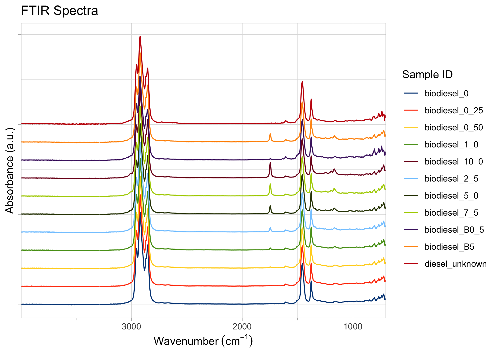

Note the default plot and legend titles are in english but can be
automatically changed to french defaults by supplying the `lang = 'fr'`
argument to plot creation functions.

Plots can be manipulated, for example, by zooming in on a range:

``` r
# Zoom to a specified range of 1850 to 1650 cm^-1
zoom_in_on_range(biodiesel_plot, c(1650, 1850))
```

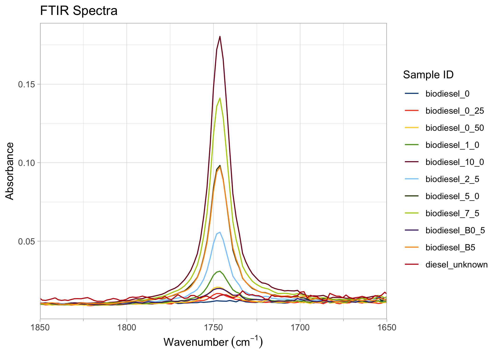

Some FTIR plots have a compressed low-energy portion of the graph which
you might wish to zoom in on. You can achieve this by the following:

``` r
# compress the data with wavenumbers above 2000 (to the left of 2000 on the
# plot) by a factor of 5
compress_low_energy(biodiesel_plot, cutoff = 2000, compression_ratio = 5)
```

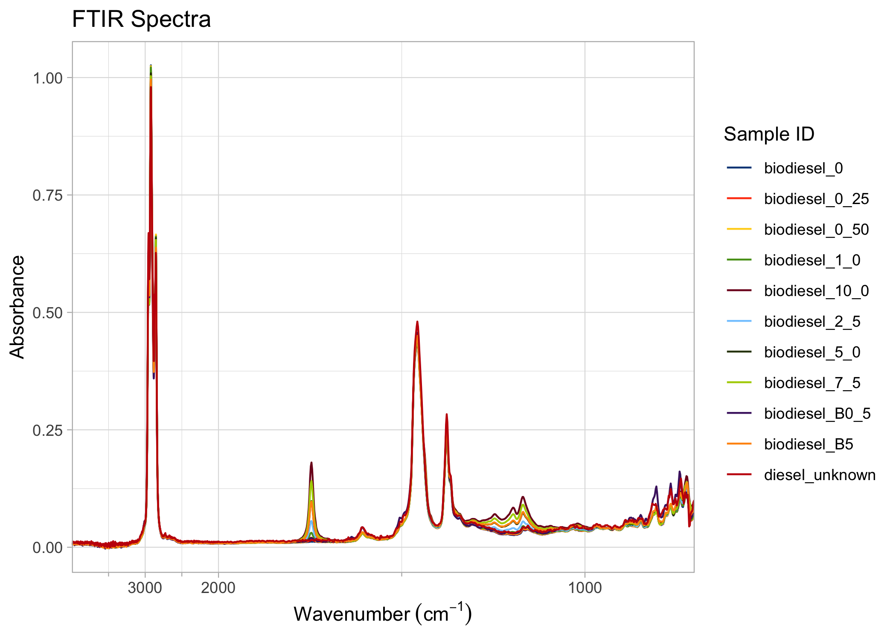

You can also add marker lines (with labels) at specific wavenumbers on
the plots, controlling their line or text properties as needed.
Similarly, a shaded band can be added to indicate a region.

``` r
biodiesel_marked <- add_wavenumber_marker(biodiesel_plot,
  wavenumber = 1742,
  text = "C=O Stretch",
  label_aesthetics = list("color" = "red")
) 
add_band(biodiesel_marked, c(2750,3050), "C-H Stretch")
```

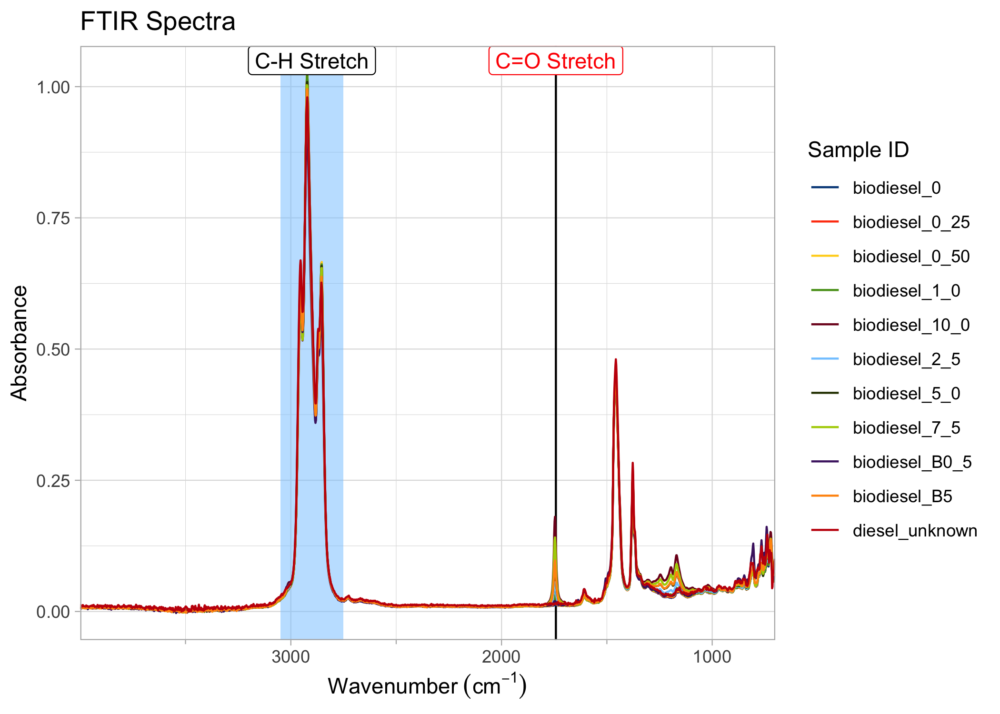

If the need arises to rename samples listed in the legend, this is
possible via `rename_plot_sample_ids()`. Samples must be listed in the
rename vector with the format `"new name" = "old name"`.

``` r
new_names <- c(
  "0.0% Biodiesel" = "biodiesel_0",
  "0.25% Biodiesel" = "biodiesel_0_25",
  "0.50% Biodiesel" = "biodiesel_0_50",
  "1.0% Biodiesel" = "biodiesel_1_0",
  "2.5% Biodiesel" = "biodiesel_2_5",
  "5.0% Biodiesel" = "biodiesel_5_0",
  "7.5% Biodiesel" = "biodiesel_7_5",
  "10.0% Biodiesel" = "biodiesel_10_0",
  "Commercial B0.5" = "biodiesel_B0_5",
  "Commercial B5" = "biodiesel_B5",
  "Unknown Biodiesel" = "diesel_unknown"
)
rename_plot_sample_ids(biodiesel_plot, new_names)
```

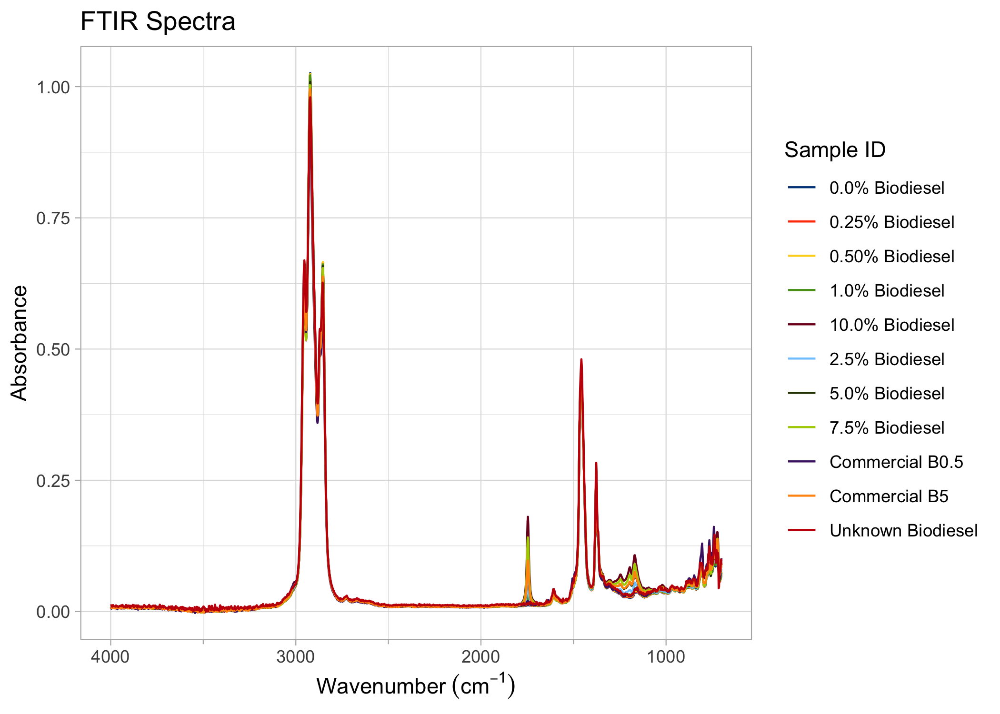

A helper function for the renaming is provided (see the documentation
for `get_plot_sample_ids()`).

Specific sample(s) can be highlighted (other samples greyed out) by
calling `highlight_sample()`.

Finally, plot legends are customizable (for basic changes) through a
helper function `move_plot_legend()`.

## Data Sets

The package contains two datasets to provide example spectra for
plotting: \* `biodiesel` is a set of diesels with 0 to 10 % FAMEs (fatty
acid methyl esters; biodiesel) content, plus two known and one unknown
diesel spectra. \* `sample_spectra` is a set of random FTIR spectra
which includes spectra of pure toluene, isopropanol, and heptanes, as
well as white printer paper and a polystyrene film.

An example of the `biodiesel` data set is below:

``` r
head(biodiesel)
#>   wavenumber absorbance   sample_id
#> 1   700.7395   0.072530 biodiesel_0
#> 2   702.6032   0.065398 biodiesel_0
#> 3   704.4669   0.063371 biodiesel_0
#> 4   706.3305   0.059454 biodiesel_0
#> 5   708.1942   0.058133 biodiesel_0
#> 6   710.0579   0.056636 biodiesel_0
```

## Tidy Plot Production

Note that because most functions return a data type similar to what is
provided, tidy-eval is possible (using the base R pipe `|>` or
[`magrittr` pipe
function](https://magrittr.tidyverse.org/reference/pipe) `%>%`).

``` r
library(magrittr)

new_ids <- c(
  "Toluene" = "toluene", "C7 Alkane" = "heptanes", "IPA" = "isopropanol",
  "White Paper" = "paper", "PS Film" = "polystyrene"
)

sample_spectra |>
  absorbance_to_transmittance() |>
  plot_ftir(plot_title = "Example FTIR Spectra") |>
  zoom_in_on_range(zoom_range = c(3800, 800)) |>
  compress_low_energy(compression_ratio = 4) |>
  add_wavenumber_marker(
    wavenumber = 1495,
    text = "C-C Aromatic",
    line_aesthetics = list("linetype" = "dashed"),
    label_aesthetics = list("color" = "#7e0021")
  ) |>
  add_wavenumber_marker(
    wavenumber = 3340,
    text = "O-H Alcohol",
    line_aesthetics = list("linetype" = "dotted"),
    label_aesthetics = list("color" = "#ff420e")
  ) |>
  rename_plot_sample_ids(sample_ids = new_ids) |>
  move_plot_legend(position = "bottom", direction = "horizontal")
#> Coordinate system already present.
#> ℹ Adding new coordinate system, which will replace the existing one.
```

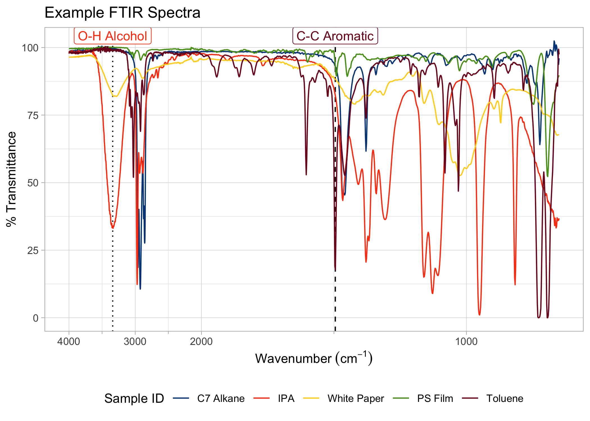

## Data Manipulation

FTIR spectral data can be converted between absorbance and
transmittance. Only one type of data can exist in a data.frame and be
plotted. The functions `absorbance_to_transmittance()` and
`transmittance_to_absorbance()` perform these conversions.

``` r
biodiesel_transm <- absorbance_to_transmittance(biodiesel)
head(biodiesel_transm)
#> PlotFTIR data:
#>   Spectral range: 700.7395 - 710.0579 cm⁻¹
#>   Resolution: variable
#>   Intensity type: transmittance 
#>   Number of samples: 1 
#>   Sample IDs: biodiesel_0
```

Functions are provided for adjusting the baseline of spectra, adding or
subtracting scalar values from entire spectra, normalizing spectra, and
averaging spectra, see: \* `recalculate_baseline()` \*
`add_scalar_value()` and `subtract_scalar_value()` \*
`normalize_spectra()` \* `average_spectra()`

## Peak Fitting

Peaks can be found in spectra by calling `find_ftir_peaks()`. Once peaks
are identified, you can fit component shapes to overlapping absorption
bands using Expectation-Maximization algorithms. The functions
`find_ftir_peaks()` and `fit_peaks()` detect peak locations and fit
Voigt, Gaussian, Lorentzian, or Doniach-Sunjic-Gauss component shapes to
decompose complex spectra. Peak detection requires the optional `signal`
package for Savitzky-Golay smoothing.

``` r
subset_spectrum <- biodiesel[biodiesel$sample_id == "biodiesel_10_0", ]
subset_spectrum <- subset_spectrum[subset_spectrum$wavenumber < 2000 & subset_spectrum$wavenumber > 1000, ]

fitted <- fit_peaks(subset_spectrum, method = "voigt")

plot_fit_ftir_peaks(ftir = subset_spectrum, fitted_peaks = fitted, plot_components = TRUE)
#> Scale for colour is already present.
#> Adding another scale for colour, which will replace the existing scale.
#> Loading required namespace: gghighlight
```

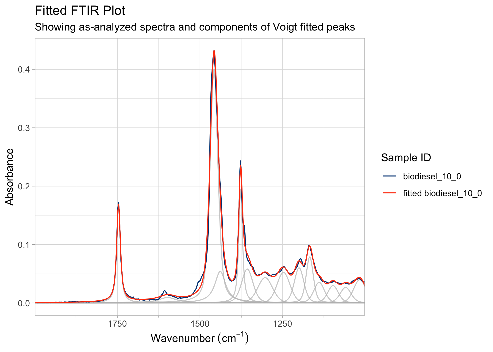

A [detailed vignette](vignettes/peak_fitting.Rmd) demonstrates a
complete peak fitting workflow on biodiesel-diesel blend spectra, from
identifying functional groups through evaluating fit quality.

## Reading Files

`PlotFTIR` can read .csv, .asp, and .jdx file types. The .csv or .jdx
files should contain only one spectra, with columns for `wavenumber` and
`absorbance` or `transmittance.` The .asp files should be according to
the file specifications (not modified by the user).

## Interfacing With `ir` and `ChemoSpec` Packages

`PlotFTIR` has functions to interface with the `ir` package by Henning
Teickner. This package offers complex baseline capabilities, smoothing,
and more data analysis tools. More information on the `ir` package is
available in their [documetation (via
CRAN)](https://cran.r-project.org/package=ir). There is also
capabilities to interface with `ChemoSpec` package by Bryan Hanson,
which supports advanced statistics and chemometrics of spectral data.
More information at [the `ChemoSpec`
documentation](https://bryanhanson.github.io/ChemoSpec/index.html).

## Citing This Package

Please cite this package in any journal articles containing images
produced by way of the package. If installed from GitHub or CRAN the
date field will be properly filled with the publishing year.

``` r
citation("PlotFTIR")
#> To cite package 'PlotFTIR' in publications use:
#> 
#>   Bulsink P (????). _PlotFTIR: Plot FTIR Spectra_. R package version
#>   1.2.1.9000, <https://github.com/NRCan/PlotFTIR>.
#> 
#> A BibTeX entry for LaTeX users is
#> 
#>   @Manual{,
#>     title = {PlotFTIR: Plot FTIR Spectra},
#>     author = {Philip Bulsink},
#>     note = {R package version 1.2.1.9000},
#>     url = {https://github.com/NRCan/PlotFTIR},
#>   }
```

## Language Settings

The package has the ability to change language from English to French
for plots on a per-plot basis (call `plot_ftir()` functions with
`lang = 'en'` or `lang = 'fr` arguments). In addition, the default
language can be set to English or French by setting
`options('PlotFTIR.lang' = 'en')` or `options('PlotFTIR.lang' = 'fr')`
respectively. This can be added to your .RProfile to persist between R
sessions.

([English](#introduction-and-installation))

## Introduction et installation

Le but de `PlotFTIR` est de lancer facilement et rapidement la
production des tracés de spectres de spectroscopie infrarouge à
transformée de Fourier (IRTF) de qualité de revues scientifiques dans le
system R en utilisant ggplot2. Les tracés produits peuvent être publiés
directement ou modifiés par les fonctions ggplot2.

Vous pouvez installer la version de développement de `PlotFTIR` depuis
[GitHub](https://github.com/) avec:

``` r
# install.packages("devtools")
devtools::install_github("NRCan/PlotFTIR")

library(PlotFTIR)
```

## Exemples des tracés

Ceci est un example de base qui vous montre comment tracer un ensemble
de spectres IRTF dejà preparé:

``` r
library(PlotFTIR)
plot_ftir(sample_spectra, lang = "fr")
```

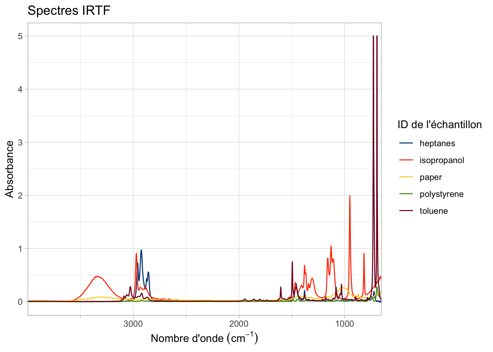

Vous pouvez également tracer les spectres de manière empilée/décalée au
lieu de les superposer :

``` r
plot_ftir_stacked(biodiesel, plot_title = "Spectre IRTF empilée", lang = "fr")
```

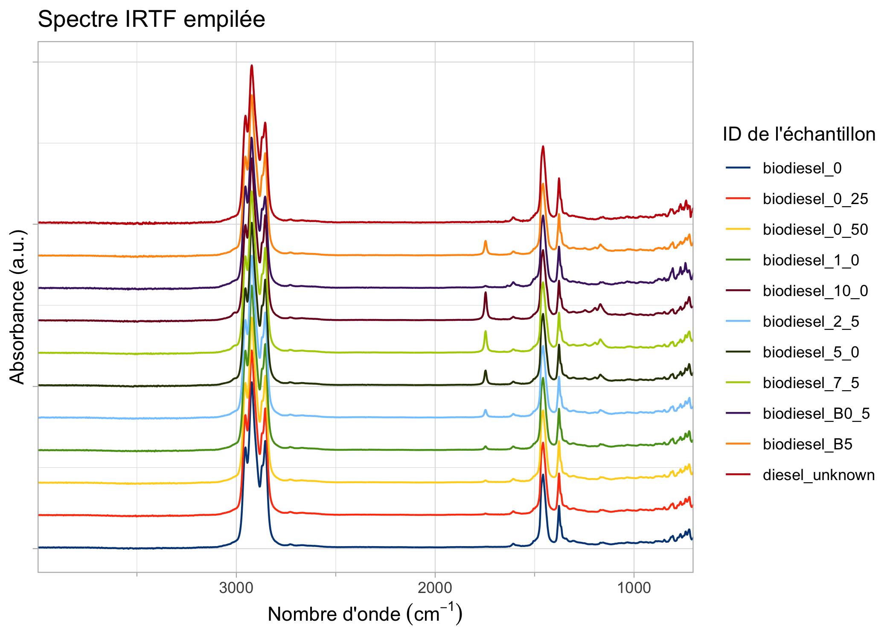

Notez que les titres par défaut de tracé et du légende sont en anglais,
mais qu’ils peuvent être automatiquement modifiés en français en
fournissant l’argument `lang = 'fr'` aux fonctions de création de
tracés.

Les tracés peuvent être manipulés, par exemple, en zoomant sur une
plage :

``` r
# Générer un tracé
biodiesel_trace <- plot_ftir(biodiesel, lang = "fr")
# Zoom sur une plage spécifiée de 1850 à 1650 cm^-1
zoom_in_on_range(biodiesel_trace, c(1650, 1850))
```

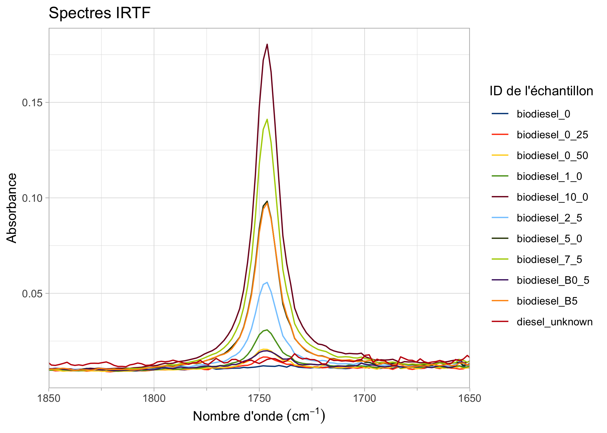

Certains tracés IRTF ont une partie compressée du graphique à faible
énergie qui peuvent etre agrandie de la manière suivante :

``` r
# compresser les données avec des nombres d'onde supérieurs à 2000 (à gauche de
# 2000 sur le tracé) d'un facteur 5
compress_low_energy(biodiesel_trace, cutoff = 2000, compression_ratio = 5)
```

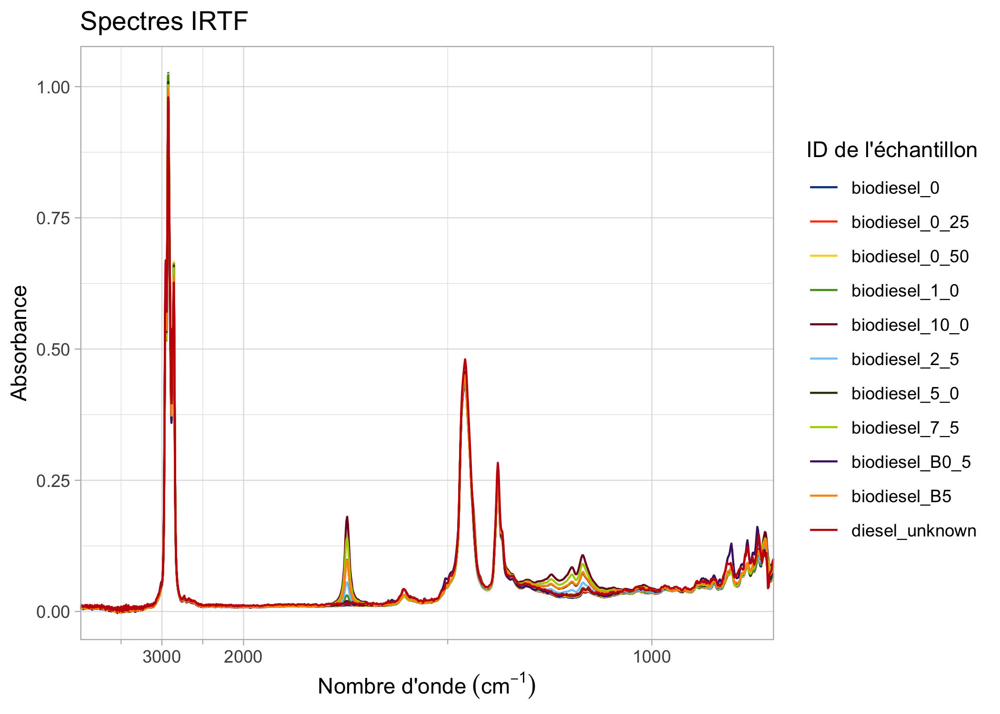

Vous pouvez également ajouter des lignes de marqueur (avec des
étiquettes) à des numéros d’onde spécifiques sur les tracés, en
contrôlant leurs propriétés de ligne ou de texte selon vos besoins. De
même, une bande ombrée peut être ajoutée pour indiquer une région.

``` r
biodiesel_marked <- add_wavenumber_marker(biodiesel_trace,
  wavenumber = 1742,
  text = "C=O étirement",
  label_aesthetics = list("color" = "red")
) 
add_band(biodiesel_marked, c(2750,3050), "C-H étirement")
```

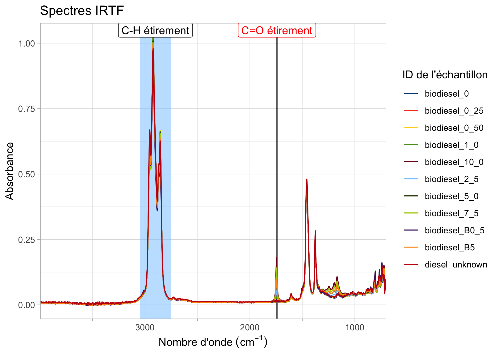

S’il est nécessaire de renommer les échantillons répertoriés dans la
légende, cela est possible via `rename_plot_sample_ids()`. Le vecteur de
renommage doit avoir le format `"nouveau nom" = "ancien nom"`.

``` r
nouveau_noms <- c(
  "0,0% Biodiesel" = "biodiesel_0",
  "0,25% Biodiesel" = "biodiesel_0_25",
  "0,50% Biodiesel" = "biodiesel_0_50",
  "1,0% Biodiesel" = "biodiesel_1_0",
  "2,5% Biodiesel" = "biodiesel_2_5",
  "5,0% Biodiesel" = "biodiesel_5_0",
  "7,5% Biodiesel" = "biodiesel_7_5",
  "10,0% Biodiesel" = "biodiesel_10_0",
  "B0,5 Commercial" = "biodiesel_B0_5",
  "B5 Commercial" = "biodiesel_B5",
  "Biodiesel Inconnu" = "diesel_unknown"
)
rename_plot_sample_ids(biodiesel_trace, nouveau_noms)
```

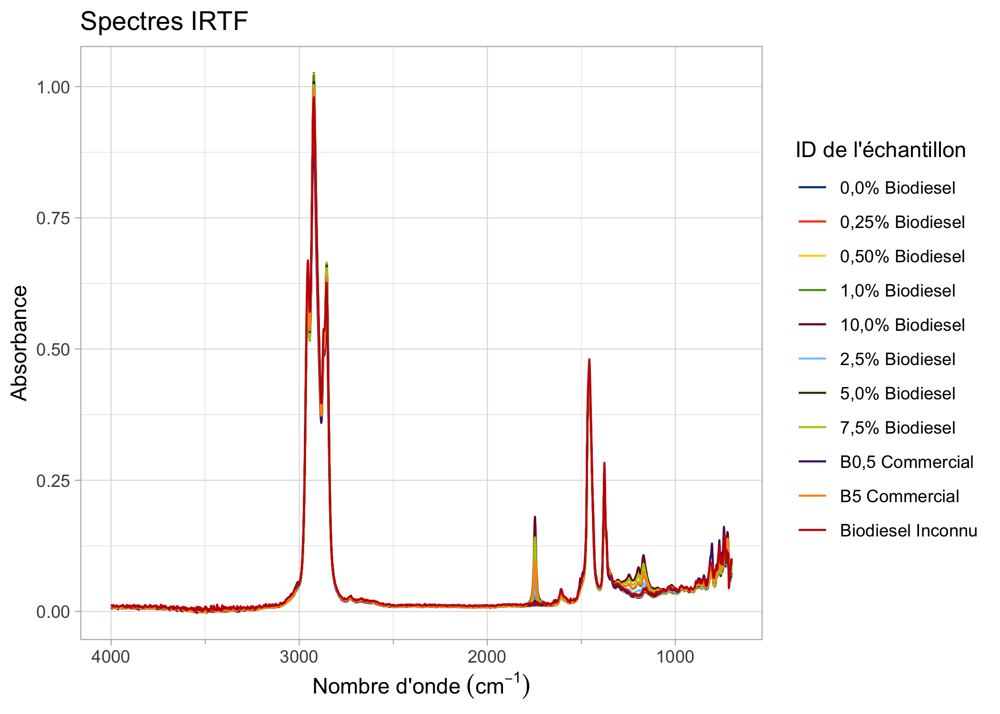

Une fonction d’assistance pour le changement de nom est fournie (voir la
documentation pour `get_plot_sample_ids()`).

Un ou plusieurs échantillons spécifiques peuvent être mis en évidence
(les autres échantillons étant grisés) en appelant `highlight_sample()`.

Enfin, les légendes des tracés sont personnalisables (pour les
modifications de base) via une fonction d’assistance
`move_plot_legend()`.

## Production de tracés “tidy”

Notez que comme la plupart des fonctions renvoient un type de données
similaire à celui qui est fourni, l’évaluation des données est possible
(en utilisant [la fonction `magrittr`
tuyau](https://magrittr.tidyverse.org/reference/pipe) `%>%`).

``` r
library(magrittr)

nouveaux_ids <- c(
  "Toluène" = "toluene", "C7 alcane" = "heptanes", "alcool isopropylique" = "isopropanol",
  "papier blanc" = "paper", "film de polystyrène" = "polystyrene"
)

sample_spectra |>
  absorbance_to_transmittance() |>
  plot_ftir(plot_title = "Exemple de spectres IRTF", lang = "fr") |>
  zoom_in_on_range(zoom_range = c(3800, 800)) |>
  compress_low_energy(compression_ratio = 4) |>
  add_wavenumber_marker(
    wavenumber = 1495,
    text = "C-C aromatique",
    line_aesthetics = list("linetype" = "dashed"),
    label_aesthetics = list("color" = "#7e0021")
  ) |>
  add_wavenumber_marker(
    wavenumber = 3340,
    text = "O-H alcool",
    line_aesthetics = list("linetype" = "dotted"),
    label_aesthetics = list("color" = "#ff420e")
  ) |>
  rename_plot_sample_ids(sample_ids = nouveaux_ids) |>
  move_plot_legend(position = "bottom", direction = "horizontal")
#> Coordinate system already present.
#> ℹ Adding new coordinate system, which will replace the existing one.
```

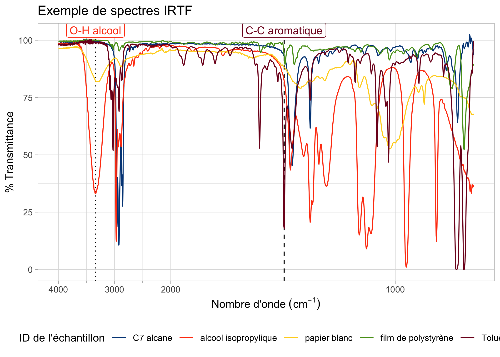

## Production de tracés “tidy”

Notez que, comme la plupart des fonctions renvoient un type de données
similaire à celui fourni, une “tidy-eval” est possible.

## Ensembles des données

Le package contient deux ensembles de données pour fournir des exemples
de spectres à tracer: \* `biodiesel` est un ensemble de diesels avec une
teneur en esters méthyliques d’acides gras (EMAGs) (ou biodiesel) de 0 à
10 %, plus deux spectres de diesel connus et un inconnu. \*
`sample_spectra` est un ensemble de spectres IRTF aléatoires qui
comprennent des spectres de toluène pur, d’isopropanol et d’heptanes,
ainsi que du papier d’imprimante blanc et un film de polystyrène.

Un exemple de l’ensemble de données `biodiesel` est ci-dessous:

``` r
head(biodiesel)
#>   wavenumber absorbance   sample_id
#> 1   700.7395   0.072530 biodiesel_0
#> 2   702.6032   0.065398 biodiesel_0
#> 3   704.4669   0.063371 biodiesel_0
#> 4   706.3305   0.059454 biodiesel_0
#> 5   708.1942   0.058133 biodiesel_0
#> 6   710.0579   0.056636 biodiesel_0
```

## Manipulation de données

Les données spectrales IRTF peuvent être converties entre l’absorbance
et la transmission. Un seul type de données peut exister dans un
data.frame et être tracé. Les fonctions `absorbance_to_transmittance()`
et `transmittance_to_absorbance()` effectuent ces conversions.

``` r
biodiesel_transm <- absorbance_to_transmittance(biodiesel)
head(biodiesel_transm)
#> PlotFTIR data:
#>   Spectral range: 700.7395 - 710.0579 cm⁻¹
#>   Resolution: variable
#>   Intensity type: transmittance 
#>   Number of samples: 1 
#>   Sample IDs: biodiesel_0
```

Des fonctions sont fournies pour ajuster la ligne de base des spectres,
ajouter ou soustraire des valeurs scalaires de spectres entiers,
normalisation des spectres, et calculer la moyenne des spectres, voir :
\* `recalculate_baseline()` \* `add_scalar_value()` et
`subtract_scalar_value()` \* `normalize_spectra()` \*
`average_spectra()`

## Ajustement des pics

Une fois les pics identifiés, vous pouvez ajuster des formes de
composantes aux bandes d’absorption chevauchantes à l’aide d’algorithmes
d’espérance-maximisation. Les fonctions `find_ftir_peaks()` et
`fit_peaks()` détectent les emplacements des pics et ajustent des formes
de composantes Voigt, Gaussienne, Lorentzienne ou Doniach-Sunjic-Gauss
pour décomposer les spectres complexes. La détection des pics nécessite
le paquetage optionnel `signal` pour le lissage de Savitzky-Golay ; les
algorithmes d’ajustement nécessitent le paquetage `EMpeaksR`.

``` r
subset_spectrum <- biodiesel[biodiesel$sample_id == "biodiesel_10_0", ]
subset_spectrum <- subset_spectrum[subset_spectrum$wavenumber < 2000 & subset_spectrum$wavenumber > 1000, ]

fitted <- fit_peaks(subset_spectrum, method = "voigt")
plot_fit_ftir_peaks(ftir = subset_spectrum, fitted_peaks = fitted, plot_components = TRUE)
#> Scale for colour is already present.
#> Adding another scale for colour, which will replace the existing scale.
```


Une [vignette détaillée](vignettes/peak_fitting.Rmd) présente un flux de
travail complet d’ajustement de pics sur les spectres de mélanges
diesel-biodiesel, de l’identification des groupes fonctionnels à
l’évaluation de la qualité de l’ajustement.

## Lecture des fichiers

`PlotFTIR` peut lire les fichiers de type .csv, .asp, et .jdx. Le
fichier .csv ou .jdx ne doit contenir qu’un seul spectre, avec des
colonnes pour le `wavenumber` et `absorbance` ou `transmittance`. Les
fichiers .asp doivent être conformes aux spécifications du fichier (non
modifiées par l’utilisateur).

## Interfaçage avec le paquetage `ir`

`PlotFTIR` possède des fonctions pour s’interfacer avec le paquet `ir`
de Teickner. Ce package offre des capacités de lignes de base complexes,
de lissage, et plus d’outils d’analyse de données. Plus d’informations
sur le paquet `ir` sont disponibles dans leur \[documetation (via
CRAN)\] (<https://cran.r-project.org/package=ir>). Il est également
possible de s’interfacer avec le paquet `ChemoSpec` de Bryan Hanson, qui
prend en charge les statistiques avancées et la chimiométrie des données
spectrales. Plus d’informations sur \[la documentation de `ChemoSpec`\]
(<https://bryanhanson.github.io/ChemoSpec/index.html>).

## Citer ce paquet

Veuillez citer ce paquet dans tout article de journal contenant des
images produites à l’aide de ce paquet. Si le paquet est installé à
partir de GitHub ou de CRAN, le texte de la date sera correctement
rempli avec l’année de publication.

``` r
citation("PlotFTIR")
#> To cite package 'PlotFTIR' in publications use:
#> 
#>   Bulsink P (????). _PlotFTIR: Plot FTIR Spectra_. R package version
#>   1.2.1.9000, <https://github.com/NRCan/PlotFTIR>.
#> 
#> A BibTeX entry for LaTeX users is
#> 
#>   @Manual{,
#>     title = {PlotFTIR: Plot FTIR Spectra},
#>     author = {Philip Bulsink},
#>     note = {R package version 1.2.1.9000},
#>     url = {https://github.com/NRCan/PlotFTIR},
#>   }
```

## Paramètres de langue

Le paquetage a la capacité de changer la langue de l’anglais au français
pour les tracés sur une base individuelle (appeler les fonctions
`plot_ftir()` avec les arguments `lang = 'en'` ou `lang = 'fr'`). De
plus, la langue par défaut peut être réglée sur l’anglais ou le français
en réglant `options('PlotFTIR.lang' = 'en')` ou
`options('PlotFTIR.lang' = 'fr')` respectivement. Ceci peut être ajouté
à votre .RProfile pour persister entre les sessions R.
