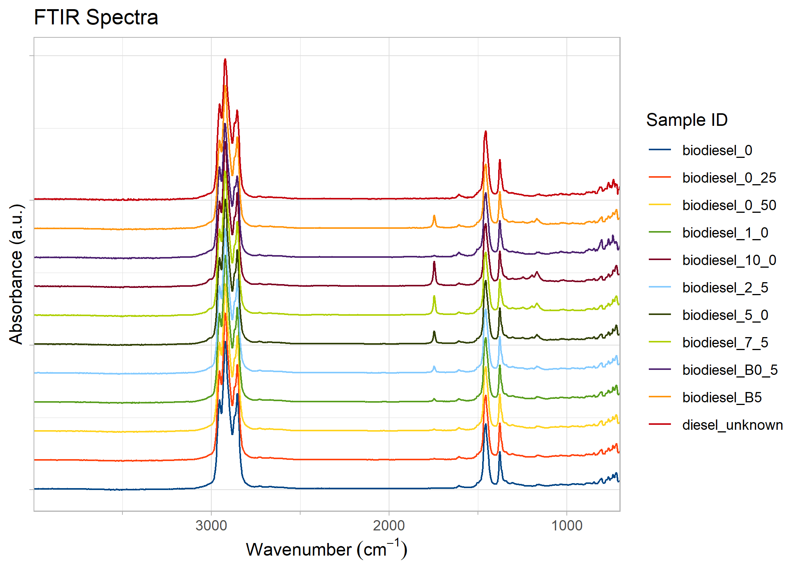
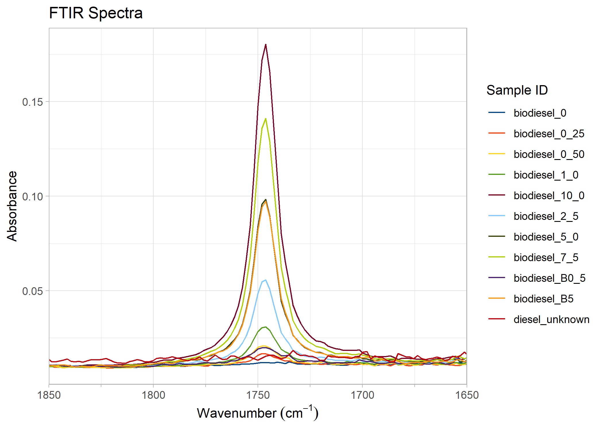
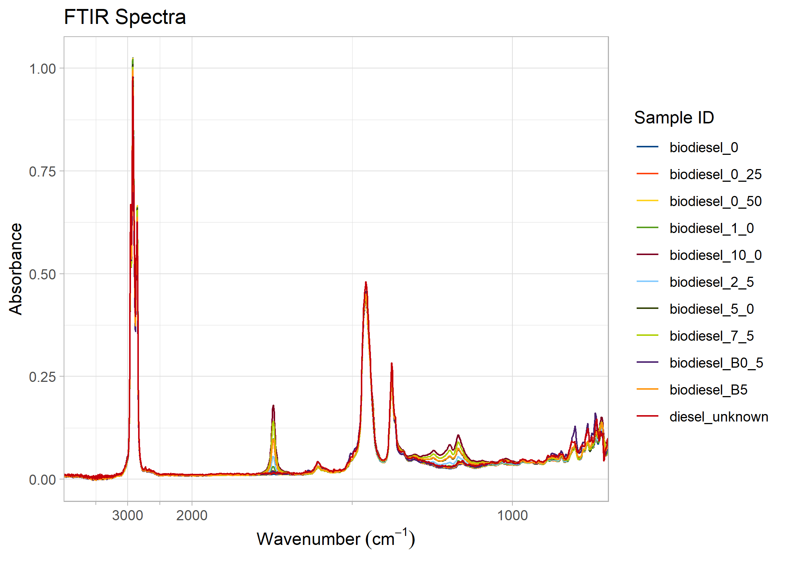
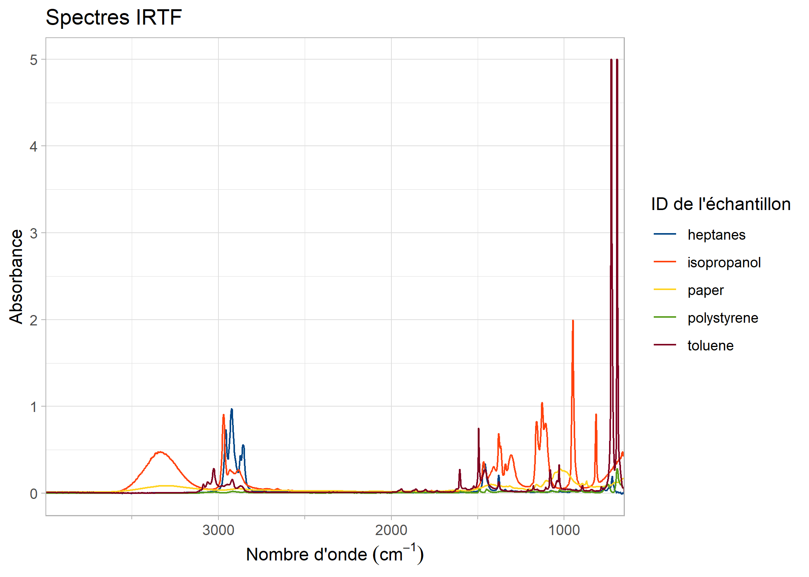

<!-- README.md is generated from README.Rmd. Please edit that file -->

# PlotFTIR

<!-- badges: start -->

[](https://github.com/pbulsink/PlotFTIR/actions/workflows/R-CMD-check.yaml)
[](https://codecov.io/gh/pbulsink/PlotFTIR)
<!-- badges: end -->

([Français](#introduction-et-installation))

## Introduction and Installation

The goal of `PlotFTIR` is to easily and quickly kick-start the
production of journal-quality Fourier Transform Infra-Red (FTIR)
spectral plots in R using ggplot2. The produced plots can be published
directly or further modified by ggplot2 functions.

You can install the development version of PlotFTIR from
[GitHub](https://github.com/) with:

``` r
# install.packages("devtools")
devtools::install_github("pbulsink/PlotFTIR")
```

## Example Plots

This is a basic example which shows you how to plot a prepared set of
FTIR spectra:

``` r
library(PlotFTIR)
plot_ftir(sample_spectra)
```


We can also plot spectra in a stacked/offset manner instead of overlaid:

``` r
# Generate a plot
biodiesel_plot <- plot_ftir(biodiesel)
biodiesel_plot
```



Plots can be manipulated, for example, by zooming in on a range:

``` r
# Zoom to a specified range of 1850 to 1650 cm^-1
zoom_in_on_range(biodiesel_plot, c(1650, 1850))
#> Warning: Removed 18304 rows containing missing values or values outside the scale range
#> (`geom_line()`).
```



Some FTIR plots have a compressed low-energy portion of the graph. You
can achieve this by the following:

``` r
# compress the data with wavenumbers above 2000 (to the left of 2000 on the
# plot) by a factor of 5
compress_low_energy(biodiesel_plot, cutoff = 2000, compression_ratio = 5)
```



You can also add marker lines (with labels) at specific wavenumbers on
the plots, controlling their line or text properties as needed.

``` r
biodiesel_marked <- add_wavenumber_marker(biodiesel_plot, 1742, "C=O Stretch", label_aesthetics = list("color" = "red"))
add_wavenumber_marker(biodiesel_plot, 2920, text = "C-H Stretch", line_aesthetics = list("linetype" = "dashed"))
```


## Data Sets

The package contains two datasets to provide example spectra for
plotting: \* `biodiesel` is a set of diesels with 0 to 10 % FAMES
(biodiesel) content, plus two known and one unknown diesel spectra. \*
`sample_spectra` is a set of random FTIR spectra which includes spectra
of pure toluene, isopropanol, and heptanes, as well as white printer
paper and a polystyrene film.

An example of the `biodiesel` data set is below:

``` r
head(biodiesel)
#>   wavenumber absorbance   sample_id
#> 1   700.7395   0.072530 biodiesel_0
#> 2   702.6032   0.065398 biodiesel_0
#> 3   704.4669   0.063371 biodiesel_0
#> 4   706.3305   0.059454 biodiesel_0
#> 5   708.1942   0.058133 biodiesel_0
#> 6   710.0579   0.056636 biodiesel_0
```

## Data Manipulation

FTIR spectral data can be converted between absorbance and
transmittance. Only one type of data can exist in a data.frame and be
plotted. The functions `absorbance_to_transmittance()` and
`transmittance_to_absorbance()` perform these conversions.

``` r
biodiesel_transm <- absorbance_to_transmittance(biodiesel)
head(biodiesel_transm)
#>   wavenumber transmittance   sample_id
#> 1   700.7395      84.61941 biodiesel_0
#> 2   702.6032      86.02051 biodiesel_0
#> 3   704.4669      86.42293 biodiesel_0
#> 4   706.3305      87.20593 biodiesel_0
#> 5   708.1942      87.47159 biodiesel_0
#> 6   710.0579      87.77362 biodiesel_0
```

## Code of Conduct

Please note that the PlotFTIR project is released with a [Contributor
Code of Conduct](CODE_OF_CONDUCT.md). By contributing to this project,
you agree to abide by its terms.

([English](#introduction-and-installation))

## Introduction et installation

L’objectif de PlotFTIR est de démarrer facilement et rapidement la
production des tracés spectraux de spectroscopie infrarouge à
transformée de Fourier (FTIR) de qualité journal dans R à l’aide de
ggplot2. Les tracés produits peuvent être publiés directement ou
modifiés davantage par les fonctions ggplot2.

Vous pouvez installer la version de développement de PlotFTIR depuis
[GitHub](https://github.com/) avec :

``` r
# install.packages("devtools")
devtools::install_github("pbulsink/PlotFTIR")
```

## Exemples des tracés

Ceci est un example de base qui vous montre comment tracer un ensemble
prépar de spectres FTIR:

``` r
library(PlotFTIR)
plot_ftir(sample_spectra)
```



Nous pouvons également tracer les spectres de manière empilée/décalée au
lieu de les superposer :

``` r
plot_ftir_stacked(biodiesel)
```


Les tracés peuvent être manipulés, par exemple, en zoomant sur une
plage :

``` r
# Générer un tracé
biodiesel_trace <- plot_ftir(biodiesel)
# Zoom sur une plage spécifiée de 1850 à 1650 cm^-1
zoom_in_on_range(biodiesel_trace, c(1650, 1850))
#> Warning: Removed 18304 rows containing missing values or values outside the scale range
#> (`geom_line()`).
```


Certains tracés FTIR ont une partie compressée du graphique à faible
énergie. Vous pouvez y parvenir de la manière suivante :

``` r
# compresser les données avec des nombres d'onde supérieurs à 2000 (à gauche de
# 2000 sur le tracé) d'un facteur 5
compress_low_energy(biodiesel_plot, cutoff = 2000, compression_ratio = 5)
```


Vous pouvez également ajouter des lignes de marqueur (avec des
étiquettes) à des numéros d’onde spécifiques sur les tracés, en
contrôlant leurs propriétés de ligne ou de texte selon vos besoins.

``` r
biodiesel_marked <- add_wavenumber_marker(biodiesel_plot, 1742, "C=O Stretch", label_aesthetics = list("color" = "red"))
add_wavenumber_marker(biodiesel_plot, 2920, text = "C-H Stretch", line_aesthetics = list("linetype" = "dashed"))
```


## Ensembles des données

Le package contient deux ensembles de données pour fournir des exemples
de spectres à tracer : \* `biodiesel` est un ensemble de diesels avec
une teneur en FAMES (biodiesel) de 0 à 10 %, plus deux spectres de
diesel connus et un inconnu. \* `sample_spectra` est un ensemble de
spectres FTIR aléatoires qui comprennent des spectres de toluène pur,
d’isopropanol et d’heptanes, ainsi que du papier d’imprimante blanc et
un film de polystyrène.

Un exemple de l’ensemble de données `biodiesel` est ci-dessous:

``` r
head(biodiesel)
#>   wavenumber absorbance   sample_id
#> 1   700.7395   0.072530 biodiesel_0
#> 2   702.6032   0.065398 biodiesel_0
#> 3   704.4669   0.063371 biodiesel_0
#> 4   706.3305   0.059454 biodiesel_0
#> 5   708.1942   0.058133 biodiesel_0
#> 6   710.0579   0.056636 biodiesel_0
```

## Manipulation de données

Les données spectrales FTIR peuvent être converties entre l’absorbance
et la transmission. Un seul type de données peut exister dans un
data.frame et être tracé. Les fonctions `absorbance_to_transmittance()`
et `transmittance_to_absorbance()` effectuent ces conversions.

``` r
biodiesel_transm <- absorbance_to_transmittance(biodiesel)
head(biodiesel_transm)
#>   wavenumber transmittance   sample_id
#> 1   700.7395      84.61941 biodiesel_0
#> 2   702.6032      86.02051 biodiesel_0
#> 3   704.4669      86.42293 biodiesel_0
#> 4   706.3305      87.20593 biodiesel_0
#> 5   708.1942      87.47159 biodiesel_0
#> 6   710.0579      87.77362 biodiesel_0
```

## Code de conduite

Veuillez noter que le projet PlotFTIR est publié avec un [Code de
conduite pour le projet](CODE_OF_CONDUCT.md). En contribuant à ce
projet, vous acceptez d’en respecter les termes.
