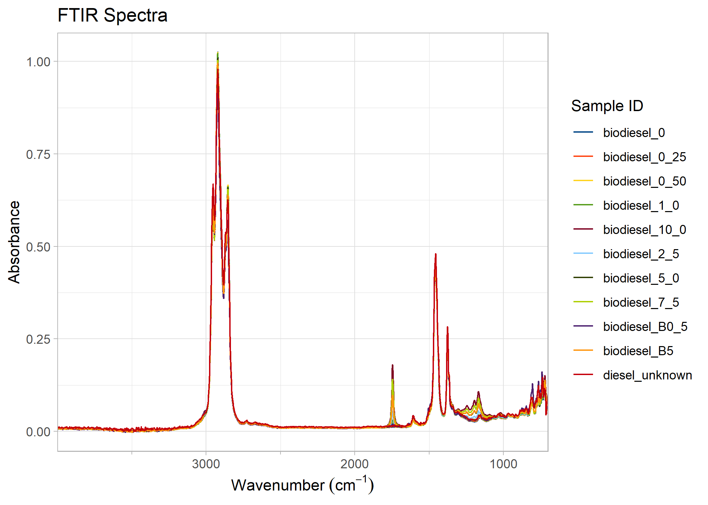
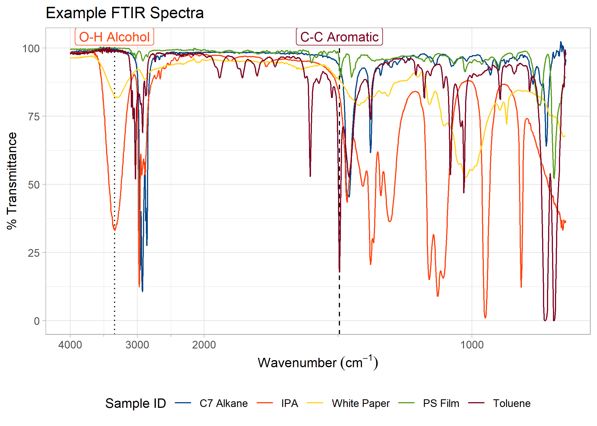
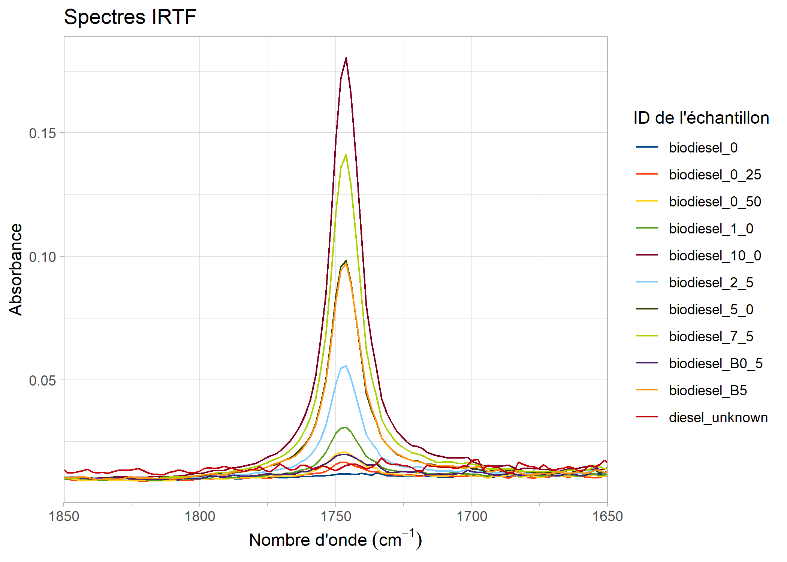
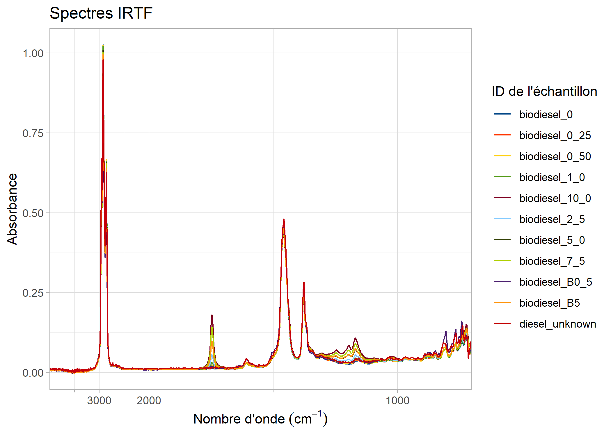
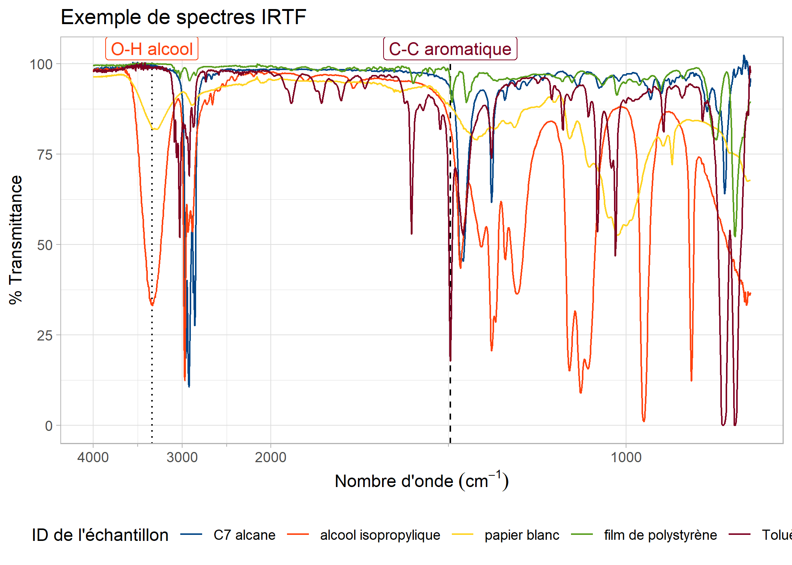

<!-- README.md is generated from README.Rmd. Please edit that file -->

# PlotFTIR

<!-- badges: start -->

[](https://github.com/pbulsink/PlotFTIR/actions/workflows/R-CMD-check.yaml)
[](https://codecov.io/gh/pbulsink/PlotFTIR)
[](https://CRAN.R-project.org/package=PlotFTIR)
[](https://lifecycle.r-lib.org/articles/stages.html#stable)
<!-- badges: end -->

([Français](#introduction-et-installation))

## Introduction and Installation

The goal of `PlotFTIR` is to easily and quickly kick-start the
production of journal-quality Fourier Transform Infra-Red (FTIR)
spectral plots in R using ggplot2. The produced plots can be published
directly or further modified by ggplot2 functions.

You can install the development version of PlotFTIR from
[GitHub](https://github.com/) with:

``` r
# install.packages("devtools")
devtools::install_github("pbulsink/PlotFTIR")
```

## Example Plots

This is a basic example which shows you how to plot a prepared set of
FTIR spectra:

``` r
library(PlotFTIR)
biodiesel_plot <- plot_ftir(biodiesel)
biodiesel_plot
```



We can also plot spectra in a stacked/offset manner instead of overlaid:

``` r
# Generate a plot
plot_ftir_stacked(biodiesel)
```


Note the default plot and legend titles are in english but can be
automatically changed to french defaults by supplying the `lang = 'fr'`
argument to plot creation functions.

Plots can be manipulated, for example, by zooming in on a range:

``` r
# Zoom to a specified range of 1850 to 1650 cm^-1
zoom_in_on_range(biodiesel_plot, c(1650, 1850))
#> Warning: Removed 18304 rows containing missing values or values outside the scale range
#> (`geom_line()`).
```


Some FTIR plots have a compressed low-energy portion of the graph which
you might wish to zoom in on. You can achieve this by the following:

``` r
# compress the data with wavenumbers above 2000 (to the left of 2000 on the
# plot) by a factor of 5
compress_low_energy(biodiesel_plot, cutoff = 2000, compression_ratio = 5)
```


You can also add marker lines (with labels) at specific wavenumbers on
the plots, controlling their line or text properties as needed.

``` r
biodiesel_marked <- add_wavenumber_marker(biodiesel_plot,
  wavenumber = 1742,
  text = "C=O Stretch",
  label_aesthetics = list("color" = "red")
)
add_wavenumber_marker(biodiesel_marked,
  wavenumber = 2920,
  text = "C-H Stretch",
  line_aesthetics = list("linetype" = "dashed")
)
```


If the need arises to rename samples listed in the legend, this is
possible via `rename_plot_sample_ids()`. At this time, all samples must
be listed in the rename vector with the format
`"old name" = "new name"`.

``` r
new_names <- c(
  "biodiesel_0" = "0.0% Biodiesel",
  "biodiesel_0_25" = "0.25% Biodiesel",
  "biodiesel_0_50" = "0.50% Biodiesel",
  "biodiesel_1_0" = "1.0% Biodiesel",
  "biodiesel_2_5" = "2.5% Biodiesel",
  "biodiesel_5_0" = "5.0% Biodiesel",
  "biodiesel_7_5" = "7.5% Biodiesel",
  "biodiesel_10_0" = "10.0% Biodiesel",
  "biodiesel_B0_5" = "Commercial B0.5",
  "biodiesel_B5" = "Commercial B5",
  "diesel_unknown" = "Unknown Biodiesel"
)
rename_plot_sample_ids(biodiesel_plot, new_names)
#> Scale for colour is already present.
#> Adding another scale for colour, which will replace the existing scale.
```


A helper function for the renaming is provided (see the documentation
for `get_plot_sample_ids()`).

Finally, plot legends are customizable (for basic changes) through a
helper function `move_plot_legend()`.

## Data Sets

The package contains two datasets to provide example spectra for
plotting: \* `biodiesel` is a set of diesels with 0 to 10 % FAMEs
(biodiesel) content, plus two known and one unknown diesel spectra. \*
`sample_spectra` is a set of random FTIR spectra which includes spectra
of pure toluene, isopropanol, and heptanes, as well as white printer
paper and a polystyrene film.

An example of the `biodiesel` data set is below:

``` r
head(biodiesel)
#>   wavenumber absorbance   sample_id
#> 1   700.7395   0.072530 biodiesel_0
#> 2   702.6032   0.065398 biodiesel_0
#> 3   704.4669   0.063371 biodiesel_0
#> 4   706.3305   0.059454 biodiesel_0
#> 5   708.1942   0.058133 biodiesel_0
#> 6   710.0579   0.056636 biodiesel_0
```

## Tidy Plot Production

Note that because most functions return a data type similar to what is
provided, tidy-eval is possible (using the [`magrittr` pipe
function](https://magrittr.tidyverse.org/reference/pipe) `%>%`).

``` r
library(magrittr)

new_ids <- c(
  "toluene" = "Toluene", "heptanes" = "C7 Alkane", "isopropanol" = "IPA",
  "paper" = "White Paper", "polystyrene" = "PS Film"
)

sample_spectra %>%
  absorbance_to_transmittance() %>%
  plot_ftir(plot_title = "Example FTIR Spectra") %>%
  zoom_in_on_range(zoom_range = c(3800, 800)) %>%
  compress_low_energy(compression_ratio = 4) %>%
  add_wavenumber_marker(
    wavenumber = 1495,
    text = "C-C Aromatic",
    line_aesthetics = list("linetype" = "dashed"),
    label_aesthetics = list("color" = "#7e0021")
  ) %>%
  add_wavenumber_marker(
    wavenumber = 3340,
    text = "O-H Alcohol",
    line_aesthetics = list("linetype" = "dotted"),
    label_aesthetics = list("color" = "#ff420e")
  ) %>%
  rename_plot_sample_ids(sample_ids = new_ids) %>%
  move_plot_legend(position = "bottom", direction = "horizontal")
#> Scale for colour is already present.
#> Adding another scale for colour, which will replace the existing scale.
```



## Data Manipulation

FTIR spectral data can be converted between absorbance and
transmittance. Only one type of data can exist in a data.frame and be
plotted. The functions `absorbance_to_transmittance()` and
`transmittance_to_absorbance()` perform these conversions.

``` r
biodiesel_transm <- absorbance_to_transmittance(biodiesel)
head(biodiesel_transm)
#>   wavenumber transmittance   sample_id
#> 1   700.7395      84.61941 biodiesel_0
#> 2   702.6032      86.02051 biodiesel_0
#> 3   704.4669      86.42293 biodiesel_0
#> 4   706.3305      87.20593 biodiesel_0
#> 5   708.1942      87.47159 biodiesel_0
#> 6   710.0579      87.77362 biodiesel_0
```

## Documentation

More information on all functions is available online at
<https://plotftir.pages.dev/>.

## Code of Conduct

Please note that the PlotFTIR project is released with a [Contributor
Code of Conduct](CODE_OF_CONDUCT.md). By contributing to this project,
you agree to abide by its terms.

## Citing This Package

Please cite this package in any journal articles containing images
produced by way of the package. If installed from GitHub or CRAN the
date field will be properly filled with the publishing year.

``` r
citation("PlotFTIR")
#> To cite package 'PlotFTIR' in publications use:
#> 
#>   Bulsink P (????). _PlotFTIR: Plot FTIR Spectra_. R package version
#>   0.1.0.
#> 
#> A BibTeX entry for LaTeX users is
#> 
#>   @Manual{,
#>     title = {PlotFTIR: Plot FTIR Spectra},
#>     author = {Philip Bulsink},
#>     note = {R package version 0.1.0},
#>   }
```

([English](#introduction-and-installation))

## Introduction et installation

Le but de `PlotFTIR` est de lancer facilement et rapidement la
production des tracés de spectres de spectroscopie infrarouge à
transformée de Fourier (IRTF) de qualité de revues scientifiques dans le
system R en utilisant ggplot2. Les tracés produits peuvent être publiés
directement ou modifiés par les fonctions ggplot2.

Vous pouvez installer la version de développement de `PlotFTIR` depuis
[GitHub](https://github.com/) avec:

``` r
# install.packages("devtools")
devtools::install_github("pbulsink/PlotFTIR")
```

## Exemples des tracés

Ceci est un example de base qui vous montre comment tracer un ensemble
de spectres IRTF dejà preparé:

``` r
library(PlotFTIR)
plot_ftir(sample_spectra, lang = "fr")
```


Vous pouvez également tracer les spectres de manière empilée/décalée au
lieu de les superposer :

``` r
plot_ftir_stacked(biodiesel, plot_title = "Spectre IRTF empilée", lang = "fr")
```


Notez que les titres par défaut de tracé et du légende sont en anglais,
mais qu’ils peuvent être automatiquement modifiés en français en
fournissant l’argument `lang = 'fr'` aux fonctions de création de
tracés.

Les tracés peuvent être manipulés, par exemple, en zoomant sur une
plage :

``` r
# Générer un tracé
biodiesel_trace <- plot_ftir(biodiesel, lang = "fr")
# Zoom sur une plage spécifiée de 1850 à 1650 cm^-1
zoom_in_on_range(biodiesel_trace, c(1650, 1850))
#> Warning: Removed 18304 rows containing missing values or values outside the scale range
#> (`geom_line()`).
```



Certains tracés IRTF ont une partie compressée du graphique à faible
énergie qui peuvent etre agrandie de la manière suivante :

``` r
# compresser les données avec des nombres d'onde supérieurs à 2000 (à gauche de
# 2000 sur le tracé) d'un facteur 5
compress_low_energy(biodiesel_trace, cutoff = 2000, compression_ratio = 5)
```



Vous pouvez également ajouter des lignes de marqueur (avec des
étiquettes) à des numéros d’onde spécifiques sur les tracés, en
contrôlant leurs propriétés de ligne ou de texte selon vos besoins.

``` r
biodiesel_marked <- add_wavenumber_marker(biodiesel_trace,
  wavenumber = 1742,
  text = "C=O étirement",
  label_aesthetics = list("color" = "red")
)
add_wavenumber_marker(biodiesel_trace,
  wavenumber = 2920,
  text = "C-H étirement",
  line_aesthetics = list("linetype" = "dashed")
)
```


S’il est nécessaire de renommer les échantillons répertoriés dans la
légende, cela est possible via `rename_plot_sample_ids()`. À ce stade,
tous les échantillons doivent être répertoriés dans le vecteur de
renommage au format `"ancien nom" = "nouveau nom"`.

``` r
nouveau_noms <- c(
  "biodiesel_0" = "0,0% Biodiesel",
  "biodiesel_0_25" = "0,25% Biodiesel",
  "biodiesel_0_50" = "0,50% Biodiesel",
  "biodiesel_1_0" = "1,0% Biodiesel",
  "biodiesel_2_5" = "2,5% Biodiesel",
  "biodiesel_5_0" = "5,0% Biodiesel",
  "biodiesel_7_5" = "7,5% Biodiesel",
  "biodiesel_10_0" = "10,0% Biodiesel",
  "biodiesel_B0_5" = "B0,5 Commercial",
  "biodiesel_B5" = "B5 Commercial",
  "diesel_unknown" = "Biodiesel Inconnu"
)
rename_plot_sample_ids(biodiesel_trace, nouveau_noms)
#> Scale for colour is already present.
#> Adding another scale for colour, which will replace the existing scale.
```


Une fonction d’assistance pour le changement de nom est fournie (voir la
documentation pour `get_plot_sample_ids()`).

Enfin, les légendes des tracés sont personnalisables (pour les
modifications de base) via une fonction d’assistance
`move_plot_legend()`.

## Production de tracés “tidy”

Notez que comme la plupart des fonctions renvoient un type de données
similaire à celui qui est fourni, l’évaluation des données est possible
(en utilisant [la fonction `magrittr`
tuyau](https://magrittr.tidyverse.org/reference/pipe) `%>%`).

``` r
library(magrittr)

nouveaux_ids <- c(
  "toluene" = "Toluène", "heptanes" = "C7 alcane", "isopropanol" = "alcool isopropylique",
  "paper" = "papier blanc", "polystyrene" = "film de polystyrène"
)

sample_spectra %>%
  absorbance_to_transmittance() %>%
  plot_ftir(plot_title = "Exemple de spectres IRTF", lang = "fr") %>%
  zoom_in_on_range(zoom_range = c(3800, 800)) %>%
  compress_low_energy(compression_ratio = 4) %>%
  add_wavenumber_marker(
    wavenumber = 1495,
    text = "C-C aromatique",
    line_aesthetics = list("linetype" = "dashed"),
    label_aesthetics = list("color" = "#7e0021")
  ) %>%
  add_wavenumber_marker(
    wavenumber = 3340,
    text = "O-H alcool",
    line_aesthetics = list("linetype" = "dotted"),
    label_aesthetics = list("color" = "#ff420e")
  ) %>%
  rename_plot_sample_ids(sample_ids = nouveaux_ids) %>%
  move_plot_legend(position = "bottom", direction = "horizontal")
#> Scale for colour is already present.
#> Adding another scale for colour, which will replace the existing scale.
```



## Ensembles des données

Le package contient deux ensembles de données pour fournir des exemples
de spectres à tracer: \* `biodiesel` est un ensemble de diesels avec une
teneur en esters méthyliques d’acides gras (EMAGs) (ou biodiesel) de 0 à
10 %, plus deux spectres de diesel connus et un inconnu. \*
`sample_spectra` est un ensemble de spectres IRTF aléatoires qui
comprennent des spectres de toluène pur, d’isopropanol et d’heptanes,
ainsi que du papier d’imprimante blanc et un film de polystyrène.

Un exemple de l’ensemble de données `biodiesel` est ci-dessous:

``` r
head(biodiesel)
#>   wavenumber absorbance   sample_id
#> 1   700.7395   0.072530 biodiesel_0
#> 2   702.6032   0.065398 biodiesel_0
#> 3   704.4669   0.063371 biodiesel_0
#> 4   706.3305   0.059454 biodiesel_0
#> 5   708.1942   0.058133 biodiesel_0
#> 6   710.0579   0.056636 biodiesel_0
```

## Manipulation de données

Les données spectrales IRTF peuvent être converties entre l’absorbance
et la transmission. Un seul type de données peut exister dans un
data.frame et être tracé. Les fonctions `absorbance_to_transmittance()`
et `transmittance_to_absorbance()` effectuent ces conversions.

``` r
biodiesel_transm <- absorbance_to_transmittance(biodiesel)
head(biodiesel_transm)
#>   wavenumber transmittance   sample_id
#> 1   700.7395      84.61941 biodiesel_0
#> 2   702.6032      86.02051 biodiesel_0
#> 3   704.4669      86.42293 biodiesel_0
#> 4   706.3305      87.20593 biodiesel_0
#> 5   708.1942      87.47159 biodiesel_0
#> 6   710.0579      87.77362 biodiesel_0
```

## Documentation

Plus d’informations sur toutes les fonctions sont disponibles en ligne
sur <https://plotftir.pages.dev/>.

## Code de conduite

Veuillez noter que le projet PlotFTIR est publié avec un [Code de
conduite pour le projet](CODE_OF_CONDUCT.md). En contribuant à ce
projet, vous acceptez de respecter ces conditions.

## Citer ce paquet

Veuillez citer ce paquet dans tout article de journal contenant des
images produites à l’aide de ce paquet. Si le paquet est installé à
partir de GitHub ou de CRAN, le texte de la date sera correctement
rempli avec l’année de publication.

``` r
citation("PlotFTIR")
#> To cite package 'PlotFTIR' in publications use:
#> 
#>   Bulsink P (????). _PlotFTIR: Plot FTIR Spectra_. R package version
#>   0.1.0.
#> 
#> A BibTeX entry for LaTeX users is
#> 
#>   @Manual{,
#>     title = {PlotFTIR: Plot FTIR Spectra},
#>     author = {Philip Bulsink},
#>     note = {R package version 0.1.0},
#>   }
```
