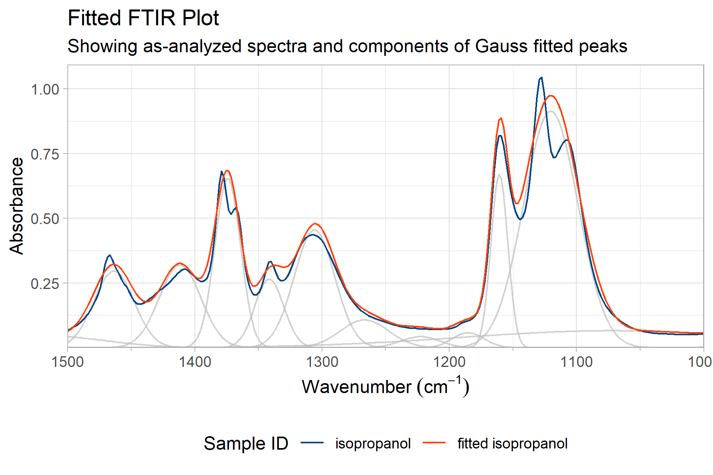

# Deconvoluting Spectra with PlotFTIR

## Introduction

Spectral deconvolution and peak fitting are integral to the understanding and comparison of FTIR spectra. By peak fitting, quantification of components, discovery of subtle shoulder peaks or comparisons of subtle spectral changes are facilitated with ease. These tasks, as well as others, are possible by using `PlotFTIR`. An example of these capabilities is worked here.

## Data Preparation

We'll load some data from the package and use it for this example. We'll plot the spectra so there's an understanding of what we're working with.


``` r
library(PlotFTIR)

isopropanol <- sample_spectra[sample_spectra$sample_id == 'isopropanol', ]

plot_ftir(ftir = isopropanol, plot_title = "Isopropanol FTIR Spectra") |>
  move_plot_legend('bottom')
```

<div class="figure">

<p class="caption">plot of chunk setup</p>
</div>

In this spectra we can see a few identifiable features. A broad peak from 3500 to 3000 cm⁻¹ corresponds to the O-H stretch of isopropanol. Sharp peaks at 2900 to 2800 cm⁻¹ are assignable to C-H stretching. The sharp peaks above 1500 cm⁻¹ correspond to O-H bending, C-O stretching and C-H bending, as well as some background absorption.

## Deconvoluting the Spectra

The `PlotFTIR` package has a number of functions to do peak fitting / deconvolutional analysis. These permit peak discovery by `find_ftir_peaks()`, and fitting peaks by expectation maximization algorithms in `fit_ftir_peaks()`. The latter function can use a peak list provided (from literature, other spectra, or from the `find_ftir_peaks()` function), or will internally call `find_ftir_peaks()` if no peak list is given. 

### Finding Peaks

The first function to explore is `find_ftir_peaks()`. This function uses second derivatives of a Savitzky-Golay smoothed spectra (spectra is smoothed to reduce noise and spurious hits) to identify maxima - see the documentation for `PlotFTIR::smooth_ftir()` for more information on the smoothing algorithm. It further validates the derivative-discovered peak list with a standard maxima-finder to ensure broad peaks (like the O-H stretch) are included in the list. 


``` r
peaklist <- find_ftir_peaks(ftir = isopropanol)

str(peaklist)
#>  num [1:45] 662 686 710 816 857 ...
```

This list includes just the wavenumbers (x axis values) of the peaks - it does not have any information on the peak height or width. Those will be numerically evaluated in our peak fitting discussion below. 

***Note that additional smoothing, peak filtering and peak selection parameters are available, check the documentation for a detailed dive into those options***

### Fitting Peaks

The primary goal of peak-fitting is the determination of location, width, and intensity (height) of the peaks. These are performed as one peak fitting function call to `fit_peaks()`. This function uses expectation maximization algorithms (an iterative algorithm that optimizes peak parameters (position, height, and width) to best match the observed spectrum) as initially published by Matsumura *et. al.* in 2019 and 2021. The functions have been modified slightly in this package but were releaed in the `EMpeaksR` package initially. 

The function `fit_peaks()` requires the spectra be provided. Optionally, a `peak_list` may be passed - this is useful when using peaks found in a different sample's spectra to compare the differences in the two spectra's peaks. If so, consider setting the the argument `fixed_peaks` to `TRUE`, this prevents the peaks from being moved along the x axis to fully optimize the fitting to the spectra (which is the default behaviour). You might fix the peak locations for direct comparison with a known standard or another spectrum, rather than allowing the algorithm to slightly adjust the peak positions for the best mathematical fit to the current spectrum.

Finally, the method (essentially, the peak type) can be passed to the function. For this, the options are `gaussian`, `lorentzian`, `pseudo-voigt` and `doniach-šunjić-gauss`. Short-forms of those options are accepted in the argument call, see the documentation for `fit_peaks()` for clarification. The default is to use pseudo-Voigt peaks, this is the theoretical peak shape (derived of Lorentzian peaks with Gaussian diffusion). 

The output of a call of `fit_peaks()` is a named list. This includes the resulting peak list, shape and size parameters (slightly different for each peak type) and information about the fitting process (e.g. the number of peak fitting iterations, peak location and shape at each iteration, fitting time and fit type). The output of this can be simplified to a data.frame with additional helper functions available in the package. 

We'll demonstrate the fitting with basic arguments here, and in later examples change some parameters. Note that additional unnamed arguments are available and the details are contained in the documentation for `fit_peaks()`.


``` r
isopropanol_fitted <- fit_peaks(ftir = isopropanol, peaklist = peaklist, method = "gauss")
```

This has made a named list with the following names: . It took 77 iterations (in 3.6 secs). 

Printing this `fitted` object directly is a bit of a mess. Instead, we'll display it as a `data.frame`. 


``` r
head(fit_peak_df(isopropanol_fitted))
#>     sample_id peak wavenumber     sigma   mix_ratio peak_shape
#> 1 isopropanol    1   660.1588  6.579431 0.017278435      gauss
#> 2 isopropanol    2   688.5609 17.281410 0.034598063      gauss
#> 3 isopropanol    3   746.0055 37.092936 0.049503935      gauss
#> 4 isopropanol    4   816.4743  3.953275 0.016806822      gauss
#> 5 isopropanol    5   828.0860 17.561836 0.008822024      gauss
#> 6 isopropanol    6   875.9587 19.303977 0.004910134      gauss
```

This `data.frame` contains a row for each of the 45 peaks we found with `find_ftir_peaks()`. 

The `wavenumber` column evidently shows the wavenumber (x axis value) of each peak. Sigma is the peak width (determined as the standard deviation of the peak). For pseudo-Voigt and Doniach-Šunjić-Gauss shaped peaks, eta is the mixing parameter (from 0 to 1, where the eta value is the proportion of Lorentzian shape of the peak). Mix Ratio is the proportional area of the peak (not the peak height!), and peak_shape reflects the method used for peak fitting. 

Different methods may have different columns in this `data.frame` output. If calling `gauss` method, only sigma and mix_ratio indicate the peak shape and size. For `lorentz`, sigma is replaced by gam (gamma) which indicates peak width. In `doniach-šunjić-gauss`, a column called alpha is added to the sigma, eta, and mix_ratio; alpha corresponds to the skew shape of the peak. 

One might choose to use gaussian peak shapes for simiplicity (these are the most mentally accessible peak shapes for most users). Lorentzian shapes might be best for dilute gas spectra where spectral diffusion is less of an issue. The Doniach-Šunjić-Gauss shapes are less commonly observed in FTIR spectra but are commonly applied to XPS spectroscopy. 

## Plotting Fits

While a numerical result such as provided by `fit_peak_df()` may satisfy a research need, it may be desirable to plot the fitted peaks against the original spectra. `PlotFTIR` has a collection of plotting functions to support visual analysis of the fitting.

### Plotting Components 

It's possible to plot the fitted peaks components, the sum of fitted peaks and the initial spectra.


``` r
p <- plot_fit_ftir_peaks(ftir = isopropanol, fitted_peaks = isopropanol_fitted, plot_components = TRUE) |>
  move_plot_legend('bottom')

p
```

<div class="figure">

<p class="caption">plot of chunk plot_fit_components</p>
</div>

In this plot, the grey peaks are the individual peaks (at location *mu*, with width *sigma*, area *mix_ratio* and proportion Lorentz of *eta*). The red line is the sum of these peaks and the blue the original spectra.

We can look closely at the more complex region from 1500 to 1000 cm⁻¹ to see how this spectrum fit matches the original.

<div class="figure">

<p class="caption">plot of chunk zoom_plot_fit</p>
</div>

As with all `PlotFTIR` graphics, additional functions can be used to highlight regions of the plot, to zoom in on a particular spectral range, or move chart elements.

The fit shows that a few peaks have been missed. Maybe retrying the fit with those added peaks will help?


``` r
isopropanol_fitted <- fit_peaks(ftir = isopropanol, peaklist = c(peaklist, 1120, 1365))

plot_fit_ftir_peaks(ftir = isopropanol, fitted_peaks = isopropanol_fitted, plot_components = TRUE) |>
  zoom_in_on_range(c(1000, 1500)) |>
  move_plot_legend('bottom')
```

<div class="figure">

<p class="caption">plot of chunk repeat_isopropanol</p>
</div>

This process works well iteratively to optimze the fitting of peaks. 

### Plotting Residuals

Instead of plotting the fit with the spectra, it's also possible to plot the residual of the fit (i.e. the fitting error). This is a useful diagnostics tool to ensure that no major peaks have been missed or the fit algorithms incorrectly converged.


``` r
plot_fit_residuals(ftir = isopropanol, fitted_peaks = isopropanol_fitted) |>
  move_plot_legend('bottom')
```

<div class="figure">

<p class="caption">plot of chunk plot_residual</p>
</div>

Look for systematic patterns in the residuals, which might indicate missing peaks, an inappropriate peak shape choice, or other model misfit issues. Ideally, the residuals should look like random noise centered around zero.

## Repeating With Another Spectra

We can repeat this analysis with another spectrum from `PlotFTIR`, demonstrating some optional arguements and changes. We'll start by using the peak list as optimized for isopropanol (which might not be wise), fit with pseudo-Voigt peaks, and look specifically at the fit around the C-H stretch area. As an example of additional parameters, the `maxit` (max iterations) argument is set at 100 (usually it's 1000). 


``` r
toluene <- spectra[spectra$sample_id == 'toluene', ]

toluene_fitted <- fit_peaks(toluene, peaklist = isopropanol_fitted$mu, method = 'pv', fixed_peaks = TRUE, maxit = 100)

plot_fit_ftir_peaks(toluene, toluene_fitted) |>
  zoom_in_on_range(c(3500, 2600)) |>
  move_plot_legend('bottom') |>
  add_band(wavenumber_range = c(3100, 3500), text = 'Absent O-H Stretch')
```

<div class="figure">

<p class="caption">plot of chunk toluene_one</p>
</div>

Our fit struggled significantly because the spectra are so different. You can see this in the peak fit performance through the C-H stretch region - there seems to be significant averaging of the peaks instead of a good fit.  

If instead we repeat this, allowing the fitting algorithm to use peaks found in the toluene spectra and allowing their locations to be optimized, we get the resulting fit curve:


``` r
toluene_fitted2 <- fit_peaks(toluene, method = 'pv', maxit = 100, fixed_peaks = FALSE)

plot_fit_ftir_peaks(toluene, toluene_fitted2) |>
  zoom_in_on_range(c(3500, 2600)) |>
  move_plot_legend('bottom') |>
  add_band(wavenumber_range = c(3100, 3500), text = 'Absent O-H Stretch')
```

<div class="figure">

<p class="caption">plot of chunk toluene_two</p>
</div>

This has a better alignment of the fitted curve to the sample spectra, and converged in 35 iterations in 85.3 secs.
